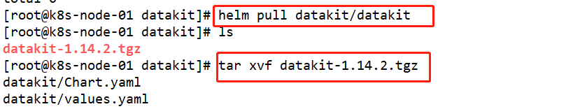
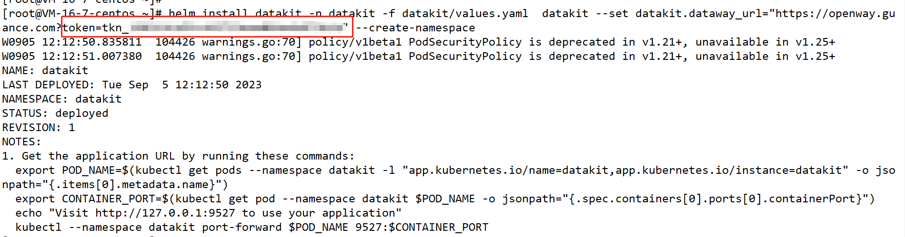
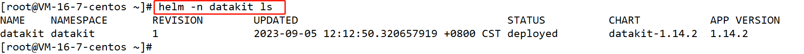
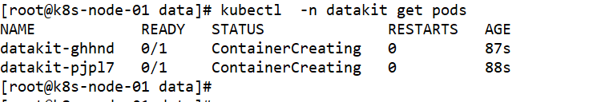

<!-- markdownlint-disable MD025 -->
# HUAWEI CLOUD CCE
<!-- markdownlint-enable -->

Guance supports monitoring the operational status and service capabilities of various resources in CCE, including Containers, Pods, Services, Deployments, Clusters, Nodes, Replica Sets, Jobs, Cron Jobs, and more. You can install DataKit in Kubernetes using the DaemonSet approach to enable data collection for Kubernetes resources. This allows you to monitor the real-time operational status of various Kubernetes resources in Observation Cloud.

## Config {#config}

### Preparation

- Create a Guance account
- Create a HUAWEI CLOUD CCE cluster

### Deployment

There are two methods to install DataKit in Kubernetes using the DaemonSet approach:

- Using Helm Chart
- Using YAML File

#### **Using Helm Chart**

##### **Preconditions**

- Kubernetes >= 1.14
- Helm >= 3.0+

##### 1. Add DataKit Helm repository

To install the DataKit collector using Helm, you need to first install Helm on your server. Once Helm is installed, you can add the DataKit Helm repository as below:

Into the Guance workspace, "Integrations - Datakit - Kubernetes(Helm)", follow this file to install DataKit Helm repository.

> Update the Helm repositories, it is necessary to run `helm repo update` to update the local repositories


##### 2. Download Datakit chart

```Bash
# download datakit chart
helm pull datakit/datakit
# unzip 
tar xvf datakit-1.14.2.tgz
```



##### 3. Customize installation parameters

Uncomment the ENV_NAMESPACE under extraEnvs to add the cluster name.

```YAML

extraEnvs:
#  - name: ENV_NAMESPACE # electoral
#    value: k8s

```

Modified:

```YAML
extraEnvs:
  - name: ENV_NAMESPACE # electoral
    value: cluster_name_k8s=hwcce-k8s
  - name: ENV_GLOBAL_ELECTION_TAGS
    value: cluster_name_k8s=hwcce-k8s
```

##### 4. Using Helm install Datakit

Modified the token in  `datakit.dataway_url` .

```Bash
helm install datakit -n datakit -f datakit/values.yaml  datakit --set datakit.dataway_url="https://openway.guance.com?token=tkn_1661b3cb5fc442719eae064edb979b5d" --create-namespace
```

You can obtain the token in Guance workspace, **cliek** "Integrations" - "Datakit"

Once you have obtained the token and replaced it, using helm install Datakit.



##### 5. View deployment status

After installing DataKit, you can use  `helm -n datakit ls` to check the deployment status using Helm:



<!-- markdownlint-disable MD013 -->
##### 6. Kubernetes Data View and Analyze
<!-- markdownlint-enable -->

The deployment status of DataKit is normal, and you can view and analyze the collected Kubernetes data in the "Infrastructure" > "Containers" section of the Observation Cloud workspace.

##### 7. Adding Dashboard

The Kubernetes data is successfully collected, you can create a new dashboard in the "Scenes" > "Dashboard" section of the Observation Cloud workspace. Search for "Kubernetes Monitoring View" and you will be able to see the following dashboard.

#### Using YAML file

##### 1. Download YAML file

To download the YAML files required for enabling Kubernetes resource collection, you need to log in to your server using a terminal tool and execute the following script command:

```Bash
wget https://static.guance.com/datakit/datakit.yaml
```


##### 2. Modify **datakit.yaml** file

To edit the configuration of the Dataway data gateway in the `datakit.yaml` file, replace the token value with the token associated with your workspace. You can find this token in the workspace settings or integration settings related to Dataway, Add an environment variable for the Kubernetes cluster name.

```YAML
        - name: ENV_DATAWAY
          value: https://openway.guance.com?token=<your-token> # Fill in dataway real address here
        - name: ENV_NAMESPACE
          value: cluster_name_k8s=hwcce-k8s
        - name: ENV_GLOBAL_ELECTION_TAGS
          value: cluster_name_k8s=hwcce-k8s
```

You can obtain the token in Guance workspace, **cliek** "Integrations" - "Datakit"

 Replaced the token in the `datakit.yaml` file


##### 3. Apply YAML File

Once you have made the necessary changes to the `datakit.yaml` file for the data gateway configuration, you can install the YAML file using the following command:


##### 4. View Datakit status

After installing the YAML file, a DaemonSet deployment named "**datakit**" will be created. You can use the following command to check the running status of the DataKit pods:



<!-- markdownlint-disable MD013 -->
##### 5. View and analyze the collected Kubernetes data with [Infrastructure - Container]
<!-- markdownlint-enable -->

##### 6. Adding Dashboard

The Kubernetes data is successfully collected, you can create a new dashboard in the "Scenes" > "Dashboard" section of the Observation Cloud workspace. Search for "Kubernetes Monitoring View" and you will be able to see the dashboard.
