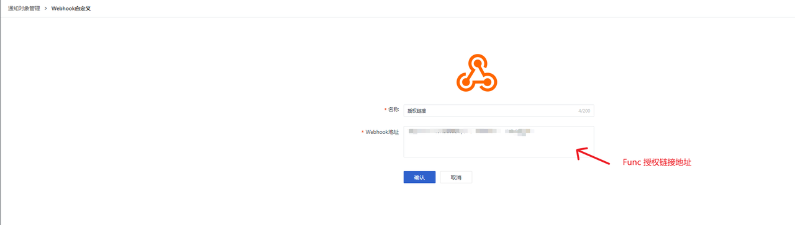
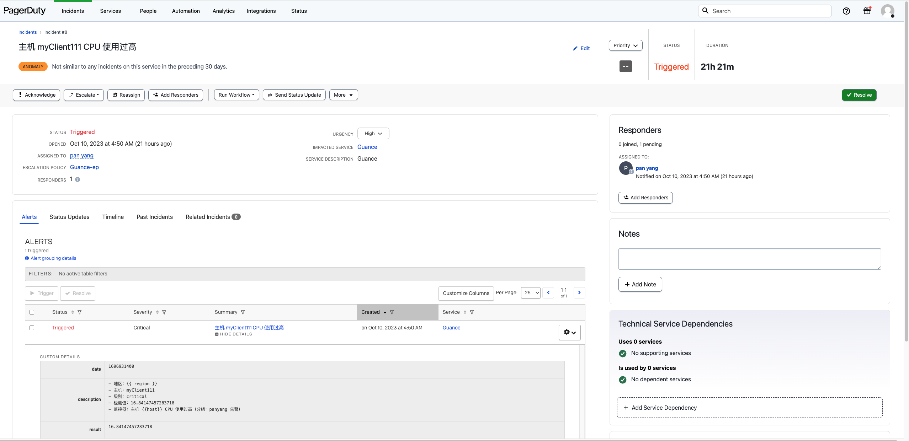

<!-- markdownlint-disable MD025 -->

# Incident Events Integration with PagerDuty
<!-- markdownlint-enable -->

When our applications or systems experience incidents, they typically need to be addressed promptly to ensure normal system operations. To better manage and track incident events, we can send these events to PagerDuty to create incidents, allowing us to track, analyze, and resolve these issues within PagerDuty. By quickly sending incident events to PagerDuty to create incidents, we gain better capabilities for managing and tracking incident events, thereby ensuring the normal operation of the system more effectively. Additionally, this method helps us better analyze and resolve problems, enhancing the stability and reliability of the system.

## Configuration {#config}

### Preparation

1. Deploy a [Dataflux Func Guance Special Edition](https://func.guance.com/#/) to generate an authorization link.
2. Create a [webhook custom notification target](https://docs.guance.com/monitoring/notify-object/#4-webhook) (the webhook URL should be the Func authorization link URL).
3. Properly configure [monitors](https://docs.guance.com/monitoring/monitor/).
4. In PagerDuty, create a **Service** with an **Integration** set to **Events API V2**.


### Deployment Process

#### Create a Webhook Custom Notification Target

In the Guance Studio under 【Monitoring / Notification Targets Management】, create a new notification target, select **Webhook Custom**, and fill in the webhook URL with the authorization link address of the deployed Dataflux Func.



> Note that in Func, choose the authorization link without parameters.

#### Create a Monitor

In the Guance Studio under 【Monitoring / Monitors】, create a new monitor, select the metrics you want to observe, and after configuring the notification content for the event, specify the notification target in the alert strategy as the name of the **Webhook Custom** notification target we just created.


#### Write the Listener Script

After configuring the detection rules for the monitor, we need to write a script in the already installed and configured Dataflux Func to retrieve new messages and send them to PagerDuty to create incidents.

First, we need to import some constants, such as `events_url`, `routing_key`, etc.

```Python
import requests
import json

events_url = "https://events.pagerduty.com/v2/enqueue"
routing_key = "xxxxxxxxxx"
```

After importing the necessary constants, we need to understand the data structure of the monitoring events so that we can parse and create incidents to send to PagerDuty.

```JSON
{
    "Result":100,
    "date":1693034940,
    "df_at_accounts":[

    ],
    "df_at_accounts_nodata":[

    ],
    "df_channels":[
        "chan_968577392a1c4714a464cd2f6ee42a9c"
    ],
    "df_check_range_end":1693034880,
    "df_check_range_start":1693034820,
    "df_date_range":60,
    "df_dimension_tags":"{\"host\":\"share\"}",
    "df_event_id":"event-f20a38aa58b54c6c8d4c9a84e655db1a",
    "df_event_link":"https://console.guance.com/keyevents/monitor?time=1693034040000%2C1693035000000&tags=%7B%22df_event_id%22%3A%22event-f20a38aa58b54c6c8d4c9a84e655db1a%22%7D&w=wksp_968577392a1c4714a464cd2f6ee42a9c",
    "df_event_reason":"\u6ee1\u8db3\u76d1\u63a7\u5668\u4e2d\u6545\u969c\u7684\u8ba4\u5b9a\u6761\u4ef6\uff0c\u4ea7\u751f\u6545\u969c\u4e8b\u4ef6",
    "df_exec_mode":"crontab",
    "df_issue_duration":3840,
    "df_issue_start_time":1693031100,
    "df_label":"[]",
    "df_language":"zh",
    "df_message":">\u7b49\u7ea7\uff1acritical    \n>\u5b9e\u4f8b\uff1ashare    \n>\u5185\u5bb9\uff1a\u78c1\u76d8\u4f7f\u7528\u7387\u4e3a 100.00%    \n>\u5efa\u8bae\uff1a\u767b\u5f55\u534e\u4e3a\u4e91\u63a7\u5236\u53f0\u67e5\u770b RDS \u662f\u5426\u6709\u5f02\u5e38",
    "df_monitor_checker":"custom_metric",
    "df_monitor_checker_event_ref":"13713ac25e993a37d2ca5899e2a7bba6",
    "df_monitor_checker_id":"rul_c439124e218f4c0c9cb114b5d04eeab4",
    "df_monitor_checker_name":"\u5b9e\u4f8b\u540d\u79f0\u4e3a {host} \u78c1\u76d8\u4f7f\u7528\u7387\u8fc7\u9ad8",
    "df_monitor_checker_ref":"aad7deb63b2e58b301f823517fea944d",
    "df_monitor_checker_sub":"check",
    "df_monitor_checker_value":"100",
    "df_monitor_id":"monitor_6774968876c14586bc5afc6d7144f52f",
    "df_monitor_name":"\u9ed8\u8ba4",
    "df_monitor_type":"custom",
    "df_site_name":"\u4e2d\u56fd\u533a1\uff08\u676d\u5dde\uff09",
    "df_source":"monitor",
    "df_status":"critical",
    "df_sub_status":"critical",
    "df_title":"\u5b9e\u4f8b\u540d\u79f0\u4e3a share \u78c1\u76d8\u4f7f\u7528\u7387\u8fc7\u9ad8",
    "df_workspace_name":"observer",
    "df_workspace_uuid":"wksp_968577392a1c4714a464cd2f6ee42a9c",
    "host":"share",
    "timestamp":1693034940,
    "workspace_name":"observer",
    "workspace_uuid":"wksp_968577392a1c4714a464cd2f6ee42a9c"
}
```

This **Json** contains information we need such as the event title `df_title`, event details `df_message`, and event status `df_status`. Of course, this **Json** also includes other relevant information like event generation time, abnormal values, workspace ID, etc., which can be added into the events we need to create if required.

After clarifying the input data structure, we can now write the function to create PagerDuty incidents.

```Python
@DFF.API('Create_PagerDuty_Issue_Reply')
def create_pagerduty_issue_reply(**kwargs):
    # Get Guance event data
    event = json.dumps(kwargs)
    print("Guance_event:", event)
    summary  = kwargs["df_title"]
    description = kwargs["df_message"]
    serverity = kwargs["df_status"]
    df_event_link = kwargs["df_event_link"]
    workspace_name = kwargs["workspace_name"]
    result = kwargs["Result"]
    date = kwargs["date"]
    # Build request data
    headers = {
        "Content-Type": "application/json",
        "Accept": "application/vnd.pagerduty+json;version=2",
    }

    payload = {
        "routing_key": routing_key,
        "event_action": "trigger",
        "payload": {
            "summary": summary,
            "source": "monitoringtool:cloudvendor:central-region-dc-01:852559987:cluster/api-stats-prod-003",
            "severity": serverity,
            "custom_details": {
                "result": result,
                "date": date,
                "description": description
            }
        },
        "client": "Guance" + workspace_name,
        "client_url": df_event_link
    }
    # Create the incident
    response = requests.post(events_url, headers=headers, data=json.dumps(payload))
    # Print the new incident
    print(response.status_code)
    print(response.text)
```

We create PagerDuty incidents by constructing event dictionaries from the details obtained from Guance. After successfully sending the event, logs will include `dedup_key` and `status` information.


Then, we can view the corresponding alert information in PagerDuty and emails.



You can also receive alert notifications via email configured in PagerDuty.


After writing the script, click Publish to proceed.