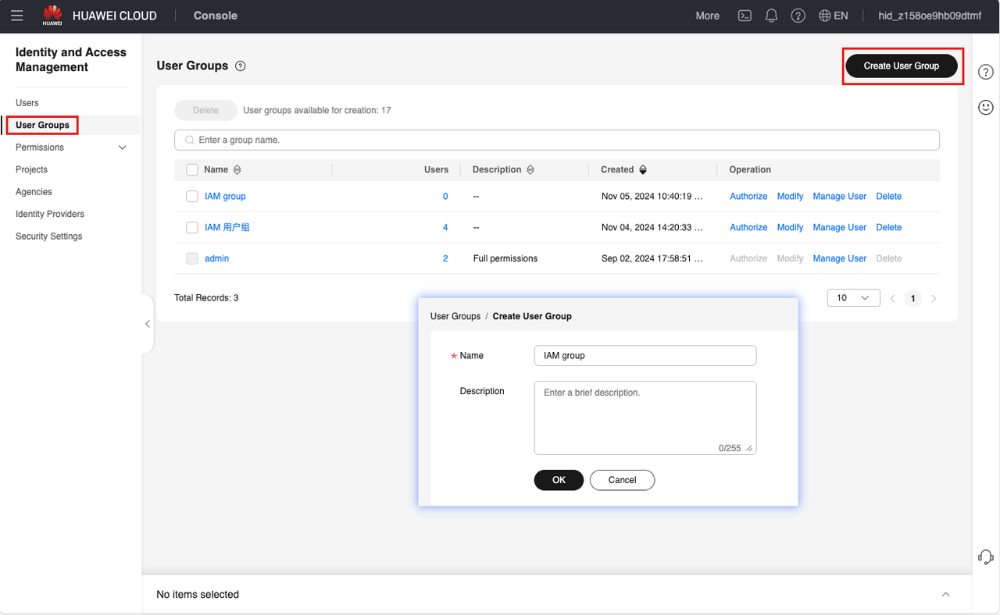
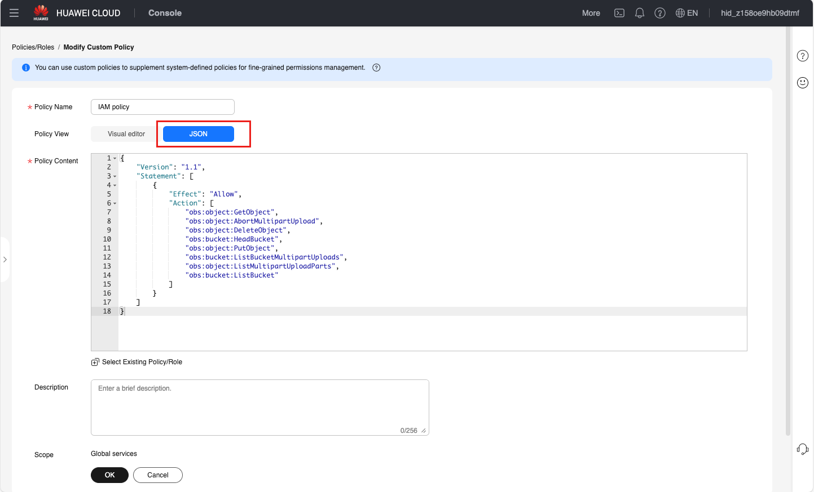
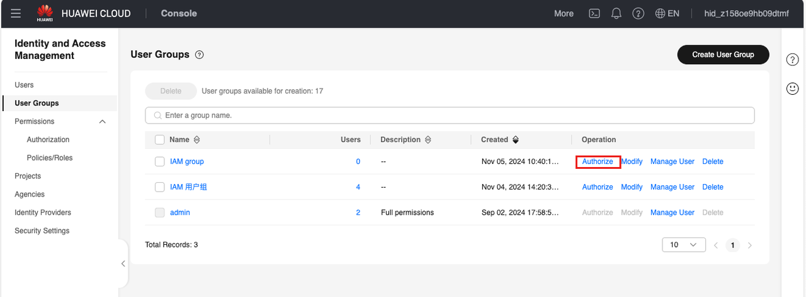
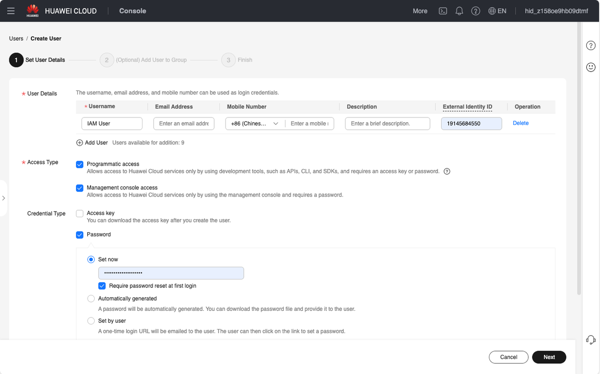
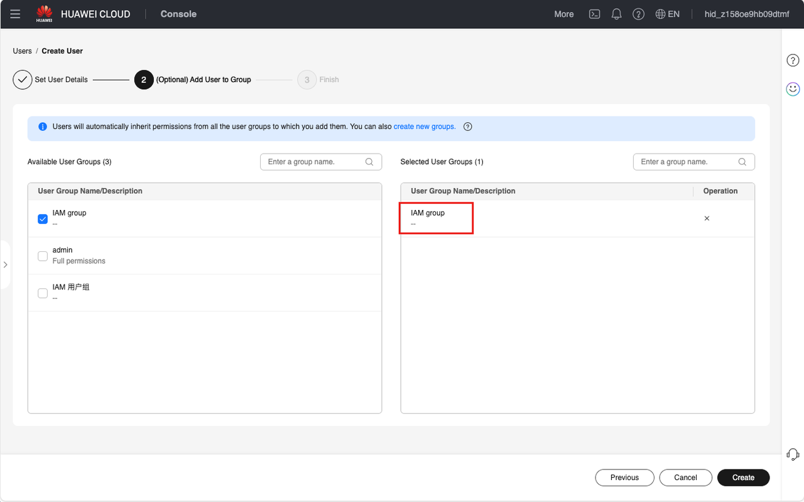

# Configure Guance IAM Policy in HUAWEI CLOUD

Huawei Cloud's permission management strategy takes "user group" as the basic permission unit, that is, create a user group, associate the user group with permission sets and accounts, and then add users to the user group, so that all users under the user group can obtain corresponding permissions. 

I. Log in to the console, hover the account in the upper right corner with the mouse, and click "Identity and Access Management". 


In the left menu click on "User Groups" and create a user group.




II. To create a custom policy, click Create Custom Policy at "Permissions > Policies/Roles". 

And select the json view configuration method and paste the json content provided here.


```
{
    "Version": "1.1",
    "Statement": [
        {
            "Effect": "Allow",
            "Action": [
                "obs:object:GetObject",
                "obs:object:AbortMultipartUpload",
                "obs:object:DeleteObject",
                "obs:bucket:HeadBucket",
                "obs:object:PutObject",
                "obs:bucket:ListBucketMultipartUploads",
                "obs:object:ListMultipartUploadParts",
                "obs:bucket:ListBucket"
            ]
        }
    ]
}
```





III. Authorize the user group and select the custom policy created in step 2. 

**Note**: You need to wait 15-30 minutes after authorization before it takes effect.




IV. Create a user and add this user to the user group with corresponding permissions.


4.1 Fill in user name and other required fields ("Access Key" must be checked)




4.2 Join the user group created in the first step 

**Note**: If a user is associated with multiple user groups at the same time, the user's permission is the union of all user group permission policies. 



4.3 After the user successfully creates it, the access key can be downloaded in the pop-up box. 


**Note**: This key can only be downloaded once. If you click Cancel, you will not be able to view/download this key later. You can add up to 2 additional access keys in Users > Security Settings.

