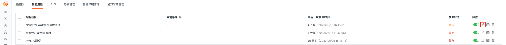
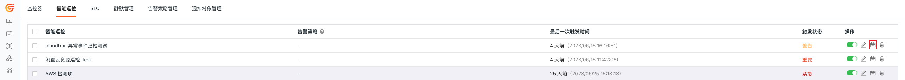
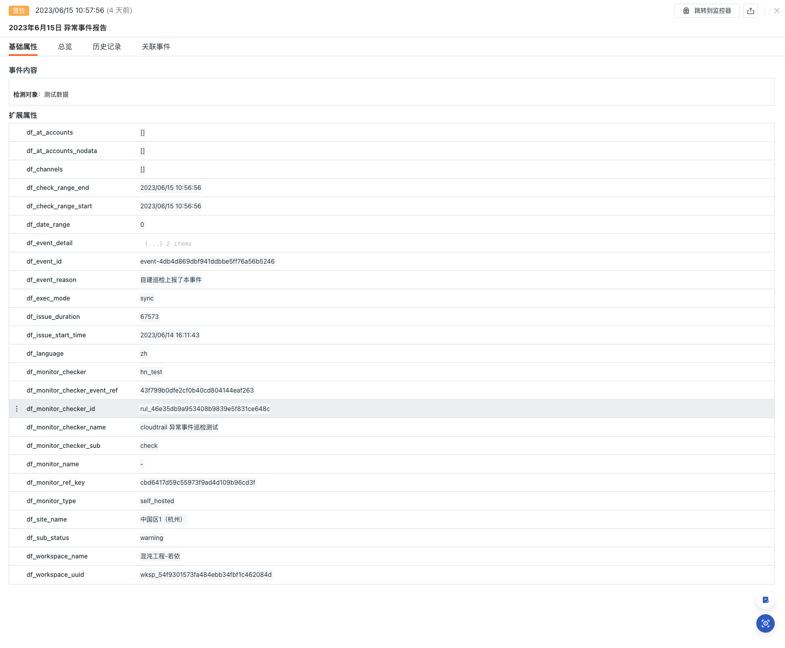
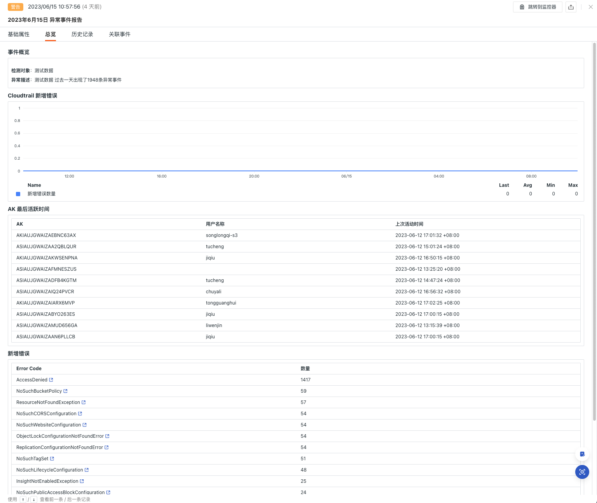
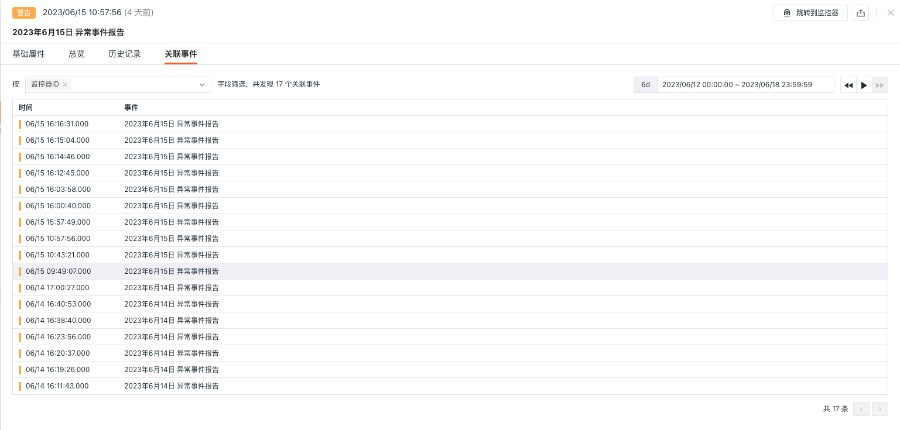

# AWS CloudTrail Anomaly Detection

---

## Background

AWS CloudTrail is a service used for tracking, logging, and monitoring activities within an AWS account. It records operations performed in the AWS account, including management console access, API calls, resource changes, etc. By monitoring error events in CloudTrail, potential security issues can be identified promptly. For example, unauthorized API calls, denied resource access, abnormal authentication attempts, etc. This helps protect your AWS account and resources from unauthorized access and malicious activities; it also provides insights into the types, frequency, and impact of failures in the system. This helps you quickly identify issues and take appropriate corrective actions to minimize service disruptions and business impacts.

## Prerequisites

1. Set up [DataFlux Func <<< custom_key.brand_name >>> Special Edition](https://func.guance.com/#/) or activate [DataFlux Func (Automata)](../../dataflux-func/index.md)
2. Create an [API Key](../../management/api-key/open-api.md) for performing operations in <<< custom_key.brand_name >>> under "Management / API Key Management"

> **Note**: If considering using a cloud server for offline deployment of DataFlux Func, please ensure it is deployed with the same operator and region as the current <<< custom_key.brand_name >>> SaaS deployment [same operator, same region](../../../getting-started/necessary-for-beginners/select-site/).

## Enable Inspection

In the self-hosted DataFlux Func, install "<<< custom_key.brand_name >>> Self-hosted Inspection (AWS CloudTrail Anomaly Detection)" via the "Script Market" and configure the <<< custom_key.brand_name >>> API Key to complete the setup.

Select the inspection scenario you want to enable from the DataFlux Func Script Market, click Install, configure the <<< custom_key.brand_name >>> API Key and [GuanceNode](https://func.guance.com/doc/script-market-guance-monitor-connect-to-other-guance-node/), then choose to deploy and start the script.

> Note: First, configure CloudWatchLogs collection for CloudTrail on AWS, then enable the "<<< custom_key.brand_name >>> Integration (AWS-CloudWatchLogs)" in Func.


After successfully deploying the startup script, it will automatically create and configure the startup script and automatic trigger settings. You can directly jump to view the corresponding configuration via the link.


## Configure Inspection

Configure the inspection conditions you wish to filter in the intelligent inspection module of <<< custom_key.brand_name >>> Studio or the startup script automatically created by DataFlux Func. Refer to the following two configuration methods:

### Configuration in <<< custom_key.brand_name >>>

  

#### Enable/Disable

AWS CloudTrail anomaly detection is enabled by default. You can manually disable it. Once enabled, it will inspect the configured cloud accounts.

#### Edit

The "AWS CloudTrail Anomaly Detection" intelligent inspection supports manual addition of filtering conditions. Click the **Edit** button under the operation menu on the right side of the intelligent inspection list to edit the inspection template.

* Filtering Conditions: Configure the names of the log groups (CloudWatchLogs collected log group names) that need to be inspected.
* Alert Notifications: Supports selecting and editing alert strategies, including event severity levels, notification targets, and alert silence periods.

Click Edit in the configuration entry parameters, fill in the corresponding detection object in the parameter configuration, and save to start the inspection:

  

Refer to the following configuration:

  ```json
   // Configuration Example:
      configs Configuration Example:
          source1
          source2
          source3
  ```

## View Events

Intelligent inspection based on <<< custom_key.brand_name >>> inspection algorithms will look for anomalies in AWS CloudTrail. When anomalies are detected, intelligent inspections generate corresponding events. Click the **View Related Events** button under the operation menu on the right side of the intelligent inspection list to view the corresponding anomaly events.



### Event Details Page

Click **Event** to view the details page of the intelligent inspection event, including event status, time of anomaly occurrence, anomaly name, basic attributes, event details, alert notifications, history, and related events.

* Click the small icon "View Monitor Configuration" in the upper-right corner of the details page to view and edit the current intelligent inspection configuration details.

#### Basic Attributes

* Detection Dimensions: Based on the configured filtering conditions of the intelligent inspection, it supports copying `key/value` pairs, adding filters, and viewing related logs, containers, processes, security checks, traces, user analysis, synthetic tests, and CI data.
* Extended Attributes: After selecting extended attributes, it supports copying in `key/value` format and forward/reverse filtering.

  

#### Event Details

* Event Overview: Describes the object and content of the anomaly inspection event.
* Cloudtrail: The number of new error events in the current cloud account.
* AK Last Active Time: The last active time of the AK in the current cloud account.
* New Errors: Clusters of new error events in the current cloud account, which can be navigated to the corresponding event details.



#### History

Supports viewing the detection object, anomaly/recovery times, and duration.

 

#### Related Events

Supports viewing related events through filtering fields and selected time component information.

  

## Common Issues

**1. How to configure the detection frequency of AWS CloudTrail anomaly detection**

In the self-hosted DataFlux Func, when writing the custom inspection processing function, add `fixed_crontab='0 * * * *', timeout=900` in the decorator, then configure it in "Management / Automatic Trigger Configuration".

**2. Why might there be no anomaly analysis during AWS CloudTrail anomaly detection**

When there is no anomaly analysis in the inspection report, check if the preceding collector in Func has data.

**3. Under what circumstances will AWS CloudTrail anomaly detection events occur**

When new anomaly events appear within the past hour.

**4. What to do if previously normal scripts encounter errors during inspection**

Update the referenced script set in the DataFlux Func Script Market. You can check the update records of the script market via the [**Change Log**](https://func.guance.com/doc/script-market-guance-changelog/) for timely updates.

**5. During script upgrade, why does the Startup script set remain unchanged**

First delete the corresponding script set, then click the Upgrade button to configure the corresponding <<< custom_key.brand_name >>> API key to complete the upgrade.

**6. How to determine if the inspection is effective after enabling**

Check the inspection status in "Management / Automatic Trigger Configuration". The status should be enabled first, and you can validate the inspection script by clicking Execute. If it shows "Executed Successfully xxx minutes ago," the inspection is running normally and effectively.