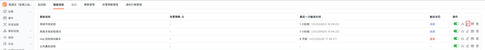
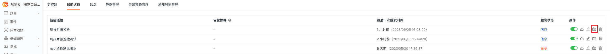
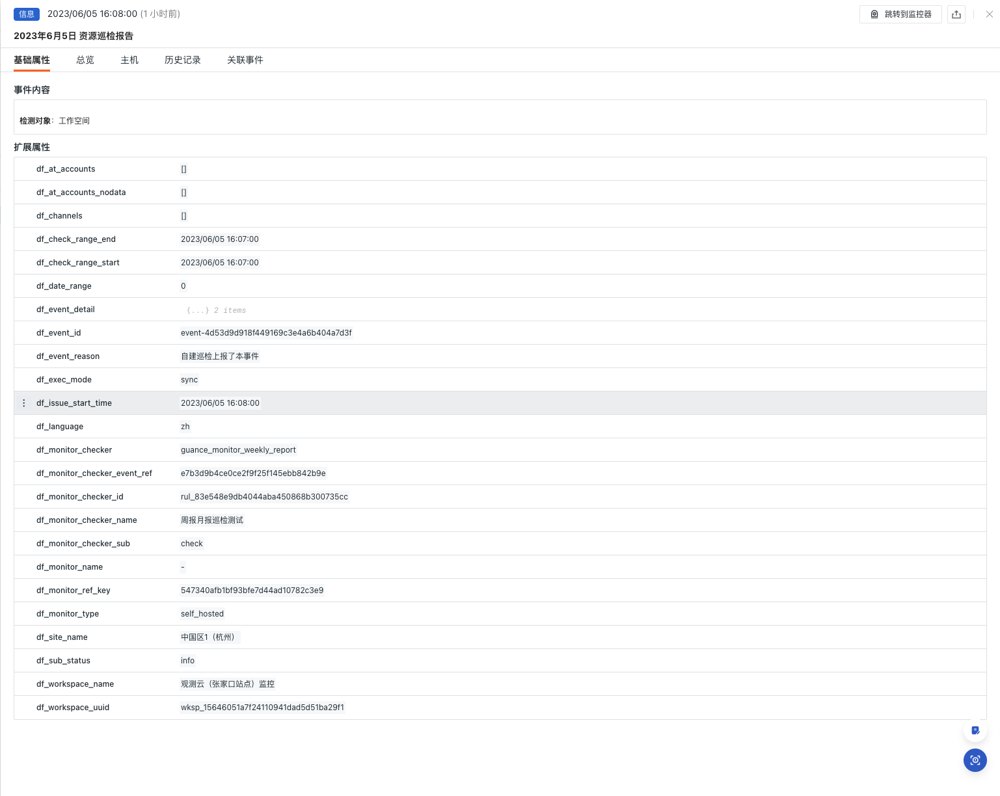
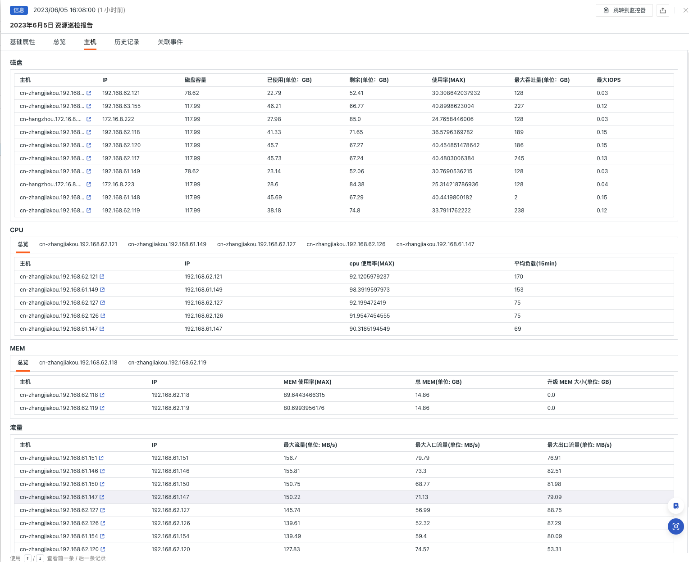
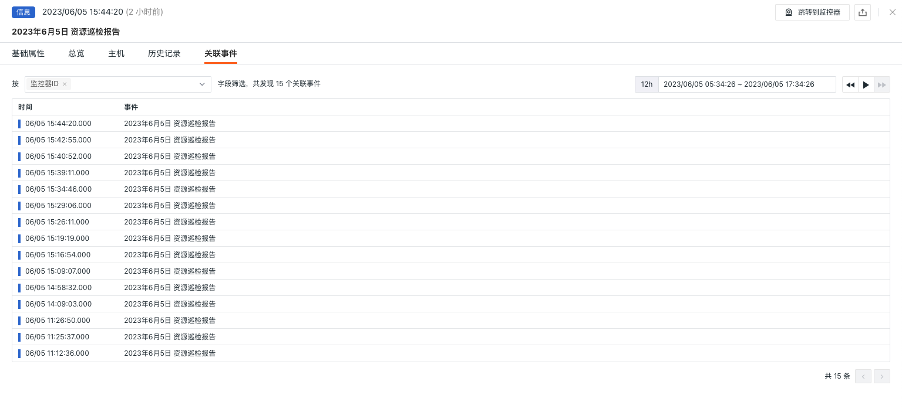

# Workspace Asset Inspection

---

## Background

Service inspections should ensure that services are operating normally, promptly identify faults or anomalies to minimize business losses. Additionally, inspections help improve service availability and stability by discovering and resolving potential issues. They also enhance operations efficiency, accelerate problem diagnosis and resolution, optimize resource allocation, and ensure business security. By conducting regular inspections of hosts, K8s, containers, and other services, operations personnel can ensure these services efficiently and stably support business operations, providing a continuously reliable environment for enterprises.

## Prerequisites

1. Self-host [DataFlux Func <<< custom_key.brand_name >>> Special Edition](https://<<< custom_key.func_domain >>>/#/) or activate [DataFlux Func (Automata)](../../dataflux-func/index.md)
2. In <<< custom_key.brand_name >>> "Management / API Key Management," create an [API Key](../../management/api-key/open-api.md) for performing operations

> **Note**: If you plan to use a cloud server for offline deployment of DataFlux Func, consider deploying it with the current used <<< custom_key.brand_name >>> SaaS in [the same provider and region](../../../getting-started/necessary-for-beginners/select-site/).

## Enabling Inspections

In your self-hosted DataFlux Func, install the "<<< custom_key.brand_name >>> Self-built Inspection (Weekly/Monthly Report)" via the "Script Market" and configure the <<< custom_key.brand_name >>> API Key to enable it.

Select the inspection scenario you want to enable from the DataFlux Func Script Market, click Install, configure the <<< custom_key.brand_name >>> API Key and [GuanceNode](https://<<< custom_key.func_domain >>>/doc/script-market-guance-monitor-connect-to-other-guance-node/), then choose to deploy and start the script.


After successfully deploying the startup script, it will automatically create the startup script and auto-trigger configuration, which you can directly access via the provided link.


## Configuring Inspections

Configure the inspection filters you want either in the <<< custom_key.brand_name >>> Studio under Monitoring - Intelligent Inspection or in the startup script automatically created by DataFlux Func. Refer to the two configuration methods below:

### Configuring Inspections in <<< custom_key.brand_name >>>



#### Enable/Disable

The workspace asset inspection is enabled by default. You can manually disable it. Once enabled, it will inspect the configured list of hosts.

#### Editing

Intelligent inspection "Workspace Asset Inspection" supports users adding filter conditions manually. Click the **Edit** button in the operation menu on the right side of the intelligent inspection list to edit the inspection template.

* Filter Conditions: Configure the report period for inspection. Currently, only 7 days and 30 days are supported.
* Alert Notifications: Supports selecting and editing alert strategies, including event severity levels, notification targets, and alert silence periods.

Click Edit to enter the parameter configuration and fill in the corresponding detection object, then save and start the inspection:


You can refer to the following configuration example:

```
configs Configuration example:
          7
```

> **Note**: When writing self-built inspection handling functions in your self-hosted DataFlux Func, you can also add filtering conditions (refer to sample code configuration). Note that parameters configured in <<< custom_key.brand_name >>> Studio will override those set in the self-built inspection handling function.

### Configuring Inspections in DataFlux Func

In DataFlux Func, after configuring the required filtering conditions for inspection, you can test by clicking the `run()` method directly on the page. After clicking Publish, the script will run normally. You can also view or modify configurations in <<< custom_key.brand_name >>> "Monitoring / Intelligent Inspection."

```python
# Please fill in the following configuration according to the actual situation

# Guance API key
account = {
    "api_key_id": "<Guance API key ID>",
    "api_key": "<Guance API key>",
    "guance_node": "<Guance Node [About Guance Node](https://<<< custom_key.func_domain >>>/doc/script-market-guance-monitor-connect-to-other-guance-node/)>"
}

# Hosts that do not need to be checked
# Example:
#         no_check_host = ['192.168.0.1', '192.168.0.1']
no_check_host = []

###### Do not modify the following content #####
from guance_monitor__register import self_hosted_monitor
from guance_monitor__runner import Runner
import guance_monitor_weekly_report__main as main


@self_hosted_monitor(account['api_key_id'], account['api_key'], account['guance_node'])
@DFF.API('Workspace asset inspection', fixed_crontab='* * */7 * *', timeout=900)
# @DFF.API('Workspace asset inspection', fixed_crontab='* * */30 * *', timeout=900)
def run(configs=None):
    '''
    en:
        title: Workspace asset inspection
        doc: |
            parameters:
                configs :
                    Set the detection period to seven days or thirty days (optional. If this parameter is not configured, the detection period is seven days by default).

                configs Configuration example：
                    7
    '''

    checkers = [
        main.WeeklyreportEventStruct(configs=configs, no_check_host=no_check_host),
    ]

    Runner(checkers).run()
```

## Viewing Events

This inspection scans the asset information within the workspace over the past 7 or 30 days. Intelligent inspections aggregate 7-day or 30-day asset reports. In the intelligent inspection list's operation menu on the right side, click the **View Related Events** button to view the corresponding events.



### Event Details Page

Click **Event** to view the details page of the intelligent inspection event, including event status, anomaly occurrence time, anomaly name, basic attributes, event details, alert notifications, history records, and related events.

* Click the small icon "View Monitor Configuration" in the top-right corner of the details page to view and edit the current intelligent inspection configuration details.

#### Basic Attributes

* Detection Dimensions: Based on the configured filter conditions of intelligent inspections, you can copy `key/value`, add to filters, and view related logs, containers, processes, security checks, traces, user analysis, synthetic tests, and CI data.
* Extended Attributes: Select extended attributes to copy in `key/value` format, and perform forward/reverse filtering.



#### Event Details

##### Overview

* Overview: Displays an overview of the resources in the current workspace, including total host count, container count, etc.
* Cloud Vendor Host Distribution: View the distribution of cloud vendors in the current workspace assets.
* Regional Host Distribution: View the geographical distribution of hosts in the current workspace assets.
* Operating System Host Distribution: View the operating system distribution of hosts in the current workspace assets.
* Restarted Pods: View the situation of abnormally restarted Pods in the current workspace and jump to the corresponding log details for further investigation.


##### Hosts

* Disk: Displays detailed disk information for resources in the current workspace.
* CPU: Displays detailed CPU usage information for resources in the current workspace and shows process details for top hosts.
* MEM: Displays detailed memory usage information for resources in the current workspace and shows process details for top hosts.
* Traffic: Displays detailed traffic information for resources in the current workspace.



#### History Records

Supports viewing detected objects, anomaly/recovery times, and duration.


#### Related Events

Supports viewing related events through filtered fields and selected time component information.



## Common Issues

**1. How to configure the inspection frequency for workspace asset inspections**

To enable monthly inspections, change the decorator parameter in the automatically created inspection handler function to `fixed_crontab='* * */30 * *', timeout=900`, then configure it in "Management / Auto-Trigger Configuration."

**2. Why might there be no anomaly analysis when workspace asset inspections trigger**

If there is no anomaly analysis in the inspection report, check the current `datakit` data collection status.

**3. Why might previously running scripts fail during inspection**

Update the referenced script sets in the DataFlux Func Script Market. You can view the update records via the [**Change Log**](https://<<< custom_key.func_domain >>>/doc/script-market-guance-changelog/) to facilitate timely updates to the scripts.

**4. Why might the corresponding script set remain unchanged during inspection script upgrades**

First, delete the corresponding script set, then click the upgrade button and configure the <<< custom_key.brand_name >>> API Key to complete the upgrade.

**5. How to determine if the inspection has taken effect after enabling it**

Check the inspection status in "Management / Auto-Trigger Configuration." The status should be enabled, and you can verify the inspection script by clicking Execute. If it shows "Executed Successfully xx minutes ago," the inspection is running normally and effectively.