# Release Notes (2021)
---

This document records the update content of each online release of <<< custom_key.brand_name >>>, including DataKit, <<< custom_key.brand_name >>> best practices, <<< custom_key.brand_name >>> integration documentation, and <<< custom_key.brand_name >>>.

## December 30, 2021

#### Optimized Binding to Built-in Views

"<<< custom_key.brand_name >>>" supports associating built-in views with different link services, applications, log sources, projects, etc., by binding fields. Based on the bound fields, you can view the associated built-in views (system views, user views) on the corresponding Explorer detail pages. Supported Explorers include custom scenario Explorers, infrastructure, logs, links, user visits, security checks, availability, etc.

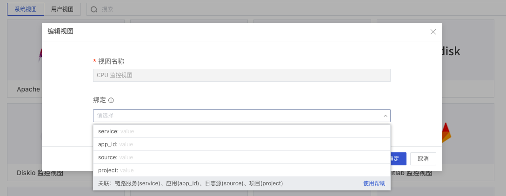

#### Optimized Log Explorer

- In the Log Explorer, the left-hand source list is expanded by default upon first login, which can be manually collapsed; the Explorer will remember the last state by default.
- In the Log Explorer, click the settings button on the left to manually add filter fields for quick filtering.
- In the log data list, you can "hover" over the log content with your mouse to expand and view all the log content. Clicking the "copy" button copies the entire log content to the clipboard. When expanding, if possible, the system will format the log JSON; otherwise, it displays the log content normally.

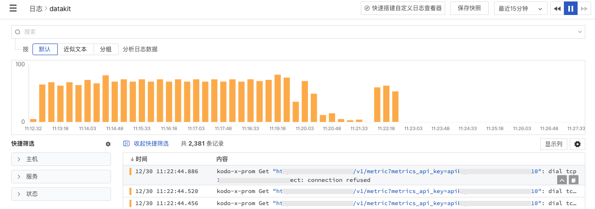

#### Optimized Associated Display on Explorer Detail Pages

The associated display has been optimized on the detail pages of the Log Explorer, Infrastructure Explorer, Link Explorer, Security Check Explorer. This includes related queries for hosts, Metrics, links, containers, Pods, etc. Two types of associated displays are supported: fixed display and non-fixed display (displayed based on whether the associated field is included).

Take the Log Explorer detail page as an example, the associated fields are respectively "host". To view related hosts in the log details, the field "host" must match; otherwise, the relevant host page cannot be viewed in the log details. After field matching, under the associated host, you can view the basic information and performance status of the host.

- Attribute View: Includes basic information about the host, integration operation status. If cloud host collection is enabled, cloud vendor information can also be viewed.

- Metric View: You can view the CPU, memory, etc., performance Metric views of related hosts within the default 15 minutes. Click «Open this view» to the built-in view, where you can customize and modify the host view through cloning and save it as a user view, which can be viewed via binding on the log details page.

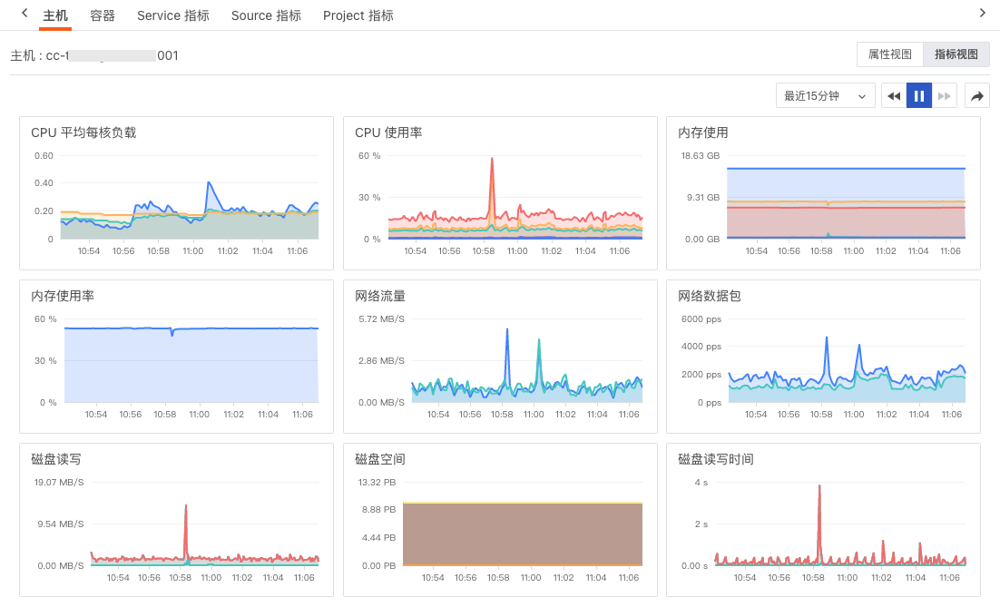

#### Optimized Snapshot Sharing

Snapshot sharing supports hiding the top bar on the shared page. In the snapshot list, clicking the share button allows advanced settings such as "hide top bar" in the pop-up dialog box.

#### Optimized Table Query Results Showing Thousandths Place

<<< custom_key.brand_name >>> dashboard chart query results support automatically adding thousandths place formatting. If a unit is set, the data format follows the set unit, which can be previewed after completion.

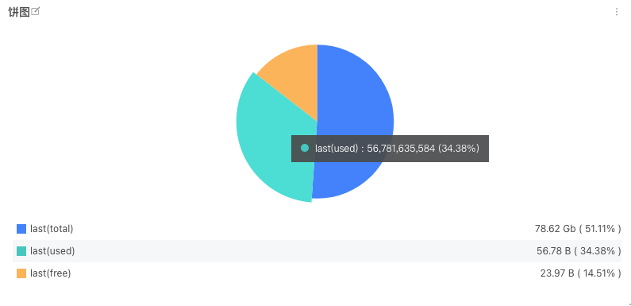

#### Other Optimized Features

- Improved performance of host network topology queries, added target domain name display in network topology nodes. That is, if the target host is not in the current workspace but the target domain exists and the port number is less than 10,000, the target domain will be displayed in the topology.
- Improved logic for favoriting dashboards, notebooks:
   - Unfavorited dashboards are sorted in reverse chronological order by creation time
   - Favorited dashboards are sorted in reverse chronological order by favorite time
   - Favorited dashboards are displayed above unfavorited dashboards
- Improved cascading query logic for view variables, i.e., when two variables are linked, selecting `*` for the previous one does not filter the linked variable, showing all value options.
- Improved left-side collapsible navigation bar, adding help documentation links to the navigation bar.

## December 16, 2021

#### Added Time-Series Similarity Metric Queries

In the time-series analysis mode, you can select "chart queries" for trend lines/columns in metric queries and "view similar trend metrics." By selecting an absolute time range, you can query similar metric trends within that space.

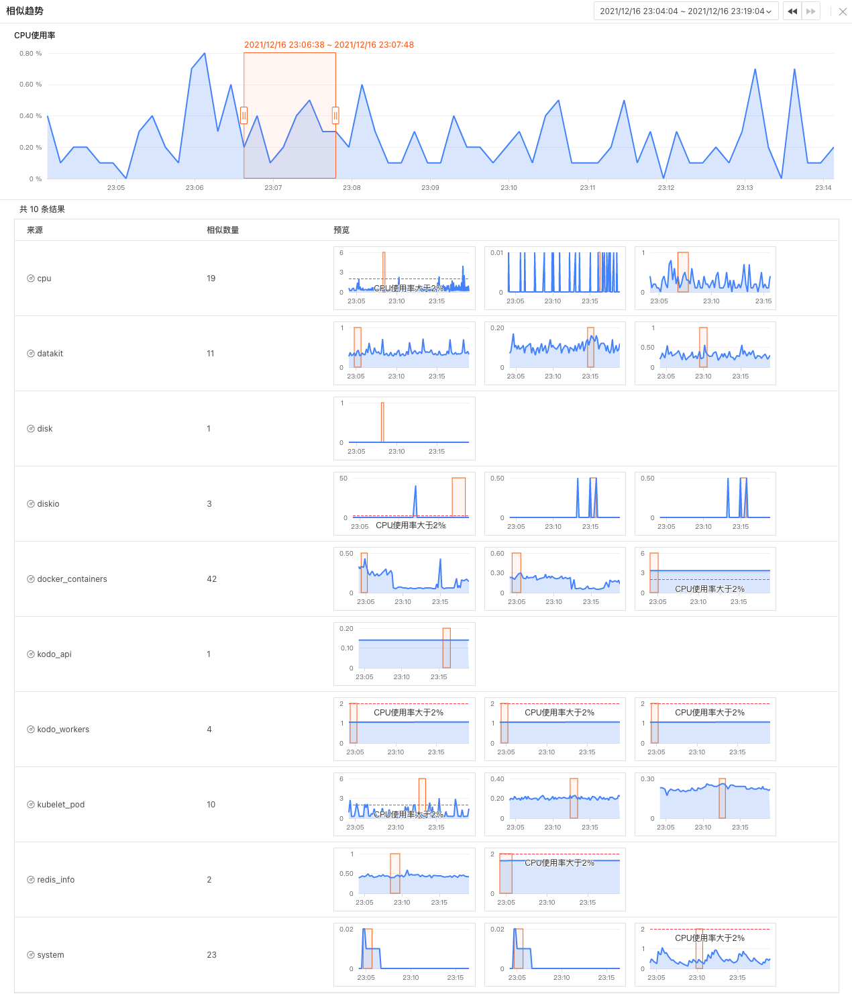

#### Added Related Data Statistics Display on Explorer Detail Pages

Added statistics display for related logs, links, containers, etc., on Explorer detail pages. Supports directly obtaining statistical data from the tab titles on Explorer detail pages, including infrastructure, logs, application performance, user visits, security checks, etc.

#### Added Export Functionality for Explorer Charts

<<< custom_key.brand_name >>> supports exporting any charts from the <<< custom_key.brand_name >>> space Explorer to dashboards, notebooks, or clipboard.

#### Added Match Search in Explorer

<<< custom_key.brand_name >>> supports wildcard searches in the Explorer search bar using formats like "host:cc*" for fields such as filtering logs from hosts with naming prefixes. A "delete" button has also been added on the right side of the Explorer search bar for one-click deletion of text input.

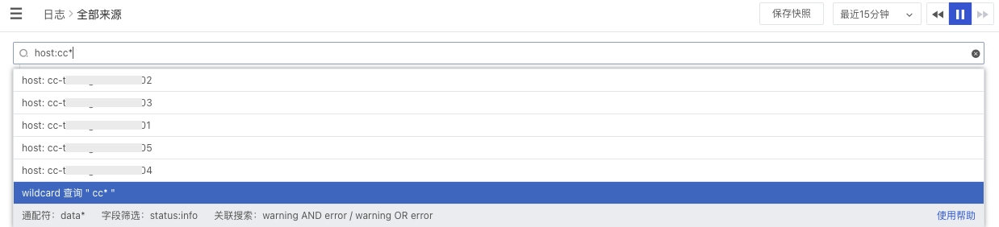

#### Optimized Log Explorer and Related Data Queries

- Through the "container" section below the log details page, you can view all container (CONTAINERS) data related to the host within the last ten minutes.
- Logs, link, and CONTAINER data related to the log details page support filtering by "trace_id" or "host".
- The content display on the log details page supports both Json and text viewing modes, automatically displaying formats based on message type.
- Through the approximate text Explorer, you can view detailed logs associated with Pattern clustering.
- Removed color tips on hover in the Log Explorer.

#### Optimized Mute Strategy, Supporting Mute Settings for Monitors

<<< custom_key.brand_name >>> supports users managing all mute rules for the current space through "Mute Management" in the "Monitoring" feature. <<< custom_key.brand_name >>> provides three types of mute settings: host mute, monitor mute, group mute, supporting mute management for different hosts, monitors, and groups, ensuring that mute objects do not send alert notifications to any notification targets during the mute period.

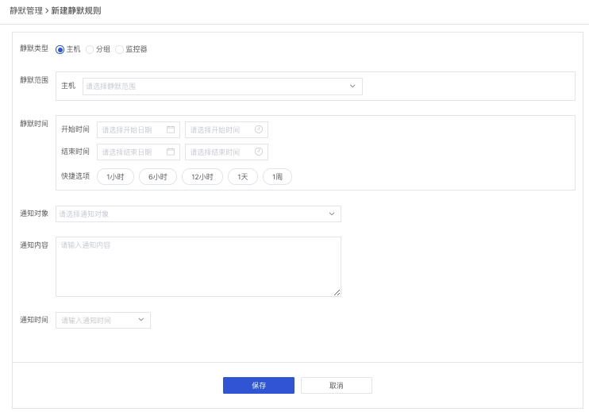

#### Optimized Monitor Management

Duplicate monitors in the monitor list can affect users' quick location of monitoring objects. <<< custom_key.brand_name >>> supports choosing whether to create duplicate monitors from templates. Additionally, users can use the new "Batch Management" tool to customize export/deletion of monitors.

#### Optimized View Variable Query Display

- Dashboard view variables have added default values, supporting previewing all current view variables and selecting initial variables to view by default on the dashboard.
- Supports adjusting the order of view variables by dragging them with the mouse (hover).
- Removed the "Settings" button for view variables, allowing direct use of "Sort", "Hide", and "Delete" functions within the view variable list.

#### Optimized Lock Time Setting for Dashboards and Notebooks

<<< custom_key.brand_name >>> supports adding a "More" option in lock time settings for dashboards and notebooks to customize lock time ranges. After this optimization, the lock time component and chart component functionalities remain consistent.

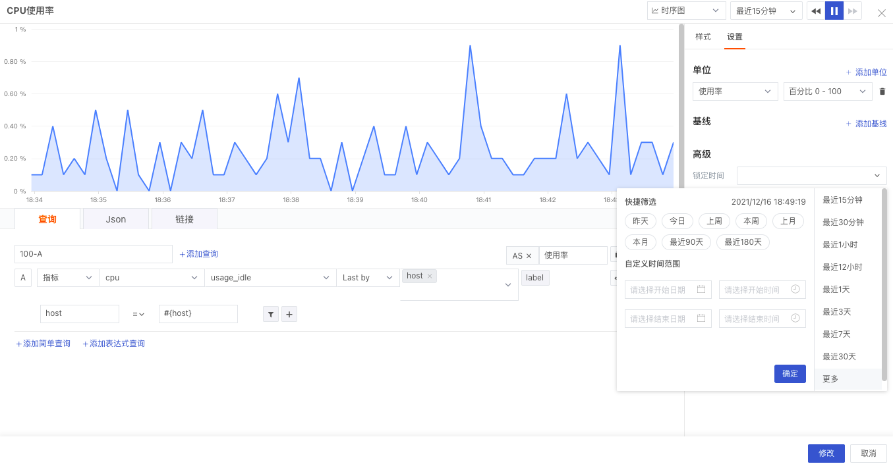

#### Optimized Help Center Page Entry 

In <<< custom_key.brand_name >>> Help Center, you can quickly view product documentation, updates, blogs, live stream reviews, and more. You can join the official service group of <<< custom_key.brand_name >>> by scanning a code.

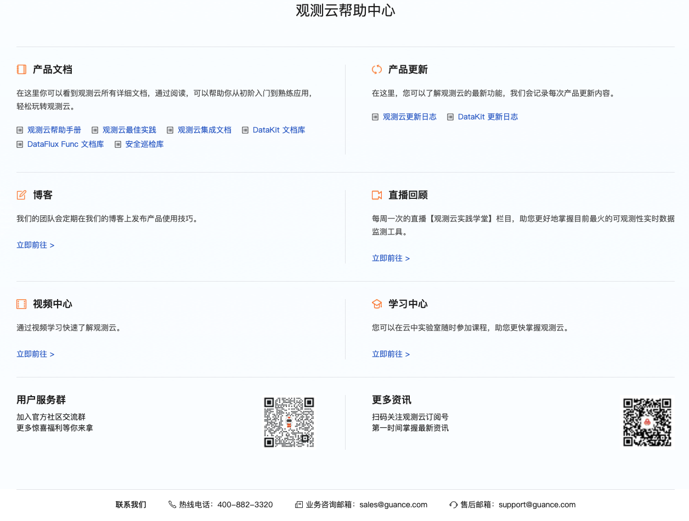

## December 2, 2021

#### Added Owner Member Role

<<< custom_key.brand_name >>> has added an owner role for the current workspace. Currently, four workspace member permissions are supported: "Owner", "Administrator", "Standard Member", and "Read-only Member". These roles constrain management permissions, configuration permissions, operation permissions, and browsing permissions for different member categories. The "Owner" role has the highest operation permissions and can designate "Administrators" and perform any management, configuration, operations, and data browsing. In <<< custom_key.brand_name >>> workspace's «Management»-«Member Management»-«Edit», you can edit and update member permissions.

#### Scene Added Custom Explorer

"<<< custom_key.brand_name >>>" provides an Explorer in scenes that can be quickly built based on log data ranges, supporting workspace members to collaboratively build Explorers based on custom scenarios for customized viewing needs. Completed "Explorers" can be exported and shared with others, sharing Explorer templates.

#### Added Export User View to Dashboard

"<<< custom_key.brand_name >>>" supports exporting created user views from the «Built-in Views» to a json file, which can be used for importing into different workspace scenarios or built-in views.

#### Optimized Host Network Observability, Added Network Flow Data List View

"<<< custom_key.brand_name >>>" supports viewing different visual charts based on selected protocols on the «Network» page of the infrastructure «Host» details, and customizing the displayed fields for network flow data lists.

By clicking «View Network Flow Data», you can view the network flow data for the last two days by default, including time, source IP/port, destination IP/port, source host, transmission direction, protocol, bytes sent, etc. Customizable display fields or adding filter conditions to filter all string-type keyword fields are supported.

#### Added sourcemap Function

When releasing applications in production environments, to prevent issues such as code leakage, files are generally transformed and compressed during the packaging process. While these measures ensure code security, they also result in collected error stack trace information being obfuscated, making it difficult to directly locate problems, thus complicating subsequent bug fixes.

To address the above issues, "<<< custom_key.brand_name >>>" provides sourcemap functionality for Web applications, supporting the de-obfuscation of code for easier error localization and helping users resolve issues faster.

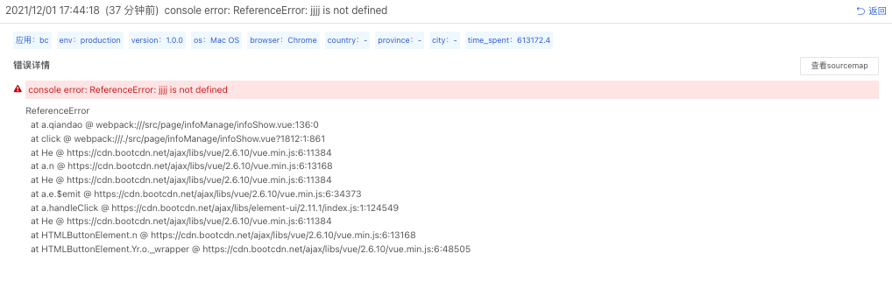

#### Added Analysis of Host-Associated Security Checks

"<<< custom_key.brand_name >>>" supports viewing security check data related to the host within the last day and performing keyword searches, multi-tag filtering, and data sorting on these security check data.

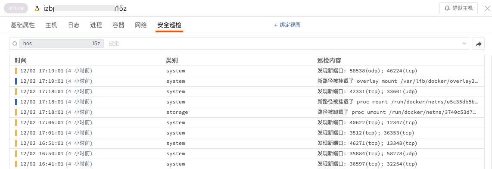

#### Added DataKit Collector Kubernetes Installation Guide

"<<< custom_key.brand_name >>>" supports adding a guide in the workspace «Integration»-«DataKit» for installing the DataKit collector on a Kubernetes cluster.

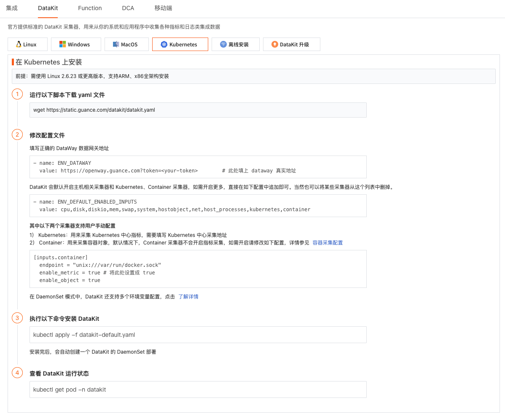

#### Optimized User Access Monitoring Associated Link Queries

"<<< custom_key.brand_name >>>" supports adding attributes to the current filter or copying them (copying the tag to the local clipboard) on the link details page and user access performance details page (user access monitoring view Explorer).

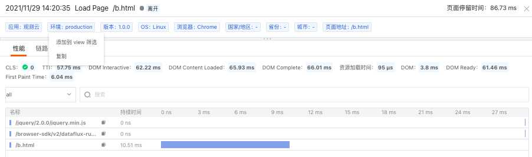

#### Optimized Registration Upgrade Process

<<< custom_key.brand_name >>> added the option to directly choose to activate the <<< custom_key.brand_name >>> billing platform during account registration and optimized the upgrade process to the agile version after logging into the workspace.

#### Price Reduction Adjustment

<<< custom_key.brand_name >>> adopted the latest technology to optimize data storage costs, hence reducing billing prices. A tiered billing model based on data storage strategies was introduced, including log data, application performance Trace, and user visit PV for these three billing items.

Additionally, to assist enterprises with more affordable prices and comprehensive observability of IT infrastructure and application systems, <<< custom_key.brand_name >>> launched three package plans: Startup Acceleration Pack, Entrepreneur Development Pack, and Enterprise Standard Pack, along with stackable traffic packs for enterprises to use according to their own needs and package stacking.

#### Other Optimized Functions

- Added LCP, FID, CLS, FCP-related detection Metrics to user access monitoring. In the <<< custom_key.brand_name >>> workspace «Monitoring»-**Monitors**, click «+Create New Monitor», select «User Access Metric Detection», and enter the configuration page for detection rules.
- Changed grouping in simple queries of monitors to detection dimensions. Detection dimensions determine which dimension triggers the detection rule, i.e., trigger object. “<<< custom_key.brand_name >>>” supports adding multiple detection dimensions, triggering alerts if any detection dimension's Metric meets the alarm condition.
- Improved navigation menu display, presenting secondary menus at the top when the <<< custom_key.brand_name >>> workspace navigation bar is collapsed.

## November 18, 2021

#### Added SSO Login

<<< custom_key.brand_name >>> supports users creating identity providers for workspaces and logging in via company email to obtain corresponding SSO login links. Clicking the SSO login link realizes corresponding authentication login. In <<< custom_key.brand_name >>> workspace «Management»-«SSO Management»-«Create Identity Provider», you can set up SSO single sign-on for employees.

#### Added Dashboard and Notebook SLO Charts

SLO charts were added to scene dashboards and notebooks. SLO charts can directly select configured monitored SLOs for SLO data display. By selecting different SLO names, SLO data results are synchronized and displayed.

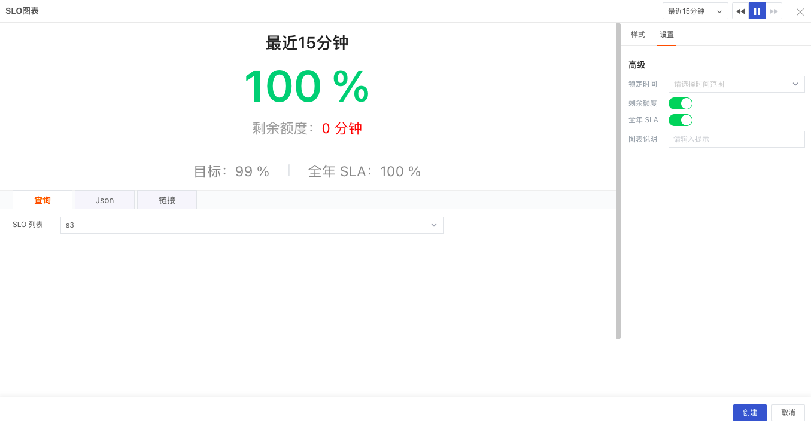

#### Added Custom Group Field Addition for Infrastructure Groups

In <<< custom_key.brand_name >>> infrastructure Explorer, click the settings button to the right of the group to add custom group tags. After adding, you can choose to display aggregated views grouped by the added group tags. Note: Only administrators can add custom group tags.

#### Added SLO Notification Silence Configuration

If an event is not very urgent but has a high frequency of alert notifications, you can reduce the notification frequency by setting notification silence. After setting notification silence, events will continue to occur, but notifications will no longer be sent. Generated events will be stored in event management.

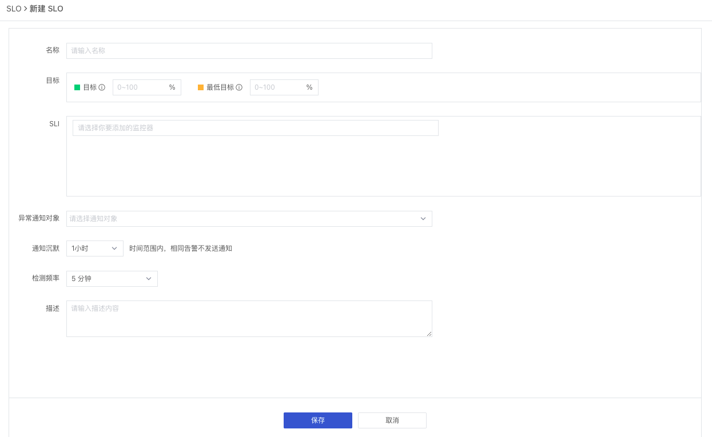

#### Optimized Chart Links

<<< custom_key.brand_name >>> supports adding built-in links and custom links to charts. Through links, you can navigate from the current chart to the target page and modify the corresponding variable values in the link using template variables to transfer data information, completing data linkage. Chart links support opening in new pages, current pages, or slide-out detail pages, enabling linked analysis.

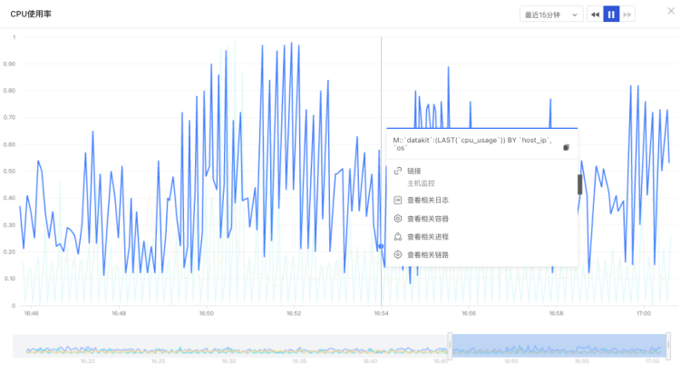

#### Price Reduction Adjustment

- Daily DataKit price reduced to 3 yuan per unit
- Availability API testing adjusted to 1 yuan per 10,000 tests

#### Other Optimized Functions

- Launched Free New Version in China Region 1 (Alibaba Cloud): The experience edition is divided into Alibaba Cloud login and AWS login. For Alibaba Cloud login, the data retention strategy for timeline data is 30 days, while other data retention strategies are 7 days. For AWS login, all data retention strategies are 1 day;
- Improved SLO deduction logic: Monitors in disabled status will not be included in the deduction scope;
- Added dashboard label function: When creating/modifying dashboard views, you can add custom labels to dashboards to help with quick filtering;
- Improved log highlighting: When searching logs in the search bar, only the matched keywords are highlighted in the returned list;
- Improved Explorer search: Added help documentation links to the Explorer search dropdown;
- Improved Markdown format for text charts: Added support for unordered and ordered lists, optimizing display formats.

## November 4, 2021

#### Added Scenario Notebooks

Under scenarios, you can create multiple notebooks for summary reports. Supporting insertion of real-time visual charts for data analysis, inserting text documents for explanations, combining charts and documents for data analysis and summary reports; supporting exporting infrastructure, log, application performance, user access, etc., Explorer data to notebooks for data analysis; supporting sharing notebooks with all workspace members, retaining abnormal data analysis to help trace, locate, and solve problems.

#### Upgraded Scenario Views to Dashboards

<<< custom_key.brand_name >>>'s scenario views have been upgraded to dashboards, and adjustments have been made to the dashboard functions and layouts. Under scenarios, you can create multiple dashboards to build data insight scenarios, supporting keyword searches for dashboards, adding visual charts to dashboards for data analysis, and quickly filtering and finding corresponding dashboards from "My Favorites", "Import Projects", "My Creations", and "Frequently Browsed".

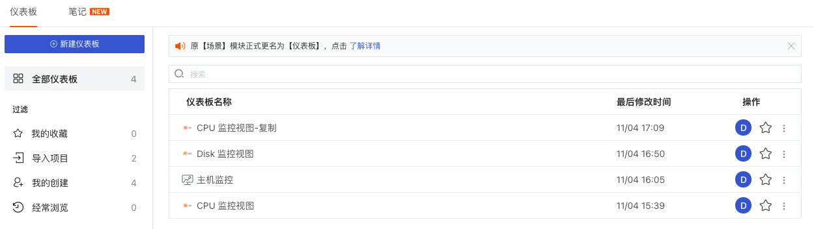

#### Added Export to Dashboard and Notebook in Explorers

Infrastructure, log monitoring, application performance monitoring, availability monitoring, security checks, etc., Explorers added export to dashboard and notebook.

#### Upgraded Anomaly Detection Library to Monitoring

The original «Anomaly Detection Library» has been upgraded to «Monitoring». Changes have occurred in names such as «Anomaly Detection Library», «Detection Rules», etc. Specific changes are as follows:

- Monitors (originally referred to as "Anomaly Detection Rules") provide «Threshold Detection», «Log Detection», and various other monitoring methods, allowing users to customize detection rule configurations and trigger conditions, and receive alert notifications promptly.
- Templates (originally referred to as "Built-in Detection Libraries"), <<< custom_key.brand_name >>> includes various out-of-the-box availability monitoring templates, supporting one-click creation of Docker, Elasticsearch, Host, Redis monitoring. After successfully creating a template, the corresponding official monitors are automatically added to the current workspace.
- Groups (originally referred to as "Custom Detection Libraries"), the group function supports you to create meaningful monitor combinations, facilitating group management of various monitors.

 

#### Added Monitoring SLO Function, Supporting Export to Dashboard  
«Monitoring» added SLO monitoring, supporting rating the quality of service provided by system service providers (Providers) in the cloud era, comparing whether the corresponding SLI (Service Level Indicator) meets target needs. Simultaneously, “<<< custom_key.brand_name >>>” supports exporting SLO as a view to the dashboard, facilitating synchronized SLO monitoring on the dashboard.

#### Other Optimized Functions

- Chart Optimization:
    - Removed group selection from overview charts;
    - Adjusted style selections for time series charts, pie charts, and bar charts;
    - Added tooltip information for time slices;
    - Chart JSON supports editing, linked with queries/settings, validating input JSON with error prompts if incorrect;
    - Style optimization in time series analysis mode;
- Added reminders for paid plans and bills, selecting settlement method aliyun or aws, bill lists directly show links to corresponding cloud service consoles for viewing bill information.

## October 21, 2021

#### Added Host Network Distribution Map

Added a host network distribution map, providing observable infrastructure networks. In «Infrastructure»-«Host», click the small icon in the top-left corner to switch to viewing host network distribution. In «Network Distribution Map», you can visually query network traffic between hosts in the current workspace, quickly analyzing TCP latency, TCP fluctuations, TCP retransmissions, TCP connections, and TCP closures between different hosts.

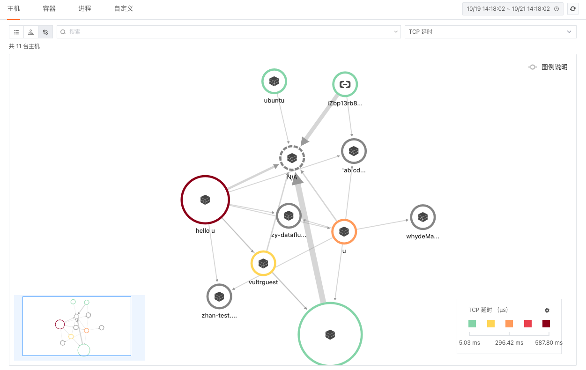

#### Added User Access Monitoring Tracing Function

Added «Tracing» functionality for user access monitoring. Supports users creating tracing tasks through «User Access Monitoring» to monitor custom link tracing trajectories in real-time. By pre-setting link tracing trajectories, you can filter link data, precisely querying user access experiences, promptly identifying vulnerabilities, anomalies, and risks.

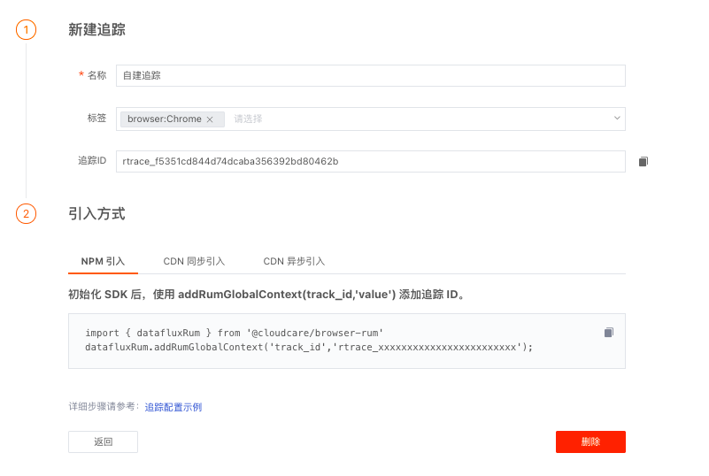

#### Added Scene Chart Json Query

In «Scene» chart editing, every correct chart query corresponds to a JSON text, supporting parsing between JSON text and chart queries within the workbench to help you understand chart drawing details.

#### Optimized DCA Desktop Client Application

Optimized DCA desktop client UI display, increasing host status.

- online: Indicates normal data reporting, allowing you to view DataKit’s operational status and configuration collectors via DCA;
- unknown: Indicates remote management configuration is not enabled, or not within the same local network;
- offline: Indicates the host has not reported data for more than 10 minutes, or the host name has been changed, resulting in the original host name showing as offline. Hosts without normal data reporting will be removed from the list if no data is reported within 24 hours.

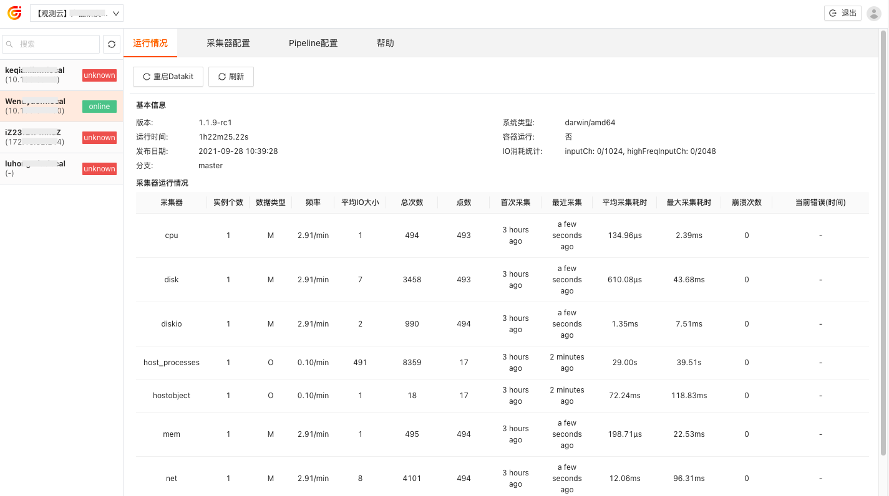

#### Optimized Event Host Linked Queries and Detection Rule Queries

Optimized the event module, supporting linked queries for associated hosts of events, allowing real-time monitoring of logs, containers, processes, links, and inspection events related to the event within the selected time component range; supports one-click viewing of the event's associated detection rules and querying other triggered events under the corresponding detection rule.

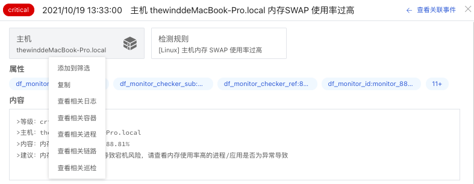

#### Adjusted Billing Method

- Choose billing settlement method based on node login method, including CloudCare account, Aliyun, AWS. Among them, CloudCare account settlement is the general method, Aliyun login nodes correspond to Aliyun account settlement method (in progress), AWS login nodes correspond to AWS account settlement method (already launched).
- Removed Session count and Browser test count billing dimensions, removing Session count and Browser test count statistics and views in «Paid Plans and Bills», adding security check count statistics graph.

#### Other Optimized Functions

- Optimized scene chart addition function, removing «Add Chart» button under «Edit» mode, all addable chart types are selectable at the top of the scene;
- Optimized scene chart grouping function, supporting deleting groups only and keeping existing charts in the default group;
- Added regional ranking switch for China map/World map, default off;
- Optimized Explorer query method, merging search and filter bars, supporting keyword search, label field filtering, and associated searches based on tags, fields, and text.

## September 28, 2021

#### Added Host Network Performance Monitoring

Host network performance monitoring supports viewing network traffic between host services, containers, and any tagged infrastructure. It supports viewing network traffic and data connections between sources and targets based on IP/port, with real-time visualization to help businesses understand their business system's network operating status, quickly analyze, track, and locate problem faults, preventing or avoiding business issues caused by decreased or interrupted network performance.

After successful collection of host network data, it is reported to the <<< custom_key.brand_name >>> console, where you can view all network performance monitoring data information for the workspace on the «Infrastructure»-«Host» details page under «Network».

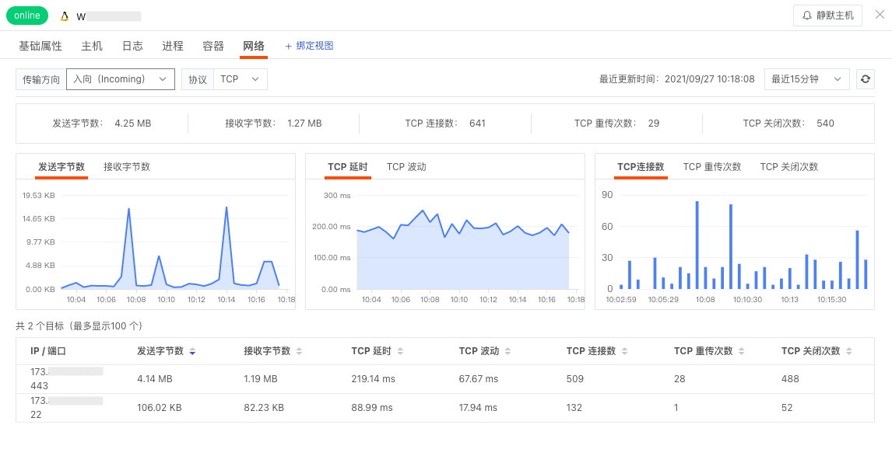
#### Added Chart Linked Queries

In the scene view, you can view the DQL query statement and associated links of the chart by single-clicking the mouse, or perform linked queries for related logs, containers, processes, links, etc., under different group query tags. When the chart query contains host (host) information, you can view the associated host monitoring view. For example, clicking any chart will allow you to view the DQL query statement, set links, and linked queries for related logs, containers, processes, links, and host monitoring views.

#### Added Chart Rectangle Tree Map

Rectangle tree maps are used to visualize the proportion distribution of Metric data under different groups. The color of the rectangle tree map represents the group's tag (Tag), and the area represents Metric data. When multiple Metric queries are added, you can choose the main displayed Metric, and the size of the area is displayed based on the selected Metric data results, Top/Bottom, and quantity. For example, this figure uses a visual way to display the ranking of CPU usage rates for hosts.

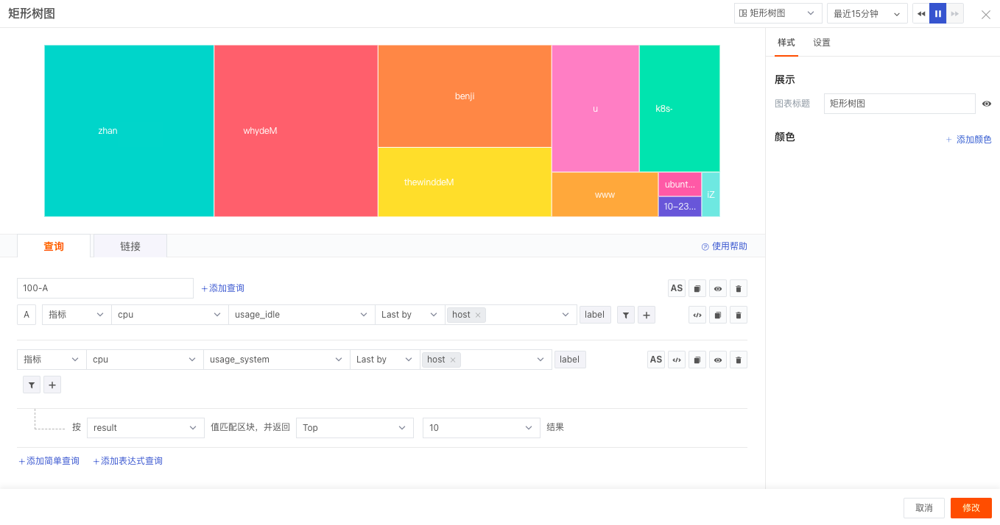

#### Added Associated Query for Application Performance and User Access Monitoring

In the chain details of application performance monitoring, you can view associated (same trace_id) real user access experience data through the «Related View» at the top of the page. This feature not only helps you view actively monitored application performance data but also allows you to quickly gain insights into real user access situations. Refer to the **Trace Analysis** documentation for more details on application performance monitoring.

#### Added Absolute Time Range for Infrastructure Queries

Infrastructure has added absolute time ranges for «Host», «Container», «Process» queries, defaulting to displaying the last 24 hours of host data, the last ten minutes of container data, and the last ten minutes of process data, which can be refreshed manually. Hovering over offline hosts allows you to view host offline handling prompts.

#### Optimized Chart Comparison Feature

Optimized the comparison feature for charts, supporting comparisons of historical data for time series charts, overview charts, etc. You can choose either year-over-year (comparison of the same time point in adjacent periods) or quarter-over-quarter (comparison of adjacent periods). Based on the locked time of the chart, you can choose quarter-over-quarter, daily quarter-over-quarter, weekly quarter-over-quarter, monthly quarter-over-quarter, weekly year-over-year, monthly year-over-year, etc.

#### Optimized SLIMIT in Chart Queries
 Default SLIMIT is added to grouped chart queries, limiting the number of points or series returned by **time series charts**. One chart limits returning 10,000 points, and one query returns a maximum of 10 timelines.

#### Cloud Testing Adjusted to Availability Monitoring

Cloud testing is divided into API testing and Browser testing, adjusted to availability testing. After the adjustment, API testing is retained. Other features such as overview analysis, Explorer analysis, self-built node functionality remain unchanged. Refer to the **Availability Monitoring** documentation for more details.

#### Price Reduction Adjustment

- Log price reduced from 1 yuan per 1 million entries to 0.5 yuan per 1 million entries
- User access monitoring price removed Session billing dimension, adjusted to 0.3 yuan per 1,000 PVs

Refer to the **Pay-as-you-go** documentation for more details on pricing and data expiration strategies.
## September 9, 2021

#### DataFlux Renamed to "<<< custom_key.brand_name >>>"

In the cloud computing era, observability is increasingly adopted and valued by more and more enterprises. DataFlux, as the cloud-era observability platform launched by ZYUN Technology, to make it easier for enterprises and users to understand, this release officially renames it to "<<< custom_key.brand_name >>>", with the URL as "**<<< custom_key.brand_main_domain >>>**".

At the same time, we designed a new Logo for "<<< custom_key.brand_name >>>", using letters C and G as the base to form a radar-like shape, reflecting detection and observation characteristics, fully aligning with the features of observability, and embodying the core protection system built by "<<< custom_key.brand_name >>>" for enterprises and users based on data.

#### Added Log Approximate Text Viewer

"<<< custom_key.brand_name >>>" supports similarity computation analysis on the `message` field of raw log data. According to the time range selected in the upper-right corner, the current time segment is fixed, and 10,000 log data entries within that time range are analyzed approximately. High-similarity logs are aggregated, extracting and statistically summarizing common Pattern clusters, helping to quickly discover abnormal logs and locate problems.

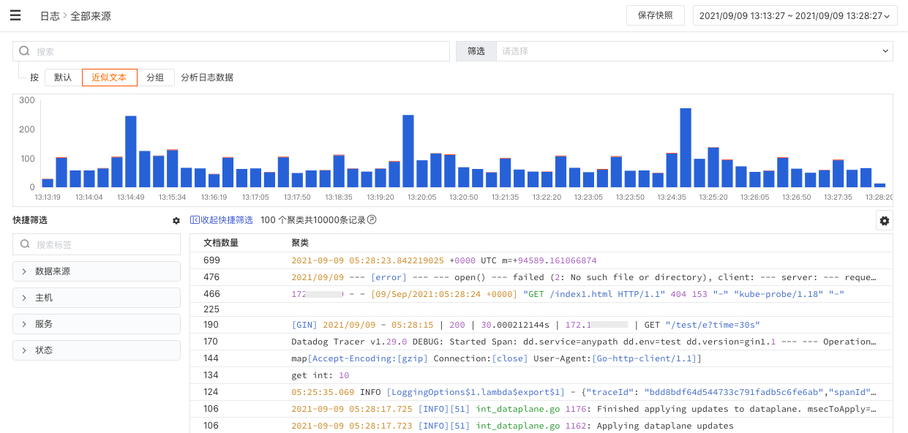

**Pattern Cluster Details**

Clicking the Pattern cluster list draws out all current Pattern clusters, with data lists arranged in reverse chronological order, supporting the display of the most recent 50 log data entries, which can be shown in 1-line, 3-line, or 10-line formats.

#### Added Container Jobs and Cron Jobs Viewer

"<<< custom_key.brand_name >>>" added Container «Jobs» and «Cron Jobs» viewers. In the left-hand object list under «Infrastructure»-«Container», you can view the running status and related service capability Metrics of Jobs and Cron Jobs in Kubernetes, thereby achieving real-time monitoring of Kubernetes clusters and deployed resources. Refer to the **Container** documentation for more details.

#### Added DCA Desktop Client Application

DCA, DataKit Control APP, is a desktop client application aimed at conveniently managing installed and configured collectors, supporting viewing integration lists, configuration file management, Pipeline management, and online viewing of integration configuration documentation. You can remotely connect to DataKit via DCA and make online changes to collectors, which take effect immediately after saving updates.

In the <<< custom_key.brand_name >>> workspace, click sequentially «Integration»-«DCA» to download the installation package. After downloading, you can install it on your computer to remotely manage DataKit.

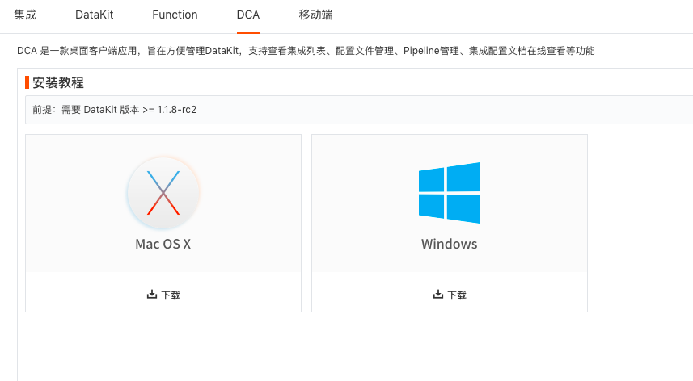

#### Added Mobile App

DataFlux Mobile can help you view <<< custom_key.brand_name >>> log data, scene views, etc., on mobile devices anytime, anywhere, and receive all alert events notified via email, DingTalk bot, WeCom bot, Webhook, etc.

In the <<< custom_key.brand_name >>> workspace, you can download the DataFlux Mobile app under «Integration»-«Mobile».

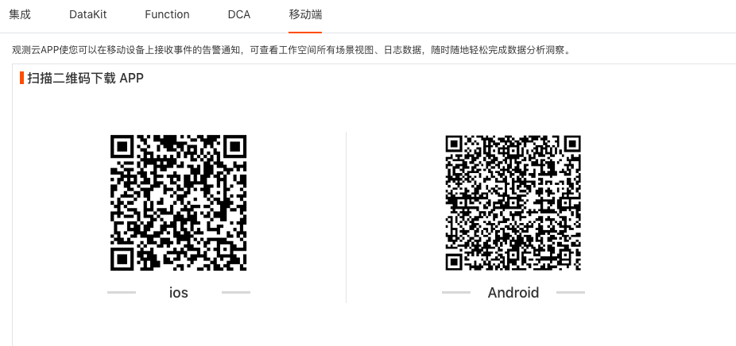

#### Added Label Filtering Function for Metrics, Optimized Three Viewing Modes for Metrics

DataKit collectors will append tags `host=<DataKit hostname>` to all collected data by default,

Tags are a set of attributes identifying the collection object of a data point, divided into tag names and tag values. On the «Metrics» page, you can select the corresponding Metric view for the tag value you want to view. As shown in the figure below: filter the host in the tag bar and view its `usage_system`, `usage_total`, `usage_user`, `usage_iowait` Metric views.

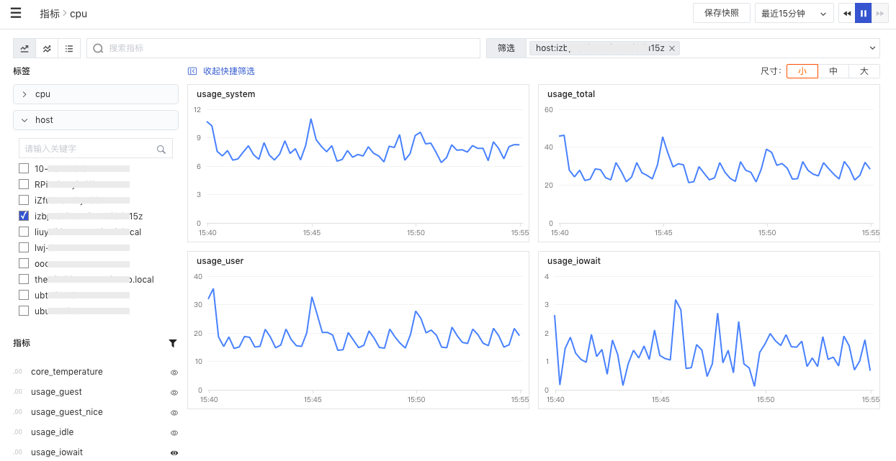

On the «Metrics» page, you can choose to switch Metric viewing modes on the left side, supporting three viewing modes: tiled mode, mixed mode, and list mode, with tiled mode selected by default.

#### Optimized Anomaly Detection

Added window (window) function for use in anomaly detection rule queries and chart queries, i.e., supporting the use of selected time intervals as windows (record sets) with detection frequencies as offsets, recalculating statistics for each record.

• When performing chart queries, supports adding window functions, i.e., using selected time intervals as windows (supporting choices of 1 minute, 5 minutes, 15 minutes, 30 minutes, 1 hour, 3 hours), combined with aggregate functions to calculate statistics for each record. • When configuring anomaly detection rule settings, adds the window function as the plotting area for query results, returning real-time anomaly detection Metric data used to trigger alerts.

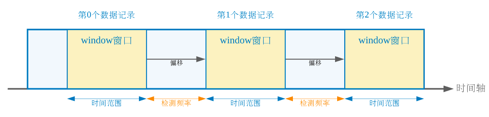

Added percent() function for use in aggregate functions in anomaly rule queries and chart queries. Supports adding percent() function in aggregate functions, including p50 (median value), p75 (value at 75% position), p90 (value at 90% position), p99 (value at 99% position).

Added label filtering for use in anomaly rule queries and chart queries, supporting selecting host label properties for filtered display. Before selecting labels in queries, you need to set label properties for hosts in «Infrastructure»-«Host».

#### Optimized Unresolved Event Display Style

In the unresolved event list, you can preview the window function for the event's last 6 hours: • The dotted border display effect represents the time period affected by the anomaly event • When the detection library rule type is threshold, log, application performance Metric, user access Metric detection, security inspection, anomalous process, or cloud testing, you can view related anomaly detection Metric data based on the color blocks corresponding to different alert levels, including critical, error, warning. • When the detection library rule type is mutation, interval, or water level, you can quickly identify the time point at which the current event was triggered based on the "vertical line" on the chart.

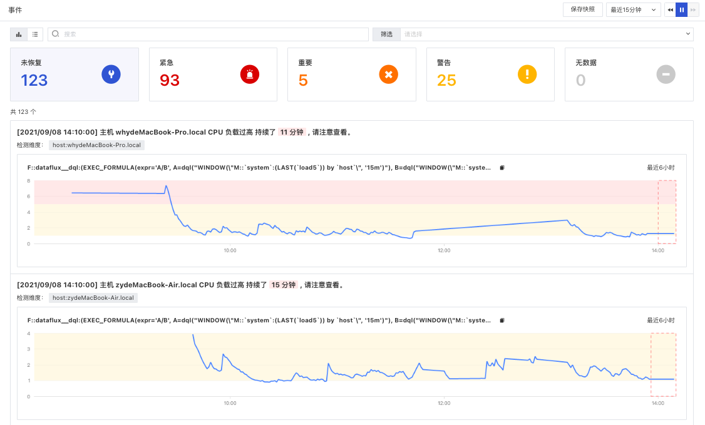

You can view the status distribution, DQL function, and window function line chart for anomaly events on the event detail page. • Status distribution: Displays the event status (critical, important, warning, data interruption) within the selected time range (default displays the last 6 hours) • DQL query statement: Returns real-time Metric data based on the custom query statement from the anomaly detection rule, default displaying the last 6 hours of real-time Metric data • Window function: Based on the anomaly detection rule, uses the selected time range as a window (record set) with the detection frequency as an offset, recalculating statistics for each record, returning real-time anomaly detection Metric data used to trigger alerts. Defaults to displaying the last 6 hours of real-time anomaly detection Metric data

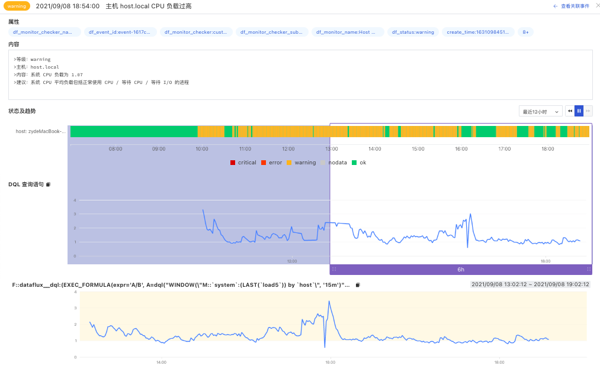

#### Optimized Scene View Analysis

In preview mode, double-clicking a chart enlarges it for analysis mode viewing. In edit mode, double-clicking a chart enters edit mode for additions, deletions, modifications, and queries.

#### Optimized Infrastructure Binding to Built-in Views

When selecting built-in views, duplicate-named views are filtered. When system views and user views have the same name, user views are prioritized for display, meaning only user views can be selected. To select a system view, you need to rename or delete the duplicate-named user view.

#### Optimized Billing Methods, Added Cloud Testing Billing, Adjusted Data Expiry Strategies

- Added PV count statistics: Billing is based on the lower cost between Session counts and PV counts.
- Added cloud testing task count billing: Opened self-built node management for cloud testing, supporting any space administrator to create new testing nodes globally; cloud testing billing dimensions will charge based on the number of cloud testing task calls in the current workspace; Free Plan workspaces can create up to 5 testing tasks and only support the use of "China Zone" testing nodes; Agile Plan and higher version workspaces support creating more testing tasks and using more foreign testing nodes.

## August 26, 2021
### DataFlux Studio

#### Added Chart Query Label Filtering

DataFlux supports selecting host label properties for filtered display. Before selecting labels in chart queries, you need to set label properties for hosts in «Infrastructure»-«Host». As shown in the figure below, there are two hosts containing the "production" label property, so data from two hosts is displayed.

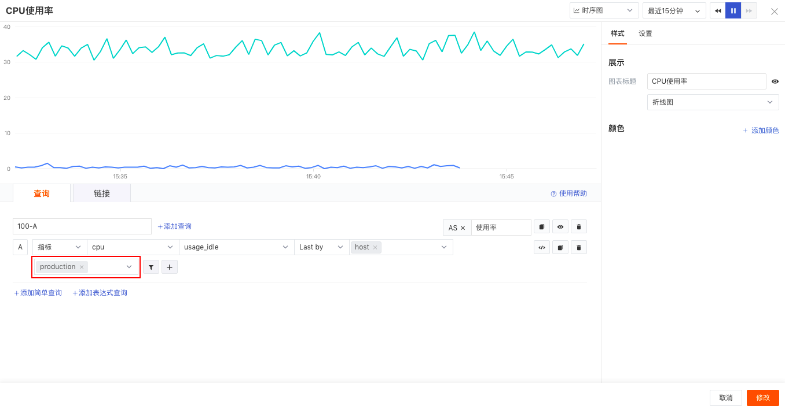

#### Added Infrastructure Container Cluster, Replicate Set, Node Viewers 

DataFlux added Cluster, Replicate Set, Node Viewers for containers, supporting viewing the running status and service capability Metrics related to Cluster, Replicate Set, Node in Kubernetes, thereby achieving real-time monitoring of Kubernetes clusters and deployed resources.

#### Added Quick Filtering for User Access Monitoring View

DataFlux supports custom adding filter fields by clicking the quick filter settings button on the left in the View Viewer. After selecting the fields to add, click "Complete" to proceed.

Note: If the added filter field represents a time field, you can filter by selecting a time range to view corresponding page content. For example, loading_time (page load time).

#### Added Navigation Menu Help Entry, Added Multiple Viewer Data Collection Guidance Entries

DataFlux added help documentation entry in the navigation menu. At the same time, when no data is uploaded to the Viewer, DataFlux provides a quick access "How to Start Data Collection" entry to help you start real-time monitoring in different Viewers. This includes how to start log monitoring, how to start cloud testing, how to collect host objects, etc.

#### Optimized Log Viewer

DataFlux optimized the Log Viewer, using different colors to highlight different contents of logs, allowing you to quickly obtain key data information from logs, supporting light and dark themes.

| Log Content | Light Theme | Dark Theme |
| --- | --- | --- |
| Date (log occurrence time) | Yellow | Pale yellow |
| Keywords (HTTP protocol related, such as GET) | Green | Pale green |
| Text (strings with quotes) | Blue | Pale blue |
| Default (text with no indicators) | Black | Gray |
| Numbers (log status codes, such as 404) | Purple | Pale purple |

#### Optimized Overview Statistics for Security Checks

DataFlux supports customizing the view of the security check overview page. By clicking the «Jump» button, you can jump to the corresponding built-in view for checking and editing, copying, and exporting the view.

#### Optimized Workspace Switching

DataFlux supports switching to other workspaces or creating new workspaces by clicking the «Current Space» name.

#### Optimized System Theme Color Switching

DataFlux added an «Automatic» option for system theme colors, which switches theme colors automatically based on computer appearance settings.

#### Other Optimized Functions

- Optimized «Service» details in application performance monitoring, clicking the resource name in the service details page jumps directly to «Link» to view the corresponding resource's link situation;
- Optimized «Performance» details in user access monitoring View Viewer, clicking error data (data marked as "Error" in the View list) allows you to view the corresponding error details;
- Optimized display of Metric Viewer tag names and tag values;
- Optimized time display on X-axis for time series charts, default time range is the last 15 minutes, X-axis segments are divided by minute intervals; last day, X-axis segments are divided by hour intervals; last 7 days, X-axis segments are divided by day intervals;
- Optimized expression queries, if the expression query contains multiple query statements, the grouping tags must remain consistent;
- Optimized host integration run status, addedDataKit version information in «Infrastructure»-«Host»-«Integration Run Status»;
- Optimized snapshot sharing, supporting sharing snapshots with "anyone" who has the share link, or encrypted sharing with those who have both the link and key.

## August 12, 2021
### DataFlux Studio

#### Added 3 Permission Roles, Optimized Scene View Permissions

DataFlux currently supports defining three workspace member permissions: "Administrator", "Standard Member", and "Read-only Member", each constraining different members' management permissions, operation permissions, and viewing permissions. "Administrators" can customize members' permission scopes, such as limiting read-only members' accessible scene views, limiting standard members' editable scene views, etc.

In the DataFlux workspace «Management»-«Member Management»-«Edit», you can edit and update members' permissions.

#### Added Infrastructure Host Detail View Connection Tracking and File Optimization

DataFlux supports viewing host system information on the infrastructure host detail page, including host name, operating system, processor, memory, network, hard disk, connection tracking count, file handle count, etc.

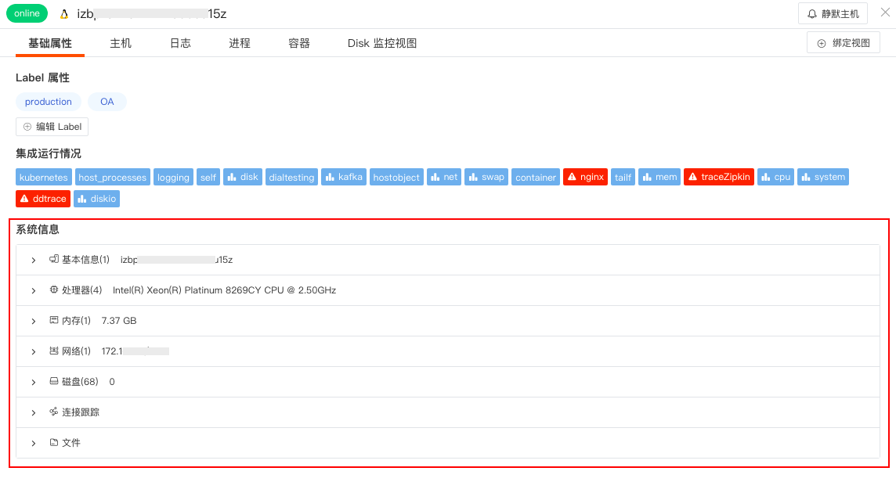

#### Added Scene View Snapshot Save Function

In the DataFlux workspace, enter «Scene»-«Node», click the «Settings» button at the top navigation bar, select «Save Snapshot» to save the currently displayed data content of the view as a snapshot.

Additionally, DataFlux supports quickly saving snapshots via page function buttons and shortcut keys (Ctrl+K). In scene views and all Explorers, using the shortcut key Ctrl+K will quickly pop up the [Save Snapshot] dialog box. Enter a name and click [Confirm] to add the current page as a new snapshot.

**Note**: If your backend program has other shortcut keys conflicting with Ctrl+K, you will be unable to use the «Save Snapshot» shortcut key function.

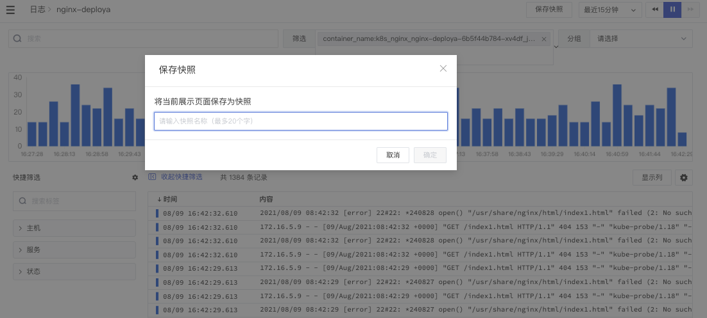

#### Added Chart and Snapshot Sharing Management

DataFlux supports unified management of charts and snapshots shared within the current space. For example, after completing chart sharing in «Scene Views», you can view the chart sharing list within the current space through «Management»-«Sharing Management»-«Chart Sharing», and perform chart viewing, viewing embedded codes, and canceling sharing.

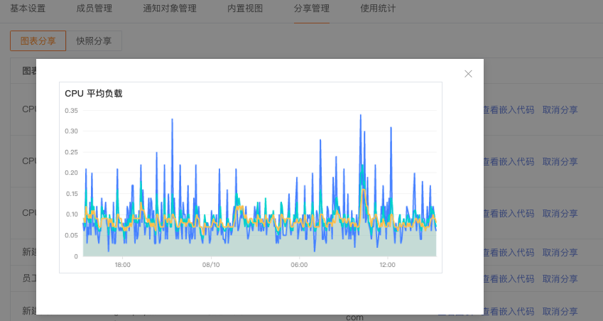

#### Added User Email Change, Mobile Unbinding Functions

In the DataFlux workspace, click the lower-left «Account»-«Settings»-«Basic Settings» to change, unbind mobile and email.

#### Added Customizable User Access Monitoring SDK Data Collection Content

DataFlux supports customizing user access monitoring SDK data collection content, helping users identify and analyze data in specific scenarios by setting different types of identifiers such as custom user identifiers, custom sessions, and adding extra data TAGs.

#### Added Paid Edition Session, Task Scheduling, Trace Free Quotas

The paid version of DataFlux adds daily free quotas of 1 million log entries per DataKit, 100 Session counts, 10,000 task scheduling counts, and 1 million Trace counts.

#### Optimized Scene Chart Analysis Mode

DataFlux supports previewing object data interaction changes over four times the query cycle in the analysis mode of time series charts via the timeline below the chart, and selecting the time range for the time series chart display by dragging the timeline. For example: if the current time point is 14:00 and the time range selected is [10:00-11:00], then the timeline range is [08:00-12:00].

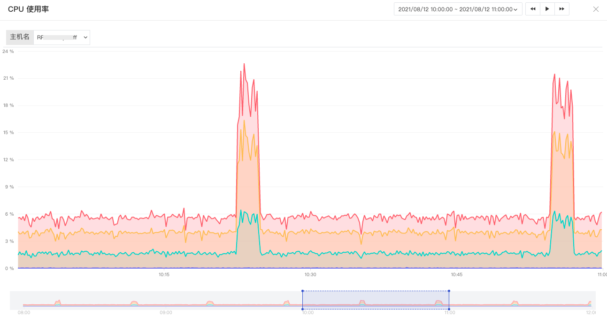

Note: A single query statement in a time series chart returns a maximum of 10 timelines, i.e., based on the results of the group-by condition, only 10 timelines are displayed if there are more than 10 timelines.

#### Optimized Infrastructure Host and Container Honeycomb Charts

Hovering the mouse over host and container objects allows you to view the host/container name, CPU usage rate, and MEM usage rate.

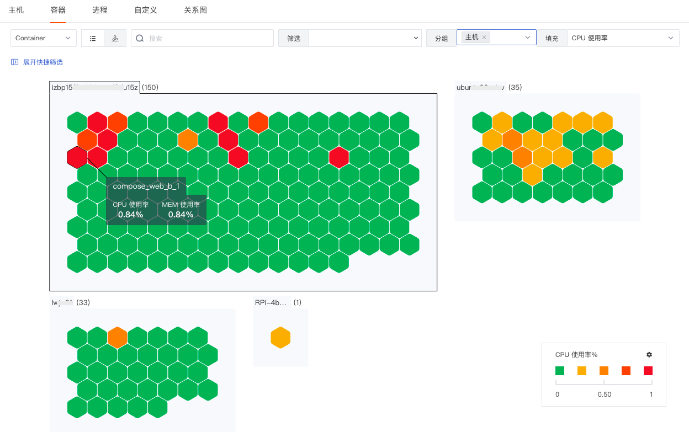

#### Optimized Log Source List Display Based on Viewer Time Range

DataFlux supports filtering the log source list based on the viewer's time range. For example, in the «Log Viewer» of the DataFlux workspace, selecting a 15-minute time range in the upper-right corner displays logs with data in the last 15 minutes in the left log list.

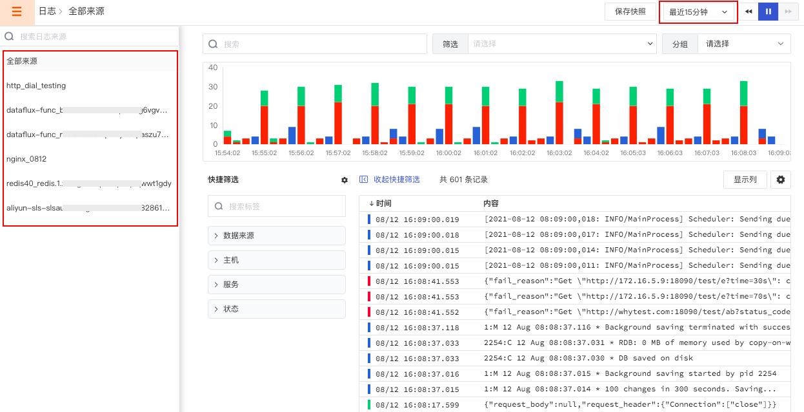

#### Optimized System Theme Color Switching

DataFlux supports switching system theme colors between light and dark themes. Click the account in the lower-left corner, and under «System Theme», click the desired theme to switch directly.

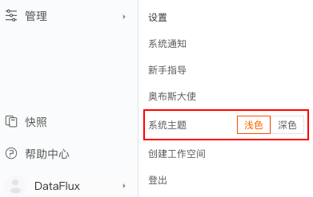

#### Other Optimized Functions

- Adjusted Webhook custom notification sending content type from text format to JSON format.
- Added a 15-minute alert silence option in anomaly detection library alert settings, meaning no notifications are sent for the same alert within a 15-minute time range.
- Adjusted the display style of unresolved event lists, changing log alert event statistics from table charts to time series charts.

## August 4, 2021
### DataFlux Studio
m
#### Added Container Services and Deployments Viewers

DataFlux supports displaying container states comprehensively from different dimensions through «Container», «Pod», «Services», «Deployments» viewers.

In the workspace «Infrastructure»-«Container», you can switch to «Services» via the data type filter bar in the top-left corner to view detailed information of all retained Services in the space, including Service name, service type, Cluster IP, External IP, runtime duration, etc.

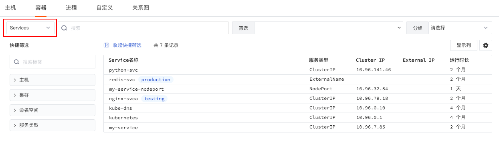

Switching to «Deployments» allows you to view detailed information of all retained Deployments in the space, including Deployment name, available replicas, upgraded replicas, readiness, runtime duration, etc.

## July 29, 2021
### DataFlux Studio

#### Added Global Label Function for Infrastructure

DataFlux added a global Label function for infrastructure, supporting users to add custom labels to infrastructure objects such as hosts, containers, processes, and displaying similar labeled infrastructure objects through added labels.

In the infrastructure object list, clicking the object name draws out the details page to add tags «Label Properties» for the object.

After custom labels are added, you can filter and display objects with the same label in the object list via the added labels.

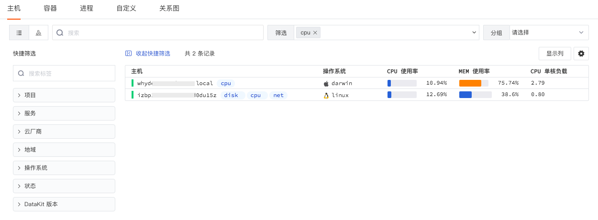

#### Added SMS Notification Object; Added SMS Fee Statistics for Paid Plans and Bills

DataFlux supports users managing notification objects for sending alerts, currently supporting adding DingTalk bots, WeCom bots, Lark bots, Webhook customizations, email groups, and SMS groups.

**Note:**

- Members receiving SMS notifications must first be invited into the workspace via «Management» - «Member Management» before they can be selected.
- DataFlux Free Plan does not support SMS notifications; other versions charge 10 RMB for 100 SMS messages, billed daily.

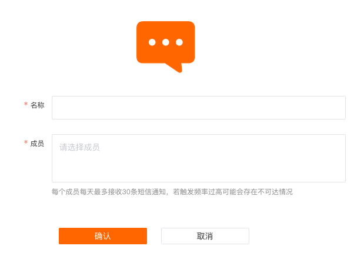

#### Added Slide Show Mode for Scene Views

DataFlux added slide show functionality for scene views, supporting browsing all node views in a specified scenario using slide show mode and customizing the interval for slide show playback.

#### Added Function to Replace Workspace Token

DataFlux supports the current space administrator replacing the token within the space and customizing the expiration time of the current token. Enter «Management»-«Basic Settings»-«Replace Token», select the expiration time and confirm «Replace». DataFlux will automatically generate a new token, and the old token will expire within the specified time.

**Note:**

- After replacing the token, the original token will expire within the specified time. Any proxies using that token will immediately stop reporting data, so it is essential to promptly check integration configurations;
- Replacing the token will trigger «Operation Events» and «Notifications».

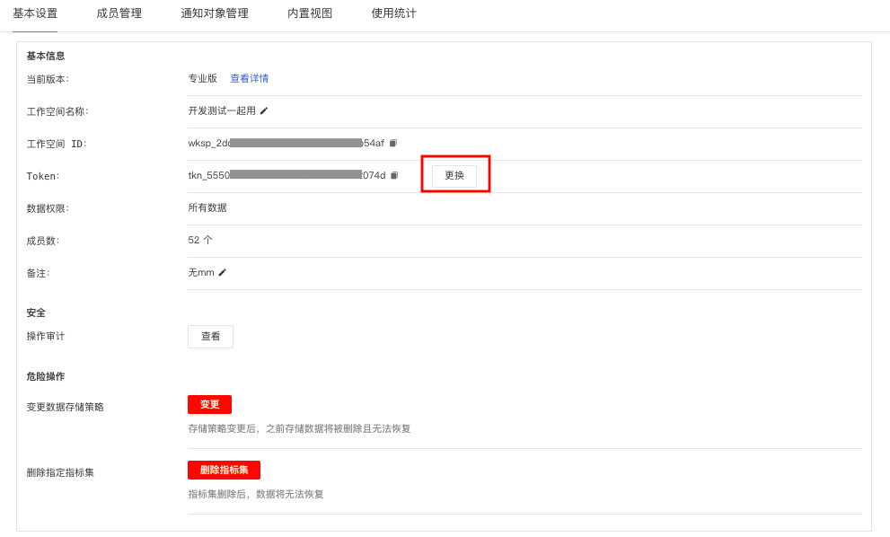

#### Added Metric DQL Query Mode

DataFlux supports switching «Search» to «DQL Query Mode» in the workspace «Metric» and directly entering DQL statements for queries. The corresponding tags and Metrics can be viewed on the left side, and the visualized chart returned by the query statement can be viewed on the right side.

#### Optimized Multi-line Display for Log Viewer

DataFlux supports choosing to display logs as "1 line", "3 lines", or "10 lines" in the "Settings" of the Log Viewer to view complete log content.

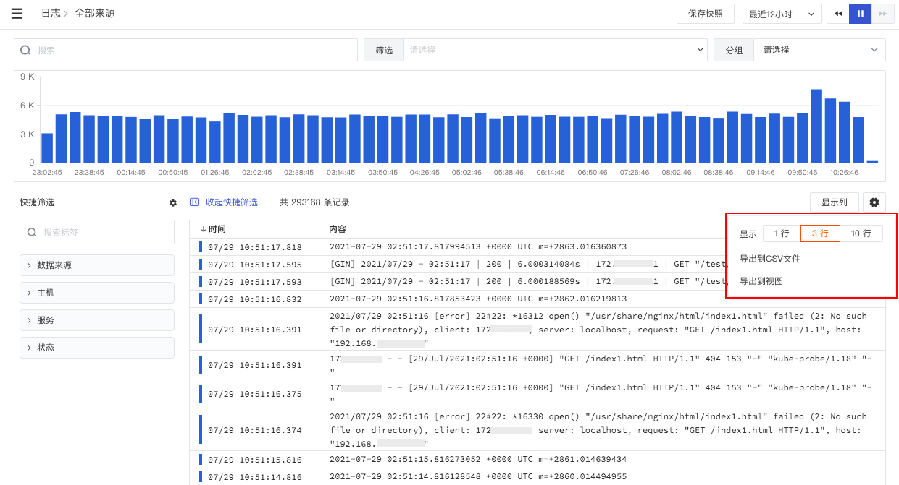

#### Optimized Service and Link Switching Views in Application Performance Monitoring, Optimized Response Time Line Chart

DataFlux supports retaining the current filter conditions (including: environment, version) and time range when switching between «Service» and «Link» viewers. For example: in application performance monitoring «Service», select «Environment» as `production_a` and «Time Range» as `Last 30 Minutes`.

When switching to application performance monitoring «Link», the filter conditions remain consistent with «Service».

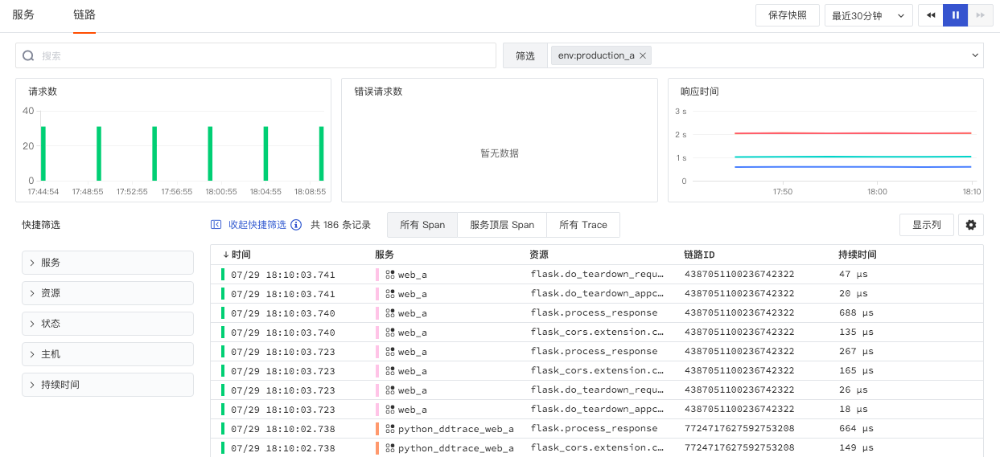

#### Optimized Installation Guide for DataKit Collector

DataFlux supports customizing installation options during DataKit installation, such as cloud vendor, namespace, global tag, etc.; DataKit offline installation supports directly downloading offline installation packages for different operating systems by clicking.

#### Optimized Flame Graph Display for Synchronous and Asynchronous Calls

DataFlux application performance monitoring flame graphs support viewing detailed data for synchronous and asynchronous call chain performance. For example, through the flame graph, you can clearly see which requests were made asynchronously, when they started, when they ended, and how much total time was spent.

#### Optimized Field Alias Display for Viewer Columns

DataFlux supports customizing aliases for fields displayed in viewers. For example, in infrastructure host objects, users can modify field aliases in "Add Display Column". After modification, these can be viewed in the viewer and details.

#### Optimized Cloud Testing Self-built Nodes

DataFlux cloud testing self-built node geographical locations are split into two filter boxes: country and province (or city). If the country filter box selects China, the next filter box will filter out the list of provinces; if the country selects non-China, the next filter box will filter and display the list of cities. The filter box defaults to showing 20 entries and supports fuzzy search.

#### Optimized DQL Query Functions

DataFlux DQL added exists, wildcard, with_labels, and other query functions.

## July 15, 2021
### DataFlux Studio

#### Added Third-party Development Tool Integration for User Access Monitoring

DataFlux added integration for mini-program development based on the uniapp framework. By introducing the SDK file, you can monitor the performance metrics, error logs, and resource request data of the mini-program and report them to the DataFlux platform.

#### Added Data Gap Anomaly Detection

DataFlux added data gap anomaly detection, triggering events based on configured custom detection cycles. After the data gap detection rule takes effect, the first detection of a data gap and continuous data gaps do not produce data gap alert events; if data is detected and a data gap occurs within the configured custom detection cycle, a data gap alert event is generated.

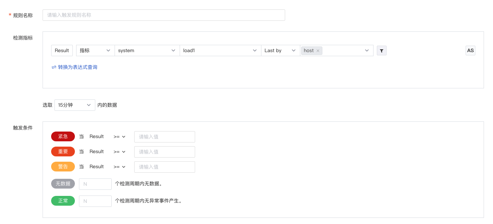

#### Added Built-in Detection Libraries for Elasticsearch, Redis, and Docker

DataFlux currently supports 4 built-in detection libraries: Elasticsearch, Redis, Host, and Docker. You do not need manual configuration; they are ready-to-use. For more details, click the corresponding built-in detection library directly.

- Redis Detection Library: Includes abnormal increase in the number of client connections waiting for blocking commands
- Host Monitoring: Includes various data Metrics such as host CPU, memory, disk, etc.
- Elasticsearch Detection Library: Includes ES JVM heap memory, thread pool, search query load anomalies, etc.
- Docker Monitoring: Includes container CPU, memory, and other data Metrics

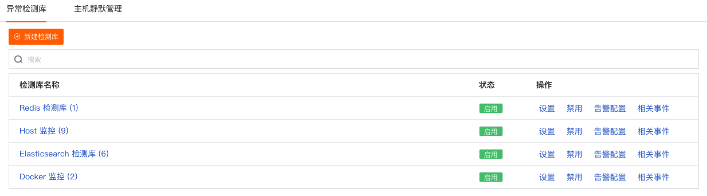

#### Added All Trace Viewer for Application Performance

DataFlux provides three trace screening viewing lists: «All Spans», «Top-level Spans», and «Trace ID». Span represents a logical work unit within a given time period in a distributed system, and multiple spans form a trace trajectory.

- All Spans: Displays all collected span data within the selected time range.
- Top-level Spans: Filters and displays all spans data entering for the first time within the selected time range.
- All Traces: Filters and displays all trace data containing initial top-level spans within the selected time range.

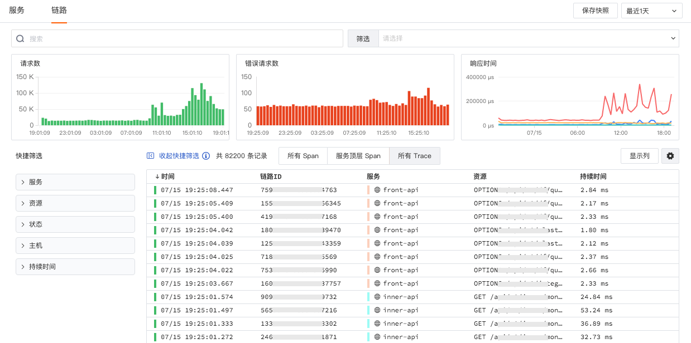

**Added Topology Call Relationship Diagram for Trace Details**

DataFlux added a corresponding service topology call relationship diagram in the application performance monitoring details page to view the call relationships between services.

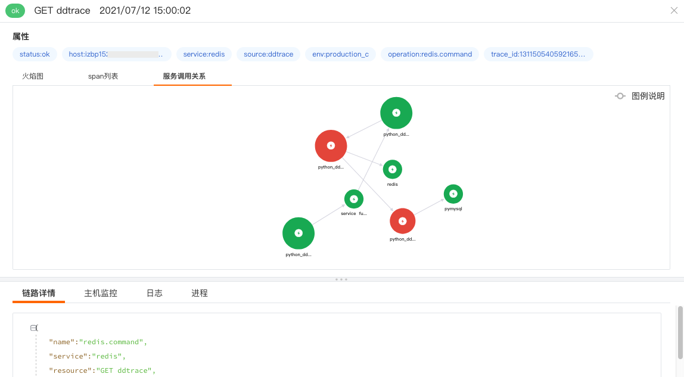

#### Added User Access Error Details Page

DataFlux supports viewing user access error details on the user access details page, including error data information, error type, and error occurrence time during that user access.

Clicking the error information jumps to the corresponding error details page.

#### Added Security Check Overview Statistics

In «Security Check»-«Overview», you can view the overview of security check events occurring on different hosts by filtering hosts, security check levels, and security check categories, including the quantity of security check events of different levels and visual chart analysis, and rankings of security check events of different categories and rules.

#### Added Handling Suggestions for Security Check Events

On the security check Viewer, click the inspection event you want to view. In the drawn-out details page, you can view handling suggestions for this security check event, including the theoretical basis of the security check event, risk items, audit methods, remedial measures, etc.

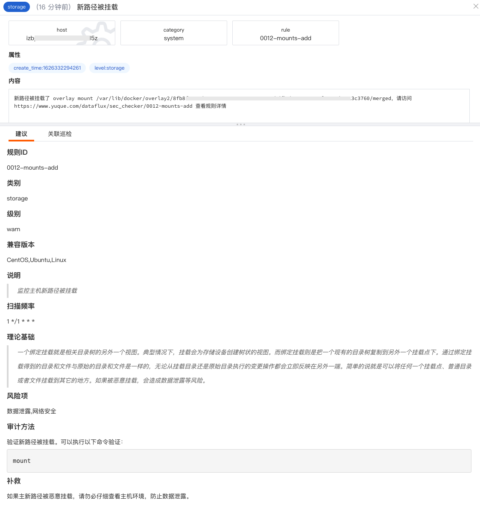

#### Added Secondary Navigation Bar

DataFlux added support for displaying secondary navigation by "hovering the mouse", thereby shortening the time users spend finding target data.

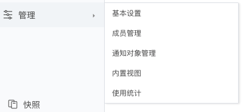

#### Added Member Management Search Function

DataFlux supports searching for members in «Member Management» via search functionality, quickly matching current workspace members based on email or name.

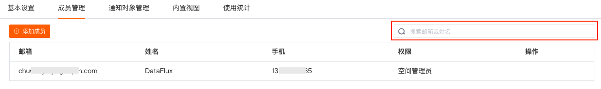

#### Added Binding Built-in Views to Infrastructure Objects

DataFlux supports binding built-in views (system views, user views) to the details pages of infrastructure objects by the «current space administrator». As shown in the figure below, the built-in system view «Disk Monitoring View» is bound.

#### Optimized Event List Display by Detection Library Type

DataFlux supports displaying corresponding event information in the event list based on different detection library types.

- When the detection library rule type is threshold, mutation, interval, water level, application performance Metric, or user access Metric detection, the configured trigger conditions display the corresponding baseline and corresponding information, including critical, error, warning.
- When the detection library rule type is log, security check, anomalous process, or cloud testing detection, query all log data related to abnormal events.

As shown in the figure below, there are three different detection library types, including threshold detection, security check detection, and process data detection.

#### Optimized Deletion of Metric Sets

DataFlux supports administrators deleting Metric sets within the space. Enter «Management»-«Basic Settings», click «Delete Metric Set», input keywords to query and select the Metric set name, click «Confirm» to enter the deletion queue and wait for deletion. Deleting a Metric set generates system notification events, such as creating a delete Metric set task, successful execution of the delete Metric set task, failed execution of the delete Metric set task, etc.

#### Optimized Query Time Range for Built-in Views in Viewers

Changed the query time range for built-in views, including «Host Monitoring» views on infrastructure object, link, and log detail pages and «Process» views on link and log detail pages.

- When viewing link and log details, «Host Monitoring» displays the host's performance data within the selected time component range by default.
- When viewing infrastructure object (host, container) details, «Host Monitoring» displays the host's performance data for the last 24 hours by default.
- When viewing link details, «Process» displays real-time process data 10 minutes before and after the link occurrence time by default.
- When viewing log details, «Process» displays real-time process data 10 minutes before and after the log generation time by default.

#### Optimized Quick Filter Interaction in Viewers

If the current field value is too long in quick filters across various viewers, the excess part is displayed as `...`, and hovering the mouse over the current field value area expands the display according to the field value length.

## July 1, 2021
### DataFlux Studio 

#### Added Unresolved Event Statistics Viewer

DataFlux added an unresolved event statistics Viewer. In the DataFlux workspace's **Events**, by switching the Viewer in the top-left corner, you can view all unresolved events persistently triggered within the space, as well as data volume statistics and alarm information details for unresolved events under different alert levels.

#### Added Chart Link Functionality

DataFlux added chart link functionality for time series charts, bar charts, overview charts, dashboards, pie charts, leaderboards, scatter plots, bubble charts, maps, and honeycomb charts. Chart links help you jump from the current chart to the target page, supporting modifying the corresponding variable values in the link via template variables to transmit data information and complete data linkage.

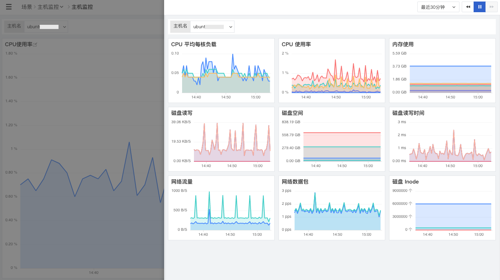

Chart links support obtaining template variables via queries, adding internal and external links, and opening in new pages, current pages, and sliding detail pages. Links can also be given alias names for display.

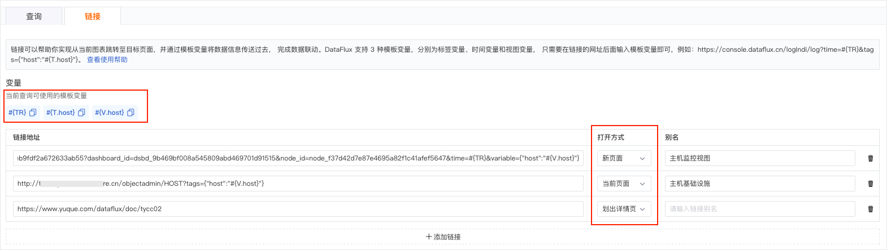

After adding the link, clicking the chart allows you to view clickable "custom links."

#### Added Application Performance Monitoring Bound Links and Built-in Views

DataFlux supports adding built-in views in individual service details, including built-in views and linkable web addresses. In the service list, click «Settings» to add one or more jump links or built-in views and customize their names.

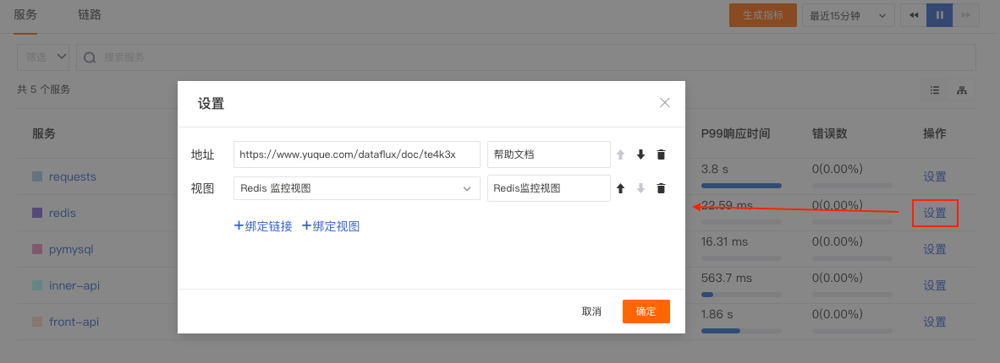

After adding built-in views, you can view the corresponding built-in pages by checking service details.

#### Added PV/UV Overview Statistics for User Access Monitoring Scenes

DataFlux added PV/UV overview statistics for user access monitoring in Web, iOS, Android, and mini-program scenes. This allows quick comparison of PV/UV differences and understanding of actual user access numbers.

#### Added Notification Object: Lark Bot

DataFlux supports managing notification objects for sending alerts, currently supporting adding emails, DingTalk bots, WeCom bots, Lark bots, and Webhook customizations.

#### Optimized Resource Catalog for Infrastructure

Besides host, container, and process objects, all other object data in infrastructure can be reported via DataFlux Function to «Infrastructure»-«Custom» for viewing and analysis. Supports binding built-in views to resource catalog data and manually adding tags for filtering.

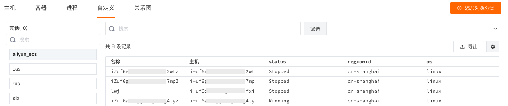

Reporting resource catalog data requires first installing and connecting DataKIt and Function, then reporting data to DataKit via Function, and finally DataKit reporting data to the DataFlux workspace.

#### Optimized Detection Rules for Anomaly Detection Library

DataFlux added recovery alert configuration for anomaly events; added support for regular expression matching styles adjustment, optimized `＝～` to `match`, added `not match`; added support for non-numeric data matching in trigger conditions, added `match`, `not match` regular expression matching, added `between`.

#### Optimized Associated Logs in Viewer Details Pages

DataFlux supports filtering associated log pages in the side panel details page of traces based on `trace_id` by default, viewing log details associated with the same `trace_id`.

In the trace details, click «Logs» below the flame graph to view associated logs based on the host and trace ID (`trace_id` field) related to the current trace. Additionally, you can perform keyword searches and multi-label filtering on the logs. If you need to view more detailed log content, you can click the log content to jump to the log details page, or click the jump button to open it on the log page.

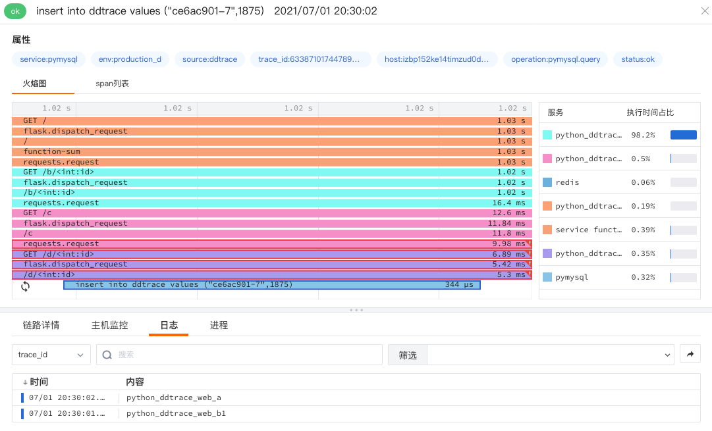

Viewer added log association page.

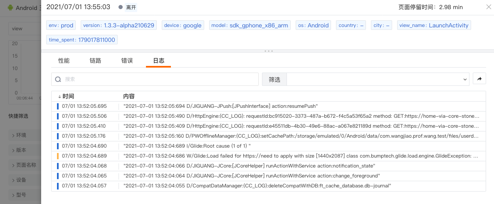

#### Optimized Viewer Search Style

Adjusted the search styles for creating new scenes, Metrics, application performance monitoring, user access monitoring, anomaly detection library, host mute management, integration, management/built-in views, snapshots, etc.

#### Deployment Version Supports Modifying Data Retention Duration

Added functionality to change data storage strategies in basic workspace management information.

## June 17, 2021
### DataFlux Studio 

#### Added Log Analysis Mode

DataFlux supports grouping large volumes of raw data based on **1-3 tags** via the log grouping function to reflect the distribution characteristics and trends of grouped data at different times. DataFlux supports three ways to browse grouped data: line chart, area chart, bar chart.

#### Added Log Filtering

Added log filtering function (log blacklist), supporting setting filter rules to filter out logs that meet the conditions, meaning that after configuring log filtering, logs that meet the conditions will no longer be reported to the DataFlux workspace, helping users save on log data storage costs.

In «Logs»-«Filter Rules»-«New Rule», select "log source" and add one or more data filter conditions with a relationship of **and (AND)** to filter collected log data. Log data that meets the filter conditions will not be reported to the dashboard.

#### Added Saving Metric Browser Snapshots, Added Snapshot Link Copy Function

DataFlux supports creating quick-access data copies for Metric viewers and uniformly saving them in the "Snapshot" directory; added generating snapshot share links, supporting sharing snapshot links with other members within the space, allowing quick reproduction of instant copied data copy information and restoring data to a certain time point and a certain data display logic.

#### Added Pod Viewer for Containers

DataFlux added a Pod Viewer under «Infrastructure»-«Container». Through the filter in the top-left corner, you can switch to view detailed information of all collected Pods, including Pod name, the node Node it belongs to, the one or more containers it contains, startup status, running status, and related Metrics. You can also switch to a honeycomb chart for viewing.

Clicking a Pod in the honeycomb chart allows you to view the Pod's details, including Pod name, namespace, visual monitoring charts, etc.

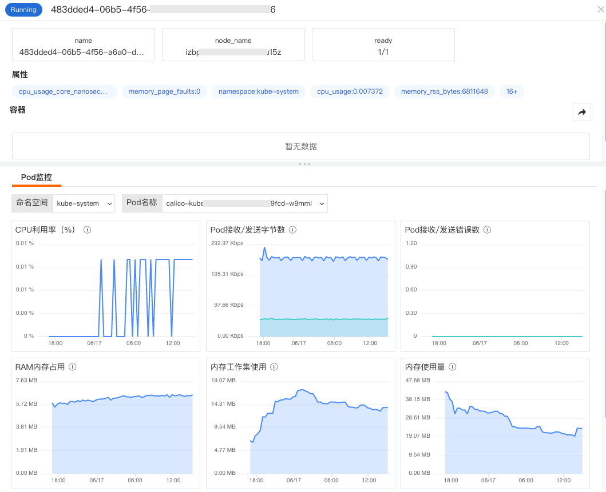

#### Added Free Quota Early Warning Notifications

Added early warning notifications and quota exhaustion notifications for the Free Plan, supporting sending emails and generating system notifications. Learn more about message notifications. System message notifications can be viewed in the DataFlux workspace «Account»-«Notifications».

#### Added Chart Sharing

DataFlux supports chart sharing, enabling embedding charts in code outside DataFlux for visual data display and analysis. Shared charts will change based on changes in the DataFlux charts. Charts shared in scene views are uniformly stored in «Integration»-«Embedded Sharing».

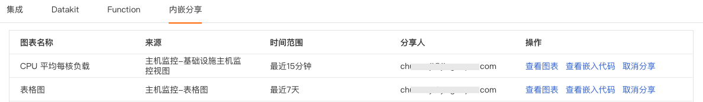

#### Optimized Chart Queries and Styles and Settings

Adjusted and optimized visualization chart queries, styles, and settings in scene views, added features such as hiding chart titles, time slice settings, precision settings for overview chart data, leaderboard baseline settings, color fill settings for maps/honeycomb charts.

#### Optimized Integration, Added DataKit and Function Installation Guides, Added Embedded Sharing

DataFlux supports viewing all supported collectors, DataKit installation instructions, DataKit upgrade commands, Function installation instructions, and embedded sharing chart codes in the integration section.

In the DataFlux workspace, click the left «Integration» menu to view all currently supported collectors. Clicking a collector displays its configuration details.

In the DataFlux workspace, click «Integration»-«DataKit» to obtain DataKit installation instructions, including Linux, Windows, MacOS three major operating systems, and offline installation methods. If DataKit is already installed but not the latest version, you can obtain the update script here under "DataKit Upgrade".

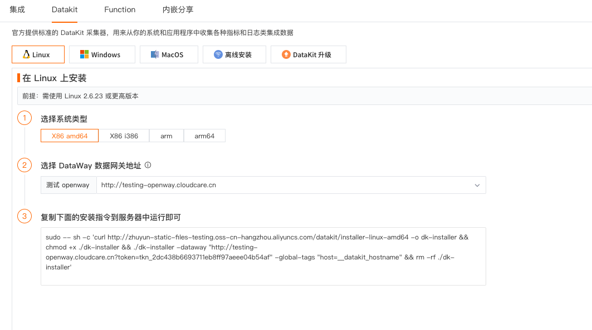

In the DataFlux workspace, click «Integration»-«Function» to obtain Function installation instructions.

#### Optimized Host Details Page

In «Infrastructure»-«Host», clicking the host name in the list draws out the details page to view basic information about the host, processor, memory, network, hard disk, etc. Supports automatic conversion of data units, and supports displaying different host monitoring views based on different operating systems.

## June 3, 2021
### DataFlux Studio 

#### Added Browser Log Collection

DataFlux supports actively sending different levels of log data (`corresponding source: browser_log` Metric type log data) to DataFlux via web browsers or JavaScript clients.

#### Added Session Viewer for User Access Monitoring

DataFlux user access monitoring Viewer added viewing user access behavior monitoring data (session data) and session data details related to Web/miniprogram/Android/iOS applications. In the workspace, open «User Access Monitoring»-«Select Any Application»-«Viewer», you can switch to the Session Viewer (Session). The Session Viewer statistically records the entire session duration, number of pages, number of operations, number of errors, etc. Clicking a single session allows you to view the detailed records of the entire session. By viewing and analyzing session data, you can understand actual user access data from multiple dimensions, helping improve application performance experience.

#### Added Browser Testing, Cloud Testing Anomaly Detection Templates, and Optimized Self-built Nodes

1. **Browser Testing**

DataFlux added browser testing. In DataFlux «Cloud Testing», click «New»-«Browser Testing» to create a new Browser Testing task, real-time acquiring Web page user access experience data, including page loading time, resource loading time, etc.

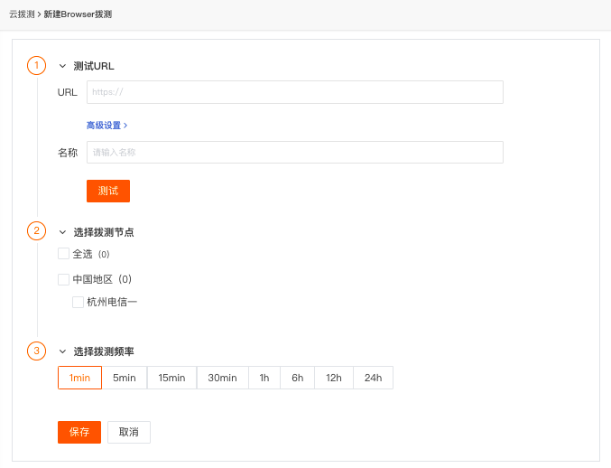

2. **Anomaly Detection Templates**

«Cloud Testing Data Detection» monitors cloud testing data within the workspace. By setting threshold (boundary) ranges for specified data quantities generated by testing tasks over a certain time period, alerts can be triggered when the data quantity reaches the threshold range. You can also customize alert levels, triggering different levels of alert events when the specified data quantity reaches different threshold ranges.

3. **Self-built Nodes**

DataFlux cloud testing self-built nodes added "node Code", used to obtain the Code for node information, ensuring that node Codes within the current space are not duplicated.

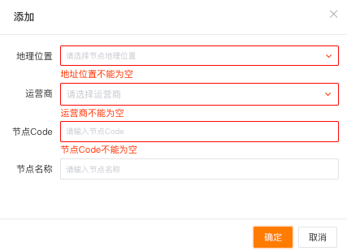

#### Added Registration Welcome Page

DataFlux displays a welcome page after account registration login, where you can view a DataFlux introduction video, scan to join the DataFlux WeChat and DingTalk service groups.

#### Added DataFlux Func Support for Free Plan, Adjusted Billing Items

All versions of DataFlux fully support the DataFlux Func platform for custom functions, DataFlux Func being a script development, management, and execution platform based on Python with ServerLess-like capabilities.
Simultaneously, to reduce user costs for using DataFlux, DataFlux adjusted the billing logic for application performance monitoring and user access monitoring. After the adjustment, application performance monitoring counts trace quantities, while user access monitoring counts daily session quantities. 

#### Optimized Metric Generation

Added user performance monitoring, user access monitoring, security checks to generate Metrics, optimizing log Metric generation. Generating Metrics can be completed in three steps: data filtering, data querying, and Metric generation, including configuring dimensions, aggregation time, defining aggregation frequency, Metric set, and Metric name to generate Metrics. Example:

1. Application Performance Monitoring

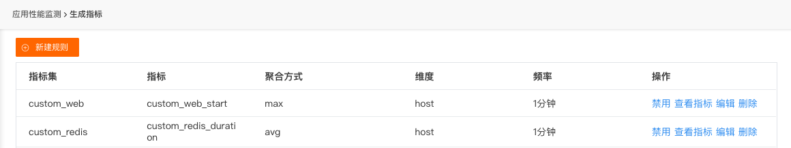

2. User Access Monitoring

3. Security Checks

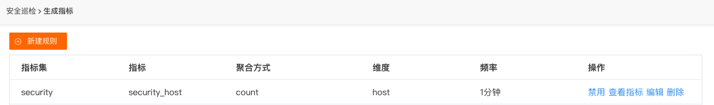

#### Optimized Built-in Views, Added Clone Function

Built-in views are divided into "System Views" and "User Views", supporting cloning from "System Views" to "User Views", and allowing system views and user views to have the same name. Clicking "View" on the system view jumps to the system view details.

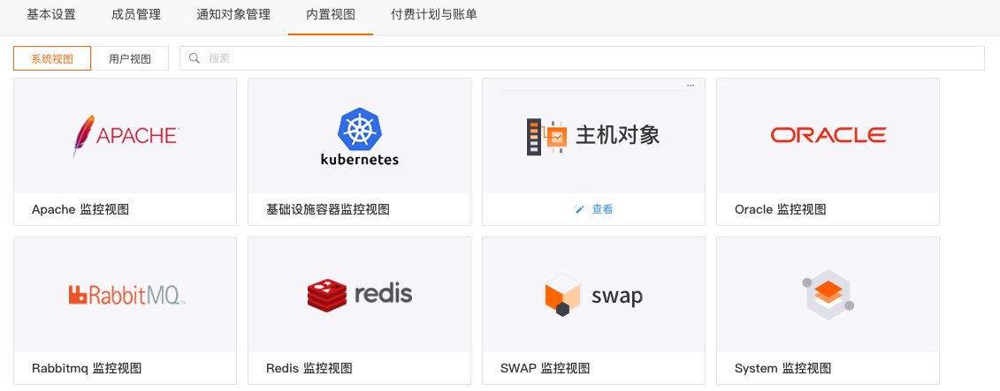

Clicking "Clone" opens the clone view dialog box, clicking confirm creates the corresponding user view based on the current view template.

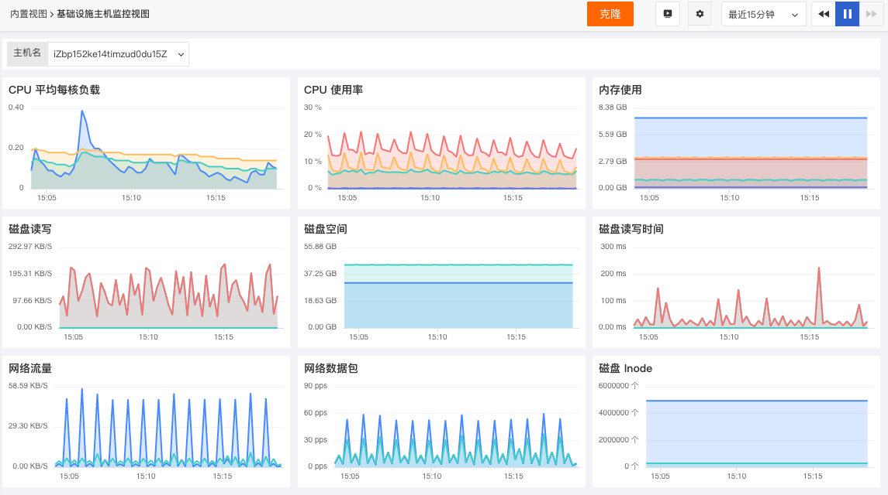

After successful creation, it jumps to the created user view page.

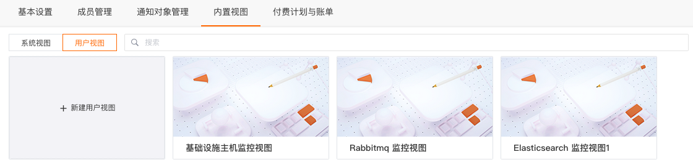

If user views and system views have the same name, and the system view is applied in the Explorer detail view, such as "Infrastructure-Host-Host Details" under the host view, the user view will replace the system view in the host view display.

#### Optimized View Variables

DataFlux supports adding global variables to views. When you want to dynamically complete chart filtering in the view, you can choose to use view variables to achieve this. After configuring view variables, you can select whether to enable "default match all" via "Advanced Settings".

After enabling, you can view the comprehensive view of all hosts via «*», allowing manual selection of variables for filtered viewing.

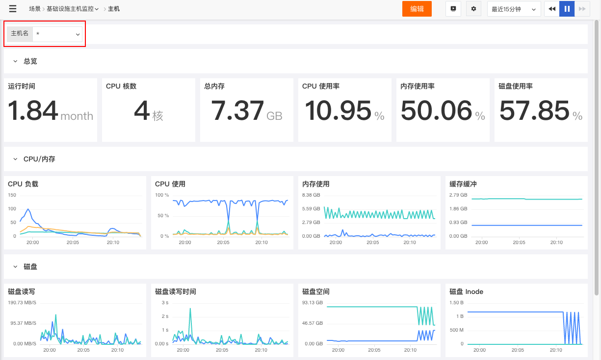

#### Optimized Viewers

- When single-column information is incomplete, hovering the mouse delays displaying full tooltip information by 1 second;
- When searching key content in the Viewer, the matched content in the list is highlighted;
- Tags on the details page support copy function; host tags support ["View Related Logs"]["View Related Containers"]["View Related Processes"]["View Related Links"]["View Related Inspections"];
- Statistical charts for logs, application performance monitoring, user access monitoring, cloud testing, security inspections changed to status statistics;
- Added help links for starting user performance monitoring, user access monitoring, security inspections.

## May 20, 2021
### DataFlux Studio 

#### Added Save Snapshots

DataFlux snapshots support creating snapshots for infrastructure, logs, events, application performance monitoring, user access monitoring, cloud testing, security inspections. Through snapshots, you can quickly view and analyze data and anomalies for different time periods and labels.

#### Added Infrastructure Host Integration Interaction

The «Integration Run Status» of infrastructure hosts displays the run status of collectors related to the host. There are two statuses: normally running integrations and errored integrations. Normally running integrations are displayed by default as 'light blue', while errored integrations are displayed by default as 'red' and support viewing error information.

At the same time, clicking on integrations with built-in view symbols (as shown in the figure below) supports "View Monitoring Views". Clicking will open the relevant built-in views.

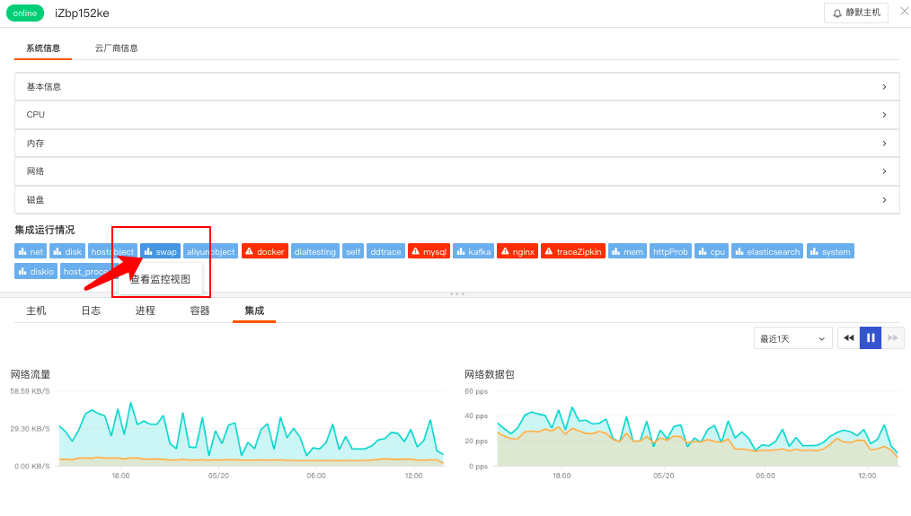

#### Added Self-built Nodes, Optimized Cloud Testing Node Display

«Cloud Testing» supports customizing cloud testing data collection through the DataFlux Studio console. By creating a probe point, you can periodically monitor websites, domains, back-end interfaces, etc., based on the HTTP protocol, analyzing site quality at any time. DataFlux has covered 16 nodes globally, categorized by domestic, overseas, and self-built nodes. At the same time, it supports building custom testing nodes, fully ensuring service availability.

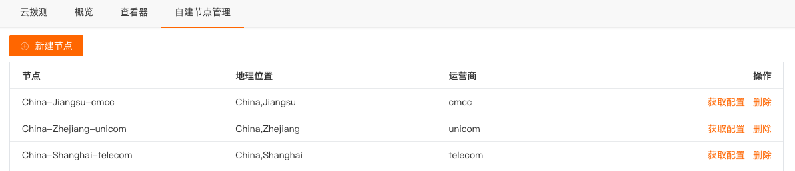

#### Added Process, Application Performance Monitoring, and User Access Monitoring Check Rules

«Process Anomaly Detection» is used to monitor process data within the workspace, supporting setting alert triggers for one or more fields in process data. For example: you can set alerts based on the 'host' field being 'izaqbin' and the 'state' field being 'sleep' appearing a certain number of times.

«User Access Metric Detection» is used to monitor metric data in «User Access Monitoring» within the workspace. By setting threshold ranges, alerts are triggered when metrics reach the threshold, supporting setting alerts for individual metrics and customizing alert levels.

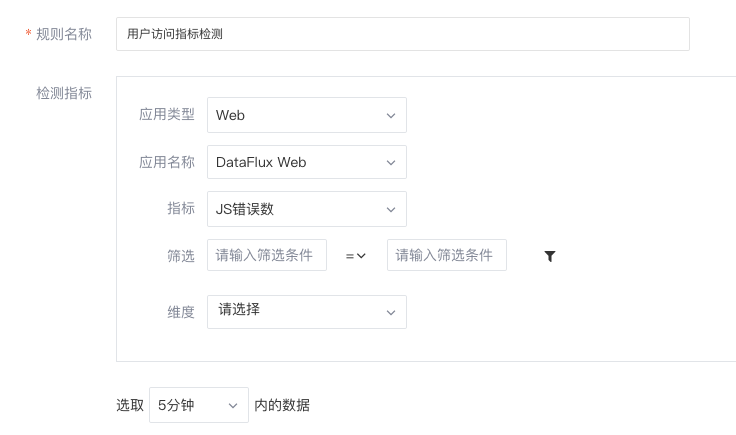

«Application Performance Metric Detection» is used to monitor metric data in «Application Performance Monitoring» within the workspace. By setting threshold ranges, alerts are triggered when metrics reach the threshold, supporting setting alerts for individual metrics and customizing alert levels.

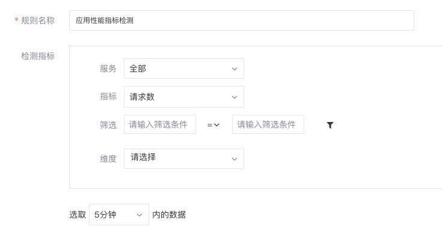

#### Optimized Integration

Login to the DataFlux workspace and enter the «Integration» page to view all supported collectors. You can also click the "Quick Get DataKit Installation Command" in the top-right corner to directly obtain DataKit installation instructions for installation. After installation, you can start more collectors to collect data metrics.

#### Optimized Log Metric Generation

Log Metric generation added selecting log sources, allowing you to generate Metrics by selecting log sources, filtering logs, configuring dimensions, aggregation frequencies, defining Metric sets, Metric names, and aggregation rules. [Learn More About Log Metric Generation]

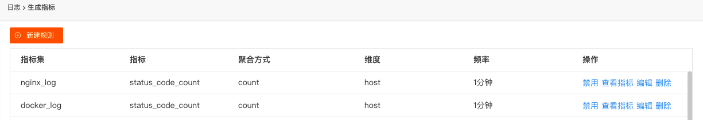

#### Optimized Log Viewer

After log data is collected in DataFlux, you can view all log sources and their contents in the «Log» section of the DataFlux Studio console. It supports viewing required log details by searching log sources.

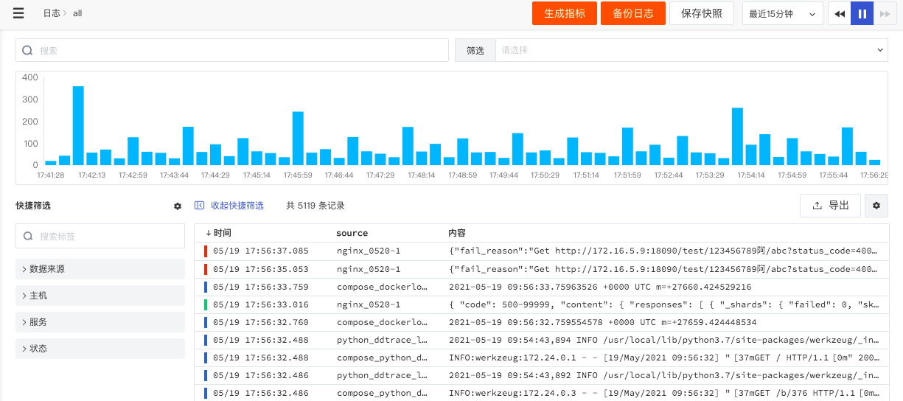

#### Optimized User Access Monitoring Viewer

On the «Performance» page of the user access monitoring details, you can view front-end page performance, including page loading time, content rendering time, interaction time, input delay, etc. For example, in the figure below, the LCP (largest content paint time) indicator reached 5.43 seconds, while the recommended time is within 2.5 seconds, indicating slow page loading requiring optimization. It supports filtering and searching to help users quickly locate resources and content.

Switching to «Link» allows you to view requests sent to the back-end application, including the occurrence time, content, and duration of invoked resources. For example, you can view every ajax request returned by the xhr object.

Switching to «Error» allows you to quickly locate front-end errors through detailed information, including error messages, error types, and occurrence times.

#### Optimized Built-in Views

Built-in views are divided into system views and user views, applicable in scenarios.

System views provide integrated view templates already provided by the system, supporting modifications, exports, and restorations. Users can directly «Export» system views or «Modify» system views. By «Restoring» system views, modified system views can be converted back to original system views. After restoration, it cannot be recovered. 

User views are user-defined views saved as templates, supporting modifications, exports, and deletions. In «Built-in Views»-«User Views», clicking «Create User View» allows you to create user-defined view templates. Specific configurations can refer to Scenarios and Views. 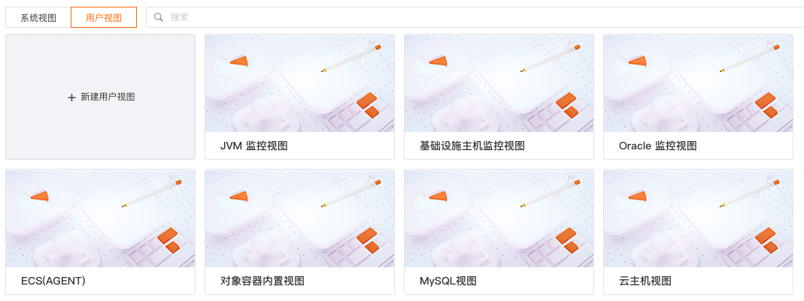

#### Optimized Chart Lock Time

Support locking the time range for charts on dashboard views, unaffected by the global time component. After successful settings, the top-right corner of the chart will display the user-set time, such as «xx minutes», «xx hours», «xx days».

#### Optimized Nested Functions

All chart components' nested functions have been optimized into built-in functions, no longer calling DataFlux Func functions, implemented via DQL, removing the time interval options for nested functions.

## May 7, 2021

### DataFlux Studio

#### Added Log Backup

Basic logs in DataFlux can be stored for up to 60 days. If longer storage and viewing are required, log backups are needed. DataFlux supports storing log backups for up to 720 days.

Entering the «Log»-«Backup Log» page, the default data is empty. Selecting a time range allows you to view the corresponding backup logs. DataFlux supports querying and analyzing logs by selecting a time range, searching keywords, and filtering.

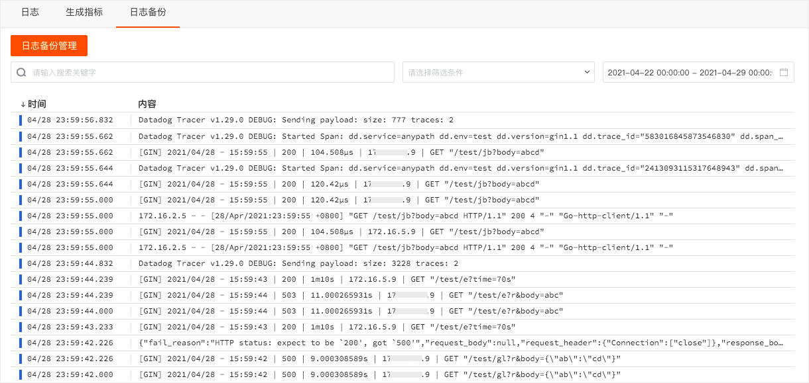

#### Added Security Checks

DataFlux supports timely monitoring, querying, and associating all inspection events through «Security Checks». In discovering vulnerabilities, abnormalities, and risks in real-time, it helps enhance inspection quality, problem analysis, and problem resolution abilities.

Before starting security checks, you need to install [DataKit] and [security-checker], and configure accordingly to enter «Security Checks» and query and analyze by selecting a time range, searching keywords, and filtering.

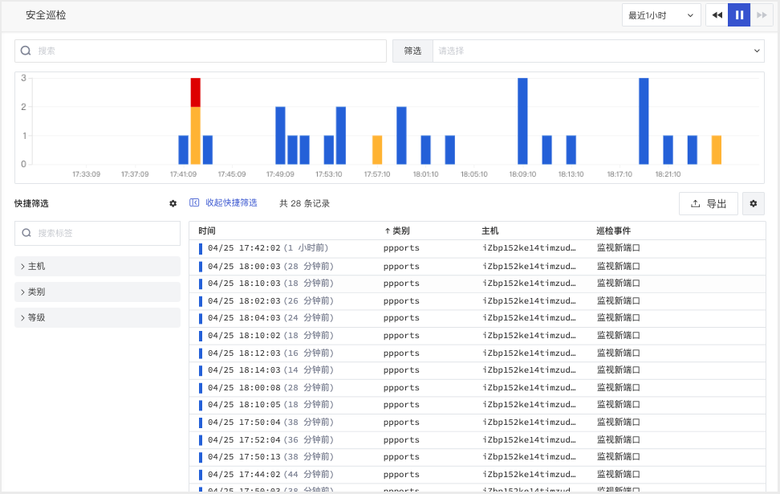

#### Added New User Guidance

Upon first registering and logging into DataFlux, you can initiate DataFlux usage through guided steps. According to the guidance steps, users can independently complete DataKitinstallation, NGINX data collection, and view corresponding data in logs. After closing the new user guidance, you can reopen it by clicking on the user name in the workspace - «New User Guidance».

#### Added Bar Chart Group Stacking Display

**Chart Stacked Bar Chart**

Bar charts support [Metric stacking] and [group stacking], default off, enabling after activation defaults to [Metric stacking]. The right side shows an "option" containing default and percentage.

- Metric stacking: Compare grouped tag data dimensionally stacked by Metric.
- Group stacking: Compare Metric data dimensionally stacked by grouped tags.

**Event Viewer Stacked Bar Chart**

DataFlux supports viewing statistics of different events at different time points via stacked bar charts.

#### Added Tencent Cloud, AWS Cloud Host Details

If the host is a cloud host and «Cloud Association» is configured, clicking the host name in the list draws out the «Cloud Vendor Information» of the cloud host object, including cloud platform, instance name, instance ID, instance specifications, region, availability zone, creation time, network type, billing type, IP address, etc.

#### Added Host Operation Integration

Host integration operation status has three states: normally running integrations, normally running with built-in monitoring views, and errored integrations:

- Normally running integrations have no reaction upon clicking
- Built-in monitoring views for integrations drop down "View Monitoring View" upon clicking, allowing you to view the corresponding monitoring view.

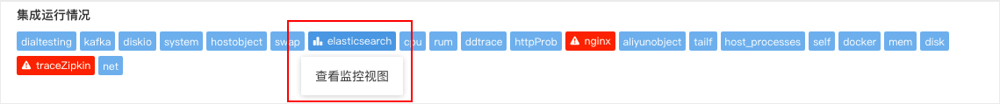

- Errored integrations allow you to view the last error feedback information upon clicking.

#### Added Correlation Analysis Built-in Pages

- Infrastructure hosts added process and container built-in pages
- Logs added process and link built-in pages
- Links added host monitoring views and log built-in pages

#### Optimized Application Performance Monitoring Topology Chart

In the «Application Performance Monitoring» «Service» list, you can switch the list to topology chart mode to view the call relationships between various services.

- Added selecting time range based on timeline
- Added zooming in/out of topology charts, showing a small thumbnail in the bottom-left corner when zoomed in
- Added three node size dimensions
- Added highlighting selected service, other services and connections turn gray upon selection

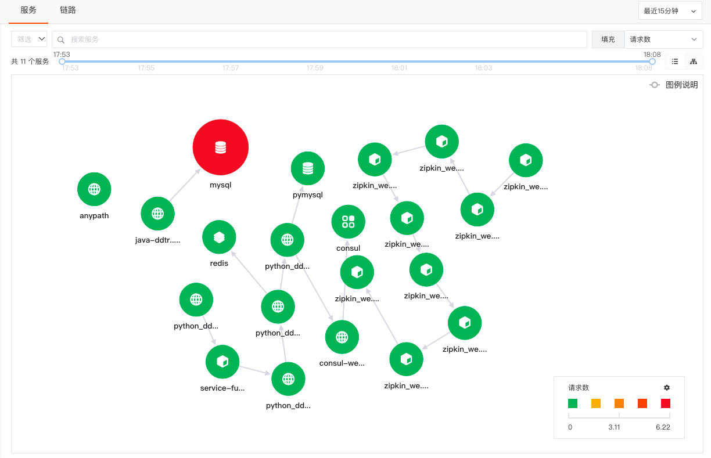

#### Optimized Operation Events and Notification Events

- Operation events moved to «Management»-«Basic Settings»-«Security Audit», click "View" to see operational security events.
- Notification events moved to the left menu «Notifications», click "Notifications" to view all notification events.

#### Optimized Paid Plans and Bill Usage Statistics Views

- Paid plans and bill usage statistics views added log backup statistics

## April 15, 2021

### DataFlux Studio

#### Enabled New DataFlux Logo

Adopted a robot brain style, not only having a strong technological sensory, but also highlighting DataFlux's powerful capabilities in massive data integration, processing, and analysis, like a robot capable of real-time, rapid, and infinitely expandable operations, providing easy-to-use and flexible visualization charts for data analysis and business operation analysis, enhancing operational efficiency.

#### Added Cloud Testing

DataFlux provides users with out-of-the-box cloud testing solutions, supporting HTTP protocol testing, utilizing globally covered monitoring networks to end-to-end track webpage and application performance, recording real-time feedback information for all tests, providing DNS, SSL, TTFB, etc., performance test results, helping you identify and locate problems in advance, improving user experience.

DataFlux cloud testing supports analyzing response time and availability rates of current testing tasks from geographical and trend dimensions.

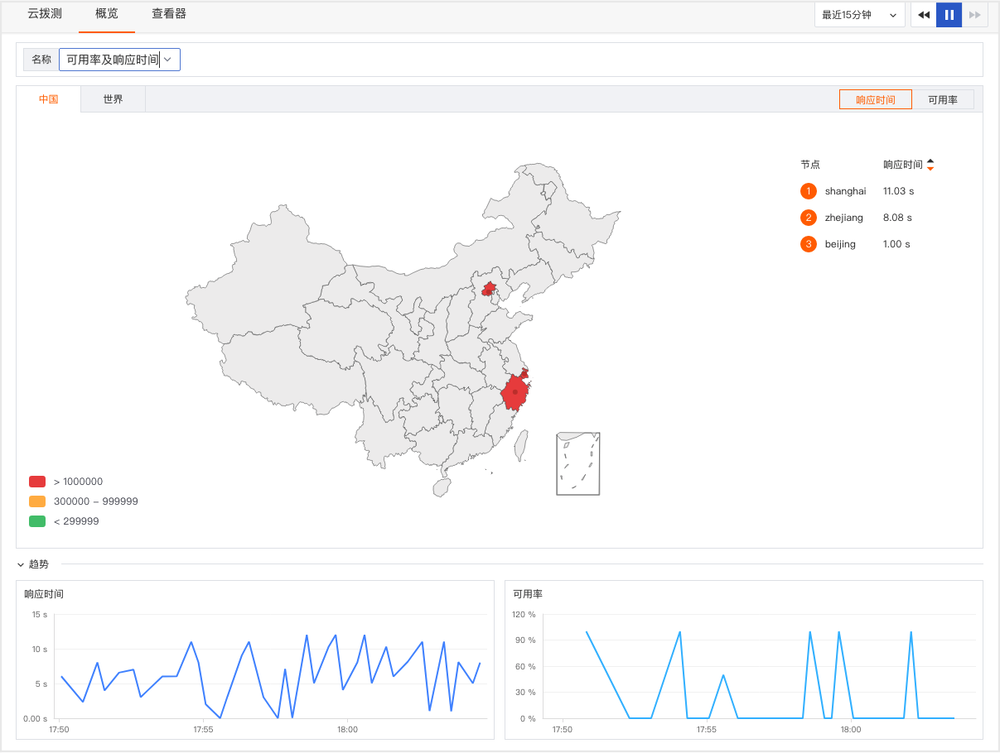

#### Added Container Object Distribution Chart

[Container objects] added honeycomb distribution charts. In the container list page, you can switch to the container distribution chart display by clicking the icon on the left side of the list. Through the distribution chart, you can visually query container distribution information. The distribution chart supports the following functions:

- Search: Input search keywords
- Filter: Filter tags and select filtered objects, multiple selections allowed
- Group: Display objects grouped by groups, multiple selections allowed
- Fill: Select fill Metrics, the size of the Metric value determines the color of the filled legend.
- Fill Rule: Fill the legend color based on the result of the fill Metric. Divide the maximum and minimum values of the Metric into five equal parts, resulting in five intervals, each corresponding to five colors.

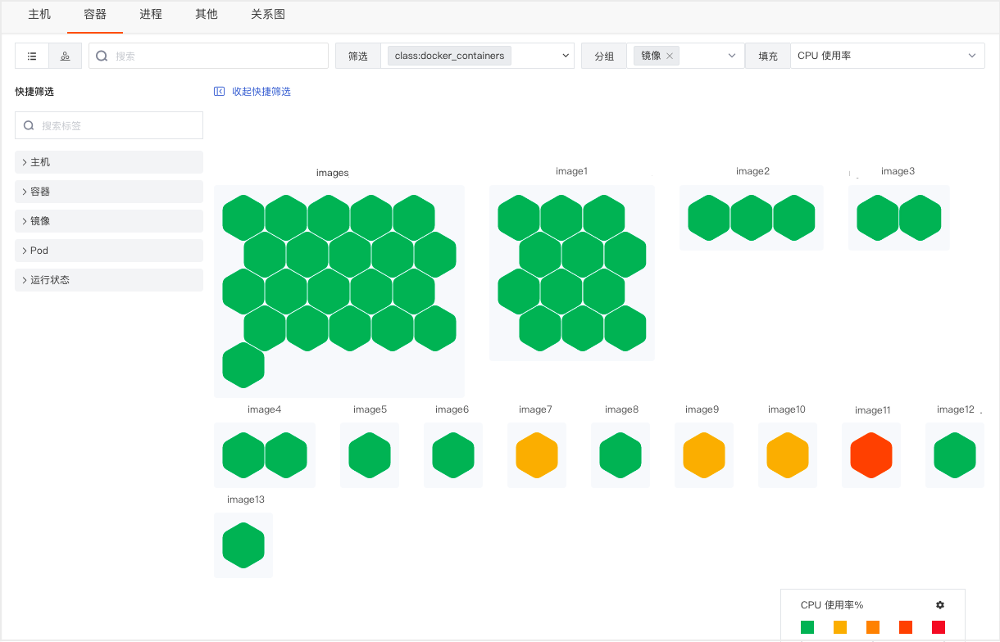

#### Added Alibaba Cloud Cloud Host Details

If the host is a cloud host and «Cloud Association» is configured, clicking the host name in the list draws out the «Cloud Vendor Information» of the cloud host object, including cloud platform, instance name, instance ID, instance specifications, region, availability zone, creation time, network type, billing type, IP address, etc.

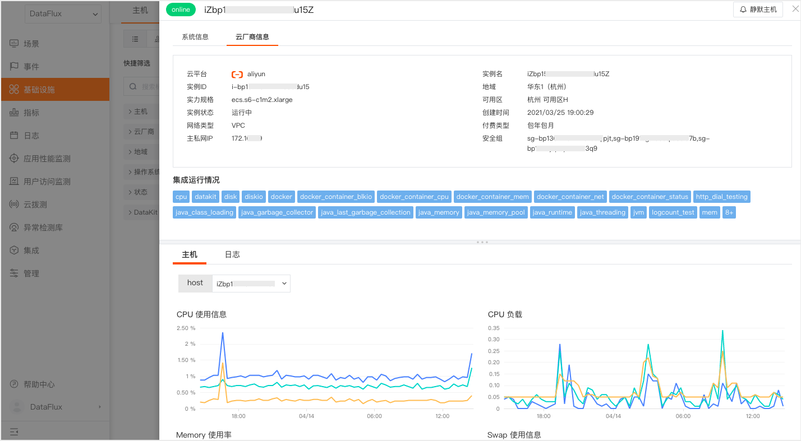

#### Added Table Chart Metric Sorting

Table charts support Metric sorting, defaulting to sorting by the first queried Metric. Clicking the table header switches ascending/descending order, synchronizing adjustments in Top/Bottom within the query; clicking other queried Metrics for sorting synchronizes adjustments in Top/Bottom within the query.

#### Added Link Quick Filter Item «Duration»

- Default progress bar minimum and maximum values are the smallest and largest durations in the [link] data list
- Supports adjusting maximum/minimum values by dragging the progress bar, with input box values changing synchronously
- Supports manually entering maximum/minimum values, pressing "Enter" or "Click outside the input box" to filter and search
- Input boxes turn red when input is irregular, preventing searches, correct format: pure "number" or "number+ns/μs/ms/s/min"
- If no unit is entered during search, "s" is automatically appended to the entered number before filtering and searching
- If units are manually entered, direct searches occur

#### Added Email Groups

Added email group notification objects in [Notification Objects]. Email groups can add multiple members simultaneously. After adding, select this email group in the "Alert Settings" of the anomaly detection library to send alert emails to all added member emails simultaneously.

#### Optimized Anomaly Detection Library

DataFlux includes various built-in detection libraries, ready-to-use. Supports multiple built-in detection libraries such as hosts, after activation, receiving related anomaly event alerts.

In «Detection Library», supports «Import/Export Detection Libraries». After configuring all detection rules, you can export the detection library via JSON files. Exported detection libraries can be imported into other detection libraries. When importing detection libraries, it verifies whether duplicate detection items exist, allowing «Replace» or «Skip» options.

#### Optimized Object Viewers and Details

- Host objects added operating system small icon display
- Container objects added container type small icon display
- Process slide-out details page added «Start Time» display

#### Optimized Data Storage Strategy, Paid Plans, and Bills

- Basic information in workspace management added change data storage strategy
- Workspace management usage statistics optimized into paid plans and bills

## April 7, 2021

### DataFlux Studio

#### Added View Variable Object Mapping

When using «Object Mapping», you must first define a view variable based on object class fields. After configuring object mapping in «View Variables», you need to use the mapped label fields as grouping in «Chart Queries» and enable «Field Mapping» in «Chart Settings». Then, you can view the set object mapping display in the view chart.

#### Optimized Event Grouping

DataFlux supports grouping and aggregating related events under «Anomalous Events» according to «Detection Items». Clicking to view «Aggregated Events» allows quick viewing of associated event lists, abnormal event status distributions across different hosts, and Metric monitoring, etc. Abnormal event status distributions include `critial`, `error`, `warning`, `ok`, and `Mute`, corresponding to five status colors. The base color is green, filling corresponding status colors backward from the event occurrence time point. The fill range corresponds to the detection frequency. If «host» exists in the group and host muting is set, the mute time range is displayed in gray.

#### Optimized Detection Item Queries

«Anomaly Detection Library»'s «Detection Rules»'s «Detection Metrics» only allow adding one query by default, supporting switching between «Simple Query» and «Expression Query». Uniformly changed the «Trigger Conditions» of «Detection Rules» from `M1` to `Result`; supports adding `AS` aliases to queries.
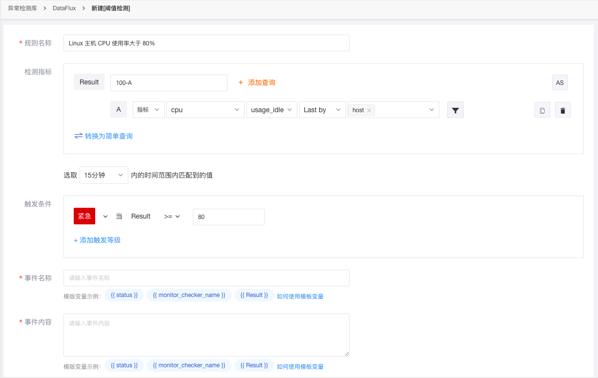

### DataKit (v1.1.4-rc2)

- Fixed frequent data collection by Aliyun monitoring data collector (aliyuncms) causing some other collectors to freeze.

## March 25, 2021

### DataFlux Studio

#### Added Cloud Service Association

DataFlux supports centrally managing AccessKey information for cloud service accounts through «Cloud Association». After configuration, you can regularly synchronize cloud host information under the associated cloud account in [Infrastructure-Host], displaying all cloud host information, such as CPU, memory, network, disk, etc.

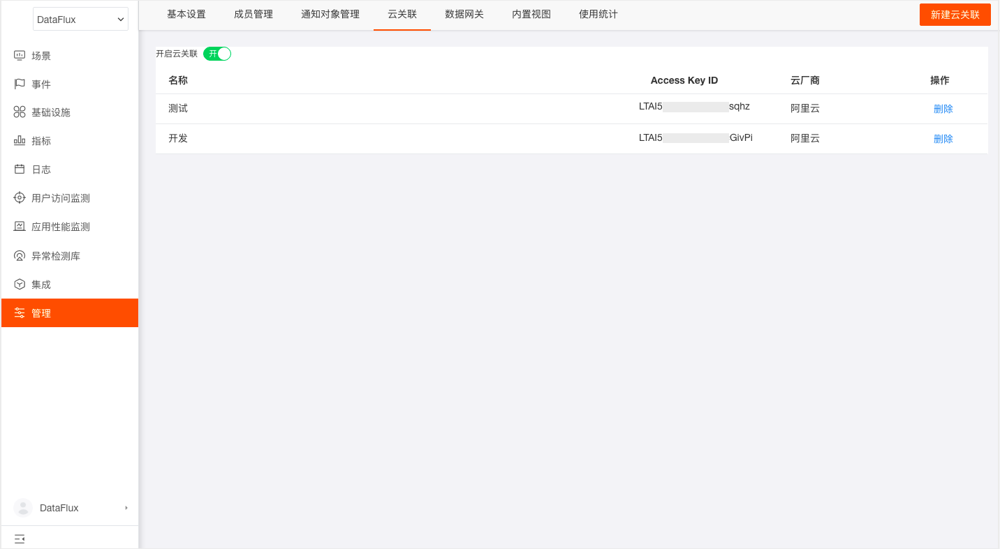

If you no longer need the association, you can delete the linked Alibaba Cloud RAM sub-account AK information. Deleting the association triggers an association invalidation notification event, which can be viewed in «Events»-«Notification Events». For more details on cloud associations, refer to the documentation on cloud associations.

#### Added Operation Event Auditing

DataFlux supports auditing operation events in workspaces, storing operation events uniformly in **Events**-«Operation Events».

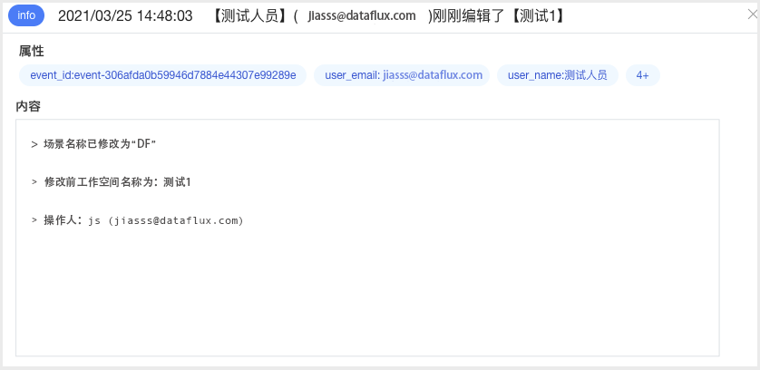

#### Added Host Muting

If you need to perform operations such as stress testing on a single cloud host, which would trigger frequent alerts, you can temporarily enable the host muting function. In «Infrastructure»-«Host», click the cloud host details to select the host muting time.

All muted hosts can be viewed in «Anomaly Detection Library»-«Host Mute Management». After deleting a muted host, you can receive alert notifications for the corresponding host again.

#### Added Notification Object: WeCom Bot

DataFlux supports users managing notification objects sending alerts, currently supporting adding emails, DingTalk bots, WeCom bots, and Webhook customizations.

#### Optimized Event Viewer, Added Event Group Aggregation Viewing

In the event list Viewer, through grouping functions, DataFlux supports quickly aggregating and statistically analyzing related events based on group labels. For example, in «Anomalous Events», based on "Detection Item" grouping, you can quickly obtain all events triggered by that detection item. By switching to the aggregated event list, you can view the details of these events.

#### Optimized Link Service Filtering and Topology Charts

In the «Application Performance Monitoring» «Service» list, you can switch the list to topology chart mode to view the call relationships between various services. It supports filtering displays based on different performance Metrics and customizing link service performance Metric color ranges.

#### Other Optimized Functions

- Supported object mapping in view variables
- Events grouped by detection items show aggregation-related events
- Detection rule queries allow only one simple query by default, supporting switching between simple queries and expression queries
- Unified trigger condition `M1` modified to `Result` in detection rules
- Supports adding `AS` aliases to queries

### DataKit (v1.1.4-rc2)

- Fixed frequent data collection by Alibaba Cloud monitoring data collector (aliyuncms) causing some other collectors to freeze.

## March 25, 2021

### DataFlux Studio

#### Added Cloud Service Association

DataFlux supports centrally managing AccessKey information for cloud service accounts through «Cloud Association». After configuration, you can periodically synchronize cloud host information under the associated cloud account in [Infrastructure-Host], displaying all cloud host information such as CPU, memory, network, disk, etc.

If you no longer need the association, you can delete the associated Alibaba Cloud RAM sub-account AK information. Deleting the association triggers an association invalidation notification event, which can be viewed in «Events»-«Notification Events». Refer to the documentation on cloud associations for more details on cloud associations.

#### Added Operation Event Auditing

DataFlux supports auditing operation events in workspaces, storing operation events uniformly in **Events**-«Operation Events».

#### Added Host Muting

If you need to perform operations such as stress testing on a single cloud host, which would trigger frequent alerts, you can temporarily enable the host muting function. In «Infrastructure»-«Host», click the cloud host details to select the host muting time.

All muted hosts can be viewed in «Anomaly Detection Library»-«Host Mute Management». After deleting a muted host, you can receive alert notifications for the corresponding host again.

#### Added Notification Object: WeCom Bot

DataFlux supports users managing notification objects sending alerts, currently supporting adding emails, DingTalk bots, WeCom bots, and Webhook customizations.

#### Optimized Event Viewer, Added Event Group Aggregation Viewing

In the event list Viewer, through grouping functions, DataFlux supports quickly aggregating and statistically analyzing related events based on group labels. For example, in «Anomalous Events», based on "Detection Item" grouping, you can quickly obtain all events triggered by that detection item. By switching to the aggregated event list, you can view the details of these events.

#### Optimized Link Service Filtering and Topology Charts

In the «Application Performance Monitoring» «Service» list, you can switch the list to topology chart mode to view the call relationships between various services. It supports filtering displays based on different performance Metrics and customizing link service performance Metric color ranges.

#### Other Optimized Functions

- Optimized search and export for log, event, infrastructure, application performance monitoring, user access detection Viewers, added export to views. Optimized tag filtering, associated query analysis on log, event, link, infrastructure-container, infrastructure-process detail pages.
- Optimized time components, optimized scene view single-query charts (overview charts, dashboards, leaderboards) switching between simple queries and expression queries.
- Optimized offline display for hosts: when the host is offline, CPU usage rate, memory usage rate, load are not displayed, values filled with " - ".
- Optimized anomaly detection library detection rules, added water level detection, interval detection, and mutation detection.

### DataKit (v1.1.4-rc1)

- Added more information to the message field in the process collector for full-text search convenience.
- Host object collector supports custom tags for easier cloud attribute synchronization.

### DataKit (v1.1.4-rc0)

- Added file collector, probing collector, and HTTP message collector.
- Built-in support for ActiveMQ/Kafka/RabbitMQ/gin (Gin HTTP access logs)/Zap (third-party logging framework) log cutting.
- Enriched [http://localhost:9529/stats] page statistics information, adding collection frequency (n/min), data size per collection, etc.
- DataKit itself added some cache space (invalidated on restart), avoiding data loss due to occasional network issues.
- Improved Pipeline date conversion functions for better accuracy. Added more Pipeline functions (parse_duration()/parse_date()).
- Trace data added more business fields (project/env/version/http_method/http_status_code).
- Various detailed improvements to other collectors.

## March 4, 2021

### DataFlux Studio

#### 1. Optimized Time Series Chart, Bar Chart, Leaderboard, Log Stream Chart, Alert Statistics Chart, Object List Chart

- Time Series Chart: Added «Display Density», including «Low: 60 points», «Low: 180 points», «Medium: 360 points», «High: 720 points». Added «Stacked Display», supporting only bar charts, default off.
- Leaderboard: Chart display optimization
- Bar Chart: Chart display optimization
- Log Stream Chart: Added search box, supporting searching message content
- Alert Statistics Chart: Query display optimization
- Object List Chart: Query display optimization

#### 2. Added Automatic Unit Conversion

- Default query result values automatically convert units following «Scientific Notation K, M, B», retaining two decimal places (1 thousand = 1K, 1 million = 1M, 1 billion = 1B)
- RMB automatically converts units «Yuan, Ten Thousand Yuan, Hundred Million Yuan», retaining two decimal places
- After setting units, scientific notation is canceled, displaying according to user-set units

#### 3. Added Object Management

DataFlux supports users managing notification objects sending alerts, currently supporting adding DingTalk bot notification configurations and Webhook custom notification configurations.

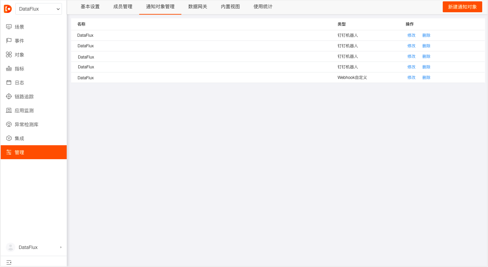

#### 4. Adjusted Event, Log, Trace, Application Monitoring, Object Host, Object Container, Object Process, Other Object Viewers, Supporting CSV Document Export, Maximum Support Exporting Last 5000 Data Entries.

- Events

DataFlux supports collecting all event data generated based on the «Anomaly Detection Library». Users can view and search all event data within the workspace on the **Events** page.

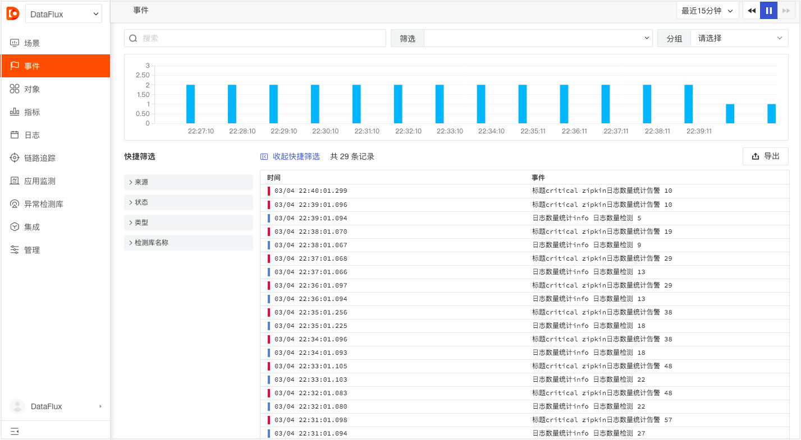

- Object Host

DataFlux supports collecting object host data. In the host list under «Object», you can view and search all host object data information.

Clicking the host name in the list draws out the details page to view detailed information about the host object, including basic information, CPU, memory, network, hard disk, etc.

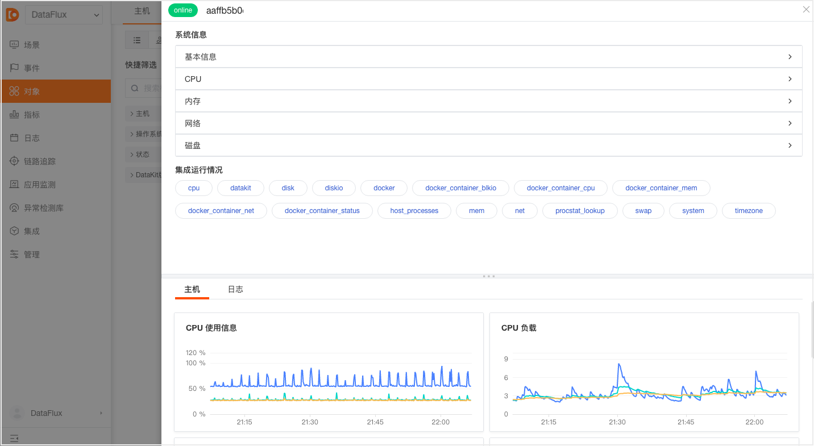

- Object Container

DataFlux supports collecting object container data. In the container list under «Object», you can view and search all container object data information. Clicking the container name in the list draws out the details page to view detailed information about the container object.

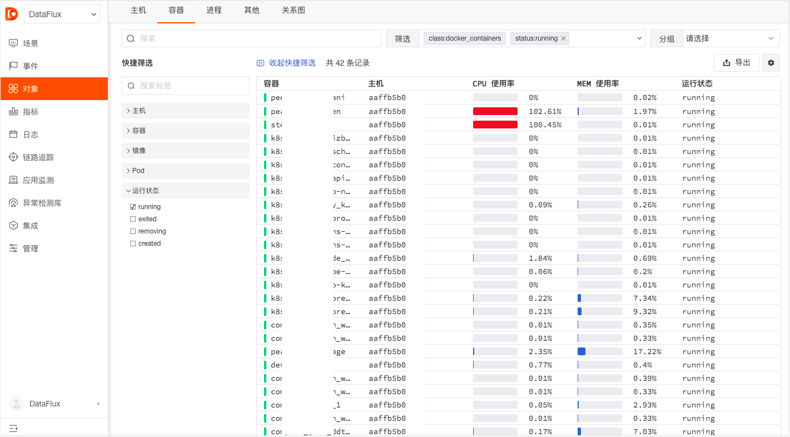

- Object Process

DataFlux supports collecting object process data. In the process list under «Object», you can view and search all process object data information. Clicking the process name in the list draws out the details page to view detailed information about the process object.

- Other Objects

DataFlux supports collecting other object data, such as Alibaba Cloud ECS, etc. In the other list under «Object», you can view and search all other object data information. Clicking the other object name in the list draws out the details page to view detailed information about the other object.

- Logs

DataFlux supports collecting various formats of log data, including system logs, Nginx logs, Apache logs, among others, allowing quick viewing and analysis of all log data within the current workspace.

- Trace Monitoring

DataFlux supports viewing service links and trace lists in «Trace Monitoring». In the service list, you can view or search all services receiving trace data. In the trace list, you can query trace data, export trace data, view trace details, and fully analyze trace performance through flame graphs and span lists.

DataFlux supports both light and dark themes, here shown as an example with the dark theme.

**Service List**

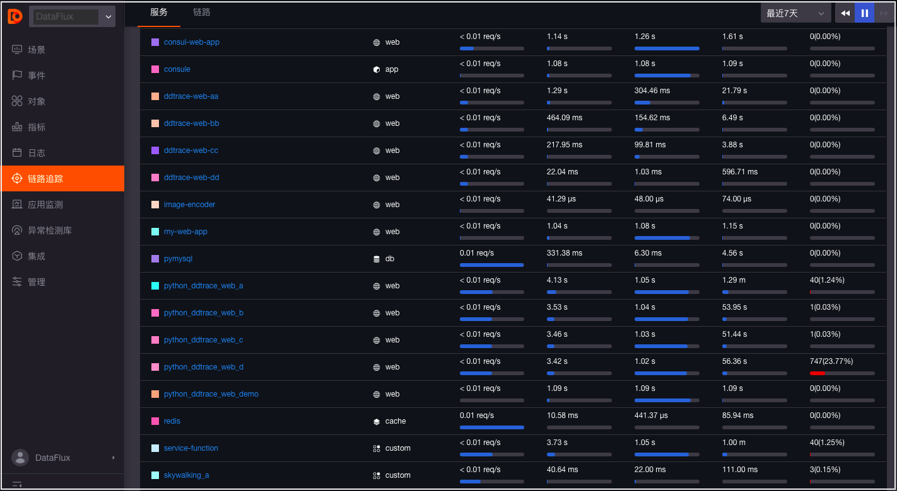

**Trace Topology**

**Trace List**

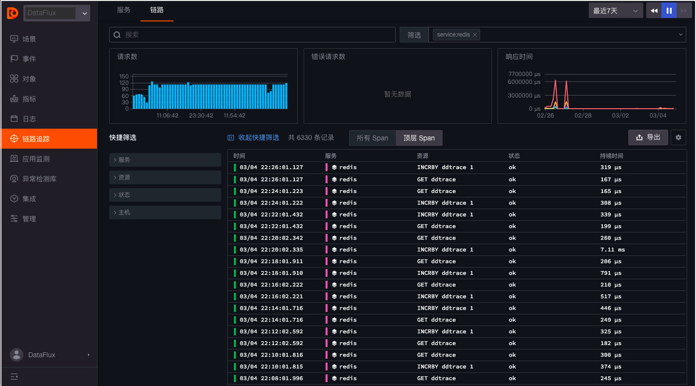

**Flame Graph**

- Application Monitoring

DataFlux supports collecting Web, Android, iOS, and mini-program application data and provides application monitoring scenarios, allowing quick viewing and analysis of application conditions. Taking Web applications as an example:

**Web Viewer**

**Web Application Details**

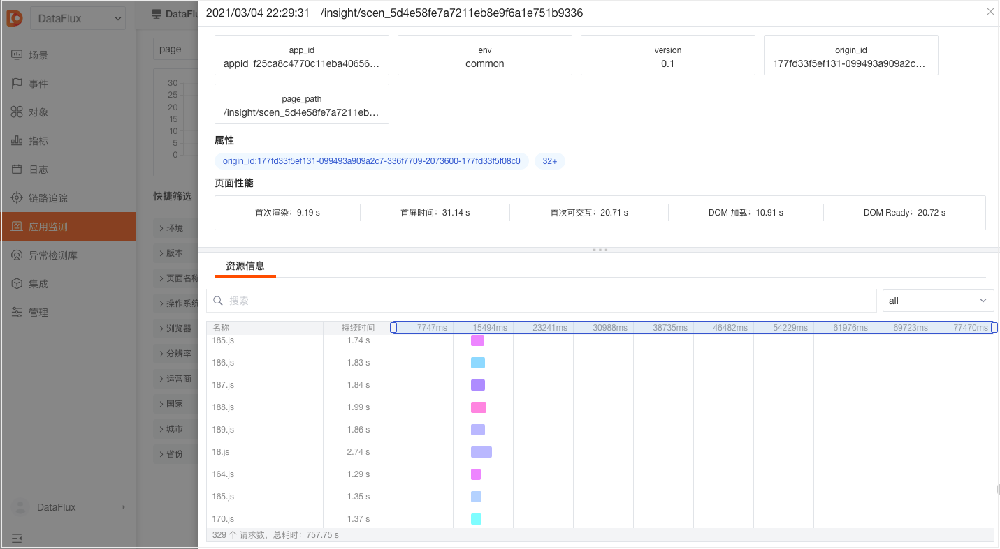

## February 2, 2021

### DataFlux Studio

- Added area chart style for time series charts
- Added host, container, process object viewers, added host honeycomb chart
- Optimized anomaly detection, added built-in detection libraries
- Optimized event, object, log, trace, application monitoring, object host, object container, object process, other object viewers, supporting exporting CSV documents, maximum support exporting the last 5000 data entries.

- Events

DataFlux supports collecting all event data based on «Anomaly Detection Library». Users can view and search all event data within the workspace on the **Events** page.

- Object Host

DataFlux supports collecting object host data. In the host list under «Object», you can view and search all host object data information.

Clicking the host name in the list draws out the details page to view detailed information about the host object, including basic information, CPU, memory, network, hard disk, etc.

- Object Container

DataFlux supports collecting object container data. In the container list under «Object», you can view and search all container object data information. Clicking the container name in the list draws out the details page to view detailed information about the container object.

- Object Process

DataFlux supports collecting object process data. In the process list under «Object», you can view and search all process object data information. Clicking the process name in the list draws out the details page to view detailed information about the process object.

- Other Objects

DataFlux supports collecting other object data, such as Alibaba Cloud ECS, etc. In the other list under «Object», you can view and search all other object data information. Clicking the other object name in the list draws out the details page to view detailed information about the other object.

- Logs

DataFlux supports collecting various formats of log data, including system logs, Nginx logs, Apache logs, and more, allowing quick viewing and analysis of all log data within the current workspace.

- Trace Monitoring

DataFlux supports viewing service traces and trace lists in «Trace Monitoring». In the service list, you can view or search all services receiving trace data. In the trace list, you can query trace data, export trace data, view trace details, and fully analyze trace performance through flame graphs, span lists, etc.

DataFlux supports both light and dark themes, here shown as an example with the dark theme.

**Service List**

**Trace Topology**

**Trace List**

**Flame Graph**

- Application Monitoring

DataFlux supports collecting Web, Android, iOS, and mini-program application data and provides application monitoring scenarios, allowing quick viewing and analysis of application conditions. Taking Web applications as an example:

**Web Viewer**

**Web Application Details**

## February 2, 2021

### DataFlux Studio

- Added area chart style for time series charts
- Added object host, container, process, added host honeycomb chart
- Optimized anomaly detection, added built-in detection libraries
- Optimized event, object, log, trace, viewer, and page functions
- Optimized log stream chart queries
- Optimized leaderboard, dashboard, overview chart queries, added expression query mode
- Optimized visualization chart queries, supporting switching between simple queries and DQL queries
- Optimized grouping logic, including scatter plots, bubble charts, maps, honeycomb charts, table charts
- Optimized filtering conditions supporting real-time filtering

### DataKit

- Added host object data collection
- Added container object data collection
- Added process object data collection 

## January 14, 2021

### DataFlux Studio

- Added Explorer layout, optimized data structure, supporting object/link/RUM/log module queries/analysis
- Added mini-program application monitoring
- Added time series charts, chart types can choose line charts or bar charts
- Adjusted chart UI
- Adjusted log stream chart queries and settings
- Optimized bar chart, leaderboard, table chart related settings
- Threshold detection adjusted to DQL UI query mode