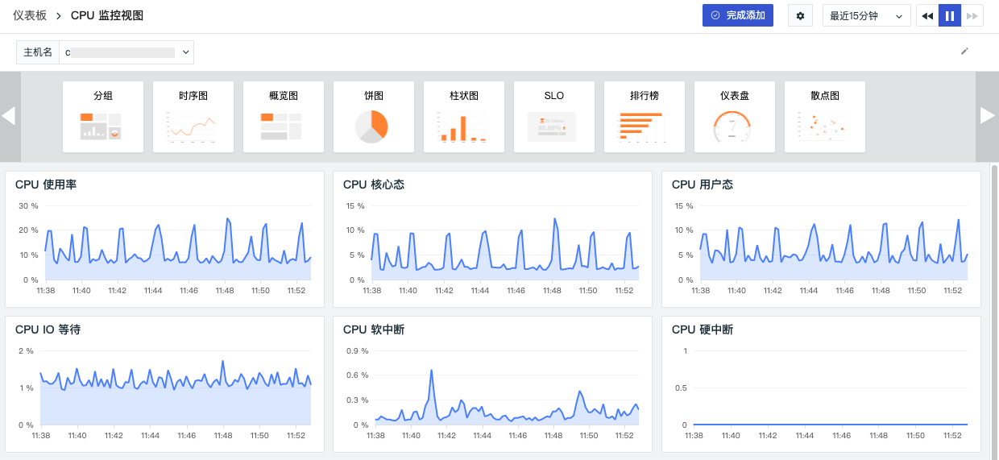

# Change Log (2021)
---

This document records the update content of each release of <<< custom_key.brand_name >>>, including DataKit, <<< custom_key.brand_name >>> best practices, <<< custom_key.brand_name >>> integration documents, and <<< custom_key.brand_name >>>.

## December 30, 2021

#### Optimized Binding of Built-in Views

<<< custom_key.brand_name >>> supports associating built-in views with different link services, applications, log sources, projects, etc., by binding fields. Based on the bound fields, you can view the associated built-in views (system views, user views) on the corresponding Explorer detail page. Supported Explorers include scenario custom Explorers, infrastructure, logs, traces, RUM PV, Security Check, Synthetic Tests, etc.

#### Optimized Log Explorer

- In the Log Explorer, the left-side source list is expanded by default upon first login and can be manually collapsed; the Explorer will remember the last state by default.
- In the Log Explorer, click the settings button on the left to manually add filter fields for quick filtering.
- In the log data list, you can use "hover" over the log content to expand and view all the log content. Clicking the "copy" button can copy the entire log content to the clipboard. When expanding, if possible, the system will format the log JSON, otherwise it will display the log content normally.

#### Optimized Associated Display on Explorer Detail Pages

The associated display on detail pages of log, infrastructure, trace, Security Check Explorers has been optimized, including host, Metrics, trace, container, Pod, etc. It supports two types of associated displays: fixed display and non-fixed display (which requires displaying associated queries based on whether they contain associated fields).

Taking the Log Explorer detail page as an example, the associated field is "host". To view related hosts in log details, the "host" field needs to match; otherwise, you cannot view related host pages in log details. After field matching, you can view basic information and performance status of the host under associated hosts.

- Attribute View: Includes basic host information, integration operation status, and cloud provider information if cloud host collection is enabled.

- Metrics View: You can view the CPU, memory, and other performance metrics of the related host within the default 15 minutes. Click 「Open this view」 to go to the built-in view where you can customize and modify the host view via cloning and save it as a user view that can be viewed by binding it on the log detail page.

#### Optimized Snapshot Sharing

Snapshot sharing supports hiding the top bar on the sharing page. In the snapshot list, clicking the share button allows you to perform advanced settings like "hide top bar" in the pop-up dialog box.

#### Optimized Thousand Separator in Chart Query Results

<<< custom_key.brand_name >>> dashboard chart query results support automatically adding thousand separators for display. If units are set, data formats are displayed according to the set units. After setting is complete, you can preview the changes.

#### Other Optimizations

- Optimized network topology query performance for host networks, added target domain name display in network topology nodes. That is, if the target host is not in the current workspace but the target domain exists and its port is less than 10000, the target domain will be displayed on the topology map.
- Optimized logic for pinning scene dashboards and notes:
   - Unpinned dashboards are sorted in reverse chronological order
   - Pinned dashboards are sorted in reverse chronological order based on when they were pinned
   - Pinned dashboards appear above unpinned ones
- Optimized cascading query logic for view variables, i.e., when two variables are linked for querying, selecting `*` for the first variable does not apply any filters, showing all value options.
- Added help documentation links to the collapsed navigation bar on the left side.

## December 16, 2021

#### Added Similarity Metric Queries in Time Series Charts

In time series charts' analysis mode, it supports selecting "chart query" as metric trend lines/columns to "view similar trend metrics". By selecting an absolute time range, you can query similar metric trends within the space.

#### Added Associated Data Statistics Display on Explorer Detail Pages

Added statistics display for related logs, traces, containers, etc., lists on Explorer detail pages. It supports directly obtaining statistical data from the tab titles on the Explorer detail page, including infrastructure, logs, APM, RUM PV, Security Check, etc. Explorers.

#### Added Export Function for Explorer Charts

<<< custom_key.brand_name >>> supports exporting any chart from the <<< custom_key.brand_name >>> space Explorer to dashboards, notes, or clipboard.

#### Added Match Search in Explorer Search Bar

<<< custom_key.brand_name >>> supports using fields to filter and perform `wildcard` searches in the Explorer search bar, such as "host:cc*" format for filtering host log data starting with consistent naming. Additionally, a "delete" icon is added to the right side of the Explorer search bar, allowing one-click deletion of entered text.

#### Optimized Log Explorer and Associated Data Queries

- Through the "Container" section below the log detail page, you can view all container (Container) data related to the log's host within the last ten minutes.
- Logs detail page related trace and container data support filtering by "trace_id" or "host".
- Log detail page content display supports both JSON and text viewing modes, automatically formatted based on the message type.
- Through approximate text Explorer, you can view detailed logs associated with Pattern clustering.
- Removed color from hover tips in the Log Explorer.

#### Optimized Silence Policy, Supporting Mute Settings for Monitors

<<< custom_key.brand_name >>> supports users managing all mute rules in the current space through "Mute Management" under the "Monitoring" feature. <<< custom_key.brand_name >>> provides three types of mutes: host mute, monitor mute, and group mute, supporting mute management for different hosts, monitors, and groups, ensuring that muted objects do not send alert notifications to any notification targets during the mute period.

#### Optimized Monitor Management

Duplicate monitors in the monitor list can affect users' quick location of monitoring objects. <<< custom_key.brand_name >>> supports choosing whether to create duplicate monitors from templates. Additionally, users can manage monitors in bulk through the new "Batch Management" tool, customizing export/delete operations for monitors.

#### Optimized View Variable Query Display

- Dashboard view variables now have default values, supporting previewing all current view variables and selecting initial variables to view by default on the dashboard.
- Supports adjusting the order of view variables by dragging them with mouse hover (hover).
- Removed the "Settings" button for view variables, allowing direct use of "Sort", "Hide", and "Delete" functions in the view variable list.

#### Optimized Lock Time Setting for Dashboards and Notes

<<< custom_key.brand_name >>> supports adding "More" options to lock time settings for dashboards and notes, allowing custom lock time ranges. After this optimization, the lock time component and chart component functionalities remain consistent.

#### Optimized Help Center Entry

In <<< custom_key.brand_name >>> Help Center, you can quickly view product documentation, updates, blog posts, live stream reviews, and join official service groups by scanning QR codes.

## December 2, 2021

#### Added Owner Member Role

<<< custom_key.brand_name >>> has added an owner role for the current workspace. Currently, four types of workspace member permissions are supported: "Owner", "Administrator", "Standard Member", and "Read-only Member". These roles define different management, configuration, operation, and browsing permissions for various member categories. The "Owner" role has the highest operational permissions and can designate "Administrators" and perform arbitrary management, configuration, operations, and data browsing. In <<< custom_key.brand_name >>> workspaces, go to 「Manage」-「Member Management」-「Modify」 to edit and update member permissions.

#### Added Custom Explorer in Scenarios

<<< custom_key.brand_name >>> provides a quick-to-build Explorer based on log data ranges in scenarios, supporting space members to collaboratively build customized scenario-based Explorers to meet personalized viewing needs. Completed "Explorers" can be exported and shared with others, sharing Explorer templates.

#### Added Export User View to Dashboard

<<< custom_key.brand_name >>> supports exporting user views created in 「Built-in Views」 to JSON files, which can be used for importing into different workspace scenarios or built-in views.

#### Optimized Observable Host Network, Added Network Flow Data View List

<<< custom_key.brand_name >>> supports displaying different visual charts based on selected protocols on the "Network" page of the infrastructure 「Host」 detail page, and customizing the displayed fields of the network flow data list.

By clicking 「View Network Flow Data」, you can view the latest 2 days of network flow data by default, including time, source IP/port, destination IP/port, source host, transmission direction, protocol, bytes sent, etc. You can customize the displayed fields or add filter conditions to filter all string-type keyword fields.

#### Added Sourcemap Functionality

To prevent code leakage and ensure security during production releases, files are typically transformed and compressed. This process obscures error stack traces collected, making it difficult to locate issues and complicates subsequent bug fixing.

To address these issues, <<< custom_key.brand_name >>> provides sourcemap functionality for web applications, supporting the restoration of obfuscated code to facilitate easier error localization and faster problem resolution.

#### Added Analysis of Host-Associated Security Checks

<<< custom_key.brand_name >>> supports viewing Security Check data related to the host within the past day and performing keyword searches, multi-label filtering, and data sorting on this Security Check data.

#### Added Kubernetes Installation Guide for DataKit Collector

<<< custom_key.brand_name >>> supports adding a Kubernetes cluster installation guide for the DataKit collector in the workspace 「Integration」-「DataKit」.

#### Optimized Associated Trace Queries in User Access Monitoring

<<< custom_key.brand_name >>> supports adding attributes to the current filter or copying (copying the label to the local clipboard) on the trace detail page and user access performance detail page (RUM PV Explorer).

#### Optimized Registration and Upgrade Process

<<< custom_key.brand_name >>> added the option to choose to activate the <<< custom_key.brand_name >>> billing platform directly when registering an account and optimized the upgrade process to the Agile Plan after logging into the workspace.

#### Pricing Adjustment

<<< custom_key.brand_name >>> adopted the latest technology to optimize data storage costs, thus adjusting the pricing. A new tiered pricing model based on data storage policies was introduced, including log data, APM Trace, and RUM PV, three billing items.

Additionally, to assist enterprises in achieving more cost-effective and comprehensive observability of IT infrastructure and application systems, <<< custom_key.brand_name >>> launched three package plans based on different stages of enterprise development: Startup Acceleration Package, Entrepreneur Development Package, and Enterprise Standard Package, along with scalable traffic packages for enterprises to use according to their needs and stacking requirements.

#### Other Optimizations

- Added LCP, FID, CLS, FCP-related detection metrics for user access monitoring. In the <<< custom_key.brand_name >>> workspace 「Monitoring」-**Monitors**, click 「+Create Monitor」, select 「User Access Metrics Detection」, and enter the configuration page for detection rules.
- Changed grouping in simple queries of monitors to detection dimensions, which determine the dimension triggering the detection rule, i.e., the trigger object. <<< custom_key.brand_name >>> supports adding multiple detection dimensions, and any detection dimension meeting the alert condition triggers an alert.
- Optimized navigation menu display, presenting secondary menus at the top when the <<< custom_key.brand_name >>> workspace toolbar is collapsed.

## November 18, 2021

#### Added SSO Login

<<< custom_key.brand_name >>> supports creating identity providers for workspaces, allowing users to log in using their company email to obtain the corresponding SSO login link. By clicking the SSO login link, users can achieve corresponding authentication and login. In <<< custom_key.brand_name >>> workspaces, go to 「Manage」-「SSO Management」-「Create Identity Provider」 to set up SSO single sign-on for employees.

#### Added SLO Charts to Dashboards and Notes

SLO charts have been added to scenario dashboards and notes. SLO charts can directly select configured monitoring SLOs for SLO data display. By choosing different SLO names, SLO data results are synchronized and displayed.

#### Added Custom Group Fields to Infrastructure Groups

In <<< custom_key.brand_name >>> Infrastructure Explorer, click the settings button next to the group on the right side to add custom group labels. After adding, you can choose to aggregate and display data based on the added group labels. Note: Only administrators can add custom group labels.

#### Added Notification Silence Configuration for SLO

If an event is not very urgent but has a high notification frequency, you can reduce the notification frequency by setting notification silence. After configuring notification silence, events will continue to occur, but notifications will no longer be sent. Generated events will be stored in the incident management.

#### Optimized Chart Links

<<< custom_key.brand_name >>> supports adding internal and custom links to charts. Through links, you can navigate from the current chart to the target page and pass data information by modifying the corresponding variable values in the link using template variables, achieving data linkage. Chart links support opening in a new page, the current page, or a side panel for联动 analysis.

#### Pricing Adjustment

- Daily DataKit price reduced to 3 yuan per unit 
- Synthetic Tests API Testing adjusted to 1 yuan per 10,000 requests

#### Other Optimizations

- Launched new China Region 1 (Alibaba Cloud) free version: The Free Plan is divided into Alibaba Cloud login and AWS login. Alibaba Cloud login retains Time Series data for 30 days, while other data retention policies are 7 days. AWS login retains all data for 1 day;
- Optimized SLO scoring logic: Monitors in disabled status are not counted towards scoring;
- Added dashboard tagging function: When creating/modifying a dashboard view, you can add custom tags to dashboards to facilitate quick filtering;
- Optimized log highlighting: When searching logs in the search bar, only the matched keywords in the returned list are highlighted;
- Optimized Explorer search: Added help documentation links in the Explorer search dropdown;
- Optimized Markdown format for text charts: Added support for unordered and ordered lists, improving display formatting.

## November 4, 2021

#### Added Scenario Notes

In scenarios, you can create multiple notes for summarization and reporting. Notes support inserting real-time visual charts for data analysis, inserting text documents for explanations, and combining charts and documents for data analysis and summarization reports. They support exporting infrastructure, log, APM, RUM PV data from Explorers to notes for data analysis; support sharing notes with all workspace members to retain anomaly data analysis, helping to trace, locate, and solve problems.

#### Upgraded Scenario Views to Dashboards

<<< custom_key.brand_name >>> upgraded scenario views to dashboards and adjusted the dashboard's functionality and layout. In scenarios, you can create multiple dashboards to build data insight scenes, support searching dashboards via keywords, add visual charts for data analysis, and quickly filter and find corresponding dashboards from "My Favorites", "Import Projects", "My Creations", and "Frequently Browsed".

#### Added Export to Dashboard and Notes in Explorers

Infrastructure, log monitoring, APM, Synthetic Tests, Security Check Explorers now support exporting to dashboards and notes.

#### Upgraded Anomaly Detection Library to Monitoring

The original 「Anomaly Detection Library」 has been upgraded to 「Monitoring」. Names such as "Anomaly Detection Rules" have changed. Specific changes are as follows:

- Monitor (originally referred to as "Anomaly Detection Rule") provides 「Threshold Detection」、「Log Detection」, and other monitoring methods. Users can customize detection rules and trigger conditions and receive alerts promptly.
- Templates (originally referred to as "Built-in Detection Library"), <<< custom_key.brand_name >>> comes with various out-of-the-box availability monitoring templates for Docker, Elasticsearch, Host, Redis monitoring. Upon successful creation of a template, the corresponding official monitors are automatically added to the current workspace.
- Groups (originally referred to as "Custom Monitoring Library"), the grouping feature allows you to create meaningful monitor combinations, facilitating group management of various monitors.

 

#### Added SLO Monitoring Function, Support Export to Dashboard  
「Monitoring」added SLO monitoring, supporting service quality scoring for service providers (Providers) in the cloud era, comparing the corresponding SLI (Service Level Indicator) to see if it meets target needs. At the same time, <<< custom_key.brand_name >>> supports exporting SLO as a view to the dashboard for synchronized SLO monitoring on the dashboard.

#### Other Optimizations

- Chart Optimization:
    - Removed group selection in overview charts;
    - Adjusted styles for time series, pie, and bar charts;
    - Added tooltip information for time slices;
    - Supports editing chart JSON, linking with queries/settings, and validating input JSON, displaying error messages if errors exist;
    - Improved styling in time series chart analysis mode;
- Added prompt for Billing and Payment, selecting settlement method aliyun or aws, and directly displaying links to corresponding cloud service control panels for viewing bills.

## October 21, 2021

#### Added Host Network Distribution Map

A new host network distribution map is added, providing observable infrastructure networking. Under 「Infrastructure」-「Host」, click the small icon in the upper left corner to switch to view the host network distribution. In the 「Network Distribution Map」, you can visually query the network traffic between hosts in the current workspace, quickly analyze TCP latency, TCP fluctuation, TCP retransmission count, TCP connection count, and TCP close count between different hosts.

#### Added User Access Monitoring Tracing Function

Added a new 「Tracing」 function to User Access Monitoring. It supports users initiating new tracing tasks through 「User Access Monitoring」 to monitor custom trace paths in real-time. By predefining trace paths, you can filter trace data centrally, precisely query user experience, and promptly discover vulnerabilities, anomalies, and risks.

#### Added JSON Format Query for Scenario Charts

When editing charts in 「Scenario」, each correct chart query corresponds to a JSON text. It supports parsing JSON text and chart queries within the workbench, helping you understand the details of chart rendering.

#### Optimized DCA Desktop Client Application

Optimized UI display of the DCA desktop client, adding host status.

- online: indicates normal data reporting, allowing you to view DataKit's operation and configuration collectors through DCA;
- unknown: indicates remote management configuration is not enabled, or not in the same local network;
- offline: indicates the host has not reported data for more than 10 minutes, or the hostname has been modified, causing the original hostname to show as offline. If a host has not reported data for more than 24 hours, its record will be removed from the list.

#### Optimized Event Host Linked Query and Detection Rule Query

Optimized the event module to support linked queries of associated hosts, allowing real-time monitoring of logs, containers, processes, traces, inspection events related to the event within the selected time range. It also supports one-click viewing of associated detection rules and querying other triggered events under the corresponding detection rule.

#### Adjusted Billing Method

- Node login method, choose billing settlement method, including CloudCare account, Aliyun, AWS. Among them, CloudCare account settlement is the general method. Aliyun login nodes can choose Aliyun account settlement method (under deployment), and AWS login nodes can choose AWS account settlement method (already launched).
- Removed Session count and Browser Synthetic Tests count billing dimensions, removing Session count and Browser Synthetic Tests count statistics and views in 「Billing and Payment」, adding Security Check count statistics graph.

#### Other Optimizations

- Optimized chart addition function in scenarios, removing the 「Add Chart」 button in 「Edit」 mode, making all addable chart types selectable at the top of the scenario;
- Optimized scenario chart grouping function, supporting only deleting groups and retaining existing charts in the default group;
- Added regional ranking switch for China map/World map, default off;
- Optimized Explorer query method, merging search and filter bars, supporting keyword search, label field filtering, and associated searches based on tags, fields, and text.

## September 28, 2021

#### Added Host Network Performance Monitoring

Host network performance monitoring supports viewing network traffic between host services, containers, and any tagged infrastructure. It supports viewing network traffic and data connections from source host to target based on IP/port, and visualizes this in real-time, helping businesses understand the operational state of their business systems' networks, quickly analyzing, tracking, and locating faults to prevent or avoid business issues due to network performance degradation or interruption.

After successful collection of host network data, it is reported to the <<< custom_key.brand_name >>> console. In 「Infrastructure」-「Host」 detail page's 「Network」, you can view all network performance monitoring data information within the workspace.

#### Added Chart Linked Query

In scenario views, you can view the DQL query statement, associated links, etc., of the chart by single-clicking the mouse, or associate queries for related logs, containers, processes, traces, etc., under different group query labels. When the chart query contains host (host) information, you can view related host monitoring views. For example, clicking any chart in the figure allows you to view the DQL query statement, set links, and associated queries for related logs, containers, processes, traces, and host monitoring views.

#### Added Rectangular Tree Map

Rectangular tree maps are used to visualize the percentage distribution of metric data across different groups. The color represents the group's tag (Tag), and the area represents the metric data. When adding multiple metric queries, you can choose the main displayed metric, and the size of the area is shown based on the selected metric data result, Top/Bottom, and quantity. For example, this figure shows a visual representation of the CPU usage rate ranking of hosts.

#### Added Associated Query for APM and User Access Monitoring

Within the trace details of APM Monitoring, you can view associated (same trace_id) real-user visit experience data through the 「Related View」 at the top of the page. This function not only helps you view proactively monitored APM data but also allows you to quickly gain insights into actual user visits. For more APM Monitoring, refer to the **Trace Analysis** documentation.

#### Added Absolute Time Range for Infrastructure Queries

Infrastructure added 「Host」、「Container」、「Process」 query absolute time ranges by default, showing recent 24-hour host data, recent ten-minute container data, and recent ten-minute process data. You can manually refresh the query range. Hovering over an offline host displays a tooltip with offline handling instructions.

#### Optimized Comparison Function for Chart Periods

Optimized the comparison function for periods in charts, supporting comparisons of concurrent data in time series charts, overview charts, etc. You can choose year-over-year (comparison of the same time point in adjacent time periods) or month-over-month (comparison of adjacent time periods). Based on the locked time in the chart, you can choose sequential, daily sequential, weekly sequential, monthly sequential, week-over-week, and month-over-month options.

#### Optimized Chart Query SLIMIT
 Defaultly added SLIMIT to grouped chart queries to limit the number of points or series returned by **time series charts**. One chart limits the return of 10,000 points, and one query returns a maximum of 10 timelines.

#### Changed Cloud Dial Testing to Availability Monitoring

Cloud dial testing is split into API dial testing and Browser dial testing, which is now renamed to Availability Monitoring. After the change, only API dial testing is retained. Other features like overview analysis, Viewer analysis, and self-built node functions remain unchanged. More details can be found in the **Availability Monitoring** documentation.

#### Pricing Adjustment

- Log prices were adjusted from 1 yuan per 1 million entries to 0.5 yuan per 1 million entries.
- User access monitoring prices removed Session billing dimensions, adjusted to 0.3 yuan per 1,000 PVs.

For more details on pricing and data expiration strategies, please refer to the **Pay-as-you-go** documentation.
## September 9, 2021

#### Renamed DataFlux to “<<< custom_key.brand_name >>>”

In the era of cloud computing, observability is increasingly adopted and valued by more and more enterprises. DataFlux, the observability platform for the cloud age launched by ZYUN Technology, has officially been renamed to “<<< custom_key.brand_name >>>” to make it easier for enterprises and users to understand. The website URL is “**<<< custom_key.brand_main_domain >>>**”.

At the same time, we designed a new logo for “<<< custom_key.brand_name >>>”. Based on the letters C and G, the logo forms a radar wave-like shape, symbolizing detection and observation characteristics, fully fitting the nature of observability and embodying the core safeguard system that “<<< custom_key.brand_name >>>” builds for enterprises and users based on data.

#### Added Approximate Text Log Viewer

“<<< custom_key.brand_name >>>” supports similarity calculation and analysis of the `message` field of raw log data. By selecting the time range in the upper right corner, it fixes the current time period and retrieves 10,000 log data entries within that time period for approximate analysis. It aggregates logs with high similarity, extracts and statistically analyzes common Patterns, helping to quickly identify abnormal logs and locate problems.

**Pattern Clustering Details**

Click on the Pattern clustering list to draw out the current list of all Pattern clusters. The returned data list is arranged in descending order by time, supporting the display of the most recent 50 log data entries, which can be shown in 1 line, 3 lines, or 10 lines.

#### Added Container Jobs and Cron Jobs Viewers

“<<< custom_key.brand_name >>>” added Container 「Jobs」、「Cron Jobs」 Viewers. In the left object list under 「Infrastructure」-「Containers」, select the corresponding Viewer to view the running status and service capability indicators of Jobs and Cron Jobs in Kubernetes, thereby achieving real-time monitoring of the Kubernetes cluster and the various resources deployed within it. Refer to the **Container** documentation for more details.

#### Added DCA Desktop Client Application

DCA, DataKit Control APP, is a desktop client application aimed at conveniently managing installed and configured collectors. It supports viewing integration lists, configuration file management, Pipeline management, and online viewing of integration configuration documentation. You can remotely connect to DataKit via DCA to change collectors online. After saving and updating the changes, they take effect immediately.

In the <<< custom_key.brand_name >>> workspace, click 「Integration」-「DCA」 sequentially to download the installation package. After downloading, you can install it on your computer to remotely manage DataKit.

#### Added Mobile App

DataFlux Mobile helps you view log data, scene views, etc., from <<< custom_key.brand_name >>> on mobile devices anytime and anywhere, receiving all alert events notified via email, DingTalk bot, WeCom bot, Webhook, etc.

In the <<< custom_key.brand_name >>> workspace, you can download the DataFlux Mobile app via 「Integration」-「Mobile」.

#### Added Label Filtering Function for Metrics, Optimized Three Viewing Modes

DataKit collectors automatically append the label `host=<DataKit host name>` to all collected data,

Labels are collections of properties identifying the data points collected, consisting of label names and label values. In the 「Metrics」 page, you can choose to view the indicator view corresponding to the selected label value. As shown in the following figure: In the label bar, filter hosts and view their `usage_system`, `usage_total`, `usage_user`, `usage_iowait`, etc., indicator views.

On the left side of the 「Metrics」 page, you can switch between viewing modes, supporting three modes: Tile mode, Hybrid mode, and List mode. Tile mode is selected by default.

#### Optimized Anomaly Detection

Added window (window) function for use in anomaly detection rule queries and chart queries, i.e., supports using a selected time interval as a window (record set), with detection frequency as offset, to re-execute statistical calculations for each record.

•  In chart queries, supports adding window functions, i.e., using a selected time interval as a window (supports selecting 1 minute, 5 minutes, 15 minutes, 30 minutes, 1 hour, 3 hours), combined with aggregation functions to perform statistical calculations on each record. •  When configuring anomaly detection rule configurations, added window function as the plotting area for query results, returning real-time anomaly detection indicator data used to trigger alerts.

Added percent() function for use in anomaly rule queries and chart queries. Supports adding the percent() function in aggregation functions, including p50 (median value), p75 (value at 75% position), p90 (value at 90% position), p99 (value at 99% position).

Added label filtering for use in anomaly rule queries and chart queries, supporting selection of host label attributes for display. Before selecting labels in queries, you need to set label attributes for hosts in 「Infrastructure」-「Host」.

#### Optimized Unresolved Event Display Style

In the unresolved event list, you can preview the window function of the event in the last 6 hours: •  The dashed border display effect represents the duration affected by the anomaly event •  For detection library rule types such as thresholds, logs, APM metrics, RUM PV metrics, Security Checks, anomalous processes, and Synthetic Tests, you can view related anomaly detection indicator data based on the color blocks corresponding to different alert levels, including critical, error, warning. •  For detection library rule types such as mutation, intervals, and water level, you can quickly identify the time point when the current event was triggered based on the "vertical line" in the chart.

In the event detail page, you can view the status distribution of anomaly events, DQL functions, and window function line charts. •  Status distribution: Displays event statuses (critical, important, warning, data interruption) within the selected time range (default displays the last 6 hours) •  DQL query statement: Returns real-time indicator data based on custom query statements from anomaly detection rules, default displaying real-time indicator data for the last 6 hours •  Window function: Based on anomaly detection rules, using the selected time range as a window (record set), with detection frequency as offset, re-executing statistical calculations for each record, returning real-time anomaly detection indicator data used to trigger alerts. Default displays real-time anomaly detection indicator data for the last 6 hours.

#### Optimized Scenario View Analysis

In preview mode, double-clicking a chart enlarges it to enter analysis mode for viewing. In edit mode, double-clicking a chart enters edit mode for adding, deleting, and modifying charts.

#### Optimized Infrastructure Built-in View Binding

When selecting built-in views, duplicate view names are filtered. When system views and user views have the same name, user views are prioritized for display, meaning only user views can be selected. If you need to select a system view, you must rename or delete the duplicate user view.

#### Optimized Billing Methods, Added Cloud Dial Testing Billing, Adjusted Data Expiration Policies

- Added PV Count Statistics: Billing is based on the lower of Session counts and PV counts.
- Added Cloud Dial Testing Task Counts Fee: Opened self-built node management for Cloud Dial Testing, supporting any space administrator to create new dial testing nodes globally; Cloud Dial Testing billing dimensions will be based on the number of Cloud Dial Testing task calls in the current workspace; Free Plan workspaces can create up to 5 dial testing tasks and only support "China Region" dial testing nodes; Agile Plan and above versions support creating more dial testing tasks and using more foreign dial testing nodes.

## August 26, 2021
### DataFlux Studio

#### Added Chart Query Label Filtering

DataFlux supports selecting host label attributes for display filtering in chart queries. Before selecting labels in chart queries, you need to set label attributes for hosts in 「Infrastructure」-「Host」. As shown in the figure, there are two hosts containing the "production" label attribute, hence displaying data from these two hosts.

#### Added Infrastructure Container Cluster, Replicate Set, Node Viewers 

DataFlux added Cluster, Replicate Set, Node Viewers for containers, supporting the viewing of Cluster, Replicate Set, Node running status and related service capability metrics in Kubernetes, thereby achieving real-time monitoring of Kubernetes clusters and the various resources deployed within them.

#### Added Quick Filter for User Access Monitoring View Viewer

DataFlux supports adding custom filter fields in the View Viewer by clicking the settings button for quick filtering on the left. After selecting the fields to add, click "Complete" to proceed.

Note: If the added filter field represents a time-related field, you can filter and view corresponding page content by selecting a time range. For example, loading_time (page load time).

#### Added Navigation Menu Help Entry and Multiple Data Collection Guidance Entries for Viewers

DataFlux added a help documentation entry in the navigation menu. When viewers do not upload data, DataFlux provides quick access to "How to Start Data Collection" guidance to help you initiate real-time monitoring in different viewers. This includes how to start log monitoring, how to start cloud dial testing, how to collect host objects, etc.

#### Optimized Log Viewer

DataFlux optimized the log viewer, using different colors to highlight different parts of logs, enabling faster acquisition of key data information in logs, supporting light and dark themes.

| Log Content | Light Theme | Dark Theme |
| --- | --- | --- |
| Date (log occurrence time) | Yellow | Light Yellow |
| Keywords (HTTP protocol related, such as GET) | Green | Light Green |
| Text (string in quotes) | Blue | Light Blue |
| Default (plain text without any markers) | Black | Gray |
| Numbers (log status codes, etc., like 404) | Purple | Light Purple |

#### Optimized Overview Statistics for Security Checks

DataFlux supports customizing the view of the Security Check overview page. By clicking the 「Jump」 button, you can navigate to the corresponding built-in view for viewing and editing, copying, and exporting it.

#### Optimized Workspace Switching

DataFlux supports switching to other workspaces or creating new workspaces by clicking the 「Current Space」 name.

#### Optimized System Theme Color Switching

DataFlux added a system theme color "Automatic" option, which switches theme colors based on the appearance settings of your computer.

#### Other Optimizations

- Optimized APM 「Service」 details, clicking the resource name in the service details page directly navigates to 「Trace」 to view the corresponding resource trace;
- Optimized User Access Monitoring View Viewer 「Performance」 details, clicking error data (data marked as "Error" in the View list), can view the corresponding error details;
- Optimized display of tag names and tag values in the Metrics Viewer;
- Optimized X-axis time display in time series charts, default time range is the last 15 minutes, X-axis segments by minute intervals; last 1 day, X-axis segments by hour intervals; last 7 days, X-axis segments by day intervals;
- Optimized expression queries, in chart queries, if the expression query contains multiple query statements, the group labels need to remain consistent;
- Optimized host integration runtime status, in 「Infrastructure」-「Host」-「Integration Runtime Status」, added DataKit version information for installed hosts;
- Optimized snapshot sharing, supporting sharing snapshots with "anyone" who has the sharinglink, or encrypted sharing with anyone who has the link and key.

## August 12, 2021
### DataFlux Studio

#### Added 3 Types of Permission Roles, Optimized Scenario View Permissions

DataFlux currently supports defining three workspace member permission roles: "Administrator", "Standard Member", and "Read-only Member". These roles define different management, operation, and browsing permissions for various member categories. Administrators can customize members' permission scopes, such as limiting read-only members to access specific scenario views, limiting standard members to edit specific scenario views, etc.

In the DataFlux workspace 「Management」-「Member Management」-「Modify」, you can edit and update members' permissions.

#### Added Infrastructure Host Details for Connection Tracking and File Optimization

DataFlux supports viewing system information on infrastructure host detail pages, including host name, operating system, processor, memory, network, disk, connection tracking count, file handle count, etc.

#### Added Scenario View Snapshot Saving Function

In the DataFlux workspace, enter 「Scenario」-「Node」, click the 「Settings」 button in the top navigation bar, and select 「Save Snapshot」 to save the current view data as a snapshot.

Additionally, DataFlux supports saving snapshots quickly via page function buttons and shortcut keys (Ctrl+K). In scenario views and all Explorers, use the shortcut key Ctrl+K to quickly bring up the 【Save Snapshot】 dialog box, input a name, and click 【OK】 to add the current page as a new snapshot.

**Note**: If your backend program has other shortcut keys conflicting with Ctrl+K, you will not be able to use the 「Save Snapshot」 shortcut key feature.

#### Added Chart and Snapshot Sharing Management

DataFlux supports unified management of shared charts and snapshots within the current space. After completing chart sharing in the 「Scenario View」, you can view the chart sharing list within the current space through 「Management」-「Sharing Management」-「Chart Sharing」, and perform actions like viewing charts, viewing embedded code, and canceling sharing.

#### Added User Email and Phone Change/Unbinding Functions

In the DataFlux workspace, click the 「Account」-「Settings」-「Basic Settings」 at the bottom left corner to change and unbind phones and emails.

#### Added Custom User Access Monitoring SDK Data Collection Content

DataFlux supports customizing user access monitoring SDK data collection content by setting user identifiers, custom session settings, and adding extra data tags. This helps users analyze data by setting different types of identifiers in specific scenarios.

#### Added Free Quotas for Paid Version Sessions, Task Scheduling, and Trace

DataFlux paid versions now offer daily free quotas for each DataKit: 1 million log entries, 100 Session counts, 10,000 task scheduling calls, and 1 million Trace counts.

#### Optimized Scenario Chart Analysis Mode

DataFlux supports previewing object data interactions four times the query period in time series charts' analysis mode using the timeline below the chart, and adjusting the time range displayed in the time series chart by dragging the timeline. For example, if the current time is 14:00 and the time range is selected as 【10:00-11:00】, then the timeline range is 【08:00-12:00】.

Note: A single query statement in a time series chart can return a maximum of 10 timelines, i.e., based on the grouping (group by) condition results, only the first 10 timelines are displayed if there are more than 10 timelines.

#### Optimized Infrastructure Host and Container Honeycomb Charts

Hovering over host and container objects displays the host/container name, CPU usage rate, and MEM usage rate.

#### Optimized Log Source List Display Based on Viewer Time Range

DataFlux supports filtering the log source list based on the viewer's time range. For example, in the DataFlux workspace 「Log Viewer」, selecting a 15-minute time range in the upper right corner will display only logs from sources that have data within the last 15 minutes in the left log list.

#### Optimized System Theme Color Switching

DataFlux supports switching system theme colors between light and dark themes. Click the account in the lower left corner, and in 「System Theme」, click the desired theme to switch directly.

#### Other Optimizations

- Changed Webhook custom notification sending content type from text format to JSON format.
- Added an alert silence option of 15 minutes for anomaly detection library alerts, meaning no notifications are sent for the same alert within a 15-minute time frame.
- Adjusted the display style of unresolved event lists, changing log alert event statistics from a table chart to a time series chart.

## August 4, 2021
### DataFlux Studio

#### Added Container Services and Deployments Viewers

DataFlux supports displaying container states comprehensively from different dimensions through 「Container」、「Pod」、「Services」、「Deployments」 viewers.

In the workspace 「Infrastructure」-「Container」, you can switch to 「Services」 via the data type filter bar in the upper left corner to view detailed information of all retained Services in the space, including Service name, service type, Cluster IP, External IP, runtime duration, etc.

Switching to 「Deployments」 allows you to view detailed information of all retained Deployments in the space, including Deployment name, available replicas, upgraded replicas, readiness, runtime duration, etc.

## July 29, 2021
### DataFlux Studio

#### Added Global Label Function for Infrastructure

DataFlux added a global Label function for infrastructure, allowing users to add custom labels to infrastructure objects such as hosts, containers, and processes, and filter and display infrastructure objects with the same label through added labels.

In the infrastructure object list, clicking the object name pulls out a detail page where you can add labels 「Label Attributes」 to the object.

After adding custom labels, you can filter and display objects with the same label in the object list through the added labels.

#### Added SMS Notification Targets; Added SMS Cost Statistics for Billing Plans

DataFlux supports managing notification targets for sending alerts, currently supporting DingTalk bot, WeCom bot, Lark bot, Webhook custom, email group, and SMS group.

**Note:**

- SMS notification members must first be invited into the workspace under 「Management」 - 「Member Management」 before they can be selected.
- DataFlux Free Plan does not support SMS notifications, while other plans charge 10 yuan for 100 SMS messages, billed daily.

#### Added Slideshow Mode for Scenario Views

DataFlux added slideshow browsing for all node views under specified scenarios, supporting custom slide transition intervals.

#### Added Token Replacement Function for Workspaces

DataFlux supports space administrators changing the token within the space and customizing the expiration time of the current token. Enter 「Management」-「Basic Settings」-「Replace Token」, choose the expiration time and confirm 「Replace」. DataFlux will automatically generate a new token, and the old token will expire within the specified time.

**Note:**

- After replacing the token, the old token will expire within the specified time. Any proxy using the old token will immediately stop reporting data, so please check the integration configuration promptly;
- Replacing the token will trigger 「Operation Events」 and 「Notifications」.

#### Added DQL Query Mode for Metrics

DataFlux supports switching 「Search」 to 「DQL Query Mode」 in the workspace 「Metrics」, allowing direct input of DQL statements for queries. You can view corresponding tags and metrics on the left and visualized charts returned by the query statement on the right.

#### Optimized Multi-line Display in Log Viewer

DataFlux supports choosing to display logs in "1 line", "3 lines", or "10 lines" in the "Settings" of the Log Viewer to view complete log content.

#### Optimized Service and Trace Switching in APM Monitoring, Optimized Response Time Line Chart

DataFlux retains the current filter conditions (including environment, version) and time range when switching between 「Service」 and 「Trace」 viewers. For example, in APM Monitoring 「Service」, select 「Environment」 as `production_a` and 「Time Range」 as `Last 30 Minutes`.

When switching to APM Monitoring 「Trace」, the filter conditions remain consistent with 「Service」.

#### Optimized DataKit Collector Installation Guide

DataFlux supports customizing installation options when installing DataKit, such as cloud provider, namespace, global tag, etc.; offline installation of DataKit supports directly clicking to download offline installation packages for different operating systems.

#### Optimized Flame Graph Sync and Async Call Display

DataFlux APM Monitoring flame graphs support viewing data details of synchronous and asynchronous call chain performance. For example, through the flame graph, you can clearly see which requests were made asynchronously, when they started, when they ended, and how long they took in total.

#### Optimized Custom Alias for Display Columns in Viewers

DataFlux supports custom aliases for displayed columns in viewers. For example, in the infrastructure host object, users can modify column aliases in "Add Display Column", and after modification, they can be viewed in the viewer and details.

#### Optimized Self-built Nodes for Cloud Dial Testing

DataFlux cloud dial testing self-built nodes' geographic locations are split into two filter boxes: country and province (or city). If the country filter box selects China, the next filter box will filter out the list of provinces; if the country selected is non-China, the next filter box will filter and display the list of cities. The filter box defaults to showing 20 items and supports fuzzy search.

#### Optimized DQL Query Functions

DataFlux DQL added several query functions such as exists, wildcard, with_labels, etc.

## July 15, 2021
### DataFlux Studio

#### Added Third-party Development Tool Integration for User Access Monitoring

DataFlux added integration for uniapp development framework-based mini-programs. By introducing SDK files, it monitors performance indicators, error logs, and resource request data of mini-programs and reports them to the DataFlux platform.

#### Added Data Disruption Anomaly Detection

DataFlux added data disruption anomaly detection, triggering events based on configured custom detection cycles. Data disruption events generated are uniformly saved in events.

When the data disruption detection rule is enabled, the first detection of data disruption and continuous data disruption do not trigger data disruption alert events; if data is detected and data reporting occurs during the configured custom detection cycle, a data disruption alert event is triggered.

#### Added Built-in Detection Libraries for Elasticsearch, Redis, and Docker

DataFlux currently supports 4 built-in detection libraries: Elasticsearch, Redis, Host, and Docker. You don't need manual configuration and can use them out-of-the-box. Click the corresponding built-in detection library for more details.

- Redis Detection Library: Includes abnormal increase in the number of client connections waiting for blocking commands.
- Host Monitoring: Includes multiple data metrics such as host CPU, memory, disk.
- Elasticsearch Detection Library: Includes ES JVM heap memory, thread pool, search query load anomalies, etc.
- Docker Monitoring: Includes container CPU, memory, and other data metrics.

#### Added All Traces Viewer for Application Performance Monitoring

DataFlux provides three trace selection lists: "All Span", "Top Level Span", and "Traceid". Span represents logical work units within a given time period in distributed systems, and multiple spans form a trace trajectory.

- All Span: Displays all collected span data within the selected time range.
- Top Level Span: Filters and displays all span data entering for the first time within the selected time range.
- All Trace: Filters and displays all trace data containing initial top-level spans within the selected time range.

**Added Topology Call Relationship Diagram in Trace Details**

DataFlux added a topology call relationship diagram in the application performance monitoring details page to view the call relationships between various services.

#### Added User Access Error Detail Page

DataFlux supports viewing user access error details in the user access details page, including error data information, error type, and error occurrence time during the user visit.

Clicking on the error information navigates to the corresponding error detail page.

#### Added Security Check Overview Statistics

In 「Security Check」-「Overview」, you can view the overview of security check events on different hosts by filtering hosts, security check levels, and security check categories. This includes the number of security check events occurring at different levels and visualized chart analysis, as well as rankings of different categories and rules for security check events.

#### Added Handling Suggestions for Security Check Events

In the security check viewer, click on the inspection event you want to view. In the pull-out detail page, you can view handling suggestions for the security check event, including theoretical basis, risk items, audit methods, remedial measures, etc.

#### Added Secondary Navigation Bar

DataFlux added support for displaying secondary navigation via "mouse hover", thereby reducing the time users spend finding target data.

#### Added Search Function in Member Management

DataFlux supports searching for current workspace members quickly based on email or name in 「Member Management」.

#### Added Binding Built-in Views to Infrastructure Objects

DataFlux supports **current space administrators** binding built-in views (system views, user views) to the detail pages of infrastructure objects. As shown in the figure, the built-in system view "Disk Monitoring View" is bound.

#### Optimized Event List Display by Detection Library Type

DataFlux supports displaying event information in the event list based on different detection library types.

- When the detection rule type is threshold, mutation, interval, water level, APM metrics, RUM PV metrics, it shows baseline and corresponding information based on the configured trigger conditions, including critical, error, warning.
- When the detection rule type is logs, security checks, anomalous processes, Synthetic Tests, it queries all log data related to anomaly events.

As shown in the figure, there are three different detection library types, including threshold detection, security check detection, and process data detection.

#### Optimized Deletion of Metric Sets

DataFlux supports administrators deleting metric sets within the space. Enter 「Management」-「Basic Settings」, click 「Delete Metric Set」, input keywords to query and select the metric set name, and click 「Confirm」 to enter the deletion queue. Deleting a metric set generates system notification events, such as creating a delete metric set task, successful execution of the delete metric set task, failed execution of the delete metric set task, etc.

#### Optimized Query Time Range for Built-in Views in Viewers

Changed the query time range for built-in views, including infrastructure objects, trace, log detail pages' 「Host Monitoring」 view, and trace, log detail pages' 「Process」 view.

- When viewing trace and log detail pages, 「Host Monitoring」 defaults to displaying performance data of associated hosts within the selected time component range.
- When viewing infrastructure object (host, container) detail pages, 「Host Monitoring」 defaults to displaying host performance data for the last 24 hours.
- When viewing trace detail pages, 「Process」 defaults to displaying real-time process data 10 minutes before and after the occurrence time of the trace.
- When viewing log detail pages, 「Process」 defaults to displaying real-time process data 10 minutes before and after the log generation time.

#### Optimized Quick Filter Interaction in Viewers

If the current field value in quick filters of various viewers is too long, exceeding parts are displayed as `···`, and mouse hovering over the current field value area extends the display according to the field value length to the right.

## July 1, 2021
### DataFlux Studio 

#### Added Unresolved Event Statistics Viewer

DataFlux added an unresolved event statistics viewer. In the DataFlux workspace's **Events**, you can switch the viewer in the upper left corner to view all unresolved events continuously triggered within the space, along with statistical data and alert information details for unresolved events under different alert levels.

#### Added Chart Link Functionality

DataFlux added chart link functionality for time series charts, bar charts, overview charts, dashboards, pie charts, ranking charts, scatter plots, bubble charts, maps, and honeycomb charts. Chart links help you navigate from the current chart to the target page, supporting modifying the corresponding variable values in the link via template variables to pass data information, achieving data linkage.

Chart links support obtaining template variables via queries, adding internal and external links, and opening in new pages, current pages, and side detail pages. Links can also be given alias names for display.

After adding the link, clicking the chart displays clickable "Custom Links".

#### Added Binding Links and Built-in Views for Application Performance Monitoring

DataFlux supports adding built-in views, including built-in views and linkable web addresses, in individual service details. In the service list, click 「Settings」 to add one or more jump link addresses or built-in views and customize their names.

After adding built-in views, you can view the corresponding built-in pages by checking service details.

#### Added PV/UV Overview Statistics for User Access Monitoring Scenes

DataFlux added PV/UV overview statistics for user access monitoring scenes in Web, iOS, Android, and mini-program. This allows quick comparison of PV/UV differences and understanding of actual visitor numbers.

#### Added Notification Target: Lark Bot

DataFlux supports managing notification targets for sending alerts, currently supporting adding email, DingTalk bot, WeCom bot, Lark bot, and Webhook custom.

#### Optimized Resource Catalog in Infrastructure

Infrastructure data for objects other than hosts, containers, and processes can be reported to 「Infrastructure」-「Custom」 via DataFlux Func for viewing and analysis. Supports binding built-in views to resource catalog data and manually adding tags for filtering.

Reporting resource catalog data requires first installing and connecting DataKit and Func, then reporting data to DataKit via Func, and finally reporting data from DataKit to the DataFlux workspace.

#### Optimized Detection Rules in Anomaly Detection Library

DataFlux added anomaly event recovery alert configurations; added support for regular expression matching style adjustments, optimizing `＝～` to `match`, adding `not match`; added support for non-numeric data matching in trigger conditions, adding `match`, `not match` regular expression matching, and `between`.

#### Optimized Associated Logs in Viewer Detail Pages

DataFlux supports default filtering of associated logs in the linked log page in the trace side panel based on `trace_id`. You can view associated log details under the same `trace_id` condition.

In trace details, clicking the 「Logs」 below the flame graph allows you to view associated logs based on the current trace's linked host, trace ID (`trace_id` field). You can also perform keyword searches and multi-label filtering on logs. To view more detailed log content, you can click on the log content to navigate to the log detail page or click the jump button to open it in the log page.

Added a log association page in the viewer.

#### Optimized Viewer Search Styles

Adjusted search styles for new scene creation, metrics, APM monitoring, user access monitoring, anomaly detection library, host mute management, integration, management/built-in views, and snapshots.

#### Supported Modification of Data Retention Period in Deployment Versions

Added data retention policy changes in the basic information of workspace management.

## June 17, 2021
### DataFlux Studio 

#### Added Log Analysis Mode

DataFlux supports grouping large amounts of raw data based on **1-3 labels** through log grouping functionality, reflecting the distribution characteristics and trends of grouped data over different time periods. DataFlux supports three ways to browse grouped data: line chart, area chart, bar chart.

#### Added Log Filtering

Added log filtering functionality (log blacklist), supporting setting filter rules to filter out logs that meet certain criteria. After configuring log filtering, logs that meet the criteria will no longer be reported to the DataFlux workspace, helping users save on log storage costs.

In 「Logs」-「Filter Rules」-「New Rule」, select "Log Source" and add one or more data filtering conditions with a relationship of **and (AND)** to filter collected log data. Logs that meet the filtering conditions will not be reported to the dashboard.

#### Added Saving Metric Browser Snapshots, Added Snapshot Link Copy Function

DataFlux supports creating quick-access data copies for metric viewers and saving them uniformly in the "Snapshots" directory; added generating snapshot share links, supporting sharing snapshot links with other members within the space to quickly reproduce instant copied data and restore data to a certain point in time and a certain data display logic.

#### Added Pod Viewer for Containers

DataFlux added a Pod viewer under 「Infrastructure」-「Containers」. Through the upper-left filter, you can switch to 「Pod」 to view detailed information of all collected Pods, including Pod name, associated node Node, contained one or more containers, start status, running status, and related metrics. You can also switch to a honeycomb chart for viewing.

Clicking on a Pod in the honeycomb chart displays its details, including Pod name, namespace, visual monitoring charts, etc.

#### Added Free Quota Warning Notifications

Added quota warning notifications and quota exhaustion notifications for the Free Plan, supporting email and system notifications. Learn more about message notifications. System notifications can be viewed in DataFlux workspace 「Account」- 「Notifications」.

#### Added Chart Sharing

DataFlux supports chart sharing, which can be inserted into external platforms' code for visual data display and analysis. Shared charts will change according to changes in DataFlux charts. DataFlux stores shared charts in 「Integration」-「Embedded Share」.

#### Optimized Chart Queries and Chart Styles and Settings

Adjusted and optimized visualization chart queries, styles, and settings layouts in scene views, adding features such as hiding chart titles, time slice settings, overview chart data precision settings, ranking chart baseline settings, map/honeycomb chart color fill settings, etc.

#### Optimized Integration, Added DataKit and Function Installation Guides, Added Embedded Share

DataFlux supports viewing all supported collectors, DataKit installation instructions, DataKit upgrade commands, and Function installation instructions in the integration section, as well as embedded share chart codes.

In the DataFlux workspace, click the left 「Integration」 menu to view all currently supported collectors. Click on a collector to view its configuration details.

In the DataFlux workspace, click 「Integration」- 「DataKit」 to get DataKit installation instructions, including Linux, Windows, MacOS three major operating systems, and offline installation methods. If DataKit is already installed but not the latest version, you can get the update script here.

In the DataFlux workspace, click 「Integration」- 「Function」 to get Function installation instructions.

#### Optimized Host Detail Page

In 「Infrastructure」-「Host」, clicking on a host name in the list pulls out a detail page to view basic information, processor, memory, network, disk, etc. Supports automatic unit conversion and displays different host monitoring views based on different operating systems.

## June 3, 2021
### DataFlux Studio 

#### Added Browser Log Collection

DataFlux supports actively sending different levels of log data (`corresponding source: browser_log` indicator type log data) to DataFlux via web browsers or JavaScript clients.

#### Added Session Viewer for User Access Monitoring

DataFlux's user access monitoring viewer added a viewer to check user access behavior monitoring data (session data) related to Web, mini-program, Android, and iOS applications, and session data details. In the workspace, open 「User Access Monitoring」-「Select Any Application」-「Viewer」, you can switch to the session viewer (Session). The session viewer statistically summarizes the duration, number of pages, number of operations, number of errors, etc., for the entire session. Clicking a single session can view the detailed records of the entire session. By viewing and analyzing session data, you can understand real user access data from multiple dimensions, helping to improve application performance experience.

#### Added Browser Dial Testing, Cloud Dial Testing Anomaly Detection Templates, and Optimized Self-built Nodes

1. **Browser Dial Testing**

DataFlux added browser dial testing. In DataFlux 「Cloud Dial Testing」, click 「New」-「Browser Dial Testing」 to create a new Browser Dial Testing task, which can obtain real-time user access experience data for web pages, including page load time, resource load time, etc.

2. **Anomaly Detection Templates**

「Cloud Dial Testing Data Detection」is used to monitor cloud dial testing data within the workspace. By setting threshold (boundary) ranges for specific data volumes generated by dial testing tasks over a certain time period, alerts can be triggered when the data volume reaches the threshold range. You can also customize alert levels, triggering different alert events when the specified data volume reaches different threshold ranges.

3. **Self-built Nodes**

DataFlux's cloud dial testing self-built nodes added a "node Code", used to obtain the Code for the node information, which is not supported to repeat within the current space.

#### Added Welcome Page for Registration

After registering and logging into the DataFlux account, a welcome page prompts you to view the introduction video of DataFlux, and scan the QR code to join the DataFlux WeChat and DingTalk service groups.

#### Added Support for DataFlux Func in Free Plan, Adjusted Billing Items

All versions of DataFlux fully support the DataFlux Func platform for custom Python scripts, which is a serverless-like script development, management, and execution platform.
At the same time, to reduce user costs for using DataFlux, DataFlux adjusted the billing logic for APM and user access monitoring. After adjustment, APM monitors trace counts, and user access monitoring tracks daily session counts.

#### Optimized Generated Metrics

Added generated metrics for user performance monitoring, user access monitoring, and security checks, optimizing log-generated metrics. Generating metrics can be completed in three steps: data filtering, data querying, generating metrics. This includes configuring dimensions, aggregation time, defining aggregation frequency, metric sets, and metric names to generate metrics. Examples are as follows:

1. Application Performance Monitoring

2. User Access Monitoring

3. Security Checks

#### Optimized Built-in Views, Added Clone Function

Built-in views are divided into "System Views" and "User Views", supporting cloning from "System Views" to "User Views", and allowing system views and user views to have the same name. Clicking on the "View" button on the system view jumps to the system view details.

Clicking "Clone" opens a clone view dialog box. Click "Confirm" to create the corresponding user view based on the current view template.

After successful creation, it redirects to the created user view page.

If user views and system views have the same name and the system view is applied in the Explorer detail view, such as "infrastructure-host-host details" under "infrastructure-host", the user view will replace the system view in the host view display.

#### Optimized View Variables

DataFlux supports adding global variables to views. When you want to dynamically filter charts in a view, you can choose to use view variables. After configuring view variables, you can select whether to enable "default match all" through "Advanced Settings".

After enabling, you can view all hosts' comprehensive views through 「*」, and manually select variables for filtering.

#### Optimized Viewers

- Single-column information that is incomplete will show full tooltips after a 1-second mouse hover delay;
- Key content matches are highlighted when searching in viewers;
- Labels on detail pages support copy functionality; host labels support 【View Related Logs】【View Related Containers】【View Related Processes】【View Related Traces】【View Related Inspections】;
- Statistical charts in log, APM, user access monitoring, cloud dial testing, security checks viewers are changed to status statistics;
- Added help links to initiate user performance monitoring, user access monitoring, security checks.

## May 20, 2021
### DataFlux Studio 

#### Added Save Snapshot

DataFlux snapshots support creating snapshots for infrastructure, logs, events, APM, user access monitoring, cloud dial testing, security checks viewers. Through snapshots, you can quickly view and analyze data and anomalies from different time periods and labels.

#### Added Host Integration Interaction in Infrastructure

The 「Integration Runtime Status」of infrastructure hosts displays the running status of related collectors. There are two statuses: normally running integrations and errored integrations. Normally running integrations are displayed as 'light blue' by default, and errored integrations are displayed as 'red' with an option to view error information.

Simultaneously, clicking on integrations with a built-in view symbol (as shown in the figure) supports "View Monitoring View". Clicking this option allows you to view related built-in views.

#### Added Self-built Nodes and Optimized Cloud Dial Testing Node Display

「Cloud Dial Testing」supports custom data collection for cloud dial testing via the DataFlux Studio console. By creating a probe point, you can periodically monitor websites, domains, back-end interfaces, etc., based on the HTTP protocol, analyzing site quality anytime. DataFlux covers 16 nodes globally, categorized as domestic, overseas, and self-built nodes. It also supports creating self-built dial testing nodes to ensure service availability.

#### Added Process, APM, and User Access Monitoring Inspection Rules

「Process Anomaly Detection」is used to monitor process data in the workspace, supporting setting alert thresholds for one or more fields in process data. For example, you can set alerts based on the occurrence count of the 'state' field being 'sleep' for processes with the 'host' field as 'izaqbin'.

「User Access Metrics Detection」is used to monitor user access monitoring metrics in the workspace. By setting threshold ranges, alerts are triggered when metrics reach the threshold, supporting setting alerts for single metrics and customizing alert levels.

「APM Metrics Detection」is used to monitor APM metrics in the workspace. By setting threshold ranges, alerts are triggered when metrics reach the threshold, supporting setting alerts for single metrics and customizing alert levels.

#### Optimized Integrations

Log into the DataFlux workspace and enter the 「Integrations」page to view all supported collectors. You can also click the "Quick Get DataKit Installation Command" in the upper right corner to directly obtain DataKit installation instructions for installation. After installation, you can start collecting data metrics with more collectors.

#### Optimized Log Metrics Generation

Log metrics generation added selecting log sources, allowing you to choose log sources, filter logs, configure dimensions, aggregation frequency, define metric sets, metric names, and aggregation rules to generate metrics. [Learn more about log metrics generation]

#### Optimized Log Viewer

After log data is collected into DataFlux, you can view all log sources and their content in the 「Logs」 section of the DataFlux Studio console. You can view the required log details by selecting log sources through the search function.

#### Optimized User Access Monitoring Viewer

On the performance detail page 「Performance」in user access monitoring, you can view front-end page performance, including page load time, content rendering time, interaction time, input delay, etc. As shown in the figure, the LCP (largest content paint time) metric reached 5.43 seconds, while the recommended time is within 2.5 seconds, indicating slow page loading and requiring optimization. Supports filtering and searching to help quickly locate resources and content.

Switching to 「Trace」supports viewing requests sent to the back-end application, including occurrence time, content, and duration of invoked resources. For example, you can view each AJAX request returned by the xhr object.

Switching to 「Errors」allows you to quickly locate front-end errors through detailed information of the errors, including error information, error type, and occurrence time.

#### Optimized Built-in Views

Built-in views are divided into system views and user views and can be applied in scenarios.

System views are pre-integrated view templates provided by the system, supporting modifications, exports, and restoration. Users can directly 「Export」system views, 「Modify」system views. By 「Restoring」system views, you can revert modified system views to the original system views. Once restored, changes cannot be undone. 

User views are user-defined views saved as templates, supporting modifications, exports, and deletions. In 「Built-in Views」-「User Views」, click 「Create User View」to create user-defined view templates. Specific configurations can be referenced in the documentation on scenarios and views. 

#### Optimized Chart Locked Time

In dashboard views, you can lock the time range of charts, unaffected by the global time component. After setting successfully, the upper right corner of the chart will show the user-set time, such as 「xx minutes」、「xx hours」、「xx days」.

#### Optimized Nested Functions

All chart components' nested functions have been optimized to built-in functions, no longer calling DataFlux Func functions, and the time interval option for nested functions has been deleted.

## May 7, 2021
### DataFlux Studio 

#### Added Log Backup

Basic logs in DataFlux can be stored for up to 60 days. If you need longer-term storage and viewing, you need to back up the basic logs. DataFlux supports backing up logs for up to 720 days.

Enter the 「Logs」-「Backup Logs」 page. By default, the data is empty. Select a time range to view the corresponding backup logs. DataFlux supports querying and analyzing logs by selecting a time range, searching keywords, and applying filters. Clicking on a log allows you to view detailed information about the log, including the time and content of its generation.

#### Added Security Checks

DataFlux supports timely monitoring, querying, and associating all inspection events through 「Security Checks」. It helps you discover vulnerabilities, anomalies, and risks promptly while improving inspection quality, problem analysis, and problem resolution capabilities.

Before starting security checks, you need to install [DataKit] and [security-checker]. After configuration, you can enter 「Security Checks」 and query and analyze data by selecting a time range, searching keywords, and applying filters.

#### Added New User Guide

When logging in to DataFlux for the first time, you can go through the new user guide to start using DataFlux. Following the guide steps, users can independently complete DataKit installation, Nginx data collection, and view corresponding data in logs. The new user guide can be reopened by clicking the user name in the workspace - 「New UserGuide」 to restart it.

#### Added Stacked Bar Chart for Grouping

**Stacked Bar Chart**

Bar charts support both "Metric Stacking" and "Group Stacking", with "Metric Stacking" enabled by default. A new option "Style" appears on the right side, including "Default" and "Percentage".

- Metric Stacking: Stacks and compares data of grouped tags based on metrics.
- Group Stacking: Stacks and compares metric data based on grouped tags.

**Event Viewer Stacked Bar Chart**

DataFlux supports viewing different statuses of events occurring at different time points via stacked bar charts.

#### Added Alibaba Cloud Host Details

If a host is a cloud host and has configured 「Cloud Association」, clicking on the host name in the list will pull out the view of the cloud host object's 「Cloud Provider Information」, including cloud platform, instance name, instance ID, instance specifications, region, availability zone, creation time, network type, billing type, IP address, etc.

#### Added Host Integration Runtime Status

Host integration runtime status has three states: normally running integrations, normally running integrations with built-in monitoring views, and errored integrations:

- Normally running integrations have no reaction when clicked.
- Built-in monitoring views' integrations show a dropdown "View Monitoring View" when clicked, allowing you to view the corresponding monitoring view.

- Errored integrations allow you to view the last error feedback message when clicked.

#### Added Associated Analysis Built-in Pages

- Infrastructure hosts added process and container built-in pages.
- Logs added process and trace built-in pages.
- Traces added host monitoring views and log built-in pages.

#### Optimized Application Performance Monitoring Topology Chart

In the 「Application Performance Monitoring」 service list, you can switch the list to topology chart mode to view the call relationships between services.

- Added time axis selection for time ranges.
- Added zoom in/out functionality for topology charts, showing a small thumbnail in the lower left corner when zoomed in.
- Added three node size options.
- Added highlighting of selected services, with other services and connection lines turning gray.

#### Optimized Operation Events and Notification Events

- Operation events moved to 「Management」-「Basic Settings」-「Security Audit」, click "View" to see operation security events.
- Notification events moved to the left menu 「Notifications」, click "Notifications" to view all notification events.

#### Optimized Billing and Usage Statistics Views

- Added log backup statistics to the usage statistics of paid plans and billing.

## April 15, 2021

### DataFlux Studio

#### Enabled New DataFlux Logo

The new logo uses a robot brain design, emphasizing DataFlux's powerful capabilities in handling and analyzing massive amounts of data like a robot that can operate in real-time, quickly, and infinitely expandable. It provides easy-to-use and flexible visualization charts for data analysis and business operations, enhancing operational efficiency.

#### Added Cloud Dial Testing

DataFlux provides users with an out-of-the-box cloud testing solution, supporting HTTP protocol dial testing. Using a globally distributed monitoring network, it end-to-end tracks webpage and application performance, records real-time feedback from all dial tests, and provides DNS, SSL, TTFB, and other performance test results, helping you identify and locate issues early to improve user experience.

DataFlux's cloud dial testing supports analyzing response times and availability rates of current dial test tasks from both geographical and trend perspectives.

#### Added Container Object Distribution Map

[Container objects] added a honeycomb distribution map. In the container list page, click the icon on the left side to switch to the container distribution map display. Through the distribution map, you can visually query container distribution information. The distribution map supports the following functions:

- Search: Input search keywords
- Filter: Select filter labels and choose filtered objects, multiple selections allowed
- Group: Display objects by group, multiple selections allowed
- Fill: Choose the filled metric; the size of the metric value determines the color of the legend fill.
- Fill Rules: Based on the results of the filled metric, divide the maximum and minimum values into five intervals, each corresponding to five colors.

#### Added Alibaba Cloud Host Details

If a host is a cloud host and has configured 「Cloud Association」, clicking on the host name in the list pulls out the 「Cloud Provider Information」 view of the cloud host object, including cloud platform, instance name, instance ID, instance specifications, region, availability zone, creation time, network type, billing type, IP address, etc.

#### Added Table Chart Indicator Sorting

Table charts support indicator sorting, defaulting to sorting by the first queried indicator. Clicking the table header toggles ascending/descending order, synchronizing changes in the top/bottom settings in the query. Clicking other queried indicators for sorting also synchronizes changes in the top/bottom settings in the query.

#### Added Trace Quick Filter Option "Duration"

- Default progress bar minimum and maximum values are the smallest and largest durations in the [trace] data list.
- Supports adjusting the maximum/minimum values by dragging the progress bar, with input box values changing synchronously.
- Supports manually entering maximum/minimum values, pressing "Enter" or clicking outside the input box to perform filtering searches.
- Input boxes turn red if entered format is invalid, preventing searches; correct format: pure "number" or "number+ns/μs/ms/s/min".
- If no unit is entered during search, "s" is automatically appended to the entered number before performing the filter search.
- If a unit is manually entered, the search is performed directly.

#### Added Email Groups

In [Notification Targets], email group notification targets were added. An email group can add multiple members, and after adding, you can select this email group in the "Alert Settings" of anomaly detection libraries to send alert emails simultaneously to the added member mailboxes.

#### Optimized Anomaly Detection Library

DataFlux comes with various built-in detection libraries, ready-to-use. It supports multiple built-in detection libraries such as hosts. After enabling, you can receive related anomaly event alerts.

In 「Detection Libraries」, you can 「Import/Export Detection Libraries」. After configuring all detection rules, you can export the detection library in JSON file format, which can be imported into other detection libraries. When importing a detection library, it checks for duplicate detection items and allows you to 「Replace」 or 「Skip」.

#### Optimized Object Viewers and Details

- Host objects added operating system icons.
- Container objects added container type icons.
- Process slide-out detail pages added "Start Time" display.

#### Optimized Data Storage Policy, Paid Plans, and Billing

- Basic information in workspace management added changes to data storage policies.
- Usage statistics in workspace management optimized to paid plans and billing.

## April 7, 2021

### DataFlux Studio

#### 1. Optimized Time Series Charts, Bar Charts, Ranking Charts, Log Stream Charts, Alert Statistic Charts, Object List Charts

- Time Series Charts: Added "Display Density" options, including "Lowest: 60 points", "Low: 180 points", "Medium: 360 points", "High: 720 points". Added "Stacked Display", only supported for bar charts, disabled by default.
- Ranking Charts: Chart display optimization.
- Bar Charts: Chart display optimization.
- Log Stream Charts: Added search box to support searching message content.
- Alert Statistic Charts: Query display optimization.
- Object List Charts: Query display optimization.

#### 2. Added Automatic Unit Conversion

- Default query result values automatically convert units following "Scientific Notation K, M, B", retaining two decimal places (1 thousand = 1K, 1 million = 1M, 1 billion = 1B).
- Renminbi (RMB) automatically converts units to "Yuan, Ten Thousand, Billion", retaining two decimal places.
- After setting units, scientific notation is canceled, displaying according to the user-set units.

#### 3. Added Object Management

DataFlux supports managing notification targets for sending alerts, currently supporting DingTalk bot notification configurations and Webhook custom notification configurations.

#### 4. Adjusted Event, Log, Trace, Application Monitoring, Object Host, Object Container, Object Process, Other Object Viewers to Support Exporting CSV Documents, Supporting Up to 5000 Recent Entries.

- **Events**

DataFlux supports collecting all event data generated based on the 「Anomaly Detection Library」. Users can view and search all event data within the workspace in the **Events** page.

- **Object Host**

DataFlux supports collecting object host data. In the host list under 「Objects」, you can view and search all host object data information.

Clicking on a host name in the list pulls out a detail page to view detailed information about the host object, including basic information, CPU, memory, network, disk, etc.

- **Object Container**

DataFlux supports collecting object container data. In the container list under 「Objects」, you can view and search all container object data information. Clicking on a container name in the list pulls out a detail page to view detailed information about the container object.

- **Object Process**

DataFlux supports collecting object process data. In the process list under 「Objects」, you can view and search all process object data information. Clicking on a process name in the list pulls out a detail page to view detailed information about the process object.

- **Other Objects**

DataFlux supports collecting other object data, such as Alibaba Cloud ECS. In the other list under 「Objects」, you can view and search all other object data information. Clicking on an object name in the list pulls out a detail page to view detailed information about the other object.

- **Logs**

DataFlux supports collecting various formats of log data, including system logs, Nginx logs, Apache logs, and more. You can quickly view and analyze all log data in the current workspace.

- **Trace Tracing**

DataFlux supports viewing trace services and trace lists in 「Trace Tracing」. In the service list, you can view or search all accepted trace data services. In the trace list, you can query trace data, export trace data, view trace details, and fully analyze trace performance through flame charts and span lists.

DataFlux supports both light and dark themes. The following examples use the dark theme.

**Service List**

**Trace Topology**

**Trace List**

**Flame Chart**

- **Application Monitoring**

DataFlux supports collecting web, Android, iOS, and mini-program application data and provides application monitoring scenarios to quickly view and analyze application conditions. The following example uses a web application:

**Web Viewer**

**Web Application Details**

## February 2, 2021

### DataFlux Studio

- Added area charts for time series charts.
- Added host, container, process objects, and host honeycomb charts.
- Optimized anomaly detection, added built-in detection libraries.
- Optimized event, object, log, trace, and application monitoring viewers and page functions.
- Optimized log stream chart queries.
- Optimized ranking chart, dashboard, and overview chart queries, added expression query mode.
- Optimized visual chart queries, allowing switching between simple queries and DQL queries.
- Optimized grouping logic for scatter plots, bubble charts, maps, honeycomb charts, and table charts.
- Optimized filter conditions to support real-time filtering.

### DataKit

- Added host object data collection.
- Added container object data collection.
- Added process object data collection.

## January 14, 2021

### DataFlux Studio

- Added Explorer layout, optimized data structure, supporting query and analysis of objects/traces/RUM/logs modules.
- Added mini-program application monitoring.
- Added time series charts, supporting line chart or bar chart types.
- Adjusted chart UI.
- Adjusted log stream chart queries and settings.
- Optimized bar chart, ranking chart, and table chart-related settings.
- Changed threshold detection to DQL UI query mode.

---

This concludes the translation of the provided document. If there are any sections or specific parts you would like further clarification or additional adjustments on, please let me know!