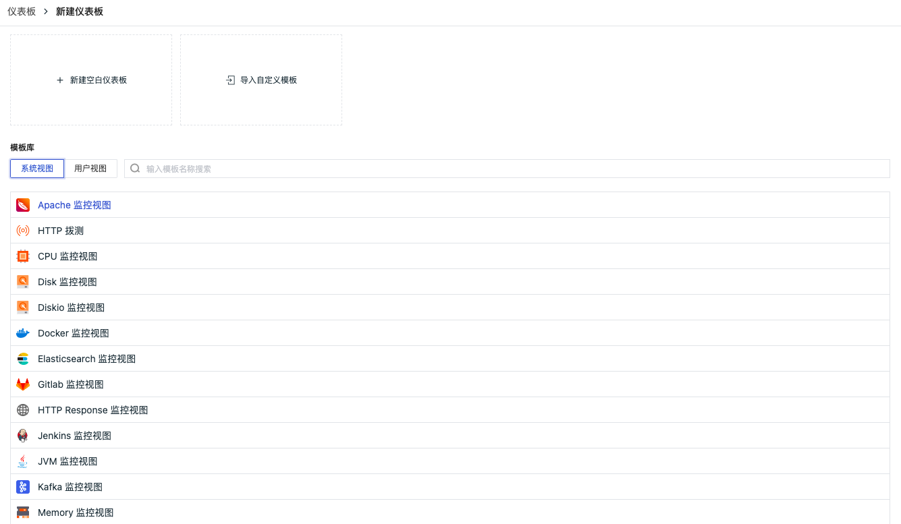
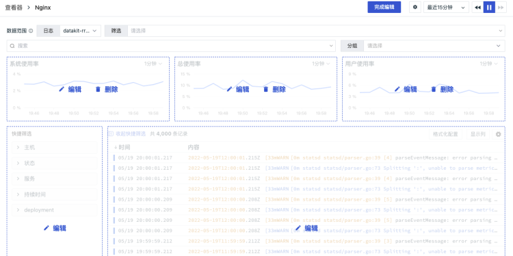

# Release Notes (2022)
---

This document records the update content of each online release of <<< custom_key.brand_name >>>, including DataKit, <<< custom_key.brand_name >>> best practices, <<< custom_key.brand_name >>> integration documentation, and <<< custom_key.brand_name >>>.

## December 29, 2022

### <<< custom_key.brand_name >>> Update

#### Added MFA Authentication Management

<<< custom_key.brand_name >>> provides MFA authentication management, which helps add an extra layer of security protection beyond account usernames and passwords. After enabling MFA authentication, you will need to perform a secondary verification during login, helping to enhance your account's security. For more details, refer to the document **MFA Management**.

#### Added IP Whitelist for Workspace Login

<<< custom_key.brand_name >>> supports configuring an IP whitelist to restrict visitor users for workspaces. After enabling the IP whitelist, only sources from the whitelist can log in normally, and all other requests will be denied access. For more details, refer to the document **IP Whitelist**.

Note: The IP whitelist is only configurable by administrators and owners. Simultaneously, "owners" are not restricted by the IP whitelist access limit.


#### Added Service Network Topology

In K8S environments, you can use the service network topology diagram to view the request relationships, response times, and error rates between various services in the K8S environment. If you find that a service has connection issues, you can click to view the corresponding logs of the service to locate its problems. For more details, refer to the document **Service Network**.


#### Other Feature Optimizations

- Pipeline usage optimization
- Log cluster analysis supports custom fields
- Extremely large logs after slicing support viewing associated logs
- Backup log display optimization
- Sensitive fields in data authorization support all types of data except metrics

### DataKit Update

- Prometheus collector supports collecting data via Unix Socket
- Allows DataKit to run as a non-root user

- Optimized httpflow protocol determination in eBPF
- Optimized Datakit installation and upgrade commands on Windows
- Optimized Pythond encapsulation usage
- Pipeline provides more detailed operation error information
- Pipeline reftable offers a localized storage implementation based on SQLite

More DataKit updates can be referenced in **DataKit Version History**.

### Intelligent Inspection Update

#### Official Intelligent Inspection Discontinued

The official intelligent inspection items “Memory Leak,” “Application Performance Detection,” and “Disk Usage Rate” have been discontinued starting today. Users can configure these through **self-built inspection** script libraries.

#### Added Cloud Account Instance Dimension Billing Inspection

Cloud account instance dimension billing inspection helps users manage abnormal cost warnings at the cloud service instance level, predict cost situations, and provide users with high-growth and high-consumption instance tips and bill visualization capabilities, supporting multi-dimensional visualizations of cloud service resource consumption.

#### Added AliCloud Preemptible Instance Survival Inspection

Due to fluctuations in market prices for preemptible instances, you need to specify a bidding model when creating preemptible instances. When the real-time market price for the specified instance specification is lower than the bid and inventory is sufficient, the preemptible instance can be successfully created. Therefore, inspections for preemptible instances of cloud assets become particularly important. Through inspection, if it is found that a preemptible instance is about to be released, it will prompt the latest price of the preemptible instance across all available zones for the current specification and provide appropriate handling suggestions.

More intelligent inspection updates can be referenced in **Intelligent Inspection Update Log**.

## December 15, 2022

### <<< custom_key.brand_name >>> Update

#### Added Profile and Network Billing

<<< custom_key.brand_name >>> added billing items for Profile and Network. Profile counts the number of application performance Profiles reported in the workspace each day, and Network counts the number of hosts (host) reporting network data in the workspace each day. For more details, refer to the document **Billing Method**.

#### <<< custom_key.brand_name >>> Registration Process Optimization

<<< custom_key.brand_name >>> simplified the registration process, helping you quickly complete registration and start using <<< custom_key.brand_name >>>. For more details, refer to the document **Registering <<< custom_key.brand_name >>> Commercial Plan**.

#### Added Warroom Functionality

<<< custom_key.brand_name >>> provides a "Warroom" dashboard where you can comprehensively view key metric trends for all workspaces, helping you quickly understand the critical data situation of each workspace and promptly identify and resolve abnormal issues. For more details, refer to the document **Key Metric Management**.


#### Added Dashboard Carousel Functionality

<<< custom_key.brand_name >>> provides carousel functionality for multiple related business dashboards. After setting up, you can display them on large screens. For more details, refer to the document **Carousel Dashboards**.


#### Bound Workspace to External SLS Index

<<< custom_key.brand_name >>> newly supports binding SLS indexes, helping you quickly view and analyze your log data uniformly. Meanwhile, <<< custom_key.brand_name >>> newly supports field mapping functions, helping you map SLS index fields for cluster analysis. For more details, refer to the document **Log Index**.


#### Trace Viewer Chart Display Optimization

In the trace viewer, added trend charts for "Span Quantity" and "Error Span Quantity." You can quickly view the trend indicators of Span quantity, Error Span quantity, request quantity, Error request quantity, and response time through the viewer chart.


#### Other Functional Optimizations

- View variable interaction optimization
- Interaction optimization for binding built-in view configurations
- Workflow overdue lock process optimization
- Workflow invitation user experience optimization
- Help documentation added an evaluation system, including good and poor evaluations
- Monitoring batch function optimization
- SLO added enable/disable functionality
- Fuzzy matching Wildcard left * match query limit optimization

### DataKit Update

- Added **Golang Profiling** support
- logfwd supports injecting image fields via `LOGFWD_TARGET_CONTAINER_IMAGE`
- Trace collector:
    - Optimized error-stack/error-message format issues
    - Adjusted SkyWalking compatibility to support the full 8.X series
- eBPF httpflow added `pid/process_name` fields, optimized kernel version support
- datakit.yaml adjustments are recommended; update yaml accordingly
- GPU card collection supports remote mode

More DataKit updates can be referenced in **DataKit Version History**.

### Intelligent Inspection Update

#### Added Guidance Page for Intelligent Inspections

<<< custom_key.brand_name >>> default supports three intelligent inspection templates: memory leaks, disk usage rate, and application performance detection. In this update, existing workspaces support manually deleting default intelligent inspection templates, with system-wide discontinuation prompts provided; newly created workspaces no longer default-provide these three intelligent inspections, adding new user guidance prompts.


#### Intelligent Inspection Component Supports Custom Jump Links Configuration

When configuring self-built inspections, custom jump links can be configured. For details on how to configure self-built inspections, refer to the document **Self-built Inspection**.

More intelligent inspection updates can be referenced in **Intelligent Inspection Update Log**.

### Best Practices Update

- Insights
    - Scene (Scene) - **SpringBoot Project with External Tomcat Scenario Observability**.

More best practice updates can be referenced in **Best Practice Version History**.


## December 1, 2022

### <<< custom_key.brand_name >>> Update

#### Added Service List Function for Application Performance Monitoring

Application performance monitoring service list supports real-time viewing of ownership, dependencies, performance, associated dashboards, and correlation analysis for different services, helping teams efficiently build and manage large-scale end-to-end distributed applications. For more details, refer to the document **Service List**.


#### Optimized Dashboard Chart Usage Experience

- Added manual input for chart units, colors, and aliases. You can customize preset units, colors, and aliases according to the current specifications, such as unit input formats like aggregation functions(metrics), for example `last(usage_idle)`
- Added Y-axis configuration for time-series charts, allowing manual configuration of the maximum and minimum values of the Y-axis
- Added grouped display for time-series and pie charts, showing only label values in the legend after enabling
- Added gradient intervals for honeycomb charts, China maps, and world maps, including automatic and custom options
- Column chart and histogram display optimizations

For more details, refer to the document **Visualization Charts**.


#### Optimized View Variable Usage Experience

- Added support for multiple selections in view variables
- Added whether to set multiple default values during view variable configuration

For more details, refer to the document **View Variables**.


#### Adjusted Session Viewer for User Access Monitoring

In the user access monitoring Session viewer, added "Session" and "All Records" viewing lists:

- Session: Statistically deduplicated Session data within the current time range, default displaying the latest Session data;
- All Records: Displays all reported Session data, with the same Session potentially corresponding to multiple records.

Note: In the Session session list, adding display columns is supported. If the added display column does not exist in the current Session data, there may be empty data in the session list. For more details, refer to the document **Session**.


#### Added Mobile Jump Options for Events

After receiving event notifications, clicking "Go to <<< custom_key.brand_name >>> View" allows you to view the details of abnormal events in the <<< custom_key.brand_name >>> mobile app.

#### Other Functional Optimizations

- Newcomer guide page optimization, supports minimization
- Optimized application list in user access monitoring, added customizable interval switching queries for time control components
- Host addition Label interaction optimization

### DataKit Update

- Added Python Profiling support
- Pythond added custom event reporting functionality
- netstat supports specific port metric collection

- Optimized Redis collector CPU usage rate collection, added new metric fields
- Optimized logfwd collector configuration
- Completed host object field collection, added network, disk, and related fields

More DataKit updates can be referenced in **DataKit Version History**.

### Intelligent Inspection Update

- Kubernetes Pod Abnormal Restart Inspection
- MySQL Performance Inspection
- Server-side Application Error Inspection
- Memory Leak Inspection
- Disk Usage Rate Inspection
- Application Performance Inspection
- Frontend Application Log Error Inspection

More intelligent inspection updates can be referenced in **Intelligent Inspection Update Log**.

### Best Practices Update

- Monitoring Monitoring
    - Application Performance Monitoring (APM) - Performance Optimization - **Utilizing async-profiler for Application Performance Tuning**

More best practice updates can be referenced in **Best Practice Version History**.


## November 17, 2022

### <<< custom_key.brand_name >>> Update

#### Pipeline Usage Experience Optimization 

- Pipeline supports filtering condition configuration for multiple selections

- Supports setting any one Pipeline script as the "Default Pipeline Script". If the current data type does not match any other Pipeline scripts during Pipeline processing, the data will be processed according to the rules of the default Pipeline script.

- Categorized script functions


#### Event Optimization

- Supports writing user-defined events, for more details refer to the document **Writing Event Data via openAPI**.

- Added quick filter on the left side of the unresolved event viewer


#### Custom Viewer Supports Selecting More Types of Data

When creating a new viewer in a scenario, supports selecting log, application performance, user access, security inspection, Profile these 5 types of data, saved and cannot be changed afterward.


#### Member Management Added Member Grouping Functionality

Added member grouping functionality in member management, allowing editing operations on member groups, where a member can belong to multiple groups simultaneously; also supports configuring member group tags when setting notification objects for alert strategies.


#### Optimized Built-in View Binding Functionality

In the scenario "Built-in Views" - "User Views", binding fields added support for fuzzy matching. After binding fields, they can be viewed in association with the built-in views in the viewer. For more details, refer to the document **Binding Built-in Views**.


#### Added One-click Import/Export for Workspaces' Dashboards, Custom Viewers, Monitors

In "Management" - "Basic Settings", added one-click import/export JSON configurations for dashboards, custom viewers, monitors, etc., within the workspace. You can import dashboards, custom viewers, monitors, etc., from other workspaces into the current workspace.


#### Application Performance Monitoring Log Page Added Custom Association Fields

On the associated log page in the application performance monitoring details page, if you have administrator or higher permissions, you can define custom association fields. You can click the settings button to the right of the associated fields, choose the fields to associate in the pop-up dialog box, support manual input, support drag-and-drop order adjustment, confirm to complete configuration.


#### Other Functional Optimizations

- When using fuzzy matching and fuzzy mismatch for filtering conditions, supports left * matching
- Infrastructure analysis dimension optimization, host detail page last report time
- Support quick login to the previous single sign-on
- Blacklist application performance monitoring added support for filtering "all services"
- Upgraded the commercial edition registration process for users registered at the "China Region 4 (Guangzhou)" site
- Field descriptions support viewing in quick filters, display columns, etc.

### DataKit Update

- Added **SNMP Collector**
- Added **IPMI Collector**
- Added bulk injection DDTrace-Java tool
- Enhanced SQL desensitization function in the latest DDTrace-Java SDK
- Remote Pipeline Optimization
    - Pipeline supports source mapping relationship configuration, facilitating batch configuration between Pipeline and data sources
    - Pipeline provides function classification information, facilitating remote Pipeline writing
- Optimized **Kafka Message Subscription**, no longer limited to obtaining SkyWalking-related data, while supporting throttling, multi-version coverage, sampling, and load balancing settings
- Alleviated short lifecycle Pod log collection issues by providing additional configuration parameters (`ENV_INPUT_CONTAINER_LOGGING_SEARCH_INTERVAL`)
- Supported log collection in pure container environments via label-based configuration
- Added Pipeline Functions
    - **sample()**: Sampling function
    - **b64enc()**: Base64 encoding function
    - **b64dec()**: Base64 decoding function
    - **append()**: List append function

More DataKit updates can be referenced in **DataKit Version History**.

### Best Practices Update

- Insights
    - <<< custom_key.brand_name >>> Tips (Skills) - Configuring HTTPS for DataKit

- Monitoring Monitoring
    - Application Performance Monitoring (APM) - Common ddtrace Parameter Usage
    - Application Performance Monitoring (APM) - ddtrace-api Usage Guide
    - Application Performance Monitoring (APM) - ddtrace Sampling
    - Application Performance Monitoring (APM) - ddtrace Log Correlation

More best practice updates can be referenced in **Best Practice Version History**.


## November 11, 2022

#### <<< custom_key.brand_name >>> Added "China Region 4 (Guangzhou)" Site

<<< custom_key.brand_name >>> supports multi-site registration and login, adding the "China Region 4 (Guangzhou)" site. Combined with the existing "China Region 1 (Hangzhou)", "China Region 2 (Ningxia)", and "Overseas Region 1 (Oregon)", it fully covers different regions domestically and internationally, providing comprehensive data observability for users.

It is important to note that accounts and data between different sites of <<< custom_key.brand_name >>> are mutually independent, unable to share or migrate data. You can choose the appropriate site for registration and login based on your resource usage. Currently, <<< custom_key.brand_name >>> supports the following four sites.

| **Site**          | **Login Address URL**             | **Operator** | Settlement Method                     |
| ----------------- | ---------------------------- | ---------- | ---------------------------- |
| China Region 1 (Hangzhou)   | https://auth.<<< custom_key.brand_main_domain >>>/     | Alibaba Cloud     | <<< custom_key.brand_name >>> Corporate Account, Cloud Account       |
| China Region 2 (Ningxia)   | https://aws-auth.<<< custom_key.brand_main_domain >>>/ | AWS        | <<< custom_key.brand_name >>> Corporate Account, Cloud Account       |
| Overseas Region 1 (Oregon) | https://us1-auth.<<< custom_key.brand_main_domain >>>/ | AWS        | <<< custom_key.brand_name >>> Corporate Account, Cloud Account       |
| China Region 4 (Guangzhou)   | https://cn4-auth.<<< custom_key.brand_main_domain >>>/ | Huawei Cloud     | <<< custom_key.brand_name >>> Corporate Account, Huawei Cloud Stored Value Card |

## November 3, 2022

### <<< custom_key.brand_name >>> Update

#### Added <<< custom_key.brand_name >>> and SLS Joint Solution

<<< custom_key.brand_name >>> added an SLS storage solution, allowing Alibaba Cloud SLS users to quickly use <<< custom_key.brand_name >>> for data viewing and analysis. During commercial edition registration/upgrade in <<< custom_key.brand_name >>>, choosing "Alibaba Cloud Account Settlement" allows you to select the SLS storage solution, storing data under your own Alibaba Cloud account to achieve data exclusivity. For more details, refer to the document **SLS Storage**.

The joint solution between <<< custom_key.brand_name >>> and SLS supports synchronizing data from your Alibaba Cloud account to the <<< custom_key.brand_name >>> workspace for querying and analysis through binding log indices. In the <<< custom_key.brand_name >>> workspace "Logs" - "Index", click "Bind Index" to synchronize log data from the index. For more details, refer to the document **Log Index**.


#### Optimized Beginner Guide Pages

<<< custom_key.brand_name >>> added beginner guide pages for scenarios, events, infrastructure, metrics, logs, application performance monitoring, user access monitoring, availability monitoring, security inspection, CI visualization, and monitoring of various functional modules, optimizing the welcome homepage of the workspace to make it easier for users to understand and use <<< custom_key.brand_name >>> through the beginner guide.

#### Added Three Intelligent Inspection Configuration Documents

- **Cloud Account Billing Inspection**: Helps users manage budget warnings, abnormal cost warnings, predict cost situations, and provides visualization capabilities, supporting multi-dimensional visualization of cloud service resource consumption;
- **Frontend Application Log Error Inspection**: Helps discover new error messages (clustered Error Messages) appearing in frontend applications over the past hour, assisting developers and operations personnel in timely fixing code to avoid continuous harm to customer experience over time;
- **AliCloud Asset Inspection**: Helps users gain more understanding of product performance states of cloud vendors.

#### Added Trace Error Tracking Viewer

In application performance monitoring, added an error tracking viewer to help you quickly view similar errors and their distribution in traces, quickly locating performance issues. For more details, refer to the document **Trace Tracking**.


#### Optimized Time-Series Chart and Summary Chart Same Period Comparison Functionality

The same period comparison function is no longer linked to locked time. The button defaults to being displayed and off. After enabling same period comparison, the comparison dimensions support 4 options: Hour (compared to one hour ago), Day (compared to one day ago), Week (compared to one week ago), Month (compared to one month ago). For more details, refer to the document **Same Period Comparison**.

#### Other Functional Optimizations

- Added "Save Snapshot" button in the "Settings" section for dashboards/notebooks/viewers;
- Added more options to the time control component;

- Pipeline and blacklist functions added import, bulk export, and bulk delete functionalities;
- Intelligent inspection added dashboard and bar chart components;
- Integrated menu Func page optimized.

### DataKit Update

- Improved Prometheus ecosystem compatibility, added **ServiceMonitor and PodMonitor collection recognition**
- Added **Java Profiling integration via async-profiler**

- eBPF collection added **interval parameter**, making it easier to adjust the amount of collected data
- Default value for all remote collectors' `host` field is the collection address, avoiding possible misinterpretation of the `host` field value during remote collection
- APM data collected by DDTrace can automatically extract error-related fields, facilitating better APM error tracking in the center
- MySQL collector added extra fields `Com_commit/Com_rollback` collection

More DataKit updates can be referenced in **DataKit Version History**.

### Best Practices Update

- Monitoring Monitoring
    - Application Performance Monitoring (APM) - Best Practices for Kafka Observability

- Cloud Platform Integration
    - Alibaba Cloud - Alibaba Cloud ACK Integration with <<< custom_key.brand_name >>>

More best practice updates can be referenced in **Best Practice Version History**.

## October 20, 2022

### <<< custom_key.brand_name >>> Update

#### Monitoring Optimization

##### Added Outlier Detection

Outlier detection detects whether the metrics/statistics of monitored objects in a specific group deviate significantly. If there is a deviation exceeding a certain threshold, an outlier detection anomaly event is generated for subsequent alarm tracking. For more details, refer to the document **Outlier Detection**.


##### Logic Optimization for Mutation Detection

The new mutation detection compares the absolute or relative (%) changes in the same metric between two different time periods to determine if an anomaly occurs. It is widely used for tracking peak values or data changes of a specific metric, generating more precise events when anomalies occur. For more details, refer to the document **Mutation Detection**.


##### Logic Optimization for Range Detection

The new range detection performs anomaly detection on the selected detection range time period's metric data. When the percentage of mutated data points exceeds the set threshold, a range detection anomaly event is generated. This is widely used for monitoring stable-trend data/metrics. For more details, refer to the document **Range Detection**.


##### Other Optimizations

- Adjusted read-only member permissions to support viewing monitor, intelligent inspection, SLO, mute management, and alarm strategy configuration contents
- Changed the selection for "Trigger Data Gap Event" and "Trigger Recovery Event" from time range configuration to manual input


- Supports configuring monitors based on "Event" data


- Alarm configuration added "Information" event notification level selection


#### Scenario Chart Optimization

##### Added Histogram Chart Component

Histograms, also known as quality distribution charts, are used to represent the distribution of data, a common statistical chart. Typically, the horizontal axis represents the data range, and the vertical axis represents the distribution situation. For more details, refer to the document **Histogram**.


##### Chart Function Optimization

- Overview charts, rectangular tree maps, funnel charts added time slice functionality
- Time series charts "View Similar Trend Metrics" adjusted from supporting only metric queries to supporting all data types, including logs, application performance, user access, etc.
- Rankings support viewing all content exceeding chart width
- Honeycomb chart display optimization

#### Viewer Optimization

##### Viewer Supports Analysis Mode

In log, application performance monitoring, user access monitoring, availability testing, security inspection, CI viewers, added "Analysis" functionality. Infrastructure adjusted "Grouping" to "Analysis," supporting multidimensional analysis and statistics based on **1-3 labels** to reflect the distribution characteristics and trends of data at different dimensions and times. In analysis mode, supports various data chart analyses, including time series charts, rankings, pie charts, and rectangular tree maps. For more details, refer to the document **Viewer Analysis Mode**.


##### Optimized Associated Log Viewing Experience

In infrastructure, application performance monitoring, user access monitoring, CI visualization viewer detail pages, optimized the associated log viewing experience. By default, log content is displayed according to the "Maximum Display Lines," "Display Columns" set in the log viewer, supporting custom adjustments via "Display Columns."


#### Log Index Optimization

After setting an index under "Logs" - "Index," related log queries added index options, defaulting to index `default`. You can query and analyze log data according to the index you set, involving features such as log viewers, custom scenario viewers, chart log queries, log monitors, etc. For more details, refer to the document **Log Index**.


#### Optimized Metric Analysis Chart Queries

Added time intervals and legend options in metric analysis, adjusting the order of presentation for aggregation functions in legends. For more details, refer to **Metric Analysis**.


#### Other Functional Optimizations

- Added dropdown menu options in the user access monitoring application list, helping users quickly switch and view different application data
- Added Pipelines shortcuts in the metrics, user access monitoring, application performance monitoring, infrastructure, security inspection directory

### DataKit Update

- DataKit collector configuration and Pipeline support synchronization via configuration centers like etcd/Consul
- Prometheus Remote Write Optimization
    - Collection supports filtering tags via regular expressions
    - Supports filtering metric set names via regular expressions
- Pipeline Optimization
    - Optimized **grok()** and **json()** functions, making them usable in `if/else` statements to determine if operations are effective
    - Added **match()** function
    - Added **cidr()** function
- Process collector added detailed fields for opened file lists
- Enhanced external data接入(T/R/L) disk caching and queue processing
- Monitor added overuse warning: At the bottom of the monitor, if the current space usage exceeds limits, a red text `Beyond Usage` warning will appear
- Optimized log collection position feature, mounting the file externally to the host machine in container environments to avoid losing original position records after DataKit restarts
- Optimized sparse log scene collection delay issues

More DataKit updates can be referenced in **DataKit Version History**.

### Best Practices Update

- Monitoring Monitoring
    - Infrastructure Monitoring (ITIM) - **Ansible Batch Processing Practical Combat**.

- Cloud Native
    - Logs - **<<< custom_key.brand_name >>> Collecting Amazon ECS Logs**.

More best practice updates can be referenced in **Best Practice Version History**.

## September 29, 2022

### <<< custom_key.brand_name >>> Update

#### Added Field Management

<<< custom_key.brand_name >>> supports unified management of field data in the current workspace, including system fields and custom fields. You can view field descriptions in scenario chart queries, monitor detector metrics, DQL simple query modes, etc., helping you quickly understand field meanings and apply fields. The figure below shows viewing the `host` field description in a scenario chart query; for more details, refer to the document **Field Management**.


#### Optimized Metric Functionality

##### Metric Viewer Transformation

The original "Metric Viewer" was renamed to "Metric Analysis," supporting users to visualize queried data in time series chart formats (line charts, area charts, bar charts). For more details, refer to **Metric Analysis**.


##### Optimized Metric Management

- Supports searching "Metric Sets" and "Metrics" in "Metric Management";

- Supports modifying the "Unit" and "Description" of metrics in "Metric Management";
- Supports viewing descriptions of tag labels in "Metric Management".

For more details, refer to **Metric Management**.


#### Added Exporting Event Content in PDF Format

In the event details page, the "Jump to Monitor" button added explanatory text. Clicking :material-export-variant: button allows you to choose **Export JSON File** and **Export PDF File** to obtain all key data corresponding to the current event.


#### Monitor Adjustment

- Monitor names do not support customization; the event title input generates the monitor name synchronously;
- Monitors support "info" event generation logic. Trigger conditions can choose to enable or disable information: normal detection results also generate events;
- Monitor configuration steps reordered to: Detection Configuration - Event Notification - Association.

**Note:** In the latest version, the "monitor name" will be generated synchronously with the "event title" input. There might be inconsistencies between "monitor name" and "event title" in older monitors. To enhance your user experience, please sync to the latest version as soon as possible, supporting one-click replacement of event titles.


#### Silent Rules Support Dynamic Configuration

In silent management, optimized the silent scope, supporting multiple options such as monitors, intelligent inspections, self-built inspections, SLOs, and alert strategies, with added tag options.

**Note:** Silent scope is mandatory, while tags are optional. Only when both "silent scope" and "tags" conditions are met simultaneously will the silence take effect. For example, if the silent scope selects `Application Performance Monitoring` and `Disk Usage Rate`, and the tag selects: `host:izbp152ke14timzud0du15z`, then alerts will be muted and not sent to alert notification targets when conditions simultaneously meet `Application Performance Monitoring` and `host:izbp152ke14timzud0du15z` or simultaneously meet `Disk Usage Rate` and `host:izbp152ke14timzud0du15z`.


#### Optimized Pipeline Configuration Page

In Text Processing (Pipeline), supports adding multiple sample parsing tests, fixing the issue of incorrectly obtaining samples for metric data with one click. For more details, refer to **Text Processing (Pipeline)**.


#### Other Functional Optimizations

- Notebooks added global locked time configuration. After configuring the global locked time, all charts on the notebook page display data according to the locked time.
- Unresolved event queries modified to show data from the last 48 hours, supporting manual refreshes
- User access monitoring supports covering logic for same-name user views
- Initialization parameters for Web, WeChat Mini Programs, and uniapp-based Mini Program accesses added `isIntakeUrl` configuration, used to determine whether to collect corresponding resource data based on the requested resource URL, defaulting to collect everything 
- Intelligent inspection added support for self-built inspections
- Operation column adjustments on the indicator page added "Open in Metric Analysis" and "Open in Metric Management" operation icons
- Navigation menu position adjustments moved SSO management to member management, notification target management to monitoring, and built-in views to scenarios

### Best Practices Update

- Cloud Native: **Best Practices for Multiple Kubernetes Cluster Metrics Collection**.

More best practice updates can be referenced in **Best Practice Version History**.

## September 15, 2022

### <<< custom_key.brand_name >>> Update

#### Added Log Viewer DQL Search Mode

In the log viewer, you can switch to DQL manual input query mode by clicking the toggle small icon in the search bar, supporting custom input filtering and search conditions.

- Filtering Conditions: Supports arbitrary combinations of `and / or`, uses `()` parentheses to indicate search priority, supports `=` , `!=` operators;
- Search Conditions: Supports searching logs using the DQL function `query_string()`.

For more details, refer to the document **DQL Search**.


#### Optimized Application Performance Monitoring

##### Link Viewer Detail Page Optimization

- Optimized layout display on the detail page, added duration, HTTP method, HTTP URL, HTTP status code, TraceId, etc.
- Flame graph added thumbnail, double-click Span zoom display, click service name highlights corresponding Span
- Span list added search, click to select Span switches to synchronized flame graph display
- Service call relationship added search 

For more details, refer to the document **Link Viewer**.


##### Profile Viewer Detail Page Optimization

In the Profile Viewer detail page, added quick operations, including search, copy, and click to view methods. For more details, refer to the document **Quick Operation Instructions**.


#### Optimized Monitor Event Notification Content Editing Mode

When creating a monitor, the event notification content triggered upon meeting conditions supports inputting and previewing markdown formatted text information, supporting template variable usage.


#### Added Periodic Silence Management

Silence management added periodic silence functionality, allowing you to choose "Once" or "Repeat" in the silence time. For more details, refer to **Silence Management**.


#### Other Functional Optimizations

- Scenario dashboard group display optimization, scenario notes optimize Markdown formatting
- Infrastructure viewer display optimization, added CPU usage rate, MEM usage rate tip information for "Pods", "Deployments", "Services" detail pages; added viewing and copying corresponding YAML files
- Metric viewer removed list view mode, retained flat view mode and mixed view mode

- Log multi-index support jumping to view
- Quick filter TOP 5 values in the viewer support viewing proportion quantities, viewer time field format optimization, default display format is `2022/09/15 20:53:40`
- Link viewer time series chart added legend display, quick filter added HTTP related fields

### DataKit Update

- Added automatic cloud synchronization functionality, no longer requiring manual cloud vendor specification
- Supports syncing k8s labels to pod metrics and logs as tags
- Supports collecting various yaml information from k8s onto corresponding **object data**
- Trace collection supports automatically extracting some key meta information
- Installation process supports specifying installation source addresses, simplifying the **offline installation** process
- Pipeline added functions:
    - Added for loop/dictionary/array support
    - Added arithmetic expression support
    - If time field segmentation fails, supports automatically correcting the time field (`time`) to avoid console pages failing to display time
    - Added **len()** function

More DataKit updates can be referenced in **DataKit Version History**.

### Best Practices Update

- Monitoring Monitoring\- Middleware (MIDDLEWARE) - **Insight into MySQL**.

More best practice updates can be referenced in **Best Practice Version History**.

## September 1, 2022

### <<< custom_key.brand_name >>> Update

#### Billing Update

<<< custom_key.brand_name >>> backup log billing rule adjustments, post-adjustment backup logs are billed at 0.007 yuan per 1 GB of data/day. You can adjust corresponding data retention strategies according to actual needs to save costs. For more details, refer to the document **Billing Method**.

#### Help Documentation Directory Update

- Split update log directories, supporting annual viewing of <<< custom_key.brand_name >>> update content;
- Added custom development directories, allowing you to view documents for custom collectors (Pythond), custom security inspections (Scheck), custom DDtrace, etc.;
- Added private deployment directories, allowing you to view relevant <<< custom_key.brand_name >>> deployment documents.

#### Added Event-Associated Analysis in Time Series Charts

Time series charts added event-associated analysis, supporting matching abnormal events related to selected fields via "Add Filter Fields," thereby achieving the purpose of associating time series data with events. This helps users perceive whether related events occurred during data fluctuations while viewing trends, achieving problem localization.

- After configuring event association in time series charts, if there are event records related to the selected associated fields (e.g., "host:DESKTOP-NEN89U3") on the timeline, they will be marked with shaded blocks;
- After configuring event association in time series charts, in analysis mode, clicking highlighted shaded blocks allows you to view abnormal events related to the selected fields (e.g., "host:DESKTOP-NEN89U3").

For more details, refer to the document **Time Series Chart**.


#### Added Multi-Index Mode for Logs

<<< custom_key.brand_name >>> supports setting log multi-indexes, filtering eligible logs into different log indexes, and selecting different data retention strategies for log indexes to help users save log data storage fees. For more details, refer to the document **Log Index**.


#### Optimized Backup Log Rule

Newly created backup log rules moved under the log index menu, changing from daily backups of the previous day's logs at 0 o'clock to checking rules every 5 minutes and performing backups, meaning backup log data can be viewed within 5 minutes of configuration. For more details, refer to the document **Backup Logs**.

#### Optimized Log Context

When viewing context in the log details page, the new log viewer opens with "host", "source", "service", "filename" as filtering conditions, displaying data before and after the current log time.


#### Optimized User Access Monitoring

##### Added Custom User Access Monitoring Application ID

User access monitoring supports users defining a custom application ID as the unique identifier for the current workspace (the original <<< custom_key.brand_name >>> application ID was globally unique, i.e., application IDs from different spaces could not be repeated), allowing different workspaces to use the same application ID as the unique identifier for the same application, used for SDK data upload matching. For more details, refer to the documents:

- **Web Application Integration**

- **Android Application Integration** 

- **iOS Application Integration**

- **Mini Program Application Integration**


##### Added User Access Monitoring Network Request Error Linked Trace View

User access monitoring supports users viewing related traces for network (network) errors in RUM viewers.


#### Full Upgrade of Intelligent Inspection

- Intelligent inspection list changed "Group" to "Alert Strategy," supporting selection of alert strategies when editing intelligent inspections;
- Fully adjusted the details page of intelligent inspection-related events, including detail pages such as basic attributes, event details, root cause analysis, alert notifications- Historical Records, Associated Events, etc.; simultaneously optimized abnormal chart analysis, added data association jump links, abnormal interval prompts, root cause analysis interval prompts, legend display operations, etc.

For more details, refer to **Intelligent Inspection**.


#### Monitoring Optimization

##### Adjusted Grouping to Alert Strategy

In "Monitoring," adjusted the "Group Management" page to "Alert Strategy Management," creating alert strategies for monitor filtering and setting alert notifications through new alert strategy creation.


In **Monitors**, the original "Group" filter was changed to "Alert Strategy" filter, supporting selection of alert strategies when configuring monitors, with support for clicking the monitor's alert strategy to modify alert settings.


##### Monitor Configuration Optimization

- Adjusted the configuration process steps for monitors, including detection frequency, detection intervals, alert strategies, etc.;
- Optimized detection metrics, supporting outer function (fx) configuration, including "Label Filtering," "Transformation Functions," "Data Gap Filling"; supports switching to DQL query mode;
- Optimized trigger condition text prompt;
- Optimized event notifications, removed some custom data gap event titles and content in monitors; adjusted template variable prompt text; adjusted grouping to alert strategy and supported editing of alert strategies;
- Optimized log detection, application performance metric detection, user access metric detection "detection metric" configuration.

For more details, refer to **Monitor Management**.


##### Added "Infrastructure Survival Detection"

"Infrastucture Survival Detection" is used to monitor the operational status of infrastructure. For more details, refer to **Infrastructure Survival Detection**.


##### Added "Process Abnormal Detection"

"Process Abnormal Detection" is used to monitor process data within the workspace, supporting setting alert triggers for one or multiple field types of process data. For more details, refer to **Process Abnormal Detection**.

Note: Infrastructure object detection has been removed. Existing related monitors can continue to be used but no longer support new creations.


##### Optimized "Application Performance Metric Detection"

Added "Trace Statistics" detection method in "Application Performance Metric Detection," counting the number of traces that meet conditions within a specified time period, triggering an anomaly event when exceeding a custom threshold. This can be used for service trace error notifications. For more details, refer to **Application Performance Metric Detection**


#### Member Management Optimization

- Read-only members no longer support viewing member management pages;
- Support filtering ordinary members and SSO members, showing only the members corresponding to the currently configured identity provider (IDP) for SSO members.

For more details, refer to **Member Management**.

#### Added DEMO Workspace

<<< custom_key.brand_name >>> provides a workspace demo to help you better use various functional modules of <<< custom_key.brand_name >>>. You can click the "Workspace" in the upper-left corner, and in the pop-up dialog box, click "Experience Demo Space" to enter the demo space for viewing.


#### Other Functional Optimizations

- Default aggregation function for chart metrics changed from last to avg, default aggregation function for log-type data changed from last to count
- Optimized copying experience for time series charts and pie chart legends
- Optimized interaction display in note editing mode
- Snapshot supports saving current viewer column information 
- Format display of time fields on the link detail page, converting timestamps into date formats
- Deployment edition backend supports modifying workspace data retention strategies

### DataKit Update

#### Breaking Changes

- Adjusted global tag behavior to avoid tag splits in election-based collectors
- SQLServer collector added election support
- Line protocol filter supports all data types
- 9529 HTTP service added timeout mechanism
- MySQL
    - dbm metric set name adjustment
    - service field conflict issue
- Container objects added container_runtime_name field to distinguish different levels of container names
- Redis adjusted slowlog collection, changing its data to log storage
- Optimized TDEngine collection
- Improved Containerd log collection
- Pipeline added Profile data support
- Container/Pod log collection supports additional tags via Label/Annotation
- Fixed Jenkins CI data collection time precision issue
- Fixed Tracing resource-type value inconsistency problem
- eBPF added HTTPS support
- Fixed potential crash issues in log collection
- Fixed prom collector leak issue
- Supports configuring io disk cache via environment variables
- Added Kubernetes CRD support

More DataKit updates can be referenced in **DataKit Version History**.

### Best Practices Update

- Integration
    - Skywalking JVM Observability Best Practices
    - Minio Observability Best Practices

More best practice updates can be referenced in **Best Practice Version History**.


## June 21, 2022

### <<< custom_key.brand_name >>> Update

#### <<< custom_key.brand_name >>> Help Documentation Fully Online

To enhance the reading experience of <<< custom_key.brand_name >>> help documentation, <<< custom_key.brand_name >>> help documentation has moved to the <<< custom_key.brand_name >>> domain, allowing you to view <<< custom_key.brand_name >>> help documentation more simply and quickly. The new <<< custom_key.brand_name >>> help documentation address is: **<<< homepage >>>**.

#### Added Profile Observability

Profile supports collecting dynamic performance data of applications running in different language environments such as Java / Python, helping users view CPU, memory, IO performance issues. To collect profile data, you need to install DataKit first and configure the Profile collector. After configuration, DataKit will upload the collected profile data to your <<< custom_key.brand_name >>> workspace, where you can understand your program code performance through the real-time data viewer of Profile. For more details, refer to the document **Profile**.


#### Full Text Analysis Processing Covers All Data Types

Text processing (Pipeline) is used for data parsing. By defining parsing rules, various data types are split into structured data that meets our requirements. In <<< custom_key.brand_name >>> workspace "Management" - "Text Processing (Pipeline)," click "Create Pipeline" to create a new pipeline file. For more details, refer to the document **Text Processing (Pipeline)**.


#### Added Deployment Network Details and Network Distribution

Deployment network supports viewing network traffic between Deployments. It supports viewing source IP to destination IP network traffic and data connections based on IP/port, visualizing them in real-time to help businesses understand the operational state of their business system networks, quickly analyze, track, and locate fault problems, preventing or avoiding business problems caused by network performance degradation or interruptions.

After successful collection of Deployment network data, it is reported to the <<< custom_key.brand_name >>> console. You can view Deployment network performance monitoring data information in the "Network" section under "Infrastructure" - "Containers" - "Deployment" details page; in "Infrastructure" - "Network" - "Deployment," you can view the network distribution and data connections of all Deployments in the workspace. For more details, refer to **Deployment Network**.


#### Optimized Event Detection Dimension Jump to Other Viewers

In the unresolved events viewer, supports clicking detection dimensions to view related containers, processes, logs, traces, RUM, availability testing, security inspections, CI, etc. If there are no related data in the associated viewers, the corresponding jump links are grayed out and not clickable.


#### Added Log Viewer JSON-formatted Message Information Search

The log viewer added search functionality for JSON-formatted log content (message), with search format being: `@key.key:value`.

Note: JSON search only supports workspaces created after this feature launch.


#### Added User Access Monitoring New Application Creation Supporting Custom Input of app_id Information

Added custom application ID functionality. When creating a new application using user access monitoring, supports custom input of app_id, generating a unique application ID identifier within the current space, which can be used for distinguishing application types, data upload matching, etc.

- Application Name (Required): Used to identify the application name currently implementing user access monitoring.
- Application ID Identifier (Optional): A unique application ID identifier within the current space, supports customization, usable for data upload matching; the application ID identifier is limited to 20 characters and only supports input of uppercase and lowercase letters.
- Application ID: If the application ID identifier is filled when creating an application, clicking "Create Application" will prepend the entered application ID identifier to the front of the application ID, facilitating differentiation for querying and filtering.


#### Optimized Process Detection to Infrastructure Object Detection

Process detection optimization to infrastructure object monitoring added selections for hosts, containers, processes, Pods, Deployments, ReplicaSets, Jobs, resource catalogs, etc., basic objects for monitoring infrastructure object data within the workspace. For more details, refer to the document **Infrastructure Object Detection**.

#### Other Functional Optimizations

- Added CPU usage rate and memory usage fill indicators in the honeycomb mode of Infrastructure POD viewer
- Optimized log blacklist configuration. Supports manually entering log sources as log blacklist sources
- Optimized service list data query time component in application performance monitoring, supporting custom time range selection
- Optimized K8S DataKit installation guide text, automatically adding the current workspace token in the DataWay data gateway address configuration
- Optimized monitor configuration UI style

### DataKit Update

#### 2022/06/21

- gitrepo supports passwordless mode
- prom collector
    - Supports log mode collection
    - Supports configuring HTTP request headers
- Supports over 16KB length container log collection
- Supports TDEngine collector
- Pipeline
    - Supports XML parsing
    - Remote debugging supports multiple data types
    - Supports calling external Pipeline scripts via the `use()` function in Pipeline
- Added IP library (MaxMindIP) support
- Added DDTrace Profile integration
- Containerd log collection supports filtering rule configurations via image and K8s Annotation
- Entire documentation library switch

#### 2022/06/16

- Log collection supports recording collection positions, avoiding data loss due to DataKit restarts
- Adjusted Pipeline settings for handling different data types
- Supports receiving SkyWalking metric data
- Optimized log blacklist debugging function: 
    - Displays filtered points in Monitor
    - Adds a *.filter* file in the datakit/data directory to record fetched filters
- Monitor increases DataKit open file count display
- DataKit compiler upgraded to golang 1.18.3

#### 2022/06/07

- Added TCP/UDP port detection collector
- Added DNS detection between DataKit and DataWay, supporting dynamic switching of DataWay DNS
- **eBPF** L4/L7 traffic data added k8s deployment name field
- Optimized OpenTelemetry metric data
- **ElasticSearch** added AWS OpenSearch support
- **Line Protocol Limitation**: String length limit relaxed to 32MB
- **prom** collector added extra configuration, supporting ignoring specified tag=value matches to reduce unnecessary time series timelines
- Sink added Jaeger support
- Kubernetes-related metric collections are disabled by default to avoid excessive time series timelines
- DataKit Monitor adds refresh for dynamically discovered (e.g., prom) collectors

More DataKit updates can be referenced in **DataKit Version History**.


### Best Practices Update

- APM
    - **GraalVM and Spring Native Project Achieving Trace Observability**
- Integration
    - **Host Observability Best Practices (Linux)**

More best practice updates can be referenced in **Best Practice Version History**.

### Integration Template Update

#### Added Documents

- Alibaba Cloud
    - Alibaba Cloud NAT
    - Alibaba Cloud CDN

#### Added Views

- Alibaba Cloud
    - Alibaba Cloud NAT
    - Alibaba Cloud CDN


## June 6, 2022

### <<< custom_key.brand_name >>> Billing Update

<<< custom_key.brand_name >>> billing optimizes the **Time Series** billing logic and the **data retention policy** for metric data. The original rate of 3 yuan per 300 items has been reduced to 3 yuan per 1000 items. Simultaneously, metric data adds 3-day, 7-day, 14-day data retention policies, with metric sets supporting **custom data retention policies**.

Time series statistics count the total combinations of labels in the reported metric data within the current workspace. Data retention policy refers to the data storage duration, which is the retention time of data reported to the current workspace. Data exceeding the storage duration will be automatically deleted.

Time series are fully counted, meaning daily generated time series within the data retention policy will accumulate sequentially. The longer the data retention policy, the higher the cost of time series.

This optimization allows you to adjust the data retention policy for metrics more flexibly, helping you save costs.

### <<< custom_key.brand_name >>> Update

#### Added Jenkins CI Observability

<<< custom_key.brand_name >>> added Jenkins CI observability, allowing you to directly view CI results in Jenkins through the CI visualization function of <<< custom_key.brand_name >>>. The CI process involves continuous integration, where developers can check all CI pipelines, success rates, failure reasons, and specific failure stages in <<< custom_key.brand_name >>> upon encountering issues during code pushes, providing code update guarantees. For more details, refer to **CI Visualization**.


#### Added Custom Viewer Chart Synchronized Search

Custom viewers added a synchronized search toggle switch, deciding whether search conditions affect chart queries, defaulting to enabled. When there is content in the search bar, disabling the switch returns the chart query to the default state; enabling the switch means the chart query is affected by the selected content.


#### Added Network Topology and Service Topology Drilling Analysis

In the infrastructure network topology diagram, clicking the host/Pod icon and then "View Upstream/Downstream" allows you to view the upstream/downstream node associations of the current node. In the upstream/downstream nodes, clicking the top-left "Return to Overview" brings you back to the original network topology diagram. Searching or filtering in the search bar filters associated upstream/downstream nodes, displaying matched upstream/downstream node associations according to the search or filter results. For more details, refer to the document **Network Upstream/Downstream Viewing**.


In the service topology diagram, clicking the service icon and then "View Upstream/Downstream" allows you to view the upstream/downstream service associations of the current service. In the upstream/downstream services, clicking the top-left "Return to Overview" brings you back to the original service topology diagram. Searching or filtering in the search bar filters associated upstream/downstream services, displaying matched upstream/downstream service associations according to the search or filter results. For more details, refer to the document **Service Upstream/Downstream Viewing**.


#### Added Deletion of Resource Catalog Data and Indexes

<<< custom_key.brand_name >>> supports owners and administrators deleting specified resource catalog classifications and all resource catalogs. Enter "Management" - "Basic Settings," click "Delete Resource Catalog," select the deletion method, and delete the corresponding object data.

- Specified Resource Catalog Classification: Only deletes data under the selected object classification, does not delete indexes
- All Resource Catalogs: Deletes all resource catalog data and indexes

Note: Once all resource catalogs are deleted, all custom-reported data and indexes in the infrastructure will be completely deleted and cannot be recovered. All set resource catalog classification data needs to be re-reported, with a maximum of 5 deletions of all resource catalogs allowed per day.

More resource catalog introductions can be referenced in the document **Customization**.


#### Added Viewer Snapshot Viewing Entry

In <<< custom_key.brand_name >>> metrics, logs, events, application performance monitoring, user access monitoring, cloud testing, security inspection, CI visualization viewers, after saving snapshots, you can directly click the snapshot icon in the top-right corner to expand and view saved snapshots.

- Supports searching snapshots by keyword, performing fuzzy matching of related snapshot names
- The first one is the default view, does not support sharing, copying links, or deletion functions
- Except for the first default view, other snapshots support sharing, copying links, and deletion functions. Clicking the "Snapshot Name" opens the corresponding data copy in the current viewer


#### Added Viewer Filter Condition Editing Functionality

In <<< custom_key.brand_name >>> viewer search bar, when filtering using "field:value," supports clicking "field:value" to edit and modify "field:value," and filtering based on the modified results.


#### Optimized User Access View Viewer Linking to Fetch/XHR

In <<< custom_key.brand_name >>> user access monitoring View Viewer detail page, switching to "Fetch/XHR" supports viewing each network request made by the user to the backend application, including occurrence time, request traces, and duration.


If the network request has a corresponding `trace_id`, there will be a prompt icon before the request. Clicking the request jumps to the corresponding trace detail page.


#### Added High-Performance Mode for Chart Data Loading

<<< custom_key.brand_name >>> supports high-performance mode for chart data loading, defaulting to off. You can enable it via the left-bottom account in "High-Performance Mode." After enabling high-performance mode, all charts do not dynamically load. They load simultaneously when entering the page, meaning all charts have already loaded when scrolling down beyond the current page, allowing direct viewing of the displayed results.

Note: After enabling high-performance mode, it applies only to the current user viewing charts.


#### Added Alarm Configuration Event Notification Levels

Alarm configuration supports custom selection of event notification levels, including emergency, important, warning, recovery, data gap, data gap recovery, and data gap considered as recovery, supporting multi-selection, one-click clearing options, and manual selection after clearing. More alarm configurations can be referenced in the document **Alarm Settings**.


#### Other Functional Optimizations

- Scenario dashboards support hiding/showing large titles for combined charts
- Optimized event detail page event type text display
- Infrastructure list views support sorting by fields
- Log viewer added hide distribution chart button
- Viewer supports searching display columns via keywords, supports custom display columns as preset fields, and subsequently reporting data through Pipeline slicing fields can directly display the reported data.
- In built-in template libraries and built-in views, added one-click viewing of corresponding integration documents to help you quickly configure the corresponding collector
- Built-in views support binding chain services, applications, log sources, projects, labels, etc., in addition to supporting custom key and value bindings, also supporting side-sliding service detail page bindings
- Optimized Lark robot notification targets, supporting custom key security checks
- When configuring monitors, if the data range configured is less than the detection frequency, a prompt warns of potential data gaps

### DataKit Update (**2022/05/26**)

- Pipeline adjustments allow all data types to be processed via configured Pipelines
- grok() supports directly extracting fields as specified types without needing cast() for type conversion
- Pipeline added multiline string support, improving readability by writing very long strings (like regex splitting in grok) across multiple lines
- Each Pipeline's runtime status can be directly viewed via datakit monitor -V
- Added CPU/memory metrics for Kubernetes Pod objects
- Helm added more Kubernetes version installation compatibility
- Optimized OpenTelemetry, added JSON support for HTTP protocol
- DataKit increased logging for automatic correction of line protocols, facilitating debugging of data issues
- Removed all string metrics from time-series data
- If election namespaces are configured in DaemonSet installations, all participating collectors' data will include specific tags (election_namespace)
- CI observability added Jenkins support

#### Breaking Changes

For Docker container log collection, the host (Node) _/var/lib_ path must be mounted into DataKit (because Docker logs default to the host's _/var/lib/_). In _datakit.yaml_, add the following configurations to `volumeMounts` and `volumes`:

```yaml
volumeMounts:
- mountPath: /var/lib
  name: lib

# Omitted other parts...

volumes:
- hostPath:
    path: /var/lib
  name: lib
```

### Best Practices Update

- APM
    - Using SkyWalking to achieve RUM, APM, and log correlation analysis based on <<< custom_key.brand_name >>>
- Monitoring Best Practices
    - Building Observable Systems with OpenTelemetry
    - OpenTelemetry to Jaeger, Grafana, ELK
    - OpenTelemetry to Grafana
    - OpenTelemetry to <<< custom_key.brand_name >>>
- <<< custom_key.brand_name >>> Tips
    - OpenTelemetry Sampling Best Practices

More best practice updates can be referenced in **Best Practice Version History**.

### Integration Template Update
#### Added Documents and Views

- Data Collection
    - Opentelemetry Collector
- Container Orchestration
    - Kubernetes Scheduler
    - Kubernetes Controller Manager
    - Kubernetes API Server
    - Kubernetes Kubelet
#### Added Views

- Container Orchestration
    - Kubernetes Nodes Overview
- Middleware
    - JVM Kubernetes


## May 19, 2022

### <<< custom_key.brand_name >>> Update

#### Optimized <<< custom_key.brand_name >>> Commercial Edition Registration Process

During <<< custom_key.brand_name >>> registration, both Free Plan and Commercial Plan registration options are provided, allowing you to register a <<< custom_key.brand_name >>> account according to actual needs. <<< custom_key.brand_name >>> supports pay-as-you-go billing methods, offering an out-of-the-box platform for comprehensive observability.

#### Added Scene Dashboard User View Template Library

<<< custom_key.brand_name >>> includes over 60 built-in system view templates, requiring no configuration for immediate use, meeting various monitoring scenario needs. You can customize views as user view templates to create dashboards with one click. For more dashboard building details, refer to the document **Dashboard**.



#### Added Scene Custom Viewer Log Sources and Filtering Linkage

The data range of scene custom viewers added filtering functionality, selecting fields data under log sources based on log sources, supporting matching multiple fields, combining with search and grouping for further log data filtering.



#### Added Copying Content of Event Detail Page as JSON Format

On the event detail page, supports clicking the "Copy Complete Event Content" button to obtain all key data corresponding to the current event. If a monitor is configured with associated dashboards, you can click the "Associated Dashboard" button to jump to the corresponding dashboard.

In the **Associated Information** section of the event detail page, if "Log Detection" configures multiple expression queries (same object type), the associated information supports tab switching for multiple expression queries. If there are two expression queries A and B, then the relationship information contains tabs A and B for switching views.


#### Added Log Data Desensitization Handling

<<< custom_key.brand_name >>> added log data desensitization handling. After data is reported to the <<< custom_key.brand_name >>> workspace, some sensitive information may exist, such as IP addresses and user information. These parts can be desensitized by configuring sensitive fields.<br />Note:

- Desensitized data is only accessible by workspace administrators and above. Standard and read-only members cannot view desensitized information.
- Configuring sensitive fields is only operable by workspace administrators and above. Standard and read-only members can only view configured sensitive fields.

For more details, refer to the document **Data Permission Management**.


#### Optimized Log Viewer and Detail Page

<<< custom_key.brand_name >>> **Log Viewer** defaults to displaying "time" and "message" fields. This optimization now supports hiding the "message" field display.

On the log detail page, log content automatically displays Json and text viewing modes based on message type. If the log does not have a message field, the log content part is not displayed. Log content supports expanding/collapsing, defaulting to expanded state. Collapsed state displays only one line height.

Extended fields display all relevant fields of the log, supporting "Copy" and "Add to Filter" for quick filtering and viewing.


#### Added Network Data Monitoring Monitors

**Network Data Monitoring** is used to monitor network performance metric data within the workspace, setting thresholds. Alerts are triggered when metrics reach the threshold. "<<< custom_key.brand_name >>>" supports setting alerts for individual metrics and custom alert levels. In **Monitors**, click「+ Create New Monitor」and select「Network Data Monitoring」to enter the detection rule configuration page.


#### Optimized Built-in View Binding Functionality

<<< custom_key.brand_name >>> built-in views include system views and user views. This optimization cancels custom binding of system views as viewer views, supporting only binding user views as viewer views. If you need to bind system views, clone the system view as a user view first. If the system view and user view have the same name, the user view takes precedence in the viewer. For details on how to bind user views as viewer views, refer to the document **Binding Built-in Views**.


#### Other Functional Optimizations

- Paid Plans and Billing added prepaid card balance
- Infrastructure detail style optimization
- Trace detail page attribute wrap display optimization
- Monitor configuration template variable display optimization
- Added quick entry, moving DQL query and snapshot menus under quick entry
- <<< custom_key.brand_name >>> management backend supplements template management classification information

### DataKit Update (2022/5/12)

- eBPF added arm64 support
- Line protocol construction supports automatic correction
- DataKit main configuration added example configuration
- Prometheus Remote Write supports tag renaming
- Merged community edition DataKit existing features, mainly including Sinker functionality and filebeat collector
- Adjusted container log collection, DataKit directly supports collecting stdout/stderr logs from containers under containerd
- Adjusted hostname acquisition strategy under DaemonSet mode
- Trace collector supports filtering resources (`resource`) via service name (`service`) wildcards

More DataKit updates can be referenced in **DataKit Version History**.

### Best Practices Update

- Cloud Native
    - Use <<< custom_key.brand_name >>> to start Rancher observability journey with one click
- Microservices Observability Best Practices
    - Kubernetes cluster applications using SkyWalking to collect trace data
    - Kubernetes cluster log reporting to the same node's DataKit best practices
- Gitlab-CI Observability Best Practices
    - Gitlab-CI Observability Best Practices

More best practice updates can be referenced in **Best Practice Version History**.

### Integration Template Update

#### Added Documents and Views

- Middleware
    - Resin
    - Beats
- Host System
    - Procstat
#### Added Views

- Container Orchestration
    - Istio Service
- Alibaba Cloud
    - ASM Service


## May 6, 2022

### <<< custom_key.brand_name >>> Update

#### Optimized <<< custom_key.brand_name >>> Commercial Edition Upgrade Process

Upgrading <<< custom_key.brand_name >>> to the commercial edition defaults to opening **<<< custom_key.brand_name >>> Billing Center Account Settlement**, supporting changing the settlement method to cloud account settlement, including **Alibaba Cloud Account** and **AWS Cloud Account** settlement methods.

#### Added Associated Network Data in Process, Log, and Trace Detail Pages

<<< custom_key.brand_name >>> **Process**, **Log**, **Trace** detail pages added associated network data analysis, supporting viewing source host/source process service to target network traffic and data connection situations based on IP/port, visualizing them in real-time to help businesses understand the operational state of their business system networks, quickly analyzing, tracking, and locating fault problems, preventing or avoiding business problems caused by network performance degradation or interruptions.


#### Scene Module Optimization

##### Optimized Dashboards, Removed Edit Mode

In the scene **Dashboard** top navigation bar, removed the "Edit" button, added "Add Chart" to add new charts to the dashboard, and after adding charts, click the top-right "Complete Adding" to finish.


In **Charts**, click the "Settings" button, choose "Modify" to edit the chart.


##### Added Chart Link Display Switch
<<< custom_key.brand_name >>> supports built-in links and custom links in charts, helping you jump from the current chart to the target page. Built-in links are default associated links provided by <<< custom_key.brand_name >>>, primarily based on the current query time range and grouping tags, helping you view corresponding logs, processes, containers, traces, etc. Built-in links display switches default to off and can be enabled during chart editing; custom links created complete, display switches default to on. For more details, refer to the document **Chart Links**.


##### Optimized Conversion Between DQL Queries and Simple Queries
Click the toggle button to the right of **DQL Query** to switch DQL Query to simple query.<br />Note: Switching **DQL Query** to **Simple Query**, if unable to parse or incomplete parsing occurs:

- No operation in **Simple Query**, switching back to **DQL Query** displays the previous DQL query statement;
- Adjusting the query statement in **Simple Query**, switching back to **DQL Query** parses according to the latest **Simple Query**.

For more applications of DQL Queries and Simple Queries, refer to the document **Chart Queries**.


#### Monitor and Event Module Optimization

##### Added Event Association Information
<<< custom_key.brand_name >>> supports viewing information related to triggering the current event, such as viewing logs related to triggering events. This **associated information** only supports events generated by 4 types of monitors: log detection, security inspection anomaly detection, process anomaly detection, and availability data detection.


##### Added Data Gap Event Name and Content Configuration
<<< custom_key.brand_name >>> monitors "Threshold Detection," "Water Level Detection," "Range Detection," "Mutation Detection," "Process Anomaly Detection," "Application Performance Indicator Detection," "User Access Indicator Detection" added data gap event title and content configuration, defaulting to non-editable. When choosing to trigger data gap events, the data gap event name becomes editable, supporting the use of pre-configured template variables. Refer to **Event Name/Content Templates** for details.


##### Optimized Availability Data Detection
<<< custom_key.brand_name >>> monitor **Availability Data Detection** optimized to support selecting HTTP, TCP, ICMP, WEBSOCKET test types.

##### Optimized Alert Notification Templates, Added Associated Jump Links
Emails, DingTalk, WeChat, Lark received alert notifications include "<<< custom_key.brand_name >>> jump links," clicking which directly jumps to the corresponding <<< custom_key.brand_name >>> event details, with a time range of 15 minutes prior to the current time. For instance, for an event at 18:45:00, clicking the link jumps to the event details page with a fixed time range of 4.20 18:30:00 ~ 4.20 18:45:00. For more alert notifications, refer to the document **Alert Settings**.

#### Other Functional Optimizations

- Optimized service servicemap metric query performance
- Added numerical field support > | >= | < | <= | [] five writing methods in viewers
- Added label cascading filtering support for metric viewers
- Optimized DQL query return error prompts

### DataKit Update

- Filtering functionality of the process collector only affects metric collection, object collection remains unaffected
- Optimized DataKit sending DataWay timeout issues
- Optimized Gitlab collector
- Fixed log truncation issues in log collection
- Fixed partial configuration ineffectiveness issues after reloading various trace collectors

More DataKit updates can be referenced in **DataKit Version History**.

### Integration Template Update

#### Added Redis Sentinel Data Storage Integration Document and View

Redis-sentinel observation scenarios mainly display Redis clusters, slaves, node distribution information, etc.


## April 26, 2022

### <<< custom_key.brand_name >>> Update

#### Optimized SSO Single Sign-On

<<< custom_key.brand_name >>> supports users enabling SSO single sign-on based on workspaces. Users can obtain corresponding SSO login by entering their company email during login, achieving corresponding verification login. In <<< custom_key.brand_name >>> workspace "Management" - "SSO Management" - "Enable," you can set up SSO single sign-on for employees. The main optimizations include:

- A workspace updated from supporting creation of multiple identity providers to only supporting configuration of one SSO single sign-on. By default, the last updated SAML2.0 configuration is treated as the final single sign-on entry point.
- If multiple workspaces configure the same identity provider (IdP) data, after SSO single sign-on, you can switch to view data from corresponding workspaces.
- During SSO single sign-on configuration, "user whitelist" configuration replaced by "email domain," requiring only the email suffix domain configuration to match the email suffix of the identity provider (IdP) configured for single sign-on.
- SSO single sign-on enabling, configuration updates, and deletions support email notifications and audit event generation.
- SSO single sign-on users support deletion and editing, with editing capable of upgrading permissions to "Administrator."

For more SSO single sign-on details, refer to the document **SSO Management**.


## April 21, 2022

### <<< custom_key.brand_name >>> Community Edition Launch

<<< custom_key.brand_name >>> Community Edition provides teachers, students, cloud computing enthusiasts, and other community users with a simple, easy-to-use, and fully-featured productized local deployment platform. Welcome to apply for free and download for trial use, building your own <<< custom_key.brand_name >>> platform and experiencing the complete product functionalities.

### <<< custom_key.brand_name >>> Update

#### Added Gitlab CI Observability

<<< custom_key.brand_name >>> supports visualizing the process and results of Gitlab's built-in CI. You can directly view the CI results in Gitlab through <<< custom_key.brand_name >>>'s CI visualization function. The CI process involves continuous integration, where developers can view all CI pipelines, success rates, failure causes, and specific failure stages in <<< custom_key.brand_name >>> upon encountering issues during code pushes, helping provide code update guarantees. For more detailed introductions, refer to **CI Viewer**.


#### Added Online Help Obus Assistant

<<< custom_key.brand_name >>> Obus assistant supports you quickly viewing basic getting started guides, advanced guides, best practices, DataKit, Func, etc., documents within the workspace by clicking provided keywords or directly entering keywords in the search bar, helping you quickly obtain relevant document explanations. For more detailed introductions, refer to the document **Help**.


#### Added Setting Refresh Frequency for Dashboards

<<< custom_key.brand_name >>> supports setting refresh frequencies for scene dashboards. The initial refresh frequency is set to 30 seconds by default, supporting 10 seconds, 30 seconds, and 60 seconds options. If the time control "Pause" is selected, it will no longer refresh.


#### Added 48-hour Playback for Processes

<<< custom_key.brand_name >>> infrastructure processes support viewing process data collected within the last ten minutes. Clicking the time range allows you to view 48-hour playback of processes. After dragging, refreshing pauses, and the time displayed is [Start Time - End Time]. The query time range is 5 minutes. Clicking the "Play" button or refreshing the page returns to viewing the "last 10 minutes" of processes.


#### Added Integration DataKit Kubernetes(Helm) Installation Guide Page

In <<< custom_key.brand_name >>> integration DataKit installation guide page, added Kubernetes(Helm) installation guidance, introducing how to install DataKit using Helm in K8S.


#### Added Global Performance Overview, Service Type Filtering, and Environment-Version Differentiation in Service Topology Diagram

Application performance monitoring added a global performance overview view. You can view online service counts, P90 service response times, service maximum impact durations, service error counts, and service error rates in the overview page. You can also view the top 10 rankings for P90 services, resources, and operations response times, as well as top 10 rankings for service error rates, resource 5xx error rates, and resource 4xx error rates.


In the application performance service list, you can filter by clicking the service type icon. Click again to restore full viewing.


In the service list, switch to "Topology Diagram" mode to view the call relationships between various services. It supports drawing trace topology diagrams based on service (service) and service environment versions (service+env+version) dimensions. After enabling "differentiate environment and version," it draws service topology diagrams according to different environment versions. For instance, with canary releases, enabling environment and version allows you to view service call situations under different environment versions.


#### Optimized SSO Single Sign-On Configuration
SSO single sign-on configuration adjusts user whitelists to email domains, used to verify whether the email suffix entered at the single sign-on matches, allowing matching emails to obtain the SSO login link online. For more SSO configuration details, refer to the document **SSO Management**.


#### Other Functional Optimizations

- Added "All Sources" option in associated logs on the trace detail page
- Added reverse selection support for metric filtering, adjusting the position ofaggregation functions

- Optimized log, application performance, user access, and security inspection metric generation; the "frequency" selected time also serves as the aggregation period
- Optimized <<< custom_key.brand_name >>> deployment edition workspace owner transfer permission function cancellation, supporting backend management settings
- Optimized alert notification SMS templates
- Optimized availability monitoring new test list creation, supporting direct selection of HTTP, TCP, ICMP, WEBSOCKET tests

### DataKit Update

- Pipeline module fixed Grok dynamic multiline pattern issues
- DaemonSet optimized Helm installation, added pprof environment variable configuration support, all default enabled collectors in DaemonSet support environment variable configurations
- Tracing collector initially supports Pipeline data processing.
- Test collector added failure task exit mechanism
- Logs added `unknown` level (status), logs without specified levels are all `unknown`
- Container collector fixes:
    - Fixed cluster field naming issue
    - Fixed namespace field naming issue
    - In container log collection, if Pod Annotation does not specify log `source`, DataKit will infer log sources according to this priority
    - Object reporting no longer limited by 32KB character length (due to Annotation content exceeding 32KB), all Kubernetes objects have removed `annotation`

More DataKit updates can be referenced in **DataKit Version History**.

### Best Practices Update

- Microservices Observability Best Practices
    - Full Process Best Practices from Development to Canary Release in Service Mesh Architecture (Part 1)
    - Full Process Best Practices from Development to Canary Release in Service Mesh Architecture (Part 2)
    - Full Process Best Practices from Development to Canary Release in Service Mesh Architecture (Part 3)
- Monitoring Best Practices
    - JAVA OOM Exception Observability Best Practices

More best practice updates can be referenced in **Best Practice Version History**.

### Integration Template Update

#### Added Documents

- Application Performance Monitoring (APM)
    - Node.JS
    - Ruby
- Middleware
    - RocketMQ
- Container Orchestration
    - Istio
    - Kube State Metrics
- Data Storage
    - Aerospike
#### Added Views

- Container Orchestration
    - Kubernetes Overview by Pods
    - Istio Mesh
    - Istio Control Plane
- Alibaba Cloud
    - Alibaba Cloud ASM Mesh
    - Alibaba Cloud ASM Control Plane
    - Alibaba Cloud ASM Workload
- Middleware
    - RocketMQ


## April 8, 2022

### <<< custom_key.brand_name >>> Billing Update

#### Added Alibaba Cloud Account Settlement Method

In <<< custom_key.brand_name >>> Billing Center "Manage Workspace," you can view all workspaces bound to the account, modify the settlement method of already bound workspaces, and switch freely between <<< custom_key.brand_name >>> Billing Center account, Amazon Cloud account, and Alibaba Cloud account settlements via "Change Settlement Method."

### <<< custom_key.brand_name >>> Update

#### Added DQL Query Viewer

DQL is a language specifically developed for <<< custom_key.brand_name >>>, with simple syntax for easy use. You can perform data queries in <<< custom_key.brand_name >>> workspace or terminal devices using the DQL language.

In <<< custom_key.brand_name >>> workspace, click the menu bar's "DQL Query" to open the DQL query viewer, or you can directly open DQL query via the shortcut key `Alt+Q`. The DQL query viewer supports table and JSON return results, saving historical query records for 7 days.


#### Availability Monitoring Added TCP/ICMP/Websocket Testing Protocols

<<< custom_key.brand_name >>> supports custom testing tasks. By creating testing tasks based on different protocols such as HTTP, TCP, ICMP, WEBSOCKET, it comprehensively monitors network performance, quality, and stability of data transmission to various services from different regions and carriers.


#### Added Infrastructure Network Module

In infrastructure, the original host network Map and Pod network Map moved from the host and container modules to the newly added "Network" module, supporting viewing host and Pod network Maps. The Pod network Map added seven-layer network metrics: requests per second, error rate, and average response time. For more details, refer to the document **Network**.


#### Infrastructure Container Pod Added HTTP Seven-Layer Network Data Display

Infrastructure container Pod added HTTP seven-layer network data collection and display. After successful Pod network data collection, it is reported to <<< custom_key.brand_name >>> workspace. In "Infrastructure" - "Container" - "Pod" detail page's "Network," you can view all Pod network performance monitoring data information within the workspace. For more detailed information, refer to the document **Pod Network**.


#### Added Quick Filter "Reverse Selection" and "Reset" Functions in Viewers

In any viewer's "Quick Filter," supports "reverse selection" or "reset" when selecting field filter content. "Reverse selection" indicates that the selected field filter content is not displayed (clicking "reverse selection" again returns to the selected state), and "reset" clears the filter conditions. For more detailed explanations, refer to **Log Viewer Quick Filter**.


#### Optimized Log Blacklist

<<< custom_key.brand_name >>> supports filtering out logs that meet certain conditions through setting up log blacklists, meaning that after configuring the log blacklist, logs meeting the conditions will no longer be reported to the <<< custom_key.brand_name >>> workspace, helping users save log storage costs.

Log blacklist optimization supports matching all log sources, supporting two blacklist configuration methods:

- Trigger blacklist filtering if any one of the filtering conditions is met
- Trigger blacklist filtering if all filtering conditions are met

For more blacklist configurations, refer to the document **Log Blacklist**.


#### Other Functional Optimizations

- Added span quantity statistics in trace detail pages
- Optimized trace-associated host timeline drawing method
- Optimized overview chart time slicing, canceled options. If previous overview charts had time slicing enabled, they default to being disabled after optimization
- Optimized inability to switch editing of different chart queries in combined charts under browser scaling situations
- Optimized manual pause of page refresh in log viewers, where scrolling to the top does not trigger auto-refresh

### DataKit Update

- Increased memory limits for host runtime, supporting memory limit configuration during installation
- CPU collector added load5s metric
- Supported <<< custom_key.brand_name >>> optimized log blacklist functionality, adjusted monitor layout, added blacklist filtering situation display
- DaemonSet installation added Helm support, added DaemonSet installation best practices
- eBPF added HTTP protocol collection, host installation defaults to no longer installing eBPF collectors unless specific installation instructions are used; DaemonSet installation remains unaffected

More DataKit updates can be referenced in **DataKit Version History**.

### <<< custom_key.brand_name >>> Mobile App Update

Added site login capabilities, optimized scenario and event viewers, maintaining the same access experience as the web version.

- Supports users choosing accounts corresponding to sites, logging in via account password or verification code.
- Supports users viewing all or any source log data
- Supports users viewing all dashboards under the current space, and switching via dropdown menus among "All Dashboards," "My Favorites," "Imported Projects," "My Creations," and "Frequently Browsed" to quickly filter and find corresponding dashboards.
- Supports users, in the **Event** viewer, viewing, searching, and filtering all unresolved events triggered by the anomaly detection library through "All"; through "My Events," view unresolved events notified to users via email, DingTalk bots, WeCom bots, Lark, or Webhooks.

### Best Practices Update

- <<< custom_key.brand_name >>> Tips
    - Multi-microservice project performance observability practices
    - Advanced ddtrace usage
    - Mapping DataKit service using ExternalName in Kubernetes clusters
- Access (Integration) Best Practices
    - Best practices for accessing OpenTelemetry tracing data
- Microservices Observability Best Practices
    - Best practices for achieving microservices observability based on Alibaba Cloud ASM

More best practice updates can be referenced in **Best Practice Version History**.

### Integration Template Update

#### Added Alibaba Cloud PolarDB Oracle Integration Document, View, and Monitor

Alibaba Cloud PolarDB Oracle indicator display includes CPU usage rate, memory usage rate, network traffic, connection count, IOPS, TPS, data disk size, etc.


#### Added Alibaba Cloud PolarDB PostgreSQL Integration Document, View, and Monitor

Alibaba Cloud PolarDB PostgreSQL indicator display includes CPU usage rate, memory usage rate, network traffic, connection count, IOPS, TPS, data disk size, etc.


#### Added Alibaba Cloud RDS SQLServer Integration Document, View, and Detection Library

Alibaba Cloud RDS SQLServer indicator display includes CPU usage rate, disk usage rate, IOPS, network bandwidth, TPS, QPS, etc.


#### Added DataKit Integration Document, View, and Monitor

DataKit performance indicator display includes CPU usage rate, memory information, running time, log records, etc.


#### Added Nacos Integration Document, View

Nacos performance indicator display: Nacos online duration, Nacos config long connections, Nacos config configuration count, Service Count, http request counts, etc.


## March 24, 2022

### <<< custom_key.brand_name >>> Site Update

<<< custom_key.brand_name >>> supports multi-site login and registration, adding the "Overseas Region 1 (Oregon)" site. The original "China Region 1 (Alibaba Cloud)" changed to "China Region 1 (Hangzhou)," and the original "China Region 2 (AWS)" changed to "China Region 2 (Ningxia)."

Accounts and data between different sites are mutually independent, unable to share or migrate data. You can choose the appropriate site for registration and login based on your resource usage. Currently, <<< custom_key.brand_name >>> supports the following three sites. For how to choose a site, refer to the document **<<< custom_key.brand_name >>> Site Description**.

| Site | Login Address URL | Operator |
| --- | --- | --- |
| China Region 1 (Hangzhou) | **https://auth.<<< custom_key.brand_main_domain >>>/** | Alibaba Cloud (China Hangzhou) |
| China Region 2 (Ningxia) | **https://aws-auth.<<< custom_key.brand_main_domain >>>/** | AWS (China Ningxia) |
| Overseas Region 1 (Oregon) | **https://us1-auth.<<< custom_key.brand_main_domain >>>/** | AWS (US Oregon) |


### <<< custom_key.brand_name >>> Update

#### Added Workspace Data Authorization

<<< custom_key.brand_name >>> supports authorizing multiple workspace data to the current workspace through data authorization, querying and displaying through chart components in scene dashboards and notebooks. If you have multiple workspaces, after configuring data authorization, you can view data from all workspaces in one workspace. For more configuration details, refer to the document **Data Authorization**.

1. Configure data authorization for workspaces whose data needs to be authorized in "Management" - "Data Authorization"


2. After the workspace obtains data authorization, open "Scenarios" - "Dashboard or Notebook," select the chart component, and choose the authorized workspace in the "Settings" "Workspace." Then you can query and analyze data from the authorized workspace through **Chart Queries**.


#### Added Saving Online Pipeline Sample Test Data

<<< custom_key.brand_name >>> Pipeline supports both custom and official libraries:

- After writing custom Pipeline script rules, you can input log sample data for testing to verify whether your configured parsing rules are correct. Custom Pipeline saves after saving, and log sample test data is saved synchronously.
- The official Pipeline library comes with multiple log sample test data. Before "Cloning," you can select log sample test data that meets your needs, and after modifying and saving the cloned Pipeline, the log sample test data is saved synchronously.

For more online Pipeline feature details, refer to the document **Pipelines**.


#### Optimized Resource Catalog Viewer

In <<< custom_key.brand_name >>> workspace, through "Infrastructure" - "Custom" - "Add Object Classification," you can create new object classifications and resource catalog classification names and object fields.

After adding resource catalog classifications, you can report custom data through the **Func Function Processing Platform.** For how to report data to <<< custom_key.brand_name >>> workspace through Func, refer to the document **Resource Catalog Data Reporting**.


#### Optimized Snapshot Sharing with Permanent Valid Links

Snapshot sharing supports setting validity periods, allowing selection of "48 hours" or "Permanent Validity." In the snapshot list, click the share button to set advanced settings like "Hide Top Bar" in the pop-up dialog box. For more snapshot sharing details, refer to the document **Snapshots**.

Note: Permanent validity sharing can easily pose data security risks, please use cautiously.


#### Optimized Chart Time Intervals

In the chart settings of scenario dashboards, choosing "Automatic Alignment" for time intervals, a time interval option appears in the top-right corner of the preview chart. You can choose the time interval based on your actual situation to view your data.


#### Optimized Data Gap Trigger Strategies for Process, Application Performance, and User Access Detection

In <<< custom_key.brand_name >>> monitoring functional modules, when configuring process anomaly detection, application performance indicator detection, and user access indicator detection monitors, data gap states support three configurations: "Trigger Data Gap Event," "Trigger Recovery Event," "Do Not Trigger Event," requiring manual configuration of data gap handling strategies.

#### Other Functional Optimizations

- Optimized integration DataKit, Func installation guide pages
- Optimized complete display of single log in log viewer
- Added NOT combination support in viewer associated searches
- Optimized member permission display

### DataKit Update

- Added DataKit command-line completion functionality, helping you with command prompts and parameter completions during terminal operations
- Allowed upgrading DataKit to non-stable versions, experiencing the latest experimental features. Please upgrade cautiously if you are in a production environment
- Preliminarily supported data collection for Kubernetes/Containerd architecture
- Network testing added TCP/UDP/ICMP/Websocket protocol support
- Adjusted remote Pipeline local storage in DataKit to avoid file name case-sensitivity issues caused by different file systems
- Pipeline added decode() function, avoiding configuring encoding in the log collector and implementing encoding conversion in the Pipeline; add_pattern() added scope management

More DataKit updates can be referenced in **DataKit Version History**.

### Best Practices Update

- Scenario Best Practices
    - RUM Data Reporting Best Practices for DataKit Cluster
- Log Best Practices
    - Pod Log Collection Best Practices

More best practice updates can be referenced in **Best Practice Version History**.

### Integration Template Update

#### Added Alibaba Cloud PolarDB Mysql Integration Document, View, and Detection Library

Alibaba Cloud PolarDB Mysql indicator display includes CPU usage rate, memory hit rate, network traffic, connection count, QPS, TPS, read-only node delay, etc.


## March 10, 2022

### <<< custom_key.brand_name >>> Billing Update

#### Added <<< custom_key.brand_name >>> Prepaid Card

<<< custom_key.brand_name >>> prepaid cards support purchasing via account cash balance, applicable to all <<< custom_key.brand_name >>> consumption modes, including pay-as-you-go and annual subscription packages. Log into <<< custom_key.brand_name >>> **Billing Center**, click "Manage Prepaid Cards," enter the prepaid card management page to purchase. After purchasing and paying for the prepaid card, an invoice equivalent to the actual payment amount will be issued. For more details, refer to **Prepaid Card Management**.

### <<< custom_key.brand_name >>> Update

#### Added User Access Monitoring resource (Resource), action (Action), long_task (Long Task), error (Error) Viewers

User access monitoring viewers help you view and analyze detailed information about user visits to applications. In <<< custom_key.brand_name >>> workspace, opening "User Access Monitoring," clicking any application allows you to understand each user session, page performance, resources, long tasks, errors affecting users via "Viewers," helping you fully understand and improve the application's operational status and usage through search, filtering, and correlation analysis, enhancing user experience.

<<< custom_key.brand_name >>> user access monitoring viewers include session (Session), view (Page), resource (Resource), action (Operation), long_task (Long Task), error (Error).

| Viewer Type | Summary |
| --- | --- |
| session (Session) | View a series of user visit details, including visit times, visited page paths, number of operations, visit paths, and error messages. |
| view (Page) | View user visit environments, backtrack user operation paths, decompose user operation response times, and understand performance indicators of backend application calls caused by user operations. |
| resource (Resource) | View various resource information loaded on the webpage, including status codes, request methods, resource addresses, and loading durations. |
| action (Operation) | View user interactions during application use, including operation types, page operation details, and operation durations. |
| long_task (Long Task) | View long tasks blocking the main thread for over 50ms during application use, including page addresses and task durations. |
| error (Error) | View frontend errors issued by the browser during application use, including error types and error contents. |

#### Added Pod Network Details and Network Distribution

Pod network supports viewing network traffic between Pods. It supports viewing source IP to target IP network traffic and data connection situations based on IP/port, visualizing them in real-time to help businesses understand the operational state of their business system networks, quickly analyzing, tracking, and locating fault problems, preventing or avoiding business problems caused by network performance degradation or interruptions.

After successful Pod network data collection, it is reported to the <<< custom_key.brand_name >>> console. In "Infrastructure" - "Container" - "Pod" detail page's "Network," you can view all Pod network performance monitoring data information within the workspace. More details can be referenced in the document **Pod Network**.


In "Infrastructure" - "Container" - "Pod," click the small icon of the network distribution diagram in the upper-left corner to switch to viewing Pod network distribution. In the "Network Distribution Diagram," you can visually query network traffic between Pods in the current workspace, quickly analyzing TCP latency, TCP fluctuations, TCP retransmission counts, TCP connection counts, and TCP close counts between different Pods. More details can be referenced in **Pod Network Distribution Diagram**.


### DataKit Update

- DataKit collector added support for SkyWalking, Jaeger, Zipkin data sampling strategy configurations.
- DataKit collector added support for OpenTelemetry data access.
- DataKit documentation library added a document introducing overall log collection, including obtaining logs from disk files, collecting logs via calling environment APIs, remote pushing logs to DataKit, and Sidecar-style log collection.

#### Breaking Changes

**2022/03/22**

- This update made significant adjustments to Tracing data collection, involving several incompatible aspects: 
    - DDtrace existing conf-configured `ignore_resources` field must be changed to `close_resource`, and the field type changes from the original array (`[...]`) form to dictionary array (`map[string][...]`) form
    - DDTrace original data collected tag `**type**` field changed to `**source_type**`

**2022/03/04**

- If the old version of DataKit had RUM functionality enabled, after upgrading, you need to reinstall the IP library, as the old version's IP library will no longer function.

**2021/12/30**

- The old version of DataKit via `datakit --version` no longer pushes new upgrade commands, use the following commands directly:

- Linux/Mac:

```shell
DK_UPGRADE=1 bash -c "$(curl -L https://static.<<< custom_key.brand_main_domain >>>/datakit/install.sh)"
```

- Windows

```powershell
$env:DK_UPGRADE="1"; Set-ExecutionPolicy Bypass -scope Process -Force; Import-Module bitstransfer; start-bitstransfer -source https://static.<<< custom_key.brand_main_domain >>>/datakit/install.ps1 -destination .install.ps1; powershell .install.ps1;
```

More DataKit updates can be referenced in **DataKit Version History**.

### SDK Update

User access monitoring compatible with Opentracing protocol link tracing tools, Web, Mini Program, Android, iOS SDK supports data linkage of OTEL, SkyWalking, Jaeger, and other link tracing tools.

### Best Practices Update

- Custom Access Best Practices
    - Best Practices for Quickly Getting Started with Pythond Collector
    - Alibaba Cloud "Cloud Monitoring Data" Integration Best Practices
- Log Best Practices
    - Logback Socket Log Collection Best Practices

More best practice updates can be referenced in **Best Practice Version History**.

### Scenario Template Update

#### Added MySQL Database Viewer Template to Custom Scenario Viewer

The custom scenario viewer in <<< custom_key.brand_name >>> added a MySQL database viewer template, helping you quickly build a MySQL log viewer. In <<< custom_key.brand_name >>> workspace "Scenario" - "Viewer" - "Built-in Viewer Template," click "MySQL Viewer Template" to directly create a MySQL log viewer. If related logs have been collected, you can view and analyze data through this log viewer.


### Integration Template Update

#### Added Host System EthTool Integration Document and View

EthTool indicators include network interface inbound/outbound traffic, inbound/outbound packets, discarded packets, etc.


#### Added Host System Conntrack Integration Document and View

Conntrack performance indicators include successful search entry counts, inserted packet counts, connection counts, etc.


## February 22, 2022

#### Added Log Configuration Pipeline Script

Pipeline is used for log data parsing, defining parsing rules to split format-diverse logs into structured data that meets our requirements. <<< custom_key.brand_name >>> provides three log Pipeline text processing methods:

- DataKit: After installing DataKit on the server, configure DataKit's log collector and its corresponding pipeline file in the terminal tool to process text data;
- DCA: DataKit Control APP, a desktop client application for DataKit, requires installation first. After installation, you can view and edit the default log pipeline files brought by DataKit and manually add custom pipeline files;
- Pipelines: Supports manually configuring and viewing log pipeline files in <<< custom_key.brand_name >>> workspace, without needing to log into the DataKit server for operations.


#### Added IFrame Chart Component

<<< custom_key.brand_name >>> added an IFrame chart component, supporting you to configure https or http link addresses. You can directly input external network addresses in the IFrame URL for viewing, or use template variables in the IFrame URL for viewing. For more configuration details, refer to the document **IFrame**.


#### Added Event Detail Historical Records and Associated SLO

In the event detail page, the basic attributes, status & trend, and associated events layout were optimized, and historical records and associated SLO were added. Clicking the event name in the abnormal event list allows you to view.

Added event history records, supporting viewing detection object hosts, abnormal/recovery times, and duration.


If an SLO is configured in monitoring, you can view associated SLOs, including SLO name, compliance rate, remaining quota, target, etc.


#### Added Default Absolute Time When Saving Snapshots

<<< custom_key.brand_name >>> added default enabling of absolute time when saving snapshots.

- If you choose to enable absolute time when saving snapshots, the shared link will display the absolute time when the snapshot was saved. For example, if you saved the snapshot choosing the last 15 minutes, clicking the snapshot link at 14:00 would show the data of the previous absolute time;
- If you choose to disable absolute time when saving snapshots, the shared link will display the absolute time when the snapshot was saved. For example, if you saved the snapshot choosing the last 15 minutes, clicking the snapshot link at 14:00 would show data from 13:45 to 14:00.

For more snapshot sharing details, refer to the document **Snapshot**.


#### Optimized Data Gap Trigger Event Configuration and Condition Unit Prompts for Monitors

<<< custom_key.brand_name >>> added three data gap status configurations: "Trigger Data Gap Event," "Trigger Recovery Event," "Do Not Trigger Event."

- Metric-type data monitors require manual configuration of data gap handling strategies;
- Log-type data monitors default to selecting "Trigger Recovery Event" strategy when configured, not requiring data gap configuration, obtaining the cycle from the "Normal" condition as the data gap recovery event cycle;


#### Optimized Chart Query Expression Calculation Units

<<< custom_key.brand_name >>> optimized the logic of chart query expression calculation units. If query A has units, the result of query A and numerical operations also carries units. For example, if A's unit is KB, then the unit of A+100 is also KB. For more details, refer to the document **Chart Query**.

#### Added "Time Series" Pay-as-you-go Mode

<<< custom_key.brand_name >>> added a "Time Series" pay-as-you-go mode and optimized the "DataKit + Time Series" pay-as-you-go mode. Specific billing modes can be referenced in the document **Pay-as-you-go**.

#### Other Optimization Features

- Chart query data sources logs, application performance, security inspections, and networks support full selection (`*`);
- Chart query text, button styles, and text prompts optimized;
- Workspace operation buttons iconified, such as edit, delete, etc.;
- Other UI display optimizations

## January 20, 2022

#### Added Open API and API Key Management

"<<< custom_key.brand_name >>>" supports obtaining and updating <<< custom_key.brand_name >>> workspace data by calling Open API interfaces. Before calling the API interface, you need to create an API Key as the authentication method. For more details, refer to the document **API Key Management**.


#### Added Metric Dictionary and Metric Unit Management

After metric data collection, you can view all collected metric sets and their metrics and tags in the <<< custom_key.brand_name >>> workspace's "Metric Dictionary," supporting manually setting units for custom metric data. For more details, refer to the document **Metric Dictionary**.

- Metrics help you understand the overall availability of the system, such as server CPU usage, website loading times, etc., combined with <<< custom_key.brand_name >>> provided logs and trace tracking, helping you quickly locate and resolve faults.
- Tags help you associate data, <<< custom_key.brand_name >>> supports reporting all metrics, logs, and traces uniformly to the workspace, associating queried data by tagging with the same labels, enabling you to perform association analysis and discover potential risks.


#### Added Funnel Chart to Scenario Charts

Funnel charts generally apply to standardized, long-term, multi-step process analyses, comparing data across steps to intuitively contrast issues. Additionally, funnel charts are suitable for website business process analysis, displaying the final conversion rate of users from entering the website to making purchases, along with conversion rates for each step. For more details, refer to the document **Funnel Chart**.


#### Added Saving Dashboards to Built-in Views and Binding Label Data

After creating dashboard views, you can click the "Settings" button and choose "Save to Built-in Views" to save the dashboard view to the built-in views' "User Views."


When saving dashboards to built-in views, you can choose binding relationships, selecting "label" binding. After saving to built-in views, you can view the saved dashboard view in <<< custom_key.brand_name >>> workspace "Management" - "Built-in Views" - "User Views." Simultaneously, because "label:*" binding was set, in the host/container detail pages where "Label Attributes" were set in infrastructure, you can view the bound built-in views. For more details, refer to the document **Saving Dashboards as Built-in Views**.


#### Added Pod Association in Container Details Page

In the container details page, you can view related Pod (associated field: pod_name) basic information and performance indicator status **within the selected time component range**. For more container-related queries, refer to the document **Container**.<br />Note: To view related Pods in container details, you need to match the "pod_name" field; otherwise, you cannot see the related Pod page in container details.


#### Added Monitor Group Management

<<< custom_key.brand_name >>> added grouping functionality, supporting you to create meaningful monitor combinations during monitor setup, allowing filtering monitors via "Groups" for easier group management of various monitors.

Note:
- Each monitor must choose a group upon creation, defaulting to "Default Group";
- When a group is deleted, monitors under the deleted group automatically revert to the "Default Group".


#### Added Log Viewer, Table Chart, Log Stream Chart Formatting Configuration

<<< custom_key.brand_name >>> added formatting configuration, allowing you to hide sensitive log data content or highlight necessary log data content, and quickly filter by replacing original log content. Supports formatting configuration in log viewers, table charts, and log stream charts.


#### Optimized Silence Management, Added Disable/Enable Rules

<<< custom_key.brand_name >>> added silence rule disable/enable functionality, helping you quickly disable/enable silence tasks. For more details, refer to the document **Silence Management**.

- Enable: Silence rules follow normal procedures
- Disable: Silence rules do not take effect; if silent notifications are set to "xx minutes before start" and the silent notification operation has not yet been executed, the notification will not execute

Note: Enabling/disabling rules generates operation audit events, which can be viewed in <<< custom_key.brand_name >>> workspace "Management" - "Basic Settings" under Operation Audit.


#### Added Log Pipeline Usage Manual

<<< custom_key.brand_name >>> added a log pipeline usage manual, helping you understand how to assist in writing Pipeline scripts using the built-in debugging tools in DataKit.

```
# Debugging Script Example
datakit --pl datakit.p --txt '2022-01-12T18:40:51.962+0800 WARN diskio diskio/input.go:320 Error gathering disk info: open /run/udev/data/b252:1: no such file or directory'

# Successful Extraction Example
Extracted data(drop: false, cost: 3.108038ms):
{
  "code": "diskio/input.go:320",
  "level": "WARN",
  "message": "2022-01-12T18:40:51.962+0800 WARN diskio diskio/input.go:320 Error gathering disk info: open /run/udev/data/b252:1: no such file or directory",
  "module": "diskio",
  "msg": "Error gathering disk info: open /run/udev/data/b252:1: no such file or directory",
  "time": 1641984051962000000
}
```

#### Added Outer Functions in DQL

<<< custom_key.brand_name >>> added two outer functions `rate()` and `irate()`.

- `rate()`: Calculates the average change rate of a certain metric within a specific time range. Suitable for alarms and slowly moving counters.
- `irate()`: Calculates the instantaneous change rate of a certain metric within a specific time range, suitable for drawing volatile, fast-changing counters.

For more details, refer to the document **DQL Outer Functions**.