# Release Notes (2022)
---

This document records the update content of <<< custom_key.brand_name >>> for each online release, including DataKit, <<< custom_key.brand_name >>> best practices, <<< custom_key.brand_name >>> integration documentation, and <<< custom_key.brand_name >>>.

## December 29, 2022

### <<< custom_key.brand_name >>> Updates

#### Added MFA Authentication Management

<<< custom_key.brand_name >>> provides MFA authentication management, which helps add an extra layer of security protection beyond account usernames and passwords. After enabling MFA authentication, you will need to perform a second verification during login, helping to enhance your account's security. For more details, refer to the document **MFA Management**.

#### Added Workspace IP Access Login Whitelist

<<< custom_key.brand_name >>> supports configuring an IP whitelist for workspaces to restrict visitor users. After enabling the IP whitelist, only IP sources from the whitelist can log in normally, while all other source requests will be denied access. For more details, refer to the document **IP Whitelist**.

Note: The IP whitelist is only configurable by administrators and owners. Meanwhile, "owners" are not restricted by the IP whitelist access restrictions.


#### Added Service Network Topology

In K8S environments, you can use the service network topology diagram to view the request relationships, response times, error rates, etc., between various services in the K8S environment. When discovering connectivity issues with a certain service, you can check the corresponding logs of that service to locate its problems. For more details, refer to the document **Service Network**.


#### Other Functionality Optimizations

- Pipeline usage optimization
- Log clustering analysis supports custom fields
- Supports viewing associated logs after slicing extremely large logs
- Backup log display optimization
- Sensitive fields in data authorization support all types of data except metrics

### DataKit Updates

- Prometheus collector supports collecting data through Unix Socket
- Allows running DataKit as a non-root user

- Optimized eBPF httpflow protocol determination
- Optimized Windows Datakit installation upgrade commands
- Optimized Pythond encapsulation usage
- Pipeline provides more detailed operation error information
- Pipeline reftable offers local storage implementation based on SQLite

For more DataKit updates, refer to **DataKit Version History**.

### Intelligent Inspection Updates

#### Official Intelligent Inspection Offline

The official intelligent inspections for "memory leaks," "application performance monitoring," and "disk usage rate" have been discontinued starting today. Users can configure self-built inspection scripts instead.

#### Added Cloud Account Instance Dimension Billing Inspection

Cloud account instance dimension billing inspection helps users manage abnormal fee warnings at the cloud service instance level, predict cost situations, and provide users with high-growth, high-consumption instance tips and bill visualization capabilities. It supports multi-dimensional visualizations of cloud service resource consumption.

#### Added AliCloud Preemptible Instance Survival Inspection

Due to fluctuations in the market price of preemptible instances, it is necessary to specify a bidding model when creating preemptible instances. A preemptible instance can only be successfully created when the real-time market price of the specified instance specification is lower than the bid and there is sufficient inventory. Therefore, inspecting preemptible instances for cloud assets becomes particularly important. Through inspection, when a preemptible instance is about to be released, it will prompt the latest prices of all available zones for the current specification of the preemptible instance and provide appropriate handling suggestions based on historical prices.

For more intelligent inspection updates, refer to **Intelligent Inspection Update Logs**.

## December 15, 2022

### <<< custom_key.brand_name >>> Updates

#### Added Profile and Network Billing

<<< custom_key.brand_name >>> has added new billing items for Profile and Network. Profile counts the number of application performance Profiles reported in the workspace for the day, and Network counts the number of hosts (host) reporting network data in the workspace for the day. For more details, refer to the document **Billing Method**.

#### Simplified <<< custom_key.brand_name >>> Registration Process

<<< custom_key.brand_name >>> simplified the registration process to help you quickly complete registration and start using <<< custom_key.brand_name >>>. For more details, refer to the document **Registering <<< custom_key.brand_name >>> Commercial Plan**.

#### Added Warroom Feature

<<< custom_key.brand_name >>> provides a "Warroom" dashboard where you can get an overview of key metric trends across all workspaces, helping you quickly understand the critical data situation of each workspace, promptly identifying and resolving abnormal issues. For more details, refer to the document **Key Metric Management**.


#### Added Dashboard Carousel Feature

<<< custom_key.brand_name >>> provides carousel functionality for multiple related business dashboards. After setting up, you can display them on a large screen. For more details, refer to the document **Carousel Dashboard**.


#### Binding External SLS Indexes in Workspaces

<<< custom_key.brand_name >>> newly supports binding SLS indexes, helping you quickly view and analyze your log data uniformly. Additionally, <<< custom_key.brand_name >>> adds field mapping functionality to assist in clustering analysis of SLS index fields. For more details, refer to the document **Log Index**.


#### Link Viewer Chart Display Optimization

In the link viewer, added trend charts for "Span quantity" and "Error Span quantity", allowing you to quickly view trends in Span quantities, Error Span quantities, request numbers, Error request numbers, and response time metrics via the viewer's charts.


#### Other Functionality Optimizations

- View variable interaction optimization
- Interaction optimization for binding built-in view configurations
- Workflow overdue lock process optimization
- User experience optimization for workspace invitations
- Help documentation added an evaluation system, including better and worse options
- Monitoring bulk function optimization
- SLO added enable/disable functionality
- Fuzzy matching Wildcard left * query restriction optimization

### DataKit Updates

- Added **Golang Profiling** support
- logfwd supports injecting image fields via `LOGFWD_TARGET_CONTAINER_IMAGE`
- Trace collector:
    - Optimized error-stack/error-message format issues
    - Adjusted SkyWalking compatibility to support the full 8.X series
- eBPF httpflow added `pid/process_name` fields, optimized kernel version support
- Adjustments made to datakit.yaml, suggesting updating yaml
- GPU card collection supports remote mode

For more DataKit updates, refer to **DataKit Version History**.

### Intelligent Inspection Updates

#### Added Guidance Page for Intelligent Inspections

By default, <<< custom_key.brand_name >>> supports three intelligent inspection templates: memory leaks, disk usage rate, and application performance detection. After this update, existing workspaces support manually deleting default intelligent inspection templates, while also prompting the system-wide offline time; newly created workspaces no longer provide these three intelligent inspections by default, adding guidance prompts for new users.


#### Intelligent Inspection Components Support Configuring Custom Jump Links

When configuring self-built inspections, you can set custom jump links. For details on how to configure self-built inspections, refer to the document **Self-Built Inspections**.

For more intelligent inspection updates, refer to **Intelligent Inspection Update Logs**.

### Best Practices Updates

- Insights
    - Scenario (Scene) - **SpringBoot Project with External Tomcat Scene Chain Observability**.

For more best practice updates, refer to **Best Practice Version History**.


## December 1, 2022

### <<< custom_key.brand_name >>> Updates

#### Added Service List Functionality to Application Performance Monitoring

Application Performance Monitoring service list supports real-time viewing of ownership, dependencies, performance, associated dashboards, and analysis for different services, helping teams efficiently build and manage large-scale end-to-end distributed applications. For more details, refer to the document **Service List**.


#### Optimized Dashboard Chart Usage Experience

- Added manual input for chart units, colors, and aliases. You can customize preset units, colors, and aliases according to current standards, such as unit input format being aggregation functions(metrics), like `last(usage_idle)`
- Added Y-axis configuration to time-series charts, allowing manual configuration of maximum and minimum values for the Y-axis
- Added grouped display to time-series and pie charts. After enabling, only label values are displayed in the legend
- Added gradient intervals to hexagonal, China map, and world map charts, including automatic and custom options
- Bar chart and histogram display optimization

For more details, refer to the document **Visualization Charts**.


#### Optimized View Variable Usage Experience

- View variables now support multi-selection
- Added whether to set multiple default values during view variable configuration

For more details, refer to the document **View Variables**.


#### Adjusted Session Viewer for User Access Monitoring

In the user access monitoring Session Viewer, added "Session" and "All Records" view lists:

- Session: Aggregates and displays deduplicated Session (session) data within the current time range, showing the latest Session (session) data by default;
- All Records: Displays all reported Session (session) data, where the same Session (session) may correspond to multiple data entries.

Note: In the Session session list, if the user adds display columns that do not exist in the current Session data, there may be empty data in the session list. For more details, refer to the document **Session (Session)**.


#### Added Mobile Jump Option to Events

After receiving alert event notifications, users can click "Go to <<< custom_key.brand_name >>> View" to navigate to the <<< custom_key.brand_name >>> mobile app to view detailed information about abnormal events.

#### Other Functionality Optimizations

- Improved new user guidance page, supporting minimization
- Optimized application list in user access monitoring, added customizable interval switching for time controls
- Host label interaction optimization during addition

### DataKit Updates

- Added Python Profiling support
- Pythond added custom event reporting functionality
- netstat supports specific port metric collection

- Optimized Redis collector CPU usage rate collection, added new metric fields
- Optimized logfwd collector configuration
- Fully collected host object fields, added network, disk, and related fields

For more DataKit updates, refer to **DataKit Version History**.

### Intelligent Inspection Updates

- Kubernetes Pod Abnormal Restart Inspection
- MySQL Performance Inspection
- Server-side Application Error Inspection
- Memory Leak Inspection
- Disk Usage Rate Inspection
- Application Performance Inspection
- Frontend Application Log Error Inspection

For more intelligent inspection updates, refer to **Intelligent Inspection Update Logs**.

### Best Practices Updates

- Monitoring Monitoring
    - Application Performance Monitoring (APM) - Performance Optimization - **Leveraging async-profiler to Optimize Application Performance**

For more best practice updates, refer to **Best Practice Version History**.


## November 17, 2022

### <<< custom_key.brand_name >>> Updates

#### Pipeline Usage Experience Optimization 

- Pipeline supports multi-select for filtering condition configuration

- Supports setting any one Pipeline script as the "default Pipeline script". If the current data type does not match other Pipeline scripts during Pipeline processing, the data will be processed according to the rules of the default Pipeline script.

- Script function classification


#### Event Optimization

- Supports writing custom user events, for more details refer to the document **Writing Event Data via openAPI**.

- Added quick filters on the left side of unresolved event viewers


#### Custom Viewer Supports Selecting More Data Types

When creating a new viewer in scenarios, supports selecting 5 data types: logs, application performance, user access, security inspections, and Profile. Once saved, changes cannot be altered.


#### Member Management Added Member Grouping Functionality

In member management, added member grouping functionality, allowing editing operations on member groups. A member can belong to multiple groups simultaneously; when configuring notification objects for alert strategies, member group tags can be supported.


#### Optimized Built-in View Binding Functionality

In the scenario "Built-in Views" - "User Views", binding fields now support fuzzy matching, and after binding fields, you can associate and view corresponding built-in views in the viewer. For more details, refer to the document **Binding Built-in Views**.


#### Added One-Click Import/Export of Dashboards, Custom Viewers, and Monitors Within Workspaces

In "Management" - "Basic Settings", added one-click import/export of dashboards, custom viewers, and monitors within workspaces. You can import dashboards, custom viewers, and monitors from other workspaces into the current workspace.


#### Application Performance Monitoring Log Page Added Custom Association Fields

On the detail page of the application performance monitoring, in the associated log page, if you have administrator-level or higher permissions, you can customize association fields. You can click the settings button to the right of the association fields, select the fields to associate in the pop-up dialog box, supporting manual input and drag-and-drop order confirmation.


#### Other Functionality Optimizations

- Supports left * matching when using fuzzy matching and fuzzy mismatching conditions
- Infrastructure analysis dimension optimization, last report time for host details page
- Supports users quickly logging into their last single sign-on
- Blacklist application performance monitoring added support for filtering "all services"
- Process upgraded to commercial version for users registered on the "China Zone 4 (Guangzhou)" site
- Field descriptions supported for quick filtering, display columns, etc.

### DataKit Updates

- Added **SNMP Collector**
- Added **IPMI Collector**
- Added batch injection tool for DDTrace-Java
- Enhanced SQL desensitization functionality in the latest DDTrace-Java SDK
- Remote Pipeline Optimization
    - Pipeline supports source mapping relationship configuration, facilitating batch configuration between Pipeline and data sources
    - Pipeline provides function classification information, facilitating remote Pipeline writing
- Optimized **Kafka Message Subscription**, no longer limited to obtaining SkyWalking-related data, while supporting throttling, multi-version coverage, sampling, and load balancing settings
- Alleviated short lifecycle Pod log collection issues by providing additional configuration parameters (`ENV_INPUT_CONTAINER_LOGGING_SEARCH_INTERVAL`)
- Pure container environments support **label-based** configuration for log collection within containers
- Added Pipeline Functions
    - **sample()**: Sampling function
    - **b64enc()**: Base64 encoding function
    - **b64dec()**: Base64 decoding function
    - **append()**: List appending function

For more DataKit updates, refer to **DataKit Version History**.

### Best Practices Updates

- Insights
    - <<< custom_key.brand_name >>> Tips (Skills) - Configuring HTTPS for DataKit

- Monitoring Monitoring
    - Application Performance Monitoring (APM) - Common Parameter Usage for ddtrace
    - Application Performance Monitoring (APM) - ddtrace-api Usage Guide
    - Application Performance Monitoring (APM) - ddtrace Sampling
    - Application Performance Monitoring (APM) - ddtrace Log Correlation

For more best practice updates, refer to **Best Practice Version History**.


## November 11, 2022

#### <<< custom_key.brand_name >>> Added "China Zone 4 (Guangzhou)" Site

<<< custom_key.brand_name >>> supports multi-site registration and login, adding the "China Zone 4 (Guangzhou)" site, combining the existing "China Zone 1 (Hangzhou)", "China Zone 2 (Ningxia)", "Overseas Zone 1 (Oregon)", fully covering domestic and international regions, providing comprehensive data observability for users.

It is important to note that accounts and data between different <<< custom_key.brand_name >>> sites are mutually independent and cannot share or migrate data. You can choose a suitable site based on your resource usage. Currently, <<< custom_key.brand_name >>> supports the following four sites.

| **Site**          | **Login URL**             | **Carrier** | Settlement Method                     |
| ----------------- | ---------------------------- | ---------- | ------------------------------------ |
| China Zone 1 (Hangzhou)   | https://auth.<<< custom_key.brand_main_domain >>>/     | Alibaba Cloud     | <<< custom_key.brand_name >>> corporate account, cloud account       |
| China Zone 2 (Ningxia)   | https://aws-auth.<<< custom_key.brand_main_domain >>>/ | AWS        | <<< custom_key.brand_name >>> corporate account, cloud account       |
| Overseas Zone 1 (Oregon) | https://us1-auth.<<< custom_key.brand_main_domain >>>/ | AWS        | <<< custom_key.brand_name >>> corporate account, cloud account       |
| China Zone 4 (Guangzhou)   | https://cn4-auth.<<< custom_key.brand_main_domain >>>/ | Huawei Cloud     | <<< custom_key.brand_name >>> corporate account, Huawei Cloud prepaid card |

## November 3, 2022

### <<< custom_key.brand_name >>> Updates

#### Added <<< custom_key.brand_name >>> and SLS Joint Solution

<<< custom_key.brand_name >>> added an SLS storage solution, supporting Alibaba Cloud SLS users to quickly use <<< custom_key.brand_name >>> for data viewing and analysis. During <<< custom_key.brand_name >>> commercial registration/upgrade, choosing "Alibaba Cloud account settlement" allows you to select the SLS storage solution, storing data under your own Alibaba Cloud account to achieve exclusivity. For more details, refer to the document **SLS Storage**.

The joint solution between <<< custom_key.brand_name >>> and SLS supports synchronizing data from your Alibaba Cloud account to <<< custom_key.brand_name >>> workspace for querying and analysis through the feature of binding log indexes. In <<< custom_key.brand_name >>> workspace "Logs" - "Index", click "Bind Index" to synchronize log data from the index. For more details, refer to the document **Log Index**.


#### Optimized Newbie Guide Page

<<< custom_key.brand_name >>> added newbie guide pages for scenarios, events, infrastructure, metrics, logs, application performance monitoring, user access monitoring, availability monitoring, security inspections, CI visualization, and monitoring various functional modules, while optimizing the welcome homepage of the workspace, making it easier for users to understand <<< custom_key.brand_name >>> and use <<< custom_key.brand_name >>> through the newbie guide.

#### Added 3 Intelligent Inspection Configuration Documents

- **Cloud Account Billing Inspection**: Helps users manage budget warnings, anomaly fee warnings, predicted cost situations, and provides visualization capabilities, supporting multi-dimensional visualization of cloud service resource consumption;
- **Frontend Application Log Error Inspection**: Helps identify new error messages (clustered Error Messages) that appeared in frontend applications in the past hour, aiding developers and operations personnel in timely code fixes to avoid continuous harm to customer experience over time;
- **AliCloud Asset Inspection**: Helps users gain more insights into the performance status of products from cloud vendors.

#### Added Tracing Error Viewer

In application performance monitoring, added an error tracing viewer to help you quickly view similar errors and their distribution in traces, quickly locating performance issues. For more details, refer to the document **Tracing**.


#### Optimized Time-Series Chart and Overview Chart Year-on-Year Comparison Functionality

Year-on-year comparison functionality is no longer linked with locked time. The button defaults to off and closed. After enabling year-on-year comparison, the comparison dimensions support 4 options: Hour (compared with one hour ago), Day (compared with one day ago), Week (compared with one week ago), Month (compared with one month ago). For more details, refer to the document **Year-on-Year Comparison**.

#### Other Functionality Optimizations

- Added "Save Snapshot" button in the "Settings" section for dashboards/notebooks/viewers;
- Added more options to the time control;

- Pipeline and blacklist functions added import, bulk export, bulk delete features;
- Intelligent inspections added dashboard and bar chart components;
- Func page optimizations under the integration menu.

### DataKit Updates

- Improved Prometheus ecosystem compatibility, adding recognition for **ServiceMonitor and PodMonitor** collections
- Added support for **Java Profiling via async-profiler**

- eBPF collection added **interval parameter**, facilitating adjustment of the amount of collected data
- All remote collectors default to using their collection address as the value for the `host` field, avoiding possible misunderstandings of the `host` field value during remote collection
- Data extracted from APM data collected by DDTrace automatically includes error-related fields, facilitating better APM error tracking at the center
- MySQL collector added additional fields `Com_commit/Com_rollback` collection

For more DataKit updates, refer to **DataKit Version History**.

### Best Practices Updates

- Monitoring Monitoring
    - Application Performance Monitoring (APM) - Best Practices for Kafka Observability

- Cloud Platform Integration
    - Alibaba Cloud - Alibaba Cloud ACK Integration with <<< custom_key.brand_name >>>

For more best practice updates, refer to **Best Practice Version History**.

## October 20, 2022

### <<< custom_key.brand_name >>> Updates

#### Monitoring Optimization

##### Added Outlier Detection

Outlier detection uses algorithmic detection of deviations in the metrics/statistics of selected groups under specific conditions. If there is a deviation exceeding a certain degree of inconsistency, an outlier detection anomaly event will be generated for subsequent alert tracking. For more details, refer to the document **Outlier Detection**.


##### Logic Optimization for Spike Detection

The new spike detection compares the absolute or relative (%) change values of the same metric between two different time periods to determine whether an anomaly has occurred. This is widely used for tracking peaks or data changes in specific metrics, allowing more precise event generation when anomalies occur. For more details, refer to the document **Spike Detection**.


##### Logic Optimization for Range Detection

The new range detection performs anomaly detection on the metric data within the selected detection range time period. When the proportion of anomalous data points exceeds the set percentage, a range detection anomaly event is generated. This is widely used for monitoring stable-trend data/metrics. For more details, refer to the document **Range Detection**.


##### Other Optimizations

- Adjusted read-only member permissions to support viewing monitors, intelligent inspections, SLOs, mute management, and alert strategy configurations
- Changed data gap configuration selection for "Trigger Data Gap Event" and "Trigger Recovery Event" to time range configuration, supporting manual input


- Supported configuring monitors based on "Event" data


- Alert configuration added "Information" event notification level selection


#### Scenario Chart Optimization

##### Added Histogram Chart Component

Histograms, also known as quality distribution charts, are used to represent data distribution and are a common statistical chart. Typically, the horizontal axis represents data intervals, while the vertical axis represents distribution conditions. For more details, refer to the document **Histogram**.


##### Chart Function Optimization

- Overview chart, treemap, funnel chart added time slice functionality
- Time-series chart "View Similar Trend Metrics" adjusted from supporting only metric queries to supporting all data types, including logs, application performance, user access, etc.
- Leaderboard supports viewing all contents exceeding chart width
- Honeycomb chart display optimization

#### Viewer Optimization

##### Added Analysis Mode to Viewer

In log, application performance monitoring, user access monitoring, availability testing, security inspection, CI viewers, a new "Analysis" function was added. Infrastructure adjusted "Grouping" to "Analysis", supporting multi-dimensional analysis and statistics based on **1-3 labels** to reflect the distribution characteristics and trends of data at different dimensions and times. In analysis mode, multiple data chart analyses are supported, including time-series charts, leaderboards, pie charts, and treemaps. For more details, refer to the document **Viewer Analysis Mode**.


##### Optimized Associated Log Viewing Experience

In infrastructure, application performance monitoring, user access monitoring, CI visualization viewer detail pages, optimized the associated log viewing experience. By default, logs are displayed according to the "Maximum Display Lines" and "Display Columns" set in the log viewer, supporting custom adjustments via "Display Columns".


#### Log Index Optimization

After setting an index in "Logs" - "Index", log-related queries added an index option, defaulting to index `default`. You can query and analyze log data based on the index you set, involving functions such as log viewers, custom scenario viewers, chart log queries, log monitors, etc. For more details, refer to the document **Log Index**.


#### Optimized Metric Analysis Chart Queries

In metric analysis, added time intervals and legend options, adjusting the display order of aggregation functions in legends. For more details, refer to **Metric Analysis**.


#### Other Functional Optimizations

- In the user access monitoring application list, added dropdown menu options in the top-left corner upon entering an application, helping users quickly switch between different application data views
- Added Pipelines quick access in the metric, user access monitoring, application performance monitoring, infrastructure, security inspection directory

### DataKit Updates

- DataKit collector configuration and Pipeline support synchronization via **etcd/Consul configuration centers**
- Prometheus Remote Write Optimization
    - Collection supports filtering tags via regular expressions
    - Supports filtering metric set names via regular expressions
- Pipeline Optimization
    - Optimized **grok()** and **json()** functions to execute trim-space operations by default
    - Added **match()** function
    - Added **cidr()** function
- Process collector added detailed fields for open file lists
- Enhanced external data (T/R/L) disk caching and queue processing
- Monitor added overage usage tips: At the bottom of the monitor, if the current space usage exceeds limits, there will be a red text `Beyond Usage` tip
- Optimized log collection position function, mounting the file externally to the host machine in container environments to avoid losing original position records after DataKit restarts
- Optimized sparse log scene collection delay issues

For more DataKit updates, refer to **DataKit Version History**.

### Best Practices Updates

- Monitoring Monitoring
    - Infrastructure Monitoring (ITIM) - **Ansible Batch Processing Practical Examples**.

- Cloud Native
    - Logs - **<<< custom_key.brand_name >>> Collecting Amazon ECS Logs**.

For more best practice updates, refer to **Best Practice Version History**.

## September 29, 2022

### <<< custom_key.brand_name >>> Updates

#### Added Field Management

<<< custom_key.brand_name >>> supports unified management of field data in the current workspace, including system fields and custom fields. You can view field descriptions in scenario chart queries, monitor detection indicators, DQL simple query modes, etc., helping you quickly understand field meanings and apply them. Below is an example of viewing the `host` field description in scenario chart queries. For more details, refer to the document **Field Management**.


#### Optimized Metric Functionality

##### Metric Viewer Transformation

The original "Metric Viewer" has been changed to "Metric Analysis", supporting users to visualize queried data in the form of time-series charts (line charts, area charts, bar charts). For more details, refer to **Metric Analysis**.


##### Optimized Metric Management

- Supports searching for "metric sets" and "metrics" in "Metric Management";

- Supports modifying the "unit" and "description" of metrics in "Metric Management";
- Supports viewing tag description information in "Metric Management".

For more details, refer to **Metric Management**.


#### Added Exporting Event Content in PDF Format

On the event detail page, the **Jump to Monitor** button added caption explanations. Clicking :material-export-variant: button allows you to choose **Export JSON File** and **Export PDF File** to obtain all critical data corresponding to the current event.


#### Monitor Adjustment

- Monitor names do not support customization. The event title input generates the monitor name synchronously;
- Monitors support "info" event generation logic. Trigger conditions can choose to enable or disable information: normal detection results also generate events;
- Monitor configuration steps reordered as: Detection Configuration - Event Notification - Association.

**Note:** In the latest version, the "monitor name" will be generated synchronously after the "event title" is entered. There may be inconsistencies between "monitor names" and "event titles" in older monitors. To improve your experience, please sync to the latest version, supporting one-click replacement of event titles.


#### Silent Rule Supports Dynamic Configuration

In silent management, optimized the scope of silence, supporting multiple options such as monitors, intelligent inspections, self-built inspections, SLOs, and alert strategies, adding a tag option.

**Note:** Silence scope is mandatory, tags are optional. Only when both the "silence scope" and "tags" conditions are met simultaneously will the silence take effect. For example, if the silence scope selects `Application Performance Monitoring` and `Disk Usage`, and the tag selects: `host:izbp152ke14timzud0du15z`, then alerts notifications for conditions meeting both `Application Performance Monitoring` and `host:izbp152ke14timzud0du15z` or conditions meeting both `Disk Usage` and `host:izbp152ke14timzud0du15z` will be muted and will not be sent to alert notification recipients.


#### Optimized Pipeline Configuration Page

In Text Processing (Pipeline), added support for multiple sample parsing tests, fixing the issue with incorrectly retrieving sample data for metric data with one click. For more details, refer to **Text Processing (Pipeline)**.


#### Other Functional Optimizations

- Notebooks added global lock time configuration. After configuring the global lock time, all charts on the notebook page display data according to the locked time.
- Unresolved event queries modified to show the most recent 48 hours of data, supporting manual refresh
- User access monitoring supports overwrite logic for views with the same name
- Initialization parameters for Web, WeChat Mini Programs, and uniapp-developed mini programs added `isIntakeUrl` configuration, used to determine whether to collect corresponding resource data based on the requested resource URL, defaulting to collect all 
- Intelligent inspections added support for self-built inspections
- Operations column adjustments on the generate metrics page, added "Open in Metric Analysis" and "Open in Metric Management" operation icons
- Navigation menu location adjustments, SSO management moved to member management, notification target management moved to monitoring, built-in views moved to scenarios

### Best Practices Updates

- Cloud Native: **Best Practices for Multiple Kubernetes Cluster Metrics Collection**.

More best practice updates can be referenced in **Best Practice Version History**.

## September 15, 2022

### <<< custom_key.brand_name >>> Updates

#### Added Log Viewer DQL Search Mode

In the log viewer, you can switch to DQL manual input query mode by clicking the toggle icon in the search bar, supporting custom input filter conditions and search conditions.

- Filter Conditions: Supports arbitrary combinations of `and / or`, supports using `()` parentheses to indicate search priority, supports `=` , `!=` operators;
- Search Conditions: Supports searching logs using the DQL function `query_string()`.

For more details, refer to the document **DQL Search**.


#### Optimized Application Performance Monitoring

##### Link Viewer Detail Page Optimization

- Optimized detail page layout display, added duration, HTTP method, HTTP URL, HTTP status code, TraceId, etc.
- Flame graph added thumbnail, double-click Span enlargement display, click service name highlights corresponding Span
- Span list added search, click to select Span switches to synchronized flame graph display
- Service call relations added search 

For more details, refer to the document **Link Viewer**.


##### Profile Viewer Detail Page Optimization

In the Profile Viewer detail page, added quick operations, including search, copy, and click to select and view methods. For more details, refer to the document **Quick Operation Instructions**.


#### Optimized Monitor Event Notification Content Editing Mode

When creating a monitor, the event notification content triggered when the conditions are met supports inputting and previewing markdown formatted text information, supporting the use of template variables.


#### Added Periodic Silence Configuration to Silent Management

Silent management added periodic silence functionality, allowing selection of "Once" or "Repeat" in the silent time. For more details, refer to **Silent Management**.


#### Other Functional Optimizations

- Grouped display optimization for scenario dashboards, Markdown format text component optimization in scenario notes
- Infrastructure viewer display optimization, added tooltip information for CPU usage rate, MEM usage rate, etc.; "Pods", "Deployments", "Services" viewer detail pages added viewing and copying corresponding YAML files
- Removed list view mode for metric viewers, retaining flat view mode and mixed view mode

- Log multi-index supports jumping to view
- Quick filter values TOP 5 support viewing proportion quantities, viewer time field format optimized, default display format as `2022/09/15 20:53:40`
- Link viewer time-series chart added legend display, quick filters added HTTP-related fields

### DataKit Updates

- Added automatic cloud sync functionality, no longer requiring manual cloud vendor specification
- Supports syncing k8s labels as tags to pod metrics and logs
- Supports collecting various yaml information from k8s onto corresponding **object data**
- Trace collection supports automatic extraction of some key meta information
- Installation process supports specifying installation source addresses to simplify **offline installation** processes
- Pipeline new functionalities:
    - Added for loop/dictionary/array support
    - Added arithmetic expression support
    - Pipeline error information will be displayed on the collected data
    - If the time field split fails, supports automatically correcting the time field (`time`) to avoid console page time not displaying
    - Added **len()** function

For more DataKit updates, refer to **DataKit Version History**.

### Best Practices Updates

- Monitoring Monitoring\- Middleware (MIDDLEWARE) - **Insight MySQL**.

More best practice updates can be referenced in **Best Practice Version History**.

## September 1, 2022

### <<< custom_key.brand_name >>> Updates

#### Added Log Viewer DQL Search Mode

In the log viewer, you can switch to DQL manual input query mode by clicking the toggle icon in the search bar, supporting custom input filter conditions and search conditions.

- Filter Conditions: Supports arbitrary combinations of `and / or`, supports using `()` parentheses to indicate search priority, supports `=` , `!=` operators;
- Search Conditions: Supports searching logs using the DQL function `query_string()`.

For more details, refer to the document **DQL Search**.


#### Optimized Application Performance Monitoring

##### Link Viewer Detail Page Optimization

- Optimized detail page layout display, added duration, HTTP method, HTTP URL, HTTP status code, TraceId, etc.
- Flame graph added thumbnail, double-click Span enlargement display, click service name highlights corresponding Span
- Span list added search, click to select Span switches to synchronized flame graph display
- Service call relations added search 

For more details, refer to the document **Link Viewer**.


##### Profile Viewer Detail Page Optimization

In the Profile Viewer detail page, added quick operations, including search, copy, and click to select and view methods. For more details, refer to the document **Quick Operation Instructions**.


#### Optimized Monitor Event Notification Content Editing Mode

When creating a monitor, the event notification content triggered when the conditions are met supports inputting and previewing markdown formatted text information, supporting the use of template variables.


#### Added Periodic Silence Configuration to Silent Management

Silent management added periodic silence functionality, allowing selection of "Once" or "Repeat" in the silent time. For more details, refer to **Silent Management**.


#### Other Functional Optimizations

- Grouped display optimization for scenario dashboards, Markdown format text component optimization in scenario notes
- Infrastructure viewer display optimization, added tooltip information for CPU usage rate, MEM usage rate, etc.; "Pods", "Deployments", "Services" viewer detail pages added viewing and copying corresponding YAML files
- Removed list view mode for metric viewers, retained flat view mode and mixed view mode

- Log multi-index supports jumping to view
- Quick filter values TOP 5 support viewing proportion quantities, viewer time field format optimized, default display format as `2022/09/15 20:53:40`
- Link viewer time-series chart added legend display, quick filters added HTTP-related fields

### DataKit Updates

- Partial data types failing to send support caching to disk, sending later
- Supports sending data satisfying conditions to different workspaces via different dataway addresses
- Sourcemap increased Android and iOS support
- Container collector related updates:
    - Fixed incorrect collection of Node host operating system information in Kubernetes
    - Prom collection in Kubernetes no longer automatically appends pod-related information, avoiding excessive time series growth
    - Appended corresponding yaml information to Pod objects
- Pipeline related updates:
    - Optimized Pipeline execution steps
    - **grok()** and **json()** functions default to executing trim-space operations
- DDTrace related updates:
    - Fixed potentialgoroutine leak issues
- Supports configuring disk caching to alleviate memory usage problems

Other Bug Fixes:
- Optimized line protocol construction
- Removed regular cleanup of tail data in log collection, alleviating possible log truncation issues

More DataKit updates can be referenced in **DataKit Version History**.

### Best Practices Updates

- Integration
    - Skywalking JVM observability best practices
    - Minio observability best practices

More best practice updates can be referenced in **Best Practice Version History**.


## June 21, 2022

### <<< custom_key.brand_name >>> Updates

#### <<< custom_key.brand_name >>> Help Documentation Fully Launched

To enhance the reading experience of <<< custom_key.brand_name >>> help documentation, the <<< custom_key.brand_name >>> help documentation has been moved under the <<< custom_key.brand_name >>> domain. You can now more easily and quickly view <<< custom_key.brand_name >>> help documentation. The new <<< custom_key.brand_name >>> help documentation address is: **<<< homepage >>>**.

#### Added Profile Observability

Profile supports collecting dynamic performance data of applications running in different language environments such as Java/Python, helping users view CPU, memory, IO performance issues. Collecting profile data requires installing DataKit first and configuring the Profile collector. After configuration, DataKit will upload the collected profile data to your <<< custom_key.brand_name >>> workspace, allowing you to understand your program's code performance through the real-time data viewer of Profile. For more details, refer to the document **Profile**.


#### Pipeline Covers Full Data Text Analysis Processing

Text processing (Pipeline) is used for data parsing. By defining parsing rules, various types of data are cut into structured data that meets our requirements. In <<< custom_key.brand_name >>> workspace "Management" - "Text Processing (Pipeline)", click "Create Pipeline" to create a new pipeline file. For more details, refer to the document **Text Processing (Pipeline)**.


#### Added Deployment Network Details and Network Distribution

Deployment network supports viewing network traffic between Deployments. It supports viewing source IP to destination IP network traffic and data connections based on IP/port, visually displaying them in real time to help enterprises understand the operational status of their business system networks, quickly analyze, track, and locate fault issues, preventing or avoiding business problems caused by network performance degradation or interruption.

After successful collection of Deployment network data, it will be reported to the <<< custom_key.brand_name >>> console. You can view Deployment network performance monitoring data information in the "Network" section of the "Deployment" detail page under "Infrastructure" - "Containers" - "Deployment"; in "Infrastructure" - "Network" - "Deployment", you can view the entire network distribution and data connections of all Deployments within the workspace. For more details, refer to **Deployment Network**.


#### Optimized Event Detection Dimension Jump to Other Viewers

In the event unresolved viewer, supports clicking detection dimensions to view related containers, processes, logs, traces, RUM, availability testing, security inspections, CI, etc. If there is no related data in the associated viewer, the corresponding jump link will be grayed out and not clickable.

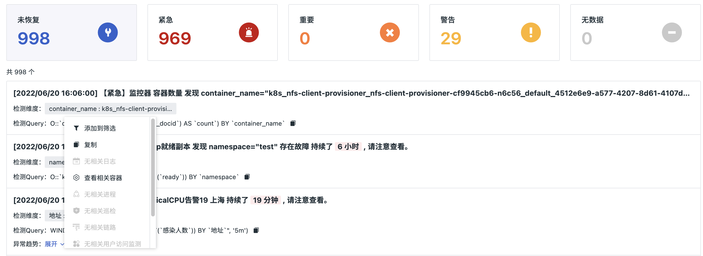


#### Added Log Viewer JSON Format Message Information Search

The log viewer added search functionality for JSON format log content (message), with search format being: `@key.key:value`.

Note: JSON search only supports workspaces created after this feature launch.

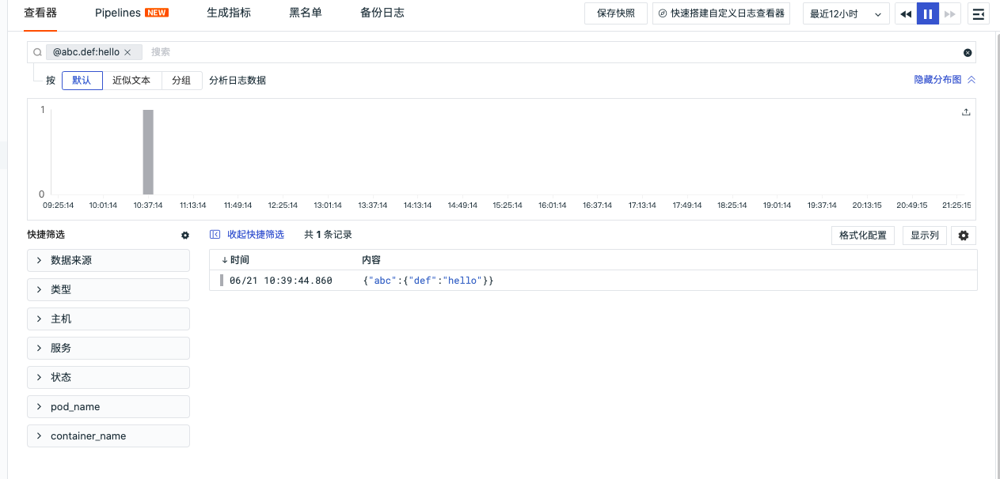


#### Added Custom Input App_ID Support for User Access Monitoring When Creating Applications

Added custom application ID functionality. Supports custom input of app_id when using user access monitoring to create new applications, generating a unique application ID identifier within the current space, which can be used for distinguishing application types and matching data uploads.

- Application Name (required): Used to identify the name of the currently implemented user access monitoring application.
- Application ID Identifier (optional): A unique application ID identifier within the current space, supporting customization and usable for data upload matching; the application ID identifier is up to 20 characters long and only supports inputting uppercase and lowercase letters.
- Application ID: If an application ID identifier is filled when creating the application, after clicking "Create Application," the entered application ID identifier information will be prefixed to the application ID, facilitating querying and filtering by distinguishing applications.


#### Optimized Process Monitoring to Infrastructure Object Monitoring

Process monitoring optimized to infrastructure object monitoring, adding selection of hosts, containers, processes, Pods, Deployments, Replicasets, Jobs, resource catalogs, and other basic objects for monitoring infrastructure object data within the workspace. For more details, refer to the document **Infrastructure Object Monitoring**.

#### Other Functional Optimizations

- Added CPU usage rate and memory usage fill metrics in the Pod viewer's honeycomb mode under Infrastructure PODs
- Optimized log blacklist configuration. Supports manual input of log sources as the source of the log blacklist
- Optimized service list data query time component in application performance monitoring, supporting custom time range selection
- Optimized K8S DataKit installation guidance text, automatically adding the current workspace token when configuring the DataWay data gateway address
- Optimized monitor configuration UI style

### DataKit Updates

#### 2022/06/21

- gitrepo supports passwordless mode
- prom collector
    - Supports log mode collection
    - Supports configuring HTTP request headers
- Supports collection of container logs exceeding 16KB length
- Supports TDEngine collector
- Pipeline
    - Supports XML parsing
    - Remote debugging supports multiple data types
    - Supports calling external Pipeline scripts via the `use()` function in Pipeline
- Added IP library (MaxMindIP) support
- Added DDTrace Profile integration
- Containerd log collection supports filtering rule configuration via image and K8s Annotation
- Entire documentation library transition

#### 2022/06/16

- Log collection supports recording collection position, avoiding data loss due to DataKit restarts
- Adjusted Pipeline settings for handling different types of data
- Supports receiving SkyWalking metric data
- Optimized log blacklist debugging function: 
    - Displays filtered points in Monitor
    - Adds a *.filter* file in the datakit/data directory to record fetched filters
- Adds DataKit open file count display in Monitor
- Upgraded DataKit compiler to golang 1.18.3

#### 2022/06/07

- Added TCP/UDP port detection collector
- Added DNS detection between DataKit and DataWay, supporting dynamic switching of DataWay DNS
- **eBPF** L4/L7 traffic data adds k8s deployment name field
- Optimized OpenTelemetry metric data
- **ElasticSearch** added AWS OpenSearch support
- **Line Protocol Limitations**: String length limit relaxed to 32MB
- **prom** collector added additional configuration, supporting ignoring specified tag=value matches to reduce unnecessary time-series timelines
- Sink added Jaeger support
- Kubernetes-related metric collection defaults to all disabled to avoid excessive timeline growth
- DataKit Monitor adds refresh of dynamically discovered (e.g., prom) collectors

For more DataKit updates, refer to **DataKit Version History**.

### Best Practices Updates

- APM
    - **Achieving Trace Observability with GraalVM and Spring Native Projects**
- Integration (Integration)
    - **Best Practices for Host Observability (Linux)**

More best practice updates can be referenced in **Best Practice Version History**.

### Integration Template Updates

#### Added Documents

- Alibaba Cloud
    - Alibaba Cloud NAT
    - Alibaba Cloud CDN

#### Added Views

- Alibaba Cloud
    - Alibaba Cloud NAT
    - Alibaba Cloud CDN


## June 6, 2022

### <<< custom_key.brand_name >>> Billing Update

<<< custom_key.brand_name >>> billing optimizes the **Time Series** billing logic and the **data retention policy** for metric data. The original cost per 300 items at 3 yuan was reduced to 3 yuan per 1000 items. At the same time, metric data added 3-day, 7-day, and 14-day data retention policies, supporting **custom data retention policies** for metric sets.

Time series statistics include all combinations of labels for the metric data reported in the current workspace. The data retention policy refers to the data storage duration, which is the data retention time for data reported to the current workspace; data exceeding the storage duration will be automatically deleted.

Time series are fully counted, meaning each day’s time series will be cumulatively added during the data retention period. The longer the data retention policy, the higher the time series costs.

This optimization allows more flexible adjustment of the data retention policy for metrics, helping you save costs.

### <<< custom_key.brand_name >>> Updates

#### Added Jenkins CI Observability

<<< custom_key.brand_name >>> added Jenkins CI observability. You can directly view the results of Jenkins CI through <<< custom_key.brand_name >>>'s CI visualization function. The CI process is continuous integration; if developers encounter problems while pushing code, they can view all CI pipelines, success rates, failure reasons, and specific failure stages in <<< custom_key.brand_name >>>, providing code update guarantees. For more details, refer to **CI Visualization**.

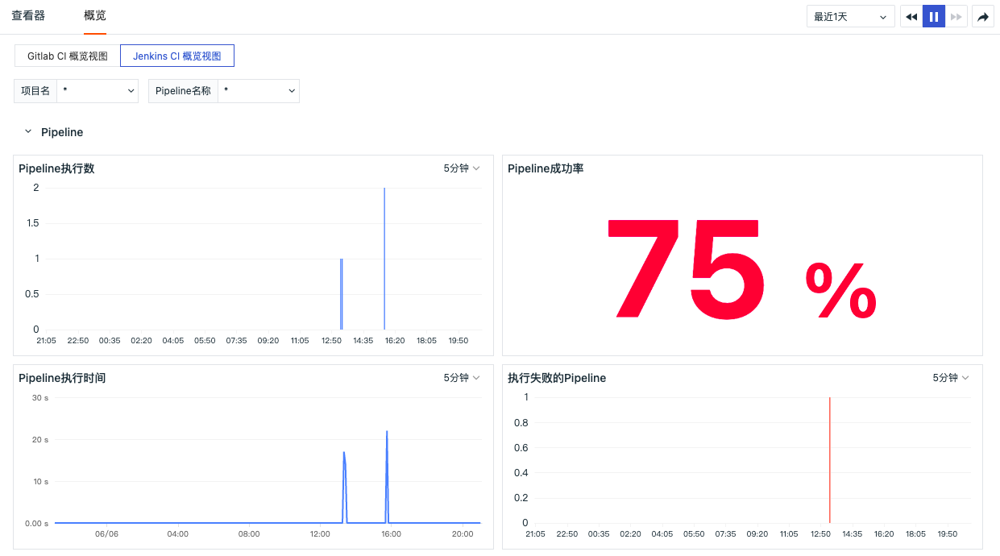

#### Added Custom Viewer Chart Synchronous Search

Custom viewers added a synchronous search switch for charts, used to decide whether the search conditions affect chart queries. By default, it is enabled. When there is content in the search box, turning off the switch returns the chart query to its default state; turning it on means the chart query is affected by the filter content.

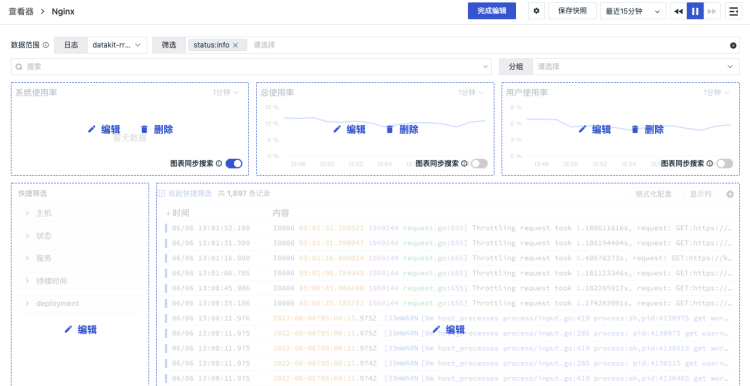

#### Added Network Topology and Service Topology Drill-down Analysis

In the infrastructure network topology diagram, clicking the host/Pod icon and then selecting "View Upstream and Downstream" allows you to view the upstream and downstream node associations of the current node. In the upstream and downstream nodes, clicking the top-left corner's "Return to Overview" returns to the original network topology diagram, where you can filter associated upstream and downstream nodes by searching or screening in the search bar, showing matching associated upstream and downstream nodes according to the search or screening results. For more details, refer to the document **Network View Upstream and Downstream**.


In the service topology diagram, clicking the service icon and then selecting "View Upstream and Downstream" allows you to view the upstream and downstream service associations of the current service. In the upstream and downstream services, clicking the top-left corner's "Return to Overview" returns to the original service topology diagram, where you can filter associated upstream and downstream services by searching or screening in the search bar, showing matching associated upstream and downstream services according to the search or screening results. For more details, refer to the document **Service View Upstream and Downstream**.

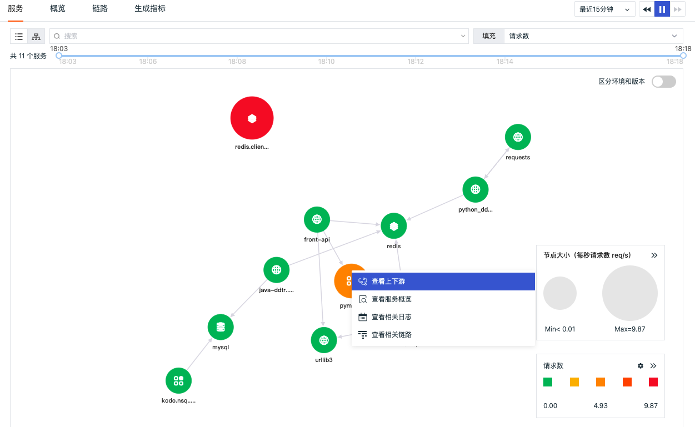

#### Added Deletion of Resource Catalog Data and Indexes

<<< custom_key.brand_name >>> supports owners and administrators deleting specified resource catalog categories and all resource catalogs, entering "Management" - "Basic Settings", clicking "Delete Resource Catalog" after which, select the deletion method for resource catalogs to delete corresponding object data.

- Specified Resource Catalog Category: Only deletes data under the selected object category, without deleting indexes
- All Resource Catalogs: Deletes all resource catalog data and indexes

Note: Once all resource catalogs are deleted, all custom data and indexes reported to the infrastructure will be deleted and cannot be recovered. All set resource catalog category data needs to be re-reported. Limited to 5 deletions of all resource catalogs per day.

For more resource catalog introductions, refer to the document **Customization**.


#### Added Snapshot Viewing Entry in Viewer

In <<< custom_key.brand_name >>> indicators, logs, events, application performance monitoring, user access monitoring, cloud dial tests, security inspections, CI visualizations, etc., after saving snapshots, you can directly click the view snapshot icon in the top-right corner to expand and view already saved snapshots.

- Supports keyword search for snapshot names, matching related snapshots through fuzzy keywords
- The first one is the default view, does not support sharing, copying links, or deleting functions
- Except for the first default view, other snapshots support sharing, copying links, and deleting functions. Clicking "Snapshot Name" opens the corresponding data copy in the current viewer


#### Added Viewer Filter Condition Editing Functionality

In <<< custom_key.brand_name >>> viewer search bar, when filtering using "field:value", you can click "field:value" to edit and modify "field:value", and filter with the modified result.


#### Optimized User Access View Viewer Associated Traces to Fetch/XHR

In <<< custom_key.brand_name >>> user access monitoring View Viewer detail page, switching to "Fetch/XHR" supports viewing every network request made by the user to the backend application during access, including occurrence time, request traces, and duration.


If the network request has a corresponding `trace_id`, there will be a prompt icon before the request, clicking on the request allows jumping to the corresponding trace detail page.

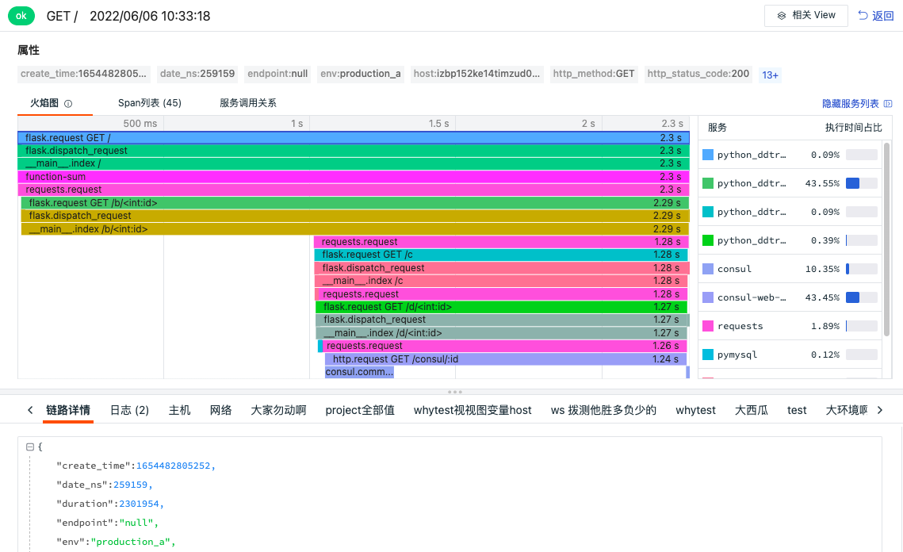

#### Added High-Performance Mode for Chart Data Loading

<<< custom_key.brand_name >>> supports high-performance mode for chart data loading, which is off by default. You can enable it by clicking the account in the bottom-left corner and selecting "High-Performance Mode". After enabling high-performance mode, all charts will not load dynamically but instead load simultaneously upon entering the page, meaning that when scrolling down to view beyond the current page, the charts have already loaded and can be viewed directly.

Note: After enabling high-performance mode, it applies only to the current user viewing charts.

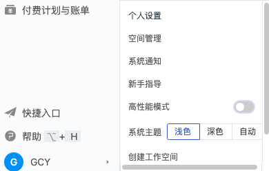

#### Added Customizable Alert Configuration Event Notification Levels

Alert configurations support customizing event notification levels, including seven choices: Critical, Important, Warning, Recovery, Data Gap, Data Gap Recovery, and Data Gap Considered as Recovery. Multiple selections are supported, along with one-click clearing of options. After clearing, manual selection of corresponding values is required. For more alert configurations, refer to the document **Alert Settings**.

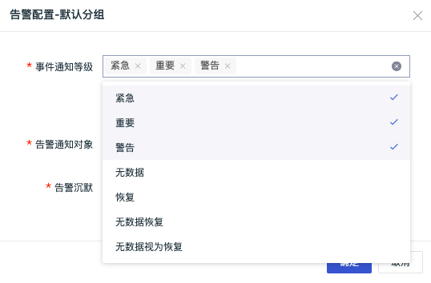

#### Other Functional Optimizations

- Scene dashboards support hiding/showing large titles in combined charts
- Optimized event detail page event type text display
- Added sorting functionality by fields in infrastructure list views
- Added hide distribution chart button in the log viewer
- Viewer supports searching display columns via keywords, supporting custom display columns as preset fields, which can directly display uploaded data after cutting fields via Pipeline and reporting data.
- In built-in template libraries and built-in views, added one-click access to corresponding integration documents, helping you quickly configure the corresponding collector
- Built-in views, in addition to supporting binding related views in the viewer to trace services, applications, log sources, projects, and tags, newly support custom key and value bindings for related views, and also support binding built-in views on the service side slide detail page
- Optimized WeCom robot notifications, supporting custom key security verification
- When configuring monitors, if the configured data range is less than the detection frequency, prompts about potential data gap issues are triggered

### DataKit Updates (**2022/05/26**)

- Pipeline was adjusted so all data types can be processed via Pipeline configuration
- grok() supports directly extracting fields as specified types, eliminating the need for additional cast() function type conversion
- Pipeline added multi-line string support, allowing very long strings (such as grok regular expression splits) to be written as multi-line, improving readability
- Each Pipeline's execution status can be directly viewed via datakit monitor -V
- Added CPU/memory metrics for Kubernetes Pod objects
- Helm added more Kubernetes version installation compatibility
- Optimized OpenTelemetry, added JSON support for HTTP protocol
- DataKit added error logging during automatic correction of line protocols, facilitating debugging of data issues
- Removed all string metrics from time-series data
- For participating election collectors in DaemonSet installations, added a specific tag (election_namespace) to all data if the election namespace is configured
- CI observability added Jenkins support

#### Breaking Changes

For Docker container log collection, the host (Node)’s _/var/lib_ path must be mounted inside DataKit (since Docker logs default to _/var/lib/_ on the host). In _datakit.yaml_, add the following configurations to `volumeMounts` and `volumes`:

```yaml
volumeMounts:
- mountPath: /var/lib
  name: lib

# Omitted other parts...

volumes:
- hostPath:
    path: /var/lib
  name: lib
```

### Best Practices Updates

- APM
    - Based on <<< custom_key.brand_name >>>, using SkyWalking to achieve联动 analysis of RUM, APM, and logs
- Monitoring Best Practices
    - Construction of OpenTelemetry Observability
    - OpenTelemetry to Jaeger, Grafana, ELK
    - OpenTelemetry to Grafana
    - OpenTelemetry to <<< custom_key.brand_name >>>
- <<< custom_key.brand_name >>> Tips
    - OpenTelemetry Sampling Best Practices


### Integration Template Updates
#### Added Documents and Views

- Data Collection
    - Opentelemetry Collector
- Container Orchestration
    - Kubernetes Scheduler
    - Kubernetes Controller Manager
    - Kubernetes API Server
    - Kubernetes Kubelet
#### Added Views

- Container Orchestration
    - Kubernetes Nodes Overview
- Middleware
    - JVM Kubernetes


## May 19, 2022

### <<< custom_key.brand_name >>> Updates

#### Optimized <<< custom_key.brand_name >>> Commercial Edition Registration Process

During <<< custom_key.brand_name >>> registration, both Free Plan and Commercial Plan registration options are provided. You can register <<< custom_key.brand_name >>> accounts according to actual needs. <<< custom_key.brand_name >>> supports pay-as-you-go and subscription-based billing methods, offering a ready-to-use platform to achieve comprehensive observability.

#### Added Scenario Dashboard User View Template Library

<<< custom_key.brand_name >>> includes over 60 built-in system view templates. Without configuration, these templates are ready-to-use, meeting various monitoring scenario requirements. You can customize views as user view templates to create dashboards with one click.

#### Added Custom Filtering and Linkage for Scenario Custom Viewers Logs Source and Filters

The data scope of scenario custom viewers has added filtering functionality. Based on log sources, it filters the fields under that log source, supporting matching multiple fields for further filtering of log data along with search and grouping.

#### Added Copying Event Detail Page Content as JSON Format

On the event detail page, supports clicking the "Copy Complete Event Content" button to obtain all critical data corresponding to the current event. If a dashboard is associated in the monitor configuration, you can click the "Associated Dashboard" button to jump to the corresponding dashboard.

In the **Associated Information** section of the event detail page, if "Log Detection" configures multiple expression queries (of the same object type), the associated information supports tab switching for multiple expression queries. If there are two expression queries A and B, then the relationship information contains tabs A and B for switching views.


#### Added Log Data Desensitization Processing

<<< custom_key.brand_name >>> added log data desensitization processing. After data collection and reporting to the <<< custom_key.brand_name >>> workspace, some sensitive information may exist, such as IP addresses and user information. These can be desensitized by configuring sensitive fields.

Note:

- Desensitized data is only viewable by workspace administrators and above; standard and read-only members cannot view desensitized information.
- Configuring sensitive fields is only operable by workspace administrators and above; standard and read-only members can only view configured sensitive fields.


#### Optimized Log Viewer and Detail Page

<<< custom_key.brand_name >>> **Log Viewer** defaults to displaying "time" and "message" fields. This optimization now supports hiding the "message" field.

In the log detail page, log content automatically displays in Json and text modes based on the message type. If the log lacks a message field, the log content section will not be displayed. Log content supports expanding/collapsing, defaulting to expanded state. After collapsing, only one line height is displayed.

Extended fields display all related fields of the log, supporting "copy" and "add to filter" for quick filtering and viewing.


#### Added Network Data Monitoring Monitor

**Network Data Monitoring** is used to monitor the performance metrics of network data within the workspace. By setting threshold ranges, alerts are triggered when metrics reach thresholds. "<<< custom_key.brand_name >>>" supports setting alerts for individual metrics and custom alert levels. In **Monitors**, click `+ Create New Monitor`, select `Network Data Monitoring`, and enter the detection rule configuration page.


#### Optimized Built-in View Binding Functionality

<<< custom_key.brand_name >>> built-in views include system views and user views. This optimization cancels custom binding of system views as viewer views, only supporting binding user views as viewer views. To bind system views, clone them as user views first. If system views and user views have the same name, user views take precedence in the viewer. For how to bind user views as viewer views, refer to the document **Binding Built-in Views**.


#### Other Functional Optimizations

- Added prepaid card balance to Billing
- Optimized infrastructure detail styles
- Improved line breaks in link detail pages
- Optimized template variable display in monitor configurations
- Added shortcuts for DQL queries and snapshots menus
- <<< custom_key.brand_name >>> management backend supplements template management classification information

### DataKit Updates (2022/5/12)

- eBPF added arm64 support
- Line protocol construction supports automatic correction
- DataKit main configuration added example configuration
- Prometheus Remote Write supports tag renaming
- Merged community edition DataKit existing functionalities, mainly including Sinker functions and filebeat collectors
- Adjusted container log collection, DataKit now directly supports containerd container stdout/stderr log collection
- Adjusted hostname acquisition strategy in DaemonSet mode
- Trace collector supports filtering resources (`resource`) via wildcard service names (`service`)

For more DataKit updates, refer to **DataKit Version History**.

### Best Practices Updates

- Cloud Native
    - Use <<< custom_key.brand_name >>> to initiate Rancher observability journey
- Microservices Observability Best Practices
    - Kubernetes cluster applications use SkyWalking to collect trace data
    - Kubernetes cluster logs are reported to the same node's DataKit best practices
- Gitlab-CI Observability Best Practices
    - Gitlab-CI Observability Best Practices

More best practice updates can be referenced in **Best Practice Version History**.

### Integration Template Updates

#### Added Documents and Views

- Middleware
    - Resin
    - Beats
- Host System
    - Procstat
#### Added Views

- Container Orchestration
    - Istio Service
- Alibaba Cloud
    - ASM Service


## May 6, 2022

### <<< custom_key.brand_name >>> Updates

#### Optimized <<< custom_key.brand_name >>> Commercial Edition Upgrade Process

<<< custom_key.brand_name >>> upgrades to the commercial edition default to opening **<<< custom_key.brand_name >>> Billing Center Account Settlement**, supporting changing the settlement method to cloud account settlement, including **Alibaba Cloud Account** and **AWS Cloud Account** settlement methods.

#### Added Process, Log, and Trace Detail Page Associated Networks

<<< custom_key.brand_name >>> **Process**, **Log**, **Trace** detail pages added associated network data analysis, supporting viewing source host/source process service to target network traffic and data connection situations based on IP/port, visually displaying them in real time to help enterprises understand the operational status of their business system networks, quickly analyzing, tracking, and locating problem faults, preventing or avoiding business problems caused by network performance degradation or interruptions.


#### Scene Module Optimization

##### Optimized Dashboards, Removed Edit Mode

In the scene **Dashboard** top navigation bar, removed the "Edit" button, added "Add Chart" to add new charts to the dashboard. After adding the chart, click the top-right corner "Complete Adding" to finish.

In **Charts**, click the "Settings" button, select "Modify" to edit the chart.


##### Added Chart Link Display Switch
<<< custom_key.brand_name >>> supports built-in and custom links in charts, helping you jump from the current chart to the target page. Built-in links are the default associated links provided by <<< custom_key.brand_name >>> for charts, mainly based on the current query time range and grouping labels, helping you view corresponding logs, processes, containers, and traces. Built-in links display switches are off by default and can be enabled during chart editing; custom links, once created, have their display switches on by default. For more details, refer to the document **Chart Links**.


##### Optimized Conversion Between DQL Queries and Simple Queries
Click the toggle button to the right of **DQL Query** to switch DQL Query to Simple Query.<br />Note: When switching **DQL Query** to **Simple Query**, if it cannot be parsed or is incompletely parsed:

- In **Simple Query**, if no operations are performed, switching back to **DQL Query** will display the previous DQL Query statement;
- In **Simple Query**, if the query statement is adjusted, switching back to **DQL Query** will parse according to the latest **Simple Query**.

For more applications of DQL Queries and Simple Queries, refer to the document **Chart Queries**.


#### Monitor and Event Module Optimization

##### Added Event Related Information
<<< custom_key.brand_name >>> supports viewing related information that triggers the current event, such as viewing logs related to triggering events. This **related information** only supports events generated by 4 types of monitors: log detection, security inspection anomaly detection, process anomaly detection, and availability data detection.


##### Added Data Gap Event Name and Content Configuration
<<< custom_key.brand_name >>> monitors "Threshold Detection", "Water Level Detection", "Range Detection", "Spike Detection", "Process Anomaly Detection", "Application Performance Indicator Detection", "User Access Indicator Detection" added data gap event title and content configuration, defaulting to non-editable. When choosing to trigger data gap events, the data gap event name becomes editable, supporting the use of pre-configured template variables. For more details, refer to **Event Name/Content Templates**.


##### Optimized Availability Data Detection
<<< custom_key.brand_name >>> monitor **Availability Data Detection** now supports selecting HTTP, TCP, ICMP, WEBSOCKET test types.

##### Optimized Alarm Notification Templates, Added Associated Jump Links
Emails, DingTalk, WeChat, and Lark received alarm notifications include "<<< custom_key.brand_name >>> jump links". Clicking the link directly jumps to the corresponding <<< custom_key.brand_name >>> event details, with a time range of 15 minutes prior to the current time. For instance, an event at 18:45:00 will jump to the event detail page with a fixed time range of 18:30:00 ~ 18:45:00 on April 20th. For more alarm notifications, refer to the document **Alarm Settings**.

#### Other Functional Optimizations

- Optimized service servicemap metric query performance
- Added support for numerical fields in viewers with > | >= | < | <= | [] 5 types of expressions
- Added label cascading filtering support for metric viewers
- Optimized DQL query return error prompts

### DataKit Updates

- The filtering function of the process collector only affects metric collection, object collection remains unaffected
- Optimized DataKit sending DataWay timeout issues
- Optimized Gitlab collector
- Fixed log collection truncation issues
- Fixed various trace collectors reload issues where some configurations were not taking effect

More DataKit updates can be referenced in **DataKit Version History**.

### Integration Template Updates

#### Added Redis Sentinel Data Storage Integration Documents and Views

The Redis-sentinel observation scenario primarily showcases Redis clusters, slaves, and node distribution information.

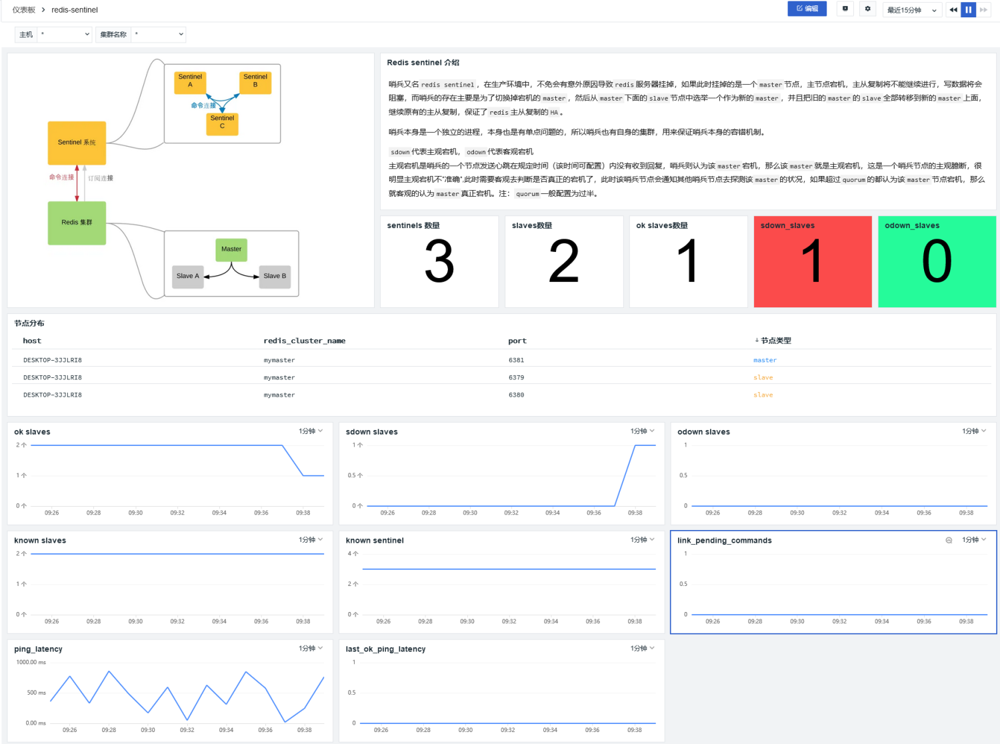


## April 26, 2022

### <<< custom_key.brand_name >>> Updates

#### Optimized SSO Single Sign-On

<<< custom_key.brand_name >>> supports users enabling SSO single sign-on based on workspaces. Users log in by entering their company email to obtain the corresponding SSO login, achieving corresponding verification login. In <<< custom_key.brand_name >>> workspace "Management" - "SSO Management" - "Enable", you can set SSO single sign-on for employees. The main optimizations include:

- A workspace updated from supporting creation of multiple identity providers to only supporting configuration of one SSO single sign-on. By default, the last updated SAML2.0 configuration will be considered the final single sign-on entry point.
- If multiple workspaces configure the same identity provider (IdP) data, after SSO single sign-on, you can switch to view data from corresponding workspaces.
- During SSO single sign-on configuration, the "User Whitelist" configuration was replaced with "Email Domain", requiring only the suffix domain of the email to match the email suffix configured by the identity provider (IdP) for single sign-on.
- SSO single sign-on enabling, configuration updates, and deletions support email notifications and generate audit events.
- SSO single sign-on users support deletion and editing, with editing able to upgrade permissions to "Administrator"

For more SSO single sign-on details, refer to the document **SSO Management**.


## April 21, 2022

### <<< custom_key.brand_name >>> Community Edition Launch

<<< custom_key.brand_name >>> Community Edition provides teachers, students, cloud computing enthusiasts, and other community users with a simple, easy-to-obtain, and feature-complete productized local deployment platform. Welcome to apply for free and download to try, building your own <<< custom_key.brand_name >>> platform and experiencing the complete product features.

### <<< custom_key.brand_name >>> Updates

#### Added Gitlab CI Observability

<<< custom_key.brand_name >>> supports visualizing the process and results of Gitlab's built-in CI. You can directly view the results of Gitlab's CI through <<< custom_key.brand_name >>>'s CI visualization function. The CI process is continuous integration; if developers encounter problems while pushing code, they can view all CI pipelines, success rates, failure reasons, and specific failure stages in <<< custom_key.brand_name >>>, providing code update assurance. More detailed introduction can be found in **CI Viewer**.

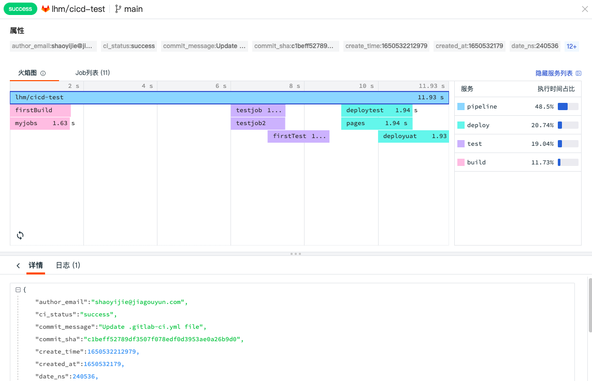

#### Added Online Help Obus Assistant

<<< custom_key.brand_name >>> Obus assistant helps you quickly view basic entry, advanced guides, best practices, DataKit, Func, and other documents in the workspace, by clicking provided keywords or directly entering keywords in the search bar for searches, helping you quickly obtain relevant document descriptions. More detailed introduction can be found in the document **Help**.

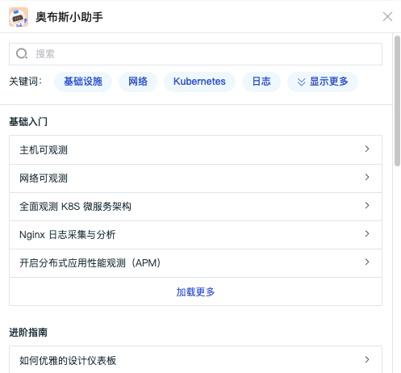

#### Added Dashboard Refresh Frequency Setting

<<< custom_key.brand_name >>> supports setting refresh frequencies for scenario dashboards. The initial refresh frequency is set to 30 seconds by default, supporting options of 10 seconds, 30 seconds, and 60 seconds. If the time control is "Paused", it will no longer refresh.

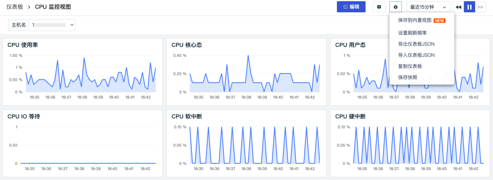

#### Added 48-Hour Process Replay

<<< custom_key.brand_name >>> infrastructure processes support viewing process data collected within the last ten minutes. You can view 48-hour process replays by clicking the time range. After dragging, refreshing pauses, and the time displayed is [Start Time - End Time]. The query time range is 5 minutes. Clicking the "Play" button or refreshing the page returns to viewing the "last 10 minutes" of processes.


#### Added Integration DataKit Kubernetes (Helm) Installation Guide Page

In <<< custom_key.brand_name >>> integration DataKit installation guide page, added a Kubernetes (Helm) installation guide, introducing how to use Helm to install DataKit in K8S.


#### Added Global Overview, Service Classification Filtering, and Environment/Version Differentiation in Service Topology Diagrams for Application Performance Monitoring

Application Performance Monitoring added a global performance overview view. You can view online service counts, P90 service response times, maximum impact service durations, service error counts, and service error rates in the overview page. Additionally, you can view the Top10 rankings for P90 service, resource, and operation response times, as well as the Top10 rankings for service error rates, resource 5xx error rates, and resource 4xx error rates.


In the application performance service list, you can classify and filter services by clicking the service type icon. Clicking again restores full viewing.

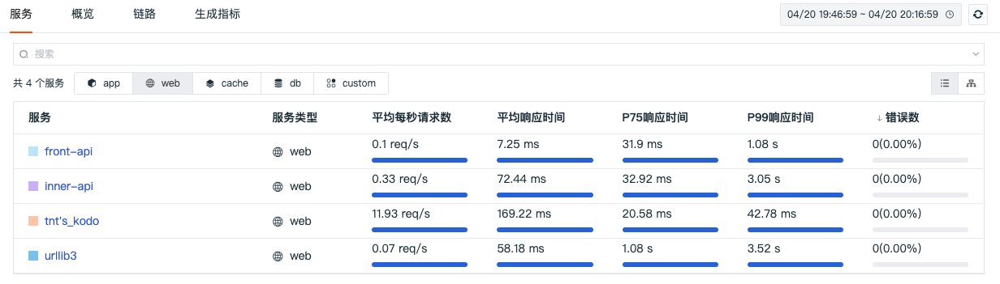

In the service list, switch to "Topology Diagram" mode to view the call relationships between various services. Supports drawing service topology diagrams based on service (service) and service environment versions (service+env+version). After enabling "differentiate environment and version", it will draw service topology diagrams according to different environment versions. For example, in Canary releases, enabling environment and version differentiation allows viewing service call situations under different environment versions.


#### Optimized SSO Single Sign-On Configuration
SSO single sign-on configuration user whitelist adjusted to email domain, used to verify if the email suffix entered during single sign-on matches, allowing matched emails to obtain the SSO login link online. For more SSO configuration details, refer to the document **SSO Management**.

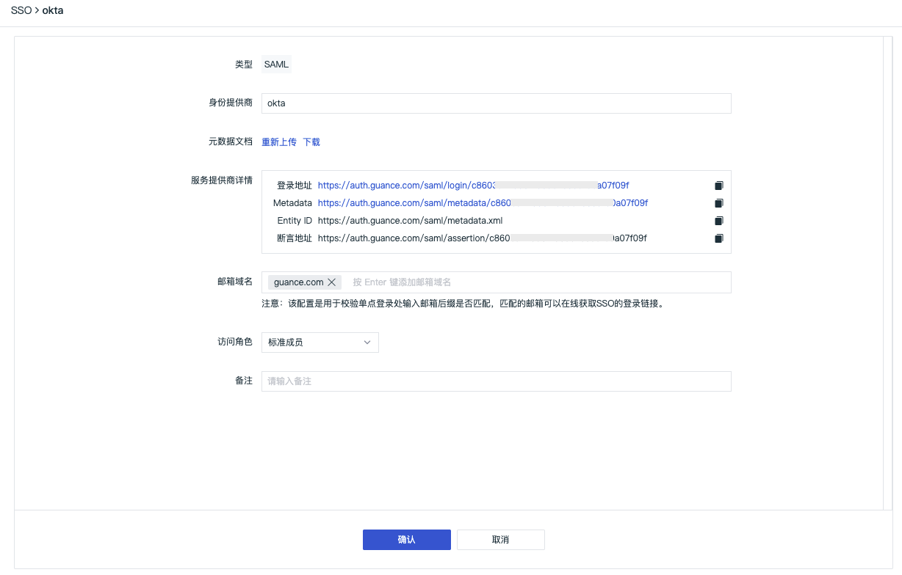

#### Other Functional Optimizations

- Added associated log "All Sources" option in the trace detail page
- Added inverse selection support for metric filtering, adjusted aggregation function positions
- Optimized log, application performance, user access, security inspection metric generation, where the "frequency" selected time also serves as the aggregation cycle
- Optimized <<< custom_key.brand_name >>> deployment version workspace owner transfer permission function cancellation, supporting backend management settings
- Optimized alarm notification SMS templates
- Optimized creation of new dial tests in availability monitoring, supporting direct selection of HTTP, TCP, ICMP, WEBSOCKET dial tests

### DataKit Updates

- Fixed Grok dynamic multiline pattern issue in the Pipeline module
- Optimized DaemonSet Helm installation, added pprof environmental variable configuration support; all default-enabled collector configurations in DaemonSet support environmental variable configurations
- Tracing collector initially supports Pipeline data processing.
- Test collector added failed task exit mechanism
- Added `unknown` level (status) for logs; logs without specified levels are marked as `unknown`
- Container collector fixes:
    - Fixed cluster field naming issues
    - Fixed namespace field naming issues
    - In container log collection, if Pod Annotation does not specify log `source`, DataKit will deduce the log source based on this priority
    - Object reporting is no longer restricted by the 32KB character limit (due to Annotation content exceeding 32KB); all Kubernetes objects remove `annotation`

More DataKit updates can be referenced in **DataKit Version History**.

### Best Practices Updates

- Cloud Native
    - Leveraging <<< custom_key.brand_name >>> to start Rancher observability journey
- Microservices Observability Best Practices
    - Using SkyWalking to collect trace data for applications in Kubernetes clusters
    - Best practices for reporting logs from Kubernetes clusters to the same node's DataKit
- Gitlab-CI Observability Best Practices
    - Gitlab-CI Observability Best Practices

More best practice updates can be referenced in **Best Practice Version History**.

### Integration Template Updates

#### Added Documents and Views

- Middleware
    - Resin
    - Beats
- Host System
    - Procstat
#### Added Views

- Container Orchestration
    - Istio Service
- Alibaba Cloud
    - ASM Service


## April 8, 2022

### <<< custom_key.brand_name >>> Updates

#### Optimized SSO Single Sign-On Configuration

SSO single sign-on configuration adjusts user whitelists to email domains, verifying if the email suffix entered during single sign-on matches. Matched emails can obtain SSO login links online. For more SSO configuration details, refer to the document **SSO Management**.


#### Other Functional Optimizations

- Added span count statistics in the trace detail page
- Optimized the drawing method of associated host timelines in traces
- Workflow overdue lock process optimization
- User experience optimization for workspace invitations
- Help documentation added evaluation system, including better and worse options
- Monitoring bulk function optimization
- SLO added enable/disable functionality
- Fuzzy matching Wildcard left * query restriction optimization

### DataKit Updates

- Pipeline module fixed Grok dynamic multiline pattern issues
- DaemonSet optimized Helm installation, added pprof environmental variable configuration support; all default-enabled collector configurations in DaemonSet support environmental variable configurations
- Tracing collector initially supports Pipeline data processing.
- Test collector added failed task exit mechanism
- Logs added `unknown` level (status) for logs; logs without specified levels are marked as `unknown`
- Container collector fixes:
    - Fixed cluster field naming issues
    - Fixed namespace field naming issues
    - In container log collection, if Pod Annotation does not specify log `source`, DataKit will deduce the log source based on this priority
    - Object reporting is no longer restricted by the 32KB character limit (due to Annotation content exceeding 32KB); all Kubernetes objects remove `annotation`

More DataKit updates can be referenced in **DataKit Version History**.

### Best Practices Updates

- Microservices Observability Best Practices
    - Full lifecycle best practices for service mesh microservice architecture from development to Canary release (Part 1)
    - Full lifecycle best practices for service mesh microservice architecture from development to Canary release (Part 2)
    - Full lifecycle best practices for service mesh microservice architecture from development to Canary release (Part 3)
- Monitoring Best Practices
    - JAVA OOM Exception Observability Best Practices

More best practice updates can be referenced in **Best Practice Version History**.

### Integration Template Updates

#### Added Documents

- Application Performance Monitoring (APM)
    -    - Node.JS
    - Ruby
- Middleware
    - RocketMQ
- Container Orchestration
    - Istio
    - Kube State Metrics
- Data Storage
    - Aerospike

#### Added Views

- Container Orchestration
    - Kubernetes Overview by Pods
    - Istio Mesh
    - Istio Control Plane
- Alibaba Cloud
    - Alibaba Cloud ASM Mesh
    - Alibaba Cloud ASM Control Plane
    - Alibaba Cloud ASM Workload
- Middleware
    - RocketMQ


## April 8, 2022

### <<< custom_key.brand_name >>> Billing Update

#### Added Alibaba Cloud Account Settlement Method

In the <<< custom_key.brand_name >>> Billing Center "Manage Workspace", you can view all workspaces bound to the account and modify the settlement method for already bound workspaces. Through "Change Settlement Method", you can freely switch between <<< custom_key.brand_name >>> Billing Center Account, Amazon Cloud Account, and Alibaba Cloud Account settlements.

### <<< custom_key.brand_name >>> Updates

#### Added DQL Query Viewer

DQL is a language developed specifically for <<< custom_key.brand_name >>>, with simple syntax for easy use. You can perform data queries in <<< custom_key.brand_name >>> workspace or terminal devices using DQL language.

In <<< custom_key.brand_name >>> workspace, click the menu bar's "DQL Query" to open the DQL Query Viewer, or you can directly open DQL Query via the shortcut key `Alt+Q`. The DQL Query Viewer supports table and JSON return results, saving 7 days of historical query records.

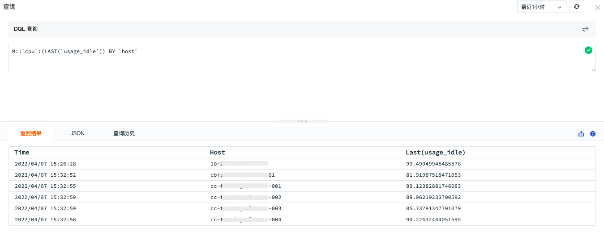

#### Added TCP/ICMP/Websocket Dial Test Protocols to Availability Monitoring

<<< custom_key.brand_name >>> supports custom dial test tasks. By creating dial test tasks based on different protocols such as HTTP, TCP, ICMP, WEBSOCKET, it comprehensively monitors network performance, network quality, and stability of network data transmission to various services from different regions and carriers.


#### Added Infrastructure Network Module

In infrastructure, the original Host Network Map and Pod Network Map have been moved from the Host and Container modules to the newly added "Network" module, supporting viewing the network Map of hosts and Pods. The Pod Network Map has added seven-layer network metrics: requests per second, error rate, and average response time. For more details, refer to the document **Network**.


#### Added HTTP Seven-Layer Network Data Display for Infrastructure Container Pods

Infrastructure container Pods have added HTTP seven-layer network data collection and display. After successful Pod network data collection, it will be reported to <<< custom_key.brand_name >>> workspace. In "Infrastructure" - "Container" - "Pod" detail page under "Network", you can view the full Pod network performance monitoring data information within the workspace. For more details, refer to the document **Pod Network**.


#### Added Quick Filter "Inverse Selection" and "Reset" Functions to Viewers

In any viewer's "Quick Filter", supports "inverse selection" or "reset" when selecting field filter content. "Inverse selection" indicates that the selected field filter content is not displayed (clicking "inverse selection" again returns to the selected state), and "reset" clears the filter conditions. For more details, refer to **Log Viewer Quick Filter**.


#### Optimized Log Blacklist

<<< custom_key.brand_name >>> supports filtering out logs that meet certain conditions through setting log blacklists, helping users save on log data storage costs.

Log blacklist optimization supports matching all log sources and provides two blacklist configuration methods:

- Trigger blacklist filtering if any one of the filter conditions is met
- Trigger blacklist filtering only if all filter conditions are met

For more blacklist configurations, refer to the document **Log Blacklist**.


#### Other Functional Optimizations

- Added span count statistics in trace detail pages
- Optimized timeline drawing method for associated hosts in traces
- Overview chart time slicing optimized, removed options; if previous overview charts had time slicing enabled, after optimization, they default to disabling time slicing
- Fixed issues where editing different chart queries in combined charts did not function properly after browser scaling
- Optimized manual pause refresh triggering automatic refresh when scrolling to the top in the log viewer

### DataKit Updates

- Increased memory limits for host runtime during installation, supporting memory limit configuration during installation
- CPU collector added load5s metric
- Supports <<< custom_key.brand_name >>>'s optimized log blacklist functionality, adjusting monitor layout and adding blacklist filtering status display
- DaemonSet installation added Helm support, new best practices for DaemonSet installation
- eBPF added HTTP protocol collection; during host installation, the eBPF collector no longer installs by default. Specific installation instructions are required if needed, DaemonSet installation remains unaffected

For more DataKit updates, refer to **DataKit Version History**.

### <<< custom_key.brand_name >>> Mobile App Updates

Added site login capabilities, optimized scene and event viewers to maintain the same access experience as the web version.

- Supports users selecting accounts corresponding to sites, logging in via account password or verification code.
- Supports users viewing all or any source log data
- Supports users viewing all dashboards under the current space, and switching via dropdown menus between "All Dashboards", "My Favorites", "Imported Projects", "My Creations", and "Frequently Browsed" for quick filtering and finding corresponding dashboards.
- Supports users in the **Event** viewer to view, search, and filter all unresolved events triggered by anomaly detection libraries through "All"; through "Mine" events, view unresolved events notified to users via email, DingTalk bots, WeCom bots, Lark, or Webhooks.

### Best Practices Updates

- <<< custom_key.brand_name >>> Tips
    - Performance Observability Practices for Multiple Microservices Projects
    - Advanced Usage of ddtrace
    - Mapping DataKit Services Using ExternalName in Kubernetes Clusters
- Integration Best Practices
    - Best Practices for Integrating OpenTelemetry Trace Data
- Microservices Observability Best Practices
    - Best Practices for Achieving Microservices Observability Based on Alibaba Cloud ASM

For more best practice updates, refer to **Best Practice Version History**.

### Integration Template Updates

#### Added Alibaba Cloud PolarDB Oracle Integration Documents, Views, and Monitors

Alibaba Cloud PolarDB Oracle metrics display includes CPU usage rate, memory usage rate, network traffic, connection count, IOPS, TPS, data disk size, etc.


#### Added Alibaba Cloud PolarDB PostgreSQL Integration Documents, Views, and Monitors

Alibaba Cloud PolarDB PostgreSQL metrics display includes CPU usage rate, memory usage rate, network traffic, connection count, IOPS, TPS, data disk size, etc.


#### Added Alibaba Cloud RDS SQLServer Integration Documents, Views, and Detection Libraries

Alibaba Cloud RDS SQLServer metrics display includes CPU usage rate, disk usage rate, IOPS, network bandwidth, TPS, QPS, etc.


#### Added DataKit Integration Documents, Views, and Monitors

DataKit performance metrics display includes CPU usage rate, memory information, running time, log records, etc.


#### Added Nacos Integration Documents and Views

Nacos performance metrics display: Nacos online duration, Nacos config long connections, Nacos config count, Service Count, http request counts, etc.


## March 24, 2022

### <<< custom_key.brand_name >>> Site Updates

<<< custom_key.brand_name >>> supports multi-site login and registration, adding the "Overseas Zone 1 (Oregon)" site. The original "China Zone 1 (Alibaba Cloud)" changed to "China Zone 1 (Hangzhou)", and "China Zone 2 (AWS)" changed to "China Zone 2 (Ningxia)."

Accounts and data between different sites are mutually independent and cannot share or migrate data. You can choose an appropriate site based on your resource usage situation for registration and login. Currently, <<< custom_key.brand_name >>> supports the following three sites. For how to choose a site, refer to the document **<<< custom_key.brand_name >>> Site Description**.

| Site | Login URL | Carrier |
| --- | --- | --- |
| China Zone 1 (Hangzhou) | **https://auth.<<< custom_key.brand_main_domain >>>/** | Alibaba Cloud (China Hangzhou) |
| China Zone 2 (Ningxia) | **https://aws-auth.<<< custom_key.brand_main_domain >>>/** | AWS (China Ningxia) |
| Overseas Zone 1 (Oregon) | **https://us1-auth.<<< custom_key.brand_main_domain >>>/** | AWS (US Oregon) |


### <<< custom_key.brand_name >>> Updates

#### Added Workspace Data Authorization

<<< custom_key.brand_name >>> supports authorizing data from multiple workspaces to the current workspace through data authorization, allowing querying and displaying through scenario dashboard and notebook chart components. If you have multiple workspaces, after configuring data authorization, you can view data from all workspaces in one workspace. For more configuration details, refer to the document **Data Authorization**.

1. Configure the workspaces whose data needs to be authorized in "Management" - "Data Authorization".


2. After obtaining data authorization in the workspace, open "Scenario" - "Dashboard or Notebook", select the chart component, and choose the authorized workspace in the "Settings" section under "Workspace". Then, you can query and analyze data from the authorized workspace through **Chart Queries**.


#### Added Saving Online Pipeline Sample Test Data

<<< custom_key.brand_name >>> Pipeline supports two types: custom and official library:

- After writing custom Pipeline script rules, you can input log sample data for testing to verify if your configured parsing rules are correct. When saving custom Pipelines, log sample test data is saved synchronously.
- The official Pipeline library comes with multiple log sample test data. Before "cloning," you can select the log sample test data that meets your needs. After modifying and saving the cloned Pipeline, the log sample test data is saved synchronously.

For more online Pipeline feature details, refer to the document **Pipelines**.


#### Optimized Resource Catalog Viewer

In <<< custom_key.brand_name >>> workspace, through "Infrastructure" - "Custom" - "Add Object Classification", you can create new object classifications and configure resource catalog classification names and object fields.

After adding the resource catalog classification, you can report custom data through the **Func Function Processing Platform**. For how to report data to <<< custom_key.brand_name >>> workspace through Func, refer to the document **Resource Catalog Data Reporting**.


#### Optimized Snapshot Sharing to Support Permanently Valid Links

Snapshot sharing supports setting validity periods, allowing selection of "48 hours" or "permanently valid." In the snapshot list, clicking the share button allows advanced settings "Hide Top Bar" in the pop-up dialog box. For more snapshot sharing details, refer to the document **Snapshots**.

Note: Permanently valid sharing may easily pose data security risks, please use with caution.


#### Optimized Chart Time Intervals

In the chart settings of scenario dashboards, choosing "Auto Align" for time intervals displays a time interval option in the top-right corner of the preview chart, allowing you to select time intervals according to your actual situation to view your data.


#### Optimized Process, Application Performance, User Access Detection Data Gap Trigger Strategies

In <<< custom_key.brand_name >>> monitoring functional modules, when configuring process anomaly detection, application performance indicator detection, and user access indicator detection monitors, data gap states support three configurations: "Trigger Data Gap Event", "Trigger Recovery Event", and "Do Not Trigger Event", requiring manual configuration of data gap handling strategies.

#### Other Functional Optimizations

- Optimized DataKit, Func installation guide pages
- Optimized complete display of single log in log viewer
- Added NOT combination to viewer associated searches
- Optimized member permission display during editing

### DataKit Updates

- Added command-line completion functionality to DataKit, helping you with command prompts and parameter completions while operating in the terminal
- Allows upgrading DataKit to non-stable versions to experience the latest experimental features; if you're in a production environment, please upgrade cautiously
- Preliminarily supports data collection under Kubernetes/Containerd architecture
- Network tests add support for TCP/UDP/ICMP/Websocket protocols
- Adjusted Remote Pipeline storage in DataKit locally to avoid file name case sensitivity issues caused by different file systems
- Pipeline added decode() function, avoiding configuring encoding in the log collector and implementing encoding conversion in Pipeline; add_pattern() increased scope management

For more DataKit updates, refer to **DataKit Version History**.

### Best Practices Updates

- Scenario Best Practices
    - Best Practices for RUM Data Reporting to DataKit Cluster
- Log Best Practices
    - Best Practices for Pod Log Collection

For more best practice updates, refer to **Best Practice Version History**.

### Integration Template Updates

#### Added Alibaba Cloud PolarDB Mysql Integration Documents, Views, and Detection Libraries

Alibaba Cloud PolarDB Mysql metrics display includes CPU usage rate, memory hit rate, network traffic, connection count, QPS, TPS, read-only node delay, etc.


## March 10, 2022

### <<< custom_key.brand_name >>> Billing Update

#### Added <<< custom_key.brand_name >>> Prepaid Card

<<< custom_key.brand_name >>> prepaid cards support purchasing through account cash balance, applicable to all <<< custom_key.brand_name >>> consumption modes, including pay-as-you-go and annual subscription packages. Log into the <<< custom_key.brand_name >>> **Billing Center**, click "Manage Prepaid Cards", and enter the prepaid card management page to purchase. After purchasing and paying for the prepaid card, invoices equivalent to the actual payment amount will be issued. For more details, refer to **Prepaid Card Management**.

### <<< custom_key.brand_name >>> Updates

#### Added User Access Monitoring Resource (Resource), Action (Action), Long Task (Long Task), Error (Error) Viewers

User access monitoring viewers help you view and analyze detailed information about user visits to applications. In the <<< custom_key.brand_name >>> workspace, open "User Access Monitoring", click any application, and use the "Viewer" to understand each user session, page performance, resources, long tasks, errors affecting users, and help you fully understand and improve the application's operational state and usage situation through searching, filtering, and correlated analysis, enhancing user experience.

<<< custom_key.brand_name >>> user access monitoring viewers include session (Session), view (Page), resource (Resource), action (Action), long_task (Long Task), error (Error).

| Viewer Type | Summary |
| --- | --- |
| session (Session) | View a series of user visit details, including user visit times, visited page paths, number of operations, visited paths, and error messages that appear. |
| view (Page) | View user visit environments, backtrack user operation paths, break down user operation response times, and understand backend application call chain performance indicators caused by user operations. |
| resource (Resource) | View information about various resources loaded on webpages, including status codes, request methods, resource addresses, and loading durations. |
| action (Action) | View user interactions during app usage, including operation types, page operation details, and operation durations. |
| long_task (Long Task) | View long tasks during app usage that block the main thread for over 50ms, including page addresses and task durations. |
| error (Error) | View frontend errors issued by browsers during app usage, including error types and contents. |

#### Added Pod Network Details and Network Distribution

Pod network supports viewing network traffic between Pods. It supports viewing source IP to destination IP network traffic and data connection situations based on IP/port, visually displaying them in real-time to help enterprises understand the operational status of their business system networks, quickly analyzing, tracking, and locating fault issues, preventing or avoiding business problems caused by network performance degradation or interruptions.

After successful Pod network data collection, it will be reported to the <<< custom_key.brand_name >>> console. In "Infrastructure" - "Container" - "Pod" detail page under "Network", you can view all Pod network performance monitoring data information within the workspace. For more details, refer to **Pod Network**.


In "Infrastructure" - "Container" - "Pod", click the small icon of the network distribution diagram in the top-left corner to switch to viewing Pod network distribution. In "Network Distribution Diagram", you can visually query network traffic between Pods in the current workspace, quickly analyzing TCP latency, TCP fluctuations, TCP retransmission counts, TCP connection counts, and TCP closure counts between different Pods. For more details, refer to **Pod Network Distribution Diagram**.


### DataKit Updates

- DataKit collectors added support for SkyWalking, Jaeger, Zipkin data sampling strategy configurations.
- DataKit collectors added support for OpenTelemetry data integration.
- DataKit documentation library added overall log collection introduction documents, including four methods: obtaining logs from disk files, acquiring logs by calling environment APIs, remotely pushing logs to DataKit, and Sidecar-style log collection.

#### Breaking Changes

**2022/03/22**

- Significant adjustments were made to Tracing data collection involving several incompatible aspects:
    - DDtrace existing conf's `ignore_resources` field must be changed to `close_resource`, and the field type changes from the original array (`[...]`) form to dictionary array (`map[string][...]`) form
    - DDTrace original data tag `type` field renamed to `source_type`

**2022/03/04**

- If the old version of DataKit had RUM functionality enabled, after upgrading, you need to reinstall the IP library, as the old version's IP library will no longer function.

**2021/12/30**

- The old version of DataKit through `datakit --version` can no longer push new upgrade commands, directly use the following commands:

- Linux/Mac:

```shell
DK_UPGRADE=1 bash -c "$(curl -L https://static.<<< custom_key.brand_main_domain >>>/datakit/install.sh)"
```

- Windows

```powershell
$env:DK_UPGRADE="1"; Set-ExecutionPolicy Bypass -scope Process -Force; Import-Module bitstransfer; start-bitstransfer -source https://static.<<< custom_key.brand_main_domain >>>/datakit/install.ps1 -destination .install.ps1; powershell .install.ps1;
```

For more DataKit updates, refer to **DataKit Version History**.

### SDK Updates

User access monitoring compatible with Opentracing protocol trace tracking tools, Web, mini program, Android, iOS SDK supports OTEL, SkyWalking, Jaeger, etc., trace tracking tool data linkage.

### Best Practices Updates

- Custom Access Best Practices
    - Best Practices for Quickly Getting Started with pythond Collector
    - Alibaba Cloud "CloudMonitor Data" Integration Best Practices
- Log Best Practices
    - logback socket Log Collection Best Practices

For more best practice updates, refer to **Best Practice Version History**.

### Scenario Template Updates

#### Added MySQL Database Viewer Template to Custom Scenario Viewer

The custom scenario viewer of <<< custom_key.brand_name >>> added a MySQL database viewer template, helping you quickly set up a MySQL log viewer. In <<< custom_key.brand_name >>> workspace "Scenario" - "Viewer" - "Built-in Viewer Template", click "MySQL Viewer Template" to directly create a MySQL log viewer. If related logs have already been collected, you can view and analyze the data through this log viewer.


### Integration Template Updates

#### Added Host System EthTool Integration Documents and Views

EthTool metrics include network interface inbound/outbound traffic, inbound/outbound packets, discarded packets, etc.


#### Added Host System Conntrack Integration Documents and Views

Conntrack performance metrics include successful search entries, inserted packet counts, connection counts, etc.


## February 22, 2022

#### Added Log Configuration Pipeline Script

Pipeline is used for log data parsing. By defining parsing rules, format-diverse logs are split into structured data that meets our requirements. <<< custom_key.brand_name >>> provides three log Pipeline text processing methods:

- DataKit: After installing DataKit on the server, configure DataKit's log collector and corresponding pipeline file in the terminal tool to process text data;
- DCA: DataKit Control APP, the desktop client application for DataKit, requires installation first. After installation, you can view and edit the default log pipeline files provided by DataKit and manually add custom pipeline files;
- Pipelines: Supports manually configuring and viewing log pipeline files in the <<< custom_key.brand_name >>> workspace without needing to log into the DataKit server for operations.

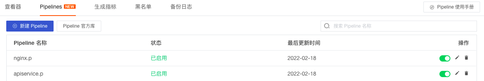

#### Added IFrame Chart Component

<<< custom_key.brand_name >>> added the IFrame chart component, supporting you to configure https or http link addresses. In the IFrame URL, you can directly input external network addresses for viewing or use template variables in the IFrame URL for viewing. For more configuration details, refer to the document **IFrame**.


#### Added Event Detail Historical Records and Associated SLO

Observation optimizes the layout of basic attributes, status & trends, and associated events on the event detail page and adds historical records and associated SLOs, which can be viewed by clicking the event name in the anomaly event list.

Added historical records for events, supporting viewing detection object hosts, abnormal/recovery times, and duration.

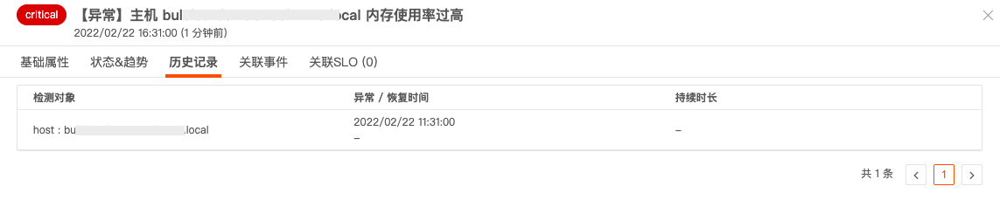

If SLO is configured in the monitor, then you can view associated SLOs, including SLO name, compliance rate, remaining quota, target, etc.


#### Added Default Absolute Time Option for Saving Snapshots

<<< custom_key.brand_name >>> added default absolute time enabling when saving snapshots.

- If absolute time is selected when saving snapshots, the shared snapshot will show the absolute time at which the snapshot was saved. For example, if the snapshot selects the last 15 minutes, opening the snapshot link at 14:00 will display the data of the previous absolute time;
- If absolute time is deselected when saving snapshots, the shared snapshot will show the absolute time at which the snapshot was saved. For example, if the snapshot selects the last 15 minutes, opening the snapshot link at 14:00 will display the data from 13:45 to 14:00.

For more snapshot sharing details, refer to the document **Snapshots**.

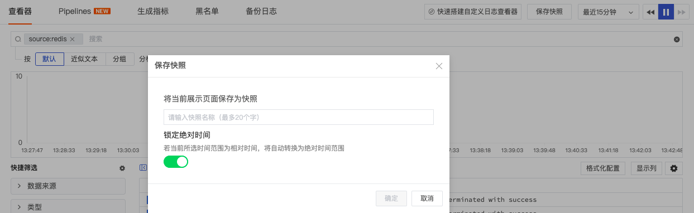

#### Optimized Monitor Data Gap Trigger Event Configuration and Unit Prompt for Trigger Conditions

<<< custom_key.brand_name >>> added three data gap state configurations: "Trigger Data Gap Event", "Trigger Recovery Event", and "Do Not Trigger Event".

- Metric data monitors require manual configuration of data gap handling strategies;
- Log data monitors default to selecting "Trigger Recovery Event" strategy, eliminating the need to configure data gaps, obtaining the cycle for "Normal" conditions as the recovery event cycle for data gaps;


#### Optimized Chart Query Expression Calculation Units

<<< custom_key.brand_name >>> optimized the logic for calculating units in chart queries. If query A carries a unit, the result of query A with a number also carries the unit. For example, if A's unit is KB, then A+100's unit is also KB. For more details, refer to the document **Chart Queries**.

#### Added Pay-As-You-Go Mode for "Time Series"

<<< custom_key.brand_name >>> added a pay-as-you-go mode for "Time Series" and optimized the "DataKit + Time Series" pay-as-you-go mode. Specific billing modes can be referenced in the document **Pay-As-You-Go**.

#### Other Optimization Features

- Chart query data sources for logs, application performance, security inspections, and networks support full selection (`*`);
- Chart query caption, button style, and text prompt optimizations;
- Workspace operation buttons iconified, such as edit, delete, etc.;
- Other UI display optimizations

## January 20, 2022

#### Added Open API and API Key Management

"<<< custom_key.brand_name >>>" supports obtaining and updating <<< custom_key.brand_name >>> workspace data by calling Open API interfaces. Before calling the API interface, you need to create an API Key as the authentication method. For more details, refer to the document **API Key Management**.


#### Added Metric Dictionary and Metric Unit Management

After metric data collection, you can view all collected metric sets, metrics, and tags in the <<< custom_key.brand_name >>> workspace under "Metric Dictionary" and manually set units for custom metric data. For more details, refer to the document **Metric Dictionary**.

- Metrics help you understand the overall availability of the system, such as server CPU usage, website loading time, etc. Combined with <<< custom_key.brand_name >>>'s provided logs and trace tracking, it helps you quickly locate and resolve faults.
- Tags help you associate data. <<< custom_key.brand_name >>> supports reporting all metrics, logs, and trace data uniformly to the workspace, associating queries by tagging collected data, helping you perform correlation analysis to discover and resolve potential risks.

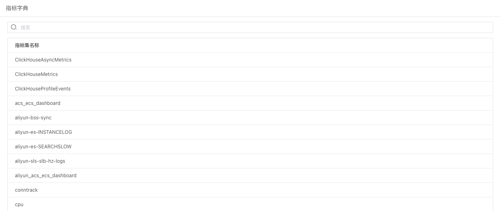

#### Added Funnel Charts to Scenario Charts

Funnel charts generally apply to processes with standardization, long cycles, and many steps. Comparing data across steps allows for intuitive contrasts of issues. Additionally, funnel charts apply to website business flow analysis, displaying the final conversion rate of users from entering the website to completing purchases and the conversion rate for each step. For more details, refer to the document **Funnel Chart**.


#### Added Saving Dashboards to Built-in Views and Binding Label Data

After creating a dashboard view, you can click the "Settings" button and select "Save to Built-in View" to save the dashboard view to the "User Views" section of built-in views.


When saving a dashboard view to built-in views, you can choose binding relationships, selecting the "label" binding relationship. After saving to built-in views, you can view the saved dashboard view under "User Views" in the "Built-in Views" section of <<< custom_key.brand_name >>> workspace management. Meanwhile, because the binding relationship `label:*` is set, in the host/container detail pages under infrastructure where "Label Attributes" are set, you can view the bound built-in views. For more details, refer to the document **Saving Dashboards as Built-in Views**.

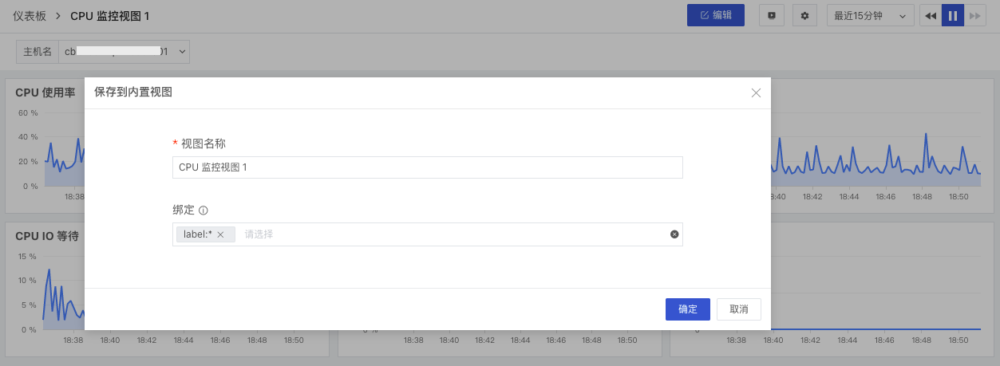

#### Added Container Detail Page Related to Pod

In the container detail page, you can view basic information and performance indicator statuses of related Pods (associated field: pod_name) within the selected time component range. For more container-related queries, refer to the document **Container**.<br /> Note: To view related Pods in container details, the field "pod_name" must match; otherwise, you cannot see the related Pod pages in container details.

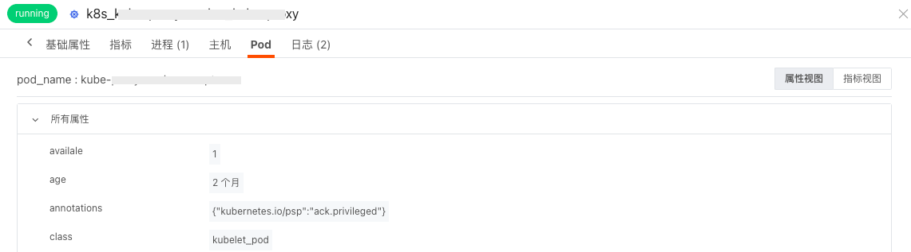

#### Added Monitor Group Management

<<< custom_key.brand_name >>>'s new grouping feature allows you to customize meaningful monitor combinations during setup, supporting filtering monitors via "Groups" for easier group management of various monitors.

Note:
- Each monitor creation must select a group, defaulting to the "Default Group";
- When a group is deleted, monitors under that group automatically revert to the "Default Group".

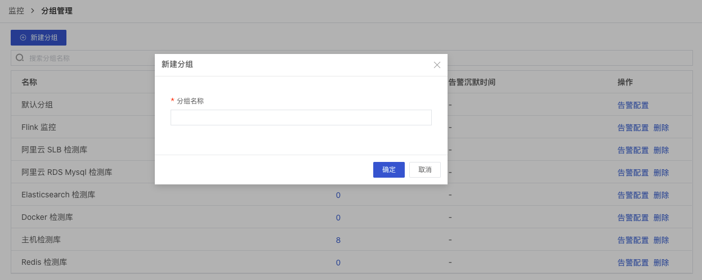

#### Added Log Viewer, Table Chart, Log Stream Chart Formatting Configurations

<<< custom_key.brand_name >>>'s new formatting configurations allow you to hide sensitive log data content or highlight necessary log data content for viewing, and replace original log content for quick filtering. Supports formatting configurations in log viewers, table charts, and log stream charts.


#### Optimized Silence Management, Added Disable/Enable Rules

<<< custom_key.brand_name >>> added silence rule disable/enable functionality to help you quickly disable/enable silence tasks. For more details, refer to the document **Silence Management**.

- Enable: Silence rules follow the normal process
- Disable: Silence rules do not take effect; if silence notifications are set to "xx minutes before start" and the notification has not yet been executed, the notification will not execute

Note: Enabling/disabling rules generates operation audit events, which can be viewed under "Operation Audit" in <<< custom_key.brand_name >>> workspace "Management" - "Basic Settings".


#### Added Log Pipeline User Manual

<<< custom_key.brand_name >>> added a user manual for log pipelines, helping you understand how to use DataKit's built-in debugging tools to assist in writing Pipeline scripts.

```
# Debugging Script Example
datakit --pl datakit.p --txt '2022-01-12T18:40:51.962+0800 WARN diskio diskio/input.go:320 Error gathering disk info: open /run/udev/data/b252:1: no such file or directory'

# Successful Extraction Example
Extracted data(drop: false, cost: 3.108038ms):
{
  "code": "diskio/input.go:320",
  "level": "WARN",
  "message": "2022-01-12T18:40:51.962+0800 WARN diskio diskio/input.go:320 Error gathering disk info: open /run/udev/data/b252:1: no such file or directory",
  "module": "diskio",
  "msg": "Error gathering disk info: open /run/udev/data/b252:1: no such file or directory",
  "time": 1641984051962000000
}
```

#### Added Outer Functions to DQL

<<< custom_key.brand_name >>> added two outer functions `rate()` and `irate()`.

- `rate()`: Calculates the average change rate of a specific metric over a certain time range. Suitable for alarms and slowly moving counters.
- `irate()`: Calculates the instantaneous change rate of a specific metric over a certain time range, suitable for drawing volatile, fast-changing counters.

For more details, refer to the document **DQL Outer Functions**.