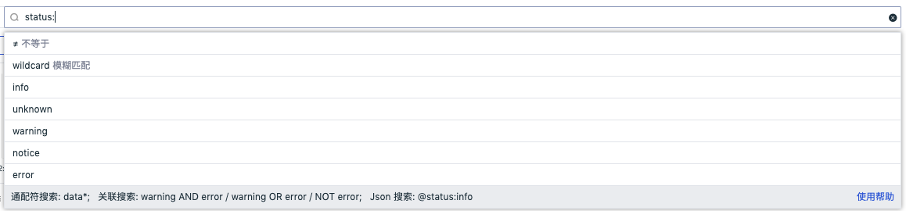
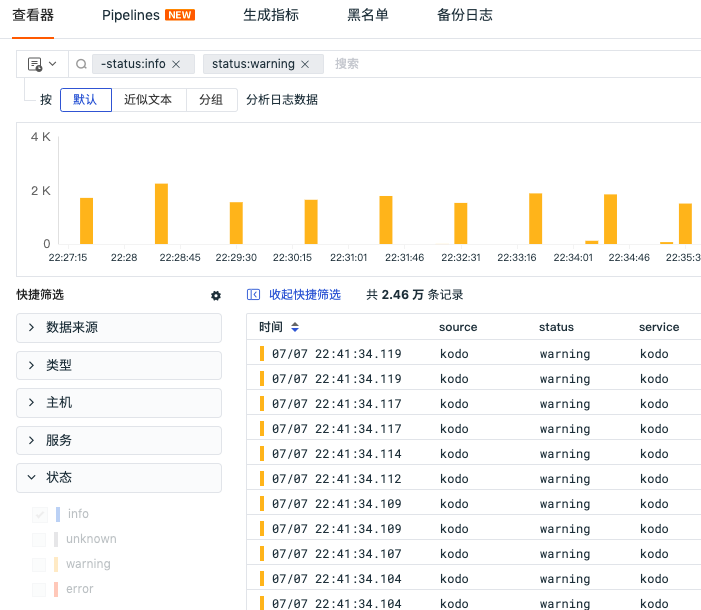
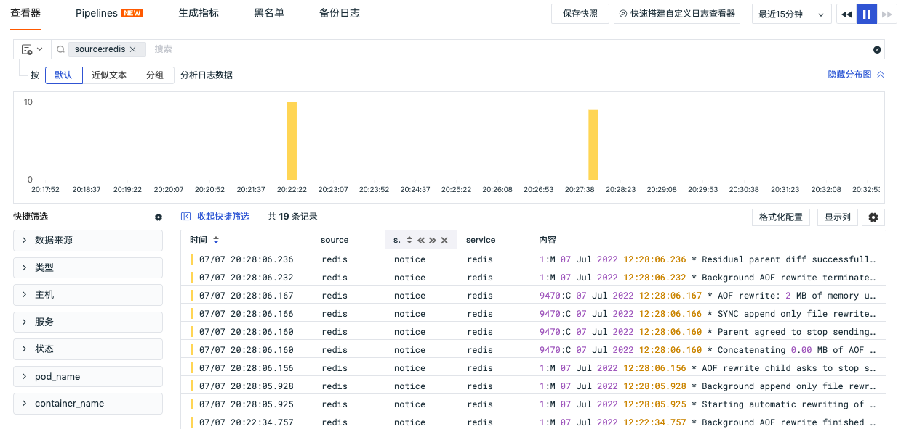
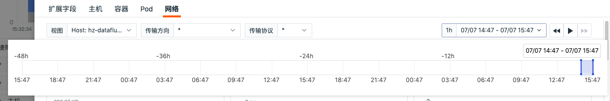
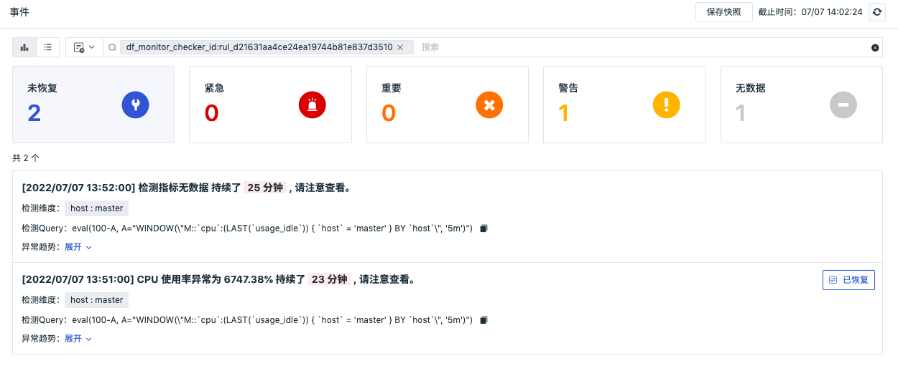

# Change Log (2022)
---

This document records the update content of <<< custom_key.brand_name >>> for each online release, including DataKit, <<< custom_key.brand_name >>> best practices, <<< custom_key.brand_name >>> integration documents, and <<< custom_key.brand_name >>>.

## December 29, 2022

### <<< custom_key.brand_name >>> Updates

#### Added MFA Authentication Management

<<< custom_key.brand_name >>> provides MFA authentication management, which helps add an extra layer of security protection beyond account usernames and passwords. After enabling MFA authentication, you will need to perform a second verification when logging in, helping improve your account security. For more details, refer to the documentation **MFA Management**.

#### Added Workspace IP Access Login Whitelist

<<< custom_key.brand_name >>> supports configuring an IP whitelist for workspaces to restrict visiting users. After enabling the IP whitelist, only sources from the whitelist IPs can log in normally, and all other source requests will be denied access. For more details, refer to the documentation **IP Whitelist**.

Note: The IP whitelist is only configurable by administrators and owners, and the "owner" is not restricted by the IP whitelist access restrictions.


#### Added Service Network Topology

In K8S environments, you can use the Service network topology diagram to view the request relationships, response times, error rates, etc., between different Services in the K8S environment. When a Service has connection issues, you can click to view the corresponding logs of that Service to locate its problems. For more details, refer to the documentation **Service Network**.


#### Other Feature Optimizations

- Pipeline usage optimization
- Log clustering analysis supports custom fields
- Super large log slicing supports viewing associated logs
- Backup log display optimization
- Sensitive fields in data authorization support all types of data except metrics

### DataKit Updates

- Prometheus collector supports collecting data via Unix Socket
- Allows non-root user execution of DataKit

- Optimized eBPF httpflow protocol determination
- Optimized Windows Datakit installation upgrade commands
- Optimized Pythond packaging
- Pipeline provides more detailed operation error messages
- Pipeline reftable offers a localized storage implementation based on SQLite

For more DataKit updates, refer to **DataKit Version History**.

### Intelligent Inspection Updates

#### Official Intelligent Inspection Dismantling

The official intelligent inspections for "memory leaks," "application performance detection," and "disk usage rate" are now discontinued. Users can configure self-built inspection scripts instead. 

#### Added Cloud Account Instance Dimension Bill Inspection

Cloud account instance dimension bill inspection helps users manage abnormal cost warnings at the cloud service instance level, predict cost situations, and provide users with high-growth and high-consumption instance prompts and bill visualization capabilities, supporting multi-dimensional visualizations of cloud service resource consumption.

#### Added Aliyun Preemptible Instance Survival Inspection

Due to the fluctuating market price of preemptible instances, you must specify a bidding model when creating a preemptible instance. A preemptible instance can only be successfully created if the real-time market price of the specified instance specification is lower than the bid and there is sufficient inventory. Therefore, preemptible instance inspections become particularly important. Through inspections, when it's detected that a preemptible instance is about to be released, it will prompt the latest prices of all available zones for the current specification of preemptible instances as well as the historical prices of this preemptible instance and provide appropriate handling suggestions.

For more intelligent inspection updates, refer to **Intelligent Inspection Update Logs**.

## December 15, 2022

### <<< custom_key.brand_name >>> Updates

#### Added Profile and Network Billing

<<< custom_key.brand_name >>> added billing items for Profile and Network. Profile counts the number of application performance Profiles reported daily within the workspace, and Network counts the number of hosts (host) reporting network data daily within the workspace. For more details, refer to the documentation **Billing Method**.

#### Simplified <<< custom_key.brand_name >>> Registration Process

<<< custom_key.brand_name >>> simplified the registration process, helping you quickly complete registration and start using <<< custom_key.brand_name >>>. For more details, refer to the documentation **Registering <<< custom_key.brand_name >>> Commercial Plan**.

#### Added Warroom Functionality

<<< custom_key.brand_name >>> provides a "Warroom" dashboard where you can comprehensively review key metric trends across all workspaces, helping you quickly understand critical data conditions in each workspace and promptly identify and resolve abnormal issues. For more details, refer to the documentation **Key Metric Management**.


#### Added Dashboard Carousel Functionality

<<< custom_key.brand_name >>> provides carousel functionality for multiple related business dashboards. After setting up, you can display them on a large screen. For more details, refer to the documentation **Carousel Dashboard**.


#### Binding External SLS Indexes in Workspaces

<<< custom_key.brand_name >>> newly supports binding SLS indexes, helping you quickly view and analyze your log data uniformly. Additionally, <<< custom_key.brand_name >>> adds support for field mapping functions, helping you map SLS index fields for clustering analysis. For more details, refer to the documentation **Log Index**.


#### Link Viewer Chart Display Optimization

In the link viewer, new trend charts for "Span Quantity" and "Error Span Quantity" have been added. You can quickly view trends for Span quantity, Error Span quantity, request count, Error request count, and response time metrics through the viewer chart.


#### Other Functional Optimizations

- View variable interaction optimization
- Binding built-in view configuration interaction optimization
- Workspace arrears lock process optimization
- Workspace invitation user experience optimization
- Help documentation added an evaluation system, including better and worse reviews
- Monitor bulk function optimization
- SLO added enable/disable functionality
- Fuzzy matching Wildcard left * query restriction optimization

### DataKit Updates

- Added **Golang Profiling** access
- logfwd supports injecting image fields via `LOGFWD_TARGET_CONTAINER_IMAGE`
- trace collector:
    - Optimized error-stack/error-message format issues
    - Adjusted SkyWalking compatibility to support the full 8.X series
- eBPF httpflow added `pid/process_name` fields, optimizing kernel version support
- Adjustments to datakit.yaml are recommended
- GPU card collection supports remote mode

For more DataKit updates, refer to **DataKit Version History**.

### Intelligent Inspection Updates

#### Added Intelligent Inspection Guide Page

<<< custom_key.brand_name >>> default supports three intelligent inspection templates: memory leak, disk usage rate, and application performance detection. After this update, existing workspaces support manually deleting the default intelligent inspection templates, while simultaneously prompting the system-wide offline time; newly created workspaces no longer default-provide these three intelligent inspections and add a beginner guide prompt.


#### Intelligent Inspection Components Support Configurable Custom Jump Links

When configuring self-built inspections, support for configurable custom jump links is provided. For how to configure self-built inspections, refer to the documentation **Self-Built Inspections**.

For more intelligent inspection updates, refer to **Intelligent Inspection Update Logs**.

### Best Practices Updates

- Insights
    - Scene (Scene) - **SpringBoot Project with External Tomcat Scene Chain Observability**.

For more best practice updates, refer to **Best Practice Version History**.


## December 1, 2022

### <<< custom_key.brand_name >>> Updates

#### Added Service List Functionality in Application Performance Monitoring

Application Performance Monitoring service list supports real-time viewing of ownership, dependencies, performance, associated dashboards, and associated analysis for different services, helping teams efficiently build and manage large-scale end-to-end distributed applications. For more details, refer to the documentation **Service List**.


#### Dashboard Chart Usage Experience Optimization

- Added manual input for chart units, colors, and aliases. You can customize preset units, colors, and aliases according to the current specifications, such as unit input format being: aggregate function(metric), like `last(usage_idle)`
- Added Y-axis configuration to the time series chart, allowing manual configuration of the maximum and minimum values of the Y-axis
- Added group display to the time series chart and pie chart. When enabled, only label values are shown in the legend
- Added gradient intervals to honeycomb charts, China maps, and world maps, including automatic and custom options
- Bar chart and histogram display optimization

For more details, refer to the documentation **Visualization Charts**.


#### View Variable Usage Experience Optimization

- Added support for multi-select in view variables
- Added whether to set multiple default values during view variable configuration

For more details, refer to the documentation **View Variables**.


#### User Access Monitoring Session Viewer Adjustment

In the user access monitoring Session viewer, new "Session" and "All Records" viewing lists have been added:

- Session: Counts de-duplicated Session (session) data within the current time range, displaying the latest Session (session) data by default;
- All Records: Displays all Session (session) reported data, where the same Session (session) may correspond to multiple data entries.

Note: In the Session session list, if the displayed column added by the user does not exist in the current Session data, there will be empty data in the session list. For more details, refer to the documentation **Session (session)**.


#### Events Added Mobile Jump Options

After receiving event notifications, clicking "Go to <<< custom_key.brand_name >>> View" takes you to the <<< custom_key.brand_name >>> mobile app to view detailed information about abnormal events.

#### Other Functional Optimizations

- Newcomer guide page optimization, supports minimization
- User access monitoring application list optimization, added custom interval switching queries for time controls
- Host Label interaction optimization

### DataKit Updates

- Added Python Profiling access
- Pythond added custom event reporting functionality
- netstat supports specific port metric collection

- Optimized Redis collector CPU usage rate collection, added new metric fields
- Optimized logfwd collector configuration
- Fully collected host object fields, adding network, disk, and related fields

For more DataKit updates, refer to **DataKit Version History**.

### Intelligent Inspection Updates

- Kubernetes Pod abnormal restart inspection
- MySQL performance inspection
- Server-side application error inspection
- Memory leak inspection
- Disk usage rate inspection
- Application performance inspection
- Frontend application log error inspection

For more intelligent inspection updates, refer to **Intelligent Inspection Update Logs**.

### Best Practice Updates

- Monitoring Monitoring
    - Application Performance Monitoring (APM) - Performance Optimization - **Utilizing async-profiler for Application Performance Tuning**

For more best practice updates, refer to **Best Practice Version History**.


## November 17, 2022

### <<< custom_key.brand_name >>> Updates

#### Pipeline Usage Experience Optimization 

- Pipeline supports filtering condition configuration with multi-select

- Supports setting any one Pipeline script as the "default Pipeline script". If the current data type does not match other Pipeline scripts when matched against Pipeline processing rules, the data will be processed according to the default Pipeline script’s rules.

- Script function classification


#### Event Optimization

- Supports writing user-defined events. For more details, refer to the documentation **Writing Event Data via OpenAPI**.

- Added quick filters on the left side of the unresolved events viewer


#### Custom Viewer Supports Selecting More Types of Data

When creating a new viewer in scenarios, supports selecting five types of data: logs, application performance, user access, security checks, and Profile. Once saved, changes cannot be modified.


#### Member Management Added Member Grouping Functionality

Added member grouping functionality in member management. You can edit member groups, allowing members to belong to multiple groups. Simultaneously, when configuring alert notification objects, member group tags can be configured.


#### Optimized Built-in View Binding Functionality

In the scenario "Built-in Views" - "User Views", the bound fields support fuzzy matching. After binding fields, you can associate and view the corresponding built-in views in the viewer. For more details, refer to the documentation **Binding Built-in Views**.


#### Added One-Click Import/Export of Dashboards, Custom Viewers, Monitors Within Workspaces

In "Management" - "Basic Settings", added one-click import/export of JSON configurations for dashboards, custom viewers, monitors, etc., within workspaces. You can import dashboards, custom viewers, monitors, etc., from other workspaces into the current workspace.


#### Application Performance Monitoring Log Page Added Custom Associated Fields

On the details page of Application Performance Monitoring, in the associated logs section, if you have administrator or higher permissions, you can define associated fields. Click the settings button to the right of the associated fields, select the fields you want to associate in the pop-up dialog box, support manual input, drag-and-drop order adjustment, and confirm to complete the configuration.


#### Other Functional Optimizations

- When using fuzzy match and fuzzy mismatch in filter conditions, left * matching is supported
- Infrastructure analysis dimensions optimized, showing the last report time of the host in the host details page
- Supports users quickly logging back into their last single sign-on
- Blacklist application performance monitoring added support for filtering "all services"
- Upgraded the process for users registered on the "China Region 4 (Guangzhou)" site to the commercial plan
- Field descriptions support viewing in quick filters, display columns, etc.

### DataKit Updates

- Added **SNMP Collector**
- Added **IPMI Collector**
- Added batch injection tool for DDTrace-Java
- Enhanced SQL desensitization functionality in the latest DDTrace-Java SDK
- Remote Pipeline Optimization
    - Pipeline supports source mapping relationship configuration, facilitating batch configuration between Pipeline and data sources
    - Pipeline provides function classification information, facilitating remote Pipeline writing
- Optimized **Kafka Message Subscription**, no longer limited to obtaining SkyWalking-related data, also supporting throttling, multi-version coverage, sampling, load balancing, etc.
- Alleviated short lifecycle Pod log collection issues by providing additional configuration parameters (`ENV_INPUT_CONTAINER_LOGGING_SEARCH_INTERVAL`)
- Pure container environments support **label-based** configuration for internal container log collection
- Added Pipeline Functions
    - **sample()**: Sampling function
    - **b64enc()**: Base64 encoding function
    - **b64dec()**: Base64 decoding function
    - **append()**: List appending function

For more DataKit updates, refer to **DataKit Version History**.

### Best Practice Updates

- Insights
    - <<< custom_key.brand_name >>> Tips (Skills) - Configuring HTTPS for DataKit

- Monitoring Monitoring
    - Application Performance Monitoring (APM) - Common ddtrace Parameter Usage
    - Application Performance Monitoring (APM) - ddtrace-api Usage Guide
    - Application Performance Monitoring (APM) - ddtrace Sampling
    - Application Performance Monitoring (APM) - ddtrace Log Association

For more best practice updates, refer to **Best Practice Version History**.


## November 11, 2022

#### <<< custom_key.brand_name >>> Added "China Region 4 (Guangzhou)" Site

<<< custom_key.brand_name >>> supports multi-site registration and login, adding a "China Region 4 (Guangzhou)" site, covering domestic and international regions comprehensively to provide users with comprehensive data observability.

It should be noted that accounts and data between different <<< custom_key.brand_name >>> sites are independent and cannot share or migrate data mutually. You can choose the appropriate site for registration and login based on your resource usage situation. Currently, <<< custom_key.brand_name >>> supports the following four sites.

| **Site**          | **Login Address URL**             | **Operator** | Settlement Method                     |
| ----------------- | ---------------------------- | ---------- | ---------------------------- |
| China Region 1 (Hangzhou)   | https://auth.<<< custom_key.brand_main_domain >>>/     | Alibaba Cloud     | <<< custom_key.brand_name >>> Corporate Account, Cloud Account       |
| China Region 2 (Ningxia)   | https://aws-auth.<<< custom_key.brand_main_domain >>>/ | AWS        | <<< custom_key.brand_name >>> Corporate Account, Cloud Account       |
| Overseas Region 1 (Oregon) | https://us1-auth.<<< custom_key.brand_main_domain >>>/ | AWS        | <<< custom_key.brand_name >>> Corporate Account, Cloud Account       |
| China Region 4 (Guangzhou)   | https://cn4-auth.<<< custom_key.brand_main_domain >>>/ | Huawei Cloud     | <<< custom_key.brand_name >>> Corporate Account, Huawei Cloud Stored Value Card |

## November 3, 2022

### <<< custom_key.brand_name >>> Updates

#### Added <<< custom_key.brand_name >>>, SLS Joint Solution

<<< custom_key.brand_name >>> added the SLS storage solution, supporting Alibaba Cloud SLS users to quickly use <<< custom_key.brand_name >>> for data viewing and analysis. When registering/upgrading to the commercial plan in <<< custom_key.brand_name >>>, after choosing "Alibaba Cloud Account Settlement," you can select the SLS storage solution to store data under your own Alibaba Cloud account, achieving exclusive data storage. For more details, refer to the documentation **SLS Storage**.

The joint solution between <<< custom_key.brand_name >>> and SLS supports you to synchronize data from your Alibaba Cloud account to <<< custom_key.brand_name >>> workspaces through the feature of binding log indexes, allowing you to query and analyze log data in <<< custom_key.brand_name >>> workspaces under "Logs" - "Index." To synchronize index log data, click "Bind Index" to sync the log data in the index. For more details, refer to the documentation **Log Index**.


#### Optimized Beginner Guide Pages

<<< custom_key.brand_name >>> added beginner guides for scenarios, events, infrastructure, metrics, logs, application performance monitoring, user access monitoring, availability monitoring, security checks, CI visualization, and various functional modules of monitoring, while also optimizing the welcome homepage of the workspace to make it easier for users to understand and use <<< custom_key.brand_name >>> through the beginner guides.

#### Added Three Intelligent Inspection Configuration Documents

- **Cloud Account Bill Inspection**: Helps users manage budget alerts for cloud services, abnormal cost alerts, predicted cost situations, and provides users with visualization capabilities, supporting multi-dimensional visualization of cloud service resource consumption;
- **Frontend Application Log Error Inspection**: Helps discover new error messages (clustered Error Messages) that appeared in frontend applications over the past hour, assisting developers and operations personnel in timely fixing code to avoid continuous harm to customer experience over time;
- **Aliyun Asset Inspection**: Helps users gain more insight into product performance status of cloud vendors.

#### Added Trace Error Tracking Viewer

In application performance monitoring, a new error tracking viewer was added to help you quickly view similar errors and their distribution in traces, allowing rapid localization of performance issues. For more details, refer to the documentation **Trace Tracking**.


#### Optimized Time Series Graph and Overview Graph Same Period Comparison Function

Same period comparison functionality is no longer linked to locked time. By default, the button is visible and turned off. After enabling same period comparison, comparison dimensions support four options: hours (compared to one hour ago), days (compared to one day ago), weeks (compared to one week ago), months (compared to one month ago). For more details, refer to the documentation **Same Period Comparison**.

#### Other Functional Optimizations

- Added a "Save Snapshot" button in the "Settings" section for dashboards/notebooks/viewers;
- Added more options to the time control;

- Pipelines and blacklist functions added import, bulk export, bulk delete features;
- Intelligent inspections added dashboard and bar chart components;
- Integrated menu Func page optimizations.

### DataKit Updates

- Improved Prometheus ecosystem compatibility, added **ServiceMonitor and PodMonitor collection recognition**
- Added **Java Profiling access based on async-profiler**

- eBPF collection added **interval parameter**, facilitating adjustment of the amount of collected data
- All remote collectors default to using the collection address as the value of the `host` field to avoid possible misinterpretations of the `host` field during remote collection
- APM data collected by DDTrace can automatically extract error-related fields, aiding better APM error tracking at the center
- MySQL collector added additional fields `Com_commit/Com_rollback` collection

For more DataKit updates, refer to **DataKit Version History**.

### Best Practice Updates

- Monitoring Monitoring
    - Application Performance Monitoring (APM) - Kafka Observability Best Practices

- Cloud Platform Integration
    - Alibaba Cloud - Alibaba Cloud ACK Integration with <<< custom_key.brand_name >>>

For more best practice updates, refer to **Best Practice Version History**.

## October 20, 2022

### <<< custom_key.brand_name >>> Updates

#### Monitoring Optimization

##### Added Outlier Detection

Outlier detection detects whether the metrics/statistics of the detection object deviate significantly from normal ranges within a specific group using algorithms. If there are deviations exceeding a certain degree, outlier detection anomalies are generated for subsequent alarm tracking. For more details, refer to the documentation **Outlier Detection**.


##### Mutation Detection Logic Optimization

The new mutation detection compares absolute or relative (%) changes of the same metric between two different time periods to determine whether abnormal situations occur. It is mainly used to track peaks or data changes of a specific metric, generating more precise events when abnormalities occur. For more details, refer to the documentation **Mutation Detection**.


##### Interval Detection Logic Optimization

The new interval detection performs anomaly detection on metric data within the selected detection interval time range. When the percentage of abnormal data points exceeds the set percentage, an interval detection anomaly event is generated. This is mainly used to monitor stable-trend data/metrics. For more details, refer to the documentation **Interval Detection**.


##### Other Optimizations

- Adjusted read-only member permissions to allow viewing of monitors, intelligent inspections, SLOs, mute management, and alarm strategy configurations
- Changed data gap configuration selection for "Trigger Data Gap Events" and "Trigger Recovery Events" to time range configuration, supporting manual input


- Supported configuring monitors based on "Event" data


- Alarm configuration added "Information" event notification level selection


#### Scenario Chart Optimization

##### Added Histogram Chart Component

Histograms, also known as quality distribution charts, are used to represent data distribution. They are a common statistical chart, typically showing data intervals on the horizontal axis and distribution on the vertical axis. For more details, refer to the documentation **Histogram**.


##### Chart Function Optimization

- Added time slicing functionality to overview charts, rectangular tree charts, and funnel charts
- Changed "View Similar Trend Metrics" in time series charts from supporting only metric queries to supporting all data types, including logs, application performance, and user access
- Leaderboard supports viewing all content exceeding the chart width
- Honeycomb chart display optimization

#### Viewer Optimization

##### Added Analysis Mode to Viewer

In log, application performance monitoring, user access monitoring, availability testing, security checks, and CI viewers, a new "Analysis" function was added. Infrastructure adjusted "Grouping" to "Analysis," supporting multidimensional analysis statistics based on **1-3 labels** to reflect data distribution characteristics and trends at different times and dimensions. In analysis mode, multiple data chart analyses are supported, including time series charts, leaderboards, pie charts, and rectangular tree charts. For more details, refer to the documentation **Viewer Analysis Mode**.


##### Optimized Associated Log Viewing Experience

In the detail pages of infrastructure, application performance monitoring, user access monitoring, and CI visualization viewers, the associated log viewing experience was optimized. Logs are displayed by default according to the "maximum number of rows to display" and "display columns" settings in the log viewer, with support for custom adjustments through "display columns."


#### Log Index Optimization

After setting an index under "Logs" - "Index," log-related queries added an index option, defaulting to index `default`. You can query and analyze log data based on the index you set. This includes log viewers, custom scenario viewers, chart log queries, log monitors, etc. For more details, refer to the documentation **Log Index**.


#### Optimized Metric Analysis Chart Queries

In metric analysis, added time intervals and legend options, adjusting the order of aggregation functions in the legend. For more details, refer to **Metric Analysis**.


#### Other Functional Optimizations

- Added dropdown menus in the application list of user access monitoring, helping users quickly switch and view different application data
- Added Pipelines quick access in directories for metrics, user access monitoring, application performance monitoring, infrastructure, and security checks

### DataKit Updates

- DataKit collector configuration and Pipeline support synchronization via **etcd/Consul** configuration centers
- Prometheus Remote Write Optimization
    - Collection supports filtering tags via regular expressions
    - Supports filtering metric set names via regular expressions
- Pipeline Optimization
    - Optimized **grok()** and **json()** functions so they execute trim-space operations by default
    - Added **match()** function
    - Added **cidr()** function
- Process collector added detailed fields for open file lists
- Enhanced external data接入(T/R/L) disk caching and queue processing
- Monitor added usage over-limit tips: At the bottom of the monitor, if the current space usage exceeds limits, there will be a red text `Beyond Usage` tip
- Optimized log collection position functionality, mounting the file externally on the host in container environments to avoid losing original position records after DataKit restarts
- Optimized sparse log scene collection delay issues

For more DataKit updates, refer to **DataKit Version History**.

### Best Practice Updates

- Monitoring Monitoring
    - Infrastructure Monitoring (ITIM) - **Ansible Batch Processing Practice**.

- Cloud Native
    - Logs - **<<< custom_key.brand_name >>> Collecting Amazon ECS Logs**.

For more best practice updates, refer to **Best Practice Version History**.

## September 29, 2022

### <<< custom_key.brand_name >>> Updates

#### Added Field Management

<<< custom_key.brand_name >>> supports unified management of field data in the current workspace, including two types: system fields and custom fields. You can view field descriptions in scenario chart queries, monitor detector indicators, and simple query modes in DQL queries, helping you quickly understand field meanings and apply them. The figure below shows viewing the `host` field description in scenario chart queries. For more details, refer to the documentation **Field Management**.


#### Optimized Metric Functionality

##### Metric Viewer Transformation

The original "Metric Viewer" was renamed to "Metric Analysis," supporting users to visualize queried data in time series charts (line charts, area charts, bar charts). For more details, see **Metric Analysis**.


##### Optimized Metric Management

- Supported searching for "metric sets" and "metrics" in "Metric Management";

- Supported modifying the "unit" and "description" of metrics in "Metric Management";
- Supported viewing tag description information in "Metric Management".

For more details, see **Metric Management**.


#### Added Exporting Event Content in PDF Format

In the event details page, the **Jump to Monitor** button added text explanations. Clicking :material-export-variant: allows you to choose **Export JSON File** and **Export PDF File** to obtain all key data related to the current event.


#### Monitor Adjustments

- Monitor names do not support customization; the event title input generates the monitor name synchronously;
- Monitors support "info" event generation logic. Trigger conditions can choose to enable or disable information: normal detection results also generate events;
- Monitor configuration steps were reordered as: Detection Configuration - Event Notification - Association.

**Note:** In the latest version, the "monitor name" will be generated synchronously after entering the "event title." In older monitors, there might be inconsistencies between "monitor name" and "event title." For a better user experience, please synchronize to the latest version, supporting one-click replacement of event titles.


#### Mute Rule Dynamic Configuration

In mute management, the mute scope was optimized, supporting multiple options such as monitors, intelligent inspections, self-built inspections, SLOs, and alert strategies, with added tag options.

**Note:** The mute scope is mandatory, while tags are optional. Only when both "mute scope" and "tags" conditions are met simultaneously will the mute take effect. For example, if the mute scope selects `Application Performance Monitoring` and `Disk Usage Rate`, and the tag selects: `host:izbp152ke14timzud0du15z`, then the alert notification will be muted and will not be sent to the notification target when the conditions meet either `Application Performance Monitoring` and `host:izbp152ke14timzud0du15z` or `Disk Usage Rate` and `host:izbp152ke14timzud0du15z`.


#### Optimized Pipeline Configuration Page

In text processing (Pipeline), added support for multiple sample parsing tests, fixing the issue of incorrect one-click acquisition of sample errors for metric data. For more details, refer to **Text Processing (Pipeline)**.


#### Other Functional Optimizations

- Notes added global lock time configuration; after setting the global lock time, all charts on the note page display data according to the locked time
- Unresolved event queries changed to the most recent 48-hour data, supporting manual refresh
- User access monitoring supports user view coverage logic
- User access monitoring Web, WeChat Mini Programs, and uniapp-based mini program initial parameters added `isIntakeUrl` configuration, used to determine whether to collect corresponding resource data based on the requested resource URL, defaulting to collect all
- Intelligent inspections added support for self-built inspections
- Generate metric page operation column adjusted, added "Open in Metric Analysis" and "Open in Metric Management" action icons
- Navigation menu position adjustments, SSO management moved to member management, notification target management moved to monitoring, built-in views moved to scenarios

### Best Practice Updates

- Cloud Native: **Best Practices for Multiple Kubernetes Cluster Metrics Collection**.

More best practice updates can be referenced in **Best Practice Version History**.

## September 15, 2022

### <<< custom_key.brand_name >>> Updates

#### Added Intelligent Inspection Functionality

Intelligent inspections are based on <<< custom_key.brand_name >>>'s intelligent detection algorithms, supporting automatic detection of infrastructure and application issues, helping users discover problems occurring during IT system operations. Through root cause analysis, it quickly locates abnormal problem causes; through <<< custom_key.brand_name >>>'s intelligent prediction algorithms, it helps users foresee potential problems in infrastructure and applications, assessing the impact levels of problems on system operations, better determining the priority of troubleshooting work, and reducing uncertainties in the troubleshooting process.

Currently, intelligent inspections support three inspection templates:

- **Memory Leak**: Detects memory leak issues on the current workspace hosts
- **Disk Usage Rate**: Detects whether the disk usage rate of the current workspace hosts is too high
- **Application Performance Monitoring**: Detects fluctuations in QPS, average response time, P90 response time, and error rate of the current workspace services


#### Optimized Viewer Search and Filtering Functionality

1. Added "not wildcard reverse fuzzy matching" in the viewer search, i.e., does not match fuzzy query results.


2. Added workspace-level and personal-level filtering methods for quick filters in the viewer

- Workspace-level filter items: Configured by administrators/owners, click the "Settings" button next to the quick filter to configure workspace-level filter items
- Personal-level filter items: All members can configure local browser-based quick filter items, click the "Edit" button on the right side of the quick filter to configure personal-level filter items

For more details, refer to the documentation **Viewer Search and Filtering**.


#### Added Modification of URL Time Range for Data Queries

<<< custom_key.brand_name >>> supports directly modifying the `time` parameter in the URL of the current workspace viewer/dashboard to perform data queries, supporting seconds, minutes, hours, and days as units, such as time=30s, time=20m, time=6h, time=2d, etc. As shown in the figure below, modifying `time=2h` in the browser displays data from the last 2 hours. For more details, refer to the documentation **URL Time Range**.


#### Added Dashboard View Variable Log, Application Performance, User Access, Security Check Data Source Configuration

Dashboard view variables added "Log," "Application Performance," "User Access," and "Security Check" data source configurations, while optimizing the interaction for adding and editing view variables in new and edited dashboards.

- In a dashboard without added view variables, an "Add View Variable" button appears in the top navigation bar, allowing you to add view variables by clicking it.
- If the dashboard already has view variables added, the view variable names will directly appear below the top navigation bar. Click the "Edit" button on the right to enter the view variable editing page.

For more details, see the documentation **View Variables**.


#### Optimized Chart Query Interaction

- Clicking the "Separator Bar" between the chart and query allows for up and down dragging
- Clicking the "Drag" button to the left of the query statement and dragging up and down adjusts the query sequence
- Scrollbars only affect the query statement area, not impacting the chart


#### Added Template Variables for User Access Indicator Detection Event Notifications

In the "User Access Indicator Detection (RUM)" monitor, when configuring notification events, additional template variables are supported apart from the general ones. For more details, refer to the documentation **Event Title, Content Templates**.

| Template Variable   | Type   | Description     |
| ---------- | ------ | -------- |
| `app_id`   | String | Application ID  |
| `app_name` | String | Application Name |
| `app_type` | String | Application Type |


#### Optimized One-Click Event Content Opening Links

When configuring monitors, adding links in the event content allows you to click the link on the event details page's "Event Content" to open a new page when an event is triggered.

### DataKit Updates

- The default timeout length for prom collectors is 3 seconds
- Log-related issues fixed:
    - Added `log_read_offset` field for log collection
    - Fixed bug where rotated log files were not correctly readAll
- Container collection-related issues fixed:
    - Fixed incompatibility with environment variable `NODE_NAME`
    - Kubernetes auto-discovery prom collectors changed to serial-style, node dispersed collection
    - Added yaml information to pod objects
    - Fixed bug where source replacement in container logs still used previous multiline and pipeline
    - Corrected container log active duration to 12 hours
    - Optimized docker container log image field
    - Optimized k8s pod object host field
    - Fixed missing host tag addition for container metrics and object collections
- eBPF Related:
    - Fixed naming conflict in uprobe event names
    - Added more environment variable configurations for ease of deployment in cloud k8s environments
- Optimized APM data reception interface data processing, alleviating client freeze and memory usage issues
- SQLServer Collector Fixes:
    - Restored TLS1.0 support
    - Supported filtering through instance to reduce timeline consumption
- Pipeline function `adjust_timezone()` has been adjusted
- IO module optimization, improving overall data processing capability while keeping memory usage relatively controlled
- Monitor Updates:
    - Fixed long-term freezing of Monitor during busy times
    - Optimized Monitor display, added IO module information display for easier adjustment of IO module parameters
- Fixed Redis crash issues
- Removed some complex redundant logs
- Fixed issue of not appending host tags for election-type collectors in non-election modes

For more DataKit updates, refer to **DataKit Version History**.

### Best Practice Updates

- Cloud Platform Integration
    - Rancher Deployment DataKit Best Practices
    - Tencent Cloud Product Observability Best Practices (Function)

For more best practice updates, refer to **Best Practice Version History**.

## July 7, 2022

### <<< custom_key.brand_name >>> Updates

#### Optimized Viewer Positive Selection, Negative Selection, and Fuzzy Matching Three Screening Modes
 <<< custom_key.brand_name >>> viewers support precise screening, fuzzy screening (wildcard), and negative selection using the "field:value" method, supporting editing and modification of the "field:value" screening. For more details, refer to the documentation **Viewer Search and Filtering**.



#### Optimized Viewer Quick Filters

In <<< custom_key.brand_name >>> viewer quick filters, default to full selection, supporting "positive selection," "negative selection," "reset," "All," and "only" multiple selections. If the search box includes both positive and negative selections simultaneously, the corresponding quick filter tags will be grayed out and unselectable. For more details, refer to the documentation **Quick Filter**.



#### Added Multiple Quick Operations forViewer Display Columns

In <<< custom_key.brand_name >>> viewers, through "display columns," you can add or delete display columns to the viewer list.

- When hovering over an added display column, you can perform operations such as ascending/descending order, moving the column left/right, and removing the column.
- If the content of the display column is not fully displayed, you can "double-click the divider" on the right side of the display column to expand the content of that column.



#### Optimized Attribute/Field Quick Filters in Viewer Details Pages

In the viewer details page, when clicking attribute fields like "host" or "source," you can quickly filter by "positive selection," "negative selection," "add to display columns," and "copy."

- "Copy": Copies the field to the clipboard
- "Positive Selection": Adds the field to the viewer to view all data related to that field
- "Negative Selection": Adds the field to the viewer to view all data except for that field
- "Add to Display Columns": Adds the field to the viewer list for viewing


#### Optimized Historical Snapshot Functionality, Supporting Three Time Saving Strategies

In viewers for metrics, logs, events, application performance monitoring, user access monitoring, cloud dial tests, and security checks, you can click "Save Snapshot" to save the currently displayed data content in the viewer, supporting enabling/disabling "time filtering."

- Snapshots with time filtering enabled save based on the currently selected time on the page; shared links do not support switching the time control widget.
- Snapshots with time filtering enabled and absolute time locking convert the currently selected time range into "absolute time" for saving.
- Snapshots with time filtering disabled follow the system default time; shared snapshots can switch the time control widget.


After saving a snapshot, you can view it in the historical snapshot list of the viewer. Select and open a historical snapshot, and click the "Return to Viewer" button in the top-right corner to return to the default viewer.


#### Added One-Click Sample Data Acquisition for Pipeline

When creating or editing a Pipeline, a "One-Click Acquisition" button was added on the right side of the sample parsing test to facilitate obtaining data for cutting and debugging.

- Log data: Returns message data
- Other data types: Returns line protocol format data

For more details, refer to the documentation **Text Processing Pipeline**.


#### Added Approximate Text Analysis Mode for Custom Scenario Viewers

In custom scenario viewers, when editing the viewer, you can choose the "Approximate Text Analysis" viewer field in the custom configuration display column, which uses the `message` field content for approximate text analysis by default. For more details, refer to **Custom Scenario Viewer**.


#### Added Associated Network Pod and Deployment Views in Log Viewer Details Page

<<< custom_key.brand_name >>> supports viewing data connection situations for host, Pod, and Deployment views under the "Network" section in the log viewer details page.

Note: To view related networks in logs, matching corresponding fields is required.


#### Added 48-Hour Data Replay Functionality for Associated Networks in Viewer Details Pages

In log, process, trace, host, and Pod viewer details pages associated with the network, you can select to replay 48 hours of network data by clicking the time control widget.

- Time Range: By default, it displays data from 30 minutes before and after; if it's currently occurring, it displays the last hour's data by default.
- Supports arbitrary dragging of the time range to view corresponding network traffic.
- After dragging, click the "Play" button or refresh the page to return to viewing the "last hour" of network data.



#### Adjusted Unresolved Event Retention Strategy, Supporting Manual Event Recovery

In the unresolved event list, when hovering over an event, you can see the "Recovered" function on the right side of the event. Clicking "Recovered" recovers the event and generates a recovery event, where you can view the corresponding operator in that event.



#### Other Functional Optimizations

- Chart lock time added [Latest 5 Minutes] time range, with new second-level time intervals: [5s][10s][30s].
- Scene viewer display columns and view variable base object field properties/tags support custom input.
- Adjusted position of event details associated with dashboards.
- Added timeline count statistics in metric management.
- Optimized log detail linkages to traces, displaying flame graphs and selecting all data corresponding to the span based on the trace_id and span_id in the logs.
- Optimized user access monitoring service display and interaction.
- Dropdown options for RUM, network, availability monitoring, and CI viewers adjusted to flat display.
- Monitor event notification content supports template variable field mapping, configurable via DQL query statements.
- Help center homepage added quick jump entries for key features.

### DataKit Updates

- Adjusted global tag behavior to avoid tag splitting in election-type collectors.
- SQLServer collector added election support.
- Line protocol filter supports all data types.
- 9529 HTTP service added timeout mechanism.
- MySQL:
    - dbm metric set name adjustment
    - service field conflict issues
- Container objects added container_runtime_name field to differentiate container names at different levels.
- Redis adjusted slowlog collection, storing its data as logs.
- Optimized TDEngine collection.
- Improved Containerd log collection.
- Pipeline added Profile data support.
- Container/Pod log collection supports additional tag additions via Label/Annotation.
- Fixed Jenkins CI data collection time precision issue.
- Fixed Tracing resource-type value inconsistency issues.
- eBPF added HTTPS support.
- Fixed possible crash issues in the log collector.
- Fixed prom collector leak issues.
- Supported configuring IO disk cache via environment variables.
- Added Kubernetes CRD support.

For more DataKit updates, refer to **DataKit Version History**.

### Best Practice Updates

- Integration
    - Skywalking JVM Observability Best Practices
    - Minio Observability Best Practices

For more best practice updates, refer to **Best Practice Version History**.


## June 21, 2022

### <<< custom_key.brand_name >>> Updates

#### <<< custom_key.brand_name >>> Help Documentation Fully Launched

To improve the reading experience of <<< custom_key.brand_name >>> help documentation, <<< custom_key.brand_name >>> help documentation has been migrated to the <<< custom_key.brand_name >>> domain, allowing you to simply and quickly view <<< custom_key.brand_name >>> help documentation. The new <<< custom_key.brand_name >>> help documentation address is: **<<< homepage >>>**.

#### Added Profile Observability

Profile supports collecting dynamic performance data of applications running in different language environments such as Java / Python, helping users view CPU, memory, IO performance issues. To collect profile data, install DataKit first and configure the Profile collector. After configuration, DataKit will upload the collected profile data to your <<< custom_key.brand_name >>> workspace, allowing you to understand your program code performance through the real-time data viewer of Profile. For more details, refer to the documentation **Profile**.


#### Full Data Text Analysis Processing with Pipeline

Text processing (Pipeline) is used for data parsing. By defining parsing rules, various data types can be split into structured data that meets our requirements. In the <<< custom_key.brand_name >>> workspace "Management" - "Text Processing (Pipeline)," click "Create Pipeline" to create a new pipeline file. For more details, refer to the documentation **Text Processing (Pipeline)**.


#### Added Deployment Network Details and Distribution

Deployment network supports viewing network traffic between Deployments. It supports viewing source IP to destination IP network traffic and data connections based on IP/port, providing real-time visualization to help businesses understand the operational status of their business systems' networks, quickly analyze, track, and locate fault problems, preventing or avoiding business issues caused by network performance degradation or interruption.

After successful collection of Deployment network data, it will be reported to the <<< custom_key.brand_name >>> console. You can view Deployment network performance monitoring data information in the "Network" section of the "Deployment" details page under "Infrastructure" - "Containers" - "Deployment." In "Infrastructure" - "Network" - "Deployment," you can view the network distribution and data connections of all Deployments within the workspace. For more details, refer to **Deployment Network**.


#### Optimized Jumping to Other Viewers from Event Detection Dimensions

In the unresolved events viewer, you can click the detection dimension to view related containers, processes, logs, traces, RUM, availability testing, security inspections, CI, etc. If there are no relevant data in the related viewers, the corresponding jump links will be grayed out and unclickable.


#### Added JSON-Formatted Message Information Search in Log Viewer

The log viewer added the ability to search JSON-formatted log content (message), with the search format being: `@key.key:value`.

Note: JSON search only supports workspaces created after this feature launch.


#### Added Custom Input for App_ID Information When Creating New User Access Monitoring Applications

Added custom app_ID functionality. When creating a new application using user access monitoring, you can customize and input the app_ID, generating a unique app_ID identifier within the current space, which can be used for distinguishing application types and data upload matching.

- Application Name (mandatory): Used to identify the current implemented user access monitoring application name.
- Application ID Identifier (optional): A unique application ID identifier within the current space, supporting customization and usable for data upload matching; the application ID identifier is limited to 20 characters and only supports uppercase/lowercase letters.
- Application ID: If you fill in the application ID identifier when creating the application, after clicking create, the filled-in application ID identifier information will be concatenated to the front of the application ID, facilitating querying and filtering by distinguishing applications.


#### Optimized Process Detection to Infrastructure Object Detection

Process detection was optimized to infrastructure object monitoring, adding selections for basic objects such as hosts, containers, processes, Pods, Deployments, ReplicaSets, Jobs, and resource catalogs, used for monitoring infrastructure object data within the workspace. For more details, refer to the documentation **Infrastructure Object Detection**.

#### Other Functional Optimizations

- Added CPU usage rate and memory usage amount fill indicators in the cell mode of POD viewers in infrastructure.
- Optimized log blacklist configuration. Support manual input of log sources as the source of the log blacklist.
- Optimized time component selection for service list data queries in application performance monitoring.
- Optimized K8S DataKit installation guidance text, automatically adding the current workspace token when configuring the DataWay data gateway address.
- Optimized monitor configuration UI style

### DataKit Updates

#### June 21, 2022

- gitrepo supports passwordless mode
- prom collector
    - supports log mode collection
    - supports configuring HTTP request headers
- supports collecting container logs exceeding 16KB in length
- supports TDEngine collector
- Pipeline
    - supports XML parsing
    - remote debugging supports multiple data types
    - supports calling external Pipeline scripts via the `use()` function in Pipeline
- Added IP library (MaxMindIP) support
- Added DDTrace Profile integration
- Containerd log collection supports filtering rule configuration via image and K8s Annotation
- Entire documentation library transition

#### June 16, 2022

- Log collection supports recording collection positions to avoid data loss due to DataKit restarts
- Adjusted settings for Pipeline handling different data types
- Supports receiving SkyWalking metric data
- Optimized log blacklist debugging function: 
    - Displays filtered points in Monitor
    - Increases a *.filter* file in the datakit/data directory to record pulled filters
- Monitor increases DataKit opened file count display
- DataKit compiler upgraded to golang 1.18.3

#### June 7, 2022

- Added TCP/UDP port detection collector
- DataKit and DataWay added DNS detection, supporting dynamic switching of DataWay DNS
- **eBPF** L4/L7 traffic data added k8s deployment name field
- Optimized OpenTelemetry metric data
- **ElasticSearch** added AWS OpenSearch support
- **Line Protocol Limitation**: String length limit relaxed to 32MB
- **prom** collector added extra configurations, supporting ignoring specified tag=value matches to reduce unnecessary time series timelines
- Sink added Jaeger support
- Kubernetes-related metric collections defaulted to off to avoid excessive time series timelines
- DataKit Monitor added dynamic discovery (e.g., prom) collector list refresh

For more DataKit updates, refer to **DataKit Version History**.


### <<< custom_key.brand_name >>> Mobile APP Updates

Added site login capabilities, optimized scene and event viewers, maintaining the same access experience as the web version.

- Supports users selecting accounts corresponding to sites, logging in via account passwords or verification codes.
- Supports users viewing all or any source log data.
- Supports users viewing all dashboards in the current space and filtering via dropdown menus for "All Dashboards," "My Favorites," "Imported Projects," "My Creations," and "Frequently Browsed" to quickly find corresponding dashboards.
- Supports users viewing, searching, and filtering all unresolved event contents triggered by the anomaly detection library in the **Event** viewer via "All"; views unresolved events notified to users via email, DingTalk bots, enterprise WeChat bots, Webhooks, etc., through "My Events."


### Best Practice Updates

- APM
    - **GraalVM and Spring Native Project Achieving Trace Observability**
- Integration (Integration)
    - **Host Observability Best Practices (Linux)**

For more best practice updates, refer to **Best Practice Version History**.

### Integration Template Updates

#### Added Documents

- Alibaba Cloud
    - Alibaba Cloud NAT
    - Alibaba Cloud CDN

#### Added Views

- Alibaba Cloud
    - Alibaba Cloud NAT
    - Alibaba Cloud CDN


## June 6, 2022

### <<< custom_key.brand_name >>> Billing Update

<<< custom_key.brand_name >>> billing optimizes the **Time Series** billing logic and the **data retention policy** for metric data. The original 300 items for 3 yuan has been reduced to 1000 items for 3 yuan. At the same time, metric data adds 3-day, 7-day, and 14-day data retention policies, with support for **custom data retention policies** for metric sets.

Time Series counts all combinations of labels in the metric data reported in the current workspace. The data retention policy refers to the data storage duration, which is the data retention time for data reported to the current workspace. Data exceeding the storage duration will be automatically deleted.

Time Series is a full-count statistic, meaning the daily generated Time Series accumulates sequentially during the data retention period. The longer the data retention policy, the higher the Time Series cost.

This optimization allows you to flexibly adjust the data retention policy for metrics, helping you save costs.

### <<< custom_key.brand_name >>> Updates

#### Added Jenkins CI Observability

<<< custom_key.brand_name >>> added Jenkins CI observability. You can directly view CI results in Jenkins through <<< custom_key.brand_name >>>'s CI visualization function. The CI process is continuous integration. When developers push code and encounter issues, they can view all CI pipelines and their success rates, failure reasons, and specific failure stages in <<< custom_key.brand_name >>>, providing code update assurance. For more details, refer to **CI Visualization**.


#### Added Custom Viewer Chart Synchronized Search

Custom viewers added a chart synchronized search toggle, used to decide whether search conditions affect chart queries, defaulting to enabled. When there is content in the search box, turning off the toggle returns the chart query to its default state; turning it on makes the chart query affected by the filtered content.


#### Added Network Topology and Service Topology Drilling Analysis

In the infrastructure network topology diagram, click the host/Pod icon and then "View Upstream/Downstream" to view upstream/downstream node associations for the current node. In the upstream/downstream nodes, click "Return to Overview" in the top-left corner to return to the original network topology diagram. Searching or filtering in the search box filters associated upstream/downstream nodes, displaying matching upstream/downstream node associations based on search or filter results. For more details, refer to the documentation **Viewing Upstream/Downstream Networks**.


In the service topology diagram, click the service icon and then "View Upstream/Downstream" to view upstream/downstream service associations for the current service. In the upstream/downstream services, click "Return to Overview" in the top-left corner to return to the original service topology diagram. Searching or filtering in the search box filters associated upstream/downstream services, displaying matching upstream/downstream service associations based on search or filter results. For more details, refer to the documentation **Viewing Upstream/Downstream Services**.


#### Added Deletion of Resource Catalog Data and Indexes

<<< custom_key.brand_name >>> supports owners and administrators deleting specified resource catalog classifications and all resource catalogs. Navigate to "Management" - "Basic Settings," click "Delete Resource Catalog," and select the deletion method to delete the corresponding object data.

- Specified Resource Catalog Classification: Only deletes data under the selected object classification without deleting indexes.
- All Resource Catalogs: Deletes all resource catalog data and indexes.

Note: Once all resource catalogs are deleted, all custom data and indexes reported to the infrastructure will be deleted and cannot be recovered. All set resource catalog classification data needs to be re-reported, with a daily limit of five deletions for all resource catalogs.

For more resource catalog introductions, refer to the documentation **Customization**.


#### Added Snapshot Viewing Entry in Viewer

In <<< custom_key.brand_name >>> metrics, logs, events, application performance monitoring, user access monitoring, cloud dial tests, security inspections, and CI visualization viewers, after saving a snapshot, you can directly click the view snapshot icon in the top-right corner to slide out and view already saved snapshots.

- Supports snapshot name keyword search, matching related snapshots through fuzzy keyword matching.
- The first one is the default view, does not support sharing, copying links, or deletion functions.
- Except for the first default view, other snapshots support sharing, copying links, and deletion functions. Clicking the "Snapshot Name" opens the corresponding data copy in the current viewer.


#### Added Viewer Filter Condition Editing Function

In <<< custom_key.brand_name >>> viewer search bar, when filtering using "field:value," you can click "field:value" to edit and modify "field:value," and use the modified result for filtering.


#### Optimized User Access View Viewer Linking Chains to Fetch/XHR

In <<< custom_key.brand_name >>> user access monitoring View viewer details page, when switching to "Fetch/XHR," you can view each network request made by the user to the backend application, including occurrence time, request chain, and duration.


If the network request has a corresponding `trace_id`, there will be a prompt icon before the request. Clicking the request jumps to the corresponding chain details page.


#### Added High-Performance Mode for Chart Data Loading

<<< custom_key.brand_name >>> supports high-performance mode for chart data loading, which is off by default. You can enable it by clicking the bottom-left account and selecting "High-Performance Mode." After enabling high-performance mode, all charts will load simultaneously when entering the page, meaning that all charts have already been loaded when scrolling down to view them, allowing direct viewing of the display results.

Note: High-performance mode only applies to the current user viewing charts.


#### Added Alarm Configuration Event Notification Levels

Alarm configuration supports custom selection of event notification levels, including seven choices: urgent, important, warning, recovery, data gap, data gap recovery, and data gap considered as recovery. Multiple selections are supported, along with one-click clearing of options. Clearing options requires manually selecting corresponding values. For more alarm configurations, refer to the documentation **Alarm Settings**.


#### Other Functional Optimizations

- Combined dashboard charts support hiding/showing large titles.
- Optimized event details page event type caption display.
- Added sorting functionality by field in infrastructure list views.
- Added hide distribution chart button in log viewer.
- Viewer supports searching display columns via keywords, supports setting custom display columns as preset fields, and subsequently reports data through Pipeline slicing and uploading for direct display.
- Added one-click viewing of corresponding integration documents in built-in templates and built-in views to help you quickly configure the corresponding collector.
- Apart from supporting binding of chain services, applications, log sources, projects, and tags to built-in views in built-in views, added support for custom key and value bindings to relevant views, along with support for binding built-in views to service side-swipe detail pages.
- Optimized Lark robot notifications, supporting custom key security checks.
- Configuring monitors: If the configured data range is smaller than the detection frequency, a prompt warns about potential data gaps.

### DataKit Updates (**2022/05/26**)

- Pipeline adjustments allow all data types to be processed via Pipeline configuration.
- grok() supports extracting fields directly as specified types, eliminating the need for additional type conversion using cast().
- Pipeline supports multi-line string, improving readability for long strings (e.g., regular expression splits in grok).
- Each Pipeline’s runtime status can be directly viewed via datakit monitor -V.
- Added CPU/memory metrics for Kubernetes Pod objects.
- Helm added more Kubernetes version installation compatibility.
- Optimized OpenTelemetry, added JSON support for HTTP protocols.
- DataKit added logging for automatic correction of line protocol errors, aiding in debugging data issues.
- Removed all string metrics from time-series data.
- In DaemonSet installations, if the election namespace is configured, all participating collectors will have a specific tag (election_namespace).
- CI observability added Jenkins support.

#### Breaking Changes

As of **2022/03/22**

- Significant adjustments were made to Tracing data collection involving several incompatible changes:
    - DDtrace originally configured `ignore_resources` in conf must be changed to `close_resource`, and the field type changed from array (`[...]`) to dictionary array (`map[string][...]`)
    - Original `type` field in DDTrace data changed to `source_type`

As of **2022/03/04**

- Older versions of DataKit that had RUM functionality enabled require reinstalling the IP library after upgrading, as older IP libraries will no longer work.

As of **2021/12/30**

- Older versions of DataKit can no longer push upgrade commands via `datakit --version`. Use the following commands directly:

- Linux/Mac:

```shell
DK_UPGRADE=1 bash -c "$(curl -L https://static.<<< custom_key.brand_main_domain >>>/datakit/install.sh)"
```

- Windows

```powershell
$env:DK_UPGRADE="1"; Set-ExecutionPolicy Bypass -scope Process -Force; Import-Module bitstransfer; start-bitstransfer -source https://static.<<< custom_key.brand_main_domain >>>/datakit/install.ps1 -destination .install.ps1; powershell .install.ps1;
```

For more DataKit updates, refer to **DataKit Version History**.

### SDK Updates

User access monitoring is compatible with Opentracing protocol tracing tools. Web, mini-programs, Android, iOS SDKs support OTEL, SkyWalking, Jaeger, and other tracing tool data linkage.

### Best Practice Updates

- Custom Access Best Practices
    - Quick Start Guide for pythond Collector Best Practices
    - Alibaba Cloud “Cloud Monitoring Data” Integration Best Practices
- Log Best Practices
    - logback socket log collection best practices

For more best practice updates, refer to **Best Practice Version History**.

### Scenario Template Updates

#### Added MySQL Database Viewer Template for Custom Scenario Viewers

<<< custom_key.brand_name >>>'s custom scenario viewer added a MySQL database viewer template, helping you quickly set up a MySQL log viewer. In <<< custom_key.brand_name >>> workspace under "Scenario" - "Viewer" - "Built-in Viewer Templates," click "MySQL Viewer Template" to directly create a MySQL log viewer. If related logs have already been collected, you can view and analyze data through this log viewer.


### Integration Template Updates

#### Added Host System EthTool Integration Documentation and Views

EthTool metrics include network interface inbound/outbound traffic, inbound/outbound packets, discarded packets, etc.


#### Added Host System Conntrack Integration Documentation and Views

Conntrack performance metrics include successful search entry counts, inserted packet counts, connection counts, etc.


## February 22, 2022

#### Added Log Configuration Pipeline Scripts

Pipelines are used for log data parsing. By defining parsing rules, heterogeneous log formats can be sliced into structured data according to our requirements. <<< custom_key.brand_name >>> provides three ways for log Pipeline text processing:

- DataKit: After installing DataKit on a server, configure DataKit's log collector and corresponding pipeline files in terminal tools to process textual data;
- DCA: DataKit Control APP, a desktop client application for DataKit, needs to be installed first. After installation, you can view and edit the default log pipeline files brought by DataKit and manually add pipeline files;
- Pipelines: Supports manually configuring and viewing log pipeline files in the <<< custom_key.brand_name >>> workspace without needing to log into the DataKit server to operate.


#### Added IFrame Chart Component

<<< custom_key.brand_name >>> added an IFrame chart component, supporting configuration of https or http link addresses. In the IFrame URL, you can directly input external network addresses for viewing or use template variables for viewing. For more configuration details, refer to the documentation **IFrame**.


#### Added Event Detail History Records and Associated SLO

Observation in event detail pages optimizes the layout of basic attributes, status & trends, and associated events, and adds history records and associated SLO. You can view these by clicking the event name in the abnormal event list.

Added event history records, supporting viewing of detection object hosts, abnormal/recovery times, and duration.


If SLO is configured in monitoring, you can view associated SLOs, including SLO name, compliance rate, remaining quota, target, etc.


#### Added Default Absolute Time When Saving Snapshots

<<< custom_key.brand_name >>> added default absolute time when saving snapshots.

- If absolute time is selected when saving a snapshot, the shared link will show the absolute time when the snapshot was saved. For example, if you saved the snapshot for the last 15 minutes and opened the snapshot link at 14:00, it will display the data of the previous absolute time;
- If absolute time is deselected when saving a snapshot, the shared link will show the absolute time when the snapshot was saved. For example, if you saved the snapshot for the last 15 minutes and opened the snapshot link at 14:00, it will display data from 13:45 to 14:00.

For more snapshot sharing details, refer to the documentation **Snapshots**.


#### Optimized Monitor Data Gap Trigger Event Configuration and Trigger Condition Unit Prompts

<<< custom_key.brand_name >>> added three data gap state configurations: "Trigger Data Gap Events," "Trigger Recovery Events," "Do Not Trigger Events."

- Metric-type data monitors require manual configuration of data gap handling strategies;
- Log-type data monitors default to selecting the "Trigger Recovery Events" strategy, requiring no data gap configuration, obtaining the cycle for "Normal" conditions as the data gap recovery event cycle;


#### Optimized Chart Query Expression Calculation Units

<<< custom_key.brand_name >>> optimized the logic for calculating units in chart query expressions. If query A carries a unit, the result of query A and a number operation also carries the unit. For example, if A's unit is KB, then the unit for A+100 is also KB. For more details, refer to the documentation **Chart Queries**.

#### Added "Timeline" Pay-As-You-Go Mode

<<< custom_key.brand_name >>> added a "timeline" pay-as-you-go mode and optimized the "DataKit + Timeline" pay-as-you-go mode. Specific billing modes can be referenced in the documentation **Pay-As-You-Go**.

#### Other Optimization Features

- Chart query data sources for logs, application performance, security inspections, and networks support full selection (`*`);
- Chart query captions, button styles, and text prompts optimized;
- Workspace operation buttons iconified, such as edit, delete, etc.;
- Other UI display optimizations.

## January 20, 2022

#### Added Open API and API Key Management

"<<< custom_key.brand_name >>>" supports accessing and updating <<< custom_key.brand_name >>> workspace data via Open API interfaces. Before calling the API interface, you need to create an API Key as the authentication method. For more details, refer to the documentation **API Key Management**.


#### Added Metric Dictionary and Metric Unit Management

After metric data collection, you can view all collected metric sets and their metrics and tags in the <<< custom_key.brand_name >>> workspace under "Metric Dictionary," supporting manual unit settings for custom metric data. For more details, refer to the documentation **Metric Dictionary**.

- Metrics help you understand overall system availability, such as server CPU usage, website load times, etc., and together with <<< custom_key.brand_name >>>'s provided logs and trace tracking, help you quickly locate and resolve faults.
- Tags help you associate data; <<< custom_key.brand_name >>> supports uniformly reporting all metrics, logs, and trace data to the workspace, associating collected data by tagging them with the same tags for associated queries, helping you perform associated analyses to discover and resolve potential risks.


#### Added Funnel Charts to Scenarios

Funnel charts are generally suitable for standardized, long-term, and multi-step process analyses. By comparing data across steps, funnel charts provide intuitive contrast insights. Additionally, funnel charts are suitable for website business flow analysis, showcasing the final conversion rate from user entry to purchase completion and the conversion rate at each step. For more details, refer to the documentation **Funnel Chart**.


#### Added Saving Dashboards to Built-in Views and Binding Label Data

After creating a dashboard view, you can click the "Settings" button and choose "Save to Built-in View" to save the dashboard view to the "User View" in built-in views.


When saving a dashboard view to built-in views, you can choose to bind relationships and select the "label" relationship. After saving to built-in views, you can view the saved dashboard view in the "User View" under "Built-in Views" in the <<< custom_key.brand_name >>> workspace. Since the "label:*" binding relationship is set, the bound built-in view can be viewed in the "Label Attributes" details pages of hosts and containers in infrastructure. For more details, refer to the documentation **Saving Dashboards as Built-in Views**.


#### Added Related Pod Views in Container Details Pages

In the container details page, you can view basic information and performance indicator statuses (within the selected time component range) of related Pods (associated field: pod_name).

Note: To view related Pods in container details, the "pod_name" field must match; otherwise, the related Pod pages will not be visible in container details.


#### Added Monitor Group Management

The newly added grouping function in <<< custom_key.brand_name >>> supports creating meaningful monitor combinations during monitor setup, allowing filtering of corresponding monitors through "Groups," making it easier to manage various monitors.

Note:
- Each monitor must select a group when created, defaulting to "Default Group."
- When a group is deleted, monitors under that group will automatically be classified under the "Default Group."


#### Added Formatting Configuration for Log Viewer, Table Charts, and Log Stream Charts

<<< custom_key.brand_name >>>'s newly added formatting configuration allows you to hide sensitive log data content or highlight necessary log data content, and replace original log content for quick filtering. Supports formatting configuration in log viewers, table charts, and log stream charts.


#### Optimized Mute Management, Added Disable/Enable Rules

<<< custom_key.brand_name >>> added mute rule disable/enable functionality, helping you quickly disable/enable mute tasks. For more details, refer to the documentation **Mute Management**.

- Enabled: Mute rules execute normally
- Disabled: Mute rules are ineffective; if a mute notification strategy is set and the "xx minutes" before start has not yet executed the mute notification action, the notification will not execute

Note: Enabling/disabling rules will generate operational audit events, viewable in the operational audit under "Management" - "Basic Settings" in the <<< custom_key.brand_name >>> workspace.


#### Added Log Pipeline Usage Manual

<<< custom_key.brand_name >>> added a log pipeline usage manual, helping you understand how to use DataKit's built-in debugging tools to assist in writing Pipeline scripts.
```
# Debugging Script Example
datakit --pl datakit.p --txt '2022-01-12T18:40:51.962+0800 WARN diskio diskio/input.go:320 Error gathering disk info: open /run/udev/data/b252:1: no such file or directory'

# Successful Extraction Example
Extracted data(drop: false, cost: 3.108038ms):
{
  "code": "diskio/input.go:320",
  "level": "WARN",
  "message": "2022-01-12T18:40:51.962+0800 WARN diskio diskio/input.go:320 Error gathering disk info: open /run/udev/data/b252:1: no such file or directory",
  "module": "diskio",
  "msg": "Error gathering disk info: open /run/udev/data/b252:1: no such file or directory",
  "time": 1641984051962000000
}
```

#### Added Outer Functions for DQL

<<< custom_key.brand_name >>> added two outer functions `rate()` and `irate()`.

- `rate()`: Calculates the average change rate of a metric over a certain time range. Suitable for alarms and slowly moving counters.
- `irate()`: Calculates the instantaneous change rate of a metric over a certain time range, suitable for drawing volatile, fast-changing counters.

For more details, refer to the documentation **DQL Outer Functions**.

</input_content>