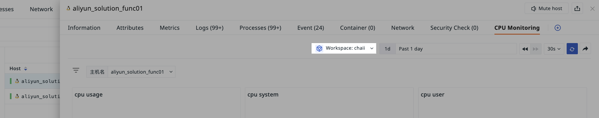

# Built-in Views
---

A view is a tool for displaying and analyzing data, helping users quickly obtain and understand insights from the data. Views can be used for:

- Data Monitoring: Use [System Views](#system) to monitor key metrics and system operational statuses in real-time, such as Docker, JVM, etc.
- Data Analysis: Utilize [User Views](#user) for custom analysis, exploring data deeply to uncover potential issues and trends.
- Data Sharing: Bind views to Explorers to ensure data consistency and accessibility.

## System Views {#system}

System views are official view templates provided by the system, covering various monitoring scenarios such as Docker, JVM, Kafka, etc.

1. Enter Scene > Built-in Views > System Views;
2. Click to enter a specific view;
3. You can choose to directly create it as a [New Dashboard](../dashboard/index.md#blank) or [New User View](./bind-view.md);
4. Click confirm to reuse this system view.

## User Views {#user}

Customized and saved view templates.

> For detailed operations, refer to [Binding Built-in Views](../../scene/built-in-view/bind-view.md).

???+ warning "Note"

    - User views under the same workspace are not allowed to have duplicate names;
    - Currently, only manual binding of user views as Explorer views is supported. If you need to bind a system view, clone it first as a user view. If a system view has the same name as a user view, the Explorer will prioritize displaying the user view.

## Managing Views

### Exporting View JSON

Select built-in views > System Views/User Views, click "Export View JSON" to generate a JSON file. This file can be used to import scene dashboards or user views into other workspaces.

### Importing View JSON

When customizing user views, click "Import View JSON" to use the JSON file as a new view template.

???+ warning "Note"

    Importing will overwrite existing views and cannot be undone, and only supports user views.

### Exporting to Dashboards

User views can be directly exported to scene dashboards.

1. Click "Settings";
2. Select "Export to Dashboard";
3. Input a name and select tags;
4. Click confirm.

### Pinning

If the current workspace is authorized to access data from other workspaces, you can pin target Workspace A in the view to make it the default query space.

If the Explorer details page binds this user view, it will display data according to the pinned workspace by default.

