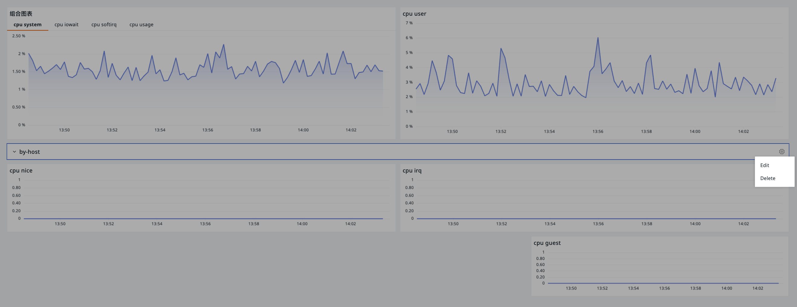

# Manag Page 

After entering a specific dashboard page, you can manage the dashboard through the following operations.

## Card Metadata Info {#metadata}

Upon entering a specific dashboard, you can view the diagram information at the top `metadata` section of the page.

In addition to viewing the current dashboard's ID, creator, creation time, updater, and update time, you can also directly click here to modify the current dashboard's name, description, tags, and visibility range.

If necessary, you can delete the current dashboard.

**Note**: If the current dashboard page has been saved as a snapshot and shared externally, the shared recipients cannot view the card metadata information here without logging in.

## Adding Charts

After the dashboard is created, you can add charts to the dashboard.

### Grouping {#group}

You can also categorize the charts within the dashboard.

1. Entering the editing page;
2. Enter the group name;
3. Choose the group color as needed;
4. Click Confirm.

If you need to modify the group, hover and click the settings button on the right.

## Cross-Workspace Query {#cross-workspace}

If a workspace is granted to another workspace, you can switch workspaces on the dashboard to view the corresponding chart information.

**Note**: If the chart in the dashboard has already been configured with workspace query settings, it takes precedence over the dashboard or viewer global configuration.

### Pin {#pin}

On the premise that the current workspace is authorized to view data from several other workspaces, you can choose to pin the authorized workspace A, which will set workspace A as the default workspace for querying data.

**Note**:

1. Designating a new default workspace will override the previous one.
2. You can unpin other workspaces, reverting to the current workspace for queries.
3. This feature is not available for read-only members.

## Full Screen

Guance automatically hides the top and side navigation bars for full-screen viewing. Press ESC to exit full screen.

## Auto Refresh {#refresh}

The refresh feature provided by Guance can help you quickly obtain real-time dashboard data.

=== "Relative Time"

    That is, when the time widget is within the relative time range, you can choose from five refresh frequencies including 5s/10s/30s/1m/5m/30m/1h; the default is 30s;

    Or directly support manual refresh by clicking :octicons-sync-24:.

    

=== "Absolute Time"

    That is, when the time widget is in absolute time mode, you can manually refresh by clicking :octicons-sync-24:.

    

**Note**: The settings for this refresh function do not conflict with [Viewer Auto Refresh](../../getting-started/function-details/explorer-search.md#auto-refresh).

## Settings

After the dashboard is created, click :octicons-gear-24: to perform the following operations on the dashboard.

### Create New Issue

You can create an Issue for the anomalies observed in the current dashboard.

> For more related operations, see [How to Manually Create an Issue at the View Level](../../exception/issue.md#dashboards). For more information about Issues, see [Exception Tracking](../../exception/index.md).

### Save Snapshot

1. Enter the snapshot name;
2. Choose the visibility range;
3. Select the time range, and the next time you open this snapshot, it will automatically fill in the selected time range;
4. Click Confirm.

You can save snapshots quickly using the shortcut `Ctrl+K` on Windows or `Cmd+K` on Mac OS. Saved snapshots are accessible under **Shortcuts > Snapshots**.

> For more information, see [Snapshots](../../getting-started/function-details/snapshot.md).

### Save to Inner View

1. The view name defaults to the current dashboard name and can be modified;
2. Choose the binding relationship, such as `label:*`;
3. Click Confirm.

**Note**: User views under the same workspace are not allowed to have duplicate names.

After saving, you can view the saved dashboard view "CPU Monitoring View" in **Scenes > Inner Views > User Views**.

At the same time, because the binding relationship `label:*` is set, the bound Inner View "CPU Monitoring View" can be viewed on the host and container detail pages where the "Label Attribute" has been set in the infrastructure.

### Export/Import as JSON

You can export the current dashboard's JSON file or import a JSON file to overwrite the current dashboard.

**Note**: Importing a dashboard JSON replaces the current one and can't be undone.

### Clone

1. Enter the name of the dashboard to be copied;
2. Choose the visibility;
3. Click **Confirm**, and you can view the cloned dashboard in the dashboard list.

## History Version

Guance will display the historical operation records of the dashboard within the last three months.

> For more details, see [Snapshot History Version](./history-version.md).
