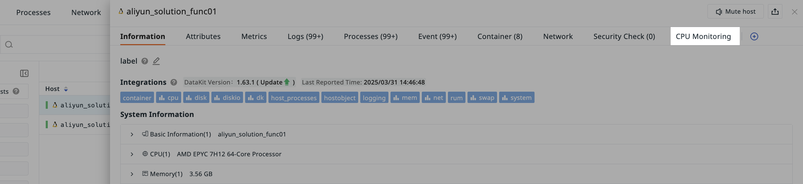

# View Management

After entering a specific dashboard page, you can manage the dashboard through the following operations.

## Card Metadata Information {#metadata}

After entering a specific dashboard, view the diagram information in the `metadata` section at the top of the page. You can view and modify the dashboard's ID, name, description, tags, and visibility scope, and you can also delete the dashboard here.

???+ warning "Note"

    If the current dashboard page is saved as a snapshot and shared externally, the shared user cannot view the card metadata information when not logged in.

## Add Charts

After creating a dashboard, you can add charts. After selecting a chart, click "Complete Addition" at the top of the page.

### Grouping {#group}

You can also categorize the charts within the dashboard.

1. Click on grouping;
2. Input the group name;
3. Select the group color as needed;
4. Click confirm.

To modify this group, hover over it and click the settings button on the right.

## Cross-Workspace Query {#cross-workspace}

If a workspace has been [granted](../../management/data-authorization.md) access to other workspaces, you can switch workspaces within the dashboard to view corresponding chart information.

???+ warning "Note"

    If a workspace query configuration has already been set for a chart, its priority will be higher than the global configuration.

### Pin Workspace {#pin}

When accessing another workspace authorized to view data from other workspaces, you can choose to pin the authorized workspace and set it as the default workspace for querying data.

???+ warning "Note"

    - Since only one workspace can be specified as the default option each time, setting another workspace as the default will invalidate the previously set default.
    - You can cancel pinning other workspaces. After cancellation, the current workspace will be used by default to fill in query data.
    - Read-only members do not support this operation.

## Fullscreen Mode

Click the "Full Screen" button, and the system will hide the left and top navigation bars, displaying the view in full screen. Click the ESC button to exit fullscreen mode.

## Auto Refresh {#refresh}

Helps you quickly obtain real-time dashboard data. Optional frequencies: 5s, 10s, 30s, 1m, 5m, 30m, 1h.

If auto refresh is not required, select Off (disable).

???+ warning "Note"

    All dashboards and views share one refresh configuration.

## Settings

After creating a dashboard, click :octicons-gear-24: to perform the following operations on the dashboard.

### Create Issue 

You can create an Issue based on abnormal phenomena observed in the current dashboard.

> For more related operations, refer to [How to Manually Create an Issue at the View Level](../../exception/issue.md#dashboards). For more information about Issues, refer to [Incident](../../exception/index.md).

### Save Snapshot 

1. Input the snapshot name;
2. Select the visibility scope;
3. Choose the time range; when opening the snapshot again, the selected time range will be automatically filled;
4. Click confirm.

In addition to opening the save page via the button, you can also use the shortcut key `(Windows: Ctrl+K / Mac OS: Cmd+K)` to quickly save a snapshot. After saving, you can view it under **Shortcut > Snapshots**.

> For more details, refer to [Snapshot](../../getting-started/function-details/snapshot.md).

### Save to Built-in View

1. The view name defaults to the current dashboard name but can be modified;
2. Select the binding relationship, such as `label:*`;
3. Click confirm.

???+ warning "Note"

    User views under the same workspace are not allowed to have duplicate names.

After saving, you can view the saved dashboard view "CPU Monitoring View" under **Scenarios > Built-in Views > User Views**.

Additionally, since the binding relationship `label:*` has been set, the built-in view "CPU Monitoring View" can be viewed on the details pages of hosts and containers that have had the "Label Property" set in infrastructure settings.

### Export/Import Dashboard JSON

Export the JSON file of the current dashboard or import a JSON file to overwrite the current dashboard.

???+ warning "Note"

    Importing a dashboard JSON will overwrite the original dashboard, and once overwritten, it cannot be restored.

### Clone Dashboard

1. Input the name of the copied dashboard;
2. Select the visibility scope of the dashboard;
3. Click **Confirm**, and you can view the cloned dashboard in the dashboard list.

## Historical Versions

The system will display the [historical operation records](./history-version.md) of this dashboard within the last three months.