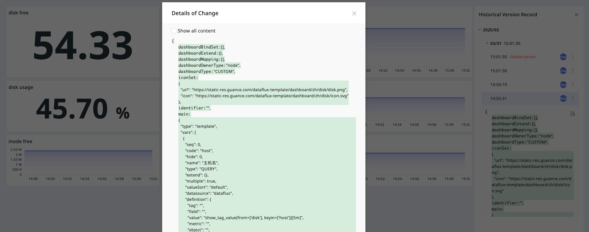

# History Versions

**Note**: This entry is only visible to members with [Scenario Configuration Management Permissions](../../management/role-list.md).

Guidance shows the last 3 months of dashboard operation records. You can see each version's update time, who updated it, and the update history.

## History Records

Click to enter the historical version, and all versions will be listed on the right side, with the current version selected by default. Switch versions by clicking, and the chart on the left shows the content for the selected version.

You can view the JSON change records of different versions of the current dashboard on the right side of the page:

- Red: Indicate deleted content;
- Green: Indicate newly added content.

For version records, you can perform the following operations:

1. Click the :material-dots-vertical: icon on the right side of a version, and you can choose to restore this version or clone the dashboard.
2. Click :material-text-search:, and you can view the change details of that version.

## View Details

In historical version mode, you can:

1. Select the view variable from the drop-down menu at the top of the page;
2. Choose the time range in the time widget;
3. Preview, download, and view charts.

**Note**:

1. Empty charts may indicate no data for the current version;
2. Charts are read-only in historical version mode.

