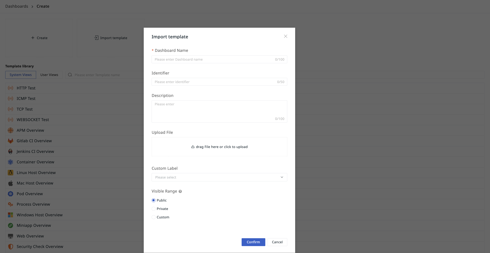
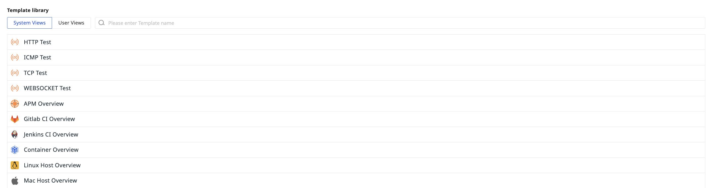

# Dashboard
---


**Dashboard** displays visual reports related to functionality on the same interface, building data insight scenarios through multi-dimensional data analysis. You can start constructing visualization scenarios by creating a blank dashboard or importing a custom template, and comprehensively monitor data metrics from different sources using methods such as adding charts, time widgets, keyword searches, and label filtering.

## Create

You can create a dashboard in three ways.

:material-numeric-1-circle: Directly create a [blank dashboard](#blank);

:material-numeric-2-circle: Import a [custom template](#custom);

:material-numeric-3-circle: Select a view from the [built-in template library](#view).

### Blank Dashboard {#blank}


1. Define the name of the current dashboard;
2. Define the ID of this dashboard;
3. Input the description content for this dashboard as needed;
4. Select [labels](../../management/global-label.md) for easier grouping management later;
5. Choose the [visibility scope](#range) for the current dashboard;
6. Click confirm to successfully create it.

#### Identifier ID

This ID is defined as `identifier`, used to ensure the uniqueness of the dashboard or view.

##### Use Cases

It can be used to configure the chart's [jump link](../visual-chart/chart-link.md), thus achieving unique positioning.

:material-numeric-1-circle-outline: Define the dashboard identifier ID as `abc`. In the final exported [JSON file](./config_list.md#options), the parameter will be: `"identifier": "abc"`


:material-numeric-2-circle-outline: When configuring the jump link for the chart, add the dashboard link with the identifier ID `abc` as:

```
/scene/dashboard/dashboardDetail?identifier=abc
```

Besides dashboards, views are also applicable:

```
// The type field optional values: inner (user view), sys (system view). Defaults to inner if not provided:
/scene/builtinview/detail?identifier=abc&type=sys // System view
/scene/builtinview/detail?identifier=abc&type=inner // User view
/scene/builtinview/detail?identifier=abc // User view
```


#### Visibility Scope {#range}

The visibility scope of the dashboard includes:

- Public: Open to all members within the workspace;
- Visible only to oneself: Only visible to the creator;
- Custom: Restricts the visibility scope to specific members.


???+ warning "Note"

    - Non-public dashboards shared via links are invisible to non-creators;
    - This switch only controls whether the current dashboard is public or not, and does not affect other rules.


### Custom Template {#custom}



1. Define the name of the current dashboard;
2. Define the ID of this dashboard;
3. Input the description content for this dashboard as needed;
4. Upload a custom JSON file for the view template;
5. Select [labels](../../management/global-label.md) for easier grouping management later;
6. Choose the [visibility scope](#range) for the current dashboard;
7. Click confirm to successfully create it.

### Built-in Template Library {#view}



Ready-to-use, including [system views](../built-in-view/index.md#system) and [user views](../built-in-view/index.md#user).

1. The dashboard name defaults to the name of the currently selected view, but can be changed as needed;
2. Define the ID of this dashboard;
3. Input the description content for this dashboard as needed;
4. Select [labels](../management/global-label.md) for easier grouping management later;
5. Choose the [visibility scope](#range) for the current dashboard;
6. Click confirm to successfully create it.