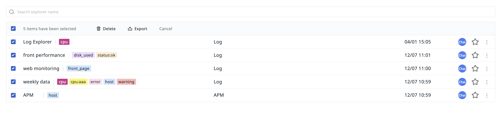
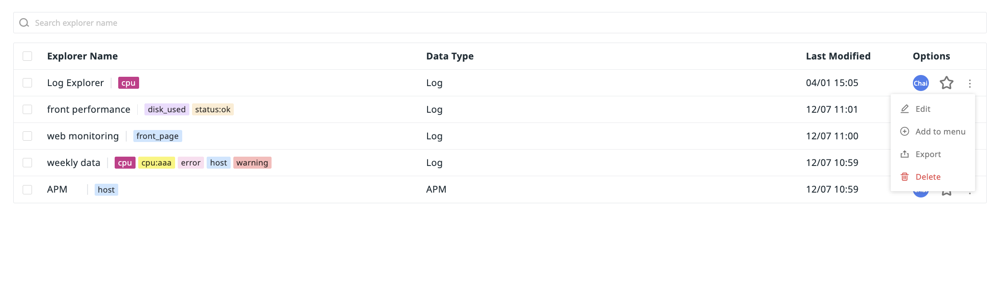

# Options
---

You can manage the Explorer list through the following actions.

## Search & Filtering

In the Explorer list, you can use the **search bar** at the top and the **filtering** and **label filtering** functions on the left to quickly group and view Explorers, improving query efficiency.

## Batch operations

Supports batch deletion or export of specific Explorers.

## Add Explorer to Navigation {#menu}

You can add an Explorer to navigation menus such as Infrastructure, Measurements, Logs for quick access:

1. In the Explorer list, select the Explorer you want to add (such as a MySQL Explorer template), click edit in the right-hand action menu, and choose to add it to the menu.
2. Select the target menu (e.g., Logs).
3. After adding, you can view the custom Explorer in the corresponding navigation menu.
4. If you have [Use Case Configuration Management Permissions](../../management/role-list.md), you can also click to edit the custom Explorer and return to the custom Explorer for editing.

