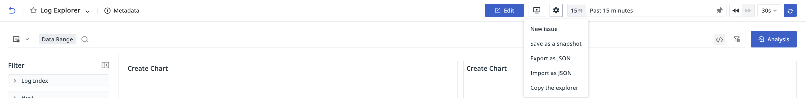

# View Management 
---

## Cross-Workspace Query

If a workspace is granted access to other workspaces, it can switch workspaces in the current Explorer to view corresponding chart information.

## Settings 

### Create Issue

You can create an Issue for any abnormal phenomena discovered in the Explorer.
 
> For more related operations, refer to [How to Manually Create an Issue at the View Level](../../exception/issue.md#dashboards). For more information about Issues, refer to [Incident](../../exception/index.md).

### Import/Export/Copy Explorer

- Copy Explorer: Copy the current Explorer as a new one for editing; 
- Export Explorer: Export as a JSON file to share the Explorer template;      
- Import Explorer: Import a JSON file to either create a new or overwrite an existing template for editing.