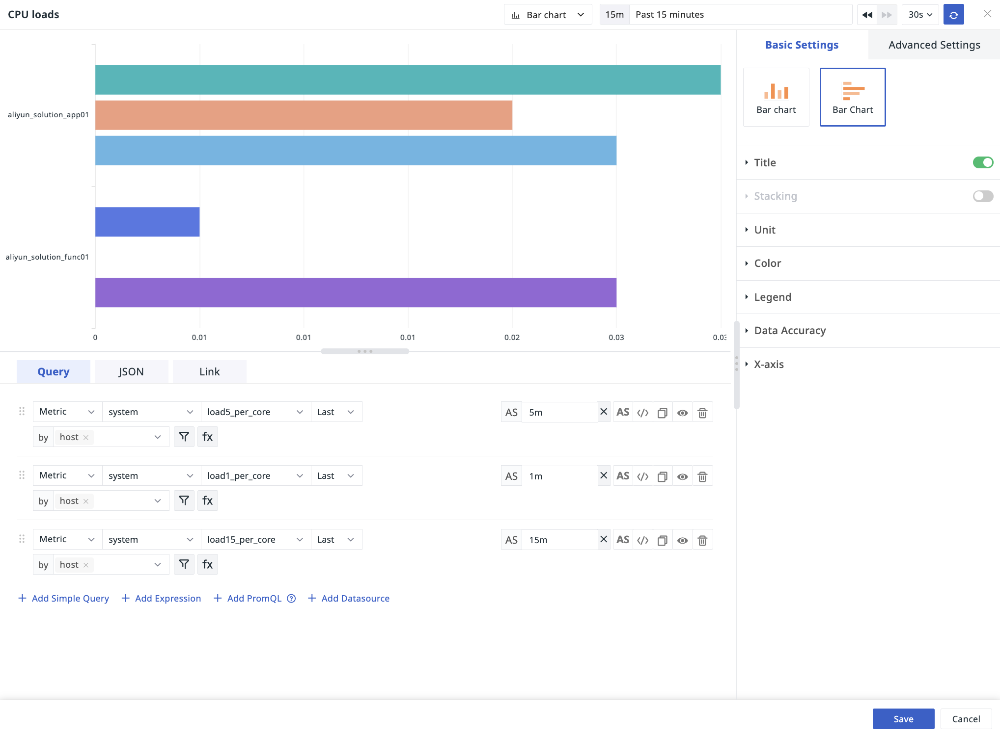

# Bar Chart
---

Generally used to illustrate data changes over a period of time and compare different variables.

Includes two types of chart displays:

- Bar Chart
- Horizontal Bar Chart

## Chart Configuration

> For more details, refer to [Chart Configuration](./chart-config.md).

### Stacking

:material-numeric-1-circle: Type: Includes standard stacking and percentage stacking.

:material-numeric-2-circle: X-Axis

- Grouping: Each group represents one bar, with datasets in the same group stacked;
- Query: Each query represents one bar, with groups within the query stacked. 

### X/Y Axis

Set the maximum and minimum values for the numerical X/Y axis.

### Baseline

Add baseline value, baseline title, and baseline color. Set a standard or expected value for comparing changes and trends in the data.