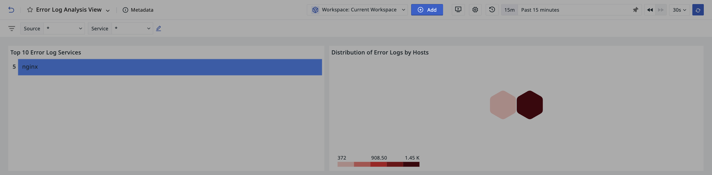
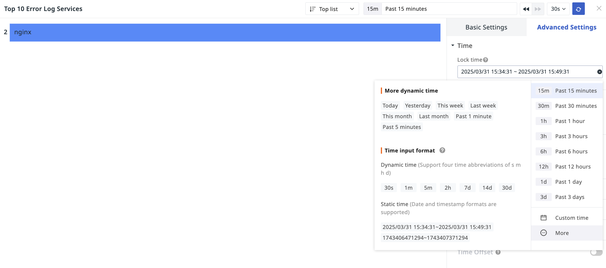
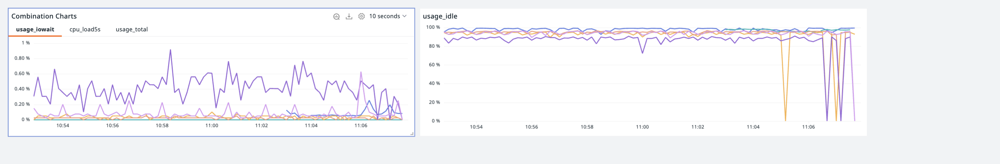
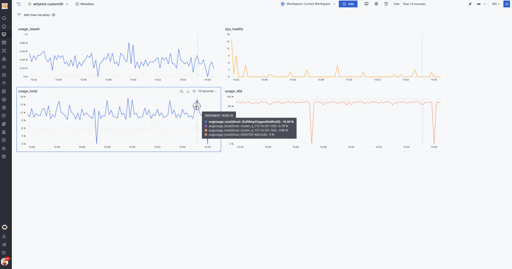

# Visualization Charts
---

<<< custom_key.brand_name >>> is equipped with over 20 standardized visualization charts, allowing you to easily customize dashboards according to business needs. At the same time, by using advanced features such as view variables, data linkage between charts can be achieved, ensuring personalization and professionalism in data presentation.

<!--

- [ :fontawesome-solid-arrow-right-long: &nbsp; **Time Series Chart**](timeseries-chart.md)

- [ :fontawesome-solid-arrow-right-long: &nbsp; **Overview Chart**](overview-chart.md)

- [ :fontawesome-solid-arrow-right-long: &nbsp; **Table Chart**](table-chart.md)

- [ :fontawesome-solid-arrow-right-long: &nbsp; **Treemap**](treemap.md)

- [ :fontawesome-solid-arrow-right-long: &nbsp; **Funnel Chart**](funnel-chart.md)

- [ :fontawesome-solid-arrow-right-long: &nbsp; **Pie Chart**](pie-chart.md)

- [ :fontawesome-solid-arrow-right-long: &nbsp; **Bar Chart**](bar-chart.md)

- [ :fontawesome-solid-arrow-right-long: &nbsp; **Histogram**](histogram.md)

- [ :fontawesome-solid-arrow-right-long: &nbsp; **SLO**](slo-chart.md)

- [ :fontawesome-solid-arrow-right-long: &nbsp; **Leaderboard**](leaderboard.md)

- [ :fontawesome-solid-arrow-right-long: &nbsp; **Dashboard**](dashboard/index.md)

- [ :fontawesome-solid-arrow-right-long: &nbsp; **Scatter Plot**](scatter-plot.md)

- [ :fontawesome-solid-arrow-right-long: &nbsp; **Bubble Chart**](bubble-chart.md)

- [ :fontawesome-solid-arrow-right-long: &nbsp; **China Map**](china-map.md)

- [ :fontawesome-solid-arrow-right-long: &nbsp; **World Map**](world-map.md)

- [ :fontawesome-solid-arrow-right-long: &nbsp; **Cellular Map**](cellular-map.md)

- [ :fontawesome-solid-arrow-right-long: &nbsp; **Sankey Diagram**](sankey.md)

- [ :fontawesome-solid-arrow-right-long: &nbsp; **Picture**](picture.md)

- [ :fontawesome-solid-arrow-right-long: &nbsp; **Text**](text.md)

- [ :fontawesome-solid-arrow-right-long: &nbsp; **Video**](video.md)

- [ :fontawesome-solid-arrow-right-long: &nbsp; **Command Panel**](command-panel.md)

- [ :fontawesome-solid-arrow-right-long: &nbsp; **IFrame**](iframe.md)

- [ :fontawesome-solid-arrow-right-long: &nbsp; **Log Stream Chart**](log-stream.md)

- [ :fontawesome-solid-arrow-right-long: &nbsp; **Object List Chart**](object-list.md)

- [ :fontawesome-solid-arrow-right-long: &nbsp; **Alert Statistics Chart**](alert-statistics.md)

- [ :fontawesome-solid-arrow-right-long: &nbsp; **Topology Map**](topology-map.md)

|                   :fontawesome-regular-circle-down: &nbsp;**Chart Details**                 |                |                |   |   |
| :-------------------: | :--------------------: | :--------------------: | :--------------------: | :--------------------: |
| [Time Series Chart](timeseries-chart.md){ .md-button .md-button--primary } | [Overview Chart](overview-chart.md){ .md-button .md-button--primary } | [Table Chart](table-chart.md){ .md-button .md-button--primary } |[Treemap](treemap.md){ .md-button .md-button--primary } |[Funnel Chart](funnel-chart.md){ .md-button .md-button--primary } |
| [Pie Chart](pie-chart.md){ .md-button .md-button--primary } | [Bar Chart](bar-chart.md){ .md-button .md-button--primary } | [Histogram](histogram.md){ .md-button .md-button--primary } |[SLO](slo-chart.md){ .md-button .md-button--primary } |[Leaderboard](leaderboard.md){ .md-button .md-button--primary } |
| [Dashboard](dashboard/index.md){ .md-button .md-button--primary } | [Scatter Plot](scatter-plot.md){ .md-button .md-button--primary } | [Bubble Chart](bubble-chart.md){ .md-button .md-button--primary } |[China Map](china-map.md){ .md-button .md-button--primary } |[World Map](world-map.md){ .md-button .md-button--primary } |
| [Cellular Map](cellular-map.md){ .md-button .md-button--primary } | [Sankey Diagram](sankey.md){ .md-button .md-button--primary } | [Text](text.md){ .md-button .md-button--primary } |[Picture](picture.md){ .md-button .md-button--primary } |[Video](video.md){ .md-button .md-button--primary } |
| [Command Panel](command-panel.md){ .md-button .md-button--primary } | [IFrame](iframe.md){ .md-button .md-button--primary } | [Log Stream Chart](log-stream.md){ .md-button .md-button--primary } |[Object List Chart](object-list.md){ .md-button .md-button--primary } |[Alert Statistics Chart](alert-statistics.md){ .md-button .md-button--primary } | 
| [Topology Map](topology-map.md){ .md-button .md-button--primary } |  |  |  |  |

-->

## Adding Charts

1. Enter the dashboard page;
2. Start adding a chart;
3. Select the type of chart to add;
4. Click create to complete the addition.

## Chart Types {#type}

1. **Common Charts**

- [Time Series Chart](./timeseries-chart.md): Displays trends of data over time.
    - Time series line chart
    - Time series bar chart
    - Time series area chart

- [Grouped Bar Chart](./bar-chart.md): Used to show comparisons between items.
    - Grouped bar chart
    - Grouped column chart

- [Leaderboard](./leaderboard.md): Displays rankings of grouped data over a period of time.

- [Pie Chart](./pie-chart.md): Displays the proportion of data.
    - Pie chart
    - Donut chart
    - Rose chart

- [Overview Chart](./overview-chart.md): Displays a key value or metric.

3. [**Table Chart**](./table-chart.md)

- Grouped table chart: Displays metrics for different categories or groups.
- Time series table chart: Displays trends of data changing over time.

4. **Maps**

- [China Map](./china-map.md): Displays distribution across different geographical locations, indicating data size through color intensity.
- [World Map](./world-map.md): Displays distribution across different geographical locations, indicating data size through color.

5. **Scatter Plots**

- [Scatter Plot](./scatter-plot.md): Displays data as points, showing relationships and influence between two variables.
- [Bubble Chart](./bubble-chart.md): Displays relationships and influence between three variables, representing the third variable by bubble size.

6. **Distribution Charts**

- [Cellular Map](./cellular-map.md): Displays distributions of multiple datasets, indicating data size through block color intensity.
- [Topology Map](./topology-map.md): Displays relationships and relative positions between different entities.
- [Treemap](./treemap.md): Displays proportions of different categories, effectively utilizing space compared to pie charts, and can display more data.
- [Histogram](./histogram.md): Also known as a quality distribution chart, represents data distribution with a series of bars of varying heights.
- [Heatmap](./heatmap_scene.md): Represents data density or intensity through color changes, typically using gradient colors to indicate different numerical ranges.

7. **Other Charts**

- [SLO](./slo-chart.md): Requires selecting an already configured SLO monitoring to display related performance data.
- [Dashboard](./dashboard.md): Displays progress or completion status of metrics.
- [Funnel Chart](./funnel-chart.md): Displays conversion within business processes.
- [Sankey Diagram](./sankey.md): A special flowchart used to display data or energy flow.

8. **Advanced Charts**

- [Log Stream Chart](./log-stream.md): Displays log data in a time-series table format, allowing customization of displayed log ranges and columns.
- [Object List Chart](./object-list.md): Displays infrastructure data in a table format, including "basic objects" and "resource catalogs."
- [Alert Statistics Chart](./alert-statistics.md): Displays unresolved alert events in a list format, enabling quick identification and response to urgent system issues.
- [Monitor Summary](./monitor_summary.md): Automatically queries monitor events from the last 2 days and displays the latest trigger event status.
- [Text](./text.md): Adds tips, explanations, and various content (such as text, images, and hyperlinks) in Markdown formatted documents.
- [Video](./video.md): Displays video content on the dashboard by adding a video URL, enhancing information delivery effects.
- [Picture](./picture.md): Displays images on the dashboard, supports adding image URLs, and provides multiple image display options like fill, fit, stretch, and center.
- [Command Panel](./command-panel.md): Composed of command buttons, allows users to execute specific commands or navigate to designated links by clicking.
- [IFrame](./iframe.md): Embeds external pages into the dashboard, supporting https and http links.

## Chart Settings {#settings}

- Modify: Edit chart configuration;
- [Combine Charts](#conbine);
- Copy: Copies all configurations of the current chart; can be used in the current or other dashboards, notes;
- Clone: Directly clones the current chart to the current dashboard;
- Delete: Deletes the current chart;
- [Share](#share): Shares the current chart externally.

### Time Interval {#interval}

The external time interval display of a chart is affected by the settings inside the chart > Advanced Settings > Time Interval.

#### Lock Time

Select the required data query time range in the time widget, save it, and the locked time will be displayed synchronously outside the chart.

#### Automatic Alignment

Adjusting the timeline aligns data collected at different time points or frequencies to the same time base.

In charts like time series, if the time interval is set to **Automatic Alignment**, after saving, the external chart will synchronously display the time interval option.

### Combine Charts {#conbine}

The combine charts feature supports adding one or multiple charts and applying view variables from the current dashboard, enabling flexible filtering and comparison.

1. Click modify to enter the chart combination configuration page;
2. Define the title for the current combined chart;
3. Configure variables for this combined chart;
4. Select the chart;
5. Click confirm.

### Share {#share}

#### Start Sharing

1. Click Settings > Share;
2. Select the chart query time;
3. Obtain the embed code;
4. The chart sharing is now successful.

The embed code will be generated based on the chart's query time. For example, if the chart query time is the last 15 minutes, then after embedding on another platform, the chart will display results for the last 15 minutes.

???+ warning "Note"

    - If the chart locks time, the query time is fixed to the locked time and cannot be changed;
    - The default width and height of the shared chart are the view dimensions, which can be modified via the embed code;
    - If the chart associates with view variables, it will display according to the currently selected variable values when shared.

#### View Shared Charts

Shared charts are stored under **Manage > Share Management > [Shared Charts](../../management/share-management.md)**.

### Export Charts {#download}

Click :material-tray-arrow-down: to export the chart as a PNG image.

Specific chart types such as time series charts, pie charts, leaderboards, bar charts, treemaps, etc., can also be exported as CSV files, meeting more data usage needs.

### Analyze Charts {#analysis}

In the dashboard, click the **Analyze** button on the chart or double-click the blank area of the chart to zoom in for deeper insights. Hover over with the mouse to quickly view data information, select [Timeline](timeseries-chart.md#timeline) to view metric trends for a specific time range.

- When hovering over a certain timeline, if other charts have `by` grouping conditions and the same tags, relevant charts will highlight corresponding sections, facilitating correlation analysis;
- Clicking on the chart can view its [DQL Query Statement](chart-query.md), making it easier to understand the data logic behind the chart.

#### [Similar Trend Metrics](./timeseries-chart.md#similar) 

#### Related Views

Clicking on a query can view associated analyses, such as logs, containers, processes, traces, etc.; if the chart query includes host (`host`) information and the grouping condition is `by host`, the host monitoring view can also be viewed.

#### Drill Down Analysis {#deep}

Drill down analysis breaks down summarized data into finer granularities to pinpoint the exact location where problems occur.

1. Click to enter drill down analysis;
2. Box-select the target time region;
3. Click to start the search, and you can view the drill down labels and corresponding time series chart results within that region.

???+ warning "Note"

    Drill down analysis only supports simple queries.

#### Root Cause Analysis {#root}

Through data association reasoning, identify the root cause of the problem. Root cause analysis supports analyzing `disk utilization` and `memory utilization`.

???+ warning "Note"

    Root cause analysis only supports simple queries.

