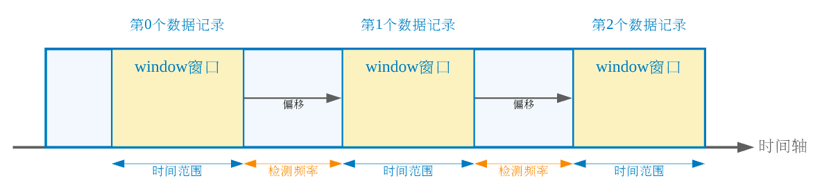
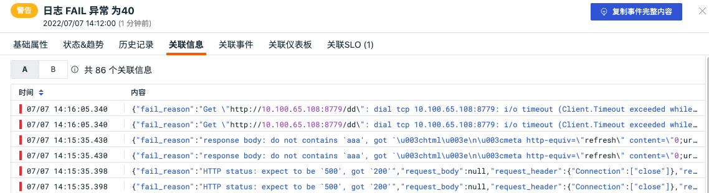

# 事件查看器
---

## 简介

观测云 支持您通过「事件」对异常检测库触发的事件进行实时监控、统一查询、未恢复事件统计、和数据导出。同时，系统支持快速聚合相关事件和匹配关联事件，您可快速定位异常并高效对异常数据进行分析。

## 未恢复事件列表

进入「事件」，观测云 将默认为您展示「未恢复事件列表」，您可以查看到空间内持续被触发的全部未恢复事件，及不同告警级别下未恢复事件的数据量统计、告警信息详情等。

**注意**：若在异常检测库配置检测规则时，未设置恢复告警事件检测周期，则告警事件不会恢复，且一直会出现在「事件」-「未恢复事件列表」中。

### 数据状态

观测云 为帮助您快速识别告警事件，事件数据将依据异常检测规则设定的告警级别包括 critical（紧急）、error（错误）、warning(警告）和ok (正常) 进行分类。

### 查询与分析

在未恢复事件列表中，支持通过选择时间范围、搜索关键字，筛选等方式查询事件数据，帮助您快速在所有事件中定位到哪一时间范围、哪一功能模块、那一行为触发的事件。您可以

- 统计不同告警状态下的事件数量，包括「未恢复」、「紧急」、「错误」、「警告」、「无数据」
- 点击列表上方的告警状态，筛选出所有对应告警状态下的事件列表
- 通过列表上方的搜索和筛选栏，您可以基于标签、字段、文本（包含日志文本）进行关键词搜索、标签筛选、字段筛选、关联搜索
- 查看当前告警事件信息，包括该事件的检测维度、告警开始的时间、告警持续的时间，展开可查看最近 6 小时的window函数。

**注意**：在预览事件的 window 函数时，

   - 异常事件影响时间段展示为虚线边框的展示效果
   - 检测库规则类型为阈值、日志、应用性能指标、用户访问指标检测、安全巡检、异常进程、云拨测检测时，根据不同告警等级对应的色块可查看相关异常检测指标数据，包括紧急、错误、警告。
   - 检测库规则类型为突变、区间、水位时，根据图表“竖线”可快速识别出当前事件触发的时间点。

### 检测维度

目前事件检测维度支持容器、进程、日志、链路、RUM、可用性检测、安全巡检、CI 这8个查看器的跳转，并且查看器如无相关数据，对应跳转链接灰置。支持“正向筛选”、“反向筛选”和“复制”。

- “正向筛选”，即添加该标签至事件查看器，查看与该主机相关的全部事件数据
- “反向筛选”，即添加该标签至事件查看器，查看除了该主机以外，其他主机相关的全部事件数据
- “复制”，即复制该标签内容至剪贴板 

### 恢复事件 {#recover}

未恢复的事件是按照获取选定时间段内最后一次状态不等于 `OK` 的事件，查询结果会受限于时间范围，不同的时间范围的查询结果列表有可能不一致，故提供手动恢复事件的功能。

在未恢复事件列表中，鼠标移到事件，在事件右侧可以查看到“已恢复”的功能。

点击“已恢复”，事件被手动恢复到正常，同时会产生一条恢复的事件，在该事件中可查看到对应的操作者。

## 事件列表

进入「事件」，通过切换左上角的查看器至「事件列表」，你可以查看空间内全部事件列表。观测云支持通过柱状图堆叠的方式，统计当前事件列表内，不同时间点发生的不同告警级别的事件数量。

### 事件查询

在事件列表中，观测云 支持通过选择时间范围、搜索关键字，筛选等方式查询事件数据，帮助您快速在所有事件中定位到哪一时间范围、哪一功能模块、那一行为触发的事件。您可以：

- 通过右上角的时间筛选组件，您可以筛选数据展示的时间范围
- 通过列表上方的搜索和筛选栏，您可以基于字段、文本（包含日志文本）进行关键词搜索、字段筛选、关联搜索
   - 输入框支持模糊匹配相关字段
   - “abc：123”形式， 回车后支持字段筛选
   - 输入框输入文本，支持关键字搜索
   - " abc AND cba / abc OR cba" 形式，回车后支持关联搜索
- 通过列表左侧的快捷筛选，您可以通过勾选快捷筛选的字段快速筛选数据，支持自定义添加筛选字段，更多快捷筛选可参考文档 [快捷筛选](../others/explorer-search.md#quick-filter) 。

注意：搜索支持多个关键词搜索，采用 AND 逻辑，输入的关键词越多数据匹配的范围越精准，使用空格或者逗号隔开即可。更多搜索与筛选可参考文档 [查看器检索](../others/explorer-search.md) 。
### 分组聚合

通过分组功能，观测云支持根据检测项分组聚合和统计相关事件。

### 数据导出

在事件列表中，点击「导出」可导出当前事件列表的数据到CSV、仪表板和笔记。

## 事件详情页

在异常事件列表中点击事件，就可以查看事件详情，包括基础属性、状态&趋势、历史记录、关联事件和关联SLO。支持点击“复制事件完整内容”按钮，获取当前事件所对应的所有关键数据，若在配置监控器时关联了仪表板，可点击“关联仪表板”按钮跳转到对应的仪表板。
### 基础属性
支持查看事件的标签及属性、检测维度、事件内容以及其他的字段属性。

点击标签“监控器”，支持“正向筛选”、“反向筛选”、“复制”和“跳转到监控器”。

- “正向筛选”，即添加该标签至事件查看器，查看与该主机相关的全部事件数据
- “反向筛选”，即添加该标签至事件查看器，查看除了该主机以外，其他主机相关的全部事件数据
- “复制”，即复制该标签内容至剪贴板 

- “跳转到监控器”，即查看该事件配置的监控器详情。

点击“正向筛选/反向筛选”可添加标签到搜索栏筛选事件。

### 状态&趋势
支持查看事件的状态分布趋势、DQL函数和窗口函数折线图。

- 状态分布：展示选定时间范围内（默认展示最近6小时）的事件状态 (紧急、重要、警告、无数据)
- DQL查询语句：基于异常检测规则的自定义查询语句返回的实时指标数据，默认展示最近6小时的实时指标数据
- window 函数：基于异常检测规则，以选定的时间范围为窗口（记录集合），以检测频率为偏移，重新对每条记录执行统计计算，返回用于触发告警的实时异常检测指标数据。默认展示最近6小时的实时异常检测指标数据

**注意：**在事件详情中，观测云支持选择时间范围查看事件数据

   - 当您选择的时间范围小于 ( < = ) 6小时，「状态分布」、「DQL函数」、「window函数」将展示当前时间范围的数据与指标趋势。
   - 当您选择的时间范围大于 ( > ) 6小时，「状态分布」与「DQL函数」将展示当前时间范围的数据，且出现一个可调节的区间滑块（显示范围最小支持15分钟，最大支持6小时）。通过移动区间滑块，可查看与之时间范围对应的「window函数」

### 历史记录
支持查看检测对象主机、异常/恢复时间和持续时长。

### 关联信息
支持查看触发当前事件的相关信息，如查看触发事件的相关日志。此“关联信息”仅支持 4 种监控器产生的事件：日志检测、安全巡检异常检测、进程异常检测以及可用性数据检测。
注意：若日志检测包含多个表达式查询，关联信息支持多个表达式查询的 tab 切换，若有两个表达式查询 A 和 B，则在关系信息包含 A 和 B 两个 tab 可切换查看。

**日志检测配置示例：**

### 关联事件
支持通过筛选字段和所选取的时间组件信息，查看关联事件。

### 关联仪表板

若在监控配置了关联仪表板 ，则可以查看关联的仪表板。

### 关联 SLO
若在监控配置了 SLO ，则可以查看关联 SLO ，包括 SLO 名称、达标率、剩余额度、目标等信息。

## 聚合事件详情页

在事件列表中，基于"检测项“分组后，可点击查看「聚合事件」。在聚合事件列表，可查看基于该检测项触发的全部事件，点击聚合事件详情，即可查看对应的基础属性、状态&趋势、和关联事件。支持点击“复制事件完整内容”按钮，获取当前事件所对应的所有关键数据，若在配置监控器时关联了仪表板，可点击“关联仪表板”按钮跳转到对应的仪表板。

### 基础属性
支持查看事件的标签及属性、检测维度、事件内容以及其他的字段属性。

### 状态&趋势
支持查看事件的状态分布趋势、DQL函数和窗口函数折线图。

### 关联事件
支持通过筛选字段和所选取的时间组件信息，查看关联事件。

### 关联仪表板

支持通过选择主机名和所选取的时间组件信息，查看关联仪表板。

