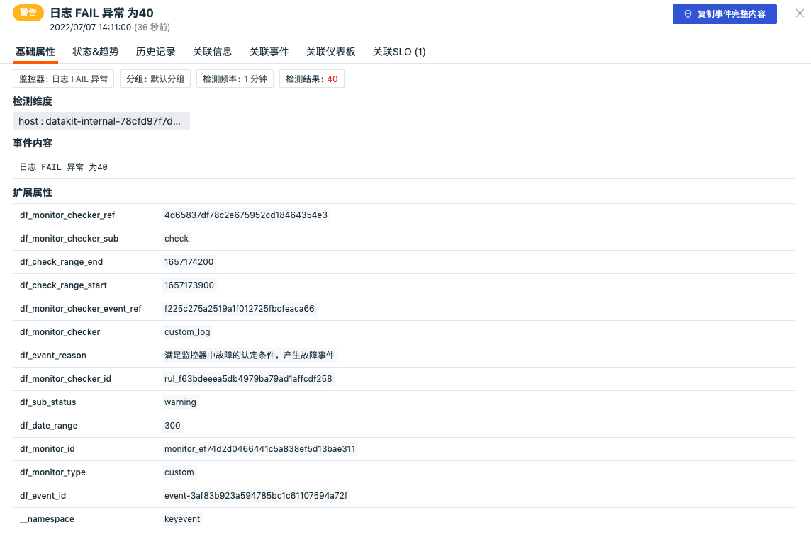
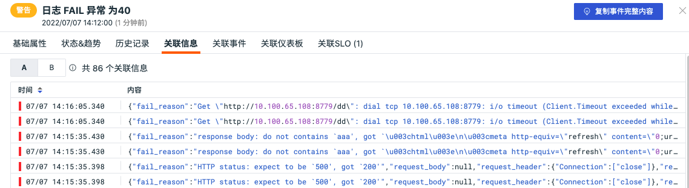
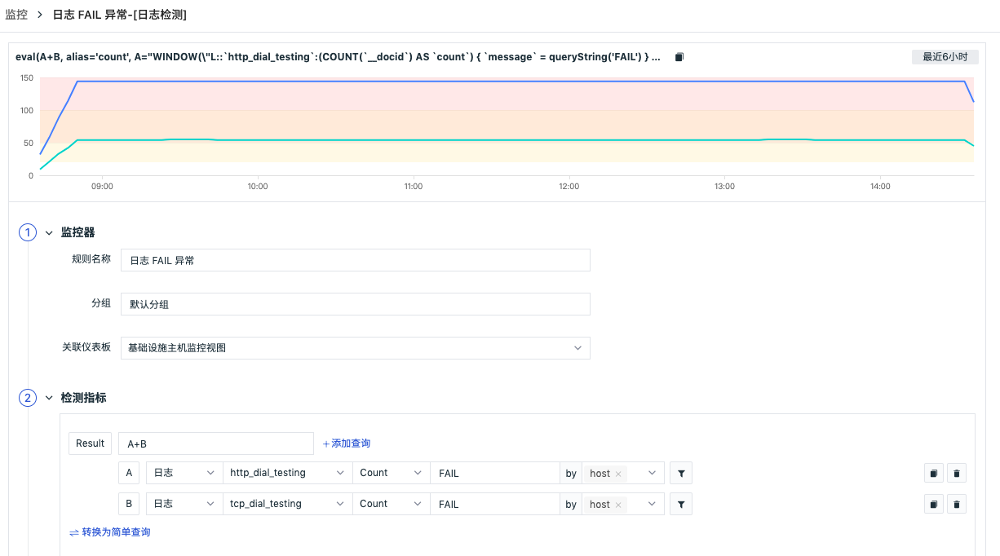

# 事件详情页
---

## 事件详情页

在异常事件列表中点击事件，就可以查看事件详情，包括基础属性、告警通知、状态&趋势、历史记录、关联事件和关联SLO。支持点击“导出事件”按钮，可选择“导出 JSON 文件”与“导出 PDF 文件”，获取当前事件所对应的所有关键数据，若在配置监控器时关联了仪表板，可点击“关联仪表板”按钮跳转到对应的仪表板。

### 基础属性
支持查看事件的检测维度、事件内容以及扩展属性。

### 告警通知
显示通知对象类型、通知对象名称、通知是否发送成功等信息。点击展开显示该告警通知对象的详细信息，支持 hover 复制。(注意：在沉默期期间，告警通知不会重复发送至相关对象。)

### 状态&趋势
支持查看事件的状态分布趋势、DQL函数和窗口函数折线图。

- 状态分布：展示选定时间范围内（默认展示最近6小时）的事件状态 (紧急、重要、警告、无数据)
- DQL查询语句：基于异常检测规则的自定义查询语句返回的实时指标数据，默认展示最近6小时的实时指标数据
- window 函数：基于异常检测规则，以选定的时间范围为窗口（记录集合），以检测频率为偏移，重新对每条记录执行统计计算，返回用于触发告警的实时异常检测指标数据。默认展示最近6小时的实时异常检测指标数据

**注意：**在事件详情中，观测云支持选择时间范围查看事件数据

   - 当您选择的时间范围小于 ( < = ) 6小时，「状态分布」、「DQL函数」、「window函数」将展示当前时间范围的数据与指标趋势。
   - 当您选择的时间范围大于 ( > ) 6小时，「状态分布」与「DQL函数」将展示当前时间范围的数据，且出现一个可调节的区间滑块（显示范围最小支持15分钟，最大支持6小时）。通过移动区间滑块，可查看与之时间范围对应的「window函数」

### 历史记录
支持查看检测对象主机、异常/恢复时间和持续时长。

### 关联信息
支持查看触发当前事件的相关信息，如查看触发事件的相关日志。此“关联信息”仅支持 4 种监控器产生的事件：日志检测、安全巡检异常检测、进程异常检测以及可用性数据检测。
注意：若日志检测包含多个表达式查询，关联信息支持多个表达式查询的 tab 切换，若有两个表达式查询 A 和 B，则在关系信息包含 A 和 B 两个 tab 可切换查看。

**日志检测配置示例：**

### 关联事件
支持通过筛选字段和所选取的时间组件信息，查看关联事件。

### 关联仪表板

若在监控配置了关联仪表板 ，则可以查看关联的仪表板。

### 关联 SLO
若在监控配置了 SLO ，则可以查看关联 SLO ，包括 SLO 名称、达标率、剩余额度、目标等信息。

## 聚合事件详情页

在事件列表中，基于"检测项“分组后，可点击查看「聚合事件」。在聚合事件列表，可查看基于该检测项触发的全部事件，点击聚合事件详情，即可查看对应的基础属性、状态&趋势、和关联事件。支持点击“复制事件完整内容”按钮，获取当前事件所对应的所有关键数据，若在配置监控器时关联了仪表板，可点击“关联仪表板”按钮跳转到对应的仪表板。

### 基础属性
支持查看事件的检测维度、事件内容以及扩展属性。

### 状态&趋势
支持查看事件的状态分布趋势、DQL函数和窗口函数折线图。

### 关联事件
支持通过筛选字段和所选取的时间组件信息，查看关联事件。

### 关联仪表板

支持通过选择主机名和所选取的时间组件信息，查看关联仪表板。

