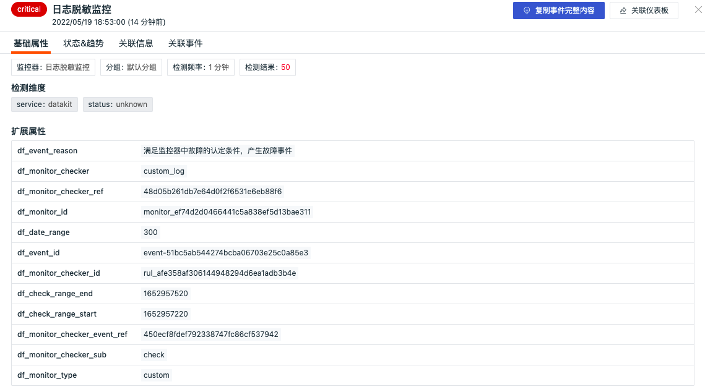

# 未恢复事件列表
---

## 简介

进入「事件」，观测云默认为您展示「未恢复事件列表」，您可以查看到空间内持续被触发的全部未恢复事件，及不同告警级别下未恢复事件的数据量统计、告警信息详情等。未恢复事件查询为最近 48 小时数据，支持手动刷新。

在未恢复事件列表，您可以：

- 统计不同告警状态下的事件数量，通过点击告警状态进行快速筛选，包括「未恢复（df_status != ok）」、「紧急（critical）」、「重要（error）」、「警告（warning）」、「无数据（nodata）」
- 基于标签、字段、文本（包含日志文本）对事件进行关键词搜索、标签筛选、字段筛选、关联搜索等
- 查看当前告警事件信息，包括该事件的检测维度、告警开始的时间、告警持续的时间，以及最近 6 小时的事件发生趋势。

## 查询与分析

在未恢复事件列表中，支持通过刷新时间范围、搜索关键字，筛选等方式查询事件数据，帮助您快速在所有事件中定位到哪一时间范围、哪一功能模块、那一行为触发的事件。

### 时间控件

未恢复事件列表默认查询最近 48 小时数据，您可以手动刷新查看当前最近 48 小时的事件数据。

### 搜索与筛选

在未恢复事件列表搜索栏，支持关键字搜索、通配符搜索、关联搜索等多种搜索方式，支持通过 `标签/属性` 进行值的筛选，包括正向筛选、反向筛选、模糊匹配、反向模糊匹配、存在和不存在等多种筛选方式。更多搜索与筛选可参考文档 [查看器的搜索和筛选](../../getting-started/necessary-for-beginners/explorer-search.md) 。

### 快捷筛选

通过列表左侧的快捷筛选，您可以通过勾选快捷筛选的字段快速筛选数据，更多快捷筛选可参考文档 [快捷筛选](../../getting-started/necessary-for-beginners/explorer-search.md#quick-filter) 。

注意：在未恢复事件列表不支持自定义添加筛选字段。

### 筛选历史

点击右下角的「筛选历史」图标，可查看保存为`key:value` 的搜索条件历史，支持应用于当前工作空间不同的查看器。更多详情可参考文档 [筛选历史](../../getting-started/necessary-for-beginners/explorer-search.md#filter-history) 。

### 数据状态

在未恢复事件列表，基于监控器的触发条件配置会产生「未恢复（df_status != ok）」、「紧急（critical）」、「重要（error）」、「警告（warning）」、「无数据（nodata）」的状态统计，更多详情可参考文档 [事件等级说明](../../monitoring/monitor/event-level-description.md) ，您也可以参考 [阈值检测](../../monitoring/monitor/threshold-detection.md) 来配置一个监控器，并为监控器设定触发条件。

### 事件信息

在未恢复事件列表，您可以查看当前告警事件信息，包括该事件的检测维度、告警开始的时间、告警持续的时间、检测维度、检测查询语句，以及展开查看最近 6 小时的事件发生的异常趋势。	

**注意**：事件异常趋势通过 window 函数进行展示。

   - 异常事件影响时间段展示为虚线边框的展示效果
   - 检测库规则类型为阈值、日志、应用性能指标、用户访问指标检测、安全巡检、异常进程、云拨测检测时，根据不同告警等级对应的色块可查看相关异常检测指标数据，包括紧急、错误、警告。
   - 检测库规则类型为突变、区间时，根据图表“竖线”可快速识别出当前事件触发的时间点。

### 检测维度

在未恢复事件列表，点击事件检测维度，可跳转查看相关的主机、容器、进程、日志、链路、Profile、RUM、可用性检测、安全巡检、CI 等查看器，若无相关数据，则对应跳转链接不可以点击。检测维度支持通过“筛选字段值”、“反向筛选字段值”和“复制”来进行筛选查看。

- “筛选字段值”，即添加该标签至事件查看器，查看与该主机相关的全部事件数据
- “反向筛选字段值”，即添加该标签至事件查看器，查看除了该主机以外，其他主机相关的全部事件数据
- “复制”，即复制该标签内容至剪贴板 

### 恢复事件 {#recover}

恢复事件是指事件状态为正常的事件（df_sub_status = ok）。您可以在 [监控器](../../monitoring/monitor/index.md) 配置触发条件时设置事件恢复规则，或者手动进行事件恢复。

恢复事件包括恢复、无数据恢复、无数据视为恢复、手动恢复四种场景，见下表。

| **名称**       | df_status | **说明**                                                     |
| :------------- | :-------- | :----------------------------------------------------------- |
| 恢复           | ok        | 若之前检测过程中触发过“紧急”“重要”“警告”这 3 种异常事件，根据前端配置的 N 次检测做判断，检测次数内无“紧急”“重要”“警告”事件产生，则视为恢复，并产生正常恢复事件 |
| 无数据恢复     | ok        | 若之前检测过程中因为数据停止上报触发无数据异常事件，新的数据重新上报后则判断为恢复产生无数据恢复事件 |
| 无数据视为恢复 | ok        | 若检测数据中出现无数据情况，那么视此情况为正常状态，并产生恢复事件。 |
| 手动恢复       | ok        | 由用户手动点击恢复产生的 OK 事件                             |

#### 手动恢复

在未恢复事件列表中，鼠标移到事件，在事件右侧可以查看到“已恢复”的按钮。

点击“已恢复”，事件被手动恢复到正常，同时会产生一条恢复的事件，在事件列表的该事件中可查看到对应的操作者。

### 保存快照

在未恢复事件列表左上角，点击「查看历史快照」的图标，即可直接保存当前事件的快照数据，通过快照功能，您可以快速复现即时拷贝的数据副本信息，将数据恢复到某一时间点和某一数据展示逻辑。更多详情可参考文档 [快照](../../management/snapshot.md) 。

## 事件详情页

在未恢复事件列表，点击任意事件，就可以侧滑打开查看事件详情，包括基础属性、告警通知、状态&趋势、历史记录、关联事件和关联SLO。在事件详情页，支持跳转到当前事件关联的监控器和导出事件的关键信息到 PDF 或者 JSON 文件。更多详情可参考文档 [事件详情](event-details.md) 。 
