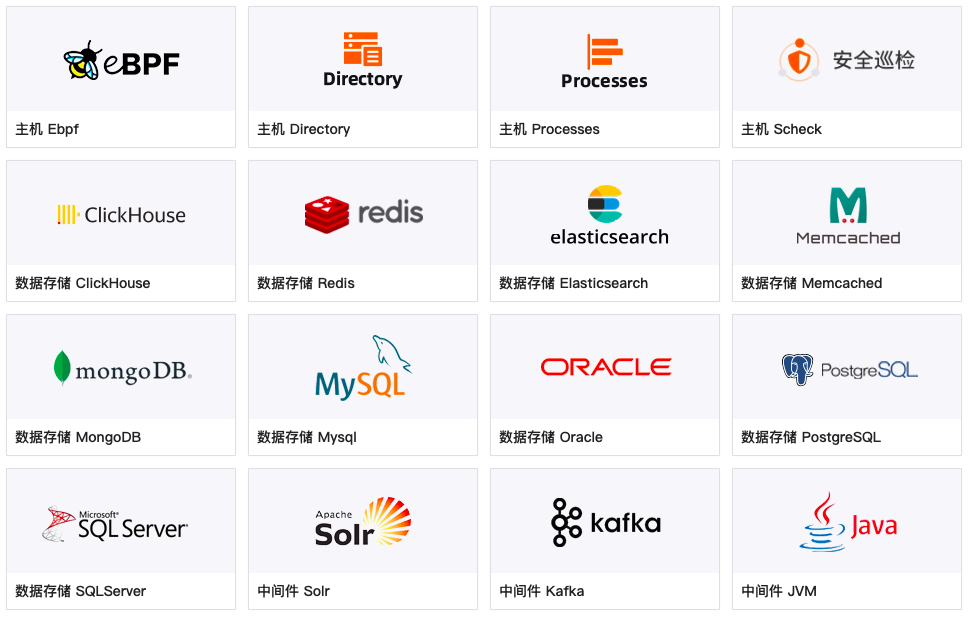

# 数据采集相关
---

## 观测云支持哪些采集器？

观测云支持官方出品的标准采集器 DataKit ，基于 DataKit 的数据采集能力，支持接入第三方数据，如[Telegraf](../datakit/telegraf.md)、[Prometheus](../datakit/prom.md)、[Statsd](../datakit/statsd.md)、[Cloudprober](../datakit/cloudprober.md)、[Scheck](../datakit/sec-checker.md) 等，同时支持[通过 Python 开发自定义采集器](../developers/pythond.md) 。

## 观测云是否支持实时采集数据？

观测云支持实时采集、处理并上报数据到观测云工作空间，支持实时数据分析、洞察和异常检测。

## 安装 DataKit 之后，观测云工作空间无数据显示？

DataKit 安装成功后，默认会采集一批主机相关的采集器，等待约1分钟，即可在观测云工作空间即可查看主机相关的数据。包括在基础设施查看主机、在指标查看已经采集的数据指标、在场景仪表板和笔记应用采集的数据指标等。

若 DataKit 安装成功后，观测云工作工作空间无数据显示，可参考文档 [如何排查无数据问题](../datakit/why-no-data.md) 。

## 如何删除安装的 DataKit ？

进入部署 DataKit 的服务器，先用指令停止 DataKit 运行，然后删除 DataKit 文件夹即可。详情可参考文档 [DataKit 服务管理](../datakit/datakit-service-how-to.md) 。

## 如何配置采集器？

DataKit 安装完成后，在 DataKit 的安装目录下有一个 `conf.d` 的文件夹，找到需要配置的采集器，进入相应的文件夹，打开对应配置文件即可进行数据采集配置。更多配置详情可参考文档 [采集器配置](../datakit/datakit-input-conf.md) 。

## 观测云支持采集哪些数据？

观测云具有全域数据采集能力，现已支持上百种数据源的采集，并且存储能力可无限进行扩展。您可以注册并登录观测云控制台，进入「集成」页面查看所有支持采集的数据源。更多配置可参考文档 [观测云集成配置](../../integrations/) 。 
