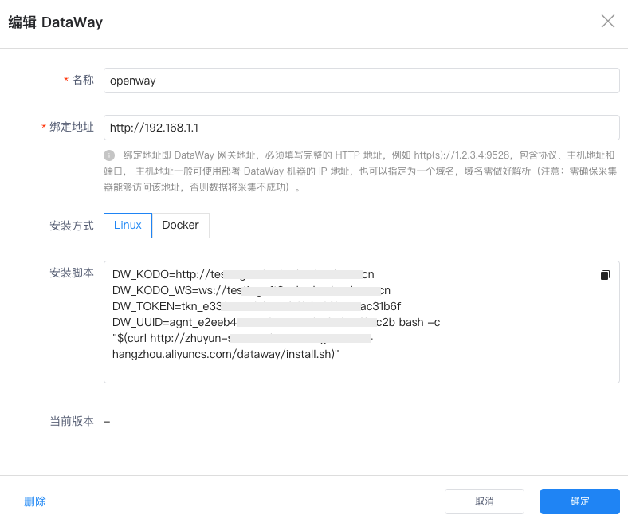
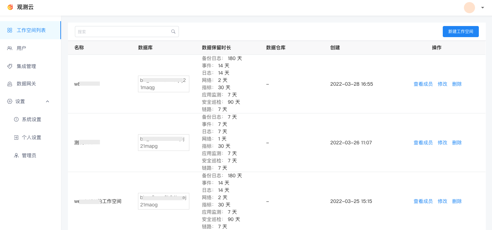

# 部署版相关
---

## 观测云有哪些部署版？

观测云根据客户应用系统的实际使用场景与特点提供了多种部署方案供选择，包括商业部署版和社区版。

- 商业部署版：支持用户在自己本地基础设施环境，或私有云环境上，安装观测云系统软件并运行服务。
- 社区版：为老师、学生、云计算爱好者等社区用户提供一个简单易得又功能完备的产品化本地部署平台，支持免费申请并下载试用。

## 观测云部署版必须添加 DataWay ？

DataWay 作为数据网关，用于收集采集上来的数据，并对数据进行清洗处理，再上报到观测云工作空间，观测云部署版需手动安装部署 DataWay 以后方可安装 DataKit 采集数据。更多详情可参考文档 [如何安装和使用 DataWay](../others/install-dataway.md) 。

## DataWay 如何升级？

在观测云管理后台「数据网关」页面，如果 DataWay 存在可升级的版本，版本信息处会有升级提示。选择需要升级的 DataWay，点击「配置」，，在弹出的编辑 DataWay 对话框，打开 DataWay 弹框，点击「获取升级脚本」，复制升级脚本到部署 DataWay 的主机上执行即可。

## DataWay 如何删除  ？

在观测云管理后台「数据网关」页面，选择需要删除的 DataWay ，点击「配置」，在弹出的编辑 DataWay 对话框，点击左下角「删除」按钮即可。

**注意：**删除 DataWay 后，还需登录部署 DataWay 网关的服务器中停止 DataWay 的运行，然后删除安装目录才可彻底删除 DataWay。

## 如何创建工作空间？

在观测云管理后台「工作空间列表」，点击右上角「新建工作空间」。更多详情可参考文档 [如何创建工作空间](../others/create-workspace-member.md) 。

## 如何创建用户？

在观测云管理后台「用户」页面，点击右上角「添加用户」。更多详情可参考文档 [如何创建用户](../others/create-user.md) 。 

## 如何查看用户都加入了哪些工作空间？

在观测云管理后台，点击「用户」，找到对应的用户，即可查看到他加入的所有工作空间。

## 观测云部署版是否支持用户注册？

观测云部署版不支持用户注册，需要在观测云管理后台创建用户和工作空间，并在工作空间添加创建的用户并授权后才可以登录到观测云部署版工作空间。

- 关于创建用户，可参考文档 [如何创建用户](../others/create-user.md)
- 关于在工作空间添加创建的用户，可参考文档 [如何创建工作空间并添加成员](../others/create-workspace-member.md)

## 观测云部署版如何移交拥有者？

观测云部署版安装完成后，可在管理后台移交拥有者权限，在观测云工作空间的成员管理不支持移交拥有者。
