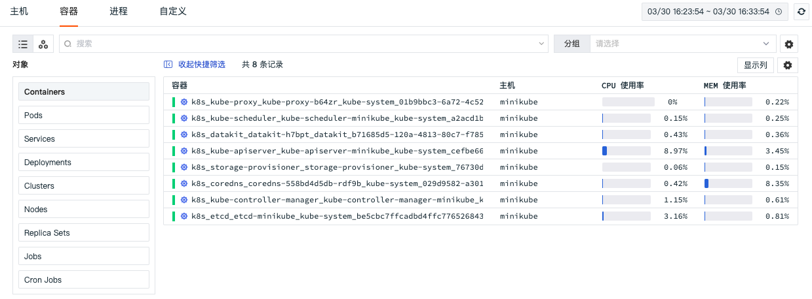
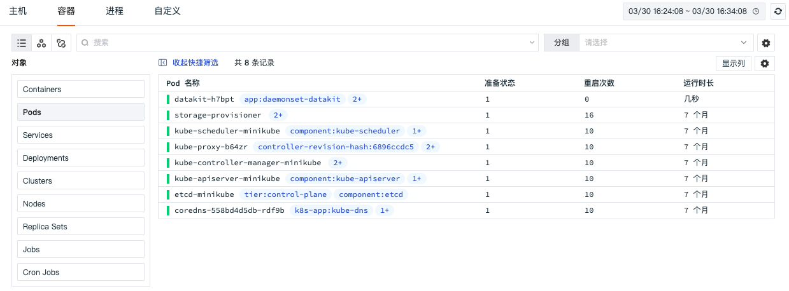
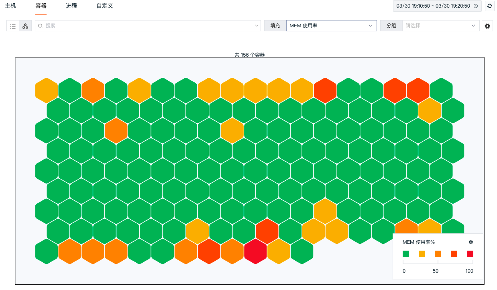
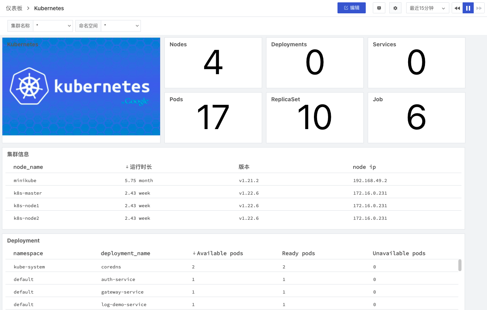
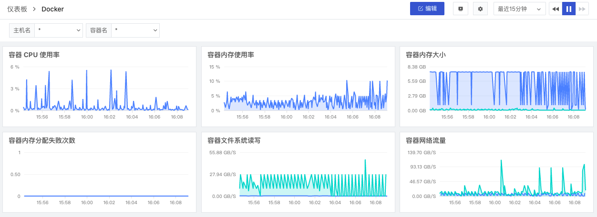

# 全面观测 K8S 微服务架构
---

## 简介

观测云支持对 Kubernetes 中各类资源的运行状态和服务能力进行监测，包括 Kubernetes Clusters、Deployments、Replica Sets、Services、Nodes 等。您可以通过 DaemonSet 方式在 Kubernetes 中安装 DataKit，进而完成对 Kubernetes 资源的数据采集。最终，在观测云中实时监测 Kubernetes 各类资源的运行情况。

## 前置条件

您需要先创建一个[观测云账号](https://www.guance.com/)。

## 方法/步骤

### Step1：下载 yaml 文件

开启 Kubernetes 资源采集前，需要使用终端工具登录到服务器执行下面的脚本命令来下载 yaml 文件。

```
wget https://static.guance.com/datakit/datakit.yaml
```


### Step2：修改 datakit.yaml 文件

编辑 datakit.yaml 文件中数据网关 dataway 的配置。

```
	- name: ENV_DATAWAY
		value: https://openway.guance.com?token=<your-token> # 此处填上你工作空间的 token
```

如下图所示：


工作空间的 token 可以在观测云工作空间的「管理」-「基本设置」获取。


### Step3：安装 yaml 文件

datakit.yaml 文件的数据网关修改完成后，使用命令`kubectl apply -f datakit.yaml`安装 yaml 文件，其中`datakit.yaml`为文件名，以您保存的文件名为准。


### Step4：查看 datakit 运行状态

yaml 文件安装完后，会创建一个 datakit 的 DaemonSet 部署，可通过命令`kubectl get pod -n datakit`查看 datakit 的运行状态。


### Step5：在观测云工作空间查看和分析采集的K8S数据

datakit 运行状态正常，即可在观测云工作空间「基础设施」-「容器」查看和分析采集的 K8S 数据。

- **Containers**



- **Pods**



- **容器蜂窝图**



## 进阶参考

### 通过配置 contrainer.conf 采集自定义指标数据

进入 DataKit 安装目录下的 `conf.d/container` 目录，复制 `container.conf.sample` 并命名为 `container.conf`。

```toml

[[inputs.container]
  endpoint = "unix:///var/run/docker.sock"

  ## Containers metrics to include and exclude, default not collect. Globs accepted.
  container_include_metric = []
  container_exclude_metric = ["image:*"]

  ## Containers logs to include and exclude, default collect all containers. Globs accepted.
  container_include_log = ["image:*"]
  container_exclude_log = []

  exclude_pause_container = true

  ## Removes ANSI escape codes from text strings
  logging_remove_ansi_escape_codes = false
  
  kubernetes_url = "https://kubernetes.default:443"

  ## Authorization level:
  ##   bearer_token -> bearer_token_string -> TLS
  ## Use bearer token for authorization. ('bearer_token' takes priority)
  ## linux at:   /run/secrets/kubernetes.io/serviceaccount/token
  ## windows at: C:\var\run\secrets\kubernetes.io\serviceaccount\token
  bearer_token = "/run/secrets/kubernetes.io/serviceaccount/token"
  # bearer_token_string = "<your-token-string>"

  [inputs.container.tags]
    # some_tag = "some_value"
    # more_tag = "some_other_value"
```

配置文件中的 `container_include_metric / container_exclude_metric` 是针对指标数据，`container_include_log / container_exclude_log` 是针对日志数据。

注意：`container_include` 和 `container_exclude` 必须以 `image` 开头，格式为 `"image:<glob规则>"`，表示 glob 规则是针对容器 image 生效。

例如，配置如下：

```
  ## 当容器的 image 能够匹配 `hello*` 时，会采集此容器的指标
  container_include_metric = ["image:hello*"]

  ## 忽略所有容器
  container_exclude_metric = ["image:*"]
```

假设有3个容器，image 分别是：

```
容器A：hello/hello-http:latest
容器B：world/world-http:latest
容器C：registry.jiagouyun.com/datakit/datakit:1.2.0
```

使用以上 `include / exclude` 配置，将会只采集 `容器A` 指标数据，因为它的 image 能够匹配 `hello*`。另外2个容器不会采集指标，因为它们的 image 匹配 `*`。

通过文档 [容器](https://www.yuque.com/dataflux/datakit/container) 可查看更多 K8S 数据采集配置。

#### 搭建 K8S 指标可视化仪表板

开启 contrainer 采集器以后，配置完指标采集image范围以后，就可以采集对应容器的 [kubelet_pod](https://www.yuque.com/dataflux/datakit/container#23ae0855)、[docker_containers](https://www.yuque.com/dataflux/datakit/container#440c5f51)、[kubernetes](https://www.yuque.com/dataflux/datakit/container#928858dc) 等指标，通过在观测云场景下搭建[仪表板](https://www.yuque.com/dataflux/doc/gqatnx)，可对指标进行可视化监控；通过在观测云监控下配置[告警](https://www.yuque.com/dataflux/doc/qxz5xz)，可通过短信、邮件、钉钉群、微信群等进行告警通知，帮助企业快速发现和定位K8S的故障问题。

1.通过使用 kubernates 指标搭建场景仪表板，支持通过观测云自带的内置视图的[系统视图](https://www.yuque.com/dataflux/doc/gyl9vv#GVo0x)一键创建。



2.通过使用 docker_containers 指标搭建场景仪表板，支持通过观测云自带的内置视图的[系统视图](https://www.yuque.com/dataflux/doc/gyl9vv#GVo0x)一键创建。



### 通过 Annotation 自发现机制采集 Pod 日志数据

目前 Annotation 配置的方式主要用来**标记被采集实体**，比如是否需要开启/关闭某实体的采集（含日志采集、指标采集等）。

通过 Annotation 来干预采集器配置的场景比较特殊，比如在容器（Pod）日志采集器中，如果禁止采集所有日志（在容器采集器中 `container_exclude_log = [image:*]`），但只希望开启特定某些 Pod 的日志采集，那么就可以在特定的这些 Pod 上追加 Annotation 加以标记：

```yaml
apiVersion: apps/v1
kind: Deployment
metadata:
  name: testing-log-deployment
  labels:
    app: testing-log
spec:
  template:
    metadata:
      labels:
        app: testing-log
      annotations:
        datakit/logs: |    # <-------- 此处追加特定 Key 的 Annotation
          [
            {
              "source": "testing-source",   # 设置该 Pod 日志的 source
              "service": "testing-service", # 设置该 Pod 日志的 service
              "pipeline": "test.p"          # 设置该 Pod 日志的 Pipeline
            }
          ]
	...
```

#### 搭建 K8S 日志自定义查看器

通过 datakit yaml 中添加 Annotation，就可以采集 Pod 的[日志数据](https://www.yuque.com/dataflux/datakit/container#ecf264fa)，通过在观测云场景下搭建[日志自定义查看器](https://www.yuque.com/dataflux/doc/uynpbs)，可对日志进行可视化关联查询，帮助企业快速发现和定位K8S的故障问题。


### 通过配置选举为多个集群设置不同的命名空间

当集群中只有一个被采集对象（如 Kubernetes ），但是在批量部署情况下，多个 DataKit 的配置完全相同，都开启了对该中心对象的采集，为了避免重复采集，我们可以开启 DataKit 的选举功能。假设有两个K8S集群，可以在开启选举的前提下，为两个集群设置不同的命名空间。更多可参考文档 [DataKit 选举支持](https://www.yuque.com/dataflux/datakit/election) 。

## 更多参考

更多关于容器和 K8S 的配置方法和指标说明可参考：
### [Kubernetes 环境下的配置](https://www.yuque.com/dataflux/datakit/k8s-config-how-to) 
### [Kubernetes 扩展指标采集](https://www.yuque.com/dataflux/datakit/kubernetes-x)
### [Kubernetes 集群中自定义 Exporter 指标采集](https://www.yuque.com/dataflux/datakit/kubernetes-prom)

更多关于K8S的最佳实践参考：
### [Nginx Ingress可观测最佳实践](https://www.yuque.com/dataflux/bp/ingress)
### [基于Istio实现微服务可观测最佳实践](https://www.yuque.com/dataflux/bp/istio)


---

观测云是一款面向开发、运维、测试及业务团队的实时数据监测平台，能够统一满足云、云原生、应用及业务上的监测需求，快速实现系统可观测。**立即前往观测云，开启一站式可观测之旅：**[www.guance.com](https://www.guance.com)
