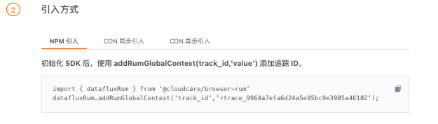

# 开启端到端的用户访问追踪（RUM）
---

## 简介

在全民互联网时代，用户访问Web、小程序、Android、iOS等媒介的时间越来越长，努力赚取用户注意力的应用越来越多，产品与服务的更新也越来越频繁。在这样的大环境下，详细了解用户从哪里来，看了哪些页面，停留多长时间，访问速度快慢……不仅有利于挖掘每一个用户行为背后的真实需求，稳定并提升现存流量的转化率，还能反哺产品与服务的双重优化，真正实现用户增长和业绩提升。

“观测云” 提供了Web、Android、iOS和小程序的用户访问数据监测。完成应用接入后，即可在工作台的「用户访问监测」快速查看和分析各类应用的用户浏览行为及应用相关的性能指标，用于衡量网站及应用的程序的最终用户体验效果。

## 前置条件

- 安装 DataKit（[DataKit 安装文档](../../datakit/datakit-install.md)）
- 将 DataKit 部署成公网可访问（[RUM 配置文档](../../integrations/rum.md)）
- 操作系统支持：全平台

## 方法/步骤

DataKit 默认支持用户访问监测数据的接入，您仅需要完成应用接入，即可通过“观测云” 工作平台实时观测各类应用的用户浏览行为及应用相关的性能指标。

### Step1: 新建任务

1. 登录 “观测云” 控制台，进入「用户访问监测」页面，点击右上角「新建应用」，在新窗口输入「应用名称」，点击「创建」即可创建新的用户访问监测任务。
1. 创建任务后，您需要依据选择的「应用类型」完成下方对应的配置，即可开启相关应用的用户访问监测。


### Step2: 配置应用接入

以配置Web应用的”同步载入“为例，配置步骤如下：

a.  复制当前页面的代码，并依据要求修改当前代码所需的配置信息。如：修改脚本 datakitOrigin 地址为  DataKit 地址（安装DataKit的主机地址）


b.  进入监测的目标应用，在对应页面HTML中的第一行添加所复制的代码

c.  修改完成后保存退出

更多详情可参考：

- 配置 [Web 应用接入](../../real-user-monitoring/web/app-access.md)
- 配置 [Android 应用接入](../../real-user-monitoring/android/app-access.md)
- 配置 [iOS 应用接入](../../real-user-monitoring/ios/app-access.md)
- 配置 [小程序应用接入](../../real-user-monitoring/miniapp/index.md)

### Step3: 查看用户访问数据

在观测云工作空间「用户访问监测」，点击任意一个应用，即可通过「查看器」对该应用相关的用户访问行为、会话、页面性能、资源勤秋、异常错误等数据进行查看。

- Web监测：包含页面性能、资源加载、JS错误等多个场景；查看器支持页面、资源、JS错误等数据的快速检索和筛选查看。
- Android监测：包含页面性能、资源加载等多个场景；查看器支持页面、资源、崩溃、卡顿等数据的快速检索和筛选查看。
- iOS监测：包含页面性能、资源加载等多个场景；查看器支持页面、资源、崩溃、卡顿等数据的快速检索和筛选查看。
- 小程序监测：包含页面性能、资源加载、请求加载、JS错误等多个场景；查看器支持页面、资源、请求、JS错误等数据的快速检索和筛选查看。


## 进阶参考

### 数据采样

观测云”支持自定义数据采样率，控制数据上报体量，优化数据存储和采集效率。您可以在配置应用接入时，通过 resourceSampleRate（资源类数据采样率）和 sampleRate（指标类数据采样率）自定义数据收集百分比。

下面将以Web 应用为例，介绍如何收集90％的Web应用用户访问数据。

1. 在观测云控制台进入「用户访问监测」，通过「新建应用」获取 Web应用的三种方式：NPM 接入、同步载入和异步载入。
1. 以“同步载入”为例，在代码中加入`sampleRate: 90`，然后复制粘贴到需要接入的页面HTML的第一行，即可按90%的比例采集Web应用的用户访问数据。

```
<script src="https://static.guance.com/browser-sdk/v2/dataflux-rum.js" type="text/javascript"></script>
<script>
  window.DATAFLUX_RUM &&
    window.DATAFLUX_RUM.init({
      applicationId: 'appid_6666666666666666666',
      datakitOrigin: '<DATAKIT ORIGIN>', // 协议（包括：//），域名（或IP地址）[和端口号]
      sampleRate: 90,
      env: 'production',
      version: '1.0.0',
      trackInteractions: true
    })
</script>
```

其他应用采样可参考：

- IOS采样设置可参考[IOS 应用接入](../../real-user-monitoring/ios/app-access.md)。
- Android采样设置可参考[Android 应用接入](../../real-user-monitoring/android/app-access.md)。
- 小程序采样设置可参考[小程序应用接入](../../real-user-monitoring/miniapp/index.md)。

### 生成指标

为了便于您依据需求设计并实现新的技术指标。“观测云” 支持基于当前空间内的现有数据生成新的指标数据。通过选择「用户访问检测」-「生成指标」功能，参考以下步骤可以帮助您生成新的用户访问数据：


**Step 1**: 数据筛选。筛选出当前空间已有的全部/单个应用数据来源，并基于此数据源开始生成新的数据（**“ * ”表示为全部数据来源）。**

**Step 2:** 数据查询。基于选定的数据源，您可以对现有数据添加筛选和聚合表达式，请求产生新的指标结果和数据集合。

- 聚合方法：包含Avg（取平均值）、Min（取最小值）、Max（取最大值）、Count（取数据点数）、p75（统计指定字段75%的值，需选择聚合的字段）、p95（统计指定字段95%的值，需选择聚合的字段）、p99（统计指定字段99%的值，需选择聚合的字段）
- 样本指标：设置的数据生成的样本指标，即通过对样本指标的查询和聚合产生新的指标结果
- 维度：按照所选对象进行数据聚合，即对数据请求中的每一个所选对象都生成一个统计值
- 筛选：支持对现有标签数据添加一个/多个筛选过滤条件，并对同一行筛选条件添加“并且“ (and)、“或者”(or)关系
- 时间范围：生成指标数据的时间粒度，默认为15分钟，即15分钟内某数据统计展示的效果。

**Step 3:** 生成指标。对生成指标的方式和结果进行设置，包括生成指标的周期、新生成指标的标签名称和指标集名称。

- 频率：生成指标的执行周期，默认1分钟，即每1分钟生成一次新的指标数据
- 指标集：设置指标存放的指标集的名称
- 指标：设置指标的名称，其中指标名称不允许重复，可添加多个指标

**Step 4:** 完成生成规则的填写后，点击「确定」即可完成生成指标规则并开启数据采集。

所有已添加的规则都将展示在「生成指标」的界面中，用户可进行「编辑」「删除」「启用/禁用」和「查看指标」


更多详情可参考：[用户访问监测-生成指标](../../real-user-monitoring/generate-metrics.md)

### Souremap

应用在生产环境中发布的时候，为了防止代码泄露等安全问题，一般打包过程中会针对文件做转换、压缩等操作。Souremap 作为一类信息文件，记录了转换压缩后的代码所对应的转换前的源代码位置，构建了处理前以及处理后的代码之间的一座桥梁，方便定位生产环境中出现 bug 的位置。"观测云" 为 Web 应用程序提供 Sourcemap 功能，支持还原混淆后的代码，方便错误排查时在源码中debug，及时帮助用户更快解决问题。


**Step 1: **开始使用 Sourcemap前，您需要将应用对应的map文件上传到 “观测云”，“观测云” 会根据拿到的 map文件自动完成映射还原。具体步骤如下：

1.**配置 Javascript bundler：用来映射转换、压缩后的 js 代码。**以使用 webpackJS 举例，使用内置插件 `SourceMapDevToolPlugin` 生成源映射，在下面查看如何在 `webpack.config.js` 文件中配置它：

```javascript
// ...
const webpack = require('webpack');
module.exports = {
  mode: 'production',
  devtool: false,
  plugins: [
    new webpack.SourceMapDevToolPlugin({
      noSources: false,
      filename: '[file].map'
    }),
    // ...
  ],
  optimization: {
    minimize: true,
    // ...
  },
  // ...
};

```

注意：如果用的是 TypeScript ，在配置 `tsconfig.json` 时设置 `compilerOptions.sourceMap` 为 `true`。

_假设如下 error_stack：_

```shell
ReferenceError
at a.hideDetail @ http://localhost:8080/static/js/app.7fb548e3d065d1f48f74.js:1:1037
at a.showDetail @ http://localhost:8080/static/js/app.7fb548e3d065d1f48f74.js:1:986
at <anonymous> @ http://localhost:8080/static/js/app.7fb548e3d065d1f48f74.js:1:1174
```

_需要转换的路径是 _`_/static/js/app.7fb548e3d065d1f48f74.js_`_，与其对应的 sourcemap 路径为 _`_/static/js/app.7fb548e3d065d1f48f74.js.map_`_，那么对应压缩包解压后的目录结构如下：_

```shell
static/js/app.7fb548e3d065d1f48f74.js.map
```

_转换后的 error_stack_source :_

```shell
at a.hideDetail @ webpack:///src/components/header/header.vue:94:0
at a.showDetail @ webpack:///src/components/header/header.vue:91:0
at <anonymous> @ webpack:///src/components/header/header.vue:101:0
```

变量说明：

- `＜app_id＞`:对应 RUM 的 applicationId
- `＜dea_address＞`: DCA 服务的地址，如 http://localhost:9531
- `＜sourcemap_path＞`:待上传的 sourcemap 压缩包文件路径
- `＜env＞`：对应 RUM 的 env
- `＜version＞`：对应 RUM 的 version

2.**sourcemap 打包压缩：得到 zip 格式文件。**将 sourcemap 文件压缩打包成 zip，命名格式为` <app_id>-<env>-<version>.zip` ，并保证该压缩包解压后的文件路径与 `error_stack` 中 URL 的路径一致。

```shell
zip -q -r <app_id>--.zip sourcemap文件目录
```

3.**上传：zip 文件上传至 datakit。**可以手动上传至 datakit 相关目录， `<Datakit 安装目录>/data/rum/`，这样就可以对上报的 error 数据自动进行转换，并追加 error_stack_source 字段至该指标集中。也可以使用 http 接口上传和删除该文件，前提是开启 DCA 服务。

上传：

```shell
cur1 －x POST ＇<dca_address>/v1/rum/sourcemap?app_id=<app_id>＆env=＆version=<versio
```

删除：

```shell
cur1 －X DELETE ＇<dca_address>/v1/rum/sourcemap?app_id=<app_id>＆env=＆version=<vers
```

**Step 2: **通过访问“观测云”「用户访问监测」，在页面性能数据（view) 和会话数据（session） 详情页面，点击「错误」数据，通过「查看 sourcemap」您可以及时发现错误堆栈信息（真实的代码发生错误的地方）。


**注意事项：**

- 该转换过程，只针对 error 数据。
- 当前只支持 js 的 sourcemap 转换。
- sourcemap 文件名称需要与原文件保持一致，如果未找到对应的 sourcemap 文件，将不进行转换。
- 通过接口上传的 sourcemap 压缩包，不需要重启 DataKit 即可生效，但如果是手动上传，需要重启 DataKit ，方可生效。

### 自建追踪

“观测云” 支持你通过「用户访问监测」新建追踪任务，对自定义的链路追踪轨迹进行实时监控。通过预先设定链路追踪轨迹，可以集中筛选链路数据，精准查询用户访问体验，及时发现漏洞、异常和风险。

**Step 1: **新建追踪

在观测云工作空间的「用户访问监测」中，点击「应用名称」进入指定应用，即可通过「追踪」新建追踪轨迹。

进行「新建追踪」时，您需要设定名称和字段，并在生成追踪ID后完成引入配置

- 追踪名称：当前追踪任务的名称。支持中英文混写，支持下划线作为分隔符，不支持其他特殊字符，且最多支持64个字符串
- 标签：定义链路追踪字段。支持通过下拉框选择当前应用下的标签（ key:value )，支持多选
- 追踪ID：点击「生成追踪ID」即可新建追踪轨迹，并由系统生成的唯一追踪ID标识。


**Step 2: **配置引入方式

生成追踪ID后，需要根据追踪ID信息在应用中引入代码。以Web应用的”NPM引入“为例，配置步骤如下：<br />a.  复制当前页面的代码。<br />b.  初始化 SDK 后，使用所复制的代码添加追踪ID<br />c.  修改完成后保存退出


