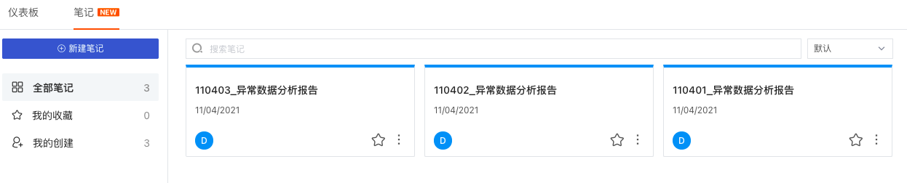

# 自定义场景和监控告警
---

## 简介

数字化时代，每个组织每时每刻都在产生大量数据，想要保障业务系统的稳定就越来越依赖于数据，所以需要去收集这些数据去观测整个系统。如何持续优化业务服务质量，并建设质量体系变得尤为重要。越来越多的企业通过技术手段统一运维、开发、测试的视角发现服务异常，持续优化业务可用性与用户体验。

 “观测云” 提供根据不同的视角构建满足不同业务的「场景」。仪表板支持添加多种可视化图表进行数据展示，帮助用户直观地跟踪，分析和显示关键性能指标，监控整体的运行状况。

“观测云” 拥有强大的异常监测能力，不仅提供了包括Docker、Elasticsearch、Host等一系列监控模版，还支持自定义监控器，配合告警通知功能，可及时发现帮助您快速发现问题、定位问题、解决问题。同时，“观测云”支持SLO（Service Level Objective）监控，精准把控服务水准和目标。

本文主要介绍在“观测云” 中如何快速使用场景和监控。

## 前置条件

您需要先创建一个[观测云账号](https://www.guance.com)，并在您的主机上[安装 DataKit](../../datakit/datakit-install.md)，开启相关集成的运行，进行数据采集。

## 使用场景方法步骤

### Step1: 快速创建您的仪表板

在场景下，可以创建多个仪表板来构建数据洞察场景，支持通过关键字搜索仪表板，支持为仪表板添加可视化图表进行数据分析，支持从“我的收藏”、“导入项目”、“我的创建”和“经常浏览”来快速过滤查找对应的仪表板。

创建仪表板前，您首先需要明确创建这个“[仪表板]()”的目的。一个好的仪表板可以帮助您的团队专注在正确的事上。制作一个仪表板，我们需要去挖掘团队最需要去关注、最经常要使用的信息，将这些信息归纳整理成一个个仪表板。

#### 1、从现有仪表板复制

要快速创建一个仪表板，您可以在“**场景**” > “**仪表板”**列表页面，找到一个您需要的类似的仪表板，进入仪表板后，在右上角的齿轮图标中找到“**复制仪表板**”。对这个复制出来的仪表板进行的任何修改，不会影响原**仪表板**。

#### 2、从内置视图中克隆

要快速创建一个仪表板，您可以在**内置视图**中，找到某个内置集成视图，点击“**查看**”按钮打开视图，可以在打开的视图页面右上解看到“**克隆**”按钮。克隆后，您可以在“**场景**” > “**仪表板**”列表中看到您刚刚克隆出来的“**仪表板**”，对这个克隆出来的仪表板进行的任何修改，不会影响原**内置视图**。

#### 3、创建新的仪表板

您也可以选择全新创建一个仪表板，在“**场景**” > “**仪表板**” 页面的左上角，有一个“**新建仪表板**”按钮，点击可以创建一个新的仪表板，此处也可以选择一个“内置视图”，以这个内置视图为模板创建一个新的仪表板出来，效果等同上述的“**从内置视图中克隆**”，也可以创建一个空白的“**仪表板**”，从零开始构建一个“**仪表板**”。

#### 种类丰富的图表组件：

“观测云” 内置20余种标准的可视化图表：包括时序图、概览图、饼图、柱状图、排行榜、仪表盘、散点图、气泡图、表格图、中国地图、世界地图、蜂窝图、日志流图等，可快速根据不同业务需求快速创建不同的监控视图看板，满足对数据个性化、全面的展示需求。

### Step2: 快速创建您的笔记

在场景下，可以创建多个笔记来进行总结报告，支持插入实时可视化图表进行数据分析，支持插入文本文档进行说明，结合图表和文档进行数据分析和总结报告；支持与工作空间所有成员共享笔记，留存异常数据分析，帮助回溯、定位、解决问题。

进入场景后，在「笔记」，点击「+新建笔记」。

输入笔记标题，使用文本图表输入文本，使用其他图表展示指标的可视化数据分析。

- 关于文本输入，可参考文档 [如何撰写文本文档](../../scene/visual-chart/text.md) 。
- 关于图表制作，可参考文档 [可视化图表](../../scene/visual-chart/index.md) 。

笔记完成后，点击“保存笔记”，即可完成笔记的创建。

在导航栏「设置」，笔记支持「导出笔记JSON」、「导入笔记JSON」、「导出为PDF」以及「保存快照」。

点击「导出笔记JSON」即可导出对应的 json 文件至本地，打开 json 文件即可看到“模板代码”。

点击「导入笔记JSON」即可导入模板 json 文件至对应的笔记。

### Step3: 快速创建您的查看器

场景“查看器”为您提供了可快速搭建的日志查看器，您可以与空间成员共同搭建基于自定义的日志查看器，定制化您的查看需求，还可以将制作完成的查看器导出分享给他人，共享查看器模版。

进入「场景」-「查看器」，点击「+新建查看器」并完成自定义查看器名称及标签后，即可创建一个新的查看器。

- 查看器名称：工作空间内查看器名称不可重复，且支持最大长度 64个字符
- 自定义标签：自定义的可识别语言符号，用于将仪表板和查看器分组。”观测云“的仪表板与查看器共用一套标签数据，点击「标签」即可搜索对应的查看器

在新创建的查看器，选择日志的数据范围后进行编辑，包括：3个时序图图表、1个快速筛选、1个数据列表。

- 时序图图表：用于显示数据在相等时间间隔下的趋势变化，同时可用来分析多组指标数据之间的作用及影响。支持自定义图表查询，并展示为折线图、面积图或柱状图，详情可参考[图表查询](../../scene/visual-chart/chart-query.md)和[时序图](../../scene/visual-chart/timeseries-chart.md)。
- 快捷筛选：默认显示 主机、状态 两个字段；支持用户自定义快捷筛选列表；
- 数据列表：默认配置 时间、内容 两个字段，支持用户自定义显示列表字段；

更多详情可参考文档 [快速搭建自定义日志查看器](../../scene/explorer/custom-explorer.md) 。

查看器创建完成后，您可以通过以下功能查询和分析日志数据，帮助您快速定位问题。

- 搜索：基于字段标签、日志文本进行关键词搜索、字段筛选、关联搜索、模糊搜索
- 分组：基于字段标签，展示可视化趋势
- 快捷筛选：基于字段标签，快捷筛选日志数据
- 格式化配置：隐藏敏感日志数据内容或者突出需要查看的日志数据内容，还可以通过替换原有日志内容进行快速筛选。
- 显示列：自定义数据列表显示列
- 设置按钮：设置日志多行查看和导出CSV
- 复制日志内容：使用“鼠标悬停”至日志内容，展开查看日志的全部内容，点击“复制”按钮可把整条日志内容复制到粘贴板。展开时若可以系统会将该条日志JSON格式化，若不可以则正常展示该日志内容

#### 格式化配置

格式化配置可以让您隐藏敏感日志数据内容或者突出需要查看的日志数据内容，还可以通过替换原有日志内容进行快速筛选。

在查看器的格式化配置，添加映射，输入以下内容，点击保存，即可把含“48043”的原日志内容替换成您想显示的格式。

- 字段：如内容
- 匹配方式：如match（目前支持`=`、`!=`、`match`、`not match`）
- 匹配内容：如48043
- 显示为内容：如xxxxxx

注意：仅管理员及以上可进行查看器格式化配置。

## 使用监控方法步骤

### Step1: 快速创建您的监控器

#### 1、从模版新建

在「监控器」中，选择「+ 从模版新建」，即可添加指定官方监控模版至当前空间。目前支持主机、Docker、Elasticsearch、Redis、阿里云 RDS、阿里云 SLB、Flink 监控模版，无需手动配置，开箱即用。

#### 2、新建监控器

在监控器中，支持通过「+新建监控器」添加新的监控器，并自定义触发规则。

- [阈值检测](../../monitoring/monitor/threshold-detection.md)：基于设置的阈值对指标数据进行异常检测，当数据达到阈值时，触发告警并通知用户。
- [日志检测](../../monitoring/monitor/log-detection.md)：基于工作空间内的日志数据进行异常检测，多适用于 IT 监控场景下的代码异常或任务调度检测等。
- [突变检测](../../monitoring/monitor/mutation-detection.md)：基于历史数据对指标的突发反常表现进行异常检测，多适用于业务数据、时间窗短的场景。
- [区间检测](../../monitoring/monitor/interval-detection.md)：基于动态阈值范围对指标的异常数据点进行检测，当数据超出设定的区间范围后，产生告警并通知用户，多适用于趋势稳定时间线的场景。
- [水位检测](../../monitoring/monitor/water-level-detection.md)：基于历史数据对指标的持续反常表现进行异常检测，可避免突发检测的毛刺告警。
- [安全巡检](../../monitoring/monitor/security_checker.md)：基于工作空间内安全巡检数据进行异常检测，用于监控工作空间内系统、容器、网络等存在的漏洞、异常和风险。
- [应用性能指标检测](../../monitoring/monitor/application-performance-detection.md)：基于工作空间内「应用性能监测」的指标数据，当指标到达设置的阈值范围后触发告警。
- [用户访问指标检测](../../monitoring/monitor/real-user-detection.md)：基于工作空间内「用户访问监测」的指标数据，当指标到达设置的阈值范围后触发告警。
- [进程异常检测](../../monitoring/monitor/process-detection.md)：基于工作空间内的进程数据，支持对进程数据的一个或多个字段类型设置触发告警。
- [可用性监测数据检测](../../monitoring/monitor/usability-detection.md)：基于工作空间内的云拨测数据，通过对一定时间段内拨测任务产生的指定数据量设置阈值范围后触发告警。
- [网络数据检测](../../monitoring/monitor/network-detection.md)：用于监控工作空间内「网络性能监测」的指标数据，通过设置阈值范围，当指标到达阈值后触发告警。

### Step2: 快速创建您的告警配置

“观测云”支持对分组下的全部监控器配置告警。在「监控器」列表中，点击「分组名称」，可进行配置通知成员、告警沉默时长操作。

#### 1、通知对象

告警通知支持选择不同的通知类型，对多个对象发送告警通知。“观测云”支持多种通知类型，包括「空间成员」、「邮件组」、「钉钉机器人」、「企业微信机器人」、「飞书机器人」和「Webhook自定义」。

- 空间成员：邮件通知，通过在「管理」-「成员管理」，添加通知对象，可参考此文档中的「告警示例」。
- 邮件组：邮件通知，一个邮件组可添加多个空间成员，通过在「管理」-「[通知对象管理](../../management/notify-object.md) 」，添加通知对象。
- 钉钉机器人、企业微信机器人、飞书机器人：群通知，通过在「管理」-「[通知对象管理](../../management/notify-object.md)」，添加通知对象。
- Webhook自定义：用户自行设定，通过在「管理」-「[通知对象管理](../../management/notify-object.md)」，添加通知对象。
- 短信：短信通知，一个短信组可以添加多个空间成员，通过在「管理」-「[通知对象管理](../../management/notify-object.md)」，添加通知对象。“观测云”免费版无短信通知，其他版本短信通知0.1 元 / 条，按天计费，没有免费额度。

**注意：邮件、钉钉、微信、飞书、短信告警通知都是每分钟合并了发送，并不是产生后立刻发送，会存在约一分钟的延迟。**

#### 2、告警沉默

若同一个事件不是非常紧急，但是告警通知频率高，可以通过设置告警沉默的方式减少告警通知频率。在「监控器」，点击右侧「告警配置」，选择告警沉默时间，点击「确定」。

**注意：告警沉默后事件会继续产生，但是告警通知不会再发送，产生的事件会存入事件管理**

### Step3: 快速创建您的SLO

“观测云”支持通过「监控器」的 SLO 模块，自定义创建新的 SLO 任务。

**注意：**SLO配置一旦保存，SLO名称、目标、检测周期将不可更改。

| **字段** | **说明** |
| --- | --- |
| 名称 | SLO任务名称。最多支持64个字符输入。 |
| 目标 | SLO目标百分比（0-100%），支持选定两个目标，包括“目标”和“最低目标”， - 目标：当 SLO百分比 < 目标百分比，且 >= 最低目标百分比时，被认定为 **不健康**SLA - 最低目标：当 SLO百分比 < 最低目标百分比时，被认定为 **不达标 **SLA  |
| SLI | 衡量系统稳定性的指标。支持自定义添加一个或多个监控器作为测量指标 |
| 异常通知对象 | 告警通知对象，支持空间成员、邮件组、企业微信机器人、钉钉机器人、飞书机器人、短信等通知方式，详情可参考[告警设置](../../monitoring/alert-setting.md) |
| 通知沉默 | 若同一个事件不是非常紧急，但是告警通知频率高，可以通过设置通知沉默的方式减少通知频率。**注意：通知沉默设置后事件会继续产生，但是通知不会再发送，产生的事件会存入事件管理** |
| 检测频率 | SLO检测频率，即以一定时间范围为周期，监测SLO任务中监控器是否出现异常事件。目前支持5分钟、10分钟两种检测频率。 |
| 描述 | 描述性信息，最多支持256个字符。 |
