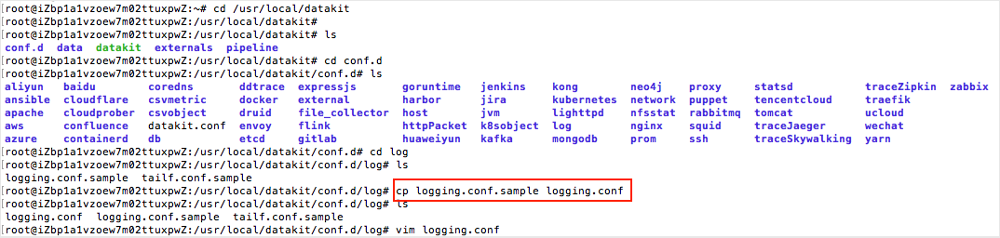
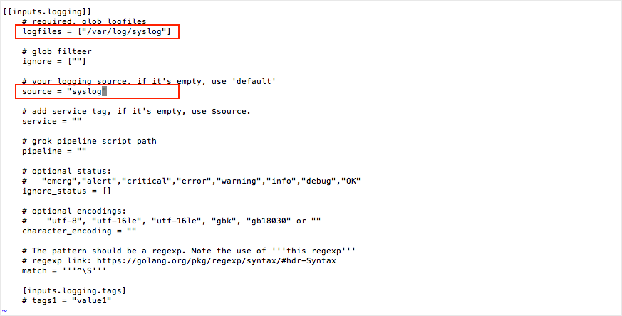
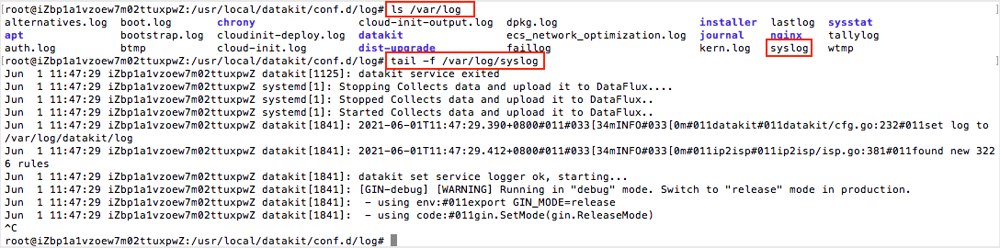
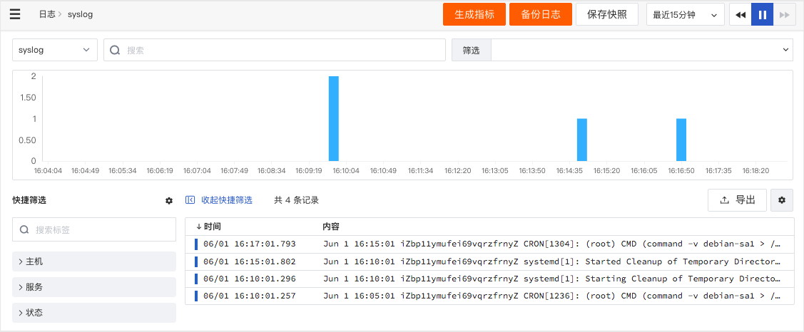
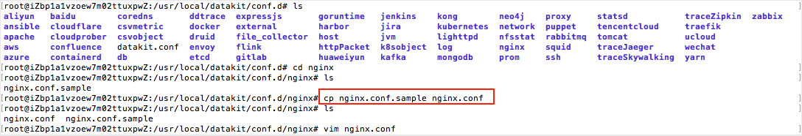
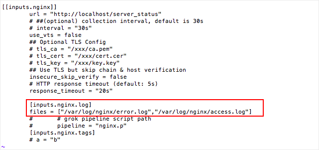
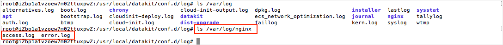
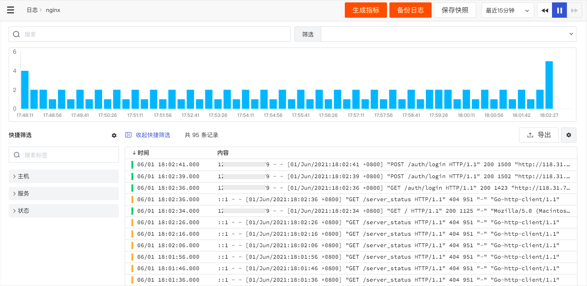

# 开启日志采集
---

观测云支持自定义日志采集和标准日志采集。

- 自定义日志采集：进入 DataKit 安装目录下的 conf.d/log 目录，复制 logging.conf.sample 并命名为 logging.conf进行配置。配置完成后，重启 DataKit 即可生效。
- 标准日志采集：通过开启观测云支持的日志采集器，如[Nginx](../../integrations/webservice/nginx.md)、[Redis](../../integrations/datastorage/redis.md)、[ElasticSearch](../../integrations/datastorage/elasticsearch.md)等，可以一键开启日志采集。

## 开启自定义日志采集

1.你可以进入 DataKit 安装目录下的 `conf.d/log` 目录，复制 `logging.conf.sample` 并命名为 `logging.conf`。

（注意：开启的采集器必须是.conf的文件。）

2.使用命令`vim logging.conf`打开编辑`logging.conf`，修改`logfiles`地址（默认`logfiles = ["/var/log/syslog"]`），添加`source`来源为“syslog”。

（注意：按 i 可以进入编辑模式，按 esc 退出编辑模式，输入 :wq 保存退出编辑模式，输入 :q 不保存退出编辑模式。）

`logfiles`的地址可通过`ls /var/log`查看是哪个目录，并通过`tail -f /var/log/syslog`确认该目录下是否有日志。更多配置可参考文档 [日志采集器](../../datakit/logging.md) 。

配置完成后，可以通过`datakit --restart`重启DataKit即可生效。

3.自定义日志采集器配置完成，DataKit重启后等一段时间，即可在“观测云”工作空间查看到对应的日志数据。点击「日志」即可查看采集上来的「syslog」日志。

## 开启标准日志采集

1.开启标准日志采集将以Nginx为例，进入 DataKit 安装目录`/usr/local/datakit`下的 `conf.d/nginx` 目录，复制 `nginx.conf.sample` 并命名为 `nginx.conf`。

（注意：开启Nginx日志采集前，您需要在主机上搭建一个Nginx的项目环境）

2.在`nginx.conf`中，将 `files` 打开，并写入 `NGINX` 日志文件的绝对路径。

`files = ["/var/log/nginx/error.log","/var/log/nginx/access.log"]`

Nginx的`files`的地址可通过`ls /var/log`查看，[了解更多Nginx日志数据采集配置](../../integrations/webservice/nginx.md)。

配置完成后，可以通过`datakit --restart`重启DataKit即可生效。

3.Nginx日志采集器配置完成，DataKit重启后等待一段时间，即可在“观测云”工作空间查看Nginx日志数据。

日志数据采集以后，我们可以通过观测云提供的日志 Pipeline 工具对日志进行切割，使日志的数据更容易被搜索和关联分析，关于如何开启并使用日志 Pipeline 工具，可参考文档 [如何快速分析 Nginx 日志](../basic-introduction/nginx-collection-analysis.md) 。

另外 DataKit 安装采集数据，我们还可以为采集的数据[搭建场景仪表板](custom-dashboard.md)，若需要进行数据可视化分析并进行监控告警，详情可参考文档 [如何快速使用场景和监控](../basic-introduction/scene-alert.md) 。