# 查看器检索
---

在各个查看器进行数据检索的过程中，我们可以使用多种搜索和筛选方式，例如模糊搜索、关联搜索、正向筛选、反向筛选等等，下面我们进行针对性的详细说明。

## 搜索说明

### 关键字搜索

查看器中支持在搜索栏输入关键字进行检索，查询结果中会对输入的关键字高亮显示，如下图所示。

### 通配符搜索

查看器中支持输入通配符进行模糊匹配搜索，如在日志搜索栏输入 `global*` ，返回关键字中含“global” 的日志数据， global 后面可以是任意数目的字符，如图所示。

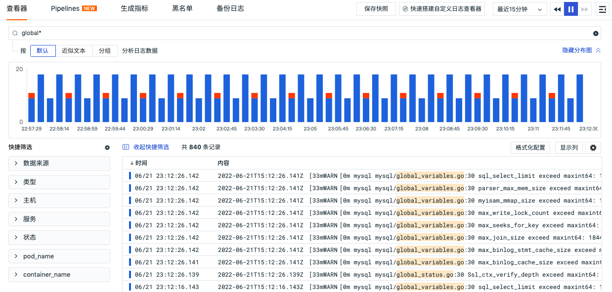

### 关联搜索

查看器中支持按照 AND/OR/NOT 逻辑进行关联搜索，可以与通配符搜索联合使用。

| 逻辑关系 | 说明                                                         |
| -------- | ------------------------------------------------------------ |
| a AND b  | 返回结果需同时包含a和b，输入的关键字越多，数据匹配的范围就越精准。其中`AND`可以用 `空格` 或者 ` , `代替，即 `a,b` = `a b` = `a AND b` |
| a OR b   | 返回结果需包含 a 或者 b 的任意一个关键字                     |
| NOT c    | 返回结果需要不包含关键字 c                                   |

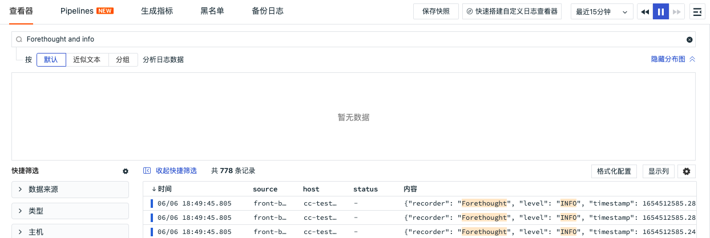

## JSON 搜索

>前提： 工作空间需要在 `2022年6月23日` 后创建

目前 Json 搜索功能只对日志查看器开放，使用说明如下：

- 默认对 message 的内容进行精确检索，同时需要 message 是 json 格式，其他格式的日志内容不支持该检索方式。
- Json 搜索格式为： `@key:value`，若为多层级 json 可用 “.” 承接，即`@key1.key2:value`，如图所示。

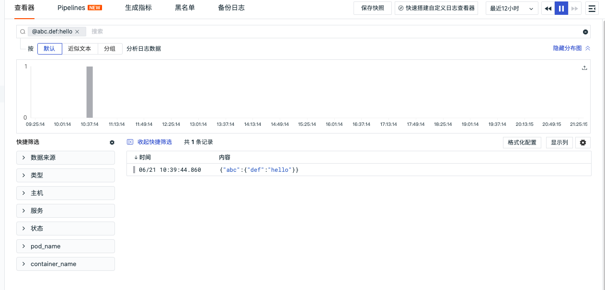

## 字段筛选

在查看器中，可针对 `标签/属性` 进行值的筛选，支持三种筛选方式，分别为：正向筛选、反向筛选和模糊匹配。

- 可通过点击下拉进行筛选，或按规定的格式手动输入标签内容，按回车键进行筛选。

- 正选、反选、模糊匹配分别放在三个标签下拉中，每个标签之间都为 `and` 关系。

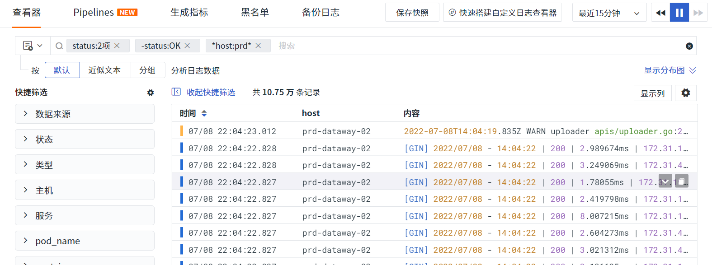

### 正向筛选

通过 `key:value` 的形式进行正向筛选搜索，例如：在日志查看器中搜索 `status:error` ，即返回所有状态属于 error 的日志数据。

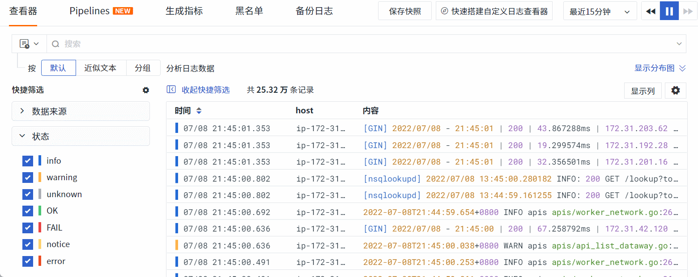

### 反向筛选

通过 `-key:value` 的形式进行反向筛选搜索。例如：在日志查看器中搜索 `-status:info` ，即返回所有状态 **不等于** info 的日志数据。

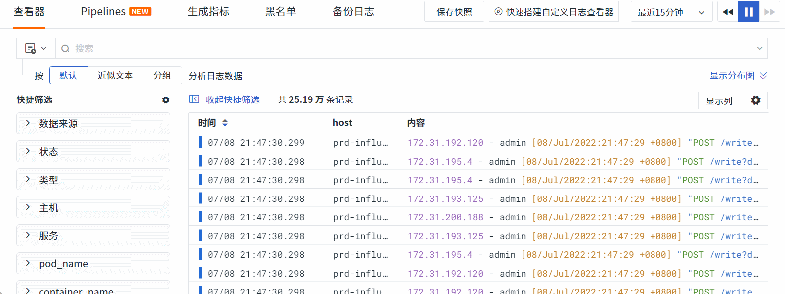

*手动输入标签内容进行反选*
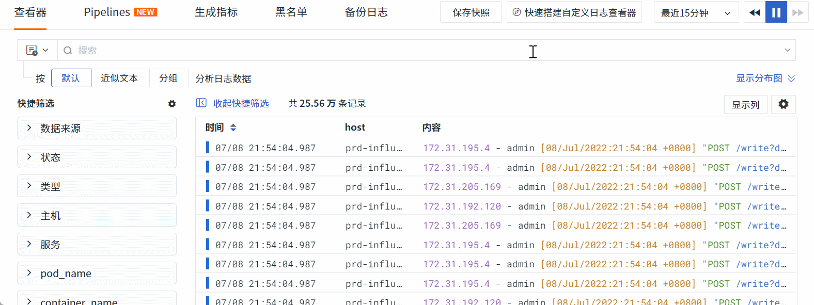

### 模糊匹配（Wildcard Matching）

通过 `*key:value` 的形式进行模糊匹配搜索，value 中可书写通配符进行值匹配。例如：在日志查看器中搜索 `*host:prd-*` ，即返回所有主机名以 `prd-` 开头日志数据。

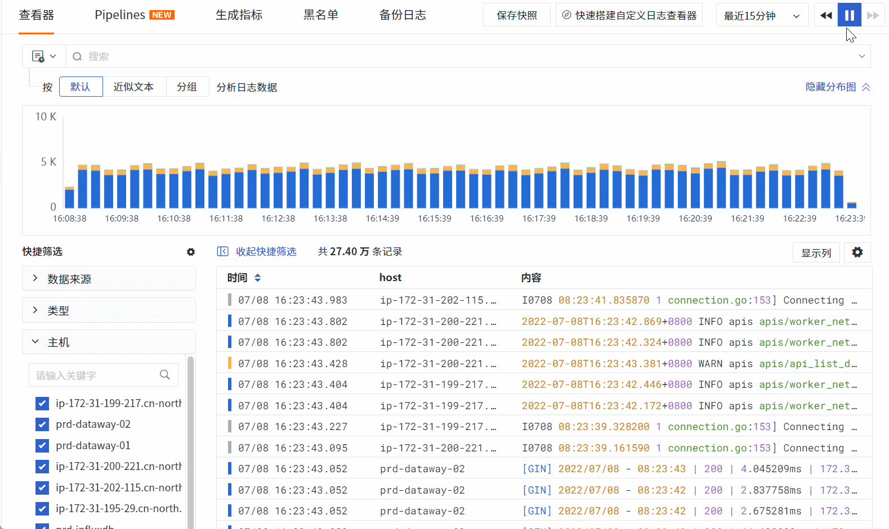

*手动输入标签内容进行模糊匹配*
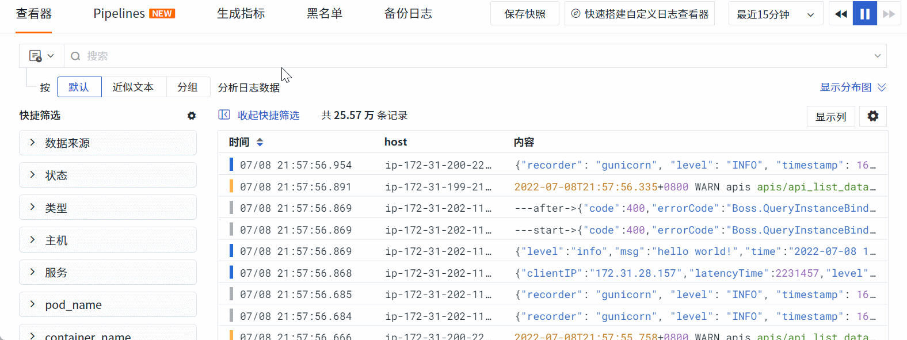

### 编辑筛选

已选标签支持如下两种编辑方式

#### 单击标签

单击标签，在弹出的对话框中可对筛选条件进行修改。（注意：label 标签不支持弹窗编辑）

- 运算方式：  

    - `等于`：即正向筛选，支持下拉选择标签值，或手动输入标签值按回车键确定；
    - `不等于`：即反向筛选，支持下拉选择标签值，或手动输入标签值按回车键确定；
    - `模糊匹配`：即 Wildcard Matching ，支持输入通配符进行模糊匹配搜索，多个值之间用 “,” 分隔开

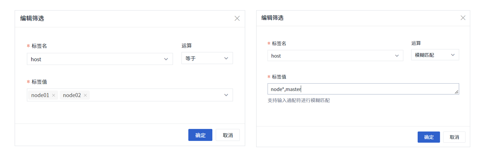

#### 双击标签

双击标签，可对单个筛选条件进行手输编辑，不能同时修改多个。如下所示

**[key:value] 单选标签**
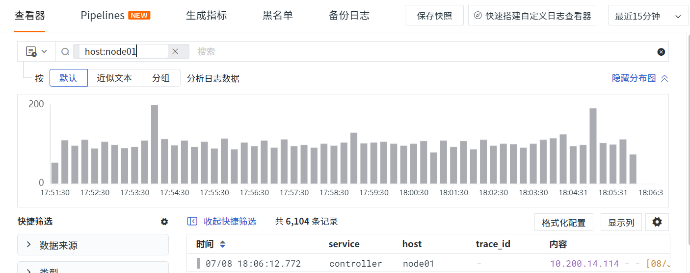

**[key:xx项] 多选标签**
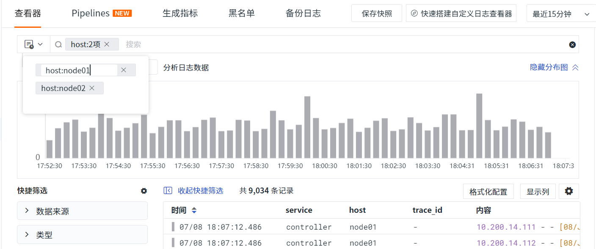

## 快捷筛选说明 {#quick-filter}

默认状态下，所有标签值全部勾选，表示未进行任何筛选。

1. 点击标签值前面的复选框，表示【取消】或【选中】该值；
2. 点击右上角的【重置】按钮取消该标签的值筛选；
3. 默认状态下取消勾选前面复选框，表示反选该值，继续取消勾选其他复选框，表示为反向多选；
   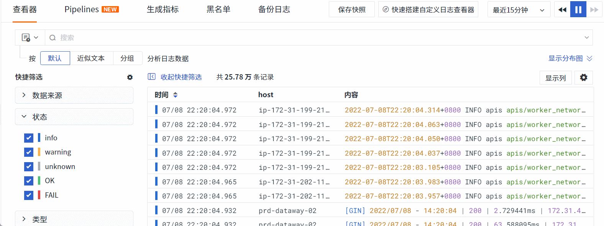
4. 点击标签值所在行，表示正向单选此值，继续勾选其他值的复选框，表示为正向多选；
   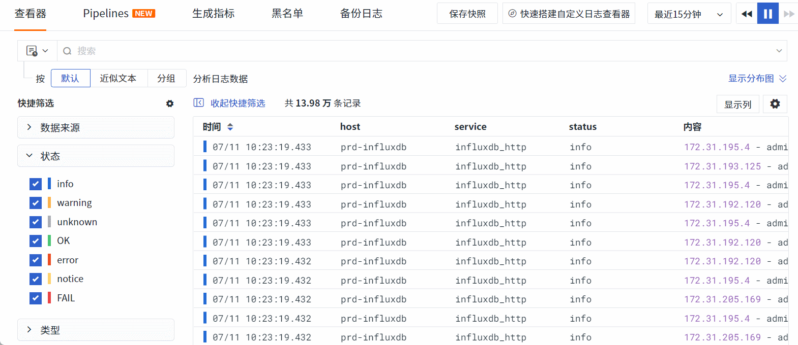
5. 当正向单选了某个值时，再次点击该值所在行，取消全部筛选；
   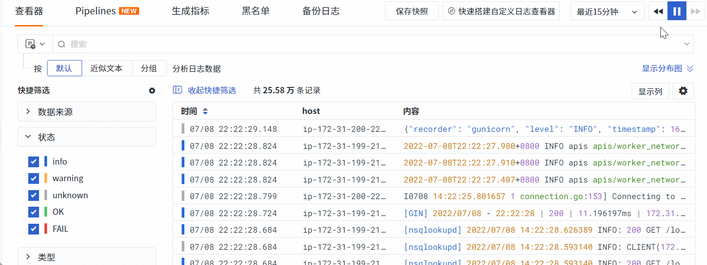

6. 若某个标签同时有正选和反选两种状态，则在快捷筛选中该标签置灰不可操作。

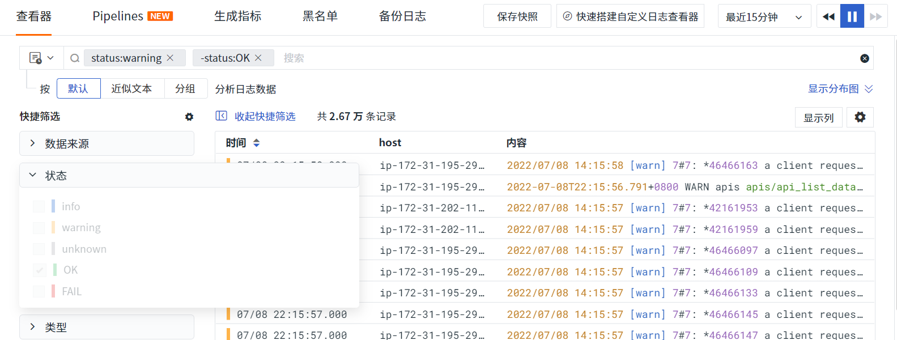

### 自定义筛选字段

在查看器中支持编辑“快捷筛选”添加新的筛选字段。点击【设置】按钮进入编辑状态，支持新增字段、调整字段顺序、删除字段。（其中系统默认字段不支持删除）

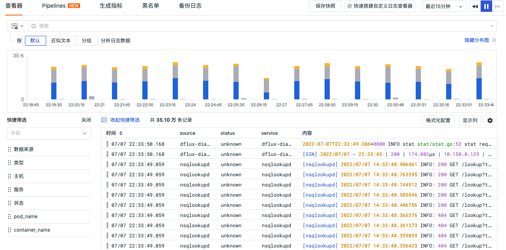

