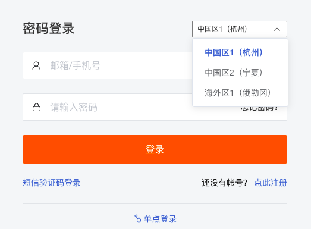

# 选择注册站点
---

## 简介

观测云提供多个注册登录站点，不同的站点对应不同的免费策略。不同站点的账号和数据相互独立，无法互相共享和迁移数据。您可以根据使用资源的情况，选择适合的站点进行注册登录。目前观测云支持以下三个站点。

| 站点 | 登录地址 URL | 运营商 |
| --- | --- | --- |
| 中国区1（杭州） | [https://auth.guance.com/](https://auth.guance.com/login/pwd) | 阿里云（中国杭州） |
| 中国区2（宁夏） | [https://aws-auth.guance.com/](https://aws-auth.guance.com/login/pwd) | AWS（中国宁夏） |
| 海外区1（俄勒冈） | [https://us1-auth.guance.com/](https://us1-auth.guance.com/) | AWS（美国俄勒冈） |

## 如何选择站点

观测云目前提供“中国区1（杭州）”、“中国区2（宁夏）”以及“海外区1（俄勒冈）”三个站点，您可以根据您使用资源的情况选择任意站点。

- 若您的服务器部署在华东、华南地区，可以考虑选择“中国区1（杭州）”站点；
- 若您的服务器在华北、西部地区，可以考虑选择“中国区2（宁夏）”；
- 若您的服务器在海外，可以考虑选择“海外区1（俄勒冈）”。

## 免费策略

观测云针对不同的站点提供不同的免费策略。您也可以按照免费策略来选择站点使用，需要注意的是不同站点的账号和数据相互独立，无法互相共享和迁移数据。

### 中国区1（杭州）站点
| **计费项** | **免费额度** | **数据存储策略** | **备注** |
| --- | --- | --- | --- |
| Datakit 数量 | 不限 | / |  |
| 时间线数量 | 3000 条 | 30 天 |  |
| 日志类数据数量 | 每天 100 万条 | 7 天 | 日志类数据范围：事件、安全巡检、日志(不含云拨测的日志数据) |
| 备份日志数据数量 | / | / | 体验版不支持备份日志数据 |
| 应用性能 Trace 数量 | 每天 8000 个 | 7 天 |  |
| 用户访问 PV 数量 | 每天 2000 个 | 7 天 |  |
| API 拨测次数 | 每天 20 万次 | 7 天 |  |
| 任务调度次数 | 每天 10 万次 | / |  |
| 短信发送次数 | / | / | 体验版不支持短信通知 |

### 中国区2（宁夏）& 海外区1（俄勒冈）站点
| **计费项** | **免费额度** | **数据存储策略** | **备注** |
| --- | --- | --- | --- |
| Datakit 数量 | 不限 | / |  |
| 时间线数量 | 500 条 | 1 天 |  |
| 日志类数据数量 | 每天 100 万条 | 1 天 | 日志类数据范围：事件、安全巡检、日志(不含云拨测的日志数据) |
| 备份日志数据数量 | / | / | 体验版不支持备份日志数据 |
| 应用性能 Trace 数量 | 每天 1 万个 | 1 天 |  |
| 用户访问 PV 数量 | 每天 1 万个 | 1 天 |  |
| API 拨测次数 | 每天 5 万次 | 1 天 |  |
| 任务调度次数 | 每天 5 千次 | / |  |
| 短信发送次数 | / | / | 体验版不支持短信通知 |

### 注意事项

- 体验版不同计费项目若存在数据额度使用满载的情况，数据将停止上报更新；基础设施、事件这两类数据依旧支持上报更新，您仍然可以看到基础设施列表数据，事件数据；
- 体验版不升级则不收费，一旦升级到付费版本，不可回退；
- 时间线和备份日志统计的是全量数据，其他计费项都为增量数据；增量数据统计每天 0 点重置免费配额，当天有效。

## 注册登录账号

您可以在观测云登录地址，选择您注册的站点进行登录，若还未注册账号，可点击“点此注册”进行账号注册，更多可参考文档 [账号管理](https://www.yuque.com/dataflux/doc/kyg7vq) 。

---

观测云是一款面向开发、运维、测试及业务团队的实时数据监测平台，能够统一满足云、云原生、应用及业务上的监测需求，快速实现系统可观测。**立即前往观测云，开启一站式可观测之旅：**[www.guance.com](https://www.guance.com)
