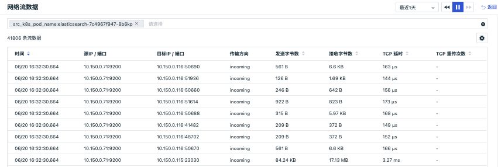
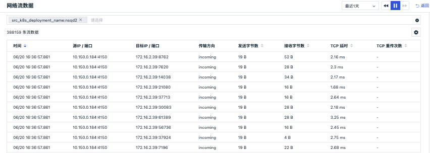

# 容器
---

## 简介

容器数据采集成功后会上报到控制台，在「基础设施」的「容器」，您可以查看到工作空间内容器各种对象的数据信息。

容器数据有两种查看和分析模式，通过切换页面左上角图标，您可以查看：

- **容器对象列表**，您可以对当前工作空间**最近十分钟内**采集的 Containers、Pods、Services、Deployments、Clusters、Nodes、Replica  Sets、Jobs、Cron Jobs 数据以列表形式进行查看，并对列表内数据进行检索、筛选和分组排行
- **容器分布图**，您可以对工作空间的 Containers 和 Pods 数据以分布图形式进行查看，并基于填充数据的大小，快速识别 Container/pod 的性能状态

## 容器对象列表

通过容器对象列表，您可以对当前工作空间**最近十分钟内**采集的 Containers、Pods、Services、Deployments、Clusters、Nodes、Replica  Sets、Jobs、Cron Jobs 数据以列表形式进行查看，支持您通过搜索关键字，筛选，排序等方式查看容器数据，支持为容器设置标签，并通过标签筛选展示相同标签的容器列表。

### 容器查询和分析

#### 时间控件

容器对象列表支持查看**最近十分钟内**采集的Containers、Pods、Services、Deployments、Clusters、Nodes、Replica  Sets、Jobs、Cron Jobs 数据，通过「 :material-refresh: 刷新 」按钮可以刷新至当前时间范围，重新获取数据列表。

#### 搜索与筛选

在查看器搜索栏，支持关键字搜索、通配符搜索、关联搜索、JSON 搜索等多种搜索方式，支持通过 `标签/属性` 进行值的筛选，包括正向筛选、反向筛选、模糊匹配、反向模糊匹配、存在和不存在等多种筛选方式。更多搜索与筛选可参考文档 [查看器的搜索和筛选](../getting-started/necessary-for-beginners/explorer-search.md) 。

#### 快捷筛选

在查看器快捷筛选，支持编辑“快捷筛选”，添加新的筛选字段。添加完成后，可以选择其字段值进行快捷筛选。更多快捷筛选可参考文档 [快捷筛选](../getting-started/necessary-for-beginners/explorer-search.md#quick-filter) 。

#### 自定义显示列

在容器查看器列表，可通过「显示列」自定义添加、编辑、删除、拖动显示列。当鼠标放在查看器显示列上时，点击「 :material-cog: 设置」按钮，支持对显示列进行升序、降序、向左移动列、向右移动列、向左添加列、向右添加列、替换列、添加到快捷筛选、添加到分组、移除列等操作。更多自定义显示列可参考文档 [显示列说明](../getting-started/necessary-for-beginners/explorer-search.md#columns) 。

#### 排序

点击列表菜单，如：CPU使用率、MEM使用率，您可以基于选中的标签进行升降排序；

#### 分组

通过分组对容器对象数据进行相关聚合，聚合的结果将显示分组排行榜Top10。分组支持多标签筛选。通过点击分组排行榜，该分组对应的字段将被做为筛选条件显示查询结果，即您可查看对应分组里的对象数据；点击分组右侧的" :material-cog: 设置"按钮，可自定义添加分组标签（仅管理员可添加），添加完成后，可选择按照添加分组标签进行分组聚合展示。

#### 设置

通过页面左上角的" :material-cog: 设置"图标，支持导出当前对象列表数据到CSV文件或场景仪表板和笔记。

### Containers 列表

「Containers 列表」支持查看工作空间内采集的全部容器信息，包括容器名称、相关主机、运行状态、CPU使用率、MEM使用率等。

#### Contrainer 详情页

点击 Contrainer 列表中的容器名称即可划出详情页查看容器的详细信息，包括容器状态、容器名称、容器ID、容器镜像、容器所关联的主机和 Label 标签属性。

另外，在详情页，您可以

- 通过「基础属性」查看容器相关的所有属性；
- 通过「指标」实时监测**最近24小时内**容器的CPU使用率、内存使用率、网络流量等；
- 通过「主机」实时监测**最近24小时内**与容器相关的主机的性能状态及主机基本信息；
- 通过「日志」查看与该容器相关的**最近1小时**全部日志；
- 通过「进程」查看当前容器中正在运行的全部进程；
- 通过「内置视图」的绑定功能，添加查看容器对象相关的内置视图。更多配置详情，可参考[绑定内置视图](../management/built-in-view/bind-view.md)。

另外，通过点击容器详情页的标签「主机」，您可以进行以下操作：

- “筛选字段值”，即添加该字段至查看器，查看与该字段相关的全部数据
- “反向筛选字段值”，即添加该字段至查看器，查看除了该字段以外的其他数据
- “添加到显示列”，即添加该字段到查看器列表进行查看
- “复制”，即复制该字段至剪贴板 
- “查看相关日志”，即查看与该主机相关全部日志
- “查看相关容器”，即查看与该主机相关全部容器
- “查看相关进程”，即查看与该主机相关全部进程
- “查看相关链路”，即查看与该主机相关全部链路
- “查看相关巡检”，即查看与该主机相关全部巡检数据

#### 标签属性

「Label 属性」随容器信息默认自动上传。点击容器对象列表中的名称，即可划出详情页查看其对应的Label属性。容器标签添加后，可在容器对象列表通过添加的标签筛选展示相同标签的容器列表。

#### 关联分析
观测云支持对每一个基础设施对象进行关联分析，在容器对象的详情页，您不仅能够了解容器的基本信息，还可以一站式关联对应容器的的指标、主机、pod、日志、进程等，更快更全面的监测容器运行情况。

=== "指标"

    在容器详情页，支持您通过详情页中的「指标」实时监测**最近24小时内**容器的性能状态，支持选择不同的时间范围进行查看。点击右上角图标，可在内置视图对绑定的容器视图进行自定义编辑保存。
    **注意：若容器关联字段“service”、“project”、“namespace”，则可以在容器详情查看该三个字段对应的视图。**

=== "主机"

    在容器详情页，支持您通过详情页中的，查看相关主机（关联字段：host）的基本信息和**在选定时间组件范围内**的性能指标状态。
    **注意：在容器详情中查看相关主机，需要匹配字段“host”，否则无法在容器详情查看到相关主机的页面**。
    - 属性视图：包括主机的基本信息、集成运行情况，若开启云主机的采集，还可查看云厂商的信息。
    - 指标视图：可查看默认24小时内，相关主机的CPU、内存等性能指标视图。点击「打开该视图」至内置视图，可通过克隆的方式对主机视图进行自定义修改，并作为用户视图保存，用户视图可通过绑定在容器详情页查看，更多配置详情，可参考[绑定内置视图](../management/built-in-view/bind-view.md)。

=== "日志"

    在容器详情页，支持您通过详情页中的 「日志」，快速查看与该容器相关的**最近1小时**内的日志，并对这些相关日志进行关键字搜索、多标签筛选和时间排序。如需查看更详细的日志信息，您可以点击日志内容跳转到对应日志详情页面，或点击「跳转」至「日志」查看与该容器相关的全部日志。

=== "进程"

    在容器详情页，支持您通过详情页下方的「进程」，快速查看当前容器正在运行的全部进程。如需查看更详细的进程信息，您可以点击进程内容跳转到对应进程的详情页面，或点击「跳转」至进程查看与该容器相关的全部进程。

=== "关联 Pod"

    在容器详情页，支持您通过详情页查看相关 Pod（关联字段：pod_name）的基本信息和**在选定时间组件范围内**的性能指标状态。
    **注意：在容器详情中查看相关 Pod，需要匹配字段“pod_name”，否则无法在容器详情查看到相关 Pod 的页面**。

### Pods 列表

通过左上角的对象「Pods」，您可以切换至「Pods」查看空间内留存的全部 Pod 的信息，包括 Pod 名称、运行状态、重启次数、启动时间等。

#### Pod 详情页

点击Pod 列表中的Pod 名称即可划出详情页查看 pod的详细信息，包括包括运行状态、Pod名称、所属的节点Node、 Label 标签属性、关联指标、关联容器、关联日志、YAML文件、网络连接状态、关联服务器运行状态等。

#### 标签属性

「Label 属性」随Pod信息默认自动上传。已有的Pod 标签，可在 Pod 对象列表通过快捷筛选展示相同标签的 Pod 数据。

#### 关联分析

观测云支持对每一个基础设施对象进行关联分析，在Pod对象的详情页，您不仅能够了解Pod的基本信息，还可以一站式关联对应Pod的指标、容器、日志、网络、主机等，更快更全面的监测Pod运行情况。

=== "YAML"

    支持查看 Pod 对应的yaml文件。在基础设施 Pod 的详情页，点击「YAML」，即可查看对应的yaml文件。
    
    

=== "指标"

    支持查看当前 pod 容器的性能状态，包括CPU Cores、CPU使用率、内存等。
    **注意：若Pod关联字段“service”、“project”、“namespace”，则可以在Pod详情页查看该三个字段对应的视图。**

=== "容器"

    支持查看 Pod 对应容器，点击容器或点击「跳转」按钮至容器查看与该 Pod 相关的全部容器。

=== " 日志"

    支持查看 Pod 对应日志，点击日志或点击「跳转」按钮至日志查看与该 Pod 相关的全部日志。

=== " 主机"

    在Pod详情页，支持您通过详情页中的，查看相关主机（关联字段：host）的基本信息和**在选定时间组件范围内**的性能指标状态。
    **注意：在进程详情中查看相关主机，需要匹配字段“host”，否则无法在进程详情查看到相关主机的页面**。
    - 属性视图：包括主机的基本信息、集成运行情况，若开启云主机的采集，还可查看云厂商的信息。
    - 指标视图：可查看默认24小时内，相关主机的CPU、内存等性能指标视图。点击「打开该视图」至内置视图，可通过克隆的方式对主机视图进行自定义修改，并作为用户视图保存，用户视图可通过绑定在Pod详情页查看，更多配置详情，可参考[绑定内置视图](../management/built-in-view/bind-view.md)。
    
    另外，通过点击 pod 详情页的标签「主机」，您可以对该主机相关的日志、容器、进程、链路、巡检等数据进行查询。
    
    - “筛选字段值”，即添加该字段至查看器，查看与该字段相关的全部数据
    - “反向筛选字段值”，即添加该字段至查看器，查看除了该字段以外的其他数据
    - “添加到显示列”，即添加该字段到查看器列表进行查看
    - “复制”，即复制该字段至剪贴板 
    - “查看相关日志”，即查看与该主机相关全部日志
    - “查看相关容器”，即查看与该主机相关全部容器
    - “查看相关进程”，即查看与该主机相关全部进程
    - “查看相关链路”，即查看与该主机相关全部链路
    - “查看相关巡检”，即查看与该主机相关全部巡检数据
    
    

#### Pod 网络

Pod 网络支持查看 Pod 之间的网络流量。支持基于 IP/端口查看源 IP 到目标 IP 之间的网络流量和数据连接情况，通过可视化的方式进行实时展示，帮助企业实时了解业务系统的网络运行状态，快速分析、追踪和定位问题故障，预防或避免因网络性能下降或中断而导致的业务问题。

Pod 网络数据采集成功后会上报到观测云控制台，在「基础设施」-「容器」-「Pod」详情页中的「网络」，您可以查看到工作空间内全部 Pod 网络性能监测数据信息。

注意：

- 目前仅支持 Linux 系统，且除 CentOS 7.6+ 和 Ubuntu 16.04 以外，其他发行版本需要 Linux 内核版本高于 4.0.0。
- Pod 网络流量数据默认保存最近48小时，免费版默认保存最近24小时；
- 在 Pod 详情页点击进入「网络」，时间控件默认获取最近 15 分钟的数据且不支持自动刷新，需手动点击刷新获取新的数据；

##### TCP、UDP 协议

Pod 网络支持基于 TCP、UDP 协议的网络性能监测。配合 incoming 和 outgoing ，分成 6 种组合选择：

   - incoming + 不区分协议
   - incoming + tcp 协议
   - incoming + udp 协议
   - outgoing + 不区分协议
   - outgoing + tcp 协议
   - outgoing + udp 协议

**参数说明**

| 参数 | 说明 | 统计方式 |
| --- | --- | --- |
| IP/端口 | 目标基于IP+端口做聚合，最多返回100条数据 | 按 IP/端口分组统计 |
| 发送字节数 | 源主机发送给目标字节数 | 所有记录发送字节数求和 |
| 接受字节数 | 源主机接收目标的字节数 | 所有记录接收字节数求和 |
| TCP 延时 | 源主机到目标的TCP延时 | 平均值 |
| TCP 波动 | 源主机到目标的TCP延时波动 | 平均值 |
| TCP 连接数 | 源主机到目标的TCP连接数 | 总和 |
| TCP 重传次数 | 源主机到目标的TCP重传次数 | 总和 |
| TCP 关闭次数 | 源主机到目标的TCP关闭次数 | 总和 |

**网络连接分析**

观测云支持查看 Pod 网络连接数据，包括源IP/端口、目标IP/端口、发送字节数、接收字节数、TCP延时、TCP重传次数等。同时，你还可以通过"设置"按钮自定义显示字段，或针对连接数据添加筛选条件，筛选所有字符串类型的关键字。若你需要查看更详细网络连接数据，点击该数据或“查看网络流数据”即可查看其对应的网络流数据。

##### HTTP 协议

Pod 网络支持基于 HTTP 协议的七层网络性能监测。

**参数说明**

| 参数 | 说明 | 统计方式 |
| --- | --- | --- |
| 请求数 | 时间范围内，当前 Pod 的总请求数 | 总和 |
| 平均每秒请求数 | 时间范围内，当前 “Pod 总请求数 / 请求的总耗时” | 平均值 |
| 平均响应时间 | 时间范围内，当前 Pod 响应时间 | 平均值 |
| 错误数 | 时间范围内，当前 Pod 的请求错误数，即 status_code 字段值为 4xx,5xx 的总和 | 总和 |
| 错误率 | 时间范围内，当前 Pod 的 “请求错误数 / 总请求数” 的值 | 百分比 |

**网络连接分析**

观测云支持查看 Pod 网络请求数、错误数、错误率可视化图表趋势，支持查看 Pod 网络连接分析，包括源IP/端口、目标IP/端口、状态码、请求方式、响应时间等。同时，你还可以通过"设置"按钮自定义显示字段，或针对连接数据添加筛选条件，筛选所有字符串类型的关键字。若你需要查看更详细网络连接数据，点击该数据或“查看网络流数据”即可查看其对应的网络流数据。

**查看网络流数据**

观测云支持查看网络流数据，每 30s 自动刷新一次，默认展示最近 1 天数据，包括时间、源IP/端口、目标IP/端口、状态码、请求方式、响应时间等。同时，您还可以通过"设置"按钮自定义显示字段，或针对网络流数据添加筛选条件，筛选所有字符串类型的关键字。

### Services 列表

通过左上角的对象「Services」，您可以切换至「Services」查看空间内留存的全部 Service 的信息，包括Service 名称、服务类型、Cluster IP、External IP、运行时长等。

#### Service 详情页

点击 Service 列表中的 Service 名称即可划出详情页查看 Service 的详细信息，包括名称、基础信息、 Label 标签属性和其他字段属性。

**注意：若Service关联字段“namespace”，则可以在Service详情页查看该字段对应的指标视图。**

通过点击 Service 详情页的标签「主机」，您可以进行以下操作：

- “筛选字段值”，即添加该字段至查看器，查看与该字段相关的全部数据
- “反向筛选字段值”，即添加该字段至查看器，查看除了该字段以外的其他数据
- “添加到显示列”，即添加该字段到查看器列表进行查看
- “复制”，即复制该字段至剪贴板 
- “查看相关日志”，即查看与该主机相关全部日志
- “查看相关容器”，即查看与该主机相关全部容器
- “查看相关进程”，即查看与该主机相关全部进程
- “查看相关链路”，即查看与该主机相关全部链路
- “查看相关巡检”，即查看与该主机相关全部巡检数据

#### 标签属性

「Label 属性」随 Service 信息默认自动上传。已有的标签，可在 Service 对象列表通过快捷筛选展示相同标签的  Service  数据。

### Deployments 列表

通过左上角的对象「Deployments」，您可以切换至「Deployments」查看空间内留存的全部 Deployment 的详尽信息，包括Deployment 名称、可用副本、已升级副本、准备就绪、运行时长等。

#### Deployment 详情页

点击 Deployments 列表中的 Deployment 名称即可划出详情页查看 Deployment 的详细信息，包括名称、基础信息、 Label 标签属性和其他字段属性。支持查看关联的日志、Replica Set 、 Pod 、以及网络数据。
**注意：若 Deployment 关联字段“namespace”，则可以在Service详情页查看该字段对应的指标视图。**

通过点击 Deployment 详情页的标签「主机」，您可以进行以下操作：

- “筛选字段值”，即添加该字段至查看器，查看与该字段相关的全部数据
- “反向筛选字段值”，即添加该字段至查看器，查看除了该字段以外的其他数据
- “添加到显示列”，即添加该字段到查看器列表进行查看
- “复制”，即复制该字段至剪贴板 
- “查看相关日志”，即查看与该主机相关全部日志
- “查看相关容器”，即查看与该主机相关全部容器
- “查看相关进程”，即查看与该主机相关全部进程
- “查看相关链路”，即查看与该主机相关全部链路
- “查看相关巡检”，即查看与该主机相关全部巡检数据

#### 标签属性

「Label 属性」随 Deployment 信息默认自动上传。已有的标签，可在 Deployment 对象列表通过快捷筛选展示相同标签的  Deployment 数据。

#### Deployment 网络

Deployment 网络支持查看 Deployment 之间的网络流量。支持基于 IP/端口查看源 IP 到目标 IP 之间的网络流量和数据连接情况，通过可视化的方式进行实时展示，帮助企业实时了解业务系统的网络运行状态，快速分析、追踪和定位问题故障，预防或避免因网络性能下降或中断而导致的业务问题。

Deployment 网络数据采集成功后会上报到观测云控制台，您可以在「基础设施」-「容器」-「Pod」详情页中的「网络」，查看当前 Deployment 的网络性能监测数据信息。

注意：

- 目前仅支持 Linux 系统，且除 CentOS 7.6+ 和 Ubuntu 16.04 以外，其他发行版本需要 Linux 内核版本高于 4.0.0；
- Deployment 网络流量数据默认保存最近48小时，免费版默认保存最近24小时；
- 在 Deployment 详情页点击进入「网络」，时间控件默认获取最近 15 分钟的数据且不支持自动刷新，需手动点击刷新获取新的数据；

##### TCP、UDP 协议

Deployment 网络支持基于 TCP、UDP 协议的网络性能监测。配合 incoming 和 outgoing ，分成 6 种组合选择：

   - incoming + 不区分协议
   - incoming + tcp 协议
   - incoming + udp 协议
   - outgoing + 不区分协议
   - outgoing + tcp 协议
   - outgoing + udp 协议

**参数说明**

| 参数 | 说明 | 统计方式 |
| --- | --- | --- |
| IP/端口 | 目标基于IP+端口做聚合，最多返回100条数据 | 按 IP/端口分组统计 |
| 发送字节数 | 源主机发送给目标字节数 | 所有记录发送字节数求和 |
| 接受字节数 | 源主机接收目标的字节数 | 所有记录接收字节数求和 |
| TCP 延时 | 源主机到目标的TCP延时 | 平均值 |
| TCP 波动 | 源主机到目标的TCP延时波动 | 平均值 |
| TCP 连接数 | 源主机到目标的TCP连接数 | 总和 |
| TCP 重传次数 | 源主机到目标的TCP重传次数 | 总和 |
| TCP 关闭次数 | 源主机到目标的TCP关闭次数 | 总和 |

**网络连接分析**

观测云支持查看 Deployment 网络连接数据，包括源IP/端口、目标IP/端口、发送字节数、接收字节数、TCP延时、TCP重传次数等。同时，你还可以通过"设置"按钮自定义显示字段，或针对连接数据添加筛选条件，筛选所有字符串类型的关键字。若你需要查看更详细网络连接数据，点击该数据或“查看网络流数据”即可查看其对应的网络流数据。

##### HTTP 协议

Pod 网络支持基于 HTTP 协议的七层网络性能监测。

**参数说明**

| 参数 | 说明 | 统计方式 |
| --- | --- | --- |
| 请求数 | 时间范围内，当前 Pod 的总请求数 | 总和 |
| 平均每秒请求数 | 时间范围内，当前 “Pod 总请求数 / 请求的总耗时” | 平均值 |
| 平均响应时间 | 时间范围内，当前 Pod 响应时间 | 平均值 |
| 错误数 | 时间范围内，当前 Pod 的请求错误数，即 status_code 字段值为 4xx,5xx 的总和 | 总和 |
| 错误率 | 时间范围内，当前 Pod 的 “请求错误数 / 总请求数” 的值 | 百分比 |

**网络连接分析**

观测云支持查看 Pod 网络请求数、错误数、错误率可视化图表趋势，支持查看 Pod 网络连接分析，包括源IP/端口、目标IP/端口、状态码、请求方式、响应时间等。同时，你还可以通过"设置"按钮自定义显示字段，或针对连接数据添加筛选条件，筛选所有字符串类型的关键字。若你需要查看更详细网络连接数据，点击该数据或“查看网络流数据”即可查看其对应的网络流数据。

**查看网络流数据**

观测云支持查看网络流数据，每 30s 自动刷新一次，默认展示最近 1 天数据，包括时间、源IP/端口、目标IP/端口、状态码、请求方式、响应时间等。同时，您还可以通过"设置"按钮自定义显示字段，或针对网络流数据添加筛选条件，筛选所有字符串类型的关键字。

### Clusters 列表

通过左上角的对象「Clusters」，您可以切换至「Clusters」查看空间内留存的全部 Clusters 的信息，包括Clusters 名称、运行时间、kubernetes 注释等。

#### Clusters 详情页

点击 Clusters 列表中的 Clusters 名称即可划出详情页查看 Clusters 的详细信息，包括名称、基础属性信息、 Label 标签属性和其他字段属性。

通过点击 Clusters 详情页的标签「主机」，您可以进行以下操作：

- “筛选字段值”，即添加该字段至查看器，查看与该字段相关的全部数据
- “反向筛选字段值”，即添加该字段至查看器，查看除了该字段以外的其他数据
- “添加到显示列”，即添加该字段到查看器列表进行查看
- “复制”，即复制该字段至剪贴板 
- “查看相关日志”，即查看与该主机相关全部日志
- “查看相关容器”，即查看与该主机相关全部容器
- “查看相关进程”，即查看与该主机相关全部进程
- “查看相关链路”，即查看与该主机相关全部链路
- “查看相关巡检”，即查看与该主机相关全部巡检数据

#### 标签属性

「Label 属性」随 Clusters 信息默认自动上传。已有的标签，可在 Clusters 对象列表通过快捷筛选展示相同标签的  Clusters 数据。

### Nodes 列表

通过左上角的对象「Nodes」，您可以切换至「Nodes」查看空间内留存的全部 Nodes 的信息，包括Nodes 名称、状态、版本、运行时间。

#### Node 详情页

点击 Nodes 列表中的 Node 名称即可划出详情页查看 Node 的详细信息，包括名称、基础属性信息、 Label 标签属性和其他字段属性。支持查看关联的 Pod 数据。

通过点击 Node 详情页的标签「主机」，您可以进行以下操作：

- “筛选字段值”，即添加该字段至查看器，查看与该字段相关的全部数据
- “反向筛选字段值”，即添加该字段至查看器，查看除了该字段以外的其他数据
- “添加到显示列”，即添加该字段到查看器列表进行查看
- “复制”，即复制该字段至剪贴板 
- “查看相关日志”，即查看与该主机相关全部日志
- “查看相关容器”，即查看与该主机相关全部容器
- “查看相关进程”，即查看与该主机相关全部进程
- “查看相关链路”，即查看与该主机相关全部链路
- “查看相关巡检”，即查看与该主机相关全部巡检数据

#### 标签属性

「Label 属性」随 Node 信息默认自动上传。已有的标签，可在 Node 对象列表通过快捷筛选展示相同标签的  Node 数据。

### Replica Sets 列表

通过左上角的对象「Replica Sets」，您可以切换至「Replica Sets」查看空间内留存的全部 Replica Sets 的详尽信息，包括Replica Set名称、运行时间长，集群等。

#### Replica Set 详情页

点击 Replica Sets 列表中的 Replica Set 名称即可划出 Replica Set 详情页查看 Replica Set 的信息，包括名称、基础属性信息、 Label 标签属性和其他字段属性。支持查看关联的 Pod 数据。
**注意：若 Replica Set 关联字段“namespace”，则可以在Service详情页查看该字段对应的指标视图。**

通过点击  Replica Sets 详情页的标签「主机」，您可以进行以下操作：

- “筛选字段值”，即添加该字段至查看器，查看与该字段相关的全部数据
- “反向筛选字段值”，即添加该字段至查看器，查看除了该字段以外的其他数据
- “添加到显示列”，即添加该字段到查看器列表进行查看
- “复制”，即复制该字段至剪贴板 
- “查看相关日志”，即查看与该主机相关全部日志
- “查看相关容器”，即查看与该主机相关全部容器
- “查看相关进程”，即查看与该主机相关全部进程
- “查看相关链路”，即查看与该主机相关全部链路
- “查看相关巡检”，即查看与该主机相关全部巡检数据

#### 标签属性

「Label 属性」随 Replica Set 信息默认自动上传。已有的标签，可在 Replica Set 对象列表通过快捷筛选展示相同标签的 Replica Set 数据。

### Jobs 列表

通过左上角的对象「Jobs」，您可以切换至「Jobss」查看空间内留存的全部 Jobs 的信息，包括 Job 名称、并行数量、活跃数、运行时间等。

#### Job 详情页

点击 Jobs 列表中的 Job 名称即可划出详情页查看 Job 的详细信息，包括名称、基础属性信息、 Label 标签属性和其他字段属性。

通过点击 Job 详情页的标签「主机」，您可以进行以下操作：

- “筛选字段值”，即添加该字段至查看器，查看与该字段相关的全部数据
- “反向筛选字段值”，即添加该字段至查看器，查看除了该字段以外的其他数据
- “添加到显示列”，即添加该字段到查看器列表进行查看
- “复制”，即复制该字段至剪贴板 
- “查看相关日志”，即查看与该主机相关全部日志
- “查看相关容器”，即查看与该主机相关全部容器
- “查看相关进程”，即查看与该主机相关全部进程
- “查看相关链路”，即查看与该主机相关全部链路
- “查看相关巡检”，即查看与该主机相关全部巡检数据

#### 标签属性

「Label 属性」随 Job 信息默认自动上传。已有的标签，可在 Job 对象列表通过快捷筛选展示相同标签的 Job 数据。

### Cron Jobs 列表

通过左上角的对象「Cron Jobs」，您可以切换至「Cron Jobs」查看空间内留存的全部 Cron Jobs 的信息，包括 Cron Job 名称、运行日程、是否暂停、Job 活跃数量、运行时间等。

#### Cron Job 详情页

点击 Cron Jobs 列表中的 Cron Job 名称即可划出详情页查看 Cron Job 的详细信息，包括名称、基础属性信息、 Label 标签属性和其他字段属性。

通过点击 Cron Job 详情页的标签「主机」，您可以进行以下操作：

- “筛选字段值”，即添加该字段至查看器，查看与该字段相关的全部数据
- “反向筛选字段值”，即添加该字段至查看器，查看除了该字段以外的其他数据
- “添加到显示列”，即添加该字段到查看器列表进行查看
- “复制”，即复制该字段至剪贴板 
- “查看相关日志”，即查看与该主机相关全部日志
- “查看相关容器”，即查看与该主机相关全部容器
- “查看相关进程”，即查看与该主机相关全部进程
- “查看相关链路”，即查看与该主机相关全部链路
- “查看相关巡检”，即查看与该主机相关全部巡检数据

#### 标签属性

「Label 属性」随 Cron Job 信息默认自动上传。已有的标签，可在 Cron Job 对象列表通过快捷筛选展示相同标签的 Job 数据

## 容器分布图

在「基础设施」-「容器」，点击左上角容器分布图的小图标，可切换查看器至容器分布图时，您可以对工作空间的「Container」和「Pod」数据以分布图形式进行查看。

- 在「Container」分布图，您可以快速查看容器指标值（CPU使用率、MEM使用率）的大小，并分析不同项目、不同服务、不同主机、不同镜像下的容器性能状态。
- 在「Pod」分布图，您可以快速查看Pod的重启次数，并分析不同项目、不同服务、不同主机、不同Node名称、不同命名空间下的pod性能状态。

- 搜索与筛选：通过列表上方的搜索和筛选栏，您可以基于标签、字段、文本（包含日志文本）进行关键词搜索、标签筛选、字段筛选、关联搜索，进而过滤出对应 Container/pod 等对象
   - 输入框支持模糊匹配相关标签和字段
   - “abc：123”形式， 回车后支持字段筛选
   - 输入框单击“tag" 后，支持标签筛选
   - 输入框输入文本，支持关键字搜索
   - " abc AND cba / abc OR cba" 形式，回车后支持关联搜索
- 分组：您可以通过添加一个或多个分组标签重新组合 Container/pod 对象
- 填充：您可以自定义选择填充指标，填充指标值的大小将决定填充的图例颜色。支持选择 CPU 使用率和 MEM 使用率两种指标填充方式。
- 自定义区间：您可以通过「图例设置」开启自定义图例范围。图例的颜色将依据图例的最大和最小值等分为5个区间，每个区间将自动对应五个不同的颜色。
- 鼠标悬停：悬停鼠标至容器对象，可查看容器名称、CPU 使用率和 MEM 使用率。
