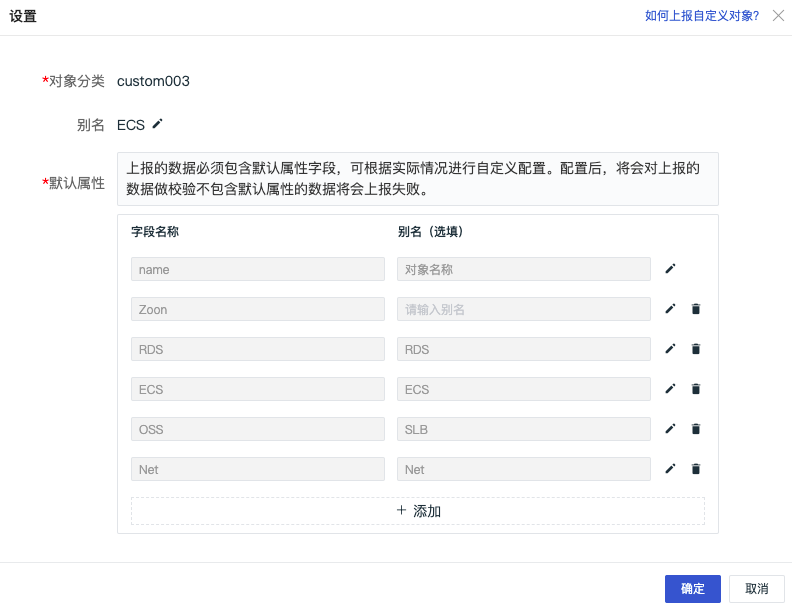
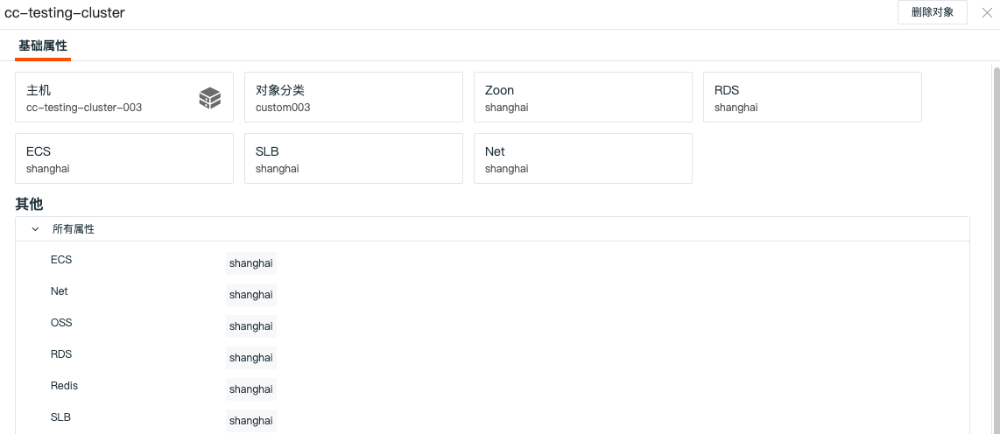
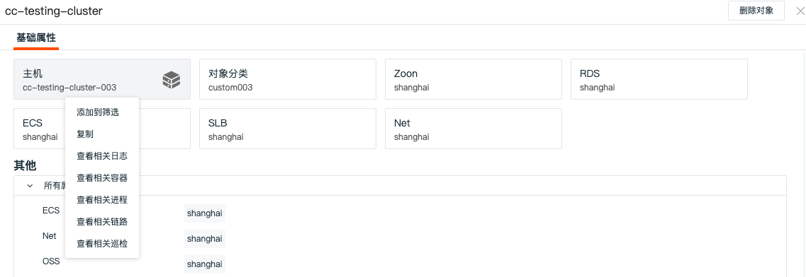
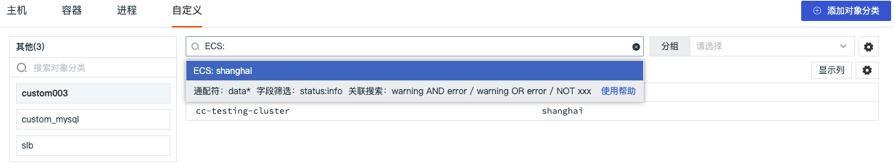
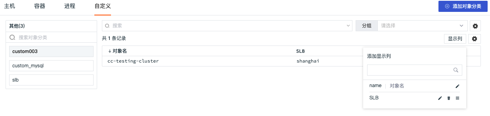
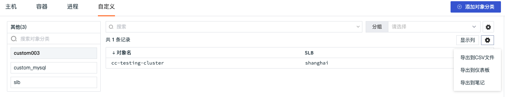

# 自定义
---

## 简介

除了主机、容器、进程以外，观测云支持您自定义新的对象分类并上报相关对象数据到观测云控制台。通过「基础设施」的「自定义」，您可以查看上报到工作空间的全部自定义对象数据。

## 自定义对象分类

观测云支持您自定义对象分类，帮助您跟踪和存储同一类的自定义上报对象数据。通过观测云工作平台，您可以添加对象分类、修改现有对象分类和删除现有对象分类。

### 添加对象分类

在观测云工作空间，通过 「基础设施」-「自定义」-「添加对象分类」，您可以创建新的对象分类，并自定义对象分类名称和对象字段。

- 对象分类：自定义对象的分类名称，即进行自定义对象数据上报时的 “对象分类名称”。在数据上报时，您需要使**“对象分类名称”与数据上报时的命名保持一致。**
- 别名：对当前对象分类添加别名，即当前对象分类在自定义对象列表显示的名称。
- 默认属性：添加对象需要的自定义字段及字段别名，默认添加对象的`name`字段。在数据上报时，自定义字段为该对象分类下进行数据上报时的必填字段。

#### 自定义对象数据上报

添加完自定义对象分类以后，即可进行自定义数据上报。进行自定义对象数据上报时，需要先安装并连通 DataKit 和 DataFlux Func，再通过 DataFlux Func 上报数据到 DataKit，最终通过 DataKit 上报数据到观测云工作空间。具体操作过程可参考文档 [自定义对象数据上报](data-reporting.md) 。

**注意：**

1. 「默认属性」中的自定义字段，均为数据上报时的必填字段，若上报的数据缺失必填字段，该数据将无法上报到观测云工作空间
1. 若上报的数据包含必填字段且包括其他的字段，非必填字段显示为数据标签。
1. 若上报的数据类型与定义的字段数据类型不符，该数据无法上报到观测云工作空间。如：在DataFlux Func 中定义了字段类型是字符型，上报的时候数据类型为整型，该数据将无法上报到观测云工作空间。

### 修改对象分类

通过 「基础设施」-「自定义」，在页面左侧的对象分类列表中，您可以点击「更多」对现有的对象分类进行「设置」，包括更改现有对象分类别名和添加/删除字段。

**注意：**添加字段后，原有对象数据不变，后上报的数据则必须包含此字段

### 删除对象分类

观测云支持拥有者和管理员删除指定自定义对象分类以及所有自定义对象，进入「管理」-「基本设置」，点击「删除自定义对象」后，选择删除自定义对象的方式，即可删除对应的对象数据。

- 指定自定义对象分类：仅删除所选对象分类下的数据，不会删除索引
- 所有自定义对象：删除所有自定义对象数据及索引

注意：所有自定义对象一旦删除，上报到基础设施自定义的所有数据及索引全部会被删除且无法恢复，所有设置的自定义对象分类数据需要重新上报，每天限制5次删除所有自定义对象操作。

## 自定义对象详情页

自定义对象数据上报后，点击自定义对象列表中的名称即可划出详情页查看该对象的详细信息, 包括对象名称、对象分类、属性标签等。

### 基础属性

通过点击自定义对象详情页的基础属性标签「主机」，您可以进行以下操作：

- “添加到筛选”，即添加该标签至 container列表查看器，查看与该主机相关的全部 Container数据
- “复制”，即复制该标签内容至本地剪贴板 
- “查看相关日志”，即查看与该主机相关全部日志
- “查看相关容器”，即查看与该主机相关全部容器
- “查看相关进程”，即查看与该主机相关全部进程
- “查看相关链路”，即查看与该主机相关全部链路
- “查看相关巡检”，即查看与该主机相关全部巡检数据

## 自定义对象查询与分析

进入「自定义」查看器，观测云支持您通过搜索关键字，多标签筛选等方式快速查询自定义对象数据。

- 通过页面上方的搜索，您可以快速基于关键词匹配当前列表内对象的名称
- 通过页面上方的筛选栏和左侧的快速筛选，您可以通过手动添加标签，进而筛选出相关对象数据

注意：搜索支持多个关键词搜索，只需要输入对应的关键词，使用空格或者逗号隔开即可。（当前搜索多个关键词时采用的是AND逻辑，输入的关键词越多数据匹配的范围越精准。）

### 设置显示列

在自定义对象列表页面，您可以通过「显示列」向列表添加、删除显示列，便捷您的数据查看和访问。支持通过关键字搜索显示列，支持自定义显示列作为预设字段，后续通过Pipeline切割字段并上报数据后可直接显示上报的数据。

### 数据导出

在自定义对象列表中，观测云支持您通过「设置」导出当前对象列表的数据为CSV文件、仪表板或者笔记。

### 分组排行榜

观测云支持您通过分组功能，基于一个或多个标签对数据进行聚合分析。聚合的结果将依据现有数据分组自大到小展示前十名（Top10）。
点击分组右侧的“设置”按钮，可自定义添加分组标签，添加完成后，可选择添加的分组标签进行分组聚合展示。
注意：自定义分组标签仅管理员以上权限可添加。

### 绑定内置视图

观测云支持在观测云工作空间「管理」-「内置视图」，设置绑定或者删除内置视图（系统视图、用户视图）到基础设施自定义对象详情页面。完成内置视图的绑定后，在自定义对象详情中可查看所绑定的内置视图。

**注意：**绑定内置视图前，需要确认所绑定内置视图（系统视图、用户视图）中的视图变量是否存在与该对象分类相关的字段，如`host`。更多配置详情，可参考[绑定内置视图](../../management/built-in-view/bind-view.md)。
