# 主机
---

## 简介

主机数据采集成功后会主动上报到 “观测云” 控制台。在「基础设施」的「主机」，您可以查看到所采集到的全部主机数据信息。

“观测云” 的主机数据有两种查看和分析模式，通过切换页面左上角查看器，您可以查看以下页面：

- **主机对象列表**，您可以查看当前空间最近24小时内每个主机的数据信息，包括主机名称及标签、主机的CPU使用率、MEM使用率，CPU的单核负载等；
- **主机拓扑图**，您能够以拓扑图的方式快速查看主机指标值的大小，并分析不同系统、不同状态、不同版本、不同地区等的主机的运行状态。

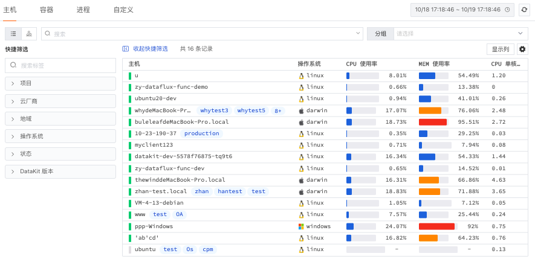

## 主机对象列表

通过主机对象列表，您可以查看当前空间内每个主机的数据信息，包括主机状态、主机名称、主机的CPU使用率、MEM使用率，CPU的单核负载等；支持为主机设置标签，并通过添加的标签筛选展示相同标签的主机列表。

### 主机状态

“观测云” 为方便您快速识别主机状态，主机数据被分为：online(在线）、offline(离线）。

- online状态下，数据状态显示为“绿色”，主机处于运行状态
- offline状态下，数据状态显示为“灰色”，主机处于离线状态

注意：

- 当主机 offline 状态时，cpu使用率、mem使用率、负载均不作显示，值填充为“ - ”
- 若主机超过 24 小时仍未有数据上报，该主机记录将会在列表中移除
### 
### 主机详情

#### 标签属性

点击主机对象列表中的主机名称，即可划出详情页为主机添加标签「Label 属性」。主机标签添加后，可在主机对象列表通过添加的标签筛选展示相同标签的主机列表。

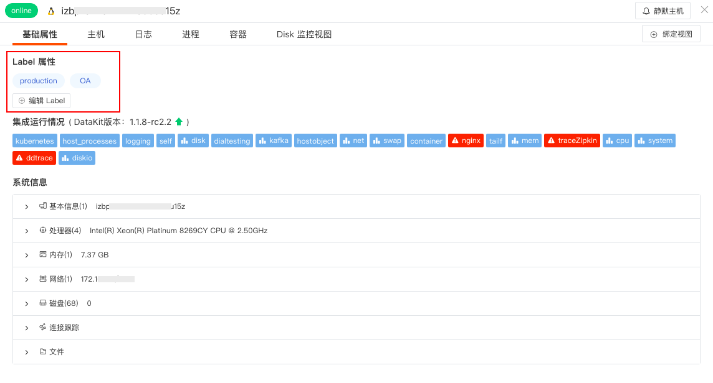

#### 集成运行情况

「集成运行情况」展示了该主机安装的 DataKit 版本信息和相关的采集器运行情况，运行情况共有两种状态：

- 正常运行状态的采集器，默认展示为 ‘浅蓝色’
- 发生错误的采集器，默认展示为 ‘红色’ 且支持点击查看错误信息。

同时，带 “视图符号” 的采集器（如下图）支持“查看监控视图”，点击「查看监控视图」即可查看相关内置视图。

#### 系统信息

在主机详情页可查看主机的系统信息，包括主机名称、操作系统、处理器、内存，网络，磁盘、连接跟踪、文件等。
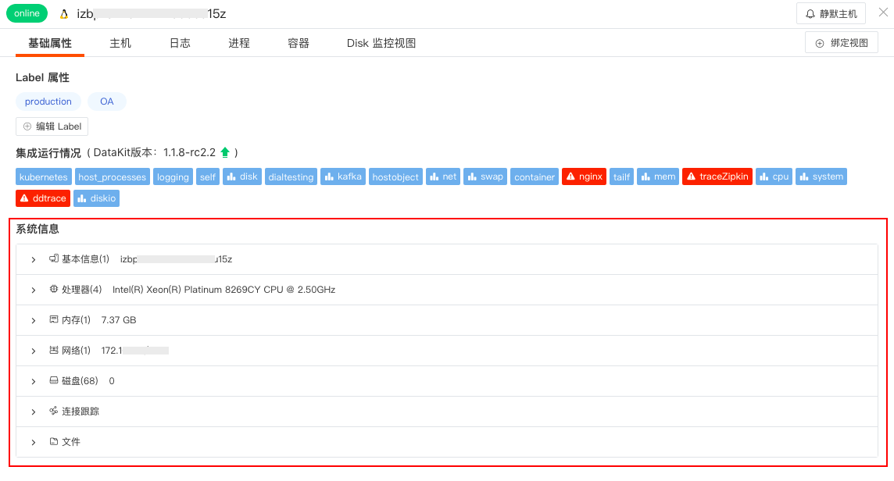

#### 云厂商信息

若主机是云主机且配置了 [「云同步」](https://www.yuque.com/dataflux/datakit/hostobject#031406b2)，点击列表中的主机名称即可划出查看云主机的「云厂商信息」，包括云平台、实例名、实例ID、实例规格、地域、可用区、创建时间、网络类型、付费类型、IP地址等。

#### 关联指标

在主机详情页，“观测云” 支持您通过详情页下方的「指标」实时监控**最近24小时内**主机的性能状态，包括CPU负载、内存使用等。

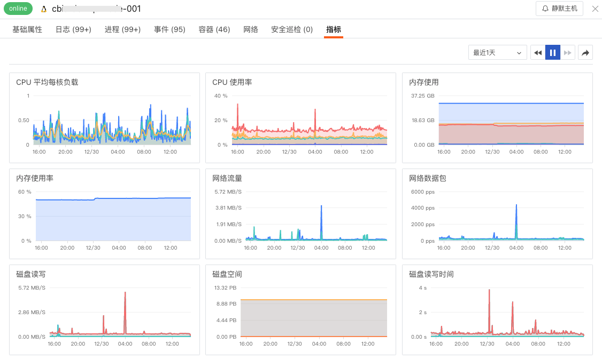

#### 关联日志

通过详情页下方的「日志」，您可以查看与该主机相关的**最近1小时**的日志及日志数量，并对这些相关日志进行关键字搜索、多标签筛选和时间排序。如需查看更详细的日志信息，您可以点击日志内容跳转到对应日志详情页面，或点击「跳转」至「日志」查看与该主机相关的全部日志。

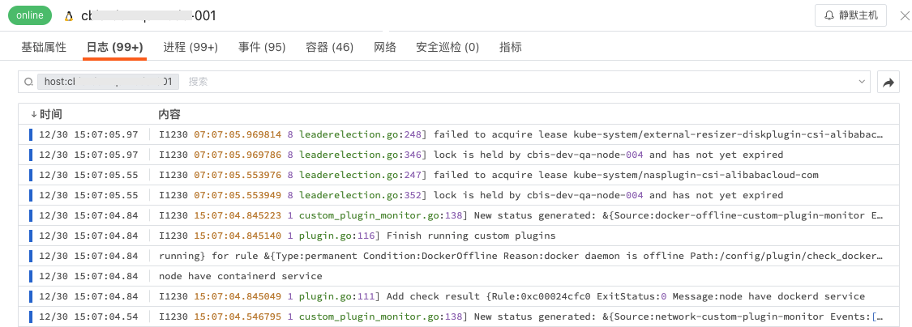

#### 关联进程

通过详情页下方的「进程」，您可以查看与该主机相关的**最近十分钟**的进程及进程数量，并对这些相关进程进行关键字搜索、多标签筛选和数据排序。如需查看更详细的进程信息，您可以点击进程内容跳转到对应进程详情页面，或点击「跳转」至「进程」查看与该主机相关的全部进程。

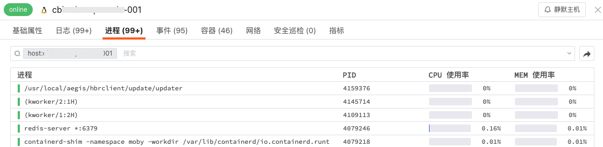

#### 关联事件

通过详情页下方的「事件」，您可以查看与该主机相关的**最近1小时**的告警事件（关联字段：host），并对这些相关事件进行关键字搜索、多标签筛选和数据排序。如需查看更详细的事件信息，您可以点击事件内容跳转到对应事件详情页面，或点击「跳转」至「事件」查看与该主机相关的全部事件。

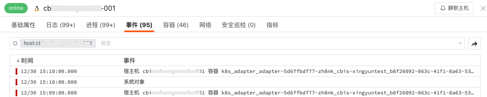

#### 关联容器

通过详情页下方的「容器」，您可以查看**最近十分钟内**与该主机相关的全部容器 （Container）数据，并对这些相关容器进行关键字搜索、多标签筛选和数据排序。如需查看更详细的容器信息，您可以点击容器跳转到对应容器详情页面，或点击「跳转」至「容器」查看与该主机相关的全部容器。

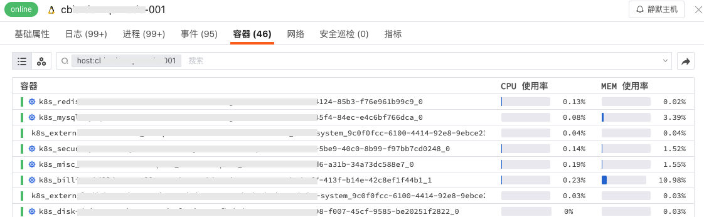

#### 关联安全巡检

通过详情页下方的「安全巡检」，您可以查看**最近一天内**与该主机相关的安全巡检数据，并对这些安全巡检数据进行关键字搜索、多标签筛选和数据排序。如需查看更详细的安全巡检信息，您可以点击安全巡检数据即可跳转到对应安全巡检详情页面，或点击「跳转」至「安全巡检」查看与该主机相关的全部安全巡检数据。

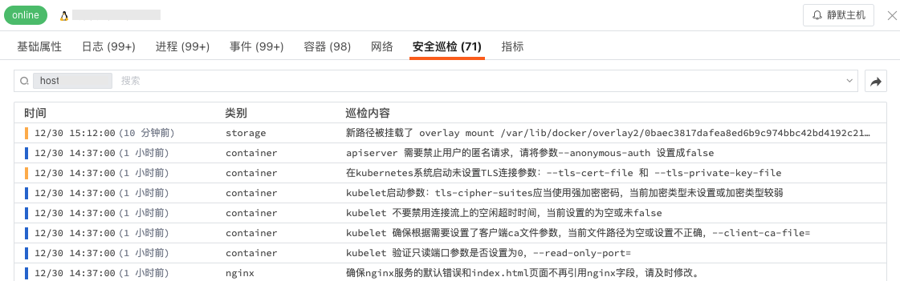

#### 主机网络

主机网络支持查看主机之间的网络流量。支持基于 IP/端口查看源主机到目标之间的网络流量和数据连接情况，通过可视化的方式进行实时展示，帮助企业实时了解业务系统的网络运行状态，快速分析、追踪和定位问题故障，预防或避免因网络性能下降或中断而导致的业务问题。

主机网络数据采集成功后会上报到观测云控制台，在「基础设施」-「主机」详情页中的「网络」，您可以查看到工作空间内全部网络性能监测数据信息。

注意：

- 目前仅支持 Linux 系统，且除 CentOS 7.6+ 和 Ubuntu 16.04 以外，其他发行版本需要 Linux 内核版本高于 4.0.0。
- 主机网络流量数据默认保存最近48小时，体验版默认保存最近24小时；
- 在主机详情页点击进入「网络」，时间控件默认获取最近 15 分钟的数据且不支持自动刷新，需手动点击刷新获取新的数据；
- 目前支持基于 TCP、UDP 协议的网络性能监测。配合 incoming 和 outgoing ，分成 6 种组合选择：
   - incoming + 不区分协议
   - incoming + tcp 协议
   - incoming + udp 协议
   - outgoing + 不区分协议
   - outgoing + tcp 协议
   - outgoing + udp 协议

##### 参数说明
| 参数 | 说明 | 统计方式 |
| --- | --- | --- |
| IP/端口 | 目标基于IP+端口做聚合，最多返回100条数据 | 按 IP/端口分组统计 |
| 发送字节数 | 源主机发送给目标字节数 | 所有记录发送字节数求和 |
| 接受字节数 | 源主机接收目标的字节数 | 所有记录接收字节数求和 |
| TCP 延时 | 源主机到目标的TCP延时 | 平均值 |
| TCP 波动 | 源主机到目标的TCP延时波动 | 平均值 |
| TCP 连接数 | 源主机到目标的TCP连接数 | 总和 |
| TCP 重传次数 | 源主机到目标的TCP重传次数 | 总和 |
| TCP 关闭次数 | 源主机到目标的TCP关闭次数 | 总和 |

##### 网络连接分析

“观测云”支持查看网络连接数据，包括源IP/端口、目标IP/端口、发送字节数、接收字节数、TCP延时、TCP重传次数等。同时，您还可以通过"设置"按钮自定义显示字段，或针对连接数据添加筛选条件，筛选所有字符串类型的keyword字段。如若您需要查看更详细网络连接数据，点击该数据即可查看其对应的网络流数据。

**注意**：自定义显示字段变更需要基于用户层级，非全局保存

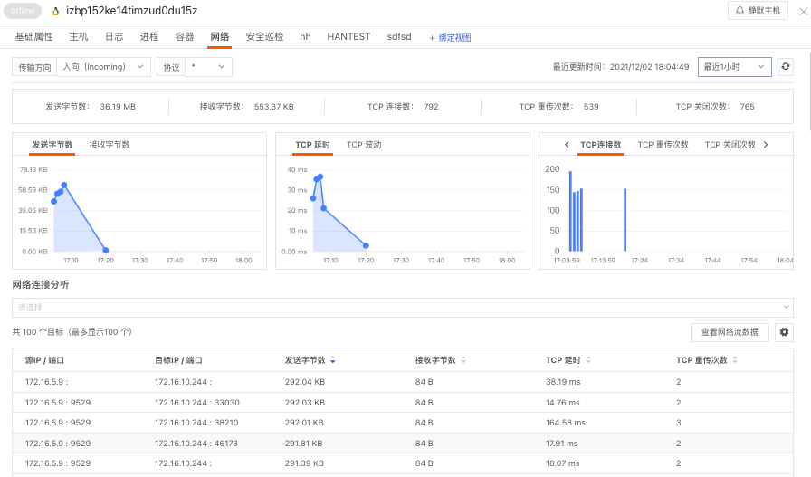

##### 网络流数据

“观测云”支持查看网络流数据，每30s自动刷新一次，默认展示最近2天数据，包括时间、源IP/端口、目标IP/端口、源主机、传输方向、协议等。同时，您还可以通过"设置"按钮自定义显示字段，或针对网络流数据添加筛选条件，筛选所有字符串类型的keyword字段。如若您需要查看关联的网络流数据，点击该数据即可查看对应主机、传输方向、协议等相关字段对应的其他网络流数据。

#### 主机静默

在主机详情页，您可以通过「主机静默」选择该主机的告警静默时间，即您在该时间里将不再收到与该主机相关的告警通知，产生的告警事件会存入事件管理。所有静默的主机列表可在「异常检测库」-「主机静默管理」中查看。详情参考文档 [告警设置](https://www.yuque.com/dataflux/doc/qxz5xz) 。

### 数据查询

进入「主机对象列表」页面，“观测云” 支持您通过搜索、筛选、排序、分组等方式查询和分析主机数据。

- 时间范围：主机对象列表默认为您展示最近24小时的主机数据，通过「刷新」按钮可以刷新至当前时间范围，重新获取数据列表
- 搜索筛选：通过列表上方的搜索和筛选栏，您可以基于标签、字段、文本（包含日志文本）进行关键词搜索、标签筛选、字段筛选、关联搜索
   - 输入框支持模糊匹配相关标签和字段
   - “abc：123”形式， 回车后支持字段的精确查询，在筛选栏中选择wildcard查询支持基于变量进行模糊查询
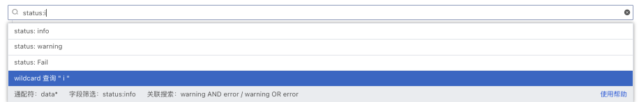
   - 输入框单击“tag" 后，支持标签筛选
   - 输入框输入文本，支持关键字搜索
   - " abc AND cba / abc OR cba" 形式，回车后支持关联搜索
- 排序：点击列表菜单，如：CPU使用率、MEM使用率、CPU单核负载，您可以基于选中的标签进行升降排序
- 快捷筛选：您可以通过勾选快捷筛选的字段快速筛选数据，支持自定义添加筛选字段，支持通过“反选”进行快捷筛选，支持通过“重置”快速清除快捷筛选条件。使用“鼠标悬停”，在快捷筛选可查看字段的完整内容

注意：搜索支持多个关键词搜索，只需要输入对应的关键词，使用空格或者逗号隔开即可。（当前搜索多个关键词时采用的是AND逻辑，输入的关键词越多数据匹配的范围越精准。）

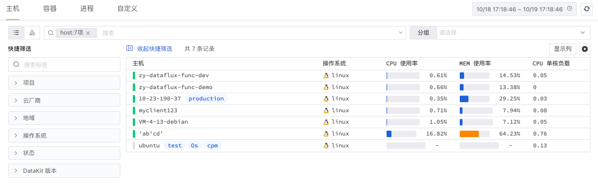

### 分组排行榜

“观测云” 支持您通过分组功能，基于一个或多个标签对数据进行聚合分析。聚合的结果将依据现有数据分组自大到小展示前十名（Top10）。

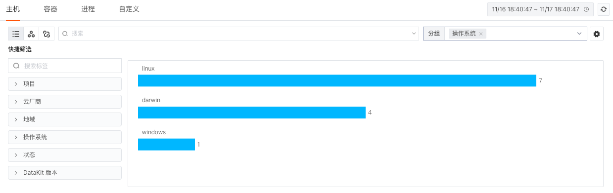

点击分组右侧的"设置"按钮，可自定义添加分组标签，添加完成后，可选择按照添加分组标签进行分组聚合展示。
注意：自定义分组标签仅管理员可添加。

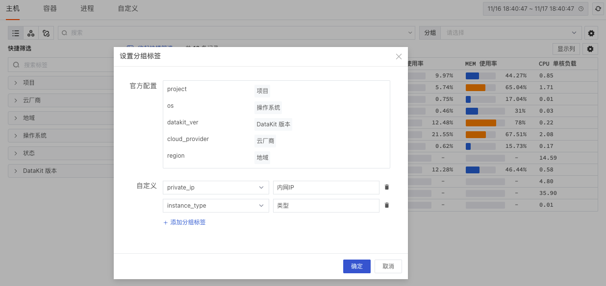

通过点击分组，您可以查看该分组对应的主机数据集合，即以该分组对应的分组标签筛选出来的查询结果。例如：以“操作系统”为分组筛选条件，点击”Linux“分组，即可查看以Linux操作系统为标签，筛选出的主机数据。
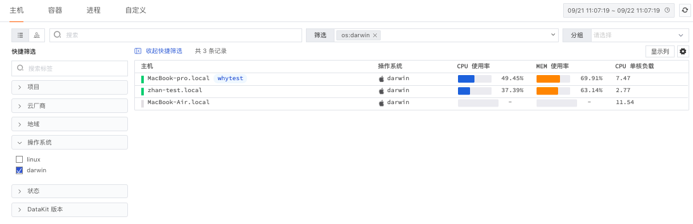

### 自定义显示列

在主机对象列表页面，您可通过「显示列」添加/删除显示列，自定义您的浏览体验。

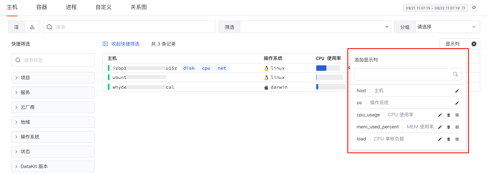

### 绑定内置视图

“观测云” 支持在观测云工作空间「管理」-「内置视图」，设置绑定或者删除内置视图（系统视图、用户视图）到主机详情页面。

完成内置视图的绑定后，在主机对象详情中可查看所绑定的内置视图。如：绑定了“CPU 监控视图“为内置视图，成员可以在详情页中查看当前主机做为视图变量的“CPU 监控视图”，并通过「跳转」按钮，点击跳转至对应的内置视图页面，对该内置视图进行编辑、复制和导出。

**注意：**绑定内置视图前，需要确认所绑定内置视图（系统视图、用户视图）中的视图变量是否存在与该对象分类相关的字段，如`host`。更多配置详情，可参考[绑定内置视图](https://www.yuque.com/dataflux/doc/dns233/)。

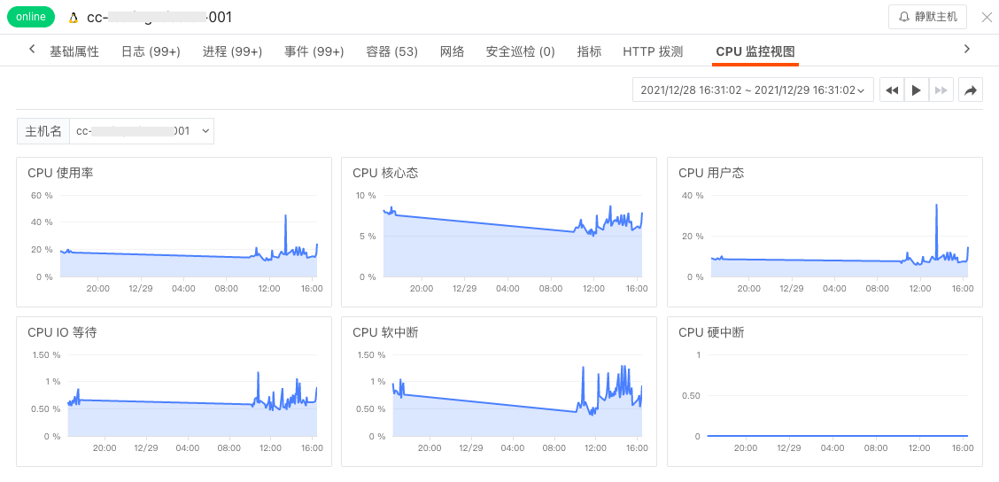

### 数据导出

“观测云” 支持您通过「设置」导出当前主机列表的数据为CSV文件或者视图。

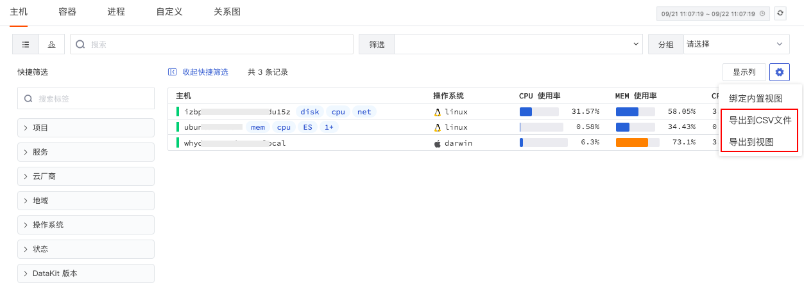

您可以保存当前列表为CSV文件到本地（如图：导出的CSV文件）。

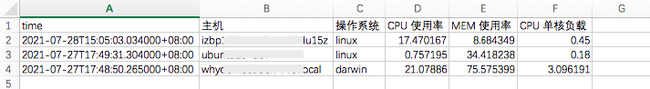

您也可以保存当前列表为视图到「场景」（如图：导出到「场景」视图）。

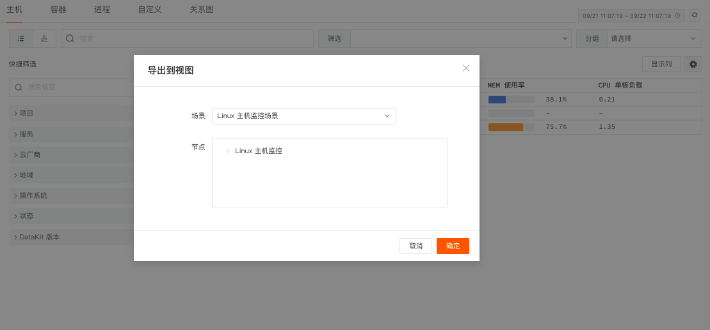

导出的主机数据以视图的方式添加到对应的场景中进行查看和分析。

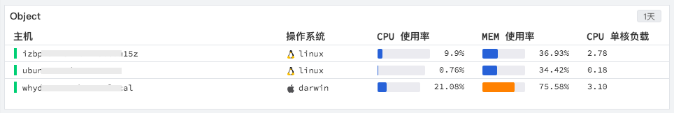

### 
## 主机拓扑图

通过「主机拓扑图」，您能够可视化查询主机的指标数据大小，进而快速分析不同系统、不同状态、不同版本、不同地区等自定义标签下的主机的运行状态。

- 搜索与筛选：通过列表上方的搜索和筛选栏，您可以基于标签、字段、文本（包含日志文本）进行关键词搜索、标签筛选、字段筛选、关联搜索
   - 输入框支持模糊匹配相关标签和字段
   - “abc：123”形式， 回车后支持字段筛选
   - 输入框单击“tag" 后，支持标签筛选
   - 输入框输入文本，支持关键字搜索
   - " abc AND cba / abc OR cba" 形式，回车后支持关联搜索
- 分组：您可以通过添加一个或多个分组标签重新组合主机对象
- 填充：您可以通过「填充」自定义填充指标，填充指标值的大小将决定填充的图例颜色。支持选择 CPU 使用率、MEM 使用率、CPU 单核负载三种指标填充方式。
- 自定义区间：您可以开启「自定义区间」为选择的填充指标自定义图例颜色区间范围。图例的颜色将依据图例的最大和最小值等分为5个区间，每个区间将自动对应五个不同的颜色。
- 鼠标悬停：悬停鼠标至主机对象，可查看主机的名称、CPU 使用率和 MEM 使用率。

---

观测云是一款面向开发、运维、测试及业务团队的实时数据监测平台，能够统一满足云、云原生、应用及业务上的监测需求，快速实现系统可观测。**立即前往观测云，开启一站式可观测之旅：**[www.guance.com](https://www.guance.com)

