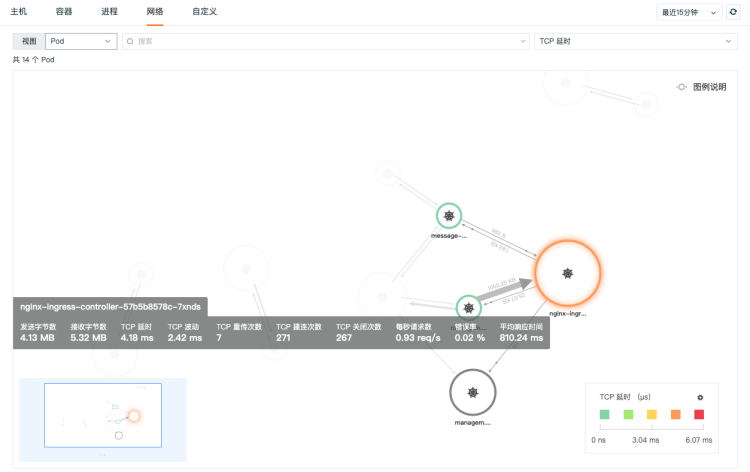
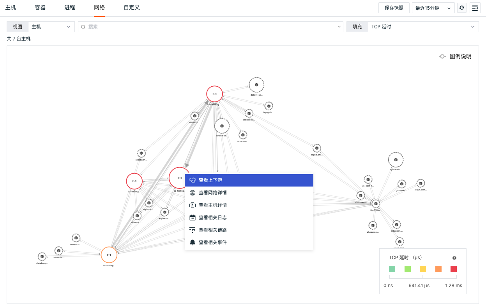
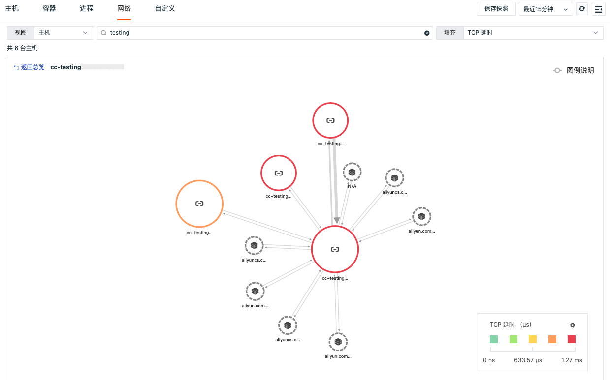

# 网络
---

## 简介

网络支持查看主机/容器 Pod 之间的网络流量。支持基于 IP/端口查看源 IP 到目标 IP 之间的网络流量和数据连接情况，通过可视化的方式进行实时展示，帮助企业实时了解业务系统的网络运行状态，快速分析、追踪和定位问题故障，预防或避免因网络性能下降或中断而导致的业务问题。

## 前提条件

你需要先创建一个 [观测云账号](https://auth.guance.com/register?channel=帮助文档)，并在你的主机上 [安装 DataKit](../datakit/datakit-install.md)，开启 [eBPF 采集器](../integrations/ebpf.md)。

## 网络性能详情

### 主机

主机网络数据采集成功后会上报到观测云控制台，您可以通过「基础设施」-「主机」详情页中的「网络」，查看到主机的网络性能监测数据信息。更多详情可参考 [主机网络](host.md) 。

### Pod

Pod 网络数据采集成功后会上报到观测云控制台，您可以通过「基础设施」-「容器」-「Pod」详情页中的「网络」，查看到 Pod 的网络性能监测数据信息。更多详情可参考 [Pod 网络](contrainer.md) 。

### Deployment

Deployment 网络数据采集成功后会上报到观测云控制台，您可以通过「基础设施」-「容器」-「Deployments」详情页中的「网络」，查看 Deployment 的网络性能监测数据信息。更多详情可参考 [Deployment 网络](contrainer.md) 。

## 网络 Map

### 主机
在「基础设施」-「网络」，选择「主机」，即可查看主机网络分布情况。在「主机网络 Map」，您能够可视化查询当前工作空间主机与主机之间的网络流量，快速分析不同主机之间的 TCP延迟、TCP波动、TCP重传次数、TCP建连次数以及 TCP关闭次数。

- 时间控件：默认获取最近 48 小时的数据且不支持自动刷新，需手动点击刷新获取新的数据；
- 搜索和筛选：您可以快速基于关键词模糊匹配搜索主机名称；或基于筛选 Tag 标签显示主机节点及其关联关系。
- 填充：您可以通过「填充」自定义填充主机节点，填充值的大小及自定义区间将决定填充的主机节点颜色。支持选择 TCP延迟、TCP波动、TCP重传次数、TCP建连次数以及 TCP关闭次数多种填充指标。
- 主机节点：
   - 主机节点的图标分成普通主机和云主机，云主机显示为云服务厂商的 Logo；
   - 主机节点边缘颜色根据填充的字段数值及自定义区间显示对应区段的颜色；
   - 主机节点之间通过连线表示网络流量，连线为双向曲线，显示源主机到目标主机的incoming / outgoing方向的流量；
   - 主机节点大小的显示根据当前节点的入向流量大小，确定节点的尺寸大小；
   - 主机节点粗细的显示根据获取节点的出入向流量数据大小，确定连线的粗细。
- 自定义区间：您可以开启「自定义区间」为选择的填充指标自定义图例颜色区间范围。图例的颜色将依据图例的最大值和最小值等分为 5 个区间，每个区间将自动对应五个不同的颜色，不在数据区间范围内的连线和节点置灰显示。	
- 鼠标悬停：悬停鼠标至主机对象节点，可查看发送字节数、接收字节数、TCP延迟、TCP波动、TCP重传次数、TCP建连次数以及 TCP关闭次数。

注意：若目标主机不在当前工作空间但是目标域名存在且目标域名的端口小于 10000 ，则目标域名会在拓扑图中显示。

### Pod

在「基础设施」-「网络」，选择「Pod」即可查看 Pod 网络分布情况。在「Pod 网络 Map」，您能够可视化查询当前工作空间 Pod 与 Pod 之间的网络流量，快速分析不同 Pod 之间的 TCP延迟、TCP波动、TCP重传次数、TCP建连次数、TCP关闭次数、发送字节数、接收字节数、每秒请求数、错误率以及平均响应时间。

- 时间控件：默认获取最近 15 分钟的数据且不支持自动刷新，需手动点击刷新获取新的数据；
- 搜索和筛选：你可以快速基于关键词模糊匹配搜索 Pod 名称；或基于筛选标签显示 Pod 及其关联关系。
- 填充：你可以通过「填充」自定义填充主机节点，填充值的大小及自定义区间将决定填充的主机节点颜色。支持选择 TCP延迟、TCP波动、TCP重传次数、TCP建连次数、TCP关闭次数、发送字节数、接收字节数、每秒请求数、错误率以及平均响应时间等七层网络填充指标。
- Pod 节点：
   - Pod 节点边缘颜色根据填充的字段数值及自定义区间显示对应区段的颜色；
   - Pod 节点之间通过连线表示网络流量，连线为双向曲线，显示源 Pod 到目标 Pod 的incoming / outgoing方向的流量；
   - Pod 节点大小的显示根据当前节点的入向流量大小，确定节点的尺寸大小；
   - Pod 节点粗细的显示根据获取节点的出入向流量数据大小，确定连线的粗细。
- 自定义区间：你可以开启「自定义区间」为选择的填充指标自定义图例颜色区间范围。图例的颜色将依据图例的最大值和最小值等分为 5 个区间，每个区间将自动对应五个不同的颜色，不在数据区间范围内的连线和节点置灰显示。	
- 鼠标悬停：悬停鼠标至 Pod 节点，可查看发送字节数、接收字节数、TCP延迟、TCP波动、TCP重传次数、TCP建连次数、TCP关闭次数、发送字节数、接收字节数、每秒请求数、错误率以及平均响应时间。

### Deployment

在「基础设施」-「网络」，选择「Deployment」即可查看 Deployment 网络分布情况。在「Deployment 网络 Map」，您能够可视化查询当前工作空间 Deployment 之间的网络流量，快速分析不同 Deployment 之间的 TCP延迟、TCP波动、TCP重传次数、TCP建连次数、TCP关闭次数、发送字节数、接收字节数、每秒请求数、错误率以及平均响应时间。

- 时间控件：默认获取最近 15 分钟的数据且不支持自动刷新，需手动点击刷新获取新的数据；
- 搜索和筛选：你可以快速基于关键词模糊匹配搜索 Deployment 名称；或基于筛选标签显示 Deployment 及其关联关系。
- 填充：你可以通过「填充」自定义填充主机节点，填充值的大小及自定义区间将决定填充的主机节点颜色。支持选择 TCP延迟、TCP波动、TCP重传次数、TCP建连次数、TCP关闭次数、发送字节数、接收字节数、每秒请求数、错误率以及平均响应时间等七层网络填充指标。
- Deployment 节点：
   - Deployment 节点边缘颜色根据填充的字段数值及自定义区间显示对应区段的颜色；
   - Deployment 节点之间通过连线表示网络流量，连线为双向曲线，显示源 Deployment 到目标 Deployment 的incoming / outgoing方向的流量；
   - Deployment 节点大小的显示根据当前节点的入向流量大小，确定节点的尺寸大小；
   - Deployment 节点粗细的显示根据获取节点的出入向流量数据大小，确定连线的粗细。
- 自定义区间：你可以开启「自定义区间」为选择的填充指标自定义图例颜色区间范围。图例的颜色将依据图例的最大值和最小值等分为 5 个区间，每个区间将自动对应五个不同的颜色，不在数据区间范围内的连线和节点置灰显示。	
- 鼠标悬停：悬停鼠标至 Deployment 节点，可查看发送字节数、接收字节数、TCP延迟、TCP波动、TCP重传次数、TCP建连次数、TCP关闭次数、发送字节数、接收字节数、每秒请求数、错误率以及平均响应时间。

## 关联查询

您可以点击主机/Pod/Deployment 图标进行关联查询，支持查看上下游、网络详情、 主机/Pod/Deployment 详情、关联日志、关联链路以及关联事件。

### 查看上下游

在基础设施网络，点击主机/Pod/Deployment 图标，点击“查看上下游”，即可查看当前节点的上下游节点关联。

点击左上角“返回总览”可返回到原网络 Map，在搜索框进行搜索或筛选可过滤关联的上下游节点，根据搜索或筛选的结果显示匹配的关联上下游节点。

