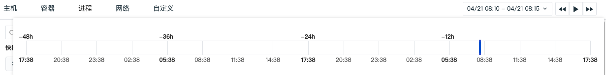

# 进程
---

## 简介

进程数据采集成功后会上报到观测云控制台，在「基础设施」的「进程」，您可以查看当前工作空间内**最近10分钟**的全部进程数据信息。

## 查询与分析

进入「进程」查看器，“观测云” 支持您通过搜索关键字，添加标签筛选，排序等方式查询进程数据。

#### 时间控件

进程列表支持查看**最近十分钟内**采集的进程数据，通过「播放」按钮可以刷新至当前时间范围，重新获取数据列表。点击时间范围可查看进程回放：

- 拖动后，刷新暂停，时间显示为：[ 开始时间-结束时间 ]，查询的时间范围为5分钟；
- 拖动后，查询的是历史进程数据；
- 拖动后，点击「播放」按钮或刷新页面，回到查看「最近10分钟」的进程。

#### 搜索与筛选

在查看器搜索栏，支持关键字搜索、通配符搜索、关联搜索、JSON 搜索等多种搜索方式，支持通过 `标签/属性` 进行值的筛选，包括正向筛选、反向筛选、模糊匹配、反向模糊匹配、存在和不存在等多种筛选方式。更多搜索与筛选可参考文档 [查看器的搜索和筛选](../getting-started/necessary-for-beginners/explorer-search.md) 。

#### 快捷筛选

在查看器快捷筛选，支持编辑“快捷筛选”，添加新的筛选字段。添加完成后，可以选择其字段值进行快捷筛选。更多快捷筛选可参考文档 [快捷筛选](../getting-started/necessary-for-beginners/explorer-search.md#quick-filter) 。

#### 自定义显示列

在进程列表页面，“观测云” 默认为您展示 PID、用户、主机等信息。可通过「显示列」自定义添加、编辑、删除、拖动显示列。当鼠标悬浮 Hover 在查看器显示列上时，点击「 :material-cog: 设置」按钮，支持对显示列进行升序、降序、向左移动列、向右移动列、向左添加列、向右添加列、替换列、添加到快捷筛选、添加到分组、移除列等操作。更多自定义显示列可参考文档 [显示列说明](../getting-started/necessary-for-beginners/explorer-search.md#columns) 。

#### 排序

鼠标悬浮 Hover 至列表菜单，点击“ :fontawesome-solid-sort: 排序” 可以基于选中的标签进行升降排序。

#### 分组排行榜

观测云支持您通过分组功能，基于一个或多个标签对数据进行相关聚合，聚合的结果将显示分组排行榜 Top10。

- 点击分组排行榜，即可查看对应分组里的进程对象数据

- 点击分组右侧的“ :material-cog: 设置”按钮，可自定义添加分组标签，添加完成后，可选择按照添加分组标签进行分组聚合展示。

**注意：自定义分组标签仅管理员可添加。**

#### 数据导出

在进程列表中，观测云支持您通过「 :material-cog: 设置」导出当前进程列表的数据为 CSV 文件或者场景仪表板和笔记。

## 进程详情页

点击进程列表中的进程名称，即可划出详情页查看进程对象的详细信息，包括进程所属的对象、Label 属性、其他扩展属性，以及关联的指标、日志、主机、网络等。

### 关联分析

观测云支持对每一个进程进行关联分析。在进程的详情页，您不仅能够了解进程的基本信息，还可以**一站式关联对应进程的指标、日志、主机、网络等，更快更全面的监测进程运行情况**。

#### 关联主机查询

点击进程详情页的主机标签，您还可以对与进程关联的主机的相关数据进行查询。

- “筛选字段值”，即添加该字段至查看器，查看与该字段相关的全部数据
- “反向筛选字段值”，即添加该字段至查看器，查看除了该字段以外的其他数据
- “添加到显示列”，即添加该字段到查看器列表进行查看
- “复制”，即复制该字段至剪贴板 
- “查看相关日志”，即查看与该主机相关全部日志
- “查看相关容器”，即查看与该主机相关全部容器
- “查看相关进程”，即查看与该主机相关全部进程
- “查看相关链路”，即查看与该主机相关全部链路
- “查看相关巡检”，即查看与该主机相关全部巡检数据

#### 关联指标/日志/主机

在详情页下方，切换内容标签您可以

- 通过「指标」查看该进程的CPU使用率、内存使用率、打开的文件数等
- 通过「日志」查看与该进程相关的**最近1小时内**的全部日志
- 通过「主机」查看相关主机的基本信息和该主机**最近24小时内**指标数据

=== "指标"

    在进程详情页，“观测云” 支持您通过详情页的「进程」实时监控**最近24小时内**进程的性能状态，包括CPU使用率、内存使用率、打开的文件数等。
    注意：进程指标数据默认不自动开启采集，需要手动配置进程采集器开启进程指标的采集，开启方式可参考文档 [进程](../datakit/host_processes.md) 。进程指标数据开启采集后，下图中的指标才会展示数据。

=== "日志"

    通过详情页下方的「日志」，您可以查看与该进程相关的**最近1小时**的日志，并对这些相关日志进行关键字搜索、多标签筛选和时间排序。
    如需查看更详细的日志信息，您可以点击日志内容跳转到对应日志详情页面。或点击「跳转」至「日志」查看与该进程相关的全部日志。

=== "主机"

    “观测云” 支持您通过详情页下方的「主机」，查看相关主机（关联字段：host）的基本信息和**在选定时间组件范围内**的性能指标状态。
    注意：在进程详情中查看相关主机，需要匹配字段“host”，否则无法在进程详情查看到相关主机的页面。
    - 属性视图：包括主机的基本信息、集成运行情况，若开启云主机的采集，还可查看云厂商的信息。
    - 指标视图：可查看默认24小时内，相关主机的CPU、内存等性能指标视图。点击「打开该视图」至内置视图，可通过克隆的方式对主机视图进行自定义修改，并作为用户视图保存，用户视图可通过绑定在进程详情页查看，更多配置详情，可参考[绑定内置视图](../management/built-in-view/bind-view.md)。

#### 自定义内置视图

“观测云” 支持自定义绑定内置视图到查看器。通过「内置视图」的绑定功能，您可以自定义进程对象的相关内容，并创建绑定关系。更多配置详情，可参考[绑定内置视图](https://preprod-docs.cloudcare.cn/management/built-in-view/bind-view/)。

**注意：**绑定内置视图前，需要确认所绑定内置视图中的视图变量是否存在与该进程相关的字段，如`process_id`。

### 进程网络

进程网络支持查看主机和进程服务两个不同维度的网络流量。支持基于 IP/端口查看源主机/源进程服务到目标之间的网络流量和数据连接情况，通过可视化的方式进行实时展示，帮助企业实时了解业务系统的网络运行状态，快速分析、追踪和定位问题故障，预防或避免因网络性能下降或中断而导致的业务问题。

进程网络数据采集成功后会上报到观测云控制台，在「基础设施」-「进程」详情页中的「网络」，您可以查看基于主机或者进程服务的网络数据。

注意：

- 目前仅支持 Linux 系统，且除 CentOS 7.6+ 和 Ubuntu 16.04 以外，其他发行版本需要 Linux 内核版本高于 4.0.0。
- 主机/进程服务网络流量数据默认保存最近48小时，免费版默认保存最近24小时；
- 在进程详情页点击进入「网络」，时间控件默认获取最近 15 分钟的数据且不支持自动刷新，需手动点击刷新获取新的数据；
- 目前支持基于 TCP、UDP 协议的网络性能监测。配合 incoming 和 outgoing ，分成 6 种组合选择：
   - incoming + 不区分协议
   - incoming + tcp 协议
   - incoming + udp 协议
   - outgoing + 不区分协议
   - outgoing + tcp 协议
   - outgoing + udp 协议

#### 参数说明
| 参数 | 说明 | 统计方式 |
| --- | --- | --- |
| IP/端口 | 目标基于IP+端口做聚合，最多返回100条数据 | 按 IP/端口分组统计 |
| 发送字节数 | 源主机/进程服务发送给目标字节数 | 所有记录发送字节数求和 |
| 接受字节数 | 源主机/进程服务接收目标的字节数 | 所有记录接收字节数求和 |
| TCP 延时 | 源主机/进程服务到目标的TCP延时 | 平均值 |
| TCP 波动 | 源主机/进程服务到目标的TCP延时波动 | 平均值 |
| TCP 连接数 | 源主机/进程服务到目标的TCP连接数 | 总和 |
| TCP 重传次数 | 源主机/进程服务到目标的TCP重传次数 | 总和 |
| TCP 关闭次数 | 源主机/进程服务到目标的TCP关闭次数 | 总和 |

#### 网络连接分析

“观测云”支持在进程详情页查看网络连接数据，包括源IP/端口、目标IP/端口、发送字节数、接收字节数、TCP延时、TCP重传次数等。同时，您还可以通过"设置"按钮自定义显示字段，或针对连接数据添加筛选条件，筛选所有字符串类型的keyword字段。如若您需要查看更详细网络连接数据，点击该数据即可查看其对应的网络流数据。

**进程网络连接分析**
在进程详情页的网络，选择视图为“Pid”，可查看进程服务之间的网络连接情况。

**主机网络连接分析**
在进程详情页的网络，选择视图为“Host”，可查看主机之间的网络连接情况。

#### 48 小时网络数据回放

在进程网络，支持点击时间控件选择查看 48 小时网络数据回放。

- 时间范围：默认查看该日志前后 30 分钟的数据，若是当前发生的日志，默认查看最近 1 小时的数据；
- 支持任意拖动时间范围查看对应的网络流量；
- 拖动后，查询的是历史网络数据；
- 拖动后，点击「播放」按钮或刷新页面，回到查看「最近 1 小时」的网络数据。

#### 网络流数据

“观测云”支持在进程详情页查看网络流数据，每30s自动刷新一次，默认展示最近2天数据，包括时间、源IP/端口、目标IP/端口、源主机、传输方向、协议等。同时，您还可以通过"设置"按钮自定义显示字段，或针对网络流数据添加筛选条件，筛选所有字符串类型的keyword字段。如若您需要查看关联的网络流数据，点击该数据即可查看对应主机、传输方向、协议等相关字段对应的其他网络流数据。

