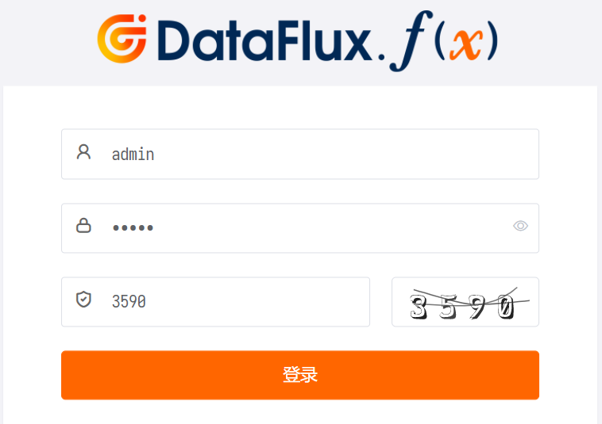
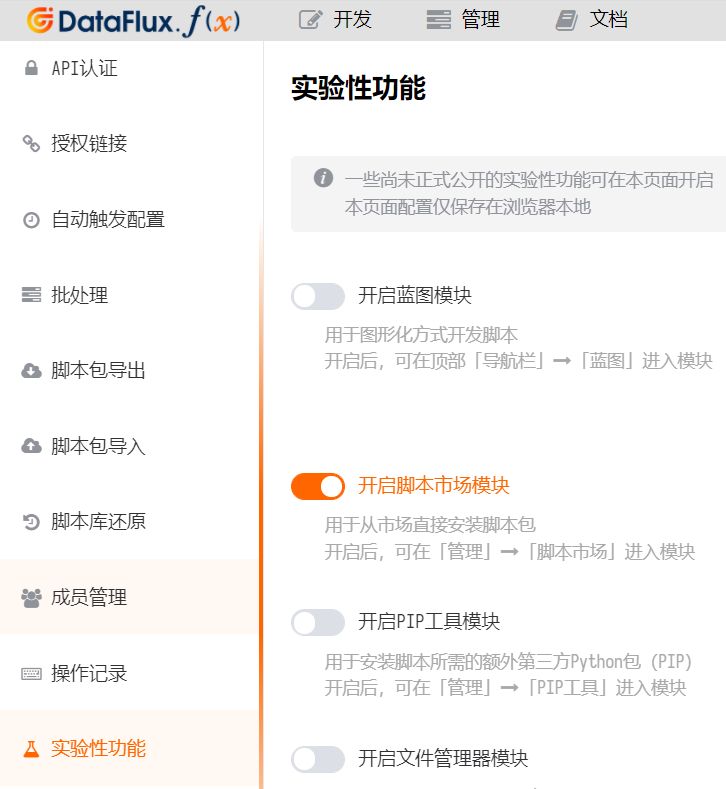
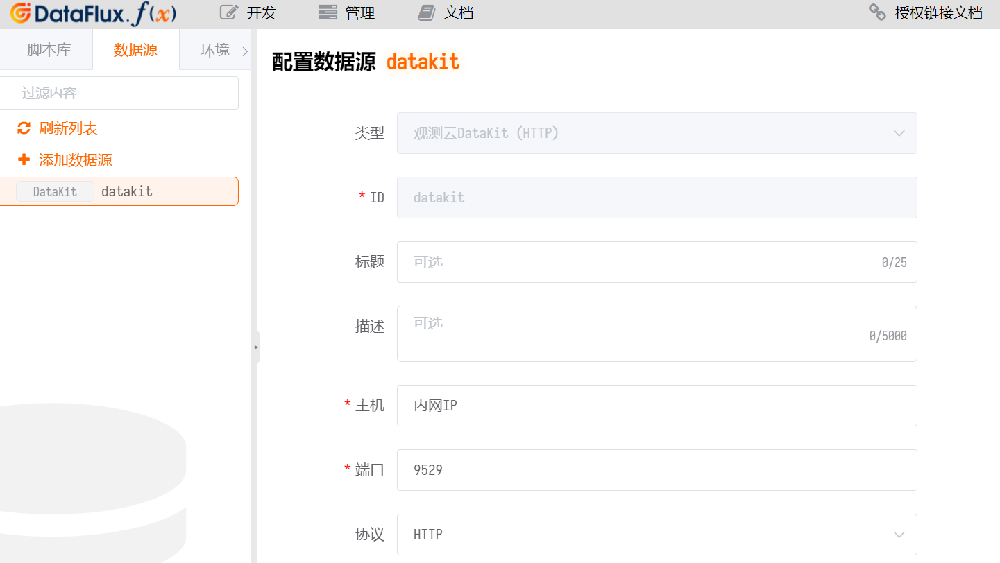

# CDN

---

## 视图预览

阿里云 CDN 性能指标展示，包括每秒访问次数、下行流量、边缘带宽、响应时间、回源带宽、状态码等。


## 版本支持

操作系统支持：Linux

## 前置条件

- 服务器 <[安装 DataKit](../../datakit/datakit-install.md)>
- 服务器 <[安装 DataFlux Func 携带版](../../dataflux-func/quick-start.md)>
- 阿里云 RAM 访问控制账号授权

### RAM 访问控制

1、登录 RAM 控制台 [https://ram.console.aliyun.com/users](https://ram.console.aliyun.com/users)<br />

2、新建用户：「人员管理」 - 「用户」 - 「创建用户」


3、保存或下载 **AccessKey** **ID** 和 **AccessKey Secret** 的 CSV 文件 (配置文件会用到)<br />

4、用户授权 「只读访问所有阿里云资源的权限」


## 安装配置

说明：

- 示例 Linux 版本为：CentOS Linux release 7.8.2003 (Core)
- 通过一台服务器采集所有阿里云 CDN 数据

### 部署实施

#### 脚本市场

1、登录 DataFlux Func ，地址 ``http://ip:8088``



2、开启脚本市场：「管理」 - 「实验性功能」 - 「开启脚本市场模块」



3、**依次添加**三个脚本集<br />

（1）观测云集成（核心包）<br />
（2）观测云集成（阿里云 - 云监控）<br />
（3）观测云集成（阿里云 - CDN）

> **注意：**在安装核心包后，系统会提示安装第三方依赖包，按照正常步骤点击安装即可。


4、脚本安装完成后，可以在「脚本库」中看到所有脚本集


#### 添加脚本

1、「开发」 - 「脚本库」 - 「添加脚本集」


2、点击上一步添加的「脚本集」 - 「添加脚本」


3、创建 ID 为 main 的脚本


4、添加代码

- 需要修改账号配置 `AccessKey ID` 、 `AccessKey Secret` 、 `Account Name`

```bash
from guance_integration__runner import Runner        # 引入启动器
import guance_aliyun_cdn__main as aliyun_cdn         # 引入阿里云NAT采集器
import guance_aliyun_monitor__main as aliyun_monitor # 引入阿里云云监控采集器

# 账号配置
account = {
    'ak_id'     : 'AccessKey ID',
    'ak_secret' : 'AccessKey Secret',
    'extra_tags': {
        'account_name': 'Account Name',
    }
}

# 由于采集数据较多，此处需要为函数指定更大的超时时间（单位秒）
@DFF.API('执行云资产同步', timeout=300)
def run():
    # 采集器配置
    common_aliyun_configs = {
        'regions': [ 'cn-hangzhou' ], #阿里云CDN对应的地域
    }
    monitor_collector_configs = {
        'targets': [
            { 'namespace': 'acs_cdn', 'metrics': 'ALL' }, # 采集云监控中CDN所有指标
        ],
    }

    # 创建采集器
    collectors = [
        aliyun_cdn.DataCollector(account, common_aliyun_configs),
        aliyun_monitor.DataCollector(account, monitor_collector_configs),
    ]

    # 启动执行
    Runner(collectors).run()
```

5、「保存」 配置并 「发布」


#### 定时任务

1、添加自动触发任务：「管理」 - 「自动触发配置」 - 「新建任务」


2、自动触发配置：在「执行函数」中添加此脚本，执行频率为 **5 分钟 _/5 _ \* \* \* **

> **注意：**1 分钟会被阿里限流


3、指标预览


## 场景视图

<场景 - 新建仪表板 - 模板库 - 系统视图 - 阿里云 CDN 监控视图>

## 指标详解

<[阿里云 CDN 指标列表](https://help.aliyun.com/document_detail/162873.htm?spm=a2c4g.11186623.0.0.43b973c2ZMvsUt#concept-2482416)>

## 常见问题排查

- 查看日志：DataFlux Func 日志路径 `/usr/local/dataflux-func/data/logs/dataflux-func.log`
- 代码调试：选择主函数，直接运行 (可以看到脚本输出)


- 连接配置：DataFlux Func 无法连接 DataKit，请检查数据源配置



## 进一步阅读

<[DataFlux Func 阿里云-云监控配置手册](../../dataflux-func/script-market-guance-aliyun-monitor.md)>
