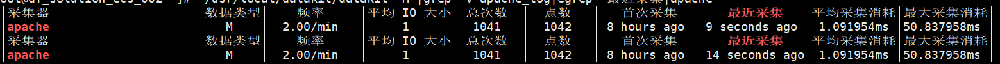
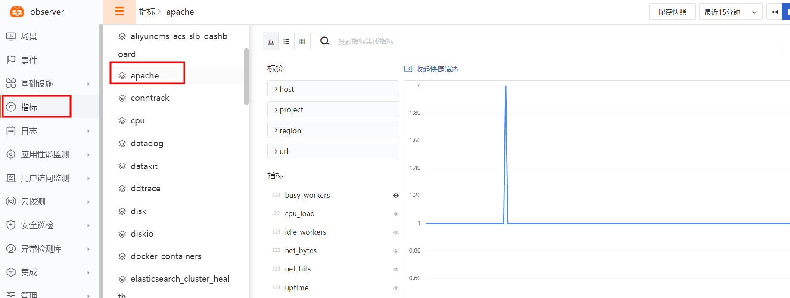

{{.CSS}}
# Apache
---

- DataKit 版本：{{.Version}}
- 操作系统支持：`{{.AvailableArchs}}`

Apache 采集器可以从 Apache 服务中采集请求数、连接数等，并将指标采集到观测云，帮助监控分析 Apache 各种异常情况。

## 视图预览
Apache 性能指标展示：包括繁忙进程，空闲进程，进程 CPU 负载，每秒请求数，每秒服务字节数等


## 前置条件

- Apache 服务器 <[安装 Datakit](datakit-install)>
- Apache 应用已安装 mod_status 模块
1. 使用命令查看 mod_status 是否安装 (已安装返回 status_module shared)
```
apachectl -M |grep status
```

## 安装配置
说明：示例 Apache 版本为：Linux 环境 Apache/2.4.6 (CentOS)，各个不同版本指标可能存在差异

### 部署实施

#### 指标采集 (必选)

1. 开启 Apache mod_status 页面，修改 Apache 主配置文件 /etc/httpd/conf/httpd.conf (以实际路径为准)，最后追加 ExtendedStatus 配置
```
ExtendedStatus On
<location /server-status>
    SetHandler server-status
    Order Allow,Deny
    Allow from all
</location>
```

2. 重启 Apache
```
apachectl restart
```

3. Apache 数据验证 (以实际服务端口为准)
```
curl http://127.0.0.1:80/server-status?auto
```
Apache 性能数据示例
```
Total Accesses: 279276
Total kBytes: 218374
CPULoad: .0015029
Uptime: 1041323
ReqPerSec: .268193
BytesPerSec: 214.741
BytesPerReq: 800.695
BusyWorkers: 2
IdleWorkers: 8
```

4. 开启 Datakit Apache 插件，复制 sample 文件
```
cd /usr/local/datakit/conf.d/apache/
cp apache.conf.sample apache.conf
```

5. 修改 apache.conf 配置文件
```
vi apache.conf
```
参数说明

- url：apache mod_status 模块地址
- interval：数据采集频率
- username：用户名 (如果设置了安全认证，填写此项)
- password：密码 (如果设置了安全认证，填写此项)
- insecure_skip_verify：是否忽略安全验证 (如果是 https，请设置为 true)
```
[[inputs.apache]]
  url = "http://127.0.0.1/server-status?auto"
  # username = ""
  # password = ""
  interval = "60s"
  insecure_skip_verify = false
```

6. 重启 Datakit (如果需要开启日志，请配置日志采集再重启)
```
systemctl restart datakit
```

7. Apache 指标采集验证，使用命令
` /usr/local/datakit/datakit -M |egrep "最近采集|apache" `



8. 指标预览



#### 日志采集 (非必选)
参数说明

- files：日志文件路径 (通常填写访问日志和错误日志)
- pipeline：日志切割文件(内置)，实际文件路径 /usr/local/datakit/pipeline/apache.p
- 相关文档 <[DataFlux pipeline 文本数据处理](https://www.yuque.com/dataflux/datakit/pipeline)>
```
[inputs.apache.log]
files = ["/var/log/httpd/access_log","/var/log/httpd/error_log"]
pipeline = "apache.p"
```
重启 Datakit (如果需要开启自定义标签，请配置插件标签再重启)
```
systemctl restart datakit
```
Apache 日志采集验证
`/usr/local/datakit/datakit -M |egrep "最近采集|apache_log" `


日志预览


#### 插件标签 (非必选)
参数说明

- 该配置为自定义标签，可以填写任意 key-value 值
- 以下示例配置完成后，所有 apache 指标都会带有 app = oa 的标签，可以进行快速查询
- 相关文档 <[DataFlux Tag 应用最佳实践](best-practices/guance-skill/tag/)>
```
# 示例
[inputs.apache.tags]
   app = "oa"
```
重启 Datakit
```
systemctl restart datakit
```

## 场景视图
<场景 - 新建仪表板 - 内置模板库 - Apache 监控视图>

## 异常检测
<监控 - 从模板新建 - Apache 检测库>

## 指标集

以下所有数据采集，默认会追加名为 `host` 的全局 tag（tag 值为 DataKit 所在主机名），也可以在配置中通过 `[inputs.{{.InputName}}.tags]` 指定其它标签：

``` toml
 [inputs.{{.InputName}}.tags]
  # some_tag = "some_value"
  # more_tag = "some_other_value"
  # ...
```

{{ range $i, $m := .Measurements }}

### `{{$m.Name}}`

{{$m.Desc}}

-  标签

{{$m.TagsMarkdownTable}}

- 指标列表

{{$m.FieldsMarkdownTable}}

{{ end }} 


## 常见问题排查
<[无数据上报排查](why-no-data)>

`F：使用命令 apachectl -M |grep status 遇到提示信息`

```
httpd: Could not reliably determine the server's fully qualified domain name, using fe80::216:3eff:fe13:ec3. Set the 'ServerName' directive globally to suppress this message
```
Q：修改 Apache 主配置文件 /etc/httpd/conf/httpd.conf 里的 ServerName (以实际路径为准)

## 进一步阅读
<[Apache 常用配置](https://www.cnblogs.com/jxl1996/p/10119184.html)>


