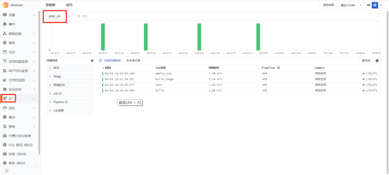
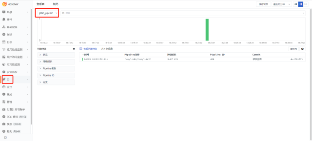
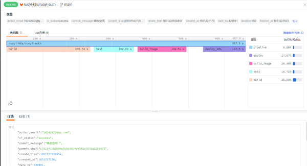

# GitLab

---

## 视图预览

GitLab 性能指标展示，包括请求持续时间、队列数量、队列耗时、 GC 耗时、事务耗时等。


## 版本支持

操作系统支持：Linux / Windows

## 安装部署

说明：示例 GitLab 版本为：v14.6.2(CentOS)，各个不同版本指标可能存在差异。

### 前置条件

- GitLab 所在服务器 <[安装 DataKit](../../datakit/datakit-install.md)>
- GitLab 已安装

### 配置实施

#### 指标采集 (必选)

1、 GitLab 开启数据采集功能

登录 GitLab ，点击【Admin Area】->【Settings】-> 【Metrics and profiling】
选中【Enable Prometheus Metrics】，点击【 Save change】。


2、 配置数据访问白名单

登录 GitLab 服务器，打开`gitlab.rb`文件，找到 `gitlab_rails['monitoring_whitelist'] = ['127.0.0.0/8', '::1/128']`，把 `::1/128` 改成服务器的内网地址。

```
vi /etc/gitlab/gitlab.rb
```


重启 GitLab

```
gitlab-ctl restart
```

3、 开启 GitLab 插件，复制 sample 文件

```
cd /usr/local/datakit/conf.d/gitlab
cp gitlab.conf.sample gitlab.conf
```

4、 修改 `gitlab.conf` 配置文件

```
vi gitlab.conf
```

```
[[inputs.gitlab]]
    ## param type: string - default: http://127.0.0.1:80/-/metrics
    prometheus_url = "http://127.0.0.1:80/-/metrics"

    ## param type: string - optional: time units are "ms", "s", "m", "h" - default: 10s
    interval = "10s"

    ## datakit can listen to gitlab ci data at /v1/gitlab when enabled
    enable_ci_visibility = true

    ## extra tags for gitlab-ci data.
    ## these tags will not overwrite existing tags.
    [inputs.gitlab.ci_extra_tags]
    # some_tag = "some_value"
    # more_tag = "some_other_value"

    ## extra tags for gitlab metrics
    [inputs.gitlab.tags]
    # some_tag = "some_value"
    # more_tag = "some_other_value"

```

参数说明

- url：GitLab 的 Promtheus 数据采集 url
- interval：采集指标频率，s 秒
- enable_ci_visibility：true 采集 gitlab ci 数据

5、 重启 DataKit (如果需要开启日志，请配置日志采集再重启)

```
systemctl restart datakit
```

指标预览


#### 插件标签 (非必选)

参数说明

- 该配置为自定义标签，可以填写任意 key-value 值
- 以下示例配置完成后，所有 GitLab 指标都会带有 `app = "oa"` 的标签，可以进行快速查询
- 相关文档 <[TAG 在观测云中的最佳实践](../../best-practices/insight/tag.md)>

```
    ## extra tags for gitlab metrics
    [inputs.gitlab.tags]
    # some_tag = "some_value"
    # more_tag = "some_other_value"

```

重启 DataKit

```
systemctl restart datakit
```

#### GitLab CI (非必选)

在 GitLab 中使用 Pipeline 部署项目，通过 DataKit 采集 Pipeline 指标，可以通过观测云可视化 CI 的步骤。<br />
依次进入 Projects -> Ruoyi Auth （请选择您的项目）-> Settings -> Webhooks


URL 中输入 DataKit 所在的主机 IP 和 DataKit 的 9529 端口，再加 /v1/gitlab。如下图。


选中 Job events 和 Pipeline events，点击 Add webhook。


点击刚才创建的 Webhooks 右边的 Test，选择 Pipeline events。


上方出现 HTTP 200，说明配置成功，如下图。


执行 Pipeline，登录观测云的 CI 模块查看。







## 场景视图

<场景 - 新建仪表板 - 模板库 - 系统视图 - Gitlab 监控视图>

## 监控规则

暂无

## [指标详解](/datakit/gitlab#measurements)

## 最佳实践

暂无

## 故障排查

<[无数据上报排查](../../datakit/why-no-data.md)>
