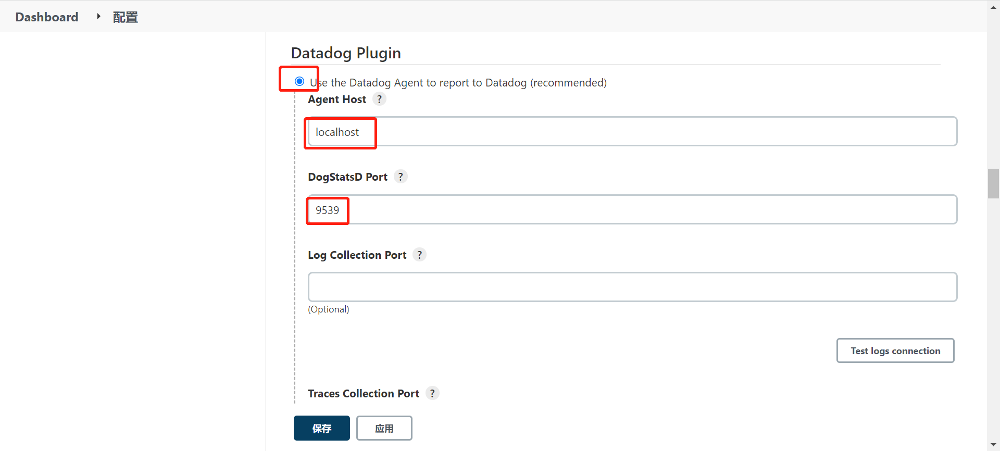
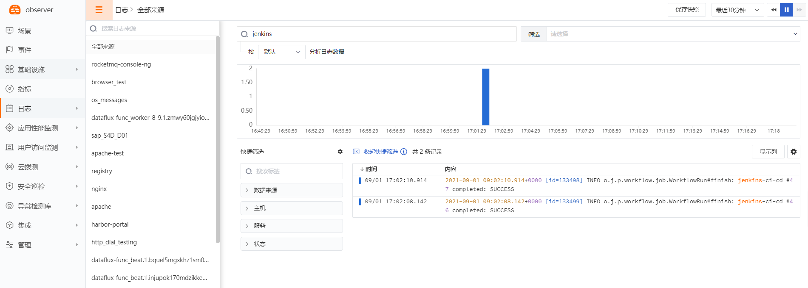

# Jenkins
---

操作系统支持：Linux / Windows

## 视图预览

Jenkins 性能指标展示：包括项目数量、构建数量、作业数量、空闲构建数量、正在构建数量、CPU 使用率、内存使用量等。


## 安装部署

说明：示例 Jenkins 版本为：jenkins-2.289.1(CentOS)，各个不同版本指标可能存在差异

### 前置条件

- Jenkins 所在服务器 <[安装 DataKit](../../datakit/datakit-install.md)>
- Jenkins 已安装

```
ps -ef | grep jenkins
```


### 配置实施

#### 指标采集 (必选)

1、 安装 Metrics Plugin

登录 Jenkins，点击【系统管理】->【插件管理】


点击【插件管理】->【可选插件】，输入 metric，点击【Install without restart】 


2、 生成 **Access keys**

点击【系统管理】->【系统配置】


找到 Metrics，点击【Generate...】->【新增】，记录下 Access keys


3、 开启 jenkins 插件，复制 sample 文件

```
cd /usr/local/datakit/conf.d/jenkins
cp jenkins.conf.sample jenkins.conf
```

4、 修改 jenkins.conf 配置文件

```
vi jenkins.conf
```

参数说明

- url：jenkins 的 url
- key：步骤 2 中生成的 key

```
[[inputs.jenkins]]
  ## The Jenkins URL in the format "schema://host:port",required
  url = "http://172.16.10.238:9290"

  ## Metric Access Key ,generate in your-jenkins-host:/configure,required
  key = "zItDYv9ClhSqM3sdfeeYcO1juiIeZEuh02bno_PyzphcGQWsUOsiafcyLs5Omyso2"
```

5、 重启 DataKit (如果需要开启日志，请配置日志采集再重启)

```
systemctl restart datakit
```

指标预览


#### Jenkins CI Visibility (非必选)

Jenkins 采集器可以通过接收 Jenkins datadog plugin 发出的 CI Event 实现 CI 可视化。

1、 jenkins.conf 文件配置监听端口，默认已配置了“:9539”，也可以使用其它未被占用的端口。


2、 登录 Jenkins，【系统管理】->【插件管理】->【可选插件】，输入 “Datadog”，在搜索结果中选择“Datadog”，点击下方的【Install without restart】。


3、 进入 Jenkins 的【系统管理】->【系统配置】，在 Datadog Plugin 输入项中，选择 “Use the Datadog Agent to report to Datadog ...”，**Agent Host** 填 DataKit 的地址，**DogStatsD Port** 和 **Traces Collection Port** 填 jenkins.conf 配置的监听端口，默认是 9539，勾选 `Enable CI Visibility`，点击【保存】。




4、 CI 预览

登录 Jenkins 执行**流水线**后，登录**观测云**，【CI】->【查看器】，选择 jenkins_pipeline 和 jenkins_job 查看 流水线执行情况。


#### 日志采集 (非必选)

参数说明

- files：日志文件路径 (通常填写访问日志和错误日志)
- pipeline：日志切割文件(内置)，实际文件路径 /usr/local/datakit/pipeline/jenkins.p
- 相关文档 <[ 文本数据处理（Pipeline）](../../datakit/pipeline.md)>

```
vi /usr/local/datakit/conf.d/jenkins/jenkins.conf
```
```
  [inputs.jenkins.log]
    files = ["/var/log/jenkins/jenkins.log"]
  # grok pipeline script path
    pipeline = "jenkins.p"
```
重启 DataKit (如果需要开启自定义标签，请配置插件标签再重启)
```
systemctl restart datakit
```

日志预览



#### 插件标签 (非必选)

参数说明

- 该配置为自定义标签，可以填写任意 key-value 值
- 以下示例配置完成后，所有 jenkins 指标都会带有 app = oa 的标签，可以进行快速查询
- 相关文档 <[TAG 在观测云中的最佳实践](../../best-practices/insight/tag.md)>

```
  [inputs.jenkins.tags]
  # some_tag = "some_value"
  # more_tag = "some_other_value"
  # ...
```

重启 DataKit

```
systemctl restart datakit
```

## 场景视图

<场景 - 新建仪表板 - 模板库 - 系统视图 - Jenkins 监控视图>

## 检测库

暂无

## 指标详解

### `jenkins`

- 标签

| 标签名 | 描述 |
| --- | --- |
| `metric_plugin_version` | jenkins plugin version |
| `url` | jenkins url |
| `version` | jenkins  version |


- 指标列表

| 指标 | 描述 | 数据类型 | 单位 |
| --- | --- | --- | --- |
| `executor_count` | The number of executors available to Jenkins | int | count |
| `executor_free_count` | The number of executors available to Jenkins that are not currently in use. | int | count |
| `executor_in_use_count` | The number of executors available to Jenkins that are currently in use. | int | count |
| `job_count` | The number of jobs in Jenkins | int | count |
| `node_offline_count` | The number of build nodes available to Jenkins but currently off-line. | int | count |
| `node_online_count` | The number of build nodes available to Jenkins and currently on-line. | int | count |
| `plugins_active` | The number of plugins in the Jenkins instance that started successfully. | int | count |
| `plugins_failed` | The number of plugins in the Jenkins instance that failed to start. | int | count |
| `project_count` | The number of project to Jenkins | int | count |
| `queue_blocked` | The number of jobs that are in the Jenkins build queue and currently in the blocked state. | int | count |
| `queue_buildable` | The number of jobs that are in the Jenkins build queue and currently in the blocked state. | int | count |
| `queue_pending` | Number of times a Job has been Pending in a Queue | int | count |
| `queue_size` | The number of jobs that are in the Jenkins build queue. | int | count |
| `queue_stuck` | he number of jobs that are in the Jenkins build queue and currently in the blocked state | int | count |
| `system_cpu_load` | The system load on the Jenkins controller as reported by the JVM’s Operating System JMX bean | float | percent |
| `vm_blocked_count` | The number of threads in the Jenkins JVM that are currently blocked waiting for a monitor lock. | int | count |
| `vm_count` | The total number of threads in the Jenkins JVM. This is the sum of: vm.blocked.count, vm.new.count, vm.runnable.count, vm.terminated.count, vm.timed_waiting.count and vm.waiting.count | int | count |
| `vm_cpu_load` | The rate of CPU time usage by the JVM per unit time on the Jenkins controller. This is equivalent to the number of CPU cores being used by the Jenkins JVM. | float | percent |
| `vm_memory_total_used` | The total amount of memory that the Jenkins JVM is currently using.(Units of measurement: bytes) | int | B |


### `jenkins_pipeline`

- 标签

| 标签名 | 描述 |
| --- | --- |
| `author_email` | 作者邮箱 |
| `ci_status` | CI 状态 |
| `commit_sha` | 触发 pipeline 的最近一次 commit 的哈希值 |
| `object_kind` | Event 类型，此处为 Pipeline |
| `operation_name` | 操作名称 |
| `pipeline_name` | pipeline 名称 |
| `pipeline_url` | pipeline 的 URL |
| `ref` | 涉及的分支 |
| `repository_url` | 仓库 URL |
| `resource` | 项目名 |


- 指标列表

| 指标 | 描述 | 数据类型 | 单位 |
| --- | --- | --- | --- |
| `commit_message` | 触发该 pipeline 的代码的最近一次提交附带的 message | string | - |
| `created_at` | pipeline 创建的秒时间戳 | int | sec |
| `duration` | pipeline 持续时长（秒） | int | s |
| `finished_at` | pipeline 结束的秒时间戳 | int | sec |
| `message` | 该 pipeline 的 id，与 pipeline_id 相同 | string | - |
| `pipeline_id` | pipeline id | string | - |


### `jenkins_job`

- 标签

| 标签名 | 描述 |
| --- | --- |
| `build_commit_sha` | build 对应的 commit 的哈希值 |
| `build_failure_reason` | build 失败的原因 |
| `build_name` | build 的名称 |
| `build_repo_name` | build 对应的仓库名 |
| `build_stage` | build 的阶段 |
| `build_status` | build 的状态 |
| `object_kind` | Event 类型，此处为 Job |
| `project_name` | 项目名 |
| `sha` | build 对应的 commit 的哈希值 |
| `user_email` | 作者邮箱 |


- 指标列表

| 指标 | 描述 | 数据类型 | 单位 |
| --- | --- | --- | --- |
| `build_commit_message` | 触发该 build 的最近一次 commit 的 message | string | - |
| `build_duration` | build 持续时长（秒） | float | s |
| `build_finished_at` | build 结束的秒时间戳 | int | sec |
| `build_id` | build id | string | - |
| `build_started_at` | build 开始的秒时间戳 | int | sec |
| `message` | build 对应的 job name | string | - |
| `pipeline_id` | build 对应的 pipeline id | string | - |
| `runner_id` | build 对应的 runner id | string | - |


## 最佳实践

<[Jenkins可观测最佳实践](../../best-practices/monitoring/jenkins.md)>

## 故障排查

<[无数据上报排查](../../datakit/why-no-data.md)>

