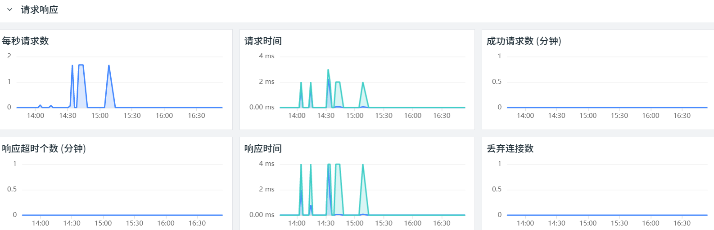
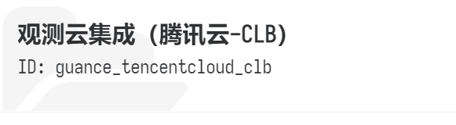
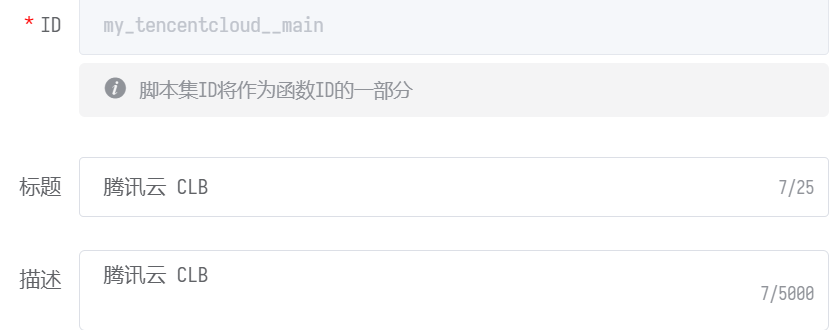

# CLB
---

## 视图预览
腾讯云 CLB 指标展示，包括网络流量，状态码，健康检查，连接数等





## 版本支持

操作系统支持：Linux / Windows

## 前置条件

- 服务器 <[安装 DataKit](../datakit/datakit-install.md)>
- 服务器 <[安装 Func 携带版](../dataflux-func/maintenance-guide-installation)>
- 腾讯云访问管理进行授权

### 访问授权

1、 登录访问授权控制台 [https://console.cloud.tencent.com/cam](https://console.cloud.tencent.com/cam)
2、 新建用户：用户 - 用户列表 - 新建用户
   1、 访问方式：控制台访问 & 编程访问
   2、 用户权限：ReadOnlyAccess


3、 新建秘钥：选择该用户 - API 秘钥 - 新建秘钥 (**SecretId** 和 **SecretKey** 配置文件会用到)


## 安装配置

说明：

- 示例 Linux 版本为：CentOS Linux release 7.8.2003 (Core)
- 通过一台服务器采集所有腾讯云 CLB 数据

### 部署实施

#### 脚本市场

1、 登录 Func，地址 http://ip:8088


2、 开启脚本市场，管理 - 实验性功能 - 开启脚本市场模块


3、 **依次添加**三个脚本集
   1、 观测云集成 (核心包)
   2、 观测云集成 (腾讯云-云监控)
   3、 观测云集成 (腾讯云-CLB)

_注：在安装「核心包」后，系统会提示安装第三方依赖包，按照正常步骤点击安装即可_


4、 脚本安装完成后，可以在脚本库中看到所有脚本集


#### 添加脚本

1、 开发 - 脚本库 - 添加脚本集


2、 点击该脚本集 - 添加脚本


3、 创建 ID 为 main 的脚本



4、 添加代码 (需要修改账号配置 **SecretId / SecretKey /Account Name / Regions**)

- regions 取值可以参考 [**地域列表**](https://cloud.tencent.com/document/api/248/30346)**，**示例：ap-shanghai
- namespace (QCE/LB_PUBLIC 表示公网，QCE/LB_PRIVATE 表示内网，可以同时添加)

```
from guance_integration__runner import Runner
import guance_tencentcloud_clb__main as tencentcloud_clb
import guance_tencentcloud_monitor__main as tencentcloud_monitor

# 账号配置
account = {
    'ak_id'     : 'SecretId',
    'ak_secret' : 'SecretKey',
    'extra_tags': {
        'account_name': 'Account Name',
    }
}

@DFF.API('执行云资产同步', timeout=300)
def run():
    regions = ['Regions']

    # 采集器配置
    clb_configs = {
        'regions': regions,
    }
    monitor_configs = {
        'regions': regions,
        'targets': [
            {
                'namespace': 'QCE/LB_PUBLIC',
                'metrics'  : 'ALL',
            },
            {
                'namespace': 'QCE/LB_PRIVATE',
                'metrics'  : 'ALL',
            },
        ],
    }
    collectors = [
        tencentcloud_clb.DataCollector(account, clb_configs),
        tencentcloud_monitor.DataCollector(account, monitor_configs),
    ]

    # 启动执行
    Runner(collectors).run()
```

5、 **保存**配置并 **发布**


#### 定时任务

1、 添加自动触发任务，管理 - 自动触发配置 - 新建任务


2、 自动触发配置，执行函数中添加此脚本，执行频率为 **5分钟 */5 * * * ***


3、 指标预览



## 场景视图

<场景 - 新建仪表板 - 内置模板库 - 腾讯云 CLB>

## 监控规则

<监控 - 监控器 - 从模板新建 - 腾讯云 CLB 检测库>

## 指标详解

<[腾讯云 CLB 指标列表](https://cloud.tencent.com/document/product/248/51898)>

## 常见问题排查

- 查看日志：Func 日志路径 /usr/local/dataflux-func/data/logs/dataflux-func.log
- 代码调试：编辑模式选择主函数，直接运行 (可以看到脚本输出)


- 连接配置：Func 无法连接 DataKit，请检查数据源配置 (DataKit 需要监听 0.0.0.0)


## 进一步阅读

<[DataFlux Func 腾讯云-云监控配置手册](../dataflux-func/script-market-guance-aliyun-monitor)>