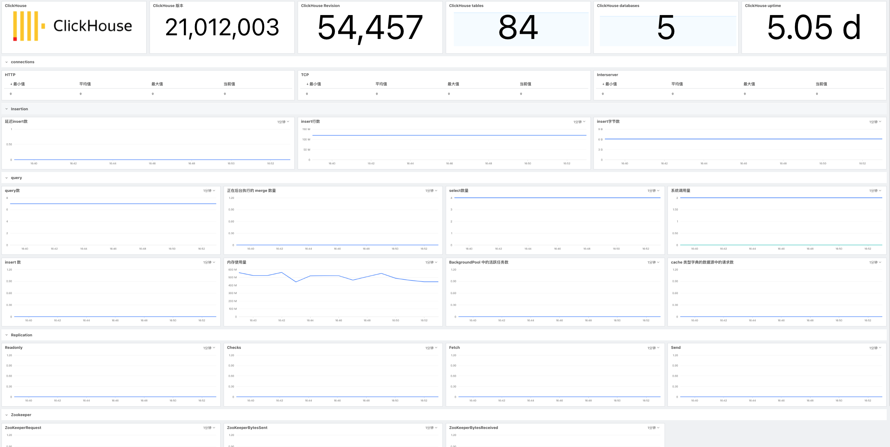

{{.CSS}}
# ClickHouse
---

- DataKit 版本：{{.Version}}
- 操作系统支持：`{{.AvailableArchs}}`

ClickHouse 采集器可以采集 ClickHouse 服务器实例主动暴露的多种指标，比如语句执行数量和内存存储量，IO交互等多种指标，并将指标采集到观测云，帮助你监控分析 ClickHouse 各种异常情况。

## 视图预览


## 前置条件 {#requirements}

- ClickHouse 版本 >=v20.1.2.4

在 clickhouse-server 的 config.xml 配置文件中找到如下的代码段，取消注释，并设置 metrics 暴露的端口号（具体哪个自己造择，唯一即可）。修改完成后重启（若为集群，则每台机器均需操作）。

```shell
vim /etc/clickhouse-server/config.xml
```

```xml
<prometheus>
    <endpoint>/metrics</endpoint>
    <port>9363</port>
    <metrics>true</metrics>
    <events>true</events>
    <asynchronous_metrics>true</asynchronous_metrics>
</prometheus>
```

- `endpoint` Prometheus 服务器抓取指标的 HTTP 路由
- `port` 端点的端口号
- `metrics` 从 ClickHouse 的 `system.metrics` 表中抓取暴露的指标标志
- `events` 从 ClickHouse 的 `system.events` 表中抓取暴露的事件标志
- `asynchronous_metrics` 从 ClickHouse 中 `system.asynchronous_metrics` 表中抓取暴露的异步指标标志

详见[ClickHouse 官方文档](https://ClickHouse.com/docs/en/operations/server-configuration-parameters/settings/#server_configuration_parameters-prometheus)

## 配置 {#input-config}

进入 DataKit 安装目录下的 `conf.d/{{.Catalog}}` 目录，复制 `{{.InputName}}.conf.sample` 并命名为 `{{.InputName}}.conf`。示例如下：

> 当前 ClickHouse 采集器版本为 v1 版本，更早的版本被废弃了，但因为兼容性考虑，此处将改进后的采集器版本重新命名一下。

```toml
{{.InputSample}}
```

配置好后，重启 DataKit 即可。

## 指标集 {#measurements}

以下所有数据采集，默认会追加名为 `host` 的全局 tag（tag 值为 DataKit 所在主机名），也可以在配置中通过 `[inputs.prom.tags]`自定义指定其它Tags：(集群可添加主机名)

``` toml
    [inputs.prom.tags]
    # some_tag = "some_value"
    # more_tag = "some_other_value"
```

## 指标 {#metrics}

{{ range $i, $m := .Measurements }}

{{if eq $m.Type "metric"}}

### `{{$m.Name}}`

{{$m.Desc}}

-  标签

{{$m.TagsMarkdownTable}}

- 字段列表

{{$m.FieldsMarkdownTable}}
{{end}}

{{ end }}

ClickHouse 指标采集验证
 `/usr/local/datakit/datakit -M |egrep "最近采集|clickhouse"`


## 指标预览


### 插件标签 (非必选)
参数说明

- 该配置为自定义标签，可以填写任意 key-value 值
- 以下示例配置完成后，所有 ClickHouse 指标都会带有 service = "ClickHouseAsyncMetrics" 的标签，可以进行快速查询
- 相关文档 <[DataFlux Tag 应用最佳实践](https://www.yuque.com/dataflux/bp/tag)>
```
# 示例
[inputs.prom.tags]
  service = "ClickHouseAsyncMetrics"
```
重启 Datakit
```
systemctl restart datakit
```


## 场景视图
<暂无>
相关文档 <[DataFlux 场景管理](https://www.yuque.com/dataflux/doc/trq02t)> 

## 异常检测
<暂无>
相关文档 <[DataFlux 内置检测库](https://www.yuque.com/dataflux/doc/br0rm2)> 

## 故障排查
<[无数据上报排查](why-no-data)>

