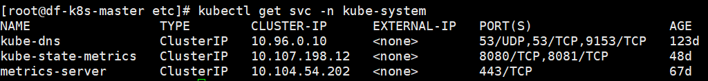
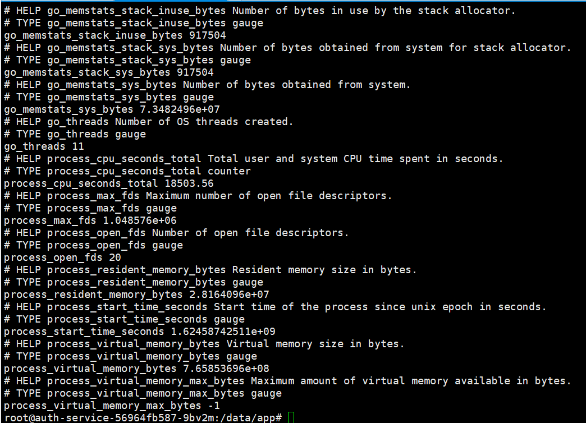
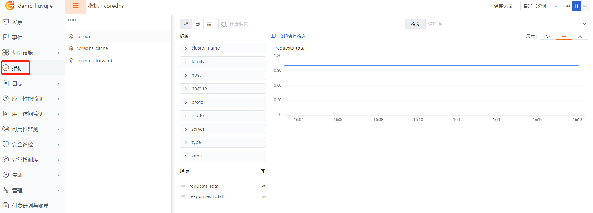

{{.CSS}}
# CoreDNS
---

- DataKit 版本：{{.Version}}
- 操作系统支持：`{{.AvailableArchs}}`

CoreDNS 采集器用于采集 CoreDNS 相关的指标数据。

## 视图预览
CoreDNS性能指标展示：包括请求次数、对每个zone和RCODE的响应总数、缓存总数、缓存命中说、缓存miss数等。


## 安装部署
说明：示例 CoreDNS 版本为：CoreDns:1.7.0 (CentOS环境下kubeadmin部署)，各个不同版本指标可能存在差异。

### 前置条件

- coreDNS 所在kubernetes集群 <[安装 Datakit](https://www.yuque.com/dataflux/integrations/kubernetes)>
- 检查是否能正常收集数据

kubernetes集群master节点执行
```
kubectl get svc -n kube-system
```

得到dns service域名是
```
http://kube-dns.kube-system.svc.cluster.local
```
登录任意一个kubernetes集群中的容器，执行如下命令：
```
curl http://kube-dns.kube-system.svc.cluster.local:9153/metrics
```
显示有如下信息，说明可以正常接收数据：



### 配置实施

#### 指标采集 (必选)

1. 开启coreDNS插件

      kubernetes环境下部署的datakit与宿主机直接安装的datakit ，开启插件的方式不一样， kubernetes环境下部署datakit是按照<<[Daemonset部署datakit](https://www.yuque.com/dataflux/integrations/kubernetes)>>文档最底部的附1：datakit-default.yaml来配置的，在kubernetes集群的master节点找到datakit-default.yaml。

2. 修改datakit-default.yaml配置文件      
```
vi datakit-default.yaml
```
在datakit-default.yaml的volumeMounts下面增加下面3行：
```
        volumeMounts:         
        - mountPath: /usr/local/datakit/conf.d/coredns/coredns.conf
          name: datakit-conf
          subPath: k8s_core_dns.conf 
```

在ConfigMap资源文件中增加#### k8s core dns以下的部分：
```
apiVersion: v1
kind: ConfigMap
metadata:
  name: datakit-conf
  namespace: datakit
data:
    #### k8s core dns
    k8s_core_dns.conf: |-
        [[inputs.prom]]
        ## Exporter 地址
        # 此处修改成CoreDNS的prom监听地址
        url = "http://kube-dns.kube-system.svc.cluster.local:9153/metrics"

        ## 采集器别名
        source = "coredns"

        ## 指标类型过滤, 可选值为 counter, gauge, histogram, summary
        # 默认只采集 counter 和 gauge 类型的指标
        # 如果为空，则不进行过滤
        metric_types = ["counter", "gauge"]

        ## 指标名称过滤
        # 支持正则，可以配置多个，即满足其中之一即可
        # 如果为空，则不进行过滤
        # CoreDNS的prom默认提供大量Go运行时的指标，这里忽略
        metric_name_filter = ["^coredns_(acl|cache|dnssec|forward|grpc|hosts|template|dns)_([a-z_]+)$"]

        ## 指标集名称前缀
        # 配置此项，可以给指标集名称添加前缀
        # measurement_prefix = ""

        ## 指标集名称
        # 默认会将指标名称以下划线"_"进行切割，切割后的第一个字段作为指标集名称，剩下字段作为当前指标名称
        # 如果配置measurement_name, 则不进行指标名称的切割
        # 最终的指标集名称会添加上measurement_prefix前缀
        # measurement_name = "prom"

        ## 采集间隔 "ns", "us" (or "µs"), "ms", "s", "m", "h"
        interval = "10s"

        ## 过滤tags, 可配置多个tag
        # 匹配的tag将被忽略
        # tags_ignore = [""]

        ## TLS 配置
        tls_open = false
        # tls_ca = "/tmp/ca.crt"
        # tls_cert = "/tmp/peer.crt"
        # tls_key = "/tmp/peer.key"

        ## 自定义指标集名称
        # 可以将包含前缀prefix的指标归为一类指标集
        # 自定义指标集名称配置优先measurement_name配置项
      
        [[inputs.prom.measurements]]
            prefix = "coredns_acl_"
            name = "coredns_acl"
        [[inputs.prom.measurements]]
            prefix = "coredns_cache_"
            name = "coredns_cache"
        [[inputs.prom.measurements]]
            prefix = "coredns_dnssec_"
            name = "coredns_dnssec"
        [[inputs.prom.measurements]]
            prefix = "coredns_forward_"
            name = "coredns_forward"
        [[inputs.prom.measurements]]
            prefix = "coredns_grpc_"
            name = "coredns_grpc"
        [[inputs.prom.measurements]]
            prefix = "coredns_hosts_"
            name = "coredns_hosts"
        [[inputs.prom.measurements]]
            prefix = "coredns_template_"
            name = "coredns_template"
        [[inputs.prom.measurements]]
            prefix = "coredns_dns_"
            name = "coredns"
        [inputs.prom.tags]
          cluster_name="k8s-dns" 
```
参数说明

- url：CoreDNS的prom监听地址
- source：采集器别名
- metric_types：指标类型过滤
- metric_name_filter：指标名称过滤
- measurement_prefix：指标集名称前缀
- measurement_name：指标集名称
- interval：采集间隔
- tags_ignore：匹配的tag将被忽略
- tls_open：是否忽略安全验证 (如果是 https，请设置为 true，并设置相应证书)
- prefix：自定义指标前缀
- name：自定义指标集名称，即把prefix开头的指标归为此name的指标集

3. 重启 Datakit
```
systemctl restart datakit
```

指标预览



### 指标集 {#metrics}

{{ range $i, $m := .Measurements }}

#### `{{$m.Name}}`

- 标签

{{$m.TagsMarkdownTable}}

- 指标列表

{{$m.FieldsMarkdownTable}}

{{ end }}


#### 插件标签 (非必选)
参数说明

- 该配置为自定义标签，可以填写任意 key-value 值
- 以下示例配置完成后，所有 coreDNS 指标都会带有 app = oa 的标签，可以进行快速查询，上文已经配置了一个cluster_name的key
- 相关文档 <[DataFlux Tag 应用最佳实践](https://www.yuque.com/dataflux/bp/tag)>
```
[inputs.prom.tags]
  cluster_name="k8s-dns"  
```
重启 Datakit
```
systemctl restart datakit
```

## 场景视图
< 场景 - 新建仪表板 - coreDNS监控视图 >

相关文档 <[DataFlux 场景管理](https://www.yuque.com/dataflux/doc/trq02t)> 

## 异常检测
暂无

## 最佳实践
暂无

## 故障排查
<[无数据上报排查](why-no-data)>
