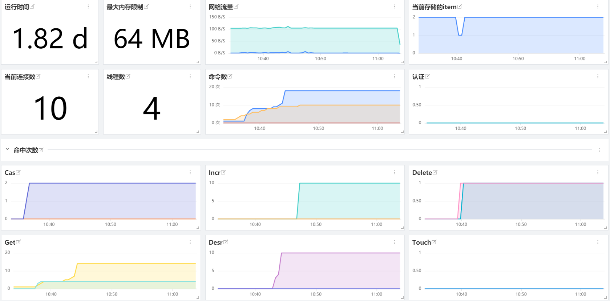

# Memcached
---

## 视图预览
Memcached 性能指标展示：包括连接数，命令数，网络流量，线程数，命中率信息等



## 版本支持

操作系统支持：Linux / Windows / Mac

## 前置条件

- 服务器 <[安装 DataKit](../datakit/datakit-install.md)>

## 安装配置

说明：示例 Memcached 版本为 Linux 环境 memcached 1.4.15，Windows 版本请修改对应的配置文件

### 部署实施

#### 指标采集 (必选)

1、 开启 DataKit Memcache 插件，复制 sample 文件

```
cd /usr/local/datakit/conf.d/db
cp memcached.conf.sample memcached.conf
```

2、 修改 memcached 配置文件

```
vi memcached.conf
```

参数说明

- servers：服务连接地址
- unix_sockets：socket 文件路径
- interval：数据采集频率

```
[[inputs.memcached]]
  servers = ["localhost:11211"]
  # unix_sockets = ["/var/run/memcached.sock"]
  interval = '10s'
```

3、 Memcached 指标采集验证  /usr/local/datakit/datakit -M |egrep "最近采集|memcached"


指标预览


#### 插件标签 (非必选)

参数说明

- 该配置为自定义标签，可以填写任意 key-value 值
- 以下示例配置完成后，所有 memcached 指标都会带有 app = oa 的标签，可以进行快速查询
- 相关文档 <[DataFlux Tag 应用最佳实践](../best-practices/insight/tag.md)>

```
# 示例
[inputs.memcached.tags]
   app = "oa"
```

重启 DataKit

```
systemctl restart datakit
```

## 场景视图

<场景 - 新建仪表板 - 内置模板库 - Memcached 监控视图>

## 监控规则

暂无

## 指标详解

| 指标 | 描述 | 数据类型 | 单位 |
| --- | --- | --- | --- |
| `accepting_conns` | Whether or not server is accepting conns | int | count |
| `auth_cmds` | Number of authentication commands handled, success or failure | int | count |
| `auth_errors` | Number of failed authentications | int | count |
| `bytes` | Current number of bytes used to store items | int | B |
| `bytes_read` | Total number of bytes read by this server from network | int | B |
| `bytes_written` | Total number of bytes sent by this server to network | int | B |
| `cas_badval` | Number of CAS reqs for which a key was found, but the CAS value did not match | int | count |
| `cas_hits` | Number of successful CAS reqs | int | count |
| `cas_misses` | Number of CAS reqs against missing keys | int | count |
| `cmd_flush` | Cumulative number of flush reqs | int | count |
| `cmd_get` | Cumulative number of retrieval reqs | int | count |
| `cmd_set` | Cumulative number of storage reqs | int | count |
| `cmd_touch` | Cumulative number of touch reqs | int | count |
| `conn_yields` | Number of times any connection yielded to another due to hitting the -R limit | int | count |
| `connection_structures` | Number of connection structures allocated by the server | int | count |
| `curr_connections` | Number of open connections | int | count |
| `curr_items` | Current number of items stored | int | count |
| `decr_hits` | Number of successful decr reqs | int | count |
| `decr_misses` | Number of decr reqs against missing keys | int | count |
| `delete_hits` | Number of deletion reqs resulting in an item being removed | int | count |
| `delete_misses` | umber of deletions reqs for missing keys | int | count |
| `evicted_unfetched` | Items evicted from LRU that were never touched by get/incr/append/etc | int | count |
| `evictions` | Number of valid items removed from cache to free memory for new items | int | count |
| `expired_unfetched` | Items pulled from LRU that were never touched by get/incr/append/etc before expiring | int | count |
| `get_hits` | Number of keys that have been requested and found present | int | count |
| `get_misses` | Number of items that have been requested and not found | int | count |
| `hash_bytes` | Bytes currently used by hash tables | int | B |
| `hash_is_expanding` | Indicates if the hash table is being grown to a new size | int | count |
| `hash_power_level` | Current size multiplier for hash table | int | count |
| `incr_hits` | Number of successful incr reqs | int | count |
| `incr_misses` | Number of incr reqs against missing keys | int | count |
| `limit_maxbytes` | Number of bytes this server is allowed to use for storage | int | B |
| `listen_disabled_num` | Number of times server has stopped accepting new connections (maxconns) | int | count |
| `reclaimed` | Number of times an entry was stored using memory from an expired entry | int | count |
| `threads` | Number of worker threads requested | int | count |
| `total_connections` | Total number of connections opened since the server started running | int | count |
| `total_items` | Total number of items stored since the server started | int | count |
| `touch_hits` | Number of keys that have been touched with a new expiration time | int | count |
| `touch_misses` | Number of items that have been touched and not found | int | count |
| `uptime` | Number of secs since the server started | int | count |

## 常见问题排查

<[无数据上报排查](../datakit/why-no-data.md)>
