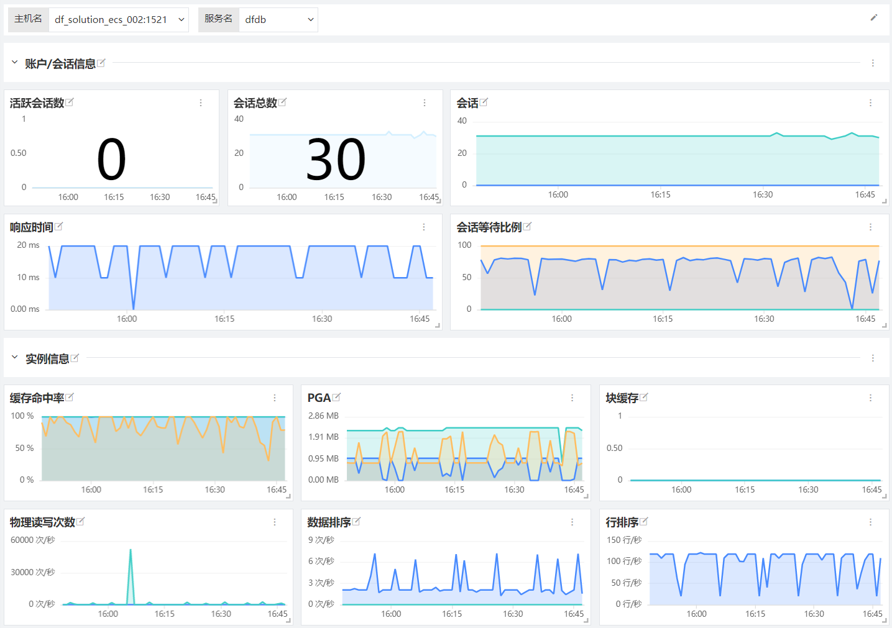
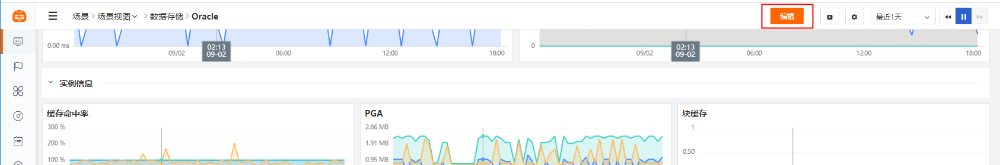
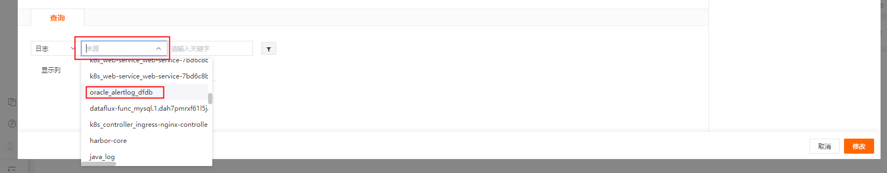
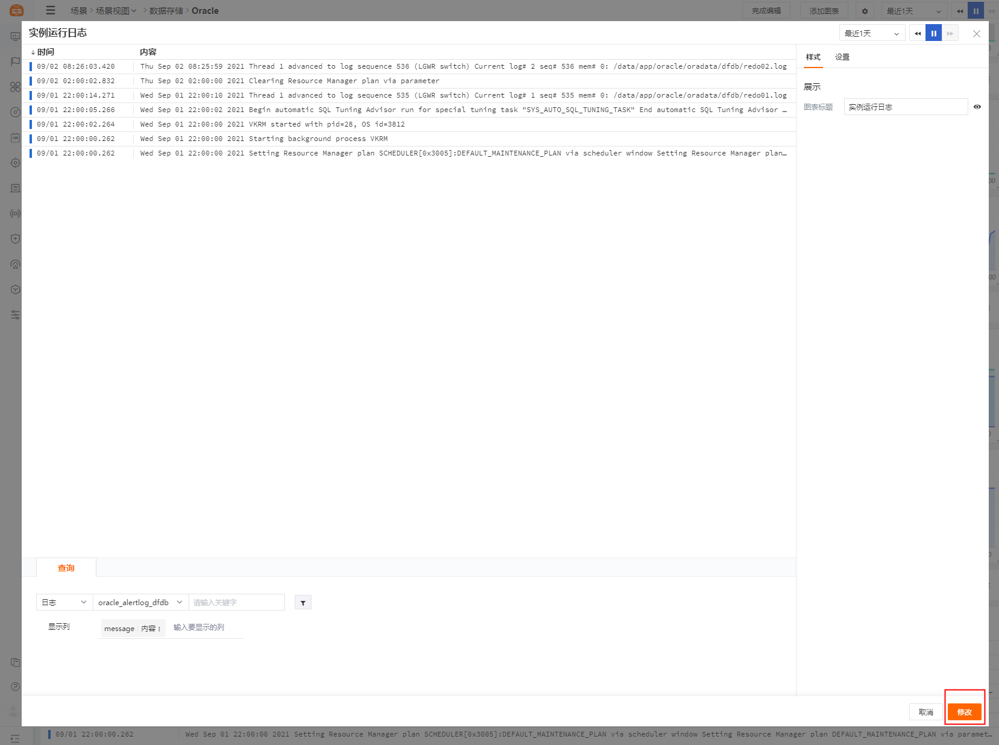
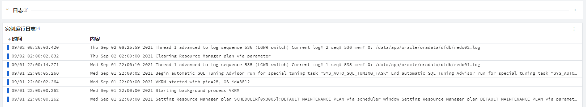

# Oracle
---

## 视图预览

Oracle 指标展示，包括 Oracle 的会话信息、缓存信息、表空间信息、实例运行信息、性能信息、锁信息以及日志信息等。






## 版本支持

操作系统支持：Linux/AMD 64

## 安装部署

Oracle 监控指标采集，具有以下数据收集功能:

- process 相关
- tablespace 相关数据
- system 数据采集
- 自定义查询数据采集

说明：示例 Oracle 版本为 Oracle 11.2.0.4.0(CentOS)，各个不同版本指标可能存在差异。

### 前置条件

- Oracle 版本 11g+ <[安装 DataKit](../../datakit/datakit-install.md)>
- 创建监控账号（一般情况，需用 Oracle `dba` 权限 或 `sysdba`权限账号登陆才能创建 Oracle 用户）

```sql
-- Create the datakit user. Replace the password placeholder with a secure password.
CREATE USER datakit IDENTIFIED BY <PASSWORD>;
```

- 授权

```sql
-- Grant access to the datakit user.
GRANT CONNECT TO datakit;
GRANT SELECT ON GV_$PROCESS TO datakit;
GRANT SELECT ON gv_$sysmetric TO datakit;
GRANT SELECT ON sys.dba_data_files TO datakit;
GRANT SELECT ON sys.dba_tablespaces TO datakit;
GRANT SELECT ON sys.dba_tablespace_usage_metrics TO datakit;
```

- 安装Oracle客户端

根据操作系统和 ORACLE 版本选择安装对应的安装包,参考[这里](https://oracle.github.io/odpi/doc/installation.html)，如：

```shell
wget https://download.oracle.com/otn_software/linux/instantclient/211000/instantclient-basiclite-linux.x64-21.1.0.0.0.zip
unzip instantclient-basiclite-linux.x64-21.1.0.0.0.zip
```

将解压后的目录文件路径，添加到以下配置信息中的 `LD_LIBRARY_PATH` 环境变量路径中。

### 配置实施

#### 指标采集 (必选)

1、 开启 DataKit Oracle 插件，复制 sample 文件

```bash
cd /usr/local/datakit/conf.d/db/
cp oracle.conf.sample oracle.conf
```

2、 修改 `oracle.conf` 配置文件

```bash
vi oracle.conf
```

3、 参数说明

 daemon：守护程序 <br /> name：external采集器名称<br /> cmd：external采集脚本路径<br /> args：Oracle 访问参数列表<br /> --host：Oracle实例地址(ip)  <br /> --port：Oracle监听端口<br /> --username：Oracle 数据库用户名(填写前置条件中创建的用户名) <br /> --password：Oracle 数据库密码 (填写前置条件中创建的用户密码) <br /> --service-name：Oracle的服务名<br /> --query：自定义查询语句，格式为<sql:metricName:tags><br /> envs：Oracle 环境变量

```json
[[inputs.external]]
  daemon = true
  name = 'oracle'
  cmd  = "/usr/local/datakit/externals/oracle"
  args = [
    '--interval'       , '1m'                        ,
    '--host'           , '<your-oracle-host>'        ,
    '--port'           , '1521'                      ,
    '--username'       , '<oracle-user-name>'        ,
    '--password'       , '<oracle-password>'         ,
    '--service-name'   , '<oracle-service-name>'     ,
  ]
  envs = [
    'LD_LIBRARY_PATH=/opt/oracle/instantclient_21_1:$LD_LIBRARY_PATH',
  ]

  [inputs.external.tags]
    # some_tag = "some_value"
    # more_tag = "some_other_value"

  #############################
  # 参数说明(标 * 为必选项)
  #############################
  # *--interval       : 采集的频度，最小粒度5m
  # *--host           : oracle实例地址(ip)
  #  --port           : oracle监听端口
  # *--username       : oracle 用户名
  # *--password       : oracle 密码
  # *--service-name   : oracle的服务名
  # *--query          : 自定义查询语句，格式为<sql:metricName:tags>, sql为自定义采集的语句, tags填入使用tag字段
```

4、 重启 Datakit (如果需要开启日志，请配置日志采集再重启)

```bash
datakit --restart 
```

5、 Oracle 指标采集验证 `/usr/local/datakit/datakit -M |egrep "最近采集|oracle"`


6、 指标预览



#### 日志采集 (非必选)

1、 如需采集 Oracle 的日志，目前可通过 [日志数据采集](/datakit/logging) ：`/usr/local/datakit/conf.d/log/logging.conf` 中添加如下logging 配置 来实现：

```json
[[inputs.logging]]
  logfiles = ["/data/app/oracle/diag/rdbms/dfdb/dfdb/trace/alert_dfdb.log"]
  ignore = [""]
  ## your logging source, if it's empty, use 'default'
  source = "oracle_alertlog_sid"
  service = ""
  ignore_status = []
  character_encoding = ""
  match = '''^\D{3}\s\D{3}\s\d{2}\s\d{2}:\d{2}:\d{2}.*'''
```

> 注意：在使用日志采集时，需要将 DataKit 安装在 Oracle 服务同一台主机中，或使用其它方式将日志挂载到 DataKit 所在机器。


2、 修改 `logging.conf` 配置文件

3、 参数说明

 logfiles：日志文件路径 (通常填写Oracle实例运行日志) <br /> ignore：过滤 *.log 中不想被采集的日志(默认全采) <br /> source：来源标签（便于在构建日志视图时筛选该日志文件）<br /> character_encoding：日志文件的字符集(默认 utf-8) <br /> match：该配置为多行日志采集规则配置（以下配置文件中为Oracle实例运行日志规则）

```json
[[inputs.logging]]
  ## required
  logfiles = ["/data/app/oracle/diag/rdbms/dfdb/dfdb/trace/alert_dfdb.log"]

  ## glob filteer
  ignore = [""]

  ## your logging source, if it's empty, use 'default'
  source = "oracle_alertlog_sid"

  ## optional encodings:
  ##    "utf-8", "utf-16le", "utf-16le", "gbk", "gb18030" or ""
  character_encoding = ""

  ## The pattern should be a regexp. Note the use of '''this regexp'''
  ## regexp link: https://golang.org/pkg/regexp/syntax/#hdr-Syntax
  match = '''^\D{3}\s\D{3}\s\d{2}\s\d{2}:\d{2}:\d{2}.*'''

  [inputs.logging.tags]
  # some_tag = "some_value"
  # more_tag = "some_other_value"
```

4、 重启 DataKit (如果需要开启自定义标签，请配置插件标签再重启)

```bash
datakit --restart
```

> 注意：DataKit 启动后，`logfiles` 中配置的日志文件有新的日志产生才会采集上来，**老的日志数据是不会采集的**。


5、 日志预览



6、 场景视图中添加 日志流图<br />
  （1）点击 Oracle 场景视图中 「编辑」 按钮



  （2）找到场景视图下方 「实例运行日志」，点击 「修改」，进入修改页面


  （3）点击查询框中的 「来源」下拉框，找到 `logging.conf` 中配置的 `source` 并点击选用


  （4）点击右下角 「修改」按钮 保存修改，即完成场景视图中的日志配置


  （5）Oracle 实例运行日志流图展示如下：


#### 插件标签 (非必选)

参数说明

-  该配置为自定义标签，可以填写任意 key-value 值 
-  以下示例配置完成后，所有 Oracle 指标都会带有 `service = "Oracle"` 的标签，可以进行快速查询。
-  相关文档 <[TAG 在观测云中的最佳实践](../../best-practices/insight/tag.md)>

```
[inputs.oracle.tags]
		service = "Oracle"
    #some_tag = "some_value"
		#more_tag = "some_other_value"
		...
```

重启 DataKit

```
datakit --restart
```

## 场景视图

<场景 - 新建仪表板 - 模板库 - 系统视图 - Oracle 监控视图>

## 检测库

<监控 - 监控器 - 从模板新建 - Oracle 检测库>

| 序号 | 规则名称 | 触发条件 | 级别 | 检测频率 |
| --- | --- | --- | --- | --- |
| <br /> |  |  |  |  |


## [指标详解](../../../datakit/oracle#measurements)


## 故障排查

<[无数据上报排查](../../datakit/why-no-data.md)>
