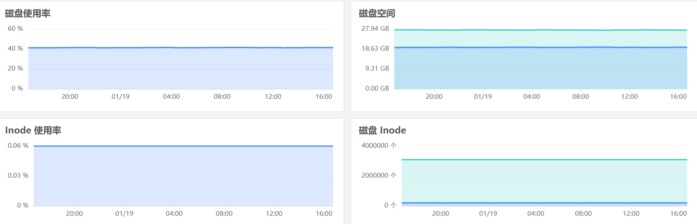
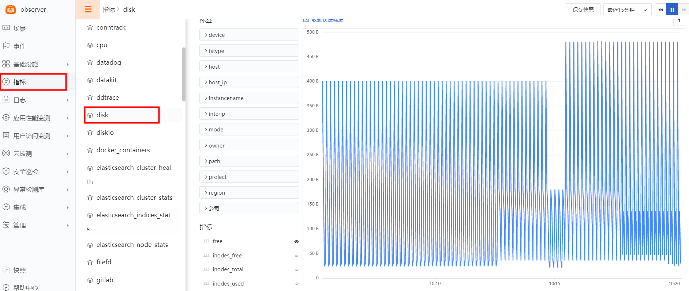

{{.CSS}}
# Disk
---

- DataKit 版本：{{.Version}}
- 操作系统支持：`{{.AvailableArchs}}`

disk 采集器用于主机磁盘信息采集，如磁盘存储空间、inodes 使用情况等。

## 视图预览
磁盘性能指标展示，包括磁盘使用率，磁盘剩余空间，Inode 使用率，Inode 大小等


## 前置条件

- 服务器 <[安装 Datakit](datakit-install)>

## 安装配置
说明：示例 Linux 版本为：CentOS Linux release 7.8.2003 (Core)，Windows 版本请修改对应的配置文件

### 部署实施
(Linux / Windows 环境相同)

#### 指标采集 (默认)

1. Disk 数据采集默认开启，对应配置文件 /usr/local/datakit/conf.d/host/disk.conf

参数说明

- interval：数据采集频率
- mount_points：挂载点 (默认开启所有挂载点)
- ignore_fs：忽略的文件系统类型 (默认不采集)
```
[[inputs.disk]]
  interval = '10s'
  # mount_points = ["/"]
  ignore_fs = ["tmpfs", "devtmpfs", "devfs", "iso9660", "overlay", "aufs", "squashfs"]
```

2. Disk 指标采集验证  /usr/local/datakit/datakit -M |egrep "最近采集|disk"


指标预览


#### 插件标签 (非必选)
参数说明

- 该配置为自定义标签，可以填写任意 key-value 值
- 以下示例配置完成后，所有 disk 指标都会带有 app = oa 的标签，可以进行快速查询
- 相关文档 <[DataFlux Tag 应用最佳实践](best-practices/guance-skill/tag/)>
```
# 示例
[inputs.disk.tags]
   app = "oa"
```
重启 Datakit
```
systemctl restart datakit
```

## 场景视图
<场景 - 新建仪表板 - 内置模板库 - Disk>

## 异常检测
<监控 - 模板新建 - 主机检测库>

## 指标集

以下所有数据采集，默认会追加名为 `host` 的全局 tag（tag 值为 DataKit 所在主机名），也可以在配置中通过 `[inputs.{{.InputName}}.tags]` 指定其它标签：

``` toml
 [inputs.{{.InputName}}.tags]
  # some_tag = "some_value"
  # more_tag = "some_other_value"
  # ...
```

{{ range $i, $m := .Measurements }}

### `{{$m.Name}}`

-  标签

{{$m.TagsMarkdownTable}}

- 指标列表

{{$m.FieldsMarkdownTable}}

{{ end }}


## 常见问题排查
<[无数据上报排查](why-no-data)>

## 进一步阅读
<[主机可观测最佳实践](hostobject)>
