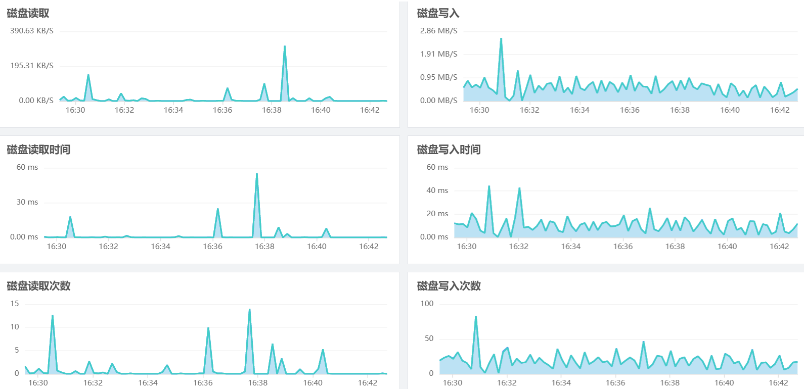
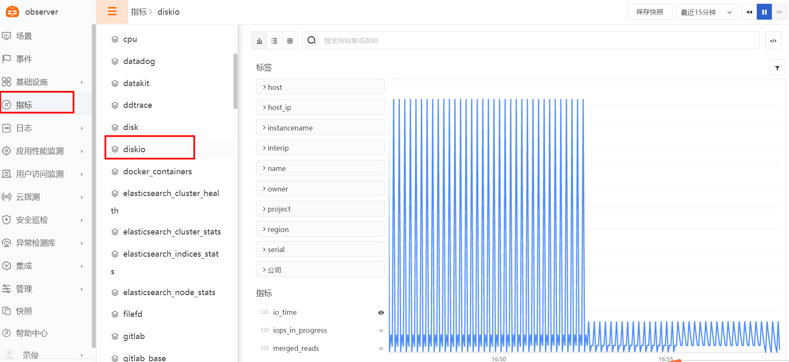

{{.CSS}}
# DiskIO
---

- DataKit 版本：{{.Version}}
- 操作系统支持：`{{.AvailableArchs}}`

diskio 采集器用于磁盘流量和时间的指标的采集

## 视图预览
Diskio 性能指标展示，包括磁盘读写，磁盘读写时间，IOPS等


## 前置条件

- 服务器 <[安装 Datakit](datakit-install)>

## 安装配置
说明：示例 Linux 版本为：CentOS Linux release 7.8.2003 (Core)，Windows 版本请修改对应的配置文件

### 部署实施
(Linux / Windows 环境相同)

#### 指标采集 (默认)

1. Diskio 数据采集默认开启，对应配置文件 /usr/local/datakit/conf.d/host/diskio.conf

参数说明

- interval：数据采集频率
- devices：设备名称 (支持正则匹配)
- skip_serial_number：是否忽略序列号 (默认忽略)
- device_tags：设备标签
- name_templates：名称模板 (设备标签关联)
```
[[inputs.disk]]
  interval = '10s'
  # devices = ['''^sda\d*''', '''^sdb\d*''', '''vd.*''']
  # skip_serial_number = true
  # device_tags = ["ID_FS_TYPE", "ID_FS_USAGE"]
  # name_templates = ["$ID_FS_LABEL","$DM_VG_NAME/$DM_LV_NAME", "$device:$ID_FS_TYPE"]
```

2. Diskio 指标采集验证  /usr/local/datakit/datakit -M |egrep "最近采集|diskio"


指标预览


#### 插件标签 (非必选)
参数说明

- 该配置为自定义标签，可以填写任意 key-value 值
- 以下示例配置完成后，所有 diskio 指标都会带有 app = oa 的标签，可以进行快速查询
- 相关文档 <[DataFlux Tag 应用最佳实践](best-practices/guance-skill/tag/)>
```
# 示例
[inputs.diskio.tags]
   app = "oa"
```
重启 Datakit
```
systemctl restart datakit
```

## 场景视图
<场景 - 新建仪表板 - 内置模板库 - Diskio>

## 异常检测
<监控 - 模板新建 - 主机检测库>

## 指标集

以下所有数据采集，默认会追加名为 `host` 的全局 tag（tag 值为 DataKit 所在主机名），也可以在配置中通过 `[[inputs.{{.InputName}}.tags]]` 另择 host 来命名。

{{ range $i, $m := .Measurements }}

### `{{$m.Name}}`

-  标签

{{$m.TagsMarkdownTable}}

- 指标列表

{{$m.FieldsMarkdownTable}}

{{ end }}


## 常见问题排查
<[无数据上报排查](why-no-data)>

F： Windows 服务器 diskio 数据无法正常采集
Q：需要先开启磁盘性能计数器 (Powershell 执行命令)，并重启 Datakit
```
diskperf  -Y
```

## 进一步阅读
<[主机可观测最佳实践](hostobject)>
