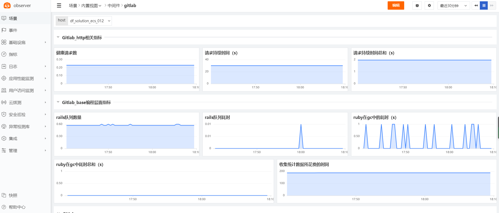
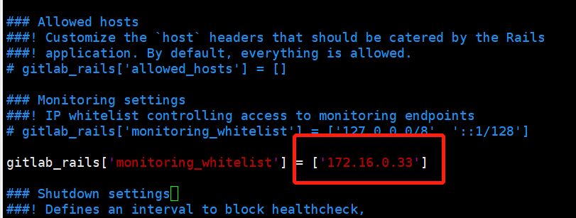

# GitLab
---

- DataKit 版本：1.4.6
- 操作系统支持：:fontawesome-brands-linux: :fontawesome-brands-windows: :fontawesome-brands-apple:

采集 GitLab 运行数据并以指标的方式上报到观测云。



## 前置条件

- 已安装 GitLab（[GitLab 官方链接](https://about.gitlab.com/){:target="_blank"}）

## 配置

首先需要打开 GitLab 服务的数据采集功能和设置白名单，具体操作见后续分段。

GitLab 设置完成后，对 DataKit 进行配置。注意，根据 GitLab 版本和配置不同，采集到的数据可能存在差异。

进入 DataKit 安装目录下的 `conf.d/gitlab` 目录，复制 `gitlab.conf.sample` 并命名为 `gitlab.conf`。示例如下：

```toml

[[inputs.gitlab]]
    ## set true if you need to collect metric from url below
    enable_collect = true

    ## param type: string - default: http://127.0.0.1:80/-/metrics
    prometheus_url = "http://127.0.0.1:80/-/metrics"

    ## param type: string - optional: time units are "ms", "s", "m", "h" - default: 10s
    interval = "10s"

    ## datakit can listen to gitlab ci data at /v1/gitlab when enabled
    enable_ci_visibility = true

    ## extra tags for gitlab-ci data.
    ## these tags will not overwrite existing tags.
    [inputs.gitlab.ci_extra_tags]
    # some_tag = "some_value"
    # more_tag = "some_other_value"

    ## extra tags for gitlab metrics
    [inputs.gitlab.tags]
    # some_tag = "some_value"
    # more_tag = "some_other_value"
 
```

配置好后，重启 DataKit 即可。

此 input 支持选举功能，[关于选举](../datakit/election.md)。

### GitLab 开启数据采集功能

GitLab 需要开启 promtheus 数据采集功能，开启方式如下（以英文页面为例）：

- 以管理员账号登陆己方 GitLab 页面
- 转到 `Admin Area` > `Settings` > `Metrics and profiling`
- 选择 `Metrics - Prometheus`，点击 `Enable Prometheus Metrics` 并且 `save change`




- 重启 GitLab 服务

详情见[官方配置文档](https://docs.gitlab.com/ee/administration/monitoring/prometheus/gitlab_metrics.html#gitlab-prometheus-metrics){:target="_blank"}。

### 配置数据访问端白名单

只开启数据采集功能还不够，GitLab 对于数据管理十分严格，需要再配置访问端的白名单。开启方式如下：

- 修改 GitLab 配置文件 `/etc/gitlab/gitlab.rb`，找到 `gitlab_rails['monitoring_whitelist'] = ['::1/128']` 并在该数组中添加 DataKit 的访问 IP（通常情况为 DataKit 所在主机的 IP，如果 GitLab 运行在容器中需根据实际情况添加）
- 重启 GitLab 服务

详情见[官方配置文档](https://docs.gitlab.com/ee/administration/monitoring/ip_whitelist.html){:target="_blank"}。

### 开启 Gitlab CI 可视化

确保当前 Datakit 版本（1.2.13 及以后）支持 Gitlab CI 可视化功能。

通过配置 Gitlab Webhook，可以实现 Gitlab CI 可视化。开启步骤如下：

- 在 Gitlab 转到 `Settings` > `Webhooks` 中，将 URL 配置为 http://Datakit_IP:PORT/v1/gitlab，Trigger 配置 Job events 和 Pipeline events 两项，点击 Add webhook 确认添加；

- 可点击 Test 按钮测试 Webhook 配置是否正确，Datakit 接收到 Webhook 后应返回状态码 200。正确配置后，Datakit 可以顺利采集到 Gitlab 的 CI 信息。

Datakit 接收到 Webhook Event 后，是将数据作为 logging 打到数据中心的。

注意：如果将 Gitlab 数据打到本地网络的 Datakit，需要对 Gitlab 进行额外的配置，见 [allow requests to the local network](https://docs.gitlab.com/ee/security/webhooks.html){:target="_blank"} 。

另外：Gitlab CI 功能不参与采集器选举，用户只需将 Gitlab Webhook 的 URL 配置为其中一个 Datakit 的 URL 即可；若只需要 Gitlab CI 可视化功能而不需要 Gitlab 指标采集，可通过配置 `enable_collect = false` 关闭指标采集功能。

## 指标预览


## 指标集

以下所有数据采集，默认会追加名为 `host` 的全局 tag（tag 值为 DataKit 所在主机名）。

可以在配置中通过 `[inputs.gitlab.tags]` 为 **Gitlab 指标数据**指定其它标签：

``` toml
 [inputs.gitlab.tags]
  # some_tag = "some_value"
  # more_tag = "some_other_value"
  # ...
```

可以在配置中通过 `[inputs.gitlab.ci_extra_tags]` 为 **Gitlab CI 数据**指定其它标签：

``` toml
 [inputs.gitlab.ci_extra_tags]
  # some_tag = "some_value"
  # more_tag = "some_other_value"
  # ...
```

注意：为了确保 Gitlab CI 功能正常，为 Gitlab CI 数据指定的 extra tags 不会覆盖其数据中已有的标签（Gitlab CI 标签列表见下）。


### `gitlab`

GitLab 运行指标

-  标签


| 标签名 | 描述    |
|  ----  | --------|
|`action`|行为|
|`controller`|管理|
|`feature_category`|类型特征|
|`storage`|存储|

- 指标列表


| 指标 | 描述| 数据类型 | 单位   |
| ---- |---- | :---:    | :----: |
|`banzai_cacheless_render_real_duration_seconds_count`|The count of duration of rendering Markdown into HTML when cached output exists|float|s|
|`banzai_cacheless_render_real_duration_seconds_sum`|The sum of duration of rendering Markdown into HTML when cached output exists|float|s|
|`cache_misses_total`|The cache read miss count|float|-|
|`cache_operation_duration_seconds_count`|The count of cache access time|float|s|
|`cache_operation_duration_seconds_sum`|The count of cache access time|float|s|
|`cache_operations_total`|The count of cache access time|float|-|
|`rack_requests_total`|The rack request count|float|-|
|`redis_client_requests_duration_seconds_count`|The count of redis request latency, excluding blocking commands|float|s|
|`redis_client_requests_duration_seconds_sum`|The sum of redis request latency, excluding blocking commands|float|s|
|`redis_client_requests_total`|Number of Redis client requests|float|-|
|`sql_duration_seconds_count`|The total SQL execution time, excluding SCHEMA operations and BEGIN / COMMIT|float|s|
|`sql_duration_seconds_sum`|The sum of SQL execution time, excluding SCHEMA operations and BEGIN / COMMIT|float|s|
|`transaction_cache_read_hit_count_total`|The counter for cache hits for Rails cache calls|float|count|
|`transaction_cache_read_miss_count_total`|The counter for cache misses for Rails cache calls|float|count|
|`transaction_db_cached_count_total`|The counter for db cache|float|count|
|`transaction_db_count_total`|The counter for db|float|count|
|`transaction_duration_seconds_count`|The count of duration for all transactions (gitlab_transaction_* metrics)|float|s|
|`transaction_duration_seconds_sum`|The sum of duration for all transactions (gitlab_transaction_* metrics)|float|s|
|`transaction_new_redis_connections_total`|The counter for new Redis connections|float|-|
|`transaction_view_duration_total`|The duration for views|float|-|


### `gitlab_base`

GitLab 编程语言层面指标

-  标签

暂无

- 指标列表


| 指标 | 描述| 数据类型 | 单位   |
| ---- |---- | :---:    | :----: |
|`rails_queue_duration_seconds_count`|The counter for latency between GitLab Workhorse forwarding a request to Rails|float|s|
|`rails_queue_duration_seconds_sum`|The sum for latency between GitLab Workhorse forwarding a request to Rails|float|s|
|`ruby_gc_duration_seconds_count`|The count of time spent by Ruby in GC|float|s|
|`ruby_gc_duration_seconds_sum`|The sum of time spent by Ruby in GC|float|s|
|`ruby_sampler_duration_seconds_total`|The time spent collecting stats|float|s|


### `gitlab_http`

GitLab HTTP 相关指标

-  标签


| 标签名 | 描述    |
|  ----  | --------|
|`method`|方法|
|`status`|状态码|

- 指标列表


| 指标 | 描述| 数据类型 | 单位   |
| ---- |---- | :---:    | :----: |
|`http_health_requests_total`|Number of health requests|float|-|
|`http_request_duration_seconds_count`|The counter for request duration|float|s|
|`http_request_duration_seconds_sum`|The sum for request duration|float|s|


### `gitlab_pipeline`

Gitlab Pipeline Event 相关指标

-  标签


| 标签名 | 描述    |
|  ----  | --------|
|`author_email`|作者邮箱|
|`ci_status`|CI 状态|
|`commit_sha`|触发 pipeline 的最近一次 commit 的哈希值|
|`object_kind`|Event 类型，此处为 Pipeline|
|`operation_name`|操作名称|
|`pipeline_name`|pipeline 名称|
|`pipeline_source`|pipeline 触发的来源|
|`pipeline_url`|pipeline 的 URL|
|`ref`|涉及的分支|
|`repository_url`|仓库 URL|
|`resource`|项目名|

- 指标列表


| 指标 | 描述| 数据类型 | 单位   |
| ---- |---- | :---:    | :----: |
|`commit_message`|触发该 pipeline 的代码的最近一次提交附带的 message|string|-|
|`created_at`|pipeline 创建的秒时间戳|int|sec|
|`duration`|pipeline 持续时长（秒）|int|s|
|`finished_at`|pipeline 结束的秒时间戳|int|sec|
|`message`|触发该 pipeline 的代码的最近一次提交附带的 message，与 commit_message 相同|string|-|
|`pipeline_id`|pipeline id|string|-|


### `gitlab_job`

Gitlab Job Event 相关指标

-  标签


| 标签名 | 描述    |
|  ----  | --------|
|`build_commit_sha`|build 对应的 commit 的哈希值|
|`build_failure_reason`|build 失败的原因|
|`build_name`|build 的名称|
|`build_repo_name`|build 对应的仓库名|
|`build_stage`|build 的阶段|
|`build_status`|build 的状态|
|`object_kind`|Event 类型，此处为 Job|
|`project_name`|项目名|
|`sha`|build 对应的 commit 的哈希值|
|`user_email`|作者邮箱|

- 指标列表


| 指标 | 描述| 数据类型 | 单位   |
| ---- |---- | :---:    | :----: |
|`build_commit_message`|触发该 build 的最近一次 commit 的 message|string|-|
|`build_duration`|build 持续时长（秒）|float|s|
|`build_finished_at`|build 结束的秒时间戳|int|sec|
|`build_id`|build id|string|-|
|`build_started_at`|build 开始的秒时间戳|int|sec|
|`message`|触发该 build 的最近一次 commit 的 message，与 build_commit_message 相同|string|-|
|`pipeline_id`|build 对应的 pipeline id|string|-|
|`project_id`|build 对应的项目 id|string|-|
|`runner_id`|build 对应的 runner id|string|-|


## 场景视图

<场景 - 新建仪表板 - Gitlab监控视图>
