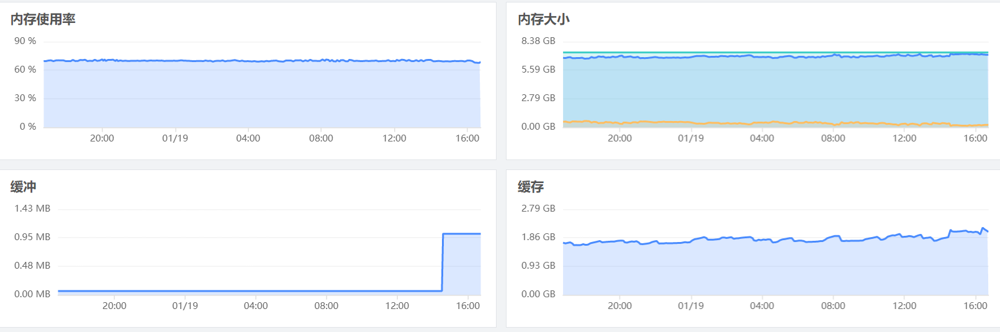
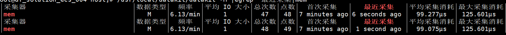
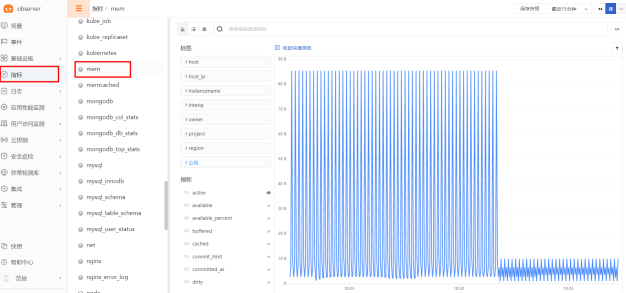

# Mem
---

## 视图预览

内存性能指标展示，包括内存使用率，内存大小，缓存，缓冲等



## 版本支持

操作系统支持：Linux / Windows / Mac

## 前置条件

- 服务器 <[安装 DataKit](/datakit/datakit-install)>

## 安装配置

说明：示例 Linux 版本为：CentOS Linux release 7.8.2003 (Core)，Windows 版本请修改对应的配置文件

### 部署实施

(Linux / Windows 环境相同)

#### 指标采集 (默认)

1、 Mem 数据采集默认开启，对应配置文件 /usr/local/datakit/conf.d/host/mem.conf

参数说明

- interval：数据采集频率
```
[[inputs.mem]]
  interval = '10s'
```

2、 Mem 指标采集验证  /usr/local/datakit/datakit -M |egrep "最近采集|mem"



指标预览



#### 插件标签 (非必选)

参数说明

- 该配置为自定义标签，可以填写任意 key-value 值
- 以下示例配置完成后，所有 mem 指标都会带有 app = oa 的标签，可以进行快速查询
- 相关文档 <[DataFlux Tag 应用最佳实践](../../best-practices/insight/tag.md)>

```
# 示例
[inputs.mem.tags]
   app = "oa"
```

重启 DataKit

```
systemctl restart datakit
```

## 场景视图

<场景 - 新建仪表板 - 内置模板库 - Memory>

## 监控规则

<监控 - 监控器 - 从模板新建 - 主机检测库>

## 指标详解

| 指标 | 描述 | 数据类型 | 单位 |
| --- | --- | --- | --- |
| `active` | Memory that has been used more recently and usually not reclaimed unless absolutely necessary. (Darwin, Linux) | int | B |
| `available` | Amount of available memory | int | B |
| `available_percent` | Available memory percent | float | percent |
| `buffered` | buffered (Linux) | int | B |
| `cached` | In-memory cache for files read from the disk. (Linux) | int | B |
| `commit_limit` | This is the total amount of memory currently available to be allocated on the system. (Linux) | int | B |
| `committed_as` | The amount of memory presently allocated on the system. (Linux) | int | B |
| `dirty` | Memory which is waiting to get written back to the disk. (Linux) | int | B |
| `free` | Amount of free memory(Darwin, Linux) | int | B |
| `high_free` | Amount of free highmem. (Linux) | int | B |
| `high_total` | Total amount of highmem. (Linux) | int | B |
| `huge_page_total` | The size of the pool of huge pages. (Linux) | int | count |
| `huge_pages_free` | The number of huge pages in the pool that are not yet allocated. (Linux) | int | count |
| `huge_pages_size` | The size of huge pages. (Linux) | int | B |
| `inactive` | Memory which has been less recently used.  It is more eligible to be reclaimed for other purposes. (Darwin, Linux) | int | B |
| `low_free` | Amount of free lowmem. (Linux) | int | B |
| `low_total` | Total amount of lowmem. (Linux) | int | B |
| `mapped` | Files which have been mapped into memory, such as libraries. (Linux) | int | B |
| `page_tables` | Amount of memory dedicated to the lowest level of page tables. (Linux) | int | B |
| `shared` | Amount of shared memory (Linux) | int | B |
| `slab` | In-kernel data structures cache. (Linux) | int | B |
| `sreclaimable` | Part of Slab, that might be reclaimed, such as caches. (Linux) | int | B |
| `sunreclaim` | Part of Slab, that cannot be reclaimed on memory pressure. (Linux) | int | B |
| `swap_cached` | Memory that once was swapped out, is swapped back in but still also is in the swap file. (Linux) | int | B |
| `swap_free` | Amount of swap space that is currently unused. (Linux) | int | B |
| `swap_total` | Total amount of swap space available. (Linux) | int | B |
| `total` | Total amount of memory | int | B |
| `used` | Amount of used memory | int | B |
| `used_percent` | Used memory percent | float | percent |
| `vmalloc_chunk` | Largest contiguous block of vmalloc area which is free. (Linux) | int | B |
| `vmalloc_total` | Total size of vmalloc memory area. (Linux) | int | B |
| `vmalloc_used` | Amount of vmalloc area which is used. (Linux) | int | B |
| `wired` | wired (Darwin) | int | B |
| `write_back` | Memory which is actively being written back to the disk. (Linux) | int | B |
| `write_back_tmp` | Memory used by FUSE for temporary writeback buffers. (Linux) | int | B |

## 常见问题排查

<[无数据上报排查](/datakit/why-no-data/)>

## 进一步阅读

<[主机可观测最佳实践](/best-practices/monitoring/host-linux)>

