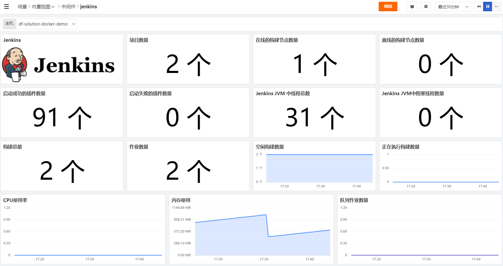

# Jenkins
---

- DataKit 版本：1.4.8
- 操作系统支持：:fontawesome-brands-linux: :fontawesome-brands-windows: :fontawesome-brands-apple:

Jenkins 采集器是通过插件 `Metrics` 采集数据监控 Jenkins，包括但不限于任务数，系统 cpu 使用，`jvm cpu`使用等



## 前置条件

- JenKins 版本 >= 2.277.4

- 安装 JenKins [参见](https://www.jenkins.io/doc/book/installing/){:target="_blank"}
      
- 下载 `Metric` 插件，[管理插件页面](https://www.jenkins.io/doc/book/managing/plugins/){:target="_blank"},[Metric 插件页面](https://plugins.jenkins.io/metrics/){:target="_blank"}

- 在 JenKins 管理页面 `your_manage_host/configure` 生成 `Metric Access keys`

## 配置

进入 DataKit 安装目录下的 `conf.d/jenkins` 目录，复制 `jenkins.conf.sample` 并命名为 `jenkins.conf`。示例如下：

```toml

[[inputs.jenkins]]
  ## Set true if you want to collect metric from url below.
  enable_collect = true

  ## The Jenkins URL in the format "schema://host:port",required
  url = "http://my-jenkins-instance:8080"

  ## Metric Access Key ,generate in your-jenkins-host:/configure,required
  key = ""

  ## Set response_timeout
  # response_timeout = "5s"

  ## Optional TLS Config
  # tls_ca = "/xx/ca.pem"
  # tls_cert = "/xx/cert.pem"
  # tls_key = "/xx/key.pem"
  ## Use SSL but skip chain & host verification
  # insecure_skip_verify = false

  ## set true to receive jenkins CI event
  enable_ci_visibility = true

  ## which port to listen to jenkins CI event
  ci_event_port = ":9539"

  # [inputs.jenkins.log]
  # files = []
  # #grok pipeline script path
  # pipeline = "jenkins.p"

  [inputs.jenkins.tags]
  # some_tag = "some_value"
  # more_tag = "some_other_value"
  # ...

  [inputs.jenkins.ci_extra_tags]
  # some_tag = "some_value"
  # more_tag = "some_other_value"

```

配置好后，重启 DataKit 即可。

## Jenkins CI Visibility

Jenkins 采集器可以通过接收 Jenkins datadog plugin 发出的 CI Event 实现 CI 可视化。

Jenkins CI Visibility 开启方法：

- 确保在配置文件中开启了 Jenkins CI Visibility 功能，且配置了监听端口号（如 `:9539`），重启 Datakit；
- 在 Jenkins 中安装 [Jenkins Datadog plugin](https://plugins.jenkins.io/datadog/){:target="_blank"} ；
- 在 Manage Jenkins > Configure System > Datadog Plugin 中选择 `Use the Datadog Agent to report to Datadog (recommended)`，配置 `Agent Host` 为 Datakit IP 地址。`DogStatsD Port` 及 `Traces Collection Port` 两项均配置为上述 Jenkins 采集器配置文件中配置的端口号，如 `9539`（此处不加 `:`）；
- 勾选 `Enable CI Visibility`；
- 点击 `Save` 保存设置。

配置完成后 Jenkins 能够通过 Datadog Plugin 将 CI 事件发送到 Datakit。

## 指标预览


## 指标集

以下所有数据采集，默认会追加名为 `host` 的全局 tag（tag 值为 DataKit 所在主机名)。
可以在配置中通过 `[inputs.jenkins.tags]` 为采集的指标指定其它标签：

``` toml
 [inputs.jenkins.tags]
  # some_tag = "some_value"
  # more_tag = "some_other_value"
  # ...
```

可以在配置中通过 `[inputs.jenkins.ci_extra_tags]` 为 Jenkins CI Event 指定其它标签：

```toml
 [inputs.jenkins.ci_extra_tags]
  # some_tag = "some_value"
  # more_tag = "some_other_value"
```


### `jenkins`

-  标签


| 标签名 | 描述    |
|  ----  | --------|
|`metric_plugin_version`|jenkins plugin version|
|`url`|jenkins url|
|`version`|jenkins  version|

- 指标列表


| 指标 | 描述| 数据类型 | 单位   |
| ---- |---- | :---:    | :----: |
|`executor_count`|The number of executors available to Jenkins|int|count|
|`executor_free_count`|The number of executors available to Jenkins that are not currently in use.|int|count|
|`executor_in_use_count`|The number of executors available to Jenkins that are currently in use.|int|count|
|`job_count`|The number of jobs in Jenkins|int|count|
|`node_offline_count`|The number of build nodes available to Jenkins but currently off-line.|int|count|
|`node_online_count`|The number of build nodes available to Jenkins and currently on-line.|int|count|
|`plugins_active`|The number of plugins in the Jenkins instance that started successfully.|int|count|
|`plugins_failed`|The number of plugins in the Jenkins instance that failed to start.|int|count|
|`project_count`|The number of project to Jenkins|int|count|
|`queue_blocked`|The number of jobs that are in the Jenkins build queue and currently in the blocked state.|int|count|
|`queue_buildable`|The number of jobs that are in the Jenkins build queue and currently in the blocked state.|int|count|
|`queue_pending`|Number of times a Job has been Pending in a Queue|int|count|
|`queue_size`|The number of jobs that are in the Jenkins build queue.|int|count|
|`queue_stuck`|he number of jobs that are in the Jenkins build queue and currently in the blocked state|int|count|
|`system_cpu_load`|The system load on the Jenkins controller as reported by the JVM’s Operating System JMX bean|float|percent|
|`vm_blocked_count`|The number of threads in the Jenkins JVM that are currently blocked waiting for a monitor lock.|int|count|
|`vm_count`|The total number of threads in the Jenkins JVM. This is the sum of: vm.blocked.count, vm.new.count, vm.runnable.count, vm.terminated.count, vm.timed_waiting.count and vm.waiting.count|int|count|
|`vm_cpu_load`|The rate of CPU time usage by the JVM per unit time on the Jenkins controller. This is equivalent to the number of CPU cores being used by the Jenkins JVM.|float|percent|
|`vm_memory_total_used`|The total amount of memory that the Jenkins JVM is currently using.(Units of measurement: bytes)|int|B|


### `jenkins_pipeline`

-  标签


| 标签名 | 描述    |
|  ----  | --------|
|`author_email`|作者邮箱|
|`ci_status`|CI 状态|
|`commit_sha`|触发 pipeline 的最近一次 commit 的哈希值|
|`object_kind`|Event 类型，此处为 Pipeline|
|`operation_name`|操作名称|
|`pipeline_name`|pipeline 名称|
|`pipeline_url`|pipeline 的 URL|
|`ref`|涉及的分支|
|`repository_url`|仓库 URL|
|`resource`|项目名|

- 指标列表


| 指标 | 描述| 数据类型 | 单位   |
| ---- |---- | :---:    | :----: |
|`commit_message`|触发该 pipeline 的代码的最近一次提交附带的 message|string|-|
|`created_at`|pipeline 创建的秒时间戳|int|sec|
|`duration`|pipeline 持续时长（us）|int|μs|
|`finished_at`|pipeline 结束的秒时间戳|int|sec|
|`message`|该 pipeline 的 id，与 pipeline_id 相同|string|-|
|`pipeline_id`|pipeline id|string|-|


### `jenkins_job`

-  标签


| 标签名 | 描述    |
|  ----  | --------|
|`build_commit_sha`|build 对应的 commit 的哈希值|
|`build_failure_reason`|build 失败的原因|
|`build_name`|build 的名称|
|`build_repo_name`|build 对应的仓库名|
|`build_stage`|build 的阶段|
|`build_status`|build 的状态|
|`object_kind`|Event 类型，此处为 Job|
|`project_name`|项目名|
|`sha`|build 对应的 commit 的哈希值|
|`user_email`|作者邮箱|

- 指标列表


| 指标 | 描述| 数据类型 | 单位   |
| ---- |---- | :---:    | :----: |
|`build_commit_message`|触发该 build 的最近一次 commit 的 message|string|-|
|`build_duration`|build 持续时长（秒）|float|s|
|`build_finished_at`|build 结束的秒时间戳|int|sec|
|`build_id`|build id|string|-|
|`build_started_at`|build 开始的秒时间戳|int|sec|
|`message`|build 对应的 job name|string|-|
|`pipeline_id`|build 对应的 pipeline id|string|-|
|`runner_id`|build 对应的 runner id|string|-|


## 日志采集

如需采集 JenKins 的日志，可在 jenkins.conf 中 将 `files` 打开，并写入 JenKins 日志文件的绝对路径。比如：

```toml
    [[inputs.JenKins]]
      ...
      [inputs.JenKins.log]
        files = ["/var/log/jenkins/jenkins.log"]
```

  
开启日志采集以后，默认会产生日志来源（`source`）为 `jenkins` 的日志。

>注意：必须将 DataKit 安装在 JenKins 所在主机才能采集 JenKins 日志

## 日志 pipeline 功能切割字段说明

- JenKins 通用日志切割

通用日志文本示例:
```
2021-05-18 03:08:58.053+0000 [id=32] INFO jenkins.InitReactorRunner$1#onAttained: Started all plugins
```

切割后的字段列表如下：

| 字段名 | 字段值              | 说明                         |
| ---    | ---                 | ---                          |
| status | info                | 日志等级                     |
| id     | 32                  | id                           |
| time   | 1621278538000000000 | 纳秒时间戳（作为行协议时间） |

## 场景视图

<场景 - 新建仪表板 - Jenkins 监控视图>
