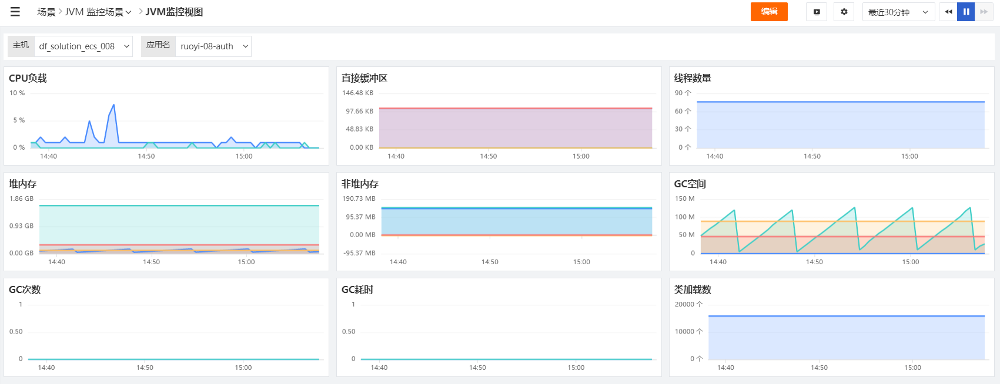
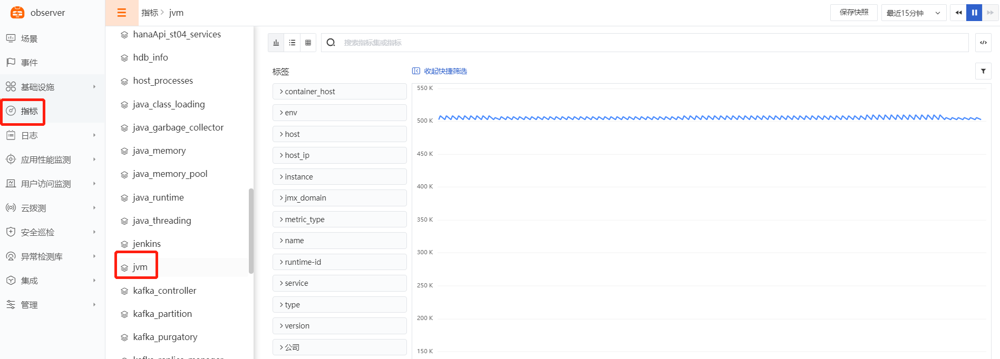

# JVM
---

操作系统支持：Linux / Windows

## 视图预览

JVM性能指标展示：CPU负载、直接缓冲区、线程数量、堆内存、GC次数、类加载数等。



## 安装部署

说明：示例 通过 ddtrace 采集jvm指标，通过 DataKit 内置的statsd接收ddtrace发送过来的jvm指标

### 前置条件

- 服务器 <[安装 DataKit](../datakit/datakit-install.md)>

### 配置实施

#### 指标采集 (必选)


1、 开启ddtrace， 复制sample文件，不需要修改ddtrace.conf

```
cd /usr/local/datakit/conf.d/ddtrace
cp ddtrace.conf.sample ddtrace.conf
```

2、 开启statsd， 复制sample文件，不需要修改statsd.conf   

```
cd /usr/local/datakit/conf.d/statsd
cp statsd.conf.sample statsd.conf
```

3、 开通外网访问(非必选)

如果远程服务器需要访问datakit或者datakit提供给本服务器内的容器中的应用调用，需要把datakit.conf文件中的listen = "localhost:9529"改成listen = "0.0.0.0:9529"

```
vi /usr/local/datakit/conf.d/datakit.conf
```


4、 重启 DataKit

```
systemctl restart datakit
```

指标预览(启动应用后才能上报数据)



## 启动应用

#### JAVA_OPTS声明

```
java  ${JAVA_OPTS} -jar your-app.jar
```

JAVA_OPTS示例

```
-javaagent:/usr/local/datakit/data/dd-java-agent.jar \
 -Ddd.service=<your-service>   \
 -Ddd.env=dev  \
 -Ddd.agent.port=9529  
```

参数说明

```
-Ddd.env：应用的环境类型，选填 
-Ddd.tags：自定义标签，选填    
-Ddd.service：JVM数据来源的应用名称，控制台显示“应用名” 必填  
-Ddd.agent.host=localhost    DataKit地址，选填  
-Ddd.agent.port=9529         DataKit端口，必填  
-Ddd.version:版本，选填 
-Ddd.jmxfetch.check-period 表示采集频率，单位为毫秒，默认true，选填   
-Ddd.jmxfetch.statsd.host=127.0.0.1 statsd 采集器的连接地址同DataKit地址，选填  
-Ddd.jmxfetch.statsd.port=8125 表示DataKit上statsd采集器的UDP连接端口，默认为 8125，选填   
-Ddd.trace.health.metrics.statsd.host=127.0.0.1  自身指标数据采集发送地址同DataKit地址，选填 
-Ddd.trace.health.metrics.statsd.port=8125  自身指标数据采集发送端口，选填   
-Ddd.service.mapping:应用调用的redis、mysql等别名，选填
```

#### jar使用方式

使用java -jar的方式启动jar，默认连接本机上的datakit，如需要连接远程服务器上的datakit，请使用-Ddd.agent.host和-Ddd.jmxfetch.statsd.host指定ip

```
 java -javaagent:/usr/local/datakit/data/dd-java-agent.jar \
 -Ddd.service=<your-service>   \
 -Ddd.env=dev  \
 -Ddd.agent.port=9529  
 -jar <your-app.jar>
```

#### Docker使用方式

1、Dockerfile中的ENTRYPOINT启动参数使用环境变量JAVA_OPTS

```
FROM openjdk:8u292-jdk

ENV jar your-app.jar
ENV workdir /data/app/
RUN mkdir -p ${workdir}
COPY ${jar} ${workdir}
WORKDIR ${workdir}

ENTRYPOINT ["sh", "-ec", "exec java  ${JAVA_OPTS} -jar ${jar} "]
```

2、 制作镜像

```
docker build -t <your-app-image:v1> .
```

3、 上传dd-java-agent.jar放到/tmp/work目录

4、 docker run启动容器

请修改172.16.0.215为您的Datakit的ip地址，替换9299为您应用的端口，替换your-app为您的应用名，替换your-app-image:v1为您的镜像名

```
docker run  -v /tmp/work:/tmp/work -e JAVA_OPTS="-javaagent:/tmp/work/dd-java-agent.jar -Ddd.service=your-app  -Ddd.env=dev  -Ddd.agent.host=172.16.0.215 -Ddd.agent.port=9529  -Ddd.jmxfetch.statsd.host=172.16.0.215  " --name your-app -d -p 9299:9299 your-app-image:v1
```

#### Kubernetes使用方式

1、Dockerfile中的ENTRYPOINT启动参数使用环境变量JAVA_OPTS

```
FROM openjdk:8u292

ENV jar your-app.jar
ENV workdir /data/app/
RUN mkdir -p ${workdir}
COPY ${jar} ${workdir}
WORKDIR ${workdir}
ENTRYPOINT ["sh", "-ec", "exec java ${JAVA_OPTS} -jar ${jar}"]
```

2、制作镜像

```
docker build -t 172.16.0.215:5000/dk/your-app-image:v1 . 
```

3、上传harbor仓库

```
 docker push 172.16.0.215:5000/dk/your-app-image:v1  
```

4、编写应用的deployment.yml

JAVA_OPTS示例说明：-Ddd.tags=container_host:$(PODE_NAME)是把环境变量PODE_NAME的值，传到标签container_host中。 /usr/dd-java-agent/agent/dd-java-agent.jar使用了共享存储的路径，使用了pubrepo.jiagouyun.com/datakit/dk-sidecar:1.0镜像提供dd-java-agent.jar。

```
-javaagent:/usr/dd-java-agent/agent/dd-java-agent.jar -Ddd.service=<your-app-name> 
-Ddd.tags=container_host:$(PODE_NAME)  
-Ddd.env=dev  
-Ddd.agent.host=172.16.0.215 
-Ddd.agent.port=9529  
-Ddd.jmxfetch.statsd.host=172.16.0.215
```

新建your-app-deployment-yaml文件，完整示例内容如下，使用时请替换9299为您应用的端口，替换your-app-name为您的服务名，替换30001为您的应用对外暴露的端口，替换172.16.0.215:5000/dk/your-app-image:v1为您的镜像名：

```
apiVersion: v1
kind: Service
metadata:
  name: your-app-name
  labels:
    app: your-app-name
spec:
  selector:
    app: your-app-name
  ports:
    - protocol: TCP
      port: 9299
      nodePort: 30001
      targetPort: 9299
  type: NodePort
---
apiVersion: apps/v1
kind: Deployment
metadata:
  name: your-app-name
  labels:
    app: your-app-name
spec:
  replicas: 1
  selector:
    matchLabels:
      app: your-app-name
  template:
    metadata:
      labels:
        app: your-app-name
    spec:
      containers:
      - env:
        - name: PODE_NAME
          valueFrom:
            fieldRef:
              fieldPath: metadata.name
        - name: JAVA_OPTS
          value: |-
            -javaagent:/usr/dd-java-agent/agent/dd-java-agent.jar -Ddd.service=<your-app-name> -Ddd.tags=container_host:$(PODE_NAME)  -Ddd.env=dev  -Ddd.agent.port=9529   
        - name: DD_AGENT_HOST
          valueFrom:
            fieldRef:
              apiVersion: v1
              fieldPath: status.hostIP
        name: your-app-name
        image: 172.16.0.215:5000/dk/your-app-image:v1    
        #command: ["sh","-c"]
        ports:
        - containerPort: 9299
          protocol: TCP
        volumeMounts:
        - mountPath: /usr/dd-java-agent/agent
          name: ddagent
      initContainers:
      - command:
        - sh
        - -c
        - set -ex;mkdir -p /ddtrace/agent;cp -r /usr/dd-java-agent/agent/* /ddtrace/agent;
        image: pubrepo.jiagouyun.com/datakit/dk-sidecar:1.0
        imagePullPolicy: Always
        name: ddtrace-agent-sidecar
        volumeMounts:
        - mountPath: /ddtrace/agent
          name: ddagent
      restartPolicy: Always
      volumes:
      - emptyDir: {}
        name: ddagent
      
```

5、部署应用

```
 kubectl apply -f your-app-deployment-yaml
```

## 场景视图

<场景 - 新建仪表板 - 内置模板库 - JVM 监控视图>

## 检测库

暂无

## [指标详解](../datakit/jvm#measurements)


## 最佳实践

<[JVM可观测最佳实践](../best-practices/monitoring/jvm)>

## 故障排查

<[无数据上报排查](../datakit/why-no-data.md)>
